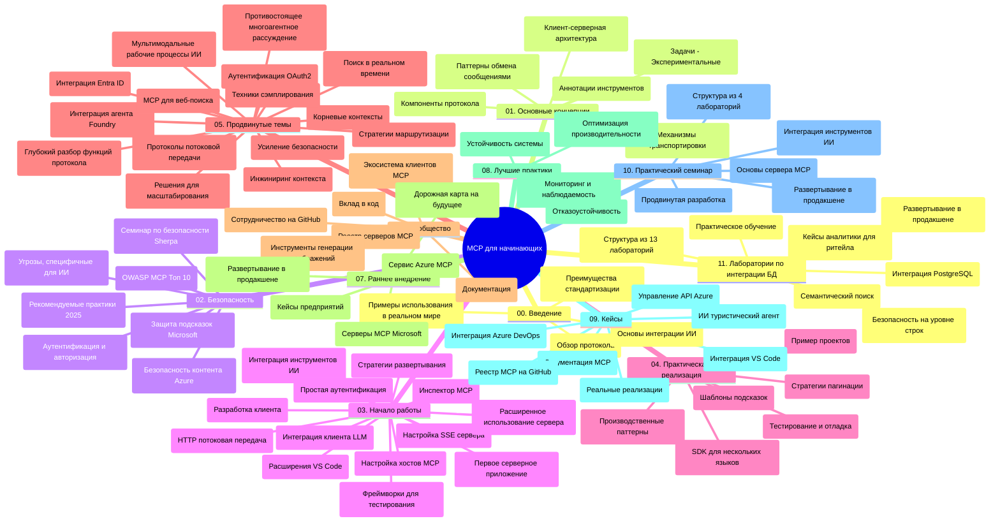

# Протокол контекста модели (MCP) для начинающих - учебное пособие

Это учебное пособие предоставляет обзор структуры и содержания репозитория для учебной программы «Протокол контекста модели (MCP) для начинающих». Используйте это руководство для эффективной навигации по репозиторию и максимального использования доступных ресурсов.

## Обзор репозитория

Протокол контекста модели (MCP) — это стандартизированная платформа для взаимодействия между ИИ-моделями и клиентскими приложениями. Изначально разработанный Anthropic, MCP теперь поддерживается более широкой сообществом MCP через официальную организацию GitHub. Этот репозиторий предоставляет комплексную учебную программу с практическими примерами кода на C#, Java, JavaScript, Python и TypeScript, предназначенную для разработчиков ИИ, архитекторов систем и инженеров-программистов.

## Визуальная карта учебной программы

## Структура репозитория

Репозиторий организован в одиннадцать основных разделов, каждый из которых посвящён различным аспектам MCP:

1. **Введение (00-Introduction/)**
   - Обзор протокола контекста модели
   - Почему стандартизация важна в ИИ-процессах
   - Практические случаи использования и преимущества

2. **Основные концепции (01-CoreConcepts/)**
   - Клиент-серверная архитектура
   - Ключевые компоненты протокола
   - Шаблоны сообщений в MCP

3. **Безопасность (02-Security/)**
   - Угрозы безопасности в системах на основе MCP
   - Лучшие практики защиты внедрений
   - Стратегии аутентификации и авторизации
   - **Полная документация по безопасности**:
     - Лучшие практики безопасности MCP 2025
     - Руководство по реализации Azure Content Safety
     - Контроли и методы безопасности MCP
     - Быстрая справка по лучшим практикам MCP
   - **Ключевые темы безопасности**:
     - Атаки внедрения подсказок и отравления инструментов
     - Перехват сессий и проблемы «запутавшегося заместителя»
     - Уязвимости прохождения токенов
     - Чрезмерные разрешения и контроль доступа
     - Безопасность цепочки поставок для компонентов ИИ
     - Интеграция Microsoft Prompt Shields

4. **Начало работы (03-GettingStarted/)**
   - Настройка и конфигурация окружения
   - Создание базовых серверов и клиентов MCP
   - Интеграция с существующими приложениями
   - Включает разделы для:
     - Первой реализации сервера
     - Разработки клиента
     - Интеграции клиента LLM
     - Интеграции с VS Code
     - SSE-сервера (Server-Sent Events)
     - Продвинутого использования сервера
     - HTTP-стриминга
     - Интеграции AI Toolkit
     - Стратегий тестирования
     - Руководства по развертыванию

5. **Практическая реализация (04-PracticalImplementation/)**
   - Использование SDK на разных языках программирования
   - Отладка, тестирование и методы проверки
   - Создание повторно используемых шаблонов подсказок и рабочих процессов
   - Примеры проектов с реализациями

6. **Продвинутые темы (05-AdvancedTopics/)**
   - Техники инженерии контекста
   - Интеграция агента Foundry
   - Многофункциональные рабочие процессы ИИ
   - Демонстрации аутентификации OAuth2
   - Возможности поиска в реальном времени
   - Потоковая передача в реальном времени
   - Реализация корневых контекстов
   - Стратегии маршрутизации
   - Методы выборки
   - Масштабирование
   - Вопросы безопасности
   - Интеграция безопасности Entra ID
   - Интеграция веб-поиска
   - Противостоящие рассуждения многозадачных агентов (паттерны дебатов)

7. **Вклад сообщества (06-CommunityContributions/)**
   - Как вносить вклад в код и документацию
   - Сотрудничество через GitHub
   - Улучшения и обратная связь от сообщества
   - Использование различных клиентов MCP (Claude Desktop, Cline, VSCode)
   - Работа с популярными MCP-серверами, включая генерацию изображений

8. **Уроки раннего внедрения (07-LessonsfromEarlyAdoption/)**
   - Реальные реализации и истории успеха
   - Создание и развертывание решений на основе MCP
   - Тренды и дорожная карта развития
   - **Руководство Microsoft MCP Servers**: Полное руководство по 10 производственным серверам Microsoft MCP, включая:
     - Microsoft Learn Docs MCP Server
     - Azure MCP Server (15+ специализированных коннекторов)
     - GitHub MCP Server
     - Azure DevOps MCP Server
     - MarkItDown MCP Server
     - SQL Server MCP Server
     - Playwright MCP Server
     - Dev Box MCP Server
     - Microsoft Foundry MCP Server
     - Microsoft 365 Agents Toolkit MCP Server

9. **Лучшие практики (08-BestPractices/)**
   - Настройка производительности и оптимизация
   - Проектирование отказоустойчивых систем MCP
   - Стратегии тестирования и устойчивости

10. **Кейсы (09-CaseStudy/)**
    - **Семь комплексных кейсов**, демонстрирующих универсальность MCP в разных сценариях:
    - **Агенты путешествий Azure AI**: Оркестровка нескольких агентов с Azure OpenAI и AI Search
    - **Интеграция с Azure DevOps**: Автоматизация рабочих процессов с обновлениями данных YouTube
    - **Получение документации в реальном времени**: Python клиент-консоль с HTTP-стримингом
    - **Интерактивный генератор учебного плана**: Веб-приложение Chainlit с разговорным ИИ
    - **Документация в редакторе**: Интеграция VS Code с рабочими процессами GitHub Copilot
    - **Управление API Azure**: Корпоративная API-интеграция с созданием MCP-сервера
    - **Реестр MCP GitHub**: Разработка экосистемы и платформа агентной интеграции
    - Примеры внедрений для корпоративной интеграции, продуктивности разработчиков и развития экосистемы

11. **Практический мастер-класс (10-StreamliningAIWorkflowsBuildingAnMCPServerWithAIToolkit/)**
    - Комплексный практический мастер-класс по сочетанию MCP с AI Toolkit
    - Создание интеллектуальных приложений, связывающих ИИ-модели с реальными инструментами
    - Практические модули по основам, разработке кастомных серверов и стратегиям промышленного развертывания
    - **Структура лабораторий**:
      - Лаборатория 1: Основы MCP сервера
      - Лаборатория 2: Расширенная разработка MCP сервера
      - Лаборатория 3: Интеграция AI Toolkit
      - Лаборатория 4: Промышленное развертывание и масштабирование
    - Обучение через лабораторные работы с пошаговыми инструкциями

12. **Лаборатории интеграции MCP-сервера с базой данных (11-MCPServerHandsOnLabs/)**
    - **Обширный путь обучения из 13 лабораторий** по созданию готовых к промышленному применению MCP-серверов с интеграцией PostgreSQL
    - **Реализация на реальном кейсе Zava Retail для аналитики розничной торговли**
    - **Корпоративные паттерны** включают Row Level Security (RLS), семантический поиск и многопользовательский доступ к данным
    - **Полная структура лабораторий**:
      - **Лаборатории 00-03: Основы** - Введение, Архитектура, Безопасность, Настройка окружения
      - **Лаборатории 04-06: Создание MCP-сервера** - Проектирование БД, Реализация MCP-сервера, Разработка инструментов
      - **Лаборатории 07-09: Расширенные возможности** - Семантический поиск, Тестирование и отладка, Интеграция с VS Code
      - **Лаборатории 10-12: Производство и лучшие практики** - Развертывание, Мониторинг, Оптимизация
    - **Используемые технологии**: FastMCP framework, PostgreSQL, Azure OpenAI, Azure Container Apps, Application Insights
    - **Результаты обучения**: Готовые к промышленному использованию MCP-серверы, паттерны интеграции баз данных, аналитика на базе ИИ, корпоративная безопасность

## Дополнительные ресурсы

Репозиторий включает вспомогательные ресурсы:

- **Папка с изображениями**: Содержит диаграммы и иллюстрации, используемые в учебной программе
- **Переводы**: Поддержка нескольких языков с автоматическим переводом документации
- **Официальные ресурсы MCP**:
  - [Документация MCP](https://modelcontextprotocol.io/)
  - [Спецификация MCP](https://spec.modelcontextprotocol.io/)
  - [Репозиторий MCP на GitHub](https://github.com/modelcontextprotocol)

## Как использовать этот репозиторий

1. **Последовательное обучение**: Следуйте главам по порядку (с 00 по 11) для структурированного изучения.
2. **Фокус на языке программирования**: Если вас интересует конкретный язык, изучите каталоги с образцами для реализации на выбранном языке.
3. **Практическая реализация**: Начните с раздела «Начало работы», чтобы настроить окружение и создать первый MCP-сервер и клиент.
4. **Продвинутое изучение**: После освоения основ переходите к продвинутым темам для расширения знаний.
5. **Взаимодействие с сообществом**: Присоединяйтесь к сообществу MCP через обсуждения на GitHub и каналы Discord для общения с экспертами и разработчиками.

## Клиенты и инструменты MCP

Учебная программа охватывает различные клиенты и инструменты MCP:

1. **Официальные клиенты**:
   - Visual Studio Code
   - MCP в Visual Studio Code
   - Claude Desktop
   - Claude в VSCode
   - Claude API

2. **Клиенты сообщества**:
   - Cline (терминальный)
   - Cursor (редактор кода)
   - ChatMCP
   - Windsurf

3. **Инструменты управления MCP**:
   - MCP CLI
   - MCP Manager
   - MCP Linker
   - MCP Router

## Популярные MCP-серверы

Репозиторий представляет различные MCP-серверы, включая:

1. **Официальные серверы Microsoft MCP**:
   - Microsoft Learn Docs MCP Server
   - Azure MCP Server (15+ специализированных коннекторов)
   - GitHub MCP Server
   - Azure DevOps MCP Server
   - MarkItDown MCP Server
   - SQL Server MCP Server
   - Playwright MCP Server
   - Dev Box MCP Server
   - Microsoft Foundry MCP Server
   - Microsoft 365 Agents Toolkit MCP Server

2. **Официальные референсные серверы**:
   - Filesystem
   - Fetch
   - Memory
   - Sequential Thinking

3. **Генерация изображений**:
   - Azure OpenAI DALL-E 3
   - Stable Diffusion WebUI
   - Replicate

4. **Инструменты разработки**:
   - Git MCP
   - Terminal Control
   - Code Assistant

5. **Специализированные серверы**:
   - Salesforce
   - Microsoft Teams
   - Jira & Confluence

## Вклад в проект

Этот репозиторий приветствует вклад сообщества. См. раздел «Вклад сообщества» для рекомендаций по эффективному внесению вклада в экосистему MCP.

----

*Это учебное пособие было последний раз обновлено 5 февраля 2026 года, отражая последние изменения спецификации MCP от 2025-11-25 и представляет обзор репозитория на эту дату. Содержание репозитория может обновляться после этой даты.*

---

<!-- CO-OP TRANSLATOR DISCLAIMER START -->
**Отказ от ответственности**:
Этот документ был переведен с использованием сервиса машинного перевода [Co-op Translator](https://github.com/Azure/co-op-translator). Несмотря на наши усилия по обеспечению точности, имейте в виду, что автоматический перевод может содержать ошибки или неточности. Оригинальный документ на его исходном языке следует считать авторитетным источником. Для получения критически важной информации рекомендуется обратиться к профессиональному человеческому переводу. Мы не несем ответственности за любые недоразумения или неправильные толкования, возникшие в результате использования этого перевода.
<!-- CO-OP TRANSLATOR DISCLAIMER END -->