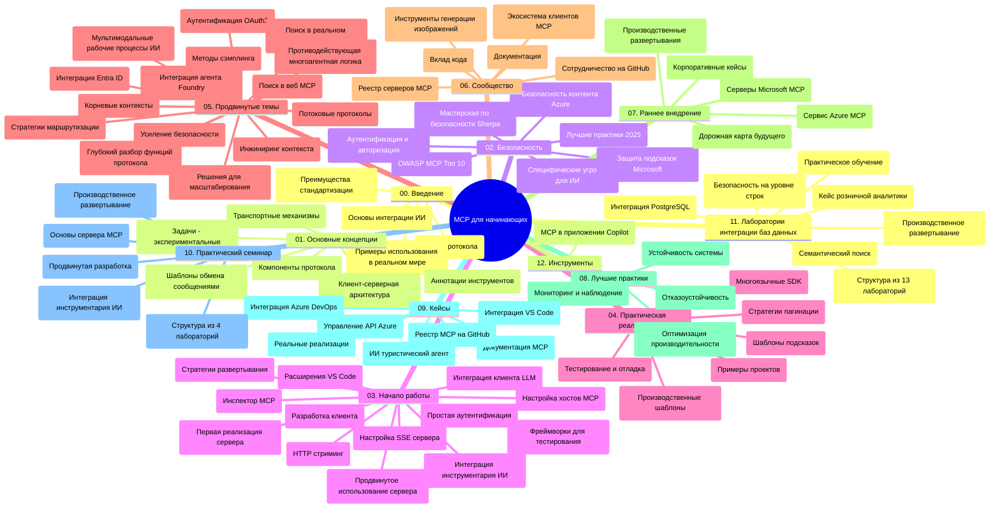

# Протокол Контекста Модели (MCP) для Начинающих - Учебное Руководство

Это учебное руководство представляет обзор структуры и содержимого репозитория для учебной программы «Протокол Контекста Модели (MCP) для Начинающих». Используйте это руководство для эффективной навигации по репозиторию и максимального использования доступных ресурсов.

## Обзор Репозитория

Протокол Контекста Модели (MCP) — стандартизированная структура для взаимодействия между AI-моделями и клиентскими приложениями. Изначально созданный компанией Anthropic, MCP теперь поддерживается широким сообществом MCP через официальную организацию на GitHub. Этот репозиторий предоставляет комплексную учебную программу с практическими примерами кода на C#, Java, JavaScript, Python и TypeScript, разработанную для разработчиков AI, системных архитекторов и инженеров-программистов.

## Визуальная Карта Учебной Программы

## Структура Репозитория

Репозиторий организован в двенадцать основных разделов, каждый из которых сосредоточен на различных аспектах MCP:

1. **Введение (00-Introduction/)**
   - Обзор Протокола Контекста Модели
   - Почему стандартизация важна в AI-пайплайнах
   - Практические случаи использования и преимущества

2. **Основные Концепции (01-CoreConcepts/)**
   - Клиент-серверная архитектура
   - Ключевые компоненты протокола
   - Шаблоны сообщений в MCP

3. **Безопасность (02-Security/)**
   - Угрозы безопасности в системах на основе MCP
   - Лучшие практики для обеспечения безопасности реализаций
   - Стратегии аутентификации и авторизации
   - **Всесторонняя документация по безопасности**:
     - MCP Security Best Practices 2025
     - Руководство по реализации Azure Content Safety
     - Контроли и техники безопасности MCP
     - Быстрая справка по лучшим практикам MCP
   - **Ключевые темы безопасности**:
     - Инъекция промтов и атаки отравления инструментов
     - Перехват сессий и проблемы «запутанного заместителя»
     - Уязвимости передачи токенов
     - Чрезмерные разрешения и контроль доступа
     - Безопасность цепочки поставок компонентов AI
     - Интеграция Microsoft Prompt Shields

4. **Начало Работы (03-GettingStarted/)**
   - Настройка среды и конфигурация
   - Создание базовых серверов и клиентов MCP
   - Интеграция с существующими приложениями
   - Включает разделы для:
     - Первой реализации сервера
     - Разработки клиентов
     - Интеграции LLM-клиента
     - Интеграции с VS Code
     - Серверов Server-Sent Events (SSE)
     - Продвинутого использования сервера
     - HTTP-стриминга
     - Интеграции AI Toolkit
     - Стратегий тестирования
     - Руководства по развертыванию

5. **Практическая Реализация (04-PracticalImplementation/)**
   - Использование SDK на разных языках программирования
   - Отладка, тестирование и методы проверки
   - Создание многоразовых шаблонов промтов и рабочих процессов
   - Примеры проектов с реализациями

6. **Продвинутые Темы (05-AdvancedTopics/)**
   - Методы инженерии контекста
   - Интеграция агентной платформы Foundry
   - Мультимодальные AI-рабочие процессы
   - Демонстрации аутентификации OAuth2
   - Возможности поиска в реальном времени
   - Стриминг в реальном времени
   - Реализация корневых контекстов
   - Стратегии маршрутизации
   - Техники семплинга
   - Подходы масштабирования
   - Вопросы безопасности
   - Интеграция безопасности Entra ID
   - Интеграция веб-поиска
   - Противодействие многоагентному рассуждению (паттерны дебатов)

7. **Вклад Сообщества (06-CommunityContributions/)**
   - Как вносить код и документацию
   - Сотрудничество через GitHub
   - Улучшения и обратная связь от сообщества
   - Использование различных клиентов MCP (Claude Desktop, Cline, VSCode)
   - Работа с популярными серверами MCP, включая генерацию изображений

8. **Уроки Раннего Применения (07-LessonsfromEarlyAdoption/)**
   - Реальные реализации и успешные кейсы
   - Создание и развертывание решений на базе MCP
   - Тенденции и дорожная карта на будущее
   - **Руководство по серверам Microsoft MCP**: всестороннее руководство по 10 готовым к производству серверам Microsoft MCP, включая:
     - Microsoft Learn Docs MCP Server
     - Azure MCP Server (более 15 специализированных коннекторов)
     - GitHub MCP Server
     - Azure DevOps MCP Server
     - MarkItDown MCP Server
     - SQL Server MCP Server
     - Playwright MCP Server
     - Dev Box MCP Server
     - Microsoft Foundry MCP Server
     - Microsoft 365 Agents Toolkit MCP Server

9. **Лучшие Практики (08-BestPractices/)**
   - Настройка производительности и оптимизация
   - Проектирование отказоустойчивых систем MCP
   - Стратегии тестирования и устойчивости

10. **Кейсы (09-CaseStudy/)**
    - **Семь полноценных кейс-стади**, демонстрирующих универсальность MCP в различных сценариях:
    - **Azure AI Турагентства**: оркестровка мультиагентов с Azure OpenAI и AI Search
    - **Интеграция Azure DevOps**: автоматизация рабочих процессов с обновлениями данных YouTube
    - **Доступ к документации в реальном времени**: клиент-консоль Python с HTTP-стримингом
    - **Интерактивный генератор учебных планов**: веб-приложение Chainlit с разговорным AI
    - **Документация в редакторе**: интеграция VS Code с рабочими процессами GitHub Copilot
    - **Управление API Azure**: интеграция корпоративного API с созданием MCP сервера
    - **Реестр MCP GitHub**: развитие экосистемы и платформа для агентной интеграции
    - Примеры реализации охватывают интеграцию в корпоративной среде, повышение продуктивности разработчиков и развитие экосистемы

11. **Практический Мастер-класс (10-StreamliningAIWorkflowsBuildingAnMCPServerWithAIToolkit/)**
    - Всеобъемлющий мастер-класс, объединяющий MCP и AI Toolkit
    - Создание интеллектуальных приложений, связывающих AI-модели с реальными инструментами
    - Практические модули, охватывающие основы, разработку пользовательских серверов и стратегии производственного развертывания
    - **Структура лабораторий**:
      - Лаборатория 1: Основы MCP сервера
      - Лаборатория 2: Продвинутая разработка MCP сервера
      - Лаборатория 3: Интеграция AI Toolkit
      - Лаборатория 4: Производственное развертывание и масштабирование
    - Лабораторно-ориентированный подход с пошаговыми инструкциями

12. **Лаборатории Интеграции MCP Сервера с Базами Данных (11-MCPServerHandsOnLabs/)**
    - **Полноценный учебный путь из 13 лабораторий** по созданию MCP серверов готовых к производству с интеграцией PostgreSQL
    - **Реализация на примере аналитики розничной торговли Zava Retail**
    - **Корпоративные паттерны** включая Row Level Security (RLS), семантический поиск и мультиарендный доступ к данным
    - **Полная структура лабораторий**:
      - **Лаборатории 00-03: Основы** - Введение, Архитектура, Безопасность, Настройка окружения
      - **Лаборатории 04-06: Построение MCP сервера** - Проектирование базы данных, реализация MCP сервера, разработка инструментов
      - **Лаборатории 07-09: Продвинутые функции** - Семантический поиск, тестирование и отладка, интеграция с VS Code
      - **Лаборатории 10-12: Производство и лучшие практики** - Развертывание, мониторинг, оптимизация
    - **Используемые технологии**: FastMCP framework, PostgreSQL, Azure OpenAI, Azure Container Apps, Application Insights
    - **Результаты обучения**: MCP сервера готовые к производству, паттерны интеграции баз данных, аналитика с AI, корпоративная безопасность

13. **Инструменты (12-tooling/)**
    - Изучение использования MCP в приложении Copilot и других инструментах

## Дополнительные Ресурсы

Репозиторий содержит вспомогательные ресурсы:

- **Папка изображений**: диаграммы и иллюстрации, используемые в учебной программе
- **Переводы**: поддержка нескольких языков с автоматическим переводом документации
- **Официальные ресурсы MCP**:
  - [Документация MCP](https://modelcontextprotocol.io/)
  - [Спецификация MCP](https://spec.modelcontextprotocol.io/)
  - [Репозиторий MCP на GitHub](https://github.com/modelcontextprotocol)

## Как Использовать Этот Репозиторий

1. **Пошаговое обучение**: Следуйте главам последовательно (от 00 до 11) для структурированного изучения.
2. **Фокус на языках программирования**: Если вас интересует конкретный язык, изучите каталоги с примерами реализации на нужном языке.
3. **Практическая реализация**: Начните с раздела «Начало работы», чтобы настроить среду и создать свой первый сервер и клиент MCP.
4. **Продвинутое исследование**: После освоения основ перейдите к продвинутым темам для расширения знаний.
5. **Вовлечение сообщества**: Присоединяйтесь к сообществу MCP через обсуждения на GitHub и каналы Discord для общения с экспертами и коллегами разработчиками.

## Клиенты и Инструменты MCP

Учебная программа охватывает различные клиенты и инструменты MCP:

1. **Официальные клиенты**:
   - Visual Studio Code
   - MCP в Visual Studio Code
   - Claude Desktop
   - Claude в VSCode
   - Claude API

2. **Клиенты сообщества**:
   - Cline (терминальный клиент)
   - Cursor (редактор кода)
   - ChatMCP
   - Windsurf

3. **Инструменты управления MCP**:
   - MCP CLI
   - MCP Manager
   - MCP Linker
   - MCP Router

## Популярные MCP Сервера

Репозиторий представляет различные серверы MCP, включая:

1. **Официальные серверы Microsoft MCP**:
   - Microsoft Learn Docs MCP Server
   - Azure MCP Server (более 15 специализированных коннекторов)
   - GitHub MCP Server
   - Azure DevOps MCP Server
   - MarkItDown MCP Server
   - SQL Server MCP Server
   - Playwright MCP Server
   - Dev Box MCP Server
   - Microsoft Foundry MCP Server
   - Microsoft 365 Agents Toolkit MCP Server

2. **Официальные референсные серверы**:
   - Filesystem
   - Fetch
   - Memory
   - Sequential Thinking

3. **Генерация изображений**:
   - Azure OpenAI DALL-E 3
   - Stable Diffusion WebUI
   - Replicate

4. **Инструменты для разработки**:
   - Git MCP
   - Terminal Control
   - Code Assistant

5. **Специализированные серверы**:
   - Salesforce
   - Microsoft Teams
   - Jira & Confluence

## Вклад в Репозиторий

Этот репозиторий приветствует вклад от сообщества. См. раздел "Вклад Сообщества" для руководства по эффективному внесению изменений в экосистему MCP.

----

*Это учебное руководство в последний раз обновлялось 5 февраля 2026 года, отражая последнюю Спецификацию MCP от 25 ноября 2025 года и предоставляет обзор репозитория на эту дату. Содержание репозитория может обновляться после этой даты.*

---

<!-- CO-OP TRANSLATOR DISCLAIMER START -->
**Отказ от ответственности**:
Этот документ был переведен с использованием сервиса машинного перевода [Co-op Translator](https://github.com/Azure/co-op-translator). Несмотря на наши усилия по обеспечению точности, имейте в виду, что автоматический перевод может содержать ошибки или неточности. Оригинальный документ на его исходном языке следует считать авторитетным источником. Для получения критически важной информации рекомендуется обратиться к профессиональному человеческому переводу. Мы не несем ответственности за любые недоразумения или неправильные толкования, возникшие в результате использования этого перевода.
<!-- CO-OP TRANSLATOR DISCLAIMER END -->