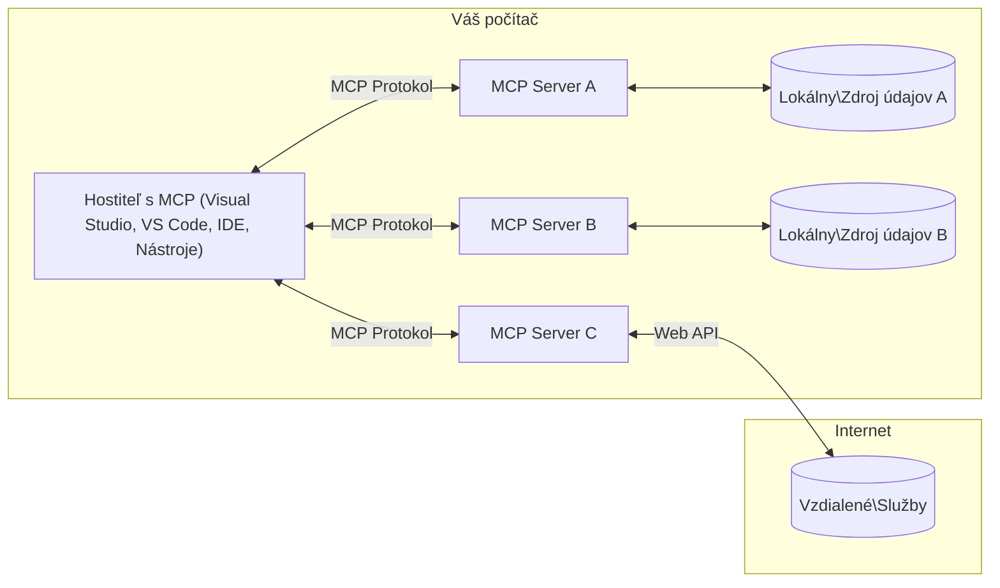

# Základné koncepty MCP: Ovládnutie Model Context Protocol pre integráciu AI

[](https://youtu.be/earDzWGtE84)

_(Kliknite na obrázok vyššie pre zobrazenie videa tejto lekcie)_

[Model Context Protocol (MCP)](https://github.com/modelcontextprotocol) je výkonný, štandardizovaný rámec, ktorý optimalizuje komunikáciu medzi veľkými jazykovými modelmi (LLM) a externými nástrojmi, aplikáciami a zdrojmi dát.  
Tento sprievodca vás prevedie základnými konceptmi MCP. Naučíte sa o jeho klient-server architektúre, kľúčových komponentoch, mechanizmoch komunikácie a osvedčených implementačných postupoch.

- **Výslovný súhlas používateľa**: Všetky prístupy k dátam a operácie vyžadujú výslovný súhlas používateľa pred vykonaním. Používatelia musia jasne rozumieť, aké údaje budú sprístupnené a aké akcie budú vykonané, s detailnou kontrolou oprávnení a autorizácií.

- **Ochrana súkromia dát**: Používateľské dáta sú sprístupnené len so súhlasom a musia byť chránené robustnými prístupovými kontrolami počas celého životného cyklu interakcie. Implementácie musia zabrániť neoprávnenému prenosu dát a udržiavať prísne hranice ochrany súkromia.

- **Bezpečnosť vykonávania nástrojov**: Každé zavolanie nástroja vyžaduje výslovný používateľský súhlas s jasným pochopením funkčnosti nástroja, parametrov a možného dopadu. Robustné bezpečnostné hranice musia zabrániť nechcenému, nebezpečnému alebo škodlivému vykonávaniu nástrojov.

- **Bezpečnosť transportnej vrstvy**: Všetky komunikačné kanály by mali používať vhodné mechanizmy šifrovania a autentifikácie. Vzdialené pripojenia by mali implementovať bezpečné transportné protokoly a správu prihlasovacích údajov.

#### Implementačné usmernenia:

- **Správa oprávnení**: Implementovať jemnozrnné systémy oprávnení, ktoré umožňujú používateľom kontrolovať prístupnosť serverov, nástrojov a zdrojov  
- **Autentifikácia a autorizácia**: Používať bezpečné metódy autentifikácie (OAuth, API kľúče) s riadnou správou tokenov a expirácií  
- **Validácia vstupov**: Overovať všetky parametre a vstupné dáta podľa definovaných schém na zabránenie útokom typu injection  
- **Auditovanie protokolov**: Viesť komplexné záznamy všetkých operácií pre bezpečnostný dohľad a súlad  

## Prehľad

Táto lekcia skúma základnú architektúru a komponenty, ktoré tvoria ekosystém Model Context Protocol (MCP). Naučíte sa o klient-server architektúre, kľúčových častiach a komunikačných mechanizmoch, ktoré poháňajú interakcie MCP.

## Kľúčové učebné ciele

Na konci tejto lekcie budete:

- Rozumieť architektúre klient-server MCP.  
- Identifikovať úlohy a zodpovednosti Hostiteľov, Klientov a Serverov.  
- Analyzovať základné vlastnosti, ktoré robia MCP flexibilnou integračnou vrstvou.  
- Naučiť sa, ako prebieha tok informácií v ekosystéme MCP.  
- Získať praktické poznatky cez ukážky kódu v .NET, Java, Python a JavaScript.  

## Architektúra MCP: Hlbší pohľad

Ekosystém MCP je postavený na modeli klient-server. Táto modulárna štruktúra umožňuje AI aplikáciám efektívne komunikovať s nástrojmi, databázami, API a kontextuálnymi zdrojmi. Rozoberme túto architektúru na jej základné zložky.

V jadre MCP nasleduje klient-server architektúru, kde hostiteľská aplikácia môže pripojiť viaceré servery:


- **MCP Hostitelia**: Programy ako VSCode, Claude Desktop, IDE alebo AI nástroje, ktoré chcú pristupovať k dátam cez MCP  
- **MCP Klienti**: Protokol klienti, ktorí udržiavajú 1:1 spojenia so servermi  
- **MCP Servery**: Ľahké programy, ktoré exponujú špecifické schopnosti cez štandardizovaný Model Context Protocol  
- **Lokálne zdroje dát**: Súbory, databázy a služby vášho počítača, ku ktorým MCP servery majú bezpečný prístup  
- **Vzdialené služby**: Externé systémy dostupné cez internet, ku ktorým sa MCP servery pripájajú cez API.  

MCP protokol je vyvíjajúci sa štandard používajúci verziovanie podľa dátumu (formát RRRR-MM-DD). Aktuálna verzia protokolu je **2025-11-25**. Najnovšie aktualizácie nájdete v [špecifikácii protokolu](https://modelcontextprotocol.io/specification/2025-11-25/)

### 1. Hostitelia

V Model Context Protocol (MCP) sú **Hostitelia** AI aplikácie, ktoré slúžia ako primárne rozhranie, cez ktoré používatelia komunikujú s protokolom. Hostitelia koordinujú a spravujú pripojenia k viacerým MCP serverom vytváraním vyhradených MCP klientov pre každé serverové pripojenie. Príklady Hostiteľov:

- **AI aplikácie**: Claude Desktop, Visual Studio Code, Claude Code  
- **Vývojové prostredia**: IDE a editory kódu s MCP integráciou  
- **Vlastné aplikácie**: Účelovo vytvorené AI agenti a nástroje  

**Hostitelia** sú aplikácie, ktoré koordinujú interakcie s AI modelmi. Ich úloha je:

- **Orchestrácia AI modelov**: Vykonávajú alebo interagujú s LLM na generovanie odpovedí a koordinujú AI pracovné toky  
- **Správa klientskych pripojení**: Vytvárajú a udržiavajú jedného MCP klienta na každé serverové pripojenie  
- **Riadenie používateľského rozhrania**: Zabezpečujú tok konverzácie, používateľské interakcie a prezentáciu odpovedí  
- **Vynucovanie bezpečnosti**: Kontrolujú oprávnenia, bezpečnostné obmedzenia a autentifikáciu  
- **Riadenie súhlasu používateľa**: Spravujú súhlas používateľa pre zdieľanie dát a vykonávanie nástrojov  

### 2. Klienti

**Klienti** sú základné komponenty, ktoré udržiavajú vyhradené jedinečné spojenia medzi Hostiteľmi a MCP servermi. Každý MCP klient je vytvorený Hostiteľom na pripojenie k špecifickému MCP serveru, čím zabezpečuje organizované a bezpečné komunikačné kanály. Viacerí klienti umožňujú Hostiteľom pripojiť sa naraz k viacerým serverom.

**Klienti** sú pripojovacie komponenty v rámci hostiteľskej aplikácie. Ich funkcie:

- **Protokolová komunikácia**: Posielajú JSON-RPC 2.0 požiadavky serverom s promptami a inštrukciami  
- **Vyjednávanie schopností**: Počas inicializácie vyjednávajú podporované funkcie a verzie protokolu so servermi  
- **Vykonávanie nástrojov**: Spravujú požiadavky na vykonávanie nástrojov od modelov a spracovávajú odpovede  
- **Aktualizácie v reálnom čase**: Spracovávajú notifikácie a aktualizácie zo serverov  
- **Spracovanie odpovedí**: Formátujú a spracovávajú odpovede serverov pre zobrazenie používateľom  

### 3. Servery

**Servery** sú programy, ktoré poskytujú kontext, nástroje a schopnosti MCP klientom. Môžu bežať lokálne (na rovnakom zariadení ako Hostiteľ) alebo vzdialene (na externých platformách) a sú zodpovedné za spracovanie požiadaviek klientov a poskytovanie štruktúrovaných odpovedí. Servery exponujú špecifickú funkcionalitu cez štandardizovaný Model Context Protocol.

**Servery** sú služby, ktoré poskytujú kontext a schopnosti. Robia to:

- **Registrácia funkcií**: Registrujú a sprístupňujú dostupné primitivá (zdroje, prompta, nástroje) klientom  
- **Spracovanie požiadaviek**: Prijímajú a vykonávajú volania nástrojov, požiadavky na zdroje a prompta od klientov  
- **Poskytovanie kontextu**: Poskytujú kontextové informácie a dáta na zlepšenie odpovedí modelov  
- **Správa stavu**: Udržiavajú stav relácie a riešia stavové interakcie podľa potreby  
- **Notifikácie v reálnom čase**: Posielajú notifikácie o zmenách schopností a aktualizáciách pripojeným klientom  

Servery môže vyvíjať ktokoľvek na rozšírenie schopností modelov so špecializovanou funkcionalitou a podporujú nasadenie ako lokálne, tak aj vzdialené.

### 4. Serverové primitivá

Servery v Model Context Protocol (MCP) poskytujú tri základné **primitíva**, ktoré definujú fundamentálne stavebné bloky pre bohaté interakcie medzi klientmi, hostiteľmi a jazykovými modelmi. Tieto primitivá určujú typy kontextových informácií a akcií dostupných cez protokol.

MCP servery môžu exponovať ľubovoľnú kombináciu z nasledujúcich troch základných primitiv:

#### Zdroje

**Zdroje** sú dátové zdroje poskytujúce kontextové informácie AI aplikáciám. Reprezentujú statický alebo dynamický obsah, ktorý môže zlepšiť porozumenie modelu a rozhodovanie:

- **Kontextové dáta**: Štruktúrované informácie a kontext pre spotrebu AI modelom  
- **Bázy vedomostí**: Repozitáre dokumentov, články, návody a výskumné práce  
- **Lokálne zdroje dát**: Súbory, databázy a lokálne systémové informácie  
- **Externé dáta**: Odpovede z API, webové služby, vzdialené systémové dáta  
- **Dynamický obsah**: Dáta v reálnom čase, ktoré sa aktualizujú na základe externých podmienok  

Zdroje sú identifikované URI a podporujú vyhľadávanie cez metódy `resources/list` a získavanie cez `resources/read`:

```text
file://documents/project-spec.md
database://production/users/schema
api://weather/current
```

#### Prompta

**Prompta** sú znovu použiteľné šablóny, ktoré pomáhajú štruktúrovať interakcie s jazykovými modelmi. Poskytujú štandardizované vzory interakcií a šablónové pracovné toky:

- **Interakcie založené na šablónach**: Predštruktúrované správy a začiatky konverzácií  
- **Šablóny pracovných tokov**: Štandardizované sekvencie pre bežné úlohy a interakcie  
- **Príklady few-shot**: Šablóny s príkladmi na inštrukcie modelu  
- **Systémové prompta**: Základné prompta definujúce správanie modelu a kontext  
- **Dynamické šablóny**: Parametrizované prompta, ktoré sa prispôsobujú špecifickému kontextu  

Prompta podporujú substitúciu premenných a môžu byť vyhľadávané cez `prompts/list` a získavané cez `prompts/get`:

```markdown
Generate a {{task_type}} for {{product}} targeting {{audience}} with the following requirements: {{requirements}}
```

#### Nástroje

**Nástroje** sú vykonateľné funkcie, ktoré môžu AI modely vyvolať na vykonanie špecifických akcií. Reprezentujú "slovesá" ekosystému MCP, umožňujú modelom interakciu s externými systémami:

- **Vykonateľné funkcie**: Diskrétne operácie, ktoré môžu modely volat s konkrétnymi parametrami  
- **Integrácia externých systémov**: Volania API, dotazy do databázy, operácie so súbormi, výpočty  
- **Unikátna identita**: Každý nástroj má jedinečný názov, popis a schému parametrov  
- **Štruktúrované vstupy a výstupy**: Nástroje prijímajú validované parametre a vracajú štruktúrované, typované odpovede  
- **Akčné možnosti**: Umožňujú modelom vykonávať reálne akcie a získavať živé dáta  

Nástroje sú definované pomocou JSON Schémy pre validáciu parametrov, objavujú sa cez `tools/list` a vykonávajú sa cez `tools/call`. Môžu obsahovať aj **ikony** ako doplnkové metadáta pre lepšiu prezentáciu v UI.

**Anotácie nástrojov**: Nástroje podporujú behaviorálne anotácie (napr. `readOnlyHint`, `destructiveHint`), ktoré popisujú, či je nástroj len na čítanie alebo destruktívny, čo pomáha klientom robiť informované rozhodnutia o vykonávaní.

Príklad definície nástroja:

```typescript
server.tool(
  "search_products", 
  {
    query: z.string().describe("Search query for products"),
    category: z.string().optional().describe("Product category filter"),
    max_results: z.number().default(10).describe("Maximum results to return")
  }, 
  async (params) => {
    // Vykonajte vyhľadávanie a vráťte štruktúrované výsledky
    return await productService.search(params);
  }
);
```

## Klientské primitivá

V Model Context Protocol (MCP) môžu **klienti** exponovať primitivá, ktoré umožňujú serverom požadovať ďalšie schopnosti od hostiteľskej aplikácie. Tieto klientské primitivá umožňujú bohatšie, interaktívnejšie implementácie serverov, ktoré môžu pristupovať ku schopnostiam AI modelu a interakciám používateľa.

### Sampling

**Sampling** umožňuje serverom žiadať dokončenia jazykového modelu z AI aplikácie klienta. Toto primitivum umožňuje serverom pristupovať k schopnostiam LLM bez potreby zabudovania vlastných závislostí na modeli:

- **Modelovo nezávislý prístup**: Servery môžu žiadať dokončenia bez zahrnutia LLM SDK alebo správy prístupu k modelu  
- **AI iniciovaná serverom**: Umožňuje serverom autonómne generovať obsah pomocou modelu klienta  
- **Rekurzívne LLM interakcie**: Podpora zložitých scénarov, kde servery potrebujú pomoc AI pri spracovaní  
- **Generovanie dynamického obsahu**: Servery môžu vytvárať kontextové odpovede pomocou modelu hostiteľa  
- **Podpora volania nástrojov**: Servery môžu zahŕňať parametre `tools` a `toolChoice`, aby umožnili modelu klienta počas sampling-u volať nástroje  

Sampling sa iniciuje metódou `sampling/complete`, kde servery posielajú žiadosti o dokončenie klientom.

### Roots

**Roots** poskytujú štandardizovaný spôsob, ako môžu klienti vystaviť hranice súborového systému serverom, pomáhajúc serverom pochopiť, ku ktorým adresárom a súborom majú prístup:

- **Hranice súborového systému**: Definujú hranice, v ktorých môžu servery operovať v rámci súborového systému  
- **Kontrola prístupu**: Pomáhajú serverom pochopiť, ku ktorým adresárom a súborom majú povolenie prístupu  
- **Dynamické aktualizácie**: Klienti môžu notifikovať servery o zmene zoznamu roots  
- **Identifikácia na základe URI**: Roots používajú URI s prefixom `file://` na identifikáciu prístupných adresárov a súborov  

Roots sú objavované metódou `roots/list` a klienti posielajú notifikácie `notifications/roots/list_changed` pri zmene roots.

### Elicitation

**Elicitation** umožňuje serverom žiadať ďalšie informácie alebo potvrdenia od používateľov cez klientské rozhranie:

- **Žiadosti o vstup od používateľa**: Servery môžu žiadať dodatočné informácie, keď sú potrebné pre vykonanie nástroja  
- **Potvrdzovacie dialógy**: Žiadosť o súhlas používateľa pre citlivé alebo dopadové operácie  
- **Interaktívne pracovné toky**: Umožňujú serverom vytvárať krok za krokom používateľské interakcie  
- **Dynamické zhromažďovanie parametrov**: Zber chýbajúcich alebo voliteľných parametrov počas vykonávania nástroja  

Žiadosti na elicitation sa robia metódou `elicitation/request` na zbieranie vstupov cez klientské rozhranie.

**Elicitation v režime URL**: Servery môžu tiež žiadať interakcie s používateľom cez URL, čím umožňujú používateľom smerovať sa na externé webové stránky pre autentifikáciu, potvrdenie alebo zadanie dát.

### Logging

**Logging** umožňuje serverom posielať klientom štruktúrované logovacie správy pre ladenie, monitorovanie a prevádzkovú viditeľnosť:

- **Podpora ladenia**: Umožňuje serverom poskytovať detailné záznamy vykonávania pre riešenie problémov  
- **Prevádzkové monitorovanie**: Posielajú klientom stavové aktualizácie a metriky výkonu  
- **Hlásenie chýb**: Poskytujú detailný kontext chýb a diagnostické informácie  
- **Auditné stopy**: Vytvárajú komplexné záznamy operácií a rozhodnutí servera  

Logovacie správy sú posielané klientom na zabezpečenie transparentnosti operácií servera a uľahčenie ladenia.

## Tok informácií v MCP

Model Context Protocol (MCP) definuje štruktúrovaný tok informácií medzi hostiteľmi, klientmi, servermi a modelmi. Pochopenie tohto toku pomáha objasniť, ako sa spracúvajú používateľské požiadavky a ako sú externé nástroje a dáta integrované do odpovedí modelu.
- **Host iniciuje pripojenie**  
  Hostiteľská aplikácia (napríklad IDE alebo rozhranie chatu) nadviaže pripojenie k MCP serveru, zvyčajne cez STDIO, WebSocket alebo iný podporovaný transport.

- **Vyjednávanie schopností**  
  Klient (vložený do hostiteľa) a server si vymieňajú informácie o svojich podporovaných funkciách, nástrojoch, zdrojoch a verziách protokolu. To zabezpečuje, že obe strany rozumejú dostupným schopnostiam pre reláciu.

- **Požiadavka používateľa**  
  Používateľ komunikuje s hostiteľom (napr. zadá výzvu alebo príkaz). Hostiteľ zozbiera tento vstup a odovzdá ho klientovi na spracovanie.

- **Použitie zdroja alebo nástroja**  
  - Klient môže požiadať server o ďalší kontext alebo zdroje (napríklad súbory, databázové záznamy alebo články zo znalostnej databázy) na obohatenie modelového porozumenia.
  - Ak model rozhodne, že je potrebné použiť nástroj (napr. na získanie údajov, vykonanie výpočtu alebo volanie API), klient odošle na server požiadavku na spustenie nástroja, špecifikujúc názov nástroja a parametre.

- **Vykonanie na serveri**  
  Server prijme požiadavku na zdroj alebo nástroj, vykoná potrebné operácie (napríklad spustenie funkcie, dotaz do databázy alebo získanie súboru) a výsledky v štruktúrovanom formáte vráti klientovi.

- **Generovanie odpovede**  
  Klient integruje odpovede servera (údaje zo zdrojov, výstupy nástrojov a pod.) do prebiehajúcej interakcie modelu. Model použije tieto informácie na vytvorenie komplexnej a kontextovo relevantnej odpovede.

- **Prezentácia výsledku**  
  Hostiteľ prijme konečný výstup od klienta a zobrazí ho používateľovi, často vrátane textu generovaného modelom a akýchkoľvek výsledkov z vykonania nástrojov alebo vyhľadávania zdrojov.

Tento tok umožňuje MCP podporovať pokročilé, interaktívne a kontextovo uvedomelé AI aplikácie tým, že hladko prepája modely s externými nástrojmi a zdrojmi dát.

## Architektúra protokolu a vrstvy

MCP pozostáva z dvoch odlišných architektonických vrstiev, ktoré spolupracujú na poskytnutí kompletného komunikačného rámca:

### Dátová vrstva

**Dátová vrstva** implementuje jadro protokolu MCP pomocou **JSON-RPC 2.0** ako základu. Táto vrstva definuje štruktúru správ, sémantiku a vzory interakcie:

#### Hlavné komponenty:

- **Protokol JSON-RPC 2.0**: Všetka komunikácia používa štandardizovaný formát JSON-RPC 2.0 pre volania metód, odpovede a notifikácie
- **Správa životného cyklu**: Rieši inicializáciu pripojenia, vyjednávanie schopností a ukončenie relácie medzi klientmi a servermi
- **Serverové primitíva**: Umožňuje serverom poskytovať základnú funkcionalitu cez nástroje, zdroje a výzvy
- **Klientské primitíva**: Umožňuje serverom požadovať vzorkovanie z LLM, získavanie vstupu od používateľa a odosielanie logov
- **Notifikácie v reálnom čase**: Podporuje asynchrónne notifikácie pre dynamické aktualizácie bez potreby opakovaného volania (polling)

#### Kľúčové vlastnosti:

- **Vyjednávanie verzie protokolu**: Používa dátumovo založenú verziu (RRRR-MM-DD) na zabezpečenie kompatibility
- **Objavovanie schopností**: Klienti a servery si počas inicializácie vymieňajú informácie o podporovaných funkciách
- **Stavové relácie**: Udržiava stav pripojenia cez viacero interakcií pre kontinuitu kontextu

### Transportná vrstva

**Transportná vrstva** spravuje komunikačné kanály, rámcovanie správ a autentifikáciu medzi účastníkmi MCP:

#### Podporované transportné mechanizmy:

1. **STDIO transport**:
   - Používa štandardné vstupy/výstupy na priame komunikovanie procesov
   - Optimálny pre lokálne procesy na rovnakom zariadení bez sieťovej réžie
   - Bežne používaný pre lokálne implementácie MCP serverov

2. **Streamovateľný HTTP transport**:
   - Používa HTTP POST pre správy klient→server  
   - Voliteľné Server-Sent Events (SSE) pre streamovanie server→klient
   - Umožňuje komunikáciu so vzdialeným serverom cez siete
   - Podporuje štandardnú HTTP autentifikáciu (bearer tokeny, API kľúče, vlastné hlavičky)
   - MCP odporúča OAuth pre bezpečnú tokenovú autentifikáciu

#### Abstrakcia transportu:

Transportná vrstva abstraktne oddeľuje detaily komunikácie od dátovej vrstvy, čo umožňuje používať rovnaký formát správ JSON-RPC 2.0 vo všetkých transportných mechanizmoch. Táto abstrakcia umožňuje aplikáciám bez problémov prepínať medzi lokálnymi a vzdialenými servermi.

### Bezpečnostné úvahy

Implementácie MCP musia dodržiavať zásadné bezpečnostné princípy, aby zaistili bezpečné, dôveryhodné a zabezpečené interakcie vo všetkých operáciách protokolu:

- **Súhlas a kontrola používateľa**: Používatelia musia poskytnúť explicitný súhlas pred prístupom k akýmkoľvek údajom alebo vykonaním operácií. Mali by mať jasnú kontrolu nad tým, ktoré údaje sa zdieľajú a ktoré akcie sú povolené, podporené intuitívnymi používateľskými rozhraniami na kontrolu a schvaľovanie aktivít.

- **Ochrana údajov**: Údaje používateľov by mali byť sprístupnené iba s výslovným súhlasom a musia byť chránené vhodnými prístupovými kontrolami. Implementácie MCP musia zabrániť neoprávnenému prenosu údajov a zabezpečiť zachovanie súkromia v priebehu všetkých interakcií.

- **Bezpečnosť nástrojov**: Pred spustením akéhokoľvek nástroja je potrebný výslovný súhlas používateľa. Používatelia by mali jasne rozumieť funkcionalite každého nástroja a musia byť zavedené pevné bezpečnostné hranice, aby sa predišlo neúmyselnému alebo nebezpečnému vykonaniu nástrojov.

Dodržiavaním týchto bezpečnostných princípov MCP zabezpečuje dôveru používateľov, ochranu súkromia a bezpečnosť vo všetkých interakciách protokolu, pričom umožňuje silné AI integrácie.

## Ukážky kódu: kľúčové komponenty

Nižšie sú ukážky kódu v niekoľkých populárnych programovacích jazykoch, ktoré demonštrujú implementáciu kľúčových MCP serverových komponentov a nástrojov.

### Príklad .NET: Vytvorenie jednoduchého MCP servera s nástrojmi

Tu je praktický príklad v .NET, ktorý ukazuje, ako implementovať jednoduchý MCP server s vlastnými nástrojmi. Tento príklad demonštruje definovanie a registráciu nástrojov, spracovanie požiadaviek a pripojenie servera pomocou Model Context Protokolu.

```csharp
using System;
using System.Threading.Tasks;
using ModelContextProtocol.Server;
using ModelContextProtocol.Server.Transport;
using ModelContextProtocol.Server.Tools;

public class WeatherServer
{
    public static async Task Main(string[] args)
    {
        // Create an MCP server
        var server = new McpServer(
            name: "Weather MCP Server",
            version: "1.0.0"
        );
        
        // Register our custom weather tool
        server.AddTool<string, WeatherData>("weatherTool", 
            description: "Gets current weather for a location",
            execute: async (location) => {
                // Call weather API (simplified)
                var weatherData = await GetWeatherDataAsync(location);
                return weatherData;
            });
        
        // Connect the server using stdio transport
        var transport = new StdioServerTransport();
        await server.ConnectAsync(transport);
        
        Console.WriteLine("Weather MCP Server started");
        
        // Keep the server running until process is terminated
        await Task.Delay(-1);
    }
    
    private static async Task<WeatherData> GetWeatherDataAsync(string location)
    {
        // This would normally call a weather API
        // Simplified for demonstration
        await Task.Delay(100); // Simulate API call
        return new WeatherData { 
            Temperature = 72.5,
            Conditions = "Sunny",
            Location = location
        };
    }
}

public class WeatherData
{
    public double Temperature { get; set; }
    public string Conditions { get; set; }
    public string Location { get; set; }
}
```

### Príklad Java: MCP serverové komponenty

Tento príklad demonštruje rovnaký MCP server a registráciu nástrojov ako vyššie uvedený príklad v .NET, ale implementovaný v Jave.

```java
import io.modelcontextprotocol.server.McpServer;
import io.modelcontextprotocol.server.McpToolDefinition;
import io.modelcontextprotocol.server.transport.StdioServerTransport;
import io.modelcontextprotocol.server.tool.ToolExecutionContext;
import io.modelcontextprotocol.server.tool.ToolResponse;

public class WeatherMcpServer {
    public static void main(String[] args) throws Exception {
        // Vytvorte MCP server
        McpServer server = McpServer.builder()
            .name("Weather MCP Server")
            .version("1.0.0")
            .build();
            
        // Zaregistrujte nástroj na počasie
        server.registerTool(McpToolDefinition.builder("weatherTool")
            .description("Gets current weather for a location")
            .parameter("location", String.class)
            .execute((ToolExecutionContext ctx) -> {
                String location = ctx.getParameter("location", String.class);
                
                // Získajte údaje o počasí (zjednodušené)
                WeatherData data = getWeatherData(location);
                
                // Vráťte naformátovanú odpoveď
                return ToolResponse.content(
                    String.format("Temperature: %.1f°F, Conditions: %s, Location: %s", 
                    data.getTemperature(), 
                    data.getConditions(), 
                    data.getLocation())
                );
            })
            .build());
        
        // Pripojte server pomocou stdio transportu
        try (StdioServerTransport transport = new StdioServerTransport()) {
            server.connect(transport);
            System.out.println("Weather MCP Server started");
            // Udržiavajte server v prevádzke, kým nie je proces ukončený
            Thread.currentThread().join();
        }
    }
    
    private static WeatherData getWeatherData(String location) {
        // Implementácia by volala API počasia
        // Zjednodušené na účely príkladu
        return new WeatherData(72.5, "Sunny", location);
    }
}

class WeatherData {
    private double temperature;
    private String conditions;
    private String location;
    
    public WeatherData(double temperature, String conditions, String location) {
        this.temperature = temperature;
        this.conditions = conditions;
        this.location = location;
    }
    
    public double getTemperature() {
        return temperature;
    }
    
    public String getConditions() {
        return conditions;
    }
    
    public String getLocation() {
        return location;
    }
}
```

### Príklad Python: Vytváranie MCP servera

Tento príklad používa fastmcp, preto si ho prosím najprv nainštalujte:

```python
pip install fastmcp
```
Kódový príklad:

```python
#!/usr/bin/env python3
import asyncio
from fastmcp import FastMCP
from fastmcp.transports.stdio import serve_stdio

# Vytvorte FastMCP server
mcp = FastMCP(
    name="Weather MCP Server",
    version="1.0.0"
)

@mcp.tool()
def get_weather(location: str) -> dict:
    """Gets current weather for a location."""
    return {
        "temperature": 72.5,
        "conditions": "Sunny",
        "location": location
    }

# Alternatívny prístup pomocou triedy
class WeatherTools:
    @mcp.tool()
    def forecast(self, location: str, days: int = 1) -> dict:
        """Gets weather forecast for a location for the specified number of days."""
        return {
            "location": location,
            "forecast": [
                {"day": i+1, "temperature": 70 + i, "conditions": "Partly Cloudy"}
                for i in range(days)
            ]
        }

# Zaregistrujte triedu nástrojov
weather_tools = WeatherTools()

# Spustiť server
if __name__ == "__main__":
    asyncio.run(serve_stdio(mcp))
```

### Príklad JavaScript: Vytvorenie MCP servera

Tento príklad ukazuje tvorbu MCP servera v JavaScripte a registráciu dvoch nástrojov súvisiacich s počasím.

```javascript
// Použitie oficiálneho SDK Model Context Protocol
import { McpServer } from "@modelcontextprotocol/sdk/server/mcp.js";
import { StdioServerTransport } from "@modelcontextprotocol/sdk/server/stdio.js";
import { z } from "zod"; // Pre overenie parametrov

// Vytvoriť MCP server
const server = new McpServer({
  name: "Weather MCP Server",
  version: "1.0.0"
});

// Definovať nástroj počasia
server.tool(
  "weatherTool",
  {
    location: z.string().describe("The location to get weather for")
  },
  async ({ location }) => {
    // Toto by normálne volalo rozhranie API počasia
    // Zjednodušené na demonštračné účely
    const weatherData = await getWeatherData(location);
    
    return {
      content: [
        { 
          type: "text", 
          text: `Temperature: ${weatherData.temperature}°F, Conditions: ${weatherData.conditions}, Location: ${weatherData.location}` 
        }
      ]
    };
  }
);

// Definovať nástroj predpovede
server.tool(
  "forecastTool",
  {
    location: z.string(),
    days: z.number().default(3).describe("Number of days for forecast")
  },
  async ({ location, days }) => {
    // Toto by normálne volalo rozhranie API počasia
    // Zjednodušené na demonštračné účely
    const forecast = await getForecastData(location, days);
    
    return {
      content: [
        { 
          type: "text", 
          text: `${days}-day forecast for ${location}: ${JSON.stringify(forecast)}` 
        }
      ]
    };
  }
);

// Pomocné funkcie
async function getWeatherData(location) {
  // Simulovať volanie API
  return {
    temperature: 72.5,
    conditions: "Sunny",
    location: location
  };
}

async function getForecastData(location, days) {
  // Simulovať volanie API
  return Array.from({ length: days }, (_, i) => ({
    day: i + 1,
    temperature: 70 + Math.floor(Math.random() * 10),
    conditions: i % 2 === 0 ? "Sunny" : "Partly Cloudy"
  }));
}

// Pripojiť server pomocou stdio transportu
const transport = new StdioServerTransport();
server.connect(transport).catch(console.error);

console.log("Weather MCP Server started");
```

Tento JavaScript príklad demonštruje, ako vytvoriť MCP server pomocou Model Context Protocol SDK. Ukazuje registráciu dvoch nástrojov s názvami `weatherTool` a `forecastTool` a sprístupnenie ich MCP klientom cez `StdioServerTransport`.

## Bezpečnosť a autorizácia

MCP obsahuje niekoľko vstavaných konceptov a mechanizmov na správu bezpečnosti a autorizácie počas celého protokolu:

1. **Riadenie povolení pre nástroje**:  
  Klienti môžu určiť, ktoré nástroje môže model počas relácie používať. To zabezpečuje, že prístupné sú iba explicitne autorizované nástroje, čím sa znižuje riziko neúmyselných alebo nebezpečných operácií. Povolenia je možné dynamicky konfigurovať na základe preferencií používateľa, organizačných politík alebo kontextu interakcie.

2. **Autentifikácia**:  
  Servery môžu požadovať autentifikáciu pred udelením prístupu k nástrojom, zdrojom alebo citlivým operáciám. Môže ísť o API kľúče, OAuth tokeny alebo iné autentifikačné schémy. Správna autentifikácia zabezpečuje, že iba dôveryhodní klienti a používatelia môžu vyvolávať serverové funkcie.

3. **Validácia**:  
  Na všetky volania nástrojov sa uplatňuje validácia parametrov. Každý nástroj definuje očakávané typy, formáty a obmedzenia svojich parametrov, a server validuje prichádzajúce požiadavky podľa toho. To zabraňuje škodlivému alebo nesprávnemu vstupu, ktorý by mohol zasiahnuť implementácie nástrojov a pomáha zachovať integritu operácií.

4. **Obmedzovanie rýchlosti (rate limiting)**:  
  Aby sa predišlo zneužívaniu a zabezpečilo spravodlivé využívanie zdrojov servera, MCP servery môžu implementovať obmedzovanie rýchlosti volaní nástrojov a prístupu k zdrojom. Obmedzenia je možné aplikovať na používateľa, na reláciu alebo globálne a chránia proti útokom odmietnutia služby (DoS) či nadmernému využívaniu zdrojov.

Kombináciou týchto mechanizmov MCP poskytuje bezpečný základ pre integráciu jazykových modelov s externými nástrojmi a zdrojmi dát, pričom používateľom a vývojárom dáva jemnozrnnú kontrolu nad prístupom a používaním.

## Protokolové správy a tok komunikácie

Komunikácia MCP používa štruktúrované **JSON-RPC 2.0** správy na zabezpečenie jasných a spoľahlivých interakcií medzi hostiteľmi, klientmi a servermi. Protokol definuje špecifické vzory správ pre rôzne typy operácií:

### Základné typy správ:

#### **Inicializačné správy**
- **`initialize` požiadavka**: Nadviaže pripojenie a vyjedná verziu protokolu a schopnosti
- **`initialize` odpoveď**: Potvrdí podporované funkcie a informácie o serveri  
- **`notifications/initialized`**: Signalizuje dokončenie inicializácie a pripravenosť relácie

#### **Objavovacie správy**
- **`tools/list` požiadavka**: Získa zoznam dostupných nástrojov zo servera
- **`resources/list` požiadavka**: Vypíše dostupné zdroje (dátové zdroje)
- **`prompts/list` požiadavka**: Načíta dostupné šablóny výziev

#### **Správy na vykonávanie**  
- **`tools/call` požiadavka**: Vykoná konkrétny nástroj s poskytnutými parametrami
- **`resources/read` požiadavka**: Získa obsah zo špecifického zdroja
- **`prompts/get` požiadavka**: Stiahne šablónu výzvy s voliteľnými parametrami

#### **Správy na strane klienta**
- **`sampling/complete` požiadavka**: Server žiada klienta o LLM dokončenie
- **`elicitation/request`**: Server žiada používateľský vstup cez klientské rozhranie
- **Loggingové správy**: Server odosiela klientovi štruktúrované logy

#### **Notifikačné správy**
- **`notifications/tools/list_changed`**: Server oznamuje klientovi zmeny v nástrojoch
- **`notifications/resources/list_changed`**: Server oznamuje klientovi zmeny v zdrojoch  
- **`notifications/prompts/list_changed`**: Server oznamuje klientovi zmeny vo výzvach

### Štruktúra správ:

Všetky správy MCP dodržiavajú formát JSON-RPC 2.0 so:
- **Žiadosťami**: Obsahujú `id`, `method` a voliteľné `params`
- **Odpoveďami**: Obsahujú `id` a buď `result`, alebo `error`  
- **Notifikáciami**: Obsahujú `method` a voliteľné `params` (bez `id` a bez očakávanej odpovede)

Táto štruktúrovaná komunikácia zabezpečuje spoľahlivé, sledovateľné a rozšíriteľné interakcie podporujúce pokročilé scenáre ako sú aktualizácie v reálnom čase, reťazenie nástrojov a robustné spracovanie chýb.

### Úlohy (experimentálne)

**Úlohy** sú experimentálna funkcia poskytujúca trvácne obaly pre vykonávanie, ktoré umožňujú odložené získanie výsledkov a sledovanie stavu požiadaviek MCP:

- **Dlhodobé operácie**: Sledovanie náročných výpočtov, automatizácie workflow a dávkového spracovania
- **Odložené výsledky**: Pollovanie stavu úlohy a získanie výsledkov po dokončení operácie
- **Sledovanie stavu**: Monitorovanie pokroku úlohy cez definované životné fázy
- **Viacstupňové operácie**: Podpora komplexných workflow, ktoré zahŕňajú viaceré interakcie

Úlohy obalia štandardné MCP požiadavky, aby umožnili asynchrónne vzory vykonávania pre operácie, ktoré nemôžu byť dokončené okamžite.

## Kľúčové zhrnutie

- **Architektúra**: MCP používa klient-server architektúru, kde hostitelia spravujú viaceré klientské pripojenia k serverom
- **Účastníci**: Ekosystém zahŕňa hostiteľov (AI aplikácie), klientov (protokolové konektory) a servery (poskytovatelia schopností)
- **Transportné mechanizmy**: Komunikácia podporuje STDIO (lokálny) a streamovateľný HTTP s voliteľným SSE (vzdialený)
- **Jadrové primitíva**: Servery exponujú nástroje (vykonateľné funkcie), zdroje (dátové zdroje) a výzvy (šablóny)
- **Klientské primitíva**: Servery môžu vyžadovať vzorkovanie (LLM dokončenia s podporou volania nástrojov), vyžiadanie vstupu (vrátane režimu URL), korene (hranice súborových systémov) a logovanie od klientov
- **Experimentálne funkcie**: Úlohy poskytujú trvácne obaly pre dlhodobé operácie
- **Základ protokolu**: Postavený na JSON-RPC 2.0 s dátumovým verzovaním (aktuálna verzia: 2025-11-25)
- **Možnosti v reálnom čase**: Podporuje notifikácie na dynamické aktualizácie a synchronizáciu v reálnom čase
- **Bezpečnosť na prvom mieste**: Explicitný súhlas používateľa, ochrana súkromia a zabezpečený transport sú kľúčové požiadavky

## Cvičenie

Navrhnite jednoduchý MCP nástroj, ktorý by bol užitočný vo vašej oblasti. Definujte:
1. Ako by sa nástroj volal
2. Aké parametre by prijímal
3. Aký výstup by vracal
4. Ako by model mohol použiť tento nástroj na riešenie používateľských problémov


---

## Čo nasleduje

Nasleduje: [Kapitola 2: Bezpečnosť](../02-Security/README.md)

---

<!-- CO-OP TRANSLATOR DISCLAIMER START -->
**Upozornenie**:  
Tento dokument bol preložený pomocou AI prekladateľskej služby [Co-op Translator](https://github.com/Azure/co-op-translator). Aj keď sa snažíme o presnosť, majte prosím na pamäti, že automatické preklady môžu obsahovať chyby alebo nepresnosti. Originálny dokument v jeho pôvodnom jazyku sa považuje za autoritatívny zdroj. Pre dôležité informácie sa odporúča profesionálny ľudský preklad. Nezodpovedáme za akékoľvek nedorozumenia alebo nesprávne interpretácie vzniknuté použitím tohto prekladu.
<!-- CO-OP TRANSLATOR DISCLAIMER END -->