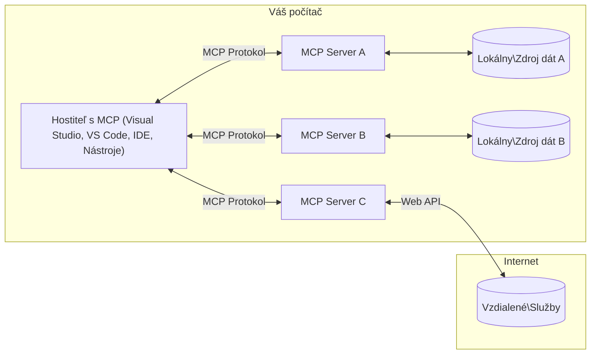

# MCP Core Concepts: Ovládanie protokolu Model Context pre integráciu AI

[](https://youtu.be/earDzWGtE84)

_(Kliknite na obrázok vyššie pre zobrazenie videa tejto lekcie)_

[Model Context Protocol (MCP)](https://github.com/modelcontextprotocol) je výkonný, štandardizovaný rámec, ktorý optimalizuje komunikáciu medzi veľkými jazykovými modelmi (LLM) a externými nástrojmi, aplikáciami a zdrojmi dát.  
Tento sprievodca vás prevedie základnými konceptmi MCP. Naučíte sa o jeho architektúre klient-server, základných komponentoch, mechanizmoch komunikácie a praxách implementácie.

- **Explicitný súhlas používateľa**: Všetky prístupy k dátam a operácie vyžadujú jasné schválenie používateľa pred vykonaním. Používatelia musia presne rozumieť, aké dáta budú prístupné a aké akcie budú vykonané, s detailnou kontrolou povolení a oprávnení.

- **Ochrana súkromia dát**: Dáta používateľa sú vystavené len s explicitným súhlasom a musia byť chránené prísnymi prístupovými kontrolami počas celého životného cyklu interakcie. Implementácie musia zabrániť neoprávnenému prenosu dát a udržiavať prísne hranice súkromia.

- **Bezpečnosť vykonávania nástrojov**: Každé volanie nástroja vyžaduje explicitný súhlas používateľa so zreteľným pochopením funkčnosti nástroja, parametrov a možného dopadu. Robustné bezpečnostné hranice musia predísť nechcenému, nebezpečnému alebo škodlivému vykonaniu nástroja.

- **Zabezpečenie vrstvy prenosu**: Všetky komunikačné kanály by mali používať vhodné šifrovacie a autentifikačné mechanizmy. Vzdialené pripojenia by mali implementovať bezpečné prenosové protokoly a správu prihlasovacích údajov.

#### Pokyny na implementáciu:

- **Správa povolení**: Implementujte jemnozrnný systém povolení umožňujúci používateľom kontrolovať, ktoré servery, nástroje a zdroje sú prístupné  
- **Autentifikácia a autorizácia**: Používajte bezpečné autentifikačné metódy (OAuth, API kľúče) s riadnou správou tokenov a ich vypršaním  
- **Validácia vstupov**: Validujte všetky parametre a dátové vstupy podľa definovaných schém, aby sa zabránilo útokom typu injekcia  
- **Auditné logovanie**: Udržiavajte podrobné logy všetkých operácií na monitorovanie bezpečnosti a súlad

## Prehľad

Táto lekcia skúma základnú architektúru a komponenty, ktoré tvoria ekosystém Model Context Protocol (MCP). Naučíte sa o architektúre klient-server, kľúčových komponentoch a mechanizmoch komunikácie, ktoré poháňajú interakcie MCP.

## Hlavné vzdelávacie ciele

Na konci tejto lekcie budete:

- Rozumieť architektúre MCP klient-server.  
- Identifikovať úlohy a zodpovednosti Hostiteľov, Klientov a Serverov.  
- Analyzovať základné vlastnosti, ktoré robia MCP flexibilnou integračnou vrstvou.  
- Naučiť sa, ako prebieha tok informácií v rámci ekosystému MCP.  
- Získať praktické poznatky prostredníctvom ukážok kódu v .NET, Jave, Pythone a JavaScripte.

## Architektúra MCP: Hlbší pohľad

Ekosystém MCP je postavený na modeli klient-server. Táto modulárna štruktúra umožňuje AI aplikáciám efektívne komunikovať s nástrojmi, databázami, API a kontextovými zdrojmi. Rozoberme túto architektúru na jej základné komponenty.

V jadre MCP nasleduje architektúru klient-server, kde hostiteľská aplikácia môže pripojiť k viacerým serverom:


- **MCP Hostitelia**: Programy ako VSCode, Claude Desktop, IDE alebo AI nástroje, ktoré chcú pristupovať k dátam cez MCP  
- **MCP Klienti**: Protokoloví klienti, ktorí udržiavajú 1:1 pripojenia so servermi  
- **MCP Servery**: Ľahké programy, ktoré každý vystavujú špecifické schopnosti cez štandardizovaný Model Context Protocol  
- **Lokálne zdroje dát**: Súbory, databázy a služby vo vašom počítači, ku ktorým MCP servery môžu bezpečne pristupovať  
- **Vzdialené služby**: Externé systémy dostupné cez internet, ku ktorým sa MCP servery môžu pripojiť cez API.

Protokol MCP je vyvíjajúci sa štandard používajúci dátumové verzie (formát YYYY-MM-DD). Aktuálna verzia protokolu je **2025-11-25**. Najnovšie aktualizácie nájdete v [špecifikácii protokolu](https://modelcontextprotocol.io/specification/2025-11-25/)

### 1. Hostitelia

V Model Context Protocole (MCP) sú **Hostitelia** AI aplikácie, ktoré slúžia ako primárne rozhranie, prostredníctvom ktorého používatelia komunikujú s protokolom. Hostitelia koordinujú a riadia pripojenia k viacerým MCP serverom vytváraním vyhradených MCP klientov pre každé serverové pripojenie. Príklady Hostiteľov zahŕňajú:

- **AI aplikácie**: Claude Desktop, Visual Studio Code, Claude Code  
- **Vývojové prostredia**: IDE a editory kódu s integráciou MCP  
- **Vlastné aplikácie**: Účelové AI agenti a nástroje

**Hostitelia** sú aplikácie koordinujúce interakcie AI modelov. Robia to takto:

- **Orchestrujú AI modely**: Vykonávajú alebo komunikujú s LLM na generovanie odpovedí a koordináciu AI pracovných tokov  
- **Spravujú klientské pripojenia**: Vytvárajú a udržiavajú jedného MCP klienta na každé serverové pripojenie  
- **Riadiace používateľské rozhranie**: Riadia tok konverzácie, používateľské interakcie a prezentáciu odpovedí  
- **Vynucujú bezpečnosť**: Kontrolujú povolenia, bezpečnostné pravidlá a autentifikáciu  
- **Spravujú používateľský súhlas**: Riadia schválenie používateľa pre zdieľanie dát a vykonávanie nástrojov

### 2. Klienti

**Klienti** sú kľúčové komponenty, ktoré udržiavajú vyhradené jedinečné pripojenia medzi Hostiteľmi a MCP servermi. Každý MCP klient je vytvorený Hostiteľom na pripojenie ku konkrétnemu MCP serveru, čím zabezpečuje organizované a bezpečné komunikačné kanály. Viac klientov umožňuje Hostiteľom pripojiť sa k viacerým serverom súčasne.

**Klienti** sú konektorové komponenty v rámci hostiteľskej aplikácie. Robia nasledovné:

- **Protokolová komunikácia**: Posielajú požiadavky JSON-RPC 2.0 serverom s promptami a inštrukciami  
- **Vyjednávanie schopností**: Rokujú o podporovaných funkciách a verziách protokolu so servermi počas inicializácie  
- **Vykonávanie nástrojov**: Spravujú požiadavky na vykonávanie nástrojov od modelov a spracovávajú ich odpovede  
- **Aktualizácie v reálnom čase**: Spracovávajú notifikácie a aktualizácie v reálnom čase od serverov  
- **Spracovanie odpovedí**: Spracovávajú a formátujú odpovede serverov pre zobrazovanie používateľom

### 3. Servery

**Servery** sú programy, ktoré poskytujú kontext, nástroje a schopnosti MCP klientom. Môžu bežať lokálne (na rovnakom stroji ako Hostiteľ) alebo vzdialene (na externých platformách) a sú zodpovedné za spracovanie požiadaviek klientov a poskytovanie štruktúrovaných odpovedí. Servery vystavujú špecifickú funkcionalitu cez štandardizovaný Model Context Protocol.

**Servery** sú služby poskytujúce kontext a schopnosti. Realizujú:

- **Registráciu funkcií**: Registrujú a vystavujú dostupné primitíva (zdroje, prompty, nástroje) klientom  
- **Spracovanie požiadaviek**: Prijímajú a vykonávajú volania nástrojov, požiadavky zdrojov a promptov od klientov  
- **Poskytovanie kontextu**: Dodávajú kontextové informácie a dáta na obohatenie odpovedí modelov  
- **Správu stavu**: Udržiavajú stav relácie a zvládajú stavové interakcie podľa potreby  
- **Notifikácie v reálnom čase**: Posielajú oznámenia o zmenách schopností a aktualizáciách pripojeným klientom

Servery môže vyvíjať ktokoľvek na rozšírenie schopností modelov špecializovanou funkcionalitou a podporujú nasadenie lokálne i vzdialene.

### 4. Serverové primitíva

Servery v Model Context Protocole (MCP) poskytujú tri základné **primitíva**, ktoré definujú fundamentálne stavebné bloky pre bohaté interakcie medzi klientmi, hostiteľmi a jazykovými modelmi. Tieto primitíva určujú typy kontextových informácií a akcií dostupných cez protokol.

MCP servery môžu vystavovať ľubovoľnú kombináciu nasledujúcich troch základných primitív:

#### Zdroje

**Zdroje** sú dátové zdroje poskytujúce kontextové informácie AI aplikáciám. Reprezentujú statický alebo dynamický obsah, ktorý môže rozšíriť porozumenie a rozhodovanie modelu:

- **Kontextové dáta**: Štruktúrované informácie a kontext pre spotrebu AI modelmi  
- **Znalostné bázy**: Repozitáre dokumentov, články, manuály a výskumné práce  
- **Lokálne zdroje dát**: Súbory, databázy a informácie lokálneho systému  
- **Externé dáta**: Odpovede API, webové služby a vzdialené systémové dáta  
- **Dynamický obsah**: Dáta v reálnom čase aktualizované podľa vonkajších podmienok

Zdroje sa identifikujú URI a podporujú objavovanie cez `resources/list` a získavanie cez `resources/read` metódy:

```text
file://documents/project-spec.md
database://production/users/schema
api://weather/current
```

#### Prompt-y

**Prompt-y** sú znovupoužiteľné šablóny, ktoré pomáhajú štruktúrovať interakcie s jazykovými modelmi. Poskytujú štandardizované vzory interakcií a šablónované pracovné toky:

- **Interakcie založené na šablónach**: Predštruktúrované správy a východiská konverzácie  
- **Šablóny pracovných tokov**: Štandardizované sekvencie pre bežné úlohy a interakcie  
- **Few-shot príklady**: Šablóny na inštrukcie modelu založené na príkladoch  
- **Systémové prompt-y**: Základné prompt-y, ktoré definujú správanie a kontext modelu  
- **Dynamické šablóny**: Parameterizované prompt-y, ktoré sa prispôsobujú špecifickým kontextom

Prompt-y podporujú substitúciu premenných a môžu byť objavené cez `prompts/list` a získavané pomocou `prompts/get`:

```markdown
Generate a {{task_type}} for {{product}} targeting {{audience}} with the following requirements: {{requirements}}
```

#### Nástroje

**Nástroje** sú vykonávateľné funkcie, ktoré AI modely môžu volať na vykonanie špecifických akcií. Reprezentujú „slovesá“ ekosystému MCP, umožňujúce modelom interagovať s externými systémami:

- **Vykonávateľné funkcie**: Diskrétne operácie, ktoré môžu modely volať s konkrétnymi parametrami  
- **Integrácia externých systémov**: API volania, dotazy do databáz, operácie so súbormi, výpočty  
- **Unikátna identita**: Každý nástroj má jedinečný názov, popis a schému parametrov  
- **Štruktúrovaný vstup/výstup**: Nástroje akceptujú validované parametre a vracajú štruktúrované, typizované odpovede  
- **Akčné schopnosti**: Umožňujú modelom vykonávať reálne akcie a získavať živé dáta

Nástroje sú definované pomocou JSON Schema pre validáciu parametrov, objavujú sa cez `tools/list` a volajú cez `tools/call`. Môžu tiež obsahovať **ikony** ako dodatočné metadáta pre lepšiu prezentáciu v UI.

**Anotácie nástrojov**: Nástroje podporujú behaviorálne anotácie (napr. `readOnlyHint`, `destructiveHint`), ktoré popisujú, či je nástroj iba na čítanie alebo ničivý, čo pomáha klientom robiť informované rozhodnutia o vykonávaní nástrojov.

Príklad definície nástroja:

```typescript
server.tool(
  "search_products", 
  {
    query: z.string().describe("Search query for products"),
    category: z.string().optional().describe("Product category filter"),
    max_results: z.number().default(10).describe("Maximum results to return")
  }, 
  async (params) => {
    // Vykonajte vyhľadávanie a vráťte štruktúrované výsledky
    return await productService.search(params);
  }
);
```

## Klientské primitíva

V Model Context Protocole (MCP) môžu **klienti** vystavovať primitíva, ktoré umožňujú serverom požadovať ďalšie schopnosti od hostiteľskej aplikácie. Tieto primitíva na strane klienta umožňujú bohatšie, interaktívnejšie implementácie serverov, ktoré môžu pristupovať k schopnostiam AI modelov a používateľským interakciám.

### Vzorkovanie

**Vzorkovanie** umožňuje serverom žiadať doplnenia od jazykového modelu v AI aplikácii klienta. Toto primitívum umožňuje serverom prístup k schopnostiam LLM bez potreby vlastných závislostí na SDK modelov:

- **Nezávislý prístup k modelu**: Servery môžu žiadať doplnenia bez zabudovania LLM SDK alebo správy prístupu k modelu  
- **Serverom iniciovaná AI**: Umožňuje serverom autonómne generovať obsah pomocou AI modelu klienta  
- **Rekurzívne interakcie LLM**: Podporuje komplexné scenáre, kde servery potrebujú AI asistenciu pri spracovaní  
- **Dynamické generovanie obsahu**: Umožňuje serverom vytvárať kontextové odpovede použitím modelu hosťujúcej aplikácie  
- **Podpora volania nástrojov**: Servery môžu zahrnúť parametre `tools` a `toolChoice` na umožnenie modelu klienta volať nástroje počas vzorkovania

Vzorkovanie sa iniciuje pomocou metódy `sampling/complete`, kde servery posielajú požiadavky na doplnenie klientom.

### Koreň

**Koreň** poskytuje štandardizovaný spôsob, ako klienti vystavujú hranice súborového systému serverom, pomáhajúc serverom porozumieť, ku ktorým adresárom a súborom majú prístup:

- **Hranice súborového systému**: Definujú, v ktorých častiach súborového systému môžu servery operovať  
- **Kontrola prístupu**: Pomáhajú serverom pochopiť, ku ktorým adresárom a súborom majú povolenie pristupovať  
- **Dynamické aktualizácie**: Klienti môžu notifikovať servery, keď sa zoznam koreňov zmení  
- **Identifikácia na základe URI**: Koreň používa URI začínajúce na `file://` na identifikáciu prístupných adresárov a súborov

Koreň sa zistí cez metódu `roots/list`, pričom klienti posielajú notifikácie `notifications/roots/list_changed`, keď sa koreň mení.

### Vyžiadanie

**Vyžiadanie** umožňuje serverom žiadať dodatočné informácie alebo potvrdenia od používateľov prostredníctvom rozhrania klienta:

- **Požiadavky na vstup používateľa**: Servery môžu žiadať dodatočné informácie potrebné na vykonanie nástroja  
- **Potvrdzovacie dialógy**: Žiadajú súhlas používateľa pre citlivé alebo významné operácie  
- **Interaktívne pracovné toky**: Umožňujú serverom vytvárať krokové používateľské interakcie  
- **Dynamické získavanie parametrov**: Zhromažďujú chýbajúce alebo voliteľné parametre počas vykonávania nástroja

Požiadavky na vyžiadanie sa robia pomocou metódy `elicitation/request` na získanie používateľského vstupu cez rozhranie klienta.

**URL mód vyžiadania**: Servery môžu tiež žiadať používateľské interakcie založené na URL, čo umožňuje serverom smerovať používateľov na externé webové stránky na autentifikáciu, potvrdenie alebo zadanie dát.

### Logovanie

**Logovanie** umožňuje serverom posielať klientom štruktúrované logovacie správy na ladenie, monitorovanie a operačnú viditeľnosť:

- **Podpora ladenia**: Umožňuje serverom poskytovať podrobné výkonné logy na riešenie problémov  
- **Operačné monitorovanie**: Posiela aktualizácie stavu a výkonové metriky klientom  
- **Hlásenie chýb**: Poskytuje podrobný kontext chýb a diagnostické informácie  
- **Auditné záznamy**: Vytvára komplexné denníky serverových operácií a rozhodnutí

Logovacie správy sa posielajú klientom na zaistenie transparentnosti serverových operácií a uľahčenie ladenia.

## Tok informácií v MCP

Model Context Protocol (MCP) definuje štruktúrovaný tok informácií medzi hostiteľmi, klientmi, servermi a modelmi. Pochopenie tohto toku pomáha objasniť, ako sa spracovávajú požiadavky používateľov a ako sa externé nástroje a dáta integrujú do odpovedí modelov.
- **Host iniciuje pripojenie**  
  Hostiteľská aplikácia (napríklad IDE alebo chatové rozhranie) nadväzuje pripojenie na MCP server, typicky cez STDIO, WebSocket alebo iný podporovaný transport.

- **Jednanie o schopnostiach**  
  Klient (vložený v hostiteľovi) a server si vymieňajú informácie o podporovaných funkciách, nástrojoch, zdrojoch a verziách protokolu. To zabezpečuje, že obe strany rozumejú dostupným schopnostiam pre reláciu.

- **Používateľská požiadavka**  
  Používateľ interaguje s hostiteľom (napr. zadá výzvu alebo príkaz). Hostiteľ zozbiera tento vstup a odošle ho klientovi na spracovanie.

- **Použitie zdrojov alebo nástrojov**  
  - Klient môže vyžiadať ďalší kontext alebo zdroje zo servera (ako sú súbory, databázové záznamy alebo články z vedomostnej bázy) na obohatenie pochopenia modelu.  
  - Ak model určí, že je potrebný nástroj (napr. na získanie dát, vykonanie výpočtu alebo volanie API), klient odošle serveru požiadavku na vyvolanie nástroja, špecifikujúc názov nástroja a parametre.

- **Vykonanie na serveri**  
  Server prijme požiadavku na zdroj alebo nástroj, vykoná potrebné operácie (napr. spustenie funkcie, dotaz do databázy alebo načítanie súboru) a vráti výsledky klientovi v štruktúrovanom formáte.

- **Generovanie odpovede**  
  Klient integruje odpovede servera (údaje zo zdrojov, výstupy nástrojov atď.) do prebiehajúcej interakcie modelu. Model využíva tieto informácie na vytvorenie komplexnej a kontextovo relevantnej odpovede.

- **Prezentácia výsledku**  
  Hostiteľ prijme konečný výstup od klienta a zobrazí ho používateľovi, často vrátane textu vygenerovaného modelom a výsledkov exekúcií nástrojov alebo vyhľadávania zdrojov.

Tento tok umožňuje MCP podporovať pokročilé, interaktívne a kontextovo vedomé AI aplikácie bezproblémovým prepojením modelov s externými nástrojmi a dátovými zdrojmi.

## Architektúra protokolu & vrstvy

MCP pozostáva z dvoch odlišných architektonických vrstiev, ktoré spolupracujú na poskytovaní úplného komunikačného rámca:

### Dátová vrstva

**Dátová vrstva** implementuje základný MCP protokol pomocou **JSON-RPC 2.0** ako svojho základu. Táto vrstva definuje štruktúru správ, sémantiku a vzory interakcie:

#### Základné komponenty:

- **JSON-RPC 2.0 protokol**: Všetka komunikácia používa štandardizovaný formát správ JSON-RPC 2.0 pre volania metód, odpovede a oznámenia  
- **Správa životného cyklu**: Rieši inicializáciu pripojenia, vyjednávanie schopností a ukončenie relácie medzi klientmi a servermi  
- **Serverové primitíva**: Umožňuje serverom poskytovať základnú funkcionalitu cez nástroje, zdroje a výzvy  
- **Klientské primitíva**: Umožňuje serverom žiadať vzorkovanie z LLM, vyžiadať vstup používateľa a posielať logovacie správy  
- **Notifikácie v reálnom čase**: Podporuje asynchrónne oznámenia pre dynamické aktualizácie bez neustáleho pýtania sa  

#### Kľúčové vlastnosti:

- **Vyjednávanie verzie protokolu**: Používa verzie založené na dátume (YYYY-MM-DD) na zabezpečenie kompatibility  
- **Objavovanie schopností**: Klient a server si počas inicializácie vymieňajú informácie o podporovaných funkciách  
- **Stavové relácie**: Uchováva stav pripojenia cez viacero interakcií pre kontinuitu kontextu  

### Transportná vrstva

**Transportná vrstva** spravuje komunikačné kanály, rámcovanie správ a autentifikáciu medzi účastníkmi MCP:

#### Podporované transportné mechanizmy:

1. **STDIO transport**:  
   - Používa štandardné vstupné/výstupné prúdy pre priame procesové spojenie  
   - Optimálne pre lokálne procesy na rovnakom stroji bez sieťovej režií  
   - Bežne používané pre lokálne implementácie MCP serverov  

2. **Streamovateľný HTTP transport**:  
   - Používa HTTP POST pre správy klient → server  
   - Voliteľné Server-Sent Events (SSE) pre streamovanie server → klient  
   - Umožňuje vzdialenú komunikáciu so serverom cez siete  
   - Podporuje štandardnú HTTP autentifikáciu (bearer tokeny, API kľúče, vlastné hlavičky)  
   - MCP odporúča OAuth pre bezpečnú autentifikáciu založenú na tokenoch  

#### Transportná abstrakcia:

Transportná vrstva abstrahuje detaily komunikácie od dátovej vrstvy, čo umožňuje rovnaký formát správ JSON-RPC 2.0 použiť naprieč všetkými transportnými mechanizmami. Táto abstrakcia umožňuje aplikáciám bezproblémovo prechádzať medzi lokálnymi a vzdialenými servermi.

### Bezpečnostné aspekty

Implementácie MCP musia dodržiavať niekoľko kritických bezpečnostných princípov na zabezpečenie bezpečných, dôveryhodných a zabezpečených interakcií vo všetkých operáciách protokolu:

- **Súhlas a kontrola používateľa**: Používateľ musí výslovne súhlasiť skôr, než sa pristúpi k prístupu k akýmkoľvek dátam alebo vykonaniu operácií. Mal by mať jasnú kontrolu nad tým, aké dáta sú zdieľané a ktoré akcie sú autorizované, čo podporujú intuitívne používateľské rozhrania na kontrolu a schvaľovanie aktivít.

- **Ochrana súkromia dát**: Používateľské dáta by mali byť sprístupnené iba s výslovným súhlasom a musia byť chránené vhodnými prístupovými kontrolami. Implementácie MCP musia zabrániť neoprávnenému prenosu dát a zabezpečiť, že súkromie je zachované počas všetkých interakcií.

- **Bezpečnosť nástrojov**: Pred vyvolaním akéhokoľvek nástroja je potrebný výslovný súhlas používateľa. Používatelia by mali mať jasné pochopenie funkčnosti každého nástroja a musia byť vynútené robustné bezpečnostné hranice na zabránenie neželanému alebo nebezpečnému spusteniu nástroja.

Dodržiavaním týchto bezpečnostných princípov MCP zabezpečuje dôveru používateľov, ochranu súkromia a bezpečnosť vo všetkých interakciách protokolu pri súčasnom umožnení silných AI integrácií.

## Ukážky kódu: Kľúčové komponenty

Nižšie sú ukážky kódu v niekoľkých populárnych programovacích jazykoch, ktoré ilustrujú, ako implementovať kľúčové komponenty MCP servera a nástroje.

### Príklad .NET: Vytvorenie jednoduchého MCP servera s nástrojmi

Tu je praktická ukážka kódu v .NET, ktorá demonštruje, ako implementovať jednoduchý MCP server s vlastnými nástrojmi. Príklad ukazuje, ako definovať a zaregistrovať nástroje, spracovať požiadavky a pripojiť server pomocou Model Context Protocol.

```csharp
using System;
using System.Threading.Tasks;
using ModelContextProtocol.Server;
using ModelContextProtocol.Server.Transport;
using ModelContextProtocol.Server.Tools;

public class WeatherServer
{
    public static async Task Main(string[] args)
    {
        // Create an MCP server
        var server = new McpServer(
            name: "Weather MCP Server",
            version: "1.0.0"
        );
        
        // Register our custom weather tool
        server.AddTool<string, WeatherData>("weatherTool", 
            description: "Gets current weather for a location",
            execute: async (location) => {
                // Call weather API (simplified)
                var weatherData = await GetWeatherDataAsync(location);
                return weatherData;
            });
        
        // Connect the server using stdio transport
        var transport = new StdioServerTransport();
        await server.ConnectAsync(transport);
        
        Console.WriteLine("Weather MCP Server started");
        
        // Keep the server running until process is terminated
        await Task.Delay(-1);
    }
    
    private static async Task<WeatherData> GetWeatherDataAsync(string location)
    {
        // This would normally call a weather API
        // Simplified for demonstration
        await Task.Delay(100); // Simulate API call
        return new WeatherData { 
            Temperature = 72.5,
            Conditions = "Sunny",
            Location = location
        };
    }
}

public class WeatherData
{
    public double Temperature { get; set; }
    public string Conditions { get; set; }
    public string Location { get; set; }
}
```

### Príklad Java: Komponenty MCP servera

Tento príklad demonštruje ten istý MCP server a registráciu nástrojov ako vyššie v .NET príklade, ale implementované v Jave.

```java
import io.modelcontextprotocol.server.McpServer;
import io.modelcontextprotocol.server.McpToolDefinition;
import io.modelcontextprotocol.server.transport.StdioServerTransport;
import io.modelcontextprotocol.server.tool.ToolExecutionContext;
import io.modelcontextprotocol.server.tool.ToolResponse;

public class WeatherMcpServer {
    public static void main(String[] args) throws Exception {
        // Vytvoriť MCP server
        McpServer server = McpServer.builder()
            .name("Weather MCP Server")
            .version("1.0.0")
            .build();
            
        // Registrovať nástroj na počasie
        server.registerTool(McpToolDefinition.builder("weatherTool")
            .description("Gets current weather for a location")
            .parameter("location", String.class)
            .execute((ToolExecutionContext ctx) -> {
                String location = ctx.getParameter("location", String.class);
                
                // Získať údaje o počasí (zjednodušené)
                WeatherData data = getWeatherData(location);
                
                // Vrátiť naformátovanú odpoveď
                return ToolResponse.content(
                    String.format("Temperature: %.1f°F, Conditions: %s, Location: %s", 
                    data.getTemperature(), 
                    data.getConditions(), 
                    data.getLocation())
                );
            })
            .build());
        
        // Pripojiť server pomocou stdio transportu
        try (StdioServerTransport transport = new StdioServerTransport()) {
            server.connect(transport);
            System.out.println("Weather MCP Server started");
            // Nechať server bežať až do ukončenia procesu
            Thread.currentThread().join();
        }
    }
    
    private static WeatherData getWeatherData(String location) {
        // Implementácia by volala API na počasie
        // Zjednodušené pre ukážkové účely
        return new WeatherData(72.5, "Sunny", location);
    }
}

class WeatherData {
    private double temperature;
    private String conditions;
    private String location;
    
    public WeatherData(double temperature, String conditions, String location) {
        this.temperature = temperature;
        this.conditions = conditions;
        this.location = location;
    }
    
    public double getTemperature() {
        return temperature;
    }
    
    public String getConditions() {
        return conditions;
    }
    
    public String getLocation() {
        return location;
    }
}
```

### Príklad Python: Vytvorenie MCP servera

Tento príklad používa fastmcp, preto prosím najskôr zabezpečte jeho inštaláciu:

```python
pip install fastmcp
```
Kódový príklad:

```python
#!/usr/bin/env python3
import asyncio
from fastmcp import FastMCP
from fastmcp.transports.stdio import serve_stdio

# Vytvorte server FastMCP
mcp = FastMCP(
    name="Weather MCP Server",
    version="1.0.0"
)

@mcp.tool()
def get_weather(location: str) -> dict:
    """Gets current weather for a location."""
    return {
        "temperature": 72.5,
        "conditions": "Sunny",
        "location": location
    }

# Alternatívny prístup pomocou triedy
class WeatherTools:
    @mcp.tool()
    def forecast(self, location: str, days: int = 1) -> dict:
        """Gets weather forecast for a location for the specified number of days."""
        return {
            "location": location,
            "forecast": [
                {"day": i+1, "temperature": 70 + i, "conditions": "Partly Cloudy"}
                for i in range(days)
            ]
        }

# Zaregistrujte nástroje triedy
weather_tools = WeatherTools()

# Spustite server
if __name__ == "__main__":
    asyncio.run(serve_stdio(mcp))
```

### Príklad JavaScript: Vytvorenie MCP servera

Tento príklad ukazuje vytvorenie MCP servera v JavaScripte a registráciu dvoch nástrojov týkajúcich sa počasia.

```javascript
// Použitie oficiálneho Model Context Protocol SDK
import { McpServer } from "@modelcontextprotocol/sdk/server/mcp.js";
import { StdioServerTransport } from "@modelcontextprotocol/sdk/server/stdio.js";
import { z } from "zod"; // Na overenie parametrov

// Vytvoriť MCP server
const server = new McpServer({
  name: "Weather MCP Server",
  version: "1.0.0"
});

// Definovať nástroj počasia
server.tool(
  "weatherTool",
  {
    location: z.string().describe("The location to get weather for")
  },
  async ({ location }) => {
    // Normálne by to zavolalo API počasia
    // Zjednodušené pre demonštráciu
    const weatherData = await getWeatherData(location);
    
    return {
      content: [
        { 
          type: "text", 
          text: `Temperature: ${weatherData.temperature}°F, Conditions: ${weatherData.conditions}, Location: ${weatherData.location}` 
        }
      ]
    };
  }
);

// Definovať nástroj predpovede
server.tool(
  "forecastTool",
  {
    location: z.string(),
    days: z.number().default(3).describe("Number of days for forecast")
  },
  async ({ location, days }) => {
    // Normálne by to zavolalo API počasia
    // Zjednodušené pre demonštráciu
    const forecast = await getForecastData(location, days);
    
    return {
      content: [
        { 
          type: "text", 
          text: `${days}-day forecast for ${location}: ${JSON.stringify(forecast)}` 
        }
      ]
    };
  }
);

// Pomocné funkcie
async function getWeatherData(location) {
  // Simulovať volanie API
  return {
    temperature: 72.5,
    conditions: "Sunny",
    location: location
  };
}

async function getForecastData(location, days) {
  // Simulovať volanie API
  return Array.from({ length: days }, (_, i) => ({
    day: i + 1,
    temperature: 70 + Math.floor(Math.random() * 10),
    conditions: i % 2 === 0 ? "Sunny" : "Partly Cloudy"
  }));
}

// Pripojiť server pomocou stdio transportu
const transport = new StdioServerTransport();
server.connect(transport).catch(console.error);

console.log("Weather MCP Server started");
```

Tento JavaScript príklad demonštruje, ako vytvoriť MCP server, ktorý registruje nástroje pre počasie a pripája sa cez stdio transport na spracovanie prichádzajúcich požiadaviek klienta.

## Bezpečnosť a autorizácia

MCP obsahuje niekoľko zabudovaných konceptov a mechanizmov na správu bezpečnosti a autorizácie naprieč celým protokolom:

1. **Kontrola povolení nástrojov**  
  Klienti môžu špecifikovať, ktoré nástroje smie model používať počas relácie. To zabezpečuje, že sú dostupné len explicitne autorizované nástroje, čím sa znižuje riziko neúmyselných alebo nebezpečných operácií. Povolenia môžu byť konfigurované dynamicky podľa preferencií používateľa, organizačných politík alebo kontextu interakcie.

2. **Autentifikácia**  
  Servery môžu vyžadovať autentifikáciu pred udelením prístupu k nástrojom, zdrojom alebo citlivým operáciám. Môže ísť o API kľúče, OAuth tokeny alebo iné autentifikačné schémy. Správna autentifikácia zabezpečuje, že len dôveryhodní klienti a používatelia môžu vyvolávať schopnosti na strane servera.

3. **Validácia**  
  Vynucuje sa validácia parametrov pre všetky volania nástrojov. Každý nástroj definuje očakávané typy, formáty a obmedzenia svojich parametrov a server overuje prichádzajúce požiadavky podľa toho. To zabraňuje tomu, aby do implementácií nástrojov prenikli nesprávne alebo škodlivé vstupy a pomáha zachovať integritu operácií.

4. **Obmedzenie frekvencie (Rate limiting)**  
  Na zabránenie zneužitia a na zabezpečenie férového využívania zdrojov servera môžu MCP servery implementovať obmedzenia frekvencie volaní nástrojov a prístupu ku zdrojom. Obmedzenia môžu byť aplikované na používateľa, reláciu alebo globálne a pomáhajú chrániť proti útokom DoS alebo nadmernému využívaniu zdrojov.

Kombináciou týchto mechanizmov MCP poskytuje bezpečný základ pre integráciu jazykových modelov s externými nástrojmi a dátovými zdrojmi pri súčasnom umožnení používateľom a vývojárom detailnej kontroly nad prístupom a používaním.

## Správy protokolu & tok komunikácie

Komunikácia MCP používa štruktúrované **JSON-RPC 2.0** správy na zabezpečenie jasných a spoľahlivých interakcií medzi hosťami, klientmi a servermi. Protokol definuje konkrétne vzory správ pre rôzne typy operácií:

### Základné typy správ:

#### **Inicializačné správy**
- **Požiadavka `initialize`**: Nadväzuje spojenie a vyjednáva verziu protokolu a schopnosti  
- **Odpoveď `initialize`**: Potvrdzuje podporované funkcie a informácie o serveri  
- **`notifications/initialized`**: Signáluje, že inicializácia je dokončená a relácia je pripravená  

#### **Objavovacie správy**
- **Požiadavka `tools/list`**: Objavuje dostupné nástroje na serveri  
- **Požiadavka `resources/list`**: Vypisuje dostupné zdroje (dátové zdroje)  
- **Požiadavka `prompts/list`**: Získava dostupné šablóny výziev  

#### **Exekučné správy**  
- **Požiadavka `tools/call`**: Vykonáva konkrétny nástroj s poskytnutými parametrami  
- **Požiadavka `resources/read`**: Načíta obsah zo špecifického zdroja  
- **Požiadavka `prompts/get`**: Získa šablónu výzvy s voliteľnými parametrami  

#### **Klientské správy**
- **Požiadavka `sampling/complete`**: Server žiada dokončenie LLM od klienta  
- **`elicitation/request`**: Server žiada používateľský vstup cez klientské rozhranie  
- **Logovacie správy**: Server posiela štruktúrované logy klientovi  

#### **Notifikačné správy**
- **`notifications/tools/list_changed`**: Server oznamuje klientovi zmeny v nástrojoch  
- **`notifications/resources/list_changed`**: Server oznamuje klientovi zmeny v zdrojoch  
- **`notifications/prompts/list_changed`**: Server oznamuje klientovi zmeny vo výzvach  

### Štruktúra správ:

Všetky správy MCP používajú formát JSON-RPC 2.0 s:  
- **Požiadavky**: Obsahujú `id`, `method` a voliteľné `params`  
- **Odpovede**: Obsahujú `id` a buď `result` alebo `error`  
- **Notifikácie**: Obsahujú `method` a voliteľné `params` (nemajú `id` ani očakávanú odpoveď)  

Táto štruktúrovaná komunikácia zabezpečuje spoľahlivé, sledovateľné a rozšíriteľné interakcie podporujúce pokročilé scenáre ako aktualizácie v reálnom čase, reťazenie nástrojov a robustné spracovanie chýb.

### Úlohy (experimentálne)

**Úlohy** sú experimentálna funkcia, ktorá poskytuje trvalé vykonávacie obaly umožňujúce odsunuté získanie výsledkov a sledovanie stavu MCP požiadaviek:

- **Dlhodobé operácie**: Sledovanie náročných výpočtov, automatizácie workflow a dávkového spracovania  
- **Odsunuté výsledky**: Pollovanie stavu úlohy a získanie výsledkov po dokončení operácií  
- **Sledovanie stavu**: Monitorovanie pokroku úlohy prostredníctvom definovaných stavov životného cyklu  
- **Viacstupňové operácie**: Podpora komplexných workflowov, ktoré presahujú viacero interakcií  

Úlohy obalia štandardné MCP požiadavky, aby umožnili asynchrónne vzory vykonávania pre operácie, ktoré nemôžu byť dokončené okamžite.

## Kľúčové zhrnutie

- **Architektúra**: MCP používa klient-server architektúru, kde hostitelia spravujú viacnásobné klientské pripojenia k serverom  
- **Účastníci**: Ekosystém zahŕňa hostiteľov (AI aplikácie), klientov (protokolové konektory) a serverov (poskytovatelia schopností)  
- **Transportné mechanizmy**: Komunikácia podporuje STDIO (lokálne) a streamovateľný HTTP s voliteľným SSE (vzdialené)  
- **Základné primitíva**: Servery vystavujú nástroje (vykonávateľné funkcie), zdroje (dátové zdroje) a výzvy (šablóny)  
- **Klientské primitíva**: Servery môžu vyžadovať vzorkovanie (LLM dokončenia s podporou volania nástrojov), vyžiadanie (vstup používateľa vrátane URL režimu), korene (hranice súborového systému) a logovanie od klientov  
- **Experimentálne funkcie**: Úlohy poskytujú trvalé obaly vykonávania pre dlhodobé operácie  
- **Základy protokolu**: Postavené na JSON-RPC 2.0 s verziou založenou na dátume (aktuálne: 2025-11-25)  
- **Možnosti v reálnom čase**: Podporuje notifikácie pre dynamické aktualizácie a synchronizáciu v reálnom čase  
- **Zabezpečenie na prvom mieste**: Explicitný súhlas používateľa, ochrana súkromia dát a bezpečný transport sú základné požiadavky  

## Cvičenie

Navrhnite jednoduchý MCP nástroj, ktorý by bol užitočný vo vašej oblasti. Definujte:  
1. Ako by sa nástroj volal  
2. Aké parametre by prijímal  
3. Aký výstup by vracal  
4. Ako by model mohol tento nástroj použiť na riešenie problémov používateľov  

---

## Čo nasleduje

Ďalej: [Kapitola 2: Bezpečnosť](../02-Security/README.md)

---

<!-- CO-OP TRANSLATOR DISCLAIMER START -->
**Upozornenie**:
Tento dokument bol preložený pomocou AI prekladateľskej služby [Co-op Translator](https://github.com/Azure/co-op-translator). Aj keď sa snažíme o presnosť, prosím, berte na vedomie, že automatické preklady môžu obsahovať chyby alebo nepresnosti. Pôvodný dokument v jeho pôvodnom jazyku by mal byť považovaný za autoritatívny zdroj. Pre dôležité informácie sa odporúča profesionálny ľudský preklad. Nie sme zodpovední za žiadne nedorozumenia alebo nesprávne interpretácie vyplývajúce z použitia tohto prekladu.
<!-- CO-OP TRANSLATOR DISCLAIMER END -->