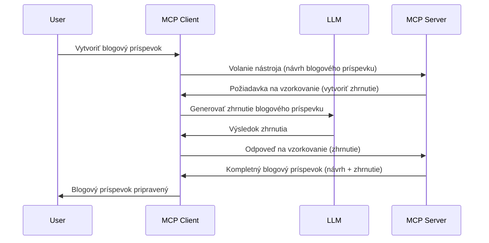

# Sampling - delegovanie funkcií klientovi

Niekedy je potrebné, aby MCP klient a MCP server spolupracovali na dosiahnutí spoločného cieľa. Môže nastať situácia, kedy server potrebuje pomoc LLM, ktorý beží na kliente. V takom prípade by ste mali použiť sampling.

Preskúmajme niekoľko prípadov použitia a ako zostaviť riešenie zahŕňajúce sampling.

## Prehľad

V tejto lekcii sa zameriame na vysvetlenie, kedy a kde použiť sampling a ako ho nakonfigurovať.

## Ciele učenia

V tejto kapitole:

- Vysvetlíme, čo je sampling a kedy ho použiť.
- Ukážeme, ako konfigurovať sampling v MCP.
- Poskytneme príklady samplingu v praxi.

## Čo je Sampling a prečo ho používať?

Sampling je pokročilá funkcia, ktorá funguje nasledovne:



### Sampling request

Dobre, teraz máme prehľad o dôveryhodnom scenári, pozrime sa na sampling request, ktorý server posiela späť klientovi. Takýto request môže vyzerať v JSON-RPC formáte takto:

```json
{
  "jsonrpc": "2.0",
  "id": 1,
  "method": "sampling/createMessage",
  "params": {
    "messages": [
      {
        "role": "user",
        "content": {
          "type": "text",
          "text": "Create a blog post summary of the following blog post: <BLOG POST>"
        }
      }
    ],
    "modelPreferences": {
      "hints": [
        {
          "name": "claude-3-sonnet"
        }
      ],
      "intelligencePriority": 0.8,
      "speedPriority": 0.5
    },
    "systemPrompt": "You are a helpful assistant.",
    "maxTokens": 100
  }
}
```

Je tu niekoľko vecí, na ktoré stojí za to poukázať:

- Prompt, pod content -> text, je naša výzva, ktorá je inštrukciou pre LLM zhrnúť obsah blogového príspevku.

- **modelPreferences**. Táto sekcia je práve to, preferencia, odporúčanie konfigurácie, ktorú treba použiť s LLM. Používateľ si môže zvoliť, či pôjde podľa týchto odporúčaní alebo ich zmení. V tomto prípade sú odporúčania ohľadom modelu, ktorý použiť, a priorít rýchlosti a inteligencie.
- **systemPrompt**, toto je váš bežný systémový prompt, ktorý dáva LLM osobnosť a obsahuje usmerňovacie inštrukcie.
- **maxTokens**, toto je ďalší parameter, ktorý určuje, koľko tokenov je odporúčané použiť pre túto úlohu.

### Sampling response

Táto odpoveď je to, čo MCP klient po zavolaní LLM nakoniec pošle späť MCP serveru a je výsledkom; klient počká na odpoveď a potom zostaví túto správu. Takto môže vyzerať v JSON-RPC:

```json
{
  "jsonrpc": "2.0",
  "id": 1,
  "result": {
    "role": "assistant",
    "content": {
      "type": "text",
      "text": "Here's your abstract <ABSTRACT>"
    },
    "model": "gpt-5",
    "stopReason": "endTurn"
  }
}
```

Všimnite si, že odpoveď je abstrakt blogového príspevku, presne ako sme požadovali. Tiež si všimnite, že použitý `model` nie je ten, ktorý sme pôvodne vybrali, ale "gpt-5" namiesto "claude-3-sonnet". Toto ilustruje, že používateľ môže zmeniť názor, čo použiť, a že váš sampling request je len odporúčaním.

Dobre, keď teraz rozumieme hlavnému toku a užitočnej úlohe, na ktorú sa to hodí „tvorba blogového príspevku + abstrakt“, pozrime sa, čo treba urobiť, aby to fungovalo.

### Typy správ

Sampling správy nie sú obmedzené len na text, môžete tiež posielať obrázky a zvuk. Tu je, ako vyzerá JSON-RPC v rôznych prípadoch:

**Text**

```json
{
  "type": "text",
  "text": "The message content"
}
```

**Obsah obrázku**

```json
{
  "type": "image",
  "data": "base64-encoded-image-data",
  "mimeType": "image/jpeg"
}
```

**Obsah zvuku**

```json
{
  "type": "audio",
  "data": "base64-encoded-audio-data",
  "mimeType": "audio/wav"
}
```

> NOTE: pre podrobnejšie informácie o samplingu navštívte [oficiálnu dokumentáciu](https://modelcontextprotocol.io/specification/2025-11-25/client/sampling)

## Ako konfigurovať Sampling v Klientovi

> Poznámka: ak budujete iba server, veľa tu nastavovať nemusíte.

V kliente je potrebné špecifikovať nasledujúcu funkciu takto:

```json
{
  "capabilities": {
    "sampling": {}
  }
}
```

Táto funkcia bude potom použitá, keď sa vybraný klient inicializuje so serverom.

## Príklad použitia Sampling - vytvorenie blogového príspevku

Nasledujme spolu kódovanie sampling servera, budeme musieť spraviť nasledovné:

1. Vytvoriť nástroj na serveri.
2. Tento nástroj by mal vytvoriť sampling request.
3. Nástroj by mal počkať na odpoveď na sampling request od klienta.
4. Potom by mal vyprodukovať výsledok nástroja.

Pozrime sa na kód krok po kroku:

### -1- Vytvorenie nástroja

**python**

```python
@mcp.tool()
async def create_blog(title: str, content: str, ctx: Context[ServerSession, None]) -> str:
    """Create a blog post and generate a summary"""

```

### -2- Vytvorenie sampling requestu

Rozšírte svoj nástroj o nasledujúci kód:

**python**

```python
post = BlogPost(
        id=len(posts) + 1,
        title=title,
        content=content,
        abstract=""
    )

prompt = f"Create an abstract of the following blog post: title: {title} and draft: {content} "

result = await ctx.session.create_message(
        messages=[
            SamplingMessage(
                role="user",
                content=TextContent(type="text", text=prompt),
            )
        ],
        max_tokens=100,
)

```

### -3- Čakanie na odpoveď a vrátenie výsledku

**python**

```python
post.abstract = result.content.text

posts.append(post)

# vrátiť kompletný produkt
return json.dumps({
    "id": post.title,
    "abstract": post.abstract
})
```

### -4- Kompletný kód

**python**

```python
from starlette.applications import Starlette
from starlette.routing import Mount, Host

from mcp.server.fastmcp import Context, FastMCP

from mcp.server.session import ServerSession
from mcp.types import SamplingMessage, TextContent

import json


from uuid import uuid4
from typing import List
from pydantic import BaseModel


mcp = FastMCP("Blog post generator")

# app = FastAPI()

posts = []

class BlogPost(BaseModel):
    id: int
    title: str
    content: str
    abstract: str

posts: List[BlogPost] = []

@mcp.tool()
async def create_blog(title: str, content: str, ctx: Context[ServerSession, None]) -> str:
    """Create a blog post and generate a summary"""

    post = BlogPost(
        id=len(posts) + 1,
        title=title,
        content=content,
        abstract=""
    )

    prompt = f"Create an abstract of the following blog post: title: {title} and draft: {content} "

    result = await ctx.session.create_message(
        messages=[
            SamplingMessage(
                role="user",
                content=TextContent(type="text", text=prompt),
            )
        ],
        max_tokens=100,
    )

    post.abstract = result.content.text

    posts.append(post)

    # vrátiť celý blogový príspevok
    return json.dumps({
        "id": post.title,
        "abstract": post.abstract
    })

if __name__ == "__main__":
    print("Starting server...")
    # mcp.run()
    mcp.run(transport="streamable-http")

# spustiť aplikáciu príkazom: python server.py
```

### -5- Testovanie vo Visual Studio Code

Ak chcete otestovať toto vo Visual Studio Code, urobte nasledovné:

1. Spustite server v termináli.
2. Pridajte ho do *mcp.json* (a uistite sa, že je spustený), napríklad takto:

   ```json
   "servers": {
      "blog-server": {
        "type": "http",
        "url": "http://localhost:8000/mcp"
      }
   }
   ```

3. Napíšte prompt:

   ```text
   create a blog post named "Where Python comes from", the content is "Python is actually named after Monty Python Flying Circus"
   ```

4. Povoliť sampling. Pri prvom teste sa vám zobrazí dodatočný dialóg, ktorý musíte prijať, potom uvidíte bežný dialóg, ktorý vás požiada o spustenie nástroja.

5. Skontrolujte výsledky. Výsledky uvidíte pekne zobrazené v GitHub Copilot Chate, ale môžete si tiež pozrieť surovú JSON odpoveď.

**Bonus**. Visual Studio Code nástroje majú skvelú podporu samplingu. Môžete konfiguráciu samplingu na vašom nainštalovanom serveri nájsť takto:

1. Prejdite do sekcie rozšírení.
2. Vyberte ikonku ozubeného kolieska pri vašom nainštalovanom serveri v sekcii "MCP SERVERS - INSTALLED".
3. Vyberte "Configure Model Access", tu si môžete vybrať, ktoré modely môže GitHub Copilot používať pri samplingu. Tiež môžete vidieť všetky nedávne sampling requesty výberom "Show Sampling requests".

## Zadanie

V tomto zadaní vytvoríte mierne odlišný sampling, konkrétne sampling integráciu, ktorá podporuje generovanie popisov produktov. Tu je váš scenár:

**Scenár**: Pracovník na back office v e-commerce potrebuje pomoc, trvá príliš dlho generovať popisy produktov. Preto máte vytvoriť riešenie, kde môžete zavolať nástroj "create_product" s argumentmi "title" a "keywords" a mal by vyprodukovať kompletný produkt vrátane poľa "description", ktoré by mal vyplniť LLM na strane klienta.

TIP: použite to, čo ste sa naučili skôr, na zostavenie tohto servera a jeho nástroja pomocou sampling requestu.

## Riešenie

[Solution](./solution/README.md)

## Kľúčové poznatky

Sampling je výkonná funkcia, ktorá umožňuje serveru delegovať úlohy klientovi, keď potrebuje pomoc LLM.

## Čo nasleduje

- [Kapitola 4 - Praktická implementácia](../../04-PracticalImplementation/README.md)

---

<!-- CO-OP TRANSLATOR DISCLAIMER START -->
**Vyhlásenie o zodpovednosti**:
Tento dokument bol preložený pomocou AI prekladateľskej služby [Co-op Translator](https://github.com/Azure/co-op-translator). Hoci sa snažíme o presnosť, vezmite prosím na vedomie, že automatické preklady môžu obsahovať chyby alebo nepresnosti. Pôvodný dokument v jeho natívnom jazyku by mal byť považovaný za autoritatívny zdroj. Pre kritické informácie sa odporúča profesionálny ľudský preklad. Nie sme zodpovední za žiadne nedorozumenia alebo nesprávne interpretácie vyplývajúce z použitia tohto prekladu.
<!-- CO-OP TRANSLATOR DISCLAIMER END -->