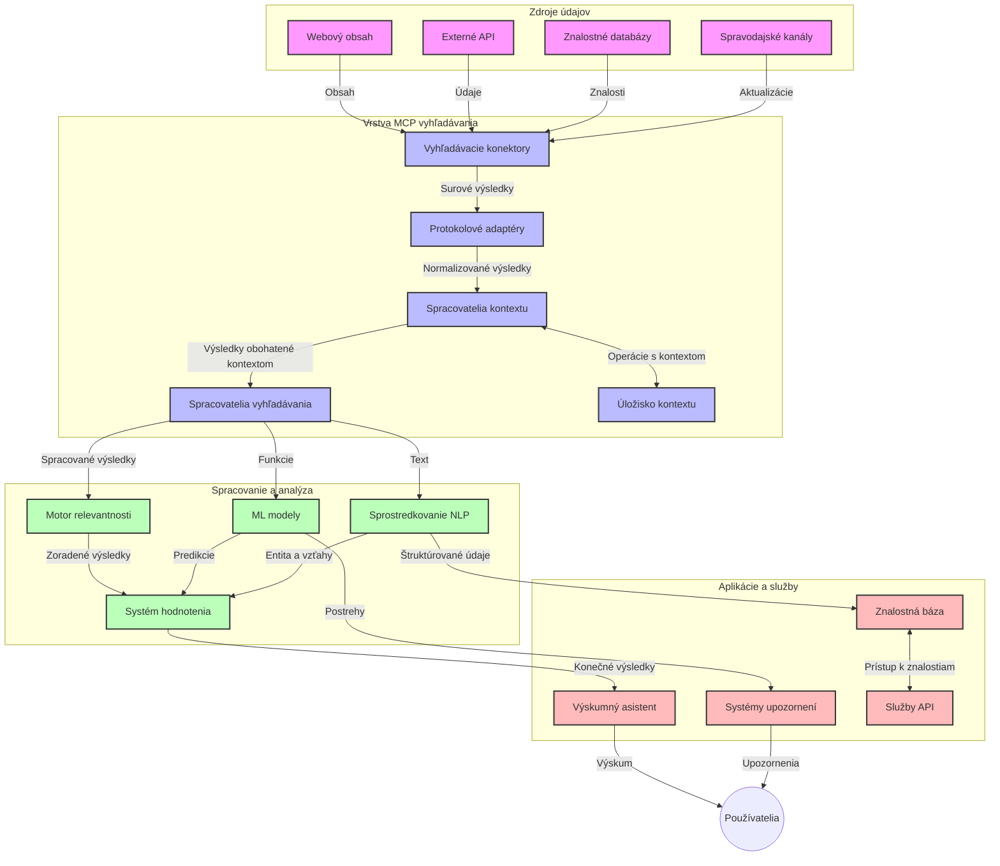
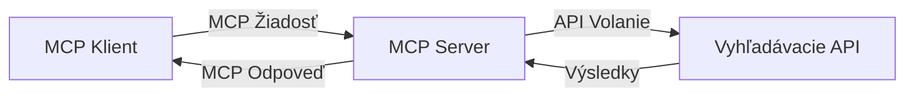
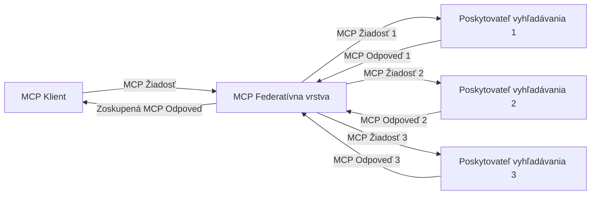
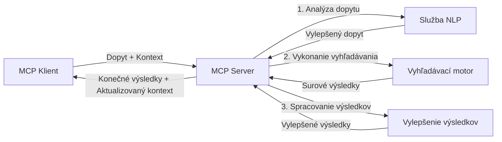

# Protokol kontextu modelu pre vyhľadávanie na webe v reálnom čase

## Prehľad

Vyhľadávanie na webe v reálnom čase sa stalo nevyhnutným v dnešnom informačne orientovanom prostredí, kde aplikácie potrebujú okamžitý prístup k aktuálnym informáciám z internetu, aby poskytli relevantné a včasné odpovede. Protokol kontextu modelu (MCP) predstavuje významný pokrok v optimalizácii týchto procesov vyhľadávania v reálnom čase, zlepšujúc efektívnosť vyhľadávania, zachovanie kontextovej integrity a celkovú výkonnosť systému.

Tento modul skúma, ako MCP transformuje vyhľadávanie na webe v reálnom čase tým, že poskytuje štandardizovaný prístup k správe kontextu naprieč AI modelmi, vyhľadávacími nástrojmi a aplikáciami.

### Čo sa naučíte

V tomto komplexnom návode objavíte:

- Ako MCP vytvára plynulý most medzi AI modelmi a možnosťami vyhľadávania na webe v reálnom čase
- Architektonické vzory na implementáciu efektívnych a škálovateľných riešení vyhľadávania s MCP
- Techniky na zachovanie kontextu vyhľadávania naprieč viacerými dopytmi a interakciami
- Praktické implementácie kódu v Pythone a JavaScripte pre rôzne scenáre vyhľadávania
- Metódy na vyváženie relevantnosti, aktuálnosti a výkonu v systémoch vyhľadávania poháňaných MCP

## Úvod do vyhľadávania na webe v reálnom čase

Vyhľadávanie na webe v reálnom čase je technologický prístup, ktorý umožňuje nepretržité dotazovanie, spracovanie a analýzu informácií z webu, ako sú publikované alebo aktualizované, čo umožňuje systémom poskytovať čerstvé a relevantné informácie s minimálnou latenciou. Na rozdiel od tradičných vyhľadávacích systémov, ktoré pracujú s indexovanými dátami starými hodiny alebo dni, vyhľadávanie v reálnom čase spracováva živé dáta z webu, prinášajúc poznatky a informácie zodpovedajúce aktuálnemu stavu obsahu online.

### Základné koncepty vyhľadávania na webe v reálnom čase:

- **Nepretržité spracovanie dopytov**: Vyhľadávacie dopyty sa spracovávajú na základe stále sa aktualizujúcich dátových zdrojov
- **Priorita aktuálnosti**: Systémy sú navrhnuté tak, aby uprednostňovali čerstvé informácie
- **Vyváženie relevantnosti**: Zachovanie rovnováhy medzi relevantnosťou a aktuálnosťou
- **Škálovateľná architektúra**: Systémy musia zvládnuť rôzne zaťaženie dopytov a objemy dát
- **Kontekstové porozumenie**: Udržiavanie používateľského kontextu naprieč iteráciami vyhľadávania je kľúčové pre zmysluplné výsledky
- **Dynamická reformulácia dopytov**: Adaptívne upravovanie dopytov na základe kontextu a predchádzajúcich výsledkov
- **Integrácia viacerých zdrojov**: Kombinovanie výsledkov z rôznych poskytovateľov vyhľadávania a webových zdrojov
- **Sémantické porozumenie**: Spracovanie dopytov a obsahu na základe významu, nie len kľúčových slov
- **Reálne časové radenie**: Neustále prispôsobovanie poradia výsledkov podľa novej dostupnej informácie

### Protokol kontextu modelu a vyhľadávanie na webe v reálnom čase

Protokol kontextu modelu (MCP) rieši niekoľko kľúčových výziev v prostredí vyhľadávania na webe v reálnom čase:

1. **Zachovanie kontextu vyhľadávania**: MCP štandardizuje spôsob udržiavania kontextu naprieč distribuovanými vyhľadávacími komponentmi, zabezpečujúc, že AI modely a spracovateľské uzly majú prístup k relevantnej histórii dopytov a preferenciám používateľa.

2. **Efektívna správa dopytov**: Poskytovaním štruktúrovaných mechanizmov pre prenos kontextu MCP znižuje režijné náklady spojené s opakovaním kontextu v každej iterácii vyhľadávania.

3. **Interoperabilita**: MCP vytvára spoločný jazyk na zdieľanie kontextu medzi rozličnými vyhľadávacími technológiami a AI modelmi, čo umožňuje flexibilnejšie a rozšíriteľné architektúry.

4. **Kontext optimalizovaný pre vyhľadávanie**: Implementácie MCP môžu uprednostniť, ktoré kontextové prvky sú najrelevantnejšie pre efektívne vyhľadávanie, čím optimalizujú výkon aj presnosť.

5. **Adaptívne spracovanie vyhľadávania**: So správnou správou kontextu prostredníctvom MCP môžu vyhľadávacie systémy dynamicky prispôsobovať spracovanie podľa vyvíjajúcich sa potrieb používateľa a informačné krajiny.

V moderných aplikáciách, od agregácie správ po výskumných asistentov, integrácia MCP s vyhľadávacími technológiami umožňuje inteligentnejšie, na kontext citlivé vyhľadávanie, ktoré môže poskytovať čoraz relevantnejšie výsledky počas pokračujúcich používateľských interakcií.

## Výučbové ciele

Na konci tejto lekcie budete schopní:

- Pochopiť základy vyhľadávania na webe v reálnom čase a jeho výzvy v moderných aplikáciách
- Vysvetliť, ako Protokol kontextu modelu (MCP) zlepšuje možnosti vyhľadávania v reálnom čase
- Implementovať riešenia vyhľadávania založené na MCP pomocou populárnych frameworkov a API
- Navrhovať a nasadzovať škálovateľné, vysoko výkonné vyhľadávacie architektúry s MCP
- Aplikovať koncepty MCP na rôzne použitia vrátane sémantického vyhľadávania, výskumných asistentov a AI-rozšíreného prehliadania
- Hodnotiť vznikajúce trendy a budúce inovácie v technológiách vyhľadávania založených na MCP
- Vyvíjať systémy vyhľadávania citlivé na kontext, ktoré sa učia z používateľských interakcií
- Integrovať schopnosti vyhľadávania webu do AI asistentov pomocou štandardizovaných protokolov MCP
- Vytvárať viacstupňové vyhľadávacie pipeline, ktoré postupne zlepšujú výsledky podľa kontextu
- Optimalizovať výkon vyhľadávania pri zachovaní komplexného povedomia o kontexte

### Definícia a význam

Vyhľadávanie na webe v reálnom čase zahŕňa nepretržité dotazovanie, získavanie a dodávanie informácií z webu s minimálnou latenciou. Na rozdiel od tradičných vyhľadávacích nástrojov, ktoré periódicky prehľadávajú a indexujú web, vyhľadávanie v reálnom čase sa snaží zobrazovať informácie ihneď, ako sú dostupné, čím umožňuje okamžitý prístup k najaktuálnejšiemu obsahu.

Kľúčové charakteristiky vyhľadávania na webe v reálnom čase zahŕňajú:

- **Čerstvosť**: Priorita pre najnovší obsah a aktualizácie
- **Nepretržité spracovanie**: Neustále monitorovanie nových informácií
- **Adaptácia dopytov**: Upresňovanie vyhľadávacích dopytov podľa kontextu a spätnej väzby
- **Okamžité doručenie**: Poskytovanie výsledkov vyhľadávania s minimálnym oneskorením
- **Zachovanie kontextu**: Stavať na predchádzajúcich dopytoch pre lepšiu relevantnosť

### Výzvy v tradičnom vyhľadávaní na webe

Tradičné prístupy vyhľadávania na webe čelia viacerým obmedzeniam, keď sú použité v reálnych scenároch:

1. **Fragmentácia kontextu**: Problémy so zachovaním kontextu vyhľadávania naprieč viacerými dopytmi
2. **Čerstvosť informácií**: Výzvy v prístupe a priorizácii najnovších informácií
3. **Integrácia**: Problémy s interoperabilitou medzi vyhľadávacími systémami a aplikáciami
4. **Problémy s latenciou**: Vyváženie rozsiahleho vyhľadávania a požiadaviek na rýchlosť odpovede
5. **Ladenie relevantnosti**: Zabezpečenie presnosti a relevantnosti pri zdôrazňovaní aktuálnosti

## Pochopenie Protokolu kontextu modelu (MCP) pre vyhľadávanie

### Čo je MCP v kontexte vyhľadávania?

Protokol kontextu modelu (MCP) je štandardizovaný komunikačný protokol navrhnutý na uľahčenie efektívnej interakcie medzi AI modelmi a aplikáciami. V kontexte vyhľadávania na webe v reálnom čase poskytuje MCP rámec pre:

- Zachovanie kontextu vyhľadávania počas sekvencií dopytov
- Štandardizáciu formátov vyhľadávacích dopytov a výsledkov
- Optimalizáciu prenosu vyhľadávacích parametrov a výsledkov
- Zlepšenie komunikácie medzi modelmi a vyhľadávacími nástrojmi

### Základné komponenty a architektúra

Architektúra MCP pre vyhľadávanie na webe v reálnom čase pozostáva z niekoľkých kľúčových komponentov:

1. **Spracovatelia kontextu dopytu**: Spravujú a udržiavajú kontext vyhľadávania naprieč viacerými dopytmi
2. **Vyhľadávacie procesory**: Spracovávajú prichádzajúce vyhľadávacie požiadavky pomocou kontextovo uvedomelých techník
3. **Adaptéry protokolov**: Konvertujú medzi rôznymi vyhľadávacími API, pričom zachovávajú kontext
4. **Ukladisko kontextu**: Efektívne ukladá a načítava históriu vyhľadávania a preferencie
5. **Vyhľadávacie konektory**: Pripájajú sa k rôznym vyhľadávacím nástrojom a webovým API



### Ako MCP zlepšuje vyhľadávanie na webe v reálnom čase

MCP rieši tradičné výzvy webového vyhľadávania prostredníctvom:

- **Kontekstuálnej kontinuity**: Udržiavanie vzťahov medzi dopytmi počas celej vyhľadávacej relácie
- **Optimalizovaného prenosu**: Znižovanie redundancie vo vyhľadávacích parametroch inteligentným manažmentom kontextu
- **Štandardizovaných rozhraní**: Poskytovanie konzistentných API pre vyhľadávacie komponenty
- **Zníženej latencie**: Minimalizovanie procesného režijného zaťaženia efektívnym spracovaním kontextu
- **Zvýšenej relevantnosti**: Zlepšenie relevantnosti vyhľadávania zachovaním používateľského zámeru naprieč viacerými dopytmi

## Integrácia a implementácia

Systémy vyhľadávania na webe v reálnom čase vyžadujú dôkladný architektonický návrh a implementáciu, aby sa zachovali výkon aj kontextová integrita. Protokol kontextu modelu ponúka štandardizovaný prístup k integrácii AI modelov a vyhľadávacích technológií, čo umožňuje sofistikovanejšie, na kontext citlivé vyhľadávacie pipeline.

### Prehľad integrácie MCP v architektúrach vyhľadávania

Implementácia MCP v prostrediach vyhľadávania v reálnom čase zahŕňa niekoľko hlavných úvah:

1. **Serializácia kontextu vyhľadávania**: MCP poskytuje efektívne mechanizmy na kódovanie kontextovej informácie v rámci vyhľadávacích požiadaviek, zabezpečujúc, že podstatný kontext nasleduje po dopyte cez celý spracovateľský reťazec. To zahŕňa štandardizované serializačné formáty optimalizované pre vyhľadávacie metaúdaje.

2. **Stavové spracovanie vyhľadávania**: MCP umožňuje inteligentnejšie stavové spracovanie tým, že udržiava konzistentnú reprezentáciu kontextu cez viaceré iterácie vyhľadávania. To je obzvlášť cenné v viacstupňových vyhľadávacích pipeline, kde upresňovanie kontextu zlepšuje výsledky.

3. **Rozšírenie a vylepšenie dopytov**: Implementácie MCP vo vyhľadávacích systémoch môžu umožniť sofistikované rozširovanie a vylepšovanie dopytov na základe nahromadeného kontextu, čo umožňuje čoraz relevantnejšie výsledky so zvyšujúcou sa dĺžkou vyhľadávacej relácie.

4. **Ukladanie výsledkov do cache a priorizácia**: Štandardizáciou správy kontextu MCP pomáha riadiť ukladanie výsledkov a ich priorizáciu, umožňujúc komponentom adaptovať sa na vyvíjajúci sa vyhľadávací kontext.

5. **Federácia a agregácia vyhľadávania**: MCP uľahčuje sofistikovanejšiu federáciu vyhľadávania naprieč viacerými backendmi poskytnutím štruktúrovaných reprezentácií vyhľadávacieho kontextu, čo dovolí zmysluplnejšiu agregáciu výsledkov z rôznych zdrojov.

Implementácia MCP naprieč rôznymi vyhľadávacími technológiami vytvára jednotný prístup k správe kontextu, čo redukuje potrebu vlastného integračného kódu a zároveň zvyšuje schopnosť systému udržať zmysluplný kontext počas vývoja dopytov.

### MCP v rôznych implementáciách vyhľadávania na webe

Tieto príklady sledujú aktuálnu špecifikáciu MCP, ktorá sa zameriava na protokol založený na JSON-RPC s rôznymi transportnými mechanizmami. Kód demonštruje, ako môžete implementovať vlastné integrácie vyhľadávania pri zachovaní plnej kompatibility s protokolom MCP.


<details>
<summary>Implementácia v Pythone s generickým vyhľadávacím API</summary>

```python
import asyncio
import json
import aiohttp
from typing import Dict, Any, Optional, List
from contextlib import asynccontextmanager
from collections.abc import AsyncIterator

# Importujte štandardné knižnice MCP
from mcp.client.session import ClientSession
from mcp.client.streamable_http import streamablehttp_client
from mcp.types import TextContent, CreateMessageRequestParams, CreateMessageResult
from mcp.server.fastmcp import FastMCP

# Vytvorte server FastMCP pre webové vyhľadávanie
search_server = FastMCP("WebSearch")

# Trieda na spracovanie operácií webového vyhľadávania
class WebSearchHandler:
    def __init__(self, api_endpoint: str, api_key: str):
        self.api_endpoint = api_endpoint
        self.api_key = api_key
        self.session = None
        
    async def initialize(self):
        """Initialize the HTTP session"""
        self.session = aiohttp.ClientSession(
            headers={"Authorization": f"Bearer {self.api_key}"}
        )
    
    async def close(self):
        """Close the HTTP session"""
        if self.session:
            await self.session.close()
            
    async def perform_search(self, query: str, max_results: int = 5, 
                           include_domains: List[str] = None, 
                           exclude_domains: List[str] = None,
                           time_period: str = "any") -> Dict[str, Any]:
        """Perform web search using the search API"""
        # Konštruujte parametre vyhľadávania
        search_params = {
            "q": query,
            "limit": max_results,
            "time": time_period
        }
        
        if include_domains:
            search_params["site"] = ",".join(include_domains)
            
        if exclude_domains:
            search_params["exclude_site"] = ",".join(exclude_domains)
        
        # Vykonajte požiadavku na vyhľadávanie
        try:
            async with self.session.get(
                self.api_endpoint,
                params=search_params
            ) as response:
                if response.status != 200:
                    error_text = await response.text()
                    raise Exception(f"Search API error: {response.status} - {error_text}")
                
                search_data = await response.json()
                
                # Pretransformujte odpoveď špecifickú pre API do štandardného formátu
                results = []
                for item in search_data.get("results", []):
                    results.append({
                        "title": item.get("title", ""),
                        "url": item.get("url", ""),
                        "snippet": item.get("snippet", ""),
                        "date": item.get("published_date", ""),
                        "source": item.get("source", "")
                    })
                
                return {
                    "query": query,
                    "totalResults": len(results),
                    "results": results
                }
        except Exception as e:
            print(f"Search API request error: {e}")
            raise

# Inicializujte spracovateľa vyhľadávania
search_handler = WebSearchHandler(
    api_endpoint="https://api.search-service.example/search",
    api_key="your-api-key-here"
)

# Nastavte životný cyklus na správu spracovateľa vyhľadávania
@asyncio.asynccontextmanager
async def app_lifespan(server: FastMCP):
    """Manage application lifecycle"""
    await search_handler.initialize()
    try:
        yield {"search_handler": search_handler}
    finally:
        await search_handler.close()

# Nastavte životný cyklus pre server
search_server = FastMCP("WebSearch", lifespan=app_lifespan)

# Zaregistrujte nástroj na webové vyhľadávanie
@search_server.tool()
async def web_search(query: str, max_results: int = 5, 
                   include_domains: List[str] = None,
                   exclude_domains: List[str] = None,
                   time_period: str = "any") -> Dict[str, Any]:
    """
    Search the web for information
    
    Args:
        query: The search query
        max_results: Maximum number of results to return (default: 5)
        include_domains: List of domains to include in search results
        exclude_domains: List of domains to exclude from search results
        time_period: Time period for results ("day", "week", "month", "any")
        
    Returns:
        Dictionary containing search results
    """
    ctx = search_server.get_context()
    search_handler = ctx.request_context.lifespan_context["search_handler"]
    
    results = await search_handler.perform_search(
        query=query,
        max_results=max_results,
        include_domains=include_domains,
        exclude_domains=exclude_domains,
        time_period=time_period
    )
    
    return results

# Príklad použitia klienta
async def client_example():
    # Pripojte sa k serveru vyhľadávania pomocou Streamable HTTP transportu
    async with streamablehttp_client("http://localhost:8000/mcp") as (read, write, _):
        async with ClientSession(read, write) as session:
            # Inicializujte pripojenie
            await session.initialize()
            
            # Zavolajte nástroj web_search
            search_results = await session.call_tool(
                "web_search", 
                {
                    "query": "latest developments in AI and Model Context Protocol",
                    "max_results": 5,
                    "time_period": "day",
                    "include_domains": ["github.com", "microsoft.com"]
                }
            )
            
            print(f"Search results: {search_results}")

# Príklad spustenia servera
if __name__ == "__main__":
    # Spustite server so Streamable HTTP transportom
    search_server.run(transport="streamable-http")
```
</details> 

<details>
<summary>Implementácia v JavaScripte s prehliadačovým vyhľadávaním</summary>


```javascript
// Implementácia MCP servera pre webové vyhľadávanie
import { McpServer, ResourceTemplate } from '@modelcontextprotocol/sdk/server/mcp.js';
import { StreamableHTTPServerTransport } from '@modelcontextprotocol/sdk/server/streamableHttp.js';
import { z } from 'zod';

// Vytvorte MCP server pre webové vyhľadávanie
const searchServer = new McpServer({
    name: "BrowserSearch",
    description: "A server that provides web search capabilities"
});

// Trieda vyhľadávacej služby
class SearchService {
    constructor(searchApiUrl, apiKey) {
        this.searchApiUrl = searchApiUrl;
        this.apiKey = apiKey;
    }

    async performSearch(parameters) {
        const {
            query = '',
            maxResults = 5,
            includeDomains = [],
            excludeDomains = [],
            timePeriod = 'any'
        } = parameters;
        
        // Sestavte vyhľadávaciu URL s parametrami
        const url = new URL(this.searchApiUrl);
        url.searchParams.append('q', query);
        url.searchParams.append('limit', maxResults);
        url.searchParams.append('time', timePeriod);
        
        if (includeDomains.length > 0) {
            url.searchParams.append('site', includeDomains.join(','));
        }
        
        if (excludeDomains.length > 0) {
            url.searchParams.append('exclude_site', excludeDomains.join(','));
        }
        
        try {
            const response = await fetch(url.toString(), {
                method: 'GET',
                headers: {
                    'Authorization': `Bearer ${this.apiKey}`,
                    'Content-Type': 'application/json'
                }
            });
            
            if (!response.ok) {
                const errorText = await response.text();
                throw new Error(`Search API error: ${response.status} - ${errorText}`);
            }
            
            const searchData = await response.json();
            
            // Preveďte odpoveď špecifickú pre API do štandardného formátu
            const results = searchData.results?.map(item => ({
                title: item.title || '',
                url: item.url || '',
                snippet: item.snippet || '',
                date: item.published_date || '',
                source: item.source || ''
            })) || [];
            
            return {
                query,
                totalResults: results.length,
                results
            };
        } catch (error) {
            console.error('Search API request error:', error);
            throw error;
        }
    }
}

// Inicializujte vyhľadávaciu službu
const searchService = new SearchService(
    'https://api.search-service.example/search',
    'your-api-key-here'
);

// Nastavte poskytovateľa kontextu pre server
searchServer.setContextProvider(() => {
    return {
        searchService
    };
});

// Zaregistrujte nástroj webového vyhľadávania
searchServer.tool({
    name: 'web_search',
    description: 'Search the web for information',
    parameters: {
        type: 'object',
        properties: {
            query: {
                type: 'string',
                description: 'The search query'
            },
            maxResults: {
                type: 'integer',
                description: 'Maximum number of results to return',
                default: 5
            },
            includeDomains: {
                type: 'array',
                items: { type: 'string' },
                description: 'List of domains to include in search results'
            },
            excludeDomains: {
                type: 'array',
                items: { type: 'string' },
                description: 'List of domains to exclude from search results'
            },
            timePeriod: {
                type: 'string',
                description: 'Time period for results',
                enum: ['day', 'week', 'month', 'any'],
                default: 'any'
            }
        },
        required: ['query']
    },
    handler: async (params, context) => {
        const { searchService } = context;
        return await searchService.performSearch(params);
    }
});

// Príklad klientského kódu na pripojenie k vyhľadávaciemu serveru
import { Client } from '@modelcontextprotocol/sdk/client/index.js';
import { StreamableHTTPClientTransport } from '@modelcontextprotocol/sdk/client/streamableHttp.js';

async function connectToSearchServer() {
    // Pripojiť sa k vyhľadávaciemu serveru
    const transport = new StreamableHTTPClientTransport(
        new URL('http://localhost:8000/mcp')
    );
    
    const client = new Client({
        name: 'search-client',
        version: '1.0.0'
    });
    
    await client.connect(transport);
    
    // Spustite vyhľadávací nástroj
    const searchResults = await client.callTool({
        name: 'web_search',
        arguments: {
            query: 'Model Context Protocol implementation examples',
            maxResults: 10,
            timePeriod: 'week',
            includeDomains: ['github.com', 'docs.microsoft.com']
        }
    });
    
    console.log('Search results:', searchResults);
    
    // Vyčistenie
    await client.disconnect();
}

// Spustite server
const transport = new StreamableHTTPServerTransport();
await searchServer.connect(transport);
console.log('Search server running at http://localhost:8000/mcp');

// V samostatnom procese alebo po spustení servera
// connectToSearchServer().catch(console.error);
```
</details> 


## Zásady používania kódových príkladov

> **Dôležitá poznámka**: Nasledujúce príklady kódu ukazujú integráciu Protokolu kontextu modelu (MCP) s funkciami webového vyhľadávania. Aj keď nasledujú vzory a štruktúry oficiálnych SDK MCP, boli zjednodušené pre výučbové účely.
> 
> Tieto príklady predstavujú:
> 
> 1. **Implementáciu v Pythone**: Implementáciu servera FastMCP, ktorá poskytuje nástroj na vyhľadávanie na webe a pripája sa k externému vyhľadávaciemu API. Tento príklad demonštruje správne riadenie životného cyklu, správu kontextu a implementáciu nástroja podľa vzorov [oficiálneho MCP Python SDK](https://github.com/modelcontextprotocol/python-sdk). Server využíva odporúčaný Streamable HTTP transport, ktorý nahradil starší SSE transport pre produkčné nasadenia.
> 
> 2. **Implementáciu v JavaScripte**: Typovo bezpečnú implementáciu v TypeScripte/JavaScripte používajúcu vzor FastMCP z [oficiálneho MCP TypeScript SDK](https://github.com/modelcontextprotocol/typescript-sdk) na vytvorenie vyhľadávacieho servera so správnou definíciou nástrojov a klientskymi pripojeniami. Nasleduje najnovšie odporúčané vzory pre správu relácií a zachovanie kontextu.
> 
> Tieto príklady by pre produkčné použitie vyžadovali doplnkové spracovanie chýb, autentifikáciu a špecifický integračný kód API. Ukázané API endpointy (`https://api.search-service.example/search`) sú zástupné a musia byť nahradené skutočnými koncovými bodmi vyhľadávacieho servisu.
> 
> Pre kompletné implementačné detaily a najaktuálnejšie prístupy, prosím konzultujte [oficiálnu špecifikáciu MCP](https://spec.modelcontextprotocol.io/) a dokumentáciu SDK.

## Základné koncepty

### Rámec protokolu kontextu modelu (MCP)

Základom je Protokol kontextu modelu, ktorý poskytuje štandardizovaný spôsob výmeny kontextu medzi AI modelmi, aplikáciami a službami. Vo vyhľadávaní na webe v reálnom čase je tento rámec nevyhnutný na vytvorenie koherentných, viackolových vyhľadávacích zážitkov. Kľúčové komponenty zahŕňajú:

1. **Klient-server architektúru**: MCP vytvára jasné oddelenie medzi vyhľadávacími klientmi (žiadajúcimi) a vyhľadávacími servermi (poskytovateľmi), čo umožňuje flexibilné modely nasadenia.

2. **Komunikáciu JSON-RPC**: Protokol používa JSON-RPC na výmenu správ, čo je kompatibilné s webovými technológiami a ľahko sa implementuje na rôznych platformách.

3. **Správu kontextu**: MCP definuje štruktúrované metódy na udržiavanie, aktualizáciu a využívanie vyhľadávacieho kontextu počas viacerých interakcií.

4. **Definície nástrojov**: Vyhľadávacie schopnosti sú sprístupnené ako štandardizované nástroje s jasne definovanými parametrami a návratovými hodnotami.

5. **Podpora streamovania**: Protokol podporuje streamovanie výsledkov, čo je zásadné pre vyhľadávanie v reálnom čase, kde výsledky môžu prichádzať postupne.

### Vzory integrácie webového vyhľadávania

Pri integrácii MCP s webovým vyhľadávaním vzniká niekoľko vzorov:

#### 1. Priama integrácia poskytovateľa vyhľadávania



V tomto vzore server MCP priamo komunikuje s jedným alebo viacerými vyhľadávacími API, prevádza MCP požiadavky na API-specifické volania a formátuje výsledky ako MCP odpovede.

#### 2. Federované vyhľadávanie so zachovaním kontextu



Tento vzor rozdeľuje vyhľadávacie dopyty medzi viacerých MCP-kompatibilných poskytovateľov vyhľadávania, z ktorých každý sa môže špecializovať na rôzne typy obsahu alebo vyhľadávacích kapacít, pričom udržiava jednotný kontext.

#### 3. Reťazec vyhľadávania obohatený kontextom



V tomto vzore je vyhľadávací proces rozdelený do viacerých etáp, pričom kontext je na každom kroku obohacovaný, čo vedie k postupne relevantnejším výsledkom.

### Komponenty kontextu vyhľadávania

V MCP-založenom webovom vyhľadávaní kontext zvyčajne obsahuje:

- **Históriu dopytov**: Predchádzajúce vyhľadávacie dopyty v relácii
- **Preferencie používateľa**: Jazyk, región, nastavenia bezpečného vyhľadávania
- **Históriu interakcií**: Ktoré výsledky boli kliknuté, čas strávený pri výsledkoch
- **Vyhľadávacie parametre**: Filtre, zoradenia a ďalšie modifikátory vyhľadávania
- **Doménové znalosti**: Kontext týkajúci sa špecifickej témy vyhľadávania
- **Časový kontext**: Faktory relevantnosti založené na čase
- **Preferované zdroje**: Dôveryhodné alebo preferované informačné zdroje

## Použitie a aplikácie

### Výskum a zhromažďovanie informácií

MCP zlepšuje pracovné postupy výskumu takto:

- Zachovanie výskumného kontextu naprieč vyhľadávacími reláciami
- Umožnenie sofistikovanejších a kontextovo relevantných dopytov
- Podpora federácie vyhľadávania z viacerých zdrojov
- Facilita extrakciu poznatkov z výsledkov vyhľadávania

### Monitorovanie noviniek a trendov v reálnom čase

Vyhľadávanie poháňané MCP prináša výhody pre monitorovanie správ:

- Objavovanie vznikajúcich správ takmer v reálnom čase
- Kontextové filtrovanie relevantných informácií
- Sledovanie tém a entít naprieč viacerými zdrojmi
- Personalizované upozornenia na správy podľa používateľského kontextu

### AI-rozšírené prehliadanie a výskum

MCP vytvára nové možnosti pre AI-rozšírené prehliadanie:

- Kontextovo závislé návrhy vyhľadávania podľa aktuálnej aktivity v prehliadači
- Plynulá integrácia webového vyhľadávania s asistentmi poháňanými LLM
- Viackolové spresňovanie vyhľadávania so zachovaným kontextom
- Vylepšená kontrola faktov a overovanie informácií

## Budúce trendy a inovácie

### Vývoj MCP vo webovom vyhľadávaní

S výhľadom do budúcnosti očakávame, že MCP sa bude vyvíjať tak, aby riešil:
- **Multimodálne vyhľadávanie**: Integrácia vyhľadávania textu, obrázkov, zvuku a videa so zachovaním kontextu
- **Decentralizované vyhľadávanie**: Podpora distribuovaných a federovaných vyhľadávacích ekosystémov
- **Ochrana súkromia pri vyhľadávaní**: Kontextovo uvedomelé mechanizmy vyhľadávania šetriace súkromie
- **Porozumenie dotazom**: Hlboké sémantické spracovanie dotazov v prirodzenom jazyku

### Potenciálne technologické pokroky

Nové technológie, ktoré ovplyvnia budúcnosť vyhľadávania MCP:

1. **Neuronové vyhľadávacie architektúry**: Vyhľadávacie systémy založené na embeddingoch optimalizované pre MCP
2. **Personalizovaný vyhľadávací kontext**: Učenie sa individuálnych vzorcov vyhľadávania používateľa v čase
3. **Integrácia znalostných grafov**: Kontextové vyhľadávanie vylepšené doménovo špecifickými znalostnými grafmi
4. **Medzimodálny kontext**: Zachovanie kontextu naprieč rôznymi modalitami vyhľadávania

## Praktické cvičenia

### Cvičenie 1: Nastavenie základného MCP vyhľadávacieho procesu

V tomto cvičení sa naučíte:
- Konfigurovať základné MCP vyhľadávacie prostredie
- Implementovať spracovateľov kontextu pre webové vyhľadávanie
- Testovať a overovať zachovanie kontextu počas viacerých vyhľadávacích iterácií

### Cvičenie 2: Vytvorenie výskumného asistenta s MCP vyhľadávaním

Vytvorte plnú aplikáciu, ktorá:
- Spracováva výskumné otázky v prirodzenom jazyku
- Realizuje kontextovo uvedomelé webové vyhľadávanie
- Syntetizuje informácie z viacerých zdrojov
- Predstavuje usporiadané výsledky výskumu

### Cvičenie 3: Implementácia federovaného vyhľadávania z viacerých zdrojov s MCP

Pokročilé cvičenie pokrývajúce:
- Kontextovo uvedomelé rozosielanie dotazov do viacerých vyhľadávacích motorov
- Hodnotenie a agregáciu výsledkov
- Kontextovú deduplikáciu výsledkov vyhľadávania
- Spracovanie metadát špecifických pre zdroj

## Ďalšie zdroje

- [Model Context Protocol Specification](https://spec.modelcontextprotocol.io/) - Oficiálna špecifikácia MCP a detailná protokolová dokumentácia
- [Model Context Protocol Documentation](https://modelcontextprotocol.io/) - Podrobné návody a implementačné pokyny
- [MCP Python SDK](https://github.com/modelcontextprotocol/python-sdk) - Oficiálna implementácia MCP protokolu v Pythone
- [MCP TypeScript SDK](https://github.com/modelcontextprotocol/typescript-sdk) - Oficiálna implementácia MCP protokolu v TypeScripte
- [MCP Reference Servers](https://github.com/modelcontextprotocol/servers) - Referenčné implementácie MCP serverov
- [Bing Web Search API Documentation](https://learn.microsoft.com/en-us/bing/search-apis/bing-web-search/overview) - Webové vyhľadávanie Microsoftu API
- [Google Custom Search JSON API](https://developers.google.com/custom-search/v1/overview) - Programovateľný vyhľadávací engine Google
- [SerpAPI Documentation](https://serpapi.com/search-api) - API výsledkov vyhľadávacích stránok
- [Meilisearch Documentation](https://www.meilisearch.com/docs) - Open-source vyhľadávací engine
- [Elasticsearch Documentation](https://www.elastic.co/guide/index.html) - Distribuovaný vyhľadávací a analytický engine
- [LangChain Documentation](https://python.langchain.com/docs/get_started/introduction) - Vytváranie aplikácií s LLM

## Výsledky učenia

Po dokončení tohto modulu budete schopní:

- Pochopiť základy vyhľadávania na webe v reálnom čase a jeho výzvy
- Vysvetliť, ako Model Context Protocol (MCP) rozširuje možnosti vyhľadávania v reálnom čase
- Implementovať vyhľadávacie riešenia založené na MCP pomocou populárnych frameworkov a API
- Návrh a nasadenie škálovateľných, vysoko výkonných vyhľadávacích architektúr s MCP
- Použiť koncepty MCP pre rôzne prípady použitia vrátane sémantického vyhľadávania, výskumnej asistencie a AI rozšíreného prehliadania
- Hodnotiť nové trendy a budúce inovácie v technológiách vyhľadávania založeného na MCP

### Úvahy o dôvere a bezpečnosti

Pri implementácii webových vyhľadávacích riešení založených na MCP si pamätajte tieto dôležité princípy zo špecifikácie MCP:

1. **Súhlas a kontrola používateľa**: Používatelia musia explicitne súhlasiť a rozumieť každému prístupu k údajom a operáciám. To je obzvlášť dôležité pri implementáciách webového vyhľadávania, ktoré môžu pristupovať k externým zdrojom údajov.

2. **Ochrana súkromia údajov**: Zabezpečte vhodné nakladanie s dopytmi a výsledkami vyhľadávania, najmä ak môžu obsahovať citlivé informácie. Implementujte adekvátne prístupové kontroly na ochranu používateľských dát.

3. **Bezpečnosť nástrojov**: Implementujte riadne autorizovanie a validáciu vyhľadávacích nástrojov, pretože predstavujú potenciálne bezpečnostné riziká cez spustenie ľubovoľného kódu. Popisy správania nástrojov by mali byť považované za nedôveryhodné, pokiaľ nepochádzajú z dôveryhodného servera.

4. **Jasná dokumentácia**: Poskytnite jasnú dokumentáciu o schopnostiach, obmedzeniach a bezpečnostných opatreniach vašej MCP implementácie vyhľadávania, v súlade s implementačnými usmerneniami zo špecifikácie MCP.

5. **Robustné postupy súhlasu**: Vytvorte robustné postupy získavania súhlasu a autorizácie, ktoré jasne vysvetľujú, čo každý nástroj robí pred jeho povolením, najmä pre nástroje, ktoré interagujú s externými webovými zdrojmi.

Pre kompletné detaily o bezpečnosti a úvahe o dôvere MCP sa obráťte na [oficiálnu dokumentáciu](https://modelcontextprotocol.io/specification/2025-11-25/basic/security_best_practices).

## Čo ďalej

- [5.12 Overovanie Entra ID pre Model Context Protocol servery](../mcp-security-entra/README.md)

---

<!-- CO-OP TRANSLATOR DISCLAIMER START -->
**Vyhlásenie o zodpovednosti**:
Tento dokument bol preložený pomocou AI prekladateľskej služby [Co-op Translator](https://github.com/Azure/co-op-translator). Hoci sa snažíme o presnosť, vezmite prosím na vedomie, že automatické preklady môžu obsahovať chyby alebo nepresnosti. Pôvodný dokument v jeho natívnom jazyku by mal byť považovaný za autoritatívny zdroj. Pre kritické informácie sa odporúča profesionálny ľudský preklad. Nie sme zodpovední za žiadne nedorozumenia alebo nesprávne interpretácie vyplývajúce z použitia tohto prekladu.
<!-- CO-OP TRANSLATOR DISCLAIMER END -->