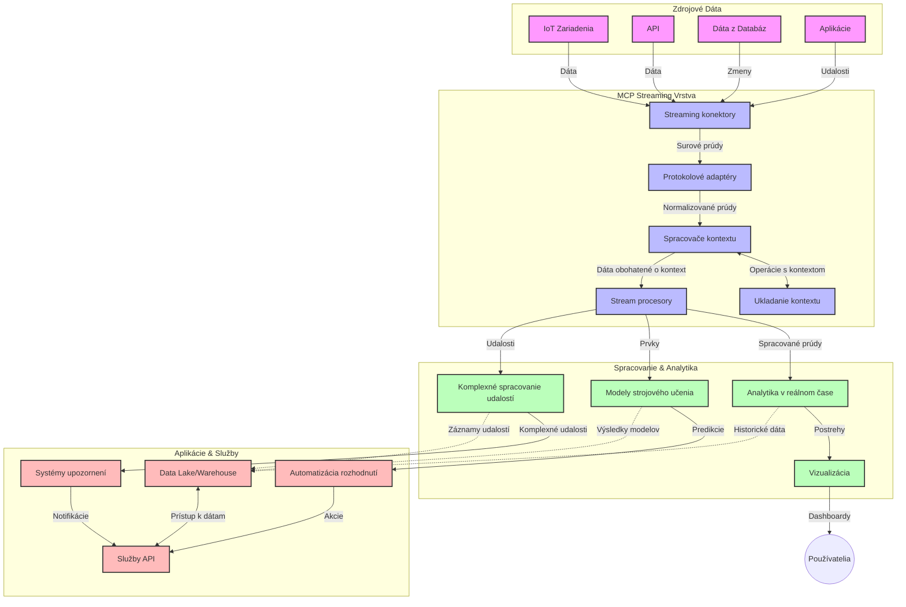

# Protokol Model Context pre streamovanie dát v reálnom čase

## Prehľad

Streamovanie dát v reálnom čase sa stalo nevyhnutným v dnešnom svete riadenom dátami, kde podniky a aplikácie vyžadujú okamžitý prístup k informáciám na prijímanie včasných rozhodnutí. Protokol Model Context (MCP) predstavuje významný pokrok v optimalizácii týchto procesov streamovania v reálnom čase, zlepšuje efektívnosť spracovania dát, udržiava kontextovú integritu a zvyšuje celkový výkon systému.

Tento modul skúma, ako MCP transformuje streamovanie dát v reálnom čase poskytovaním štandardizovaného prístupu k správe kontextu naprieč AI modelmi, streamovacími platformami a aplikáciami.

## Úvod do streamovania dát v reálnom čase

Streamovanie dát v reálnom čase je technologický paradigmat, ktorý umožňuje kontinuálny prenos, spracovanie a analýzu dát počas ich generovania, čo umožňuje systémom okamžite reagovať na nové informácie. Na rozdiel od tradičného dávkového spracovania, ktoré pracuje so statickými dátovými súpravami, streamovanie spracováva dáta v pohybe, poskytuje poznatky a akcie s minimálnou latenciou.

### Základné pojmy streamovania dát v reálnom čase:

- **Kontinuálny tok dát**: Dáta sú spracovávané ako kontinuálny, nikdy nekončiaci tok udalostí alebo záznamov.
- **Spracovanie s nízkou latenciou**: Systémy sú navrhnuté tak, aby minimalizovali čas medzi generovaním a spracovaním dát.
- **Škálovateľnosť**: Architektúry streamovania musia zvládnuť variabilné objemy a rýchlosti dát.
- **Odolnosť voči chybám**: Systémy musia byť odolné voči chybám, aby zabezpečili neprerušený tok dát.
- **Stavové spracovanie**: Udržiavanie kontextu naprieč udalosťami je kľúčové pre zmysluplnú analýzu.

### Protokol Model Context a streamovanie v reálnom čase

Protokol Model Context (MCP) rieši niekoľko kritických výziev v prostredí streamovania v reálnom čase:

1. **Kontextová kontinuita**: MCP štandardizuje spôsob, akým sa kontext udržiava cez distribuované streamovacie komponenty, zabezpečujúc, že AI modely a spracovateľské uzly majú prístup k relevantnému historickému a environmetálnemu kontextu.

2. **Efektívna správa stavu**: Poskytovaním štruktúrovaných mechanizmov pre prenos kontextu MCP znižuje režijné náklady na správu stavu v streamingových pipeline.

3. **Interoperabilita**: MCP vytvára spoločný jazyk pre zdieľanie kontextu medzi rôznymi streamingovými technológiami a AI modelmi, umožňujúc flexibilnejšie a rozšíriteľné architektúry.

4. **Streamingom optimalizovaný kontext**: Implementácie MCP môžu priorizovať, ktoré kontextové prvky sú najrelevantnejšie pre rozhodovanie v reálnom čase, optimalizujúc tak výkon aj presnosť.

5. **Adaptívne spracovanie**: S riadnym manažmentom kontextu cez MCP môžu streamovacie systémy dynamicky prispôsobovať spracovanie na základe vyvíjajúcich sa podmienok a vzorcov v dátach.

V moderných aplikáciách od IoT senzorových sietí až po finančné obchodné platformy integrácia MCP so streamingovými technológiami umožňuje inteligentnejšie, kontextovo uvedomelé spracovanie, ktoré dokáže vhodne reagovať na komplexné, vyvíjajúce sa situácie v reálnom čase.

## Ciele učenia

Na konci tejto lekcie budete schopní:

- Pochopiť základy streamovania dát v reálnom čase a jeho výzvy
- Vysvetliť, ako Protokol Model Context (MCP) zlepšuje streamovanie dát v reálnom čase
- Implementovať streamingové riešenia založené na MCP pomocou populárnych frameworkov ako Kafka a Pulsar
- Navrhnúť a nasadiť odolné a výkonné streamingové architektúry s MCP
- Aplikovať koncepty MCP na príklady použitia v IoT, finančnom obchodovaní a analytike riadenej AI
- Vyhodnotiť vznikajúce trendy a budúce inovácie v technológiách streamovania založených na MCP


### Definícia a význam

Streamovanie dát v reálnom čase zahŕňa kontinuálnu generáciu, spracovanie a doručovanie dát s minimálnou latenciou. Na rozdiel od dávkového spracovania, kde sa dáta zhromažďujú a spracovávajú v skupinách, sú streamingové dáta spracovávané postupne pri ich príchode, čo umožňuje okamžité poznatky a akcie.

Kľúčové charakteristiky streamovania dát v reálnom čase zahŕňajú:

- **Nízka latencia**: Spracovanie a analýza dát v milisekundách až sekundách
- **Kontinuálny tok**: Nepretržité prúdy dát z rôznych zdrojov
- **Okamžité spracovanie**: Analýza dát hneď pri ich príchode namiesto dávok
- **Architektúra riadená udalosťami**: Reakcia na udalosti, keď sa dejú

### Výzvy v tradičnom streamovaní dát

Tradičné prístupy k streamovaniu dát čelia niekoľkým obmedzeniam:

1. **Strata kontextu**: Ťažkosti s udržiavaním kontextu naprieč distribuovanými systémami
2. **Problémy so škálovateľnosťou**: Výzvy pri škálovaní na spracovanie veľkých objemov a rýchlostí dát
3. **Zložitá integrácia**: Problémy s interoperabilitou medzi rôznymi systémami
4. **Riadenie latencie**: Vyváženie priepustnosti a času spracovania
5. **Konzistentnosť dát**: Zabezpečenie presnosti a úplnosti dát v rámci streamu

## Pochopenie Protokolu Model Context (MCP)

### Čo je MCP?

Protokol Model Context (MCP) je štandardizovaný komunikačný protokol navrhnutý na uľahčenie efektívnej interakcie medzi AI modelmi a aplikáciami. V kontexte streamovania dát v reálnom čase poskytuje MCP rámec pre:

- Zachovanie kontextu počas celej dátovej pipeline
- Štandardizáciu formátov výmeny dát
- Optimalizáciu prenosu veľkých dátových súborov
- Zlepšenie komunikácie model-model a model-aplikácia

### Základné komponenty a architektúra

Architektúra MCP pre streamovanie v reálnom čase pozostáva z niekoľkých kľúčových komponentov:

1. **Správcovia kontextu**: Riadia a udržiavajú kontextové informácie naprieč streamingovou pipeline
2. **Spracovatelia streamov**: Spracovávajú prichádzajúce dátové toky s využitím kontextovo uvedomelých techník
3. **Protokolové adaptéry**: Konvertujú medzi rôznymi streamingovými protokolmi pri zachovaní kontextu
4. **Úložisko kontextu**: Efektívne ukladá a načítava kontextové informácie
5. **Streamingové konektory**: Pripájajú sa k rôznym streamingovým platformám (Kafka, Pulsar, Kinesis, atď.)



### Ako MCP zlepšuje spracovanie dát v reálnom čase

MCP rieši tradičné výzvy streamovania prostredníctvom:

- **Integrita kontextu**: Udržiavanie vzťahov medzi dátovými bodmi v celej pipeline
- **Optimalizovaný prenos**: Znižovanie redundancie vo výmene dát inteligentným manažmentom kontextu
- **Štandardizované rozhrania**: Poskytovanie konzistentných API pre streamingové komponenty
- **Znížená latencia**: Minimalizovanie režijných nákladov spracovania efektívnym manažmentom kontextu
- **Zlepšená škálovateľnosť**: Podpora horizontálneho škálovania pri zachovaní kontextu

## Integrácia a implementácia

Systémy streamovania dát v reálnom čase vyžadujú starostlivý architektonický návrh a implementáciu na udržanie výkonu aj kontextovej integrity. Protokol Model Context ponúka štandardizovaný prístup k integrácii AI modelov a streamingových technológií, čo umožňuje sofistikovanejšie pipeline spracovania s vedomosťou kontextu.

### Prehľad integrácie MCP v streamingových architektúrach

Implementácia MCP v prostredí streamovania v reálnom čase zahŕňa niekoľko kľúčových úvah:

1. **Serializácia a prenos kontextu**: MCP poskytuje efektívne mechanizmy kódovania kontextových informácií v dátových paketoch streamu, zabezpečujúc, že podstatný kontext sleduje dáta počas celej spracovateľskej pipeline. Zahŕňa štandardizované formáty serializácie optimalizované pre streamingový prenos.

2. **Stavové spracovanie streamu**: MCP umožňuje inteligentnejšie stavové spracovanie udržiavaním konzistentnej reprezentácie kontextu naprieč spracovateľskými uzlami. Toto je obzvlášť cenné v distribuovaných streamingových architektúrach, kde je správa stavu tradične náročná.

3. **Udalosťové a spracovateľské časy**: Implementácie MCP v streamingových systémoch musia riešiť bežný problém rozlišovania medzi časom výskytu udalostí a časom ich spracovania. Protokol môže začleniť časový kontext, ktorý uchováva sémantiku času udalosti.

4. **Manažment spätného tlaku**: Štandardizáciou správy kontextu MCP pomáha riadiť spätný tlak v streamingových systémoch, umožňujúc komponentom komunikovať svoje kapacity spracovania a prispôsobovať tok údajov.

5. **Oknovanie a agregácia kontextu**: MCP umožňuje sofistikovanejšie oknovanie operácií poskytovaním štruktúrovaných reprezentácií časových a relačných kontextov, čím umožňuje zmysluplnejšie agregácie naprieč tokmi udalostí.

6. **Presné jednokrát spracovanie**: V streamingových systémoch vyžadujúcich presné jednokrát sémantiky môže MCP začleniť metadata spracovania na sledovanie a overovanie stavu spracovania naprieč distribuovanými komponentmi.

Implementácia MCP v rôznych streamingových technológiách vytvára jednotný prístup k správe kontextu, znižuje potrebu vlastného integračného kódu a zároveň zlepšuje schopnosť systému udržiavať zmysluplný kontext počas prúdenia dát cez pipeline.

### MCP v rôznych frameworkoch pre streamovanie dát

Tieto príklady nasledujú aktuálnu špecifikáciu MCP, ktorá sa zameriava na protokol založený na JSON-RPC s odlišnými transportnými mechanizmami. Kód demonštruje, ako možno implementovať vlastné transporty, ktoré integrujú streamingové platformy ako Kafka a Pulsar pri zachovaní plnej kompatibility s protokolom MCP.

Príklady sú navrhnuté tak, aby ukázali, ako možno streamingové platformy integrovať s MCP na zabezpečenie spracovania dát v reálnom čase pri zachovaní kontextu, ktorý je pre MCP kľúčový. Tento prístup zabezpečuje, že ukážkové kódy presne odrážajú aktuálny stav špecifikácie MCP k júnu 2025.

MCP môže byť integrovaný do populárnych streamingových frameworkov vrátane:

#### Integrácia Apache Kafka

```python
import asyncio
import json
from typing import Dict, Any, Optional
from confluent_kafka import Consumer, Producer, KafkaError
from mcp.client import Client, ClientCapabilities
from mcp.core.message import JsonRpcMessage
from mcp.core.transports import Transport

# Vlastná trieda transportu na prepojenie MCP s Kafka
class KafkaMCPTransport(Transport):
    def __init__(self, bootstrap_servers: str, input_topic: str, output_topic: str):
        self.bootstrap_servers = bootstrap_servers
        self.input_topic = input_topic
        self.output_topic = output_topic
        self.producer = Producer({'bootstrap.servers': bootstrap_servers})
        self.consumer = Consumer({
            'bootstrap.servers': bootstrap_servers,
            'group.id': 'mcp-client-group',
            'auto.offset.reset': 'earliest'
        })
        self.message_queue = asyncio.Queue()
        self.running = False
        self.consumer_task = None
        
    async def connect(self):
        """Connect to Kafka and start consuming messages"""
        self.consumer.subscribe([self.input_topic])
        self.running = True
        self.consumer_task = asyncio.create_task(self._consume_messages())
        return self
        
    async def _consume_messages(self):
        """Background task to consume messages from Kafka and queue them for processing"""
        while self.running:
            try:
                msg = self.consumer.poll(1.0)
                if msg is None:
                    await asyncio.sleep(0.1)
                    continue
                
                if msg.error():
                    if msg.error().code() == KafkaError._PARTITION_EOF:
                        continue
                    print(f"Consumer error: {msg.error()}")
                    continue
                
                # Parsovať hodnotu správy ako JSON-RPC
                try:
                    message_str = msg.value().decode('utf-8')
                    message_data = json.loads(message_str)
                    mcp_message = JsonRpcMessage.from_dict(message_data)
                    await self.message_queue.put(mcp_message)
                except Exception as e:
                    print(f"Error parsing message: {e}")
            except Exception as e:
                print(f"Error in consumer loop: {e}")
                await asyncio.sleep(1)
    
    async def read(self) -> Optional[JsonRpcMessage]:
        """Read the next message from the queue"""
        try:
            message = await self.message_queue.get()
            return message
        except Exception as e:
            print(f"Error reading message: {e}")
            return None
    
    async def write(self, message: JsonRpcMessage) -> None:
        """Write a message to the Kafka output topic"""
        try:
            message_json = json.dumps(message.to_dict())
            self.producer.produce(
                self.output_topic,
                message_json.encode('utf-8'),
                callback=self._delivery_report
            )
            self.producer.poll(0)  # Spustiť spätné volania
        except Exception as e:
            print(f"Error writing message: {e}")
    
    def _delivery_report(self, err, msg):
        """Kafka producer delivery callback"""
        if err is not None:
            print(f'Message delivery failed: {err}')
        else:
            print(f'Message delivered to {msg.topic()} [{msg.partition()}]')
    
    async def close(self) -> None:
        """Close the transport"""
        self.running = False
        if self.consumer_task:
            self.consumer_task.cancel()
            try:
                await self.consumer_task
            except asyncio.CancelledError:
                pass
        self.consumer.close()
        self.producer.flush()

# Príklad použitia Kafka MCP transportu
async def kafka_mcp_example():
    # Vytvoriť MCP klienta s Kafka transportom
    client = Client(
        {"name": "kafka-mcp-client", "version": "1.0.0"},
        ClientCapabilities({})
    )
    
    # Vytvoriť a pripojiť Kafka transport
    transport = KafkaMCPTransport(
        bootstrap_servers="localhost:9092",
        input_topic="mcp-responses",
        output_topic="mcp-requests"
    )
    
    await client.connect(transport)
    
    try:
        # Inicializovať MCP reláciu
        await client.initialize()
        
        # Príklad spustenia nástroja cez MCP
        response = await client.execute_tool(
            "process_data",
            {
                "data": "sample data",
                "metadata": {
                    "source": "sensor-1",
                    "timestamp": "2025-06-12T10:30:00Z"
                }
            }
        )
        
        print(f"Tool execution response: {response}")
        
        # Čisté ukončenie
        await client.shutdown()
    finally:
        await transport.close()

# Spustiť príklad
if __name__ == "__main__":
    asyncio.run(kafka_mcp_example())
```

#### Implementácia Apache Pulsar

```python
import asyncio
import json
import pulsar
from typing import Dict, Any, Optional
from mcp.core.message import JsonRpcMessage
from mcp.core.transports import Transport
from mcp.server import Server, ServerOptions
from mcp.server.tools import Tool, ToolExecutionContext, ToolMetadata

# Vytvorte vlastný MCP transport používajúci Pulsar
class PulsarMCPTransport(Transport):
    def __init__(self, service_url: str, request_topic: str, response_topic: str):
        self.service_url = service_url
        self.request_topic = request_topic
        self.response_topic = response_topic
        self.client = pulsar.Client(service_url)
        self.producer = self.client.create_producer(response_topic)
        self.consumer = self.client.subscribe(
            request_topic,
            "mcp-server-subscription",
            consumer_type=pulsar.ConsumerType.Shared
        )
        self.message_queue = asyncio.Queue()
        self.running = False
        self.consumer_task = None
    
    async def connect(self):
        """Connect to Pulsar and start consuming messages"""
        self.running = True
        self.consumer_task = asyncio.create_task(self._consume_messages())
        return self
    
    async def _consume_messages(self):
        """Background task to consume messages from Pulsar and queue them for processing"""
        while self.running:
            try:
                # Nezablokujúce prijímanie s časovým limitom
                msg = self.consumer.receive(timeout_millis=500)
                
                # Spracujte správu
                try:
                    message_str = msg.data().decode('utf-8')
                    message_data = json.loads(message_str)
                    mcp_message = JsonRpcMessage.from_dict(message_data)
                    await self.message_queue.put(mcp_message)
                    
                    # Potvrďte správu
                    self.consumer.acknowledge(msg)
                except Exception as e:
                    print(f"Error processing message: {e}")
                    # Negatívne potvrďte, ak došlo k chybe
                    self.consumer.negative_acknowledge(msg)
            except Exception as e:
                # Spracujte časový limit alebo iné výnimky
                await asyncio.sleep(0.1)
    
    async def read(self) -> Optional[JsonRpcMessage]:
        """Read the next message from the queue"""
        try:
            message = await self.message_queue.get()
            return message
        except Exception as e:
            print(f"Error reading message: {e}")
            return None
    
    async def write(self, message: JsonRpcMessage) -> None:
        """Write a message to the Pulsar output topic"""
        try:
            message_json = json.dumps(message.to_dict())
            self.producer.send(message_json.encode('utf-8'))
        except Exception as e:
            print(f"Error writing message: {e}")
    
    async def close(self) -> None:
        """Close the transport"""
        self.running = False
        if self.consumer_task:
            self.consumer_task.cancel()
            try:
                await self.consumer_task
            except asyncio.CancelledError:
                pass
        self.consumer.close()
        self.producer.close()
        self.client.close()

# Definujte vzorový MCP nástroj, ktorý spracováva streamovacie dáta
@Tool(
    name="process_streaming_data",
    description="Process streaming data with context preservation",
    metadata=ToolMetadata(
        required_capabilities=["streaming"]
    )
)
async def process_streaming_data(
    ctx: ToolExecutionContext,
    data: str,
    source: str,
    priority: str = "medium"
) -> Dict[str, Any]:
    """
    Process streaming data while preserving context
    
    Args:
        ctx: Tool execution context
        data: The data to process
        source: The source of the data
        priority: Priority level (low, medium, high)
        
    Returns:
        Dict containing processed results and context information
    """
    # Príklad spracovania využívajúci MCP kontext
    print(f"Processing data from {source} with priority {priority}")
    
    # Prístup ku konverzačnému kontextu z MCP
    conversation_id = ctx.conversation_id if hasattr(ctx, 'conversation_id') else "unknown"
    
    # Vráťte výsledky s rozšíreným kontextom
    return {
        "processed_data": f"Processed: {data}",
        "context": {
            "conversation_id": conversation_id,
            "source": source,
            "priority": priority,
            "processing_timestamp": ctx.get_current_time_iso()
        }
    }

# Príklad implementácie MCP servera používajúceho Pulsar transport
async def run_mcp_server_with_pulsar():
    # Vytvorte MCP server
    server = Server(
        {"name": "pulsar-mcp-server", "version": "1.0.0"},
        ServerOptions(
            capabilities={"streaming": True}
        )
    )
    
    # Zaregistrujte náš nástroj
    server.register_tool(process_streaming_data)
    
    # Vytvorte a pripojte Pulsar transport
    transport = PulsarMCPTransport(
        service_url="pulsar://localhost:6650",
        request_topic="mcp-requests",
        response_topic="mcp-responses"
    )
    
    try:
        # Spustite server s Pulsar transportom
        await server.run(transport)
    finally:
        await transport.close()

# Spustite server
if __name__ == "__main__":
    asyncio.run(run_mcp_server_with_pulsar())
```

### Najlepšie postupy pri nasadení

Pri implementácii MCP pre streamovanie v reálnom čase:

1. **Navrhnite na odolnosť voči chybám**:
   - Implementujte správu chýb
   - Používajte dead-letter fronty pre zlyhané správy
   - Navrhnite idempotentné spracovatele

2. **Optimalizujte výkon**:
   - Nakonfigurujte vhodné veľkosti bufferov
   - Používajte dávkovanie tam, kde je vhodné
   - Implementujte mechanizmy spätného tlaku

3. **Monitorujte a sledujte**:
   - Sledujte metriky spracovania streamu
   - Monitorujte propagáciu kontextu
   - Nastavte upozornenia pre anomálie

4. **Zabezpečte svoje streamy**:
   - Implementujte šifrovanie citlivých dát
   - Používajte autentifikáciu a autorizáciu
   - Aplikujte vhodné prístupové kontroly


### MCP v IoT a Edge computingu

MCP zlepšuje IoT streamovanie tým, že:

- Zachováva kontext zariadení v celom spracovateľskom toku
- Umožňuje efektívne streamovanie dát z edge do cloudu
- Podporuje analytiku v reálnom čase na IoT dátových tokoch
- Uľahčuje komunikáciu zariadenie-zariadenie s kontextom

Príklad: Siete senzorov inteligentného mesta
```
Sensors → Edge Gateways → MCP Stream Processors → Real-time Analytics → Automated Responses
```

### Úloha vo finančných transakciách a vysokofrekvenčnom obchodovaní

MCP prináša významné výhody pre finančné streamovanie dát:

- Ultra-nízka latencia spracovania pre obchodné rozhodnutia
- Udržiavanie kontextu transakcií počas spracovania
- Podpora komplexného spracovania udalostí s kontextovým uvedomením
- Zabezpečenie konzistentnosti dát naprieč distribuovanými obchodnými systémami

### Zlepšenie analytiky riadenej AI

MCP vytvára nové možnosti pre streamingovú analytiku:

- Tréning a inferencia modelu v reálnom čase
- Kontinuálne učenie zo streamingových dát
- Kontextovo uvedomelá extrakcia príznakov
- Pipeline s viacnásobnou inferenciou modelov so zachovaným kontextom

## Budúce trendy a inovácie

### Evolúcia MCP v prostredí reálneho času

Do budúcnosti očakávame, že MCP sa vyvinie na riešenie:

- **Integrácie kvantového počítania**: Príprava na streamingové systémy založené na kvantových technológiách
- **Edge-native spracovania**: Presun viac kontextovo uvedomelého spracovania k edge zariadeniam
- **Autonómneho riadenia streamov**: Samooptimalizujúce sa streamingové pipeline
- **Federovaného streamovania**: Distribuované spracovanie so zachovaním súkromia

### Potenciálne technologické pokroky

Vznikajúce technológie, ktoré budú formovať budúcnosť MCP streamovania:

1. **AI-optimalizované streamingové protokoly**: Vlastné protokoly navrhnuté špeciálne pre pracovné záťaže AI
2. **Integrácia neuromorfných počítačov**: Mozgom inšpirované počítanie pre spracovanie streamov
3. **Serverless streaming**: Udalostmi riadené, škálovateľné streamovanie bez správy infraštruktúry
4. **Distribuované úložiská kontextu**: Globálne distribuovaná, no vysoko konzistentná správa kontextu

## Praktické cvičenia

### Cvičenie 1: Nastavenie základnej MCP streamingovej pipeline

V tomto cvičení sa naučíte:
- Konfigurovať základné MCP streamingové prostredie
- Implementovať správcov kontextu pre spracovanie streamu
- Testovať a overovať zachovanie kontextu

### Cvičenie 2: Vytvorenie dashboardu pre analytiku v reálnom čase

Vytvorte kompletnú aplikáciu, ktorá:
- Prijíma streamingové dáta využitím MCP
- Spracováva stream pri udržiavaní kontextu
- Vizualizuje výsledky v reálnom čase

### Cvičenie 3: Implementácia komplexného spracovania udalostí s MCP

Pokročilé cvičenie pokrýva:
- Detekciu vzorov v tokoch
- Kontextovú koreláciu cez viaceré streamy
- Generovanie komplexných udalostí so zachovaným kontextom

## Dodatočné zdroje

- [Model Context Protocol Specification](https://modelcontextprotocol.io) - Oficiálna špecifikácia a dokumentácia MCP
- [Apache Kafka Documentation](https://kafka.apache.org/documentation/) - Naučte sa o Kafka pre spracovanie dátových tokov
- [Apache Pulsar](https://pulsar.apache.org/) - Unified messaging and streaming platform
- [Streaming Systems: The What, Where, When, and How of Large-Scale Data Processing](https://www.oreilly.com/library/view/streaming-systems/9781491983867/) - Komplexná kniha o architektúrach streamovania
- [Microsoft Azure Event Hubs](https://learn.microsoft.com/azure/event-hubs/event-hubs-about) - Manažovaná služba streamovania udalostí
- [MLflow Documentation](https://mlflow.org/docs/latest/index.html) - Pre sledovanie a nasadenie ML modelov
- [Real-Time Analytics with Apache Storm](https://storm.apache.org/releases/current/index.html) - Framework na spracovanie v reálnom čase
- [Flink ML](https://nightlies.apache.org/flink/flink-ml-docs-master/) - Knižnica strojového učenia pre Apache Flink
- [LangChain Documentation](https://python.langchain.com/docs/get_started/introduction) - Tvorba aplikácií s LLM


## Výsledky učenia

Po dokončení tohto modulu budete schopní:

- Pochopiť základy streamovania dát v reálnom čase a jeho výzvy
- Vysvetliť, ako Protokol Model Context (MCP) zlepšuje streamovanie dát v reálnom čase
- Implementovať streamingové riešenia založené na MCP pomocou populárnych frameworkov ako Kafka a Pulsar
- Navrhnúť a nasadiť odolné a výkonné streamingové architektúry s MCP
- Aplikovať koncepty MCP na príklady použitia v IoT, finančnom obchodovaní a analytike riadenej AI
- Vyhodnotiť vznikajúce trendy a budúce inovácie v technológiách streamovania založených na MCP

## Čo nasleduje 

- [5.11 Realtime Search](../mcp-realtimesearch/README.md)

---

<!-- CO-OP TRANSLATOR DISCLAIMER START -->
**Vyhlásenie o zodpovednosti**:
Tento dokument bol preložený pomocou AI prekladateľskej služby [Co-op Translator](https://github.com/Azure/co-op-translator). Hoci sa snažíme o presnosť, vezmite prosím na vedomie, že automatické preklady môžu obsahovať chyby alebo nepresnosti. Pôvodný dokument v jeho natívnom jazyku by mal byť považovaný za autoritatívny zdroj. Pre kritické informácie sa odporúča profesionálny ľudský preklad. Nie sme zodpovední za žiadne nedorozumenia alebo nesprávne interpretácie vyplývajúce z použitia tohto prekladu.
<!-- CO-OP TRANSLATOR DISCLAIMER END -->