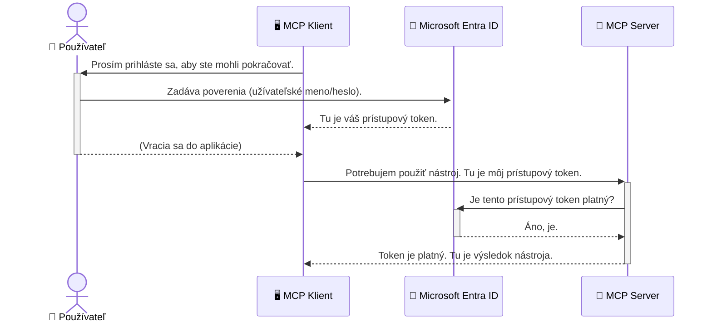

# Zabezpečenie AI pracovných tokov: Overovanie Entra ID pre servery Model Context Protocol

## Úvod
Zabezpečenie vášho servera Model Context Protocol (MCP) je rovnako dôležité ako zamknutie hlavného vchodu do vášho domu. Nechávať váš MCP server otvorený vystavuje vaše nástroje a údaje neoprávnenému prístupu, čo môže viesť k porušeniam bezpečnosti. Microsoft Entra ID poskytuje robustné riešenie na správu identity a prístupu založené na cloude, ktoré pomáha zabezpečiť, že iba autorizovaní používatelia a aplikácie môžu komunikovať s vaším MCP serverom. V tejto časti sa naučíte, ako chrániť svoje AI pracovné toky pomocou autentifikácie Entra ID.

## Ciele učenia
Na konci tejto časti budete schopní:

- Pochopiť dôležitosť zabezpečenia MCP serverov.
- Vysvetliť základy Microsoft Entra ID a autentifikácie OAuth 2.0.
- Rozlíšiť rozdiel medzi verejnými a dôvernými klientmi.
- Implementovať autentifikáciu Entra ID v lokálnych (verejný klient) a vzdialených (dôverné klienti) scenároch MCP serverov.
- Aplikovať najlepšie bezpečnostné postupy pri vývoji AI pracovných tokov.

## Bezpečnosť a MCP

Rovnako ako by ste nenechali hlavný vchod do vášho domu odomknutý, nemali by ste nechávať váš MCP server otvorený pre kohokoľvek. Zabezpečenie vašich AI pracovných tokov je nevyhnutné pre tvorbu robustných, dôveryhodných a bezpečných aplikácií. Táto kapitola vám predstaví použitie Microsoft Entra ID na zabezpečenie vašich MCP serverov, čím zaistíte, že len autorizovaní používatelia a aplikácie môžu využívať vaše nástroje a údaje.

## Prečo je bezpečnosť dôležitá pre MCP servery

Predstavte si, že váš MCP server má nástroj, ktorý môže posielať e-maily alebo pristupovať k databáze zákazníkov. Nezabezpečený server by znamenal, že ktokoľvek by mohol použiť tento nástroj, čo by viedlo k neoprávnenému prístupu k údajom, spamu alebo iným škodlivým aktivitám.

Implementáciou autentifikácie zabezpečujete, že každá požiadavka na váš server je overená, čím sa potvrdzuje identita používateľa alebo aplikácie, ktorá požiadavku robí. Toto je prvý a najdôležitejší krok k zabezpečeniu vašich AI pracovných tokov.

## Úvod do Microsoft Entra ID

[**Microsoft Entra ID**](https://adoption.microsoft.com/microsoft-security/entra/) je cloudová služba na správu identity a prístupu. Predstavte si ju ako univerzálneho bezpečnostného strážcu pre vaše aplikácie. Rieši zložitý proces overovania používateľských identít (autentifikácia) a určovania, čo môžu robiť (autorizácia).

Používaním Entra ID môžete:

- Umožniť bezpečné prihlasovanie používateľov.
- Chrániť API a služby.
- Spravovať prístupové politiky z centrálneho miesta.

Pre MCP servery poskytuje Entra ID robustné a široko dôveryhodné riešenie na správu toho, kto môže pristupovať ku schopnostiam vášho servera.

---

## Pochopenie kúzla: Ako funguje autentifikácia Entra ID

Entra ID používa otvorené štandardy ako **OAuth 2.0** na spracovanie autentifikácie. Hoci detaily môžu byť zložité, základná myšlienka je jednoduchá a dá sa pochopiť pomocou analógie.

### Jemný úvod do OAuth 2.0: Kľúč pre parkovanie

Predstavte si OAuth 2.0 ako službu parkovania pre vaše auto. Keď prídete do reštaurácie, nedáte valetovi váš hlavný kľúč. Namiesto toho mu poskytnete **valet kľúč**, ktorý má obmedzené oprávnenia – môže naštartovať auto a zamknúť dvere, ale nemôže otvoriť batožinový priestor alebo rukavícový box.

V tejto analógii:

- **Vy** ste **Používateľ**.
- **Vaše auto** je **MCP server** s jeho cennými nástrojmi a údajmi.
- **Valet** je **Microsoft Entra ID**.
- **Parkovací pracovník** je **MCP klient** (aplikácia, ktorá sa snaží pristúpiť k serveru).
- **Valet kľúč** je **Access Token** (prístupový token).

Prístupový token je zabezpečený reťazec textu, ktorý MCP klient dostane od Entra ID po vašom prihlásení. Klient potom tento token predkladá MCP serveru pri každej požiadavke. Server môže overiť token, aby zaistil, že požiadavka je legitímna a klient má potrebné oprávnenia, a to všetko bez potreby spravovať vaše skutočné prihlasovacie údaje (napríklad heslo).

### Priebeh autentifikácie

Tu je, ako tento proces funguje v praxi:



### Predstavenie Microsoft Authentication Library (MSAL)

Predtým, než sa pustíme do kódu, je dôležité predstaviť kľúčovú súčasť, ktorú uvidíte v príkladoch: **Microsoft Authentication Library (MSAL)**.

MSAL je knižnica vyvinutá spoločnosťou Microsoft, ktorá veľmi uľahčuje vývojárom spravovanie autentifikácie. Namiesto toho, aby ste museli písať všetok zložitý kód na spracovanie bezpečnostných tokenov, správu prihlasovaní a obnovovanie relácií, MSAL toto všetko robí za vás.

Použitie knižnice ako MSAL je veľmi odporúčané, pretože:

- **Je bezpečná:** Implementuje štandardné protokoly a najlepšie bezpečnostné praktiky v odvetví, čím znižuje riziko zraniteľností vo vašom kóde.
- **Zjednodušuje vývoj:** Abstrahuje zložitosť protokolov OAuth 2.0 a OpenID Connect, čo vám umožňuje pridať robustnú autentifikáciu do aplikácie len s niekoľkými riadkami kódu.
- **Je udržiavaná:** Microsoft aktívne udržiava a aktualizuje MSAL, aby riešil nové bezpečnostné hrozby a zmeny platforiem.

MSAL podporuje široké spektrum jazykov a aplikačných rámcov, vrátane .NET, JavaScript/TypeScript, Python, Java, Go a mobilných platforiem ako iOS a Android. To znamená, že môžete použiť rovnaké konzistentné vzory autentifikácie vo všetkých častiach vašej technologickej zásobárne.

Pre viac informácií o MSAL si môžete pozrieť oficiálnu [dokumentáciu prehľadu MSAL](https://learn.microsoft.com/entra/identity-platform/msal-overview).

---

## Zabezpečenie vášho MCP servera s Entra ID: krok za krokom

Teraz si prejdeme, ako zabezpečiť lokálny MCP server (ten, ktorý komunikuje cez `stdio`) pomocou Entra ID. Tento príklad používa **verejného klienta**, ktorý je vhodný pre aplikácie bežiace na používateľskom počítači, ako je desktopová aplikácia alebo lokálny vývojový server.

### Scenár 1: Zabezpečenie lokálneho MCP servera (s verejným klientom)

V tomto scenári sa pozrieme na MCP server, ktorý beží lokálne, komunikuje cez `stdio` a používa Entra ID na overenie používateľa pred povolením prístupu k jeho nástrojom. Server bude mať jeden nástroj, ktorý získava informácie o používateľskom profile z Microsoft Graph API.

#### 1. Nastavenie aplikácie v Entra ID

Skôr než začnete písať kód, musíte svoju aplikáciu zaregistrovať v Microsoft Entra ID. To umožní Entra ID vedieť o vašej aplikácii a udeliť jej oprávnenie používať autentifikačnú službu.

1. Navštívte **[Microsoft Entra portál](https://entra.microsoft.com/)**.
2. Choďte do **Registrácie aplikácií** a kliknite na **Nová registrácia**.
3. Pomenujte svoju aplikáciu (napr. „Môj lokálny MCP server“).
4. Pri **Podporovaných typoch kont** vyberte **Účty len v tomto organizačnom adresári**.
5. Váš **Redirect URI** môže zostať pre tento príklad prázdny.
6. Kliknite na **Registrovať**.

Po registrácii si zapíšte **ID aplikácie (klienta)** a **ID adresára (nájomníka)**. Budete ich potrebovať vo vašom kóde.

#### 2. Kód: rozbor

Pozrime sa na kľúčové časti kódu, ktoré riešia autentifikáciu. Plný kód k tomuto príkladu je dostupný v priečinku [Entra ID - Local - WAM](https://github.com/Azure-Samples/mcp-auth-servers/tree/main/src/entra-id-local-wam) v repozitári [mcp-auth-servers GitHub](https://github.com/Azure-Samples/mcp-auth-servers).

**`AuthenticationService.cs`**

Táto trieda zodpovedá za interakciu s Entra ID.

- **`CreateAsync`**: Táto metóda inicializuje `PublicClientApplication` z MSAL (Microsoft Authentication Library). Je nakonfigurovaná s ID klienta a nájomníka vašej aplikácie.
- **`WithBroker`**: Toto umožňuje použitie brokera (ako Windows Web Account Manager), ktorý poskytuje bezpečnejší a plynulejší zážitok jediného prihlásenia.
- **`AcquireTokenAsync`**: Toto je jadrová metóda. Najprv sa snaží získať token ticho (teda používateľ sa nebude musieť znovu prihlasovať, ak má platnú reláciu). Ak sa ticho token nezíska, vyzve používateľa interaktívnym prihlásením.

```csharp
// Simplified for clarity
public static async Task<AuthenticationService> CreateAsync(ILogger<AuthenticationService> logger)
{
    var msalClient = PublicClientApplicationBuilder
        .Create(_clientId) // Your Application (client) ID
        .WithAuthority(AadAuthorityAudience.AzureAdMyOrg)
        .WithTenantId(_tenantId) // Your Directory (tenant) ID
        .WithBroker(new BrokerOptions(BrokerOptions.OperatingSystems.Windows))
        .Build();

    // ... cache registration ...

    return new AuthenticationService(logger, msalClient);
}

public async Task<string> AcquireTokenAsync()
{
    try
    {
        // Try silent authentication first
        var accounts = await _msalClient.GetAccountsAsync();
        var account = accounts.FirstOrDefault();

        AuthenticationResult? result = null;

        if (account != null)
        {
            result = await _msalClient.AcquireTokenSilent(_scopes, account).ExecuteAsync();
        }
        else
        {
            // If no account, or silent fails, go interactive
            result = await _msalClient.AcquireTokenInteractive(_scopes).ExecuteAsync();
        }

        return result.AccessToken;
    }
    catch (Exception ex)
    {
        _logger.LogError(ex, "An error occurred while acquiring the token.");
        throw; // Optionally rethrow the exception for higher-level handling
    }
}
```

**`Program.cs`**

Tu je MCP server nastavený a integrovaná autentifikačná služba.

- **`AddSingleton<AuthenticationService>`**: Táto registrácia poskytuje `AuthenticationService` v kontajneri závislostí, aby ho mohli používať aj iné časti aplikácie (napríklad náš nástroj).
- **`GetUserDetailsFromGraph` nástroj**: Tento nástroj vyžaduje inštanciu `AuthenticationService`. Pred vykonaním čohokoľvek zavolá `authService.AcquireTokenAsync()`, aby získal platný prístupový token. Ak je autentifikácia úspešná, použije token na volanie Microsoft Graph API a získanie používateľských detailov.

```csharp
// Simplified for clarity
[McpServerTool(Name = "GetUserDetailsFromGraph")]
public static async Task<string> GetUserDetailsFromGraph(
    AuthenticationService authService)
{
    try
    {
        // This will trigger the authentication flow
        var accessToken = await authService.AcquireTokenAsync();

        // Use the token to create a GraphServiceClient
        var graphClient = new GraphServiceClient(
            new BaseBearerTokenAuthenticationProvider(new TokenProvider(authService)));

        var user = await graphClient.Me.GetAsync();

        return System.Text.Json.JsonSerializer.Serialize(user);
    }
    catch (Exception ex)
    {
        return $"Error: {ex.Message}";
    }
}
```

#### 3. Ako to všetko funguje spolu

1. Keď sa MCP klient pokúsi použiť nástroj `GetUserDetailsFromGraph`, nástroj najprv zavolá `AcquireTokenAsync`.
2. `AcquireTokenAsync` spustí MSAL knižnicu, aby skontrolovala platný token.
3. Ak token nie je nájdený, MSAL cez broker vyzve používateľa na prihlásenie cez jeho účet Entra ID.
4. Po prihlásení používateľa vydá Entra ID prístupový token.
5. Nástroj prijme token a použije ho na bezpečné volanie Microsoft Graph API.
6. Údaje používateľa sú vrátené MCP klientovi.

Tento proces zabezpečuje, že iba autentifikovaní používatelia môžu používať nástroj, čím efektívne zabezpečuje váš lokálny MCP server.

### Scenár 2: Zabezpečenie vzdialeného MCP servera (s dôverným klientom)

Keď váš MCP server beží na vzdialenom zariadení (napr. cloudový server) a komunikuje cez protokol ako HTTP Streaming, bezpečnostné požiadavky sú odlišné. V takom prípade by ste mali použiť **dôvernú klientsku aplikáciu** a **Authorization Code Flow**. Toto je bezpečnejšia metóda, pretože tajomstvá aplikácie nie sú nikdy odhalené prehliadaču.

Tento príklad používa TypeScript-based MCP server, ktorý využíva Express.js na spracovanie HTTP požiadaviek.

#### 1. Nastavenie aplikácie v Entra ID

Nastavenie v Entra ID je podobné ako pri verejnom klientovi, ale s jedným kľúčovým rozdielom: musíte vytvoriť **klientské tajomstvo**.

1. Navštívte **[Microsoft Entra portál](https://entra.microsoft.com/)**.
2. Vo vašom registrácii aplikácie choďte na záložku **Certifikáty a tajomstvá**.
3. Kliknite na **Nové klientské tajomstvo**, zadajte popis a kliknite na **Pridať**.
4. **Dôležité:** Ihneď skopírujte hodnotu tajomstva. Už ju neuvidíte.
5. Tiež musíte nakonfigurovať **Redirect URI**. Prejdite na záložku **Autentifikácia**, kliknite na **Pridať platformu**, vyberte **Web** a zadajte redirect URI vašej aplikácie (napr. `http://localhost:3001/auth/callback`).

> **⚠️ Dôležitá bezpečnostná poznámka:** Pre produkčné aplikácie Microsoft dôrazne odporúča používať **autentifikáciu bez tajomstiev** ako **Managed Identity** alebo **Workload Identity Federation** namiesto klientskych tajomstiev. Klientské tajomstvá predstavujú bezpečnostné riziko, pretože môžu byť odhalené alebo kompromitované. Managed identity poskytuje bezpečnejší prístup tým, že eliminuje potrebu uchovávať prihlasovacie údaje v kóde alebo konfigurácii.
>
> Viac informácií o managed identities a ich implementácii nájdete na [Prehľad Managed identities pre Azure zdroje](https://learn.microsoft.com/entra/identity/managed-identities-azure-resources/overview).

#### 2. Kód: rozbor

Tento príklad používa prístup založený na sessions. Keď sa používateľ autentifikuje, server uloží access token a refresh token do session a vydá používateľovi session token. Tento session token sa potom používa pre následné požiadavky. Plný kód je dostupný v priečinku [Entra ID - Confidential client](https://github.com/Azure-Samples/mcp-auth-servers/tree/main/src/entra-id-cca-session) v repozitári [mcp-auth-servers GitHub](https://github.com/Azure-Samples/mcp-auth-servers).

**`Server.ts`**

Tento súbor nastavuje Express server a transportnú vrstvu MCP.

- **`requireBearerAuth`**: Toto je middleware, ktorý chráni koncové body `/sse` a `/message`. Kontroluje platný bearer token v hlavičke `Authorization` požiadavky.
- **`EntraIdServerAuthProvider`**: Toto je vlastná trieda, ktorá implementuje rozhranie `McpServerAuthorizationProvider`. Zodpovedá za spracovanie OAuth 2.0 flow.
- **`/auth/callback`**: Tento endpoint spracováva presmerovanie z Entra ID po tom, čo sa používateľ prihlási. Vymieňa autorizačný kód za access token a refresh token.

```typescript
// Zjednodušené pre prehľadnosť
const app = express();
const { server } = createServer();
const provider = new EntraIdServerAuthProvider();

// Chráňte SSE endpoint
app.get("/sse", requireBearerAuth({
  provider,
  requiredScopes: ["User.Read"]
}), async (req, res) => {
  // ... pripojte sa k transportu ...
});

// Chráňte endpoint správy
app.post("/message", requireBearerAuth({
  provider,
  requiredScopes: ["User.Read"]
}), async (req, res) => {
  // ... spracujte správu ...
});

// Spracujte spätné volanie OAuth 2.0
app.get("/auth/callback", (req, res) => {
  provider.handleCallback(req.query.code, req.query.state)
    .then(result => {
      // ... spracujte úspech alebo neúspech ...
    });
});
```

**`Tools.ts`**

Tento súbor definuje nástroje, ktoré MCP server poskytuje. Nástroj `getUserDetails` je podobný ako v predchádzajúcom príklade, ale získava prístupový token zo session.

```typescript
// Zjednodušené pre prehľadnosť
server.setRequestHandler(CallToolRequestSchema, async (request) => {
  const { name } = request.params;
  const context = request.params?.context as { token?: string } | undefined;
  const sessionToken = context?.token;

  if (name === ToolName.GET_USER_DETAILS) {
    if (!sessionToken) {
      throw new AuthenticationError("Authentication token is missing or invalid. Ensure the token is provided in the request context.");
    }

    // Získajte Entra ID token zo skladu relácie
    const tokenData = tokenStore.getToken(sessionToken);
    const entraIdToken = tokenData.accessToken;

    const graphClient = Client.init({
      authProvider: (done) => {
        done(null, entraIdToken);
      }
    });

    const user = await graphClient.api('/me').get();

    // ... vrátiť detaily používateľa ...
  }
});
```

**`auth/EntraIdServerAuthProvider.ts`**

Táto trieda zabezpečuje logiku:

- Presmerovanie používateľa na prihlasovaciu stránku Entra ID.
- Výmenu autorizačného kódu za prístupový token.
- Ukladanie tokenov do `tokenStore`.
- Obnovovanie prístupového tokenu po jeho vypršaní.

#### 3. Ako to všetko funguje spolu

1. Keď sa používateľ prvýkrát pokúsi pripojiť k MCP serveru, middleware `requireBearerAuth` zistí, že nemá platnú session, a presmeruje ho na prihlasovaciu stránku Entra ID.
2. Používateľ sa prihlási pomocou svojho účtu Entra ID.
3. Entra ID presmeruje používateľa späť na koncový bod `/auth/callback` s autorizačným kódom.  
4. Server vymení kód za prístupový token a obnovovací token, uloží ich a vytvorí reláciu, ktorá je odoslaná klientovi.  
5. Klient teraz môže použiť tento token relácie v hlavičke `Authorization` pre všetky budúce požiadavky na MCP server.  
6. Keď sa zavolá nástroj `getUserDetails`, použije token relácie na vyhľadanie prístupového tokenu Entra ID a následne ho použije na zavolanie Microsoft Graph API.

Tento tok je zložitejší ako tok verejného klienta, ale je požadovaný pre internetovo prístupné koncové body. Keďže vzdialené MCP servery sú prístupné cez verejný internet, potrebujú silnejšie bezpečnostné opatrenia na ochranu pred neoprávneným prístupom a potenciálnymi útokmi.


## Najlepšie bezpečnostné postupy

- **Vždy používajte HTTPS**: Šifrujte komunikáciu medzi klientom a serverom, aby ste chránili tokeny pred zachytením.  
- **Implementujte riadenie prístupu založené na rolách (RBAC)**: Nekontrolujte len *či* je používateľ autentifikovaný; overte *čo* má oprávnenie robiť. Môžete definovať roly v Entra ID a kontrolovať ich vo vašom MCP serveri.  
- **Monitorujte a auditujte**: Logujte všetky autentifikačné udalosti, aby ste mohli detekovať a reagovať na podozrivú aktivitu.  
- **Riešte obmedzovanie rýchlosti a prerušenie spojenia**: Microsoft Graph a ďalšie API implementujú obmedzenie rýchlosti na zabránenie zneužitiu. Implementujte exponenciálne zvyšovanie času a opakovanie požiadaviek vo vašom MCP serveri na elegantné spracovanie odpovedí HTTP 429 (Príliš veľa požiadaviek). Zvážte kešovanie často používaných dát, aby ste znížili počet volaní API.  
- **Bezpečné ukladanie tokenov**: Ukladajte prístupové a obnovovacie tokeny bezpečne. Pre lokálne aplikácie používajte systémové mechanizmy bezpečného úložiska. Pre serverové aplikácie zvážte použitie šifrovaného úložiska alebo bezpečných služieb správy kľúčov ako Azure Key Vault.  
- **Riešenie vypršania platnosti tokenov**: Prístupové tokeny majú obmedzenú platnosť. Implementujte automatickú obnovu tokenov pomocou obnovovacích tokenov, aby ste zabezpečili plynulý používateľský zážitok bez potreby znovu sa prihlasovať.  
- **Zvážte použitie Azure API Management**: Aj keď priama implementácia bezpečnosti vo vašom MCP serveri poskytuje jemné riadenie, API brány ako Azure API Management môžu automaticky riešiť mnohé bezpečnostné otázky vrátane autentifikácie, autorizácie, obmedzenia rýchlosti a monitorovania. Poskytujú centralizovanú bezpečnostnú vrstvu medzi vašimi klientmi a MCP servermi. Viac detailov o použite API brán s MCP nájdete v našom [Azure API Management Your Auth Gateway For MCP Servers](https://techcommunity.microsoft.com/blog/integrationsonazureblog/azure-api-management-your-auth-gateway-for-mcp-servers/4402690).


## Kľúčové zhrnutie

- Zabezpečenie vášho MCP servera je kľúčové pre ochranu vašich dát a nástrojov.  
- Microsoft Entra ID poskytuje robustné a škálovateľné riešenie pre autentifikáciu a autorizáciu.  
- Pre lokálne aplikácie používajte **verejného klienta**, pre vzdialené servery **dôverného klienta**.  
- **Authorization Code Flow** je najbezpečnejšia možnosť pre webové aplikácie.


## Cvičenie

1. Premýšľajte o MCP serveri, ktorý by ste mohli vytvoriť. Bol by to lokálny server alebo vzdialený server?  
2. Na základe vašej odpovede, použili by ste verejného alebo dôverného klienta?  
3. Aké povolenia by si váš MCP server vyžiadal na vykonávanie akcií voči Microsoft Graph?


## Praktické cvičenia

### Cvičenie 1: Registrácia aplikácie v Entra ID  
Prejdite do portálu Microsoft Entra.  
Zaregistrujte novú aplikáciu pre váš MCP server.  
Zapíšte si identifikátor aplikácie (client ID) a identifikátor adresára (tenant ID).

### Cvičenie 2: Zabezpečenie lokálneho MCP servera (verejný klient)  
- Postupujte podľa príkladu kódu na integráciu MSAL (Microsoft Authentication Library) pre autentifikáciu používateľa.  
- Otestujte autentifikačný tok zavolaním nástroja MCP, ktorý získava údaje používateľa z Microsoft Graph.

### Cvičenie 3: Zabezpečenie vzdialeného MCP servera (dôverný klient)  
- Zaregistrujte dôverného klienta v Entra ID a vytvorte klientský tajný kľúč.  
- Nakonfigurujte váš MCP server založený na Express.js na použitie Authorization Code Flow.  
- Otestujte chránené koncové body a potvrďte prístup pomocou tokenu.

### Cvičenie 4: Aplikácia najlepších bezpečnostných postupov  
- Zapnite HTTPS pre váš lokálny alebo vzdialený server.  
- Implementujte riadenie prístupu založené na rolách (RBAC) vo vašej serverovej logike.  
- Pridajte riešenie vypršania platnosti tokenov a zabezpečené ukladanie tokenov.

## Zdroje

1. **Dokumentácia prehľadu MSAL**  
   Naučte sa, ako Microsoft Authentication Library (MSAL) umožňuje bezpečné získavanie tokenov na rôznych platformách:  
   [MSAL Overview on Microsoft Learn](https://learn.microsoft.com/en-gb/entra/msal/overview)

2. **Azure-Samples/mcp-auth-servers GitHub repozitár**  
   Referenčné implementácie MCP serverov demonštrujúce autentifikačné toky:  
   [Azure-Samples/mcp-auth-servers on GitHub](https://github.com/Azure-Samples/mcp-auth-servers)

3. **Prehľad Managed Identities pre Azure zdroje**  
   Pochopte, ako eliminovať tajomstvá použitím systémovo alebo používateľom pridelených spravovaných identít:  
   [Managed Identities Overview on Microsoft Learn](https://learn.microsoft.com/en-us/entra/identity/managed-identities-azure-resources/)

4. **Azure API Management: Vaša autentifikačná brána pre MCP servery**  
   Hlbší pohľad na použitie APIM ako bezpečnej OAuth2 brány pre MCP servery:  
   [Azure API Management Your Auth Gateway For MCP Servers](https://techcommunity.microsoft.com/blog/integrationsonazureblog/azure-api-management-your-auth-gateway-for-mcp-servers/4402690)

5. **Referencie povolení Microsoft Graph**  
   Komplexný zoznam delegovaných a aplikačných povolení pre Microsoft Graph:  
   [Microsoft Graph Permissions Reference](https://learn.microsoft.com/zh-tw/graph/permissions-reference)


## Výsledky učenia
Po dokončení tejto sekcie budete schopní:

- Vysvetliť, prečo je autentifikácia kritická pre MCP servery a pracovné postupy AI.  
- Nastaviť a konfigurovať autentifikáciu Entra ID pre lokálne aj vzdialené scenáre MCP servera.  
- Vybrať vhodný typ klienta (verejný alebo dôverný) podľa nasadenia vášho servera.  
- Implementovať bezpečné programovacie postupy vrátane ukladania tokenov a autorizácie založenej na rolách.  
- Sebavedome chrániť váš MCP server a jeho nástroje pred neoprávneným prístupom.

## Čo ďalej

- [5.13 Model Context Protocol (MCP) Integrácia s Microsoft Foundry](../mcp-foundry-agent-integration/README.md)

---

<!-- CO-OP TRANSLATOR DISCLAIMER START -->
**Vyhlásenie o zodpovednosti**:
Tento dokument bol preložený pomocou AI prekladateľskej služby [Co-op Translator](https://github.com/Azure/co-op-translator). Hoci sa snažíme o presnosť, vezmite prosím na vedomie, že automatické preklady môžu obsahovať chyby alebo nepresnosti. Pôvodný dokument v jeho natívnom jazyku by mal byť považovaný za autoritatívny zdroj. Pre kritické informácie sa odporúča profesionálny ľudský preklad. Nie sme zodpovední za žiadne nedorozumenia alebo nesprávne interpretácie vyplývajúce z použitia tohto prekladu.
<!-- CO-OP TRANSLATOR DISCLAIMER END -->