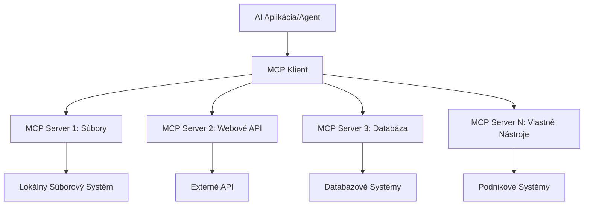

# 🌐 Modul 2: MCP so základmi Microsoft Foundry Toolkit

[]()
[]()
[]()

## 📋 Ciele učenia

Na konci tohto modulu budete schopní:
- ✅ Pochopiť architektúru a výhody Model Context Protocol (MCP)
- ✅ Preskúmať ekosystém MCP serverov od Microsoftu
- ✅ Integrovať MCP servery s Microsoft Foundry Toolkit Agent Builderom
- ✅ Vytvoriť funkčného agenta pre automatizáciu prehliadača pomocou Playwright MCP
- ✅ Konfigurovať a testovať MCP nástroje vo vašich agentech
- ✅ Exportovať a nasadiť agentov poháňaných MCP do produkcie

## 🎯 Nadstavba na Modul 1

V Module 1 sme si osvojili základy Microsoft Foundry Toolkit a vytvorili sme náš prvý Python Agent. Teraz vaše agentov **vylepšíme** pripojením k externým nástrojom a službám cez revolučný **Model Context Protocol (MCP)**.

Predstavte si to ako upgrade z obyčajnej kalkulačky na plnohodnotný počítač – vaši AI agenti nadobudnú schopnosti:
- 🌐 Prehliadať a interagovať s webovými stránkami
- 📁 Pristupovať a manipulovať so súbormi
- 🔧 Integrovať sa s podnikateľskými systémami
- 📊 Spracovávať dáta v reálnom čase z API

## 🧠 Pochopenie Model Context Protocol (MCP)

### 🔍 Čo je MCP?

Model Context Protocol (MCP) je **"USB-C pre AI aplikácie"** – revolučný otvorený štandard, ktorý pripája veľké jazykové modely (LLM) k externým nástrojom, zdrojom dát a službám. Rovnako ako USB-C odstránilo neporiadok v káblových pripojeniach jedným univerzálnym konektorom, MCP eliminuje zložitosť integrácie AI pomocou jedného štandardizovaného protokolu.

### 🎯 Problém, ktorý MCP rieši

**Pred MCP:**
- 🔧 Vlastné integrácie pre každý nástroj
- 🔄 Závislosť od dodávateľa s proprietárnymi riešeniami
- 🔒 Bezpečnostné riziká z ad-hoc spojení
- ⏱️ Mesiace vývoja pre základné integrácie

**S MCP:**
- ⚡ Plug-and-play integrácia nástrojov
- 🔄 Architektúra nezávislá od dodávateľa
- 🛡️ Vstavané najlepšie bezpečnostné praktiky
- 🚀 Minúty na pridanie nových funkcií

### 🏗️ Hlbší pohľad na architektúru MCP

MCP používa **klient-server architektúru**, ktorá vytvára bezpečný a škálovateľný ekosystém:



**🔧 Hlavné komponenty:**

| Komponent | Úloha | Príklady |
|-----------|-------|----------|
| **MCP Hosts** | Aplikácie využívajúce MCP služby | Claude Desktop, VS Code, Microsoft Foundry Toolkit |
| **MCP Clients** | Hendlery protokolu (1:1 so servermi) | Zabudované v hostiteľských aplikáciách |
| **MCP Servers** | Poskytujú funkcie cez štandardný protokol | Playwright, Files, Azure, GitHub |
| **Transport Layer** | Spôsoby komunikácie | stdio, HTTP, WebSockets |


## 🏢 MCP serverový ekosystém Microsoftu

Microsoft vedie MCP ekosystém so všetkými podnikateľskými servermi, ktoré riešia reálne obchodné potreby.

### 🌟 Vybrané MCP servery od Microsoftu

#### 1. ☁️ Azure MCP Server
**🔗 Repozitár**: [azure/azure-mcp](https://github.com/azure/azure-mcp)
**🎯 Účel**: Komplexné riadenie Azure zdrojov s AI integráciou

**✨ Kľúčové funkcie:**
- Deklaratívne poskytovanie infraštruktúry
- Monitorovanie zdrojov v reálnom čase
- Odporúčania na optimalizáciu nákladov
- Kontrola bezpečnostnej zhody

**🚀 Použitie:**
- Infrastructure-as-Code s AI asistenciou
- Automatické škálovanie zdrojov
- Optimalizácia nákladov na cloud
- Automatizácia DevOps procesov

#### 2. 📊 Microsoft Dataverse MCP
**📚 Dokumentácia**: [Microsoft Dataverse Integrácia](https://go.microsoft.com/fwlink/?linkid=2320176)
**🎯 Účel**: Rozhranie v prirodzenom jazyku pre obchodné dáta

**✨ Kľúčové funkcie:**
- Dotazy do databázy v prirodzenom jazyku
- Pochopenie obchodného kontextu
- Vlastné šablóny promptov
- Správa firemných dát

**🚀 Použitie:**
- Reporting business intelligence
- Analýza zákazníckych dát
- Prehľad predajných kanálov
- Dotazy ohľadom súladu s pravidlami

#### 3. 🌐 Playwright MCP Server
**🔗 Repozitár**: [microsoft/playwright-mcp](https://github.com/microsoft/playwright-mcp)
**🎯 Účel**: Automatizácia prehliadača a webová interakcia

**✨ Kľúčové funkcie:**
- Automatizácia v rôznych prehliadačoch (Chrome, Firefox, Safari)
- Inteligentné rozpoznávanie prvkov
- Vytváranie screenshotov a PDF
- Monitorovanie sieťovej prevádzky

**🚀 Použitie:**
- Automatizované testovanie
- Web scraping a extrakcia dát
- Monitorovanie UI/UX
- Automatizácia konkurenčnej analýzy

#### 4. 📁 Files MCP Server
**🔗 Repozitár**: [microsoft/files-mcp-server](https://github.com/microsoft/files-mcp-server)
**🎯 Účel**: Inteligentné operácie so súborovým systémom

**✨ Kľúčové funkcie:**
- Deklaratívne spravovanie súborov
- Synchronizácia obsahu
- Integrácia so správou verzií
- Extrakcia metadát

**🚀 Použitie:**
- Správa dokumentácie
- Organizácia kódu v repozitári
- Publikovanie obsahu
- Spracovanie súborov v dátových pipeline

#### 5. 📝 MarkItDown MCP Server
**🔗 Repozitár**: [microsoft/markitdown](https://github.com/microsoft/markitdown)
**🎯 Účel**: Pokročilé spracovanie a manipulácia Markdownu

**✨ Kľúčové funkcie:**
- Bohaté parsovanie Markdownu
- Konverzia formátov (MD ↔ HTML ↔ PDF)
- Analýza štruktúry obsahu
- Spracovanie šablón

**🚀 Použitie:**
- Technické dokumentačné workflowy
- Systémy na správu obsahu
- Generovanie reportov
- Automatizácia znalostnej bázy

#### 6. 📈 Clarity MCP Server
**📦 Balík**: [@microsoft/clarity-mcp-server](https://www.npmjs.com/package/@microsoft/clarity-mcp-server)
**🎯 Účel**: Webová analytika a pohľad na správanie používateľov

**✨ Kľúčové funkcie:**
- Analýza heatmap
- Nahrávanie používateľských relácií
- Výkonové metriky
- Analýza konverzných funnelov

**🚀 Použitie:**
- Optimalizácia webovej stránky
- Výskum používateľskej skúsenosti
- A/B testovanie
- Dashboardy business intelligence

### 🌍 Komunitný ekosystém

Okrem Microsoft serverov ekosystém MCP zahŕňa:
- **🐙 GitHub MCP**: Správa repozitárov a analýza kódu
- **🗄️ Database MCPs**: Integrácie PostgreSQL, MySQL, MongoDB
- **☁️ Cloud Provider MCPs**: Nástroje pre AWS, GCP, Digital Ocean
- **📧 Komunikačné MCPs**: Integrácie Slack, Teams, Email

## 🛠️ Praktický lab: Vytvorenie agenta pre automatizáciu prehliadača

**🎯 Cieľ projektu**: Vytvoriť inteligentného agenta pre automatizáciu prehliadača pomocou Playwright MCP servera, ktorý dokáže navigovať na webové stránky, získavať informácie a vykonávať komplexné webové interakcie.

### 🚀 Fáza 1: Nastavenie základu agenta

#### Krok 1: Inicializujte svojho agenta
1. **Otvorte Microsoft Foundry Toolkit Agent Builder**
2. **Vytvorte nového agenta** s nasledujúcou konfiguráciou:
   - **Názov**: `BrowserAgent`
   - **Model**: Vyberte GPT-4o 


### 🔧 Fáza 2: Integrácia MCP nástrojov

#### Krok 3: Pridajte integráciu MCP servera
1. **Prejdite do sekcie Nástroje** v Agent Builderi
2. **Kliknite na "Pridať nástroj"** pre otvorenie menu integrácie
3. **Vyberte "MCP Server"** z dostupných možností


**🔍 Pochopenie typov nástrojov:**
- **Vstavané nástroje**: Prednastavené funkcie Microsoft Foundry Toolkit
- **MCP Servery**: Integrácie externých služieb
- **Vlastné API**: Vaše vlastné koncové body služieb
- **Volania funkcií**: Priamy prístup k funkciám modelu

#### Krok 4: Výber MCP servera
1. **Zvoľte možnosť "MCP Server"** pre pokračovanie


2. **Prehliadnite MCP katalóg** a preskúmajte dostupné integrácie


### 🎮 Fáza 3: Konfigurácia Playwright MCP

#### Krok 5: Vyberte a nakonfigurujte Playwright
1. **Kliknite na "Použiť odporúčané MCP servery"**, aby ste získali prístup k overeným serverom Microsoftu
2. **Vyberte "Playwright"** zo zoznamu odporúčaných
3. **Akceptujte predvolený MCP ID** alebo si ho prispôsobte pre svoje prostredie


#### Krok 6: Aktivujte Playwright schopnosti
**🔑 Kľúčový krok**: Vyberte **VŠETKY** dostupné metódy Playwright pre maximálnu funkčnosť


**🛠️ Zásadné Playwright nástroje:**
- **Navigácia**: `goto`, `goBack`, `goForward`, `reload`
- **Interakcia**: `click`, `fill`, `press`, `hover`, `drag`
- **Extrahovanie**: `textContent`, `innerHTML`, `getAttribute`
- **Validácia**: `isVisible`, `isEnabled`, `waitForSelector`
- **Záznam**: `screenshot`, `pdf`, `video`
- **Sieť**: `setExtraHTTPHeaders`, `route`, `waitForResponse`

#### Krok 7: Overte úspešnosť integrácie
**✅ Indikátory úspechu:**
- Všetky nástroje sú zobrazené v rozhraní Agent Buildera
- Žiadne chybové hlásenia v paneli integrácie
- Stav Playwright servera zobrazuje "Connected"


**🔧 Riešenie bežných problémov:**
- **Pripojenie zlyhalo**: Skontrolujte internetové pripojenie a nastavenia firewallu
- **Chýbajúce nástroje**: Uistite sa, že ste vybrali všetky schopnosti počas nastavenia
- **Chyby oprávnení**: Overte, či má VS Code potrebné systémové povolenia

### 🎯 Fáza 4: Pokročilý návrh promptov

#### Krok 8: Navrhnite inteligentné systémové prompt
Vytvorte sofistikované prompty využívajúce plné možnosti Playwrightu:

```markdown
# Web Automation Expert System Prompt

## Core Identity
You are an advanced web automation specialist with deep expertise in browser automation, web scraping, and user experience analysis. You have access to Playwright tools for comprehensive browser control.

## Capabilities & Approach
### Navigation Strategy
- Always start with screenshots to understand page layout
- Use semantic selectors (text content, labels) when possible
- Implement wait strategies for dynamic content
- Handle single-page applications (SPAs) effectively

### Error Handling
- Retry failed operations with exponential backoff
- Provide clear error descriptions and solutions
- Suggest alternative approaches when primary methods fail
- Always capture diagnostic screenshots on errors

### Data Extraction
- Extract structured data in JSON format when possible
- Provide confidence scores for extracted information
- Validate data completeness and accuracy
- Handle pagination and infinite scroll scenarios

### Reporting
- Include step-by-step execution logs
- Provide before/after screenshots for verification
- Suggest optimizations and alternative approaches
- Document any limitations or edge cases encountered

## Ethical Guidelines
- Respect robots.txt and rate limiting
- Avoid overloading target servers
- Only extract publicly available information
- Follow website terms of service
```

#### Krok 9: Vytvorte dynamické užívateľské prompty
Navrhnite prompty, ktoré demonštrujú rôzne schopnosti:

**🌐 Príklad webovej analýzy:**
```markdown
Navigate to github.com/kinfey and provide a comprehensive analysis including:
1. Repository structure and organization
2. Recent activity and contribution patterns  
3. Documentation quality assessment
4. Technology stack identification
5. Community engagement metrics
6. Notable projects and their purposes

Include screenshots at key steps and provide actionable insights.
```


### 🚀 Fáza 5: Spustenie a testovanie

#### Krok 10: Spustite prvú automatizáciu
1. **Kliknite na "Spustiť"** pre zahájenie automatizačnej sekvencie
2. **Sledujte vykonávanie v reálnom čase**:
   - Automatické spustenie prehliadača Chrome
   - Agent naviguje na cieľovú stránku
   - Snímky obrazovky zachytávajú každý hlavný krok
   - Výsledky analýzy prúdia v reálnom čase


#### Krok 11: Analyzujte výsledky a poznatky
Prezrite si komplexnú analýzu v rozhraní Agent Buildera:


### 🌟 Fáza 6: Pokročilé funkcie a nasadenie

#### Krok 12: Export a produkčné nasadenie
Agent Builder podporuje viacero možností nasadenia:


## 🎓 Zhrnutie modulu 2 a ďalšie kroky

### 🏆 Dosiahnutý úspech: Majster integrácie MCP

**✅ Osvojené zručnosti:**
- [ ] Pochopenie architektúry a výhod MCP
- [ ] Orientácia v MCP serverovom ekosystéme Microsoftu
- [ ] Integrácia Playwright MCP s Microsoft Foundry Toolkit
- [ ] Vytváranie sofistikovaných agentov na automatizáciu prehliadača
- [ ] Pokročilý návrh promptov pre webovú automatizáciu

### 📚 Ďalšie zdroje

- **🔗 Špecifikácia MCP**: [Oficiálna dokumentácia protokolu](https://modelcontextprotocol.io/)
- **🛠️ Playwright API**: [Kompletný prehľad metód](https://playwright.dev/docs/api/class-playwright)
- **🏢 Microsoft MCP servery**: [Príručka podnikovej integrácie](https://github.com/microsoft/mcp-servers)
- **🌍 Komunitné príklady**: [Galéria MCP serverov](https://github.com/modelcontextprotocol/servers)

**🎉 Gratulujeme!** Úspešne ste zvládli integráciu MCP a teraz môžete stavať produkčne pripravených AI agentov s externými nástrojmi!


### 🔜 Pokračujte do ďalšieho modulu

Ste pripravení posunúť svoje MCP zručnosti na ďalšiu úroveň? Pokračujte do **[Modul 3: Pokročilý vývoj MCP s Microsoft Foundry Toolkit](../lab3/README.md)**, kde sa naučíte:
- Vytvárať vlastné MCP servery
- Konfigurovať a používať najnovší MCP Python SDK
- Nastaviť MCP Inspector pre ladenie
- Ovládnuť pokročilé pracovné postupy vývoja MCP serverov
- Vytvoriť MCP server pre počasie od základu

---

<!-- CO-OP TRANSLATOR DISCLAIMER START -->
**Vyhlásenie o zodpovednosti**:
Tento dokument bol preložený pomocou AI prekladateľskej služby [Co-op Translator](https://github.com/Azure/co-op-translator). Hoci sa snažíme o presnosť, vezmite prosím na vedomie, že automatické preklady môžu obsahovať chyby alebo nepresnosti. Pôvodný dokument v jeho natívnom jazyku by mal byť považovaný za autoritatívny zdroj. Pre kritické informácie sa odporúča profesionálny ľudský preklad. Nie sme zodpovední za žiadne nedorozumenia alebo nesprávne interpretácie vyplývajúce z použitia tohto prekladu.
<!-- CO-OP TRANSLATOR DISCLAIMER END -->