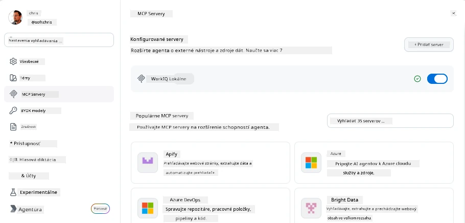
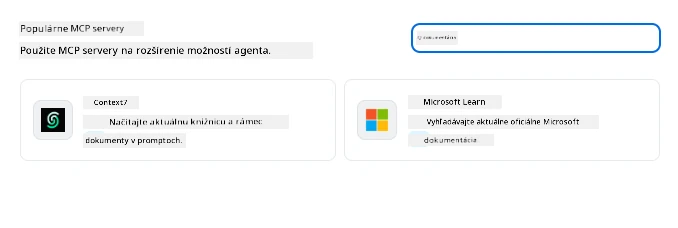
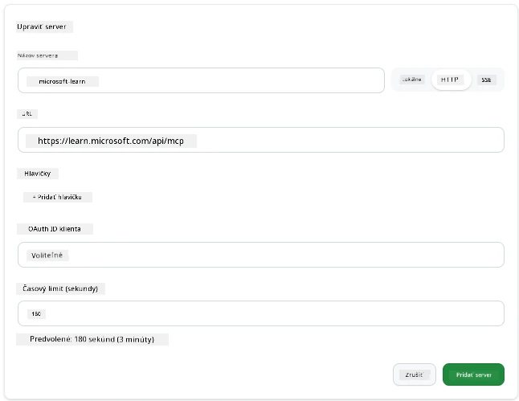
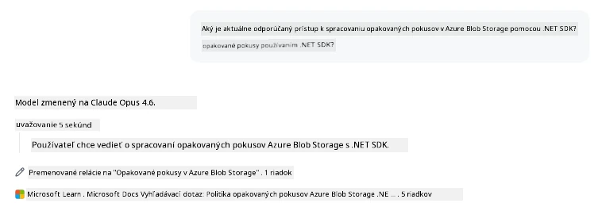
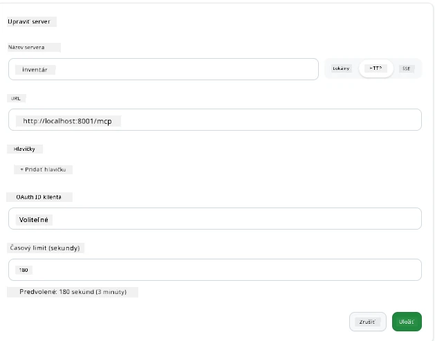
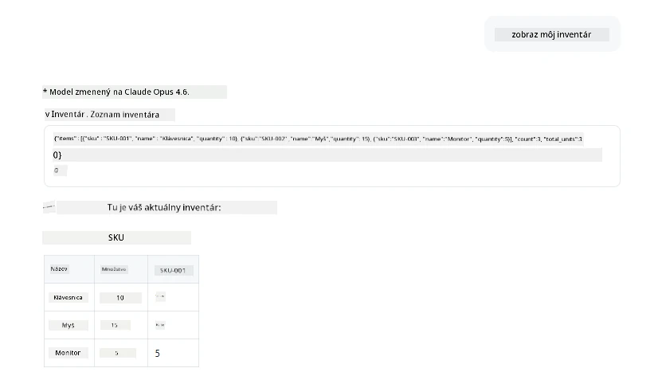
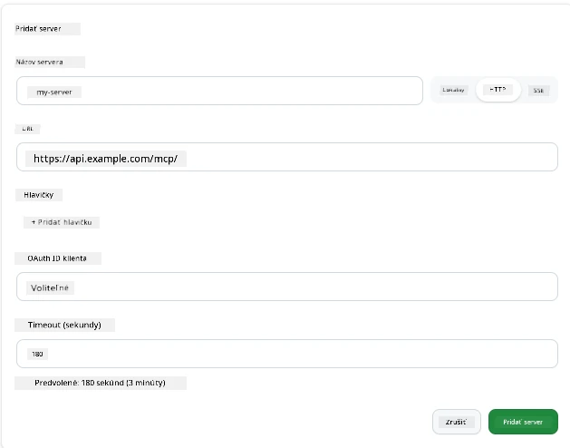
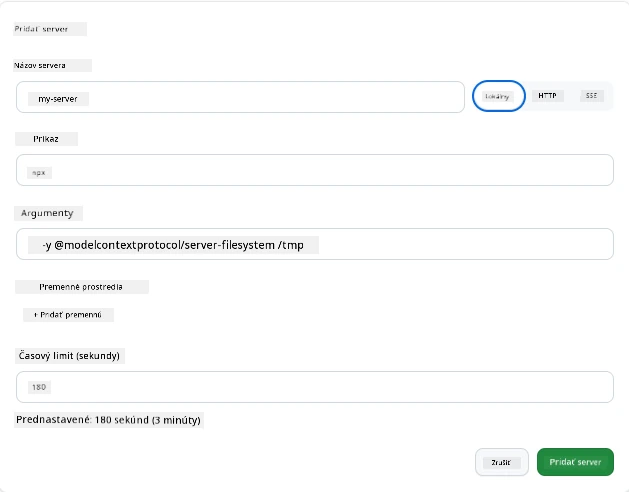

# Používanie MCP serverov v aplikácii GitHub Copilot

Už viete, ako MCP funguje. Vytvorili ste servery, definovali nástroje a zdroje a prepojili klientov. Čo sme však ešte neurobili, je zmena perspektívy: namiesto toho, aby ste boli ten, kto server vytvára, ako to vyzerá na strane *spotrebiteľa* – ako používateľ aplikácie poháňanej AI, ktorá podporuje MCP?

[GitHub Copilot App](https://github.com/github/app) je desktopová aplikácia, ktorá môže používať MCP servery. Pripojením MCP serverov k nej odomknete novú úroveň: Copilot teraz môže získať prístup k vašej dokumentácii, volať vaše interné API, dotazovať sa do vašej databázy alebo komunikovať s akoukoľvek službou, ktorú ste zabalili do servera. Aplikácia sa stáva hostiteľom; vaše MCP servery sa stávajú jej nástrojmi.

Táto lekcia vás prevedie celým procesom – od nájdenia panelu nastavení MCP, cez pripojenie reálneho dokumentačného servera až po vytvorenie vlastného servera.

## Ciele učenia

Na konci tejto lekcie budete vedieť:

- Nájduť a navigovať v paneli MCP serverov v nastaveniach aplikácie Copilot.
- Pripojiť hostovaný dokumentačný server a použiť ho v relácii.
- Zaregistrovať vlastný server a overiť, že Copilot môže volať jeho nástroje.
- Nakonfigurovať spôsob volania servera pomocou environmentálnych premenných alebo vlastných hlavičiek (ak HTTP).

## Aplikácia Copilot ako MCP hostiteľ

Tu je základná myšlienka: **Agenti Copilota sú inteligentní, ale vedia len to, čo im poviete.** Štandardne agent môže čítať súbory vo vašom pracovnom priestore a spúšťať príkazy v termináli, ale nemôže dotazovať vašu databázu, nazrieť do kalendára ani volať vlastné API bez pomoci. Tu prichádzajú na rad MCP servery. Pôsobia ako mosty medzi Copilotom a vašimi systémami – databázami, verzovacím systémom, API, dizajnovými nástrojmi – a dávajú agentom prístup k potrebným informáciám a akciám na dokončenie práce.

Začnime tým, že nájdeme nastavenia pre správu MCP serverov vo vašej aplikácii.

## Krok 1: Nájdenie panelu nastavení MCP

Otvorte aplikáciu Copilot a nájdite ikonu ozubeného kolieska v ľavom dolnom rohu a kliknite na ňu.


Uistite sa, že ste vybrali "MCP Servers" a mali by ste vidieť už nakonfigurované servery navrchu, trh populárnych serverov dole a tlačidlo "Add Server" (Pridať server) navrchu takto:



Toto je vaše riadiace centrum. Tu pridávate, odstraňujete, povoľujete a zakazujete servery. Zmeny sa prejavia pri nových reláciách; ak máte otvorenú reláciu, po zmene tohto zoznamu budete musieť spustiť novú.

## Krok 2: Pripojenie dokumentačného servera

Urobme niečo hneď užitočné. Microsoft Docs MCP server dáva Copilotu prístup k oficiálnej dokumentácii Microsoftu. Zahŕňa Azure, .NET, TypeScript a ďalšie. Namiesto toho, aby sa agent spoliehal na dáta zo svojho trénovania (ktoré majú ohraničený dátum), môže načítať aktuálnu dokumentáciu v čase dopytu.

Takto ho pridáte:

1. V mriežke populárnych serverov napíšte **learn** a vyberte server nazvaný "Microsoft Learn".

   

   Po kliknutí sa zobrazí formulár, kde sú predvyplnené meno, typ prenosu a URL, vy len kliknete na "Add Server".

2. Kliknite na "Add Server", malo by chvíľu trvať, kým sa server pripojí.

   

   Po pridaní by mal byť server viditeľný v hornej časti ako nakonfigurovaný server. Vyskúšajme ho teraz.

3. Zavrite dialógové okno a vyberte Quick chat.

4. Napíšte nižšie uvedený prompt na spustenie nástroja na serveri Microsoft Learn.

   ```text
   What's the current recommended approach for handling Azure Blob Storage 
   retries using the .NET SDK?
   ```

   

Mali by ste vidieť, ako sa odkazuje na MCP server, ktorý sme práve pridali.

## Krok 3: Pripojenie vlastného stdio servera

Prednastavenia sú pohodlné, ale skutočná sila je v pripájaní vlastných serverov. Povedzme, že ste vytvorili server (alebo vám bol poskytnutý), ktorý sprístupňuje vaše interné API alebo firemnú databázu znalostí. V tomto prípade použijeme MCP server, ktorý sme vytvorili pre správu zásob našej firmy.

1. Kliknite na ozubené koliesko a znova vyberte "MCP servers".

2. Kliknite na tlačidlo "Add Server" a potom "+ Add Custom server" a zadajte tieto hodnoty:

   - Názov: `Inventory Server`
   - Vyberte typ prenosu (na pravej strane), **http**

   Kliknite na "Add Server" a mal by sa zobraziť vo vašom zozname nakonfigurovaných serverov.

   

4. Na vyskúšanie spustite prompt takto:

    ```
    list inventory
    ```

   

   Teraz by ste mali vidieť zoznam položiek zásob vrátených z vášho vlastnoručne vytvoreného servera.

Skvelé, teraz by ste mali dobrý prehľad, ako pridávať externé i vlastné MCP servery do aplikácie Copilot. Ďalej si povieme o správe hesiel a environmentálnych premenných.

## Krok 4: Pokročilé nastavenia

Doteraz ste videli, ako pridať MCP servery, kde stačí zadať meno a URL. Ale čo ak váš server potrebuje API kľúč alebo inú hodnotu? V závislosti od typu prenosu mu vieme poskytnúť, čo potrebuje.

- **http alebo SSE prenos**: Tu môžeme nastaviť hlavičky podľa potreby.

   Pre autentifikáciu možno špecifikovať napríklad hlavičku Authorization. Hodnota môže byť statický reťazec. Ak používate OAuth, môžete namiesto toho zadať OAuth client ID.

   

- **stdio prenos**: Môžete nastaviť environmentálne premenné.

   Tu môžete zadať ľubovoľný počet environmentálnych premenných, ktoré sa majú odovzdať serveru pri jeho spustení.

   

## Zhrnutie

Aplikácia Copilot zaobchádza s MCP servermi ako s prvotriednymi rozšíreniami schopností agenta. V tejto lekcii ste videli celý proces od pridania MCP serverov až po ich používanie v relácii. Teraz môžete pripojiť verejné servery, interné API a vlastné nástroje, čím dávate svojim agentom možnosť získať informácie a vykonávať akcie potrebné na autonómne dokončenie úloh.

## 📚 Dodatočné zdroje

### Oficiálna dokumentácia

- [GitHub Copilot App](https://github.com/github/app)
- [MCP Specification](https://modelcontextprotocol.io/specification/2025-03-26) - Špecifikácia Model Context Protocol

### Komunita
- [MCP Community Discord](https://discord.com/invite/ByRwuEEgH4) - Živé diskusie
- [GitHub Discussions](https://github.com/microsoft/MCP-Server-and-PostgreSQL-Sample-Retail/discussions) - Otázky a odpovede a zdieľanie
- [Stack Overflow](https://stackoverflow.com/questions/tagged/model-context-protocol) - Technické otázky

---

<!-- CO-OP TRANSLATOR DISCLAIMER START -->
**Vyhlásenie o zodpovednosti**:
Tento dokument bol preložený pomocou AI prekladateľskej služby [Co-op Translator](https://github.com/Azure/co-op-translator). Hoci sa snažíme o presnosť, vezmite prosím na vedomie, že automatické preklady môžu obsahovať chyby alebo nepresnosti. Pôvodný dokument v jeho natívnom jazyku by mal byť považovaný za autoritatívny zdroj. Pre kritické informácie sa odporúča profesionálny ľudský preklad. Nie sme zodpovední za žiadne nedorozumenia alebo nesprávne interpretácie vyplývajúce z použitia tohto prekladu.
<!-- CO-OP TRANSLATOR DISCLAIMER END -->