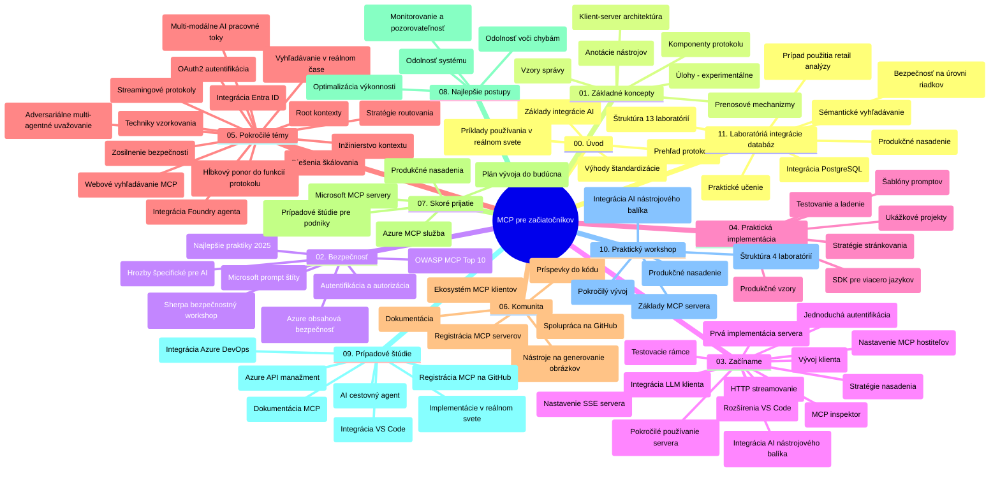

# Model Context Protocol (MCP) pre začiatočníkov - Študijný sprievodca

Tento študijný sprievodca poskytuje prehľad o štruktúre a obsahu repozitára pre učebný plán „Model Context Protocol (MCP) pre začiatočníkov“. Použite tento sprievodca na efektívnu orientáciu v repozitári a maximálne využitie dostupných zdrojov.

## Prehľad repozitára

Model Context Protocol (MCP) je štandardizovaný rámec pre interakcie medzi AI modelmi a klientskymi aplikáciami. Pôvodne vytvorený spoločnosťou Anthropic, MCP je teraz udržiavaný širšou komunitou MCP prostredníctvom oficiálnej GitHub organizácie. Tento repozitár poskytuje komplexný učebný plán s praktickými ukážkami kódu v C#, Java, JavaScript, Python a TypeScript, navrhnutý pre AI vývojárov, systémových architektov a softvérových inžinierov.

## Vizualizácia učebného plánu

## Štruktúra repozitára

Repozitár je usporiadaný do jedenástich hlavných sekcií, z ktorých každá sa zameriava na rôzne aspekty MCP:

1. **Úvod (00-Introduction/)**
   - Prehľad Model Context Protocol
   - Prečo je štandardizácia dôležitá v AI pipeline
   - Praktické prípady použitia a výhody

2. **Základné koncepty (01-CoreConcepts/)**
   - Klient-server architektúra
   - Kľúčové komponenty protokolu
   - Komunikačné vzory v MCP

3. **Bezpečnosť (02-Security/)**
   - Bezpečnostné hrozby v systémoch založených na MCP
   - Najlepšie postupy pre zabezpečenie implementácií
   - Stratégie autentifikácie a autorizácie
   - **Komplexná dokumentácia o bezpečnosti**:
     - MCP bezpečnostné najlepšie postupy 2025
     - Príručka implementácie Azure Content Safety
     - Kontroly a techniky bezpečnosti MCP
     - Rýchla referencia najlepších bezpečnostných praktík MCP
   - **Kľúčové bezpečnostné témy**:
     - Útoky na prompt injekciu a otravu nástrojov
     - Únos relácie a dilematu zmäteného zástupcu
     - Zraniteľnosti pri prenose tokenov
     - Nadmerné oprávnenia a kontrola prístupu
     - Bezpečnosť dodávateľského reťazca AI komponentov
     - Integrácia Microsoft Prompt Shields

4. **Začínáme (03-GettingStarted/)**
   - Nastavenie a konfigurácia prostredia
   - Vytváranie základných MCP serverov a klientov
   - Integrácia s existujúcimi aplikáciami
   - Obsahuje sekcie pre:
     - Prvú implementáciu servera
     - Vývoj klienta
     - Integráciu LLM klienta
     - Integráciu vo VS Code
     - Server-Sent Events (SSE) server
     - Pokročilé využitie servera
     - HTTP streamovanie
     - Integráciu AI Toolkit
     - Testovacie stratégie
     - Nasadzovacie pokyny

5. **Praktická implementácia (04-PracticalImplementation/)**
   - Používanie SDK v rôznych programovacích jazykoch
   - Ladenie, testovanie a validačné techniky
   - Vytváranie znovupoužiteľných šablón promptov a pracovných tokov
   - Ukážkové projekty s implementačnými príkladmi

6. **Pokročilé témy (05-AdvancedTopics/)**
   - Techniky inžinierstva kontextu
   - Integrácia Foundry agenta
   - Multimodálne AI pracovné toky
   - Ukážky autentifikácie OAuth2
   - Funkcie vyhľadávania v reálnom čase
   - Streamovanie v reálnom čase
   - Implementácia root kontextov
   - Stratégiami routingu
   - Techniky vzorkovania
   - Prístupy škálovania
   - Bezpečnostné úvahy
   - Integrácia zabezpečenia Entra ID
   - Integrácia webového vyhľadávania
   - Adversariálne multi-agentné uvažovanie (debatujúce vzory)

7. **Príspevky komunity (06-CommunityContributions/)**
   - Ako prispieť kód a dokumentáciu
   - Spolupráca cez GitHub
   - Vylepšenia a spätná väzba zo strany komunity
   - Používanie rôznych MCP klientov (Claude Desktop, Cline, VSCode)
   - Práca s populárnymi MCP servermi vrátane generovania obrázkov

8. **Lekcie z raného adopčného obdobia (07-LessonsfromEarlyAdoption/)**
   - Reálne implementácie a úspešné príbehy
   - Vytváranie a nasadzovanie riešení založených na MCP
   - Trendy a budúca roadmapa
   - **Príručka Microsoft MCP Serverov**: Komplexný návod na 10 produkčných Microsoft MCP serverov vrátane:
     - Microsoft Learn Docs MCP Server
     - Azure MCP Server (15+ špecializovaných konektorov)
     - GitHub MCP Server
     - Azure DevOps MCP Server
     - MarkItDown MCP Server
     - SQL Server MCP Server
     - Playwright MCP Server
     - Dev Box MCP Server
     - Microsoft Foundry MCP Server
     - Microsoft 365 Agents Toolkit MCP Server

9. **Najlepšie praktiky (08-BestPractices/)**
   - Ladenie výkonu a optimalizácia
   - Návrh MCP systémov odolných voči chybám
   - Testovacie a odolnostné stratégie

10. **Prípadové štúdie (09-CaseStudy/)**
    - **Sedem komplexných prípadových štúdií** demonštrujúcich všestrannosť MCP v rôznorodých scenároch:
    - **Azure AI cestovné agenti**: Multi-agentná orchestrácia s Azure OpenAI a AI Search
    - **Integrácia Azure DevOps**: Automatizácia pracovných procesov s YouTube dátovými aktualizáciami
    - **Vyhľadávanie dokumentácie v reálnom čase**: Python konzolový klient s HTTP streamovaním
    - **Interaktívny generátor študijných plánov**: Chainlit webová aplikácia s konverzačnou AI
    - **Dokumentácia v editore**: Integrácia vo VS Code s GitHub Copilot pracovnými tokmi
    - **Azure API Management**: Podniková API integrácia s vytváraním MCP servera
    - **GitHub MCP Registry**: Vývoj ekosystému a platforma pre agentickú integráciu
    - Implementačné príklady pokrývajúce podnikové integrácie, produktivitu vývojárov a vývoj ekosystémov

11. **Praktický workshop (10-StreamliningAIWorkflowsBuildingAnMCPServerWithAIToolkit/)**
    - Komplexný praktický workshop spájajúci MCP s AI Toolkit
    - Vytváranie inteligentných aplikácií prepájajúcich AI modely so svetovými nástrojmi
    - Praktické moduly pokrývajúce základy, vývoj vlastného servera a stratégie produkčného nasadenia
    - **Štruktúra labákov**:
      - Lab 1: Základy MCP servera
      - Lab 2: Pokročilý vývoj MCP servera
      - Lab 3: Integrácia AI Toolkit
      - Lab 4: Produkčné nasadenie a škálovanie
    - Prístup učenia založený na labákoch s krokmi po kroku

12. **Labáky pre integráciu MCP servera s databázou (11-MCPServerHandsOnLabs/)**
    - **Komplexná 13-labová vzdelávacia cesta** pre vývoj produkčných MCP serverov s integráciou PostgreSQL
    - **Reálna implementácia v maloobchode** použitím prípadu Zava Retail
    - **Podnikové vzory** vrátane Row Level Security (RLS), sémantického vyhľadávania a multi-tenant prístupu k dátam
    - **Kompletná štruktúra labákov**:
      - **Labáky 00-03: Základy** - Úvod, architektúra, bezpečnosť, nastavenie prostredia
      - **Labáky 04-06: Vytvorenie MCP servera** - Návrh databázy, implementácia MCP servera, vývoj nástrojov
      - **Labáky 07-09: Pokročilé funkcie** - Sémantické vyhľadávanie, testovanie a ladenie, integrácia VS Code
      - **Labáky 10-12: Produkcia a najlepšie praktiky** - Nasadenie, monitoring, optimalizácia
    - **Technológie zahrnuté**: FastMCP framework, PostgreSQL, Azure OpenAI, Azure Container Apps, Application Insights
    - **Výsledky učenia**: Produkčné MCP servery, vzory integrácie databázy, analytika podporovaná AI, podniková bezpečnosť

## Ďalšie zdroje

Repozitár obsahuje aj podporné zdroje:

- **Zložka Images**: Obsahuje diagramy a ilustrácie používané v učebnom pláne
- **Preklady**: Podpora viacerých jazykov s automatickými prekladmi dokumentácie
- **Oficiálne MCP zdroje**:
  - [MCP Dokumentácia](https://modelcontextprotocol.io/)
  - [MCP Špecifikácia](https://spec.modelcontextprotocol.io/)
  - [MCP GitHub repozitár](https://github.com/modelcontextprotocol)

## Ako používať tento repozitár

1. **Sekvenčné učenie**: Sledujte kapitoly v poradí (00 až 11) pre štruktúrovaný výučbový zážitok.
2. **Zameranie na konkrétny jazyk**: Ak máte záujem o konkrétny programovací jazyk, preskúmajte priečinky so vzorkami pre implementácie vo vašom preferovanom jazyku.
3. **Praktická implementácia**: Začnite sekciou „Začínáme“ pre nastavenie prostredia a vytvorenie prvého MCP servera a klienta.
4. **Pokročilé skúmanie**: Keď sa oboznámite so základmi, ponorte sa do pokročilých tém a rozšírte svoje znalosti.
5. **Zapojenie komunity**: Pripojte sa ku komunite MCP prostredníctvom GitHub diskusií a Discord kanálov, aby ste sa spojili s odborníkmi a ďalšími vývojármi.

## MCP klienti a nástroje

Učebný plán pokrýva rôznych MCP klientov a nástroje:

1. **Oficiálni klienti**:
   - Visual Studio Code 
   - MCP vo Visual Studio Code
   - Claude Desktop
   - Claude vo VSCode 
   - Claude API

2. **Klienti komunity**:
   - Cline (terminálový)
   - Cursor (kódový editor)
   - ChatMCP
   - Windsurf

3. **Nástroje na správu MCP**:
   - MCP CLI
   - MCP Manager
   - MCP Linker
   - MCP Router

## Populárne MCP servery

Repozitár predstavuje rôzne MCP servery, vrátane:

1. **Oficiálne Microsoft MCP servery**:
   - Microsoft Learn Docs MCP Server
   - Azure MCP Server (15+ špecializovaných konektorov)
   - GitHub MCP Server
   - Azure DevOps MCP Server
   - MarkItDown MCP Server
   - SQL Server MCP Server
   - Playwright MCP Server
   - Dev Box MCP Server
   - Microsoft Foundry MCP Server
   - Microsoft 365 Agents Toolkit MCP Server

2. **Oficiálne referenčné servery**:
   - Filesystem
   - Fetch
   - Memory
   - Sequential Thinking

3. **Generovanie obrázkov**:
   - Azure OpenAI DALL-E 3
   - Stable Diffusion WebUI
   - Replicate

4. **Vývojové nástroje**:
   - Git MCP
   - Terminal Control
   - Code Assistant

5. **Špecializované servery**:
   - Salesforce
   - Microsoft Teams
   - Jira & Confluence

## Príspevky

Tento repozitár víta príspevky od komunity. Pozrite si sekciu Príspevky komunity pre usmernenie, ako efektívne prispieť do ekosystému MCP.

----

*Tento študijný sprievodca bol naposledy aktualizovaný 5. februára 2026, odrážajúc najnovšiu MCP špecifikáciu 2025-11-25 a poskytuje prehľad repozitára k tomuto dátumu. Obsah repozitára môže byť po tomto dátume aktualizovaný.*

---

<!-- CO-OP TRANSLATOR DISCLAIMER START -->
**Vyhlásenie o zodpovednosti**:
Tento dokument bol preložený pomocou AI prekladateľskej služby [Co-op Translator](https://github.com/Azure/co-op-translator). Hoci sa snažíme o presnosť, vezmite prosím na vedomie, že automatické preklady môžu obsahovať chyby alebo nepresnosti. Pôvodný dokument v jeho natívnom jazyku by mal byť považovaný za autoritatívny zdroj. Pre kritické informácie sa odporúča profesionálny ľudský preklad. Nie sme zodpovední za žiadne nedorozumenia alebo nesprávne interpretácie vyplývajúce z použitia tohto prekladu.
<!-- CO-OP TRANSLATOR DISCLAIMER END -->