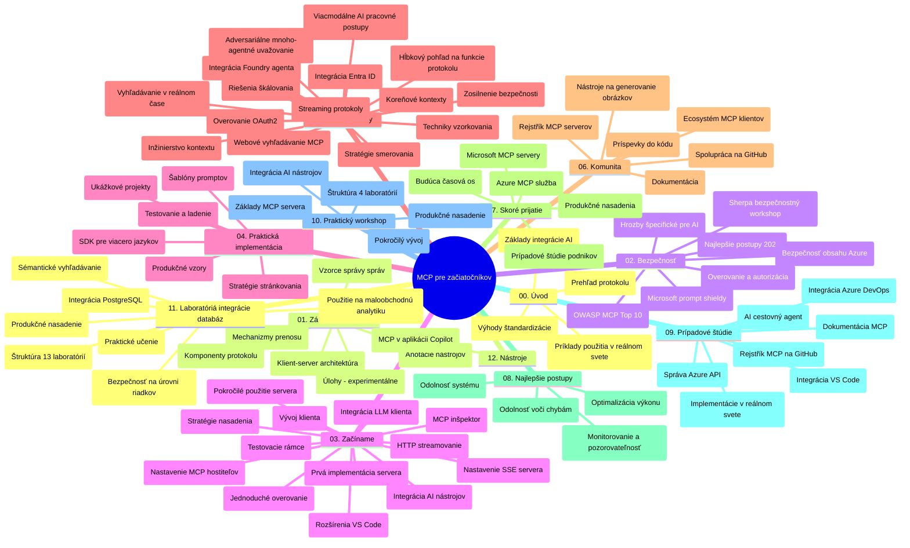

# Model Context Protocol (MCP) pre začiatočníkov - Študijný sprievodca

Tento študijný sprievodca poskytuje prehľad štruktúry a obsahu repozitára pre kurikulum "Model Context Protocol (MCP) pre začiatočníkov". Použite tento sprievodca na efektívnu orientáciu v repozitári a maximálne využitie dostupných zdrojov.

## Prehľad repozitára

Model Context Protocol (MCP) je štandardizovaný rámec pre interakcie medzi AI modelmi a klientskymi aplikáciami. Pôvodne vytvorený spoločnosťou Anthropic, MCP je teraz udržiavaný širšou komunitou MCP prostredníctvom oficiálnej organizácie na GitHub-e. Tento repozitár poskytuje komplexné kurikulum s praktickými príkladmi kódu v C#, Jave, JavaScripte, Pythone a TypeScripte, navrhnuté pre AI vývojárov, systémových architektov a softvérových inžinierov.

## Vizualizácia kurikula

## Štruktúra repozitára

Repozitár je organizovaný do dvanástich hlavných sekcií, z ktorých každá sa zameriava na iný aspekt MCP:

1. **Úvod (00-Introduction/)**
   - Prehľad Model Context Protocol
   - Prečo je štandardizácia dôležitá v AI pipeline
   - Praktické prípady použitia a prínosy

2. **Základné koncepty (01-CoreConcepts/)**
   - Klient-server architektúra
   - Kľúčové komponenty protokolu
   - Vzory správ v MCP

3. **Bezpečnosť (02-Security/)**
   - Bezpečnostné hrozby v systémoch založených na MCP
   - Najlepšie postupy pre zabezpečenie implementácií
   - Stratégie overovania a autorizácie
   - **Komplexná bezpečnostná dokumentácia**:
     - Najlepšie praktiky zabezpečenia MCP 2025
     - Príručka implementácie Azure Content Safety
     - Kontroly a techniky bezpečnosti MCP
     - Rýchly prehľad najlepších praktík MCP
   - **Kľúčové bezpečnostné témy**:
     - Útoky na vkladanie promptov a otrava nástrojov
     - Únos relácie a problémy zmätku právomocí
     - Zraniteľnosti token passthrough
     - Nadmerné povolenia a riadenie prístupu
     - Zabezpečenie dodávateľského reťazca pre AI komponenty
     - Integrácia Microsoft Prompt Shields

4. **Začíname (03-GettingStarted/)**
   - Nastavenie a konfigurácia prostredia
   - Vytváranie základných MCP serverov a klientov
   - Integrácia so existujúcimi aplikáciami
   - Obsahuje sekcie pre:
     - Prvú implementáciu servera
     - Vývoj klienta
     - Integráciu LLM klienta
     - Integráciu do VS Code
     - Server-Sent Events (SSE) server
     - Pokročilé použitie servera
     - HTTP streamovanie
     - Integráciu AI Toolkit
     - Testovacie stratégie
     - Pokyny pre nasadenie

5. **Praktická implementácia (04-PracticalImplementation/)**
   - Použitie SDK v rôznych programovacích jazykoch
   - Ladenie, testovanie a techniky validácie
   - Tvorba opakovane použiteľných prompt šablón a pracovných tokov
   - Vzorové projekty s príkladmi implementácie

6. **Pokročilé témy (05-AdvancedTopics/)**
   - Techniky kontextového inžinierstva
   - Integrácia agenta Foundry
   - Multimodálne AI pracovné toky
   - Demonstrácie OAuth2 autentifikácie
   - Realtime vyhľadávanie
   - Realtime streamovanie
   - Implementácia root kontextov
   - Routingové stratégie
   - Techniky vzorkovania
   - Prístupy škálovania
   - Bezpečnostné úvahy
   - Integrácia bezpečnosti Entra ID
   - Integrácia webového vyhľadávania
   - Adverzné multiagentné uvažovanie (vzor debaty)

7. **Príspevky od komunity (06-CommunityContributions/)**
   - Ako prispievať kódom a dokumentáciou
   - Spolupráca cez GitHub
   - Vylepšenia a spätná väzba riadené komunitou
   - Použitie rôznych MCP klientov (Claude Desktop, Cline, VSCode)
   - Práca s populárnymi MCP servermi vrátane generovania obrázkov

8. **Skúsenosti z raného prijatia (07-LessonsfromEarlyAdoption/)**
   - Reálne implementácie a úspešné príbehy
   - Budovanie a nasadzovanie riešení založených na MCP
   - Trendy a budúci plán vývoja
   - **Sprievodca Microsoft MCP servermi**: Komplexný sprievodca 10 produkčne pripravenými Microsoft MCP servermi vrátane:
     - Microsoft Learn Docs MCP Server
     - Azure MCP Server (15+ špecializovaných konektorov)
     - GitHub MCP Server
     - Azure DevOps MCP Server
     - MarkItDown MCP Server
     - SQL Server MCP Server
     - Playwright MCP Server
     - Dev Box MCP Server
     - Microsoft Foundry MCP Server
     - Microsoft 365 Agents Toolkit MCP Server

9. **Najlepšie praktiky (08-BestPractices/)**
   - Ladenie výkonu a optimalizácie
   - Návrh MCP systémov odolných voči chybám
   - Testovacie a odolnostné stratégie

10. **Prípadové štúdie (09-CaseStudy/)**
    - **Sedem komplexných prípadových štúdií** ilustrujúcich univerzálnosť MCP v rôznych scenároch:
    - **Azure AI Travel Agents**: Multiagentná orchestrácia s Azure OpenAI a AI Search
    - **Integrácia Azure DevOps**: Automatizácia pracovných procesov s aktualizáciami údajov z YouTube
    - **Realtime vyhľadávanie dokumentácie**: Python konzolový klient s HTTP streamovaním
    - **Interaktívny generátor študijného plánu**: Webová aplikácia Chainlit s konverzačnou AI
    - **Dokumentácia vo VS Code**: Integrácia s GitHub Copilot pracovnými tokmi
    - **Správa API v Azure**: Podniková API integrácia a tvorba MCP servera
    - **Register GitHub MCP**: Rozvoj ekosystému a platforma pre agentnú integráciu
    - Príklady implementácie zahŕňajúce podnikové integrácie, produktivitu vývojárov a rozvoj ekosystému

11. **Praktický workshop (10-StreamliningAIWorkflowsBuildingAnMCPServerWithAIToolkit/)**
    - Komplexný praktický workshop kombinujúci MCP s AI Toolkit
    - Vývoj inteligentných aplikácií prepájajúcich AI modely s reálnymi nástrojmi
    - Praktické moduly pokrývajúce základy, vývoj vlastného servera a stratégie produkčného nasadenia
    - **Štruktúra labu**:
      - Lab 1: Základy MCP servera
      - Lab 2: Pokročilý vývoj MCP servera
      - Lab 3: Integrácia AI Toolkit
      - Lab 4: Nasadenie do produkcie a škálovanie
    - Výučba založená na laboratorioch s krokmi

12. **Laboratóriá integrácie MCP servera s databázou (11-MCPServerHandsOnLabs/)**
    - **Komplexná 13-laboratórna učebná cesta** na tvorbu produkčne pripravených MCP serverov s integráciou PostgreSQL
    - **Implementácia analýz maloobchodu v reálnom svete** cez prípad použitia Zava Retail
    - **Podnikové vzory** vrátane Row Level Security (RLS), semantického vyhľadávania a viacnájomníckeho prístupu k dátam
    - **Kompletná štruktúra laboratórií**:
      - **Laby 00-03: Základy** - Úvod, Architektúra, Bezpečnosť, Nastavenie prostredia
      - **Laby 04-06: Vývoj MCP servera** - Návrh databázy, implementácia MCP servera, vývoj nástrojov
      - **Laby 07-09: Pokročilé funkcie** - Semantické vyhľadávanie, testovanie a ladenie, integrácia VS Code
      - **Laby 10-12: Produkcia a najlepšie praktiky** - Nasadenie, monitorovanie, optimalizácia
    - **Pokryté technológie**: FastMCP framework, PostgreSQL, Azure OpenAI, Azure Container Apps, Application Insights
    - **Výsledky učenia**: Produkčne pripravené MCP servery, vzory integrácie databázy, analytika poháňaná AI, podniková bezpečnosť

13. **Nástroje (12-tooling/)**
    - Naučte sa používať MCP v aplikácii Copilot a iných nástrojoch

## Ďalšie zdroje

Repozitár obsahuje podporné zdroje:

- **Priečinok s obrázkami**: Obsahuje diagramy a ilustrácie používané v celom kurikule
- **Preklady**: Viacjazyčná podpora s automatizovanými prekladmi dokumentácie
- **Oficiálne zdroje MCP**:
  - [MCP Dokumentácia](https://modelcontextprotocol.io/)
  - [MCP Špecifikácia](https://spec.modelcontextprotocol.io/)
  - [MCP GitHub Repozitár](https://github.com/modelcontextprotocol)

## Ako používať tento repozitár

1. **Postupné učenie**: Sledujte kapitoly v poradí (00 až 11) pre systematický učebný zážitok.
2. **Zameranie na konkrétny jazyk**: Ak vás zaujíma konkrétny programovací jazyk, preskúmajte priečinky so vzormi implementácií vo vašom preferovanom jazyku.
3. **Praktická implementácia**: Začnite v sekcii "Začíname" pre nastavenie prostredia a vytvorenie prvého MCP servera a klienta.
4. **Pokročilé skúmanie**: Po zvládnutí základov sa pustite do pokročilých tém na rozšírenie svojich vedomostí.
5. **Zapojenie komunity**: Pridajte sa ku komunite MCP cez GitHub diskusie a Discord kanály, spojte sa s odborníkmi a ostatnými vývojármi.

## MCP klienti a nástroje

Kurikulum pokrýva rôznych MCP klientov a nástrojov:

1. **Oficiálni klienti**:
   - Visual Studio Code
   - MCP vo Visual Studio Code
   - Claude Desktop
   - Claude vo VSCode
   - Claude API

2. **Klienti od komunity**:
   - Cline (terminálový klient)
   - Cursor (editor kódu)
   - ChatMCP
   - Windsurf

3. **Nástroje na správu MCP**:
   - MCP CLI
   - MCP Manager
   - MCP Linker
   - MCP Router

## Populárne MCP servery

Repozitár predstavuje rôzne MCP servery vrátane:

1. **Oficiálne Microsoft MCP servery**:
   - Microsoft Learn Docs MCP Server
   - Azure MCP Server (15+ špecializovaných konektorov)
   - GitHub MCP Server
   - Azure DevOps MCP Server
   - MarkItDown MCP Server
   - SQL Server MCP Server
   - Playwright MCP Server
   - Dev Box MCP Server
   - Microsoft Foundry MCP Server
   - Microsoft 365 Agents Toolkit MCP Server

2. **Oficiálne referenčné servery**:
   - Filesystem
   - Fetch
   - Memory
   - Sequential Thinking

3. **Generovanie obrázkov**:
   - Azure OpenAI DALL-E 3
   - Stable Diffusion WebUI
   - Replicate

4. **Vývojové nástroje**:
   - Git MCP
   - Terminal Control
   - Code Assistant

5. **Špecializované servery**:
   - Salesforce
   - Microsoft Teams
   - Jira & Confluence

## Príspevky

Tento repozitár víta príspevky od komunity. Pozrite sekciu Príspevky od komunity pre návod, ako efektívne prispievať do MCP ekosystému.

----

*Tento študijný sprievodca bol naposledy aktualizovaný 5. februára 2026, zodpovedá najnovšej špecifikácii MCP 2025-11-25 a poskytuje prehľad repozitára k tomuto dátumu. Obsah repozitára môže byť po tomto dátume aktualizovaný.*

---

<!-- CO-OP TRANSLATOR DISCLAIMER START -->
**Vyhlásenie o zodpovednosti**:
Tento dokument bol preložený pomocou AI prekladateľskej služby [Co-op Translator](https://github.com/Azure/co-op-translator). Hoci sa snažíme o presnosť, vezmite prosím na vedomie, že automatické preklady môžu obsahovať chyby alebo nepresnosti. Pôvodný dokument v jeho natívnom jazyku by mal byť považovaný za autoritatívny zdroj. Pre kritické informácie sa odporúča profesionálny ľudský preklad. Nie sme zodpovední za žiadne nedorozumenia alebo nesprávne interpretácie vyplývajúce z použitia tohto prekladu.
<!-- CO-OP TRANSLATOR DISCLAIMER END -->