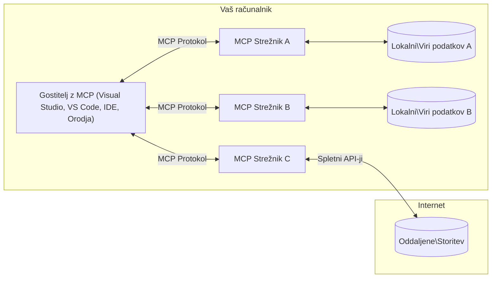

# Osnovni koncepti MCP: Obvladovanje protokola Model Context za integracijo umetne inteligence

[](https://youtu.be/earDzWGtE84)

_(Kliknite zgornjo sliko za ogled videoposnetka te lekcije)_

[Protokol Model Context (MCP)](https://github.com/modelcontextprotocol) je zmogljiv, standardiziran okvir, ki optimizira komunikacijo med velikimi jezikovnimi modeli (LLM) in zunanjimi orodji, aplikacijami ter podatkovnimi viri.  
Ta vodnik vas bo vodil skozi osnovne koncepte MCP. Spoznali boste njegovo arhitekturo klient-strežnik, bistvene komponente, mehanizme komunikacije in najboljše prakse za implementacijo.

- **Izrecno soglasje uporabnika**: Ves dostop do podatkov in operacije zahtevajo izrecno odobritev uporabnika pred izvedbo. Uporabniki morajo jasno razumeti, do katerih podatkov bo dostopano in katere ukrepe bodo izvedeni, z natančnim nadzorom nad dovoljenji in pooblastili.

- **Zaščita zasebnosti podatkov**: Uporabniški podatki so razkriti le z izrecnim soglasjem in morajo biti zaščiteni z robustnimi nadzori dostopa skozi celoten življenjski cikel interakcije. Implementacije morajo preprečiti nepooblaščeno prenos podatkov in ohranjati stroge meje zasebnosti.

- **Varnost izvajanja orodij**: Vsak klic orodja zahteva izrecno soglasje uporabnika z jasnim razumevanjem funkcionalnosti orodja, parametrov in možnega vpliva. Robustne varnostne meje morajo preprečiti nenamerno, nevarno ali zlonamerno izvajanje orodij.

- **Varnost sloja prenosa**: Vsi komunikacijski kanali naj uporabljajo ustrezne mehanizme za šifriranje in overjanje. Oddaljene povezave naj izvajajo varne transportne protokole in ustrezno upravljanje poverilnic.

#### Smernice za implementacijo:

- **Upravljanje dovoljenj**: Uvedite finozrnate sisteme dovoljenj, ki omogočajo uporabnikom nadzor nad dostopnostjo strežnikov, orodij in virov  
- **Overjanje & avtorizacija**: Uporabite varne metode overjanja (OAuth, API ključi) z ustreznim upravljanjem žetonov in potekom veljavnosti  
- **Validacija vhodnih podatkov**: Validirajte vse parametre in vhodne podatke v skladu z določenimi shemami za preprečitev napadov z vbrizgavanjem  
- **Revizijsko beleženje**: Ohranite obsežne zapise vseh operacij za varnostno spremljanje in usklajenost

## Pregled

Ta lekcija raziskuje temeljno arhitekturo in komponente, ki sestavljajo MCP ekosistem. Spoznali boste klient-strežniško arhitekturo, ključne komponente in komunikacijske mehanizme, ki poganjajo interakcije MCP.

## Ključni cilji učenja

Do konca te lekcije boste:

- Razumeli arhitekturo MCP klient-strežnik.  
- Prepoznali vloge in odgovornosti gostiteljev, klientov in strežnikov.  
- Analizirali osnovne značilnosti, ki MCP naredijo fleksibilno integracijsko plast.  
- Spoznali, kako informacije tečejo znotraj MCP ekosistema.  
- Pridobili praktične vpoglede preko primerov kode v .NET, Javi, Pythonu in JavaScriptu.

## MCP arhitektura: Podrobnejši pogled

MCP ekosistem temelji na klient-strežniškem modelu. Ta modularna struktura omogoča AI aplikacijam, da učinkovito komunicirajo z orodji, bazami podatkov, API-ji in kontekstualnimi viri. Razdelimo to arhitekturo na njene ključne komponente.

V osnovi sledi MCP klient-strežniški arhitekturi, kjer lahko gostiteljska aplikacija poveže več strežnikov:


- **Gosti MCP**: Programi, kot so VSCode, Claude Desktop, IDE-ji ali AI orodja, ki želijo dostopati do podatkov preko MCP  
- **Klienti MCP**: Protokolni klienti, ki vzdržujejo 1:1 povezave s strežniki  
- **Strežniki MCP**: Lahki programi, ki vsak izpostavljajo določene sposobnosti preko standardiziranega protokola Model Context  
- **Lokalni podatkovni viri**: Datoteke, baze podatkov in storitve na vašem računalniku, do katerih lahko MCP strežniki varno dostopajo  
- **Oddaljene storitve**: Zunanje sisteme, dostopne preko interneta, s katerimi se MCP strežniki lahko povežejo preko API-jev.

Protokol MCP je razvijajoči se standard s časovno osnovanim verzioniranjem (format LLLL-MM-DD). Trenutna verzija protokola je **2025-11-25**. Najnovejše posodobitve si lahko ogledate v [specifikaciji protokola](https://modelcontextprotocol.io/specification/2025-11-25/).

### 1. Gosti

V protokolu Model Context (MCP) so **gosti** AI aplikacije, ki služijo kot primarno uporabniško vmesniško točko za interakcijo s protokolom. Gosti koordinirajo in upravljajo povezave do več MCP strežnikov z ustvarjanjem namenskih MCP klientov za vsako strežniško povezavo. Primeri gostov so:

- **AI aplikacije**: Claude Desktop, Visual Studio Code, Claude Code  
- **Razvojna okolja**: IDE-ji in urejevalniki kode z MCP integracijo  
- **Prilagojene aplikacije**: Namenjeni AI agenti in orodja

**Gosti** so aplikacije, ki usklajujejo interakcije z AI modeli. Oni:

- **Orkestrirajo AI modele**: Izvajajo ali komunicirajo z LLM-ji za generiranje odgovorov in usklajevanje AI delovnih tokov  
- **Upravljajo klientske povezave**: Ustvarijo in vzdržujejo en MCP klient na povezavo strežnika  
- **Nadzorujejo uporabniški vmesnik**: Upravljajo potek pogovora, uporabniške interakcije in prikaz odgovorov  
- **Vzorčijo varnost**: Upravljajo dovoljenja, varnostne omejitve in overjanje  
- **Ravnajo z uporabniškim soglasjem**: Upravljajo odobritev uporabnika za deljenje podatkov in izvajanje orodij

### 2. Klienti

**Klienti** so ključne komponente, ki vzdržujejo posebne en-za-en povezave med gosti in MCP strežniki. Vsak MCP klient je ustvarjen s strani gostitelja za povezavo s specifičnim MCP strežnikom, kar zagotavlja organizirane in varne komunikacijske kanale. Več klientov omogoča gostiteljem, da se hkrati povežejo z več strežniki.

**Klienti** so povezovalni elementi znotraj gostiteljske aplikacije. Oni:

- **Komunikacija po protokolu**: Pošiljajo zahteve JSON-RPC 2.0 strežnikom s pozivi in navodili  
- **Pogajanja zmožnosti**: Pogajajo podprte funkcije in verzije protokola s strežniki med inicializacijo  
- **Izvajanje orodij**: Upravljajo zahteve za izvajanje orodij iz modelov in obdelujejo odgovore  
- **Posodobitve v realnem času**: Obdelujejo obvestila in posodobitve strežnikov v realnem času  
- **Obdelava odgovorov**: Obdelujejo in formatirajo strežniške odgovore za prikaz uporabnikom

### 3. Strežniki

**Strežniki** so programi, ki zagotavljajo kontekst, orodja in zmogljivosti MCP klientom. Lahko tečejo lokalno (na istem računalniku kot gostitelj) ali oddaljeno (na zunanjih platformah) in so odgovorni za obdelavo zahtev klientov ter zagotavljanje strukturiranih odgovorov. Strežniki izpostavljajo specifično funkcionalnost preko standardiziranega protokola Model Context.

**Strežniki** so storitve, ki zagotavljajo kontekst in zmogljivosti. Oni:

- **Registracija funkcionalnosti**: Registrirajo in izpostavljajo razpoložljive primitivne elemente (viri, pozivi, orodja) klientom  
- **Obdelava zahtev**: Prejemajo in izvajajo klice orodij, zahteve po virih in pozivih od klientov  
- **Zagotovitev konteksta**: Zagotavljajo kontekstualne informacije in podatke za izboljšanje odgovorov modela  
- **Upravljanje stanja**: Ohranjajo stanje seje in obravnavajo stanje v primeru potreb  
- **Obvestila v realnem času**: Pošiljajo obvestila o spremembah zmogljivosti in posodobitvah povezanih klientov

Strežnike lahko razvije kdorkoli za razširitev zmogljivosti modela s specializirano funkcionalnostjo in podpirajo tako lokalne kot oddaljene scenarije implementacije.

### 4. Strežniški primitivni elementi

Strežniki v protokolu Model Context (MCP) zagotavljajo tri osnovne **primitivne elemente**, ki določajo temeljne gradnike za bogate interakcije med klienti, gosti in jezikovnimi modeli. Ti primitivni elementi določajo vrste kontekstualnih informacij in razpoložljivih dejanj preko protokola.

MCP strežniki lahko izpostavijo katerokoli kombinacijo naslednjih treh osnovnih primitivnih elementov:

#### Viri

**Viri** so podatkovni viri, ki zagotavljajo kontekstualne informacije AI aplikacijam. Predstavljajo statično ali dinamično vsebino, ki lahko izboljša razumevanje in odločanje modela:

- **Kontekstni podatki**: Strukturirane informacije in kontekst za porabo AI modelov  
- **Bazе znanja**: Repozitoriji dokumentov, članki, priročniki in raziskovalni prispevki  
- **Lokalni podatkovni viri**: Datoteke, baze podatkov in lokalne sistemske informacije  
- **Zunanji podatki**: Odgovori API-jev, spletne storitve in podatki oddaljenih sistemov  
- **Dinamična vsebina**: Podatki v realnem času, ki se posodabljajo glede na zunanje pogoje

Viri so identificirani z URI-ji in podpirajo iskanje preko metod `resources/list` ter pridobivanje preko `resources/read`:

```text
file://documents/project-spec.md
database://production/users/schema
api://weather/current
```

#### Pozivi

**Pozivi** so ponovno uporabni predlogi, ki pomagajo strukturirati interakcije z jezikovnimi modeli. Zagotavljajo standardizirane vzorce interakcije in predloge delovnih tokov:

- **Interakcije na osnovi predlog**: Vnaprej strukturirana sporočila in začetki pogovorov  
- **Predloge delovnih tokov**: Standardizirani zaporedji za pogoste naloge in interakcije  
- **Primeri z več stili**: Predloge na osnovi primerov za navodila modelom  
- **Sistemski pozivi**: Temeljni pozivi, ki definirajo vedenje in kontekst modela  
- **Dinamične predloge**: Parametrizirani pozivi, ki se prilagajajo specifičnim kontekstom

Pozivi podpirajo substitucijo spremenljivk in so dosegljivi preko `prompts/list` ter pridobljivi preko `prompts/get`:

```markdown
Generate a {{task_type}} for {{product}} targeting {{audience}} with the following requirements: {{requirements}}
```

#### Orodja

**Orodja** so izvršljive funkcije, ki jih lahko AI modeli kličejo za izvajanje določenih dejanj. Predstavljajo "glagole" MCP ekosistema, ki omogočajo modelom interakcijo z zunanjimi sistemi:

- **Izvršljive funkcije**: Diskretne operacije, ki jih modeli lahko kličejo s specifičnimi parametri  
- **Integracija z zunanjimi sistemi**: Klici API-jev, poizvedbe v bazah podatkov, operacije z datotekami, izračuni  
- **Edinstvena identiteta**: Vsako orodje ima svoje ime, opis in shemo parametrov  
- **Strukturiran vhod/izhod**: Orodja sprejemajo validirane parametre in vračajo strukturirane, tipizirane odgovore  
- **Možnosti ukrepov**: Omogočajo modelom izvajanje dejanj v resničnem svetu in pridobivanje živih podatkov

Orodja so definirana z JSON shemami za validacijo parametrov in so odkrita preko `tools/list` ter izvršena preko `tools/call`. Orodja lahko vključujejo tudi **ikone** kot dodatno metapodatke za boljšo predstavitev uporabniškega vmesnika.

**Oznake orodij**: Orodja podpirajo vedenjske oznake (npr. `readOnlyHint`, `destructiveHint`), ki opisujejo, ali je orodje samo za branje ali uničujoče, kar pomaga klientom pri obveščenem odločanju o izvajanju orodij.

Primer definicije orodja:

```typescript
server.tool(
  "search_products", 
  {
    query: z.string().describe("Search query for products"),
    category: z.string().optional().describe("Product category filter"),
    max_results: z.number().default(10).describe("Maximum results to return")
  }, 
  async (params) => {
    // Izvedi iskanje in vrni strukturirane rezultate
    return await productService.search(params);
  }
);
```

## Klientski primitivni elementi

V protokolu Model Context (MCP) lahko **klienti** razkrijejo primitivne elemente, ki strežnikom omogočajo zahtevo po dodatnih zmogljivostih od gostiteljske aplikacije. Ti pritikli elementi na strani klienta omogočajo bogatejše, bolj interaktivne implementacije strežnikov, ki lahko dostopajo do zmogljivosti AI modelov in uporabniških interakcij.

### Vzorec vzorčenja (Sampling)

**Sampling** omogoča strežnikom, da zahtevajo generacije jezikovnega modela iz AI aplikacije klienta. Ta primitiv omogoča strežnikom dostop do zmogljivosti LLM-jev brez vgrajevanja njihovih lastnih odvisnosti modelov:

- **Neodvisen dostop do modela**: Strežniki lahko zahtevajo generacije brez vključevanja LLM SDK-jev ali upravljanja dostopa do modela  
- **AI z iniciativo strežnika**: Omogoča strežnikom samostojno generiranje vsebine s pomočjo modela klienta  
- **Rekurzivne LLM interakcije**: Podpira kompleksne scenarije, kjer strežniki potrebujejo AI pomoč pri obdelavi  
- **Dinamična generacija vsebine**: Omogoča strežnikom ustvarjanje kontekstualnih odgovorov z modelom gostitelja  
- **Podpora klicu orodij**: Strežniki lahko vključijo parametra `tools` in `toolChoice`, da omogočijo modelu klienta klic orodij med vzorčenjem

Sampling se inicializira preko metode `sampling/complete`, kjer strežniki pošiljajo zahteve za generacijo klientom.

### Korenine (Roots)

**Roots** zagotavljajo standardiziran način, kako klienti izpostavljajo datotečne meje strežnikom, kar pomaga strežnikom razumeti, do katerih imenikov in datotek imajo dostop:

- **Meje datotečnega sistema**: Definirajo obseg, kjer lahko strežniki delujejo znotraj datotečnega sistema  
- **Nadzor dostopa**: Pomagajo strežnikom razumeti, do katerih imenikov in datotek imajo dovoljenje za dostop  
- **Dinamične posodobitve**: Klienti lahko obveščajo strežnike, kadar se seznam korenin spremeni  
- **Identifikacija z URI**: Korenine uporabljajo URI-je `file://` za identifikacijo dostopnih imenikov in datotek

Korenine se odkrijejo z metodo `roots/list`, klienti pa pošiljajo notifikacije `notifications/roots/list_changed`, kadar korenine spremenijo.

### Izvabljanje (Elicitation)

**Elicitation** omogoča strežnikom, da zahtevajo dodatne informacije ali potrditev uporabnikov preko klientovega vmesnika:

- **Zahteve za uporabniški vnos**: Strežniki lahko zahtevajo dodatne informacije, ko so potrebne za izvajanje orodij  
- **Pogovorna okna za potrditev**: Naročajo uporabniško odobritev za občutljive ali vplivne operacije  
- **Interaktivni delovni tokovi**: Omogočajo strežnikom ustvarjanje postopnih uporabniških interakcij  
- **Dinamično zbiranje parametrov**: Zbirajo manjkajoče ali opcijske parametre med izvajanjem orodij

Zahteve za izvabljanje se izvajajo preko metode `elicitation/request`, ki zbira uporabniški vnos preko klientovega vmesnika.

**Način URL izvabljanja**: Strežniki lahko zahtevajo tudi interakcije uporabnika preko URL-jev, kar jim omogoča, da uporabnike usmerijo na zunanje spletne strani za avtentikacijo, potrditev ali vnos podatkov.

### Beleženje

**Beleženje** omogoča strežnikom, da pošiljajo strukturirana sporočila dnevnikov klientom za razhroščevanje, spremljanje in operativno preglednost:

- **Podpora razhroščevanju**: Omogoča strežnikom podajanje podrobnih dnevnikov izvajanja za odpravljanje težav  
- **Operativno spremljanje**: Pošiljanje obvestil o stanju in metrikah uspešnosti klientom  
- **Poročanje o napakah**: Zagotavljanje podrobnega konteksta napak in diagnostičnih informacij  
- **Revizijske sledi**: Ustvarjanje obsežnih dnevnikov strežniških operacij in odločitev

Sporočila dnevnikov so poslana klientom za zagotavljanje preglednosti nad delovanjem strežnikov in podporo razhroščevanju.

## Tok informacij v MCP

Protokol Model Context (MCP) definira strukturiran tok informacij med gosti, klienti, strežniki in modeli. Razumevanje tega toka pomaga razjasniti, kako se uporabniške zahteve obdelujejo in kako se zunanja orodja ter podatkovni viri integrirajo v odzive modela.
- **Gostitelj vzpostavi povezavo**  
  Gostiteljska aplikacija (kot je IDE ali klepetalni vmesnik) vzpostavi povezavo s strežnikom MCP, običajno preko STDIO, WebSocket ali drugega podprtih prenosnih sredstev.

- **Dogovarjanje o zmogljivostih**  
  Odjemalec (vdelan v gostitelja) in strežnik izmenjujeta informacije o podprtih funkcijah, orodjih, virih in različicah protokola. To zagotavlja, da obe strani razumeta, katere zmogljivosti so na voljo za sejo.

- **Zahteva uporabnika**  
  Uporabnik komunicira z gostiteljem (npr. vnese ukaz ali poziv). Gostitelj zbere ta vnos in ga posreduje odjemalcu za obdelavo.

- **Uporaba virov ali orodij**  
  - Odjemalec lahko zahteva dodatni kontekst ali vire od strežnika (kot so datoteke, vnosi v podatkovni bazi ali članki iz baze znanja), da obogati razumevanje modela.  
  - Če model ugotovi, da je potrebno orodje (npr. za pridobivanje podatkov, izvajanje izračuna ali klic API-ja), odjemalec pošlje zahtevo za klic orodja strežniku, pri čemer navede ime orodja in parametre.

- **Izvajanje na strežniku**  
  Strežnik prejme zahtevo za vir ali orodje, izvede potrebne operacije (kot so zagon funkcije, poizvedba v podatkovni bazi ali pridobitev datoteke) in rezultati so vrnjeni odjemalcu v strukturirani obliki.

- **Generiranje odziva**  
  Odjemalec integrira strežniške odzive (podatke vira, rezultate orodij itd.) v tekočo interakcijo z modelom. Model uporabi te informacije za ustvarjanje celovitega in kontekstualno relevantnega odgovora.

- **Predstavitev rezultata**  
  Gostitelj prejme končni izhod od odjemalca in ga predstavi uporabniku, pogosto vključno z generiranim besedilom modela in rezultati izvajanja orodij ali iskanja virov.

Ta potek omogoča MCP-ju podporo naprednim, interaktivnim in kontekstno občutljivim AI aplikacijam z nemoteno povezavo modelov z zunanjimi orodji in podatkovnimi viri.

## Arhitektura in plasti protokola

MCP sestavljata dve ločeni arhitekturni plasti, ki skupaj nudita popoln komunikacijski okvir:

### Podatkovna plast

**Podatkovna plast** izvaja osnovni MCP protokol z uporabo **JSON-RPC 2.0** kot temelja. Ta plast določa strukturo sporočil, semantiko in vzorce interakcij:

#### Osnovne sestavine:

- **Protokol JSON-RPC 2.0**: Vsa komunikacija uporablja standardiziran format sporočil JSON-RPC 2.0 za klice metod, odzive in obvestila  
- **Upravljanje življenjskega cikla**: Obvladuje inicializacijo povezave, dogovarjanje o zmogljivostih in zaključek seje med odjemalci in strežniki  
- **Strežniške primitivne funkcije**: Omogoča strežnikom zagotavljanje osnovne funkcionalnosti prek orodij, virov in pozivov  
- **Odjemalske primitivne funkcije**: Omogoča strežnikom, da zahtevajo vzorce iz LLM-jev, pridobijo uporabniški vnos in pošljejo zapisne (log) informacije  
- **Obvestila v realnem času**: Podpira asinhrona obvestila za dinamične posodobitve brez povpraševanja  

#### Ključne lastnosti:

- **Dogovarjanje o različici protokola**: Uporablja datumsko osnovano različico (LLLL-MM-DD) za zagotovitev združljivosti  
- **Odkritje zmogljivosti**: Odjemalci in strežniki med inicializacijo izmenjajo informacije o podprtih funkcijah  
- **Stanjeom re podatkovne seje**: Ohranja stanje povezave čez več interakcij za kontinuiteto konteksta  

### Prenosna plast

**Prenosna plast** upravlja komunikacijske kanale, oblikovanje sporočil in avtentikacijo med MCP udeleženci:

#### Podpreni mehanizmi prenosa:

1. **STDIO prenos**:  
   - Uporablja standardne vhode/izhode za neposredno komunikacijo procesov  
   - Optimalno za lokalne procese na istem računalniku brez omrežnega posredovanja  
   - Pogosto se uporablja za lokalne implementacije MCP strežnikov  

2. **Prenos HTTP s pretakanjem**:  
   - Uporablja HTTP POST za sporočila od odjemalca do strežnika  
   - Izbirno Server-Sent Events (SSE) za pretakanje od strežnika do odjemalca  
   - Omogoča oddaljeno komunikacijo prek omrežij  
   - Podpira standardno HTTP avtentikacijo (prenosni žetoni, API ključi, prilagojeni glavi)  
   - MCP priporoča OAuth za varno avtentikacijo na osnovi žetonov  

#### Abstrakcija prenosa:

Prenosna plast abstraktno loči podrobnosti komunikacije od podatkovne plasti, kar omogoča enak format sporočil JSON-RPC 2.0 prek vseh mehanizmov prenosa. Ta abstrakcija omogoča gladko preklapljanje med lokalnimi in oddaljenimi strežniki.

### Varnostni vidiki

Implementacije MCP morajo upoštevati več ključnih varnostnih načel, da zagotovijo varno, zaupanja vredno in zaščiteno interakcijo v vseh protokolskih operacijah:

- **Privolitev in nadzor uporabnika**: Uporabniki morajo izrecno dati privolitev pred dostopom do podatkov ali izvajanjem operacij. Morajo imeti jasen nadzor nad tem, kateri podatki se delijo in katere akcije so odobrene, podprto z intuitivnimi uporabniškimi vmesniki za pregledovanje in potrjevanje dejavnosti.

- **Zasebnost podatkov**: Podatki uporabnikov naj bodo izpostavljeni le z izrecno privolitvijo in zaščiteni z ustreznimi kontrolami dostopa. Implementacije MCP morajo preprečiti nepooblaščen prenos podatkov in zagotavljati ohranjanje zasebnosti skozi vse interakcije.

- **Varnost orodij**: Pred klicem kateregakoli orodja je potrebna izrecna privolitev uporabnika. Uporabniki morajo imeti jasno razumevanje funkcionalnosti orodja, hkrati pa morajo biti vzpostavljene robustne varnostne omejitve, da se prepreči nenamerno ali nevarno izvajanje orodij.

S temi varnostnimi načeli MCP zagotavlja zaupanje uporabnikov, zasebnost in varnost med vsemi protokolskimi interakcijami, hkrati pa omogoča zmogljive integracije AI.

## Primeri kode: Ključne sestavine

Spodaj so prikazani primeri kode v več priljubljenih programskih jezikih, ki ilustrirajo implementacijo ključnih komponent MCP strežnika in orodij.

### Primer .NET: Ustvarjanje preprostega MCP strežnika z orodji

Tukaj je praktičen .NET kodni primer, ki prikazuje, kako implementirati preprost MCP strežnik z lastnimi orodji. Primer prikazuje, kako definirati in registrirati orodja, obdelovati zahteve in povezati strežnik prek protokola Model Context Protocol.

```csharp
using System;
using System.Threading.Tasks;
using ModelContextProtocol.Server;
using ModelContextProtocol.Server.Transport;
using ModelContextProtocol.Server.Tools;

public class WeatherServer
{
    public static async Task Main(string[] args)
    {
        // Create an MCP server
        var server = new McpServer(
            name: "Weather MCP Server",
            version: "1.0.0"
        );
        
        // Register our custom weather tool
        server.AddTool<string, WeatherData>("weatherTool", 
            description: "Gets current weather for a location",
            execute: async (location) => {
                // Call weather API (simplified)
                var weatherData = await GetWeatherDataAsync(location);
                return weatherData;
            });
        
        // Connect the server using stdio transport
        var transport = new StdioServerTransport();
        await server.ConnectAsync(transport);
        
        Console.WriteLine("Weather MCP Server started");
        
        // Keep the server running until process is terminated
        await Task.Delay(-1);
    }
    
    private static async Task<WeatherData> GetWeatherDataAsync(string location)
    {
        // This would normally call a weather API
        // Simplified for demonstration
        await Task.Delay(100); // Simulate API call
        return new WeatherData { 
            Temperature = 72.5,
            Conditions = "Sunny",
            Location = location
        };
    }
}

public class WeatherData
{
    public double Temperature { get; set; }
    public string Conditions { get; set; }
    public string Location { get; set; }
}
```

### Primer Java: Komponente MCP strežnika

Ta primer prikazuje isti MCP strežnik in registracijo orodij kot zgornji .NET primer, vendar implementiran v Javi.

```java
import io.modelcontextprotocol.server.McpServer;
import io.modelcontextprotocol.server.McpToolDefinition;
import io.modelcontextprotocol.server.transport.StdioServerTransport;
import io.modelcontextprotocol.server.tool.ToolExecutionContext;
import io.modelcontextprotocol.server.tool.ToolResponse;

public class WeatherMcpServer {
    public static void main(String[] args) throws Exception {
        // Ustvari MCP strežnik
        McpServer server = McpServer.builder()
            .name("Weather MCP Server")
            .version("1.0.0")
            .build();
            
        // Registriraj vremensko orodje
        server.registerTool(McpToolDefinition.builder("weatherTool")
            .description("Gets current weather for a location")
            .parameter("location", String.class)
            .execute((ToolExecutionContext ctx) -> {
                String location = ctx.getParameter("location", String.class);
                
                // Pridobi vremenske podatke (poenostavljeno)
                WeatherData data = getWeatherData(location);
                
                // Vrni oblikovan odgovor
                return ToolResponse.content(
                    String.format("Temperature: %.1f°F, Conditions: %s, Location: %s", 
                    data.getTemperature(), 
                    data.getConditions(), 
                    data.getLocation())
                );
            })
            .build());
        
        // Poveži strežnik z uporabo stdio prenosa
        try (StdioServerTransport transport = new StdioServerTransport()) {
            server.connect(transport);
            System.out.println("Weather MCP Server started");
            // Ohrani delovanje strežnika dokler proces ni prekinjen
            Thread.currentThread().join();
        }
    }
    
    private static WeatherData getWeatherData(String location) {
        // Implementacija bi poklicala vremenski API
        // Poenostavljeno za namene primera
        return new WeatherData(72.5, "Sunny", location);
    }
}

class WeatherData {
    private double temperature;
    private String conditions;
    private String location;
    
    public WeatherData(double temperature, String conditions, String location) {
        this.temperature = temperature;
        this.conditions = conditions;
        this.location = location;
    }
    
    public double getTemperature() {
        return temperature;
    }
    
    public String getConditions() {
        return conditions;
    }
    
    public String getLocation() {
        return location;
    }
}
```

### Primer Python: Izgradnja MCP strežnika

Ta primer uporablja fastmcp, zato ga najprej namestite:

```python
pip install fastmcp
```
Kodni primer:

```python
#!/usr/bin/env python3
import asyncio
from fastmcp import FastMCP
from fastmcp.transports.stdio import serve_stdio

# Ustvari FastMCP strežnik
mcp = FastMCP(
    name="Weather MCP Server",
    version="1.0.0"
)

@mcp.tool()
def get_weather(location: str) -> dict:
    """Gets current weather for a location."""
    return {
        "temperature": 72.5,
        "conditions": "Sunny",
        "location": location
    }

# Alternativni pristop z uporabo razreda
class WeatherTools:
    @mcp.tool()
    def forecast(self, location: str, days: int = 1) -> dict:
        """Gets weather forecast for a location for the specified number of days."""
        return {
            "location": location,
            "forecast": [
                {"day": i+1, "temperature": 70 + i, "conditions": "Partly Cloudy"}
                for i in range(days)
            ]
        }

# Registriraj razred orodja
weather_tools = WeatherTools()

# Zaženi strežnik
if __name__ == "__main__":
    asyncio.run(serve_stdio(mcp))
```

### Primer JavaScript: Ustvarjanje MCP strežnika

Ta primer prikazuje ustvarjanje MCP strežnika v JavaScriptu in kako registrirati dve orodji povezani z vremenskimi informacijami.

```javascript
// Uporaba uradnega Model Context Protocol SDK
import { McpServer } from "@modelcontextprotocol/sdk/server/mcp.js";
import { StdioServerTransport } from "@modelcontextprotocol/sdk/server/stdio.js";
import { z } from "zod"; // Za preverjanje parametrov

// Ustvari MCP strežnik
const server = new McpServer({
  name: "Weather MCP Server",
  version: "1.0.0"
});

// Določi orodje za vreme
server.tool(
  "weatherTool",
  {
    location: z.string().describe("The location to get weather for")
  },
  async ({ location }) => {
    // To bi običajno klicalo vremenski API
    // Poenostavljeno za predstavitev
    const weatherData = await getWeatherData(location);
    
    return {
      content: [
        { 
          type: "text", 
          text: `Temperature: ${weatherData.temperature}°F, Conditions: ${weatherData.conditions}, Location: ${weatherData.location}` 
        }
      ]
    };
  }
);

// Določi orodje za napoved
server.tool(
  "forecastTool",
  {
    location: z.string(),
    days: z.number().default(3).describe("Number of days for forecast")
  },
  async ({ location, days }) => {
    // To bi običajno klicalo vremenski API
    // Poenostavljeno za predstavitev
    const forecast = await getForecastData(location, days);
    
    return {
      content: [
        { 
          type: "text", 
          text: `${days}-day forecast for ${location}: ${JSON.stringify(forecast)}` 
        }
      ]
    };
  }
);

// Pomožne funkcije
async function getWeatherData(location) {
  // Simuliraj klic API
  return {
    temperature: 72.5,
    conditions: "Sunny",
    location: location
  };
}

async function getForecastData(location, days) {
  // Simuliraj klic API
  return Array.from({ length: days }, (_, i) => ({
    day: i + 1,
    temperature: 70 + Math.floor(Math.random() * 10),
    conditions: i % 2 === 0 ? "Sunny" : "Partly Cloudy"
  }));
}

// Poveži strežnik prek stdio prenosa
const transport = new StdioServerTransport();
server.connect(transport).catch(console.error);

console.log("Weather MCP Server started");
```

Ta JavaScript primer prikazuje, kako ustvariti MCP strežnik, ki registrira vremensko povezana orodja in se poveže s prenosom stdio za obravnavo dohodnih zahtev odjemalcev.

## Varnost in pooblastila

MCP vključuje več vgrajenih konceptov in mehanizmov za upravljanje varnosti in pooblastil skozi celoten protokol:

1. **Nadzor dovoljenj orodij**:  
  Odjemalci lahko določijo, katera orodja ima model dovoljenje uporabljati med sejo. To zagotavlja dostop samo do izrecno pooblaščenih orodij, kar zmanjšuje tveganje nenamernih ali nevarnih operacij. Dovoljenja se lahko dinamično konfigurirajo glede na uporabniške nastavitve, organizacijske politike ali kontekst interakcije.

2. **Avtentikacija**:  
  Strežniki lahko zahtevajo avtentikacijo pred podelitvijo dostopa do orodij, virov ali občutljivih operacij. To vključuje API ključe, OAuth žetone ali druge sheme avtentikacije. Pravilna avtentikacija zagotavlja, da lahko zmožnosti na strežniški strani kličejo le zaupanja vredni odjemalci in uporabniki.

3. **Validacija**:  
  Parametri za vsak klic orodja so predmet validacije. Vsako orodje določi pričakovane tipe, formate in omejitve za svoje parametre, strežnik pa validira prihajajoče zahteve skladno s tem. To preprečuje, da bi v orodje prispel nepravilno oblikovan ali zlonameren vnos in pomaga ohranjati integriteto operacij.

4. **Omejevanje hitrosti (rate limiting)**:  
  Da se prepreči zloraba in zagotovi poštena uporaba strežniških virov, lahko MCP strežniki izvajajo omejevanje hitrosti za klice orodij in dostop do virov. Omejitve se lahko določijo na uporabnika, sejo ali globalno ter pomagajo zaščititi pred napadi zavrnitve storitve (DoS) ali prekomerno porabo virov.

S kombinacijo teh mehanizmov MCP zagotavlja varno podlago za integracijo jezikovnih modelov z zunanjimi orodji in podatkovnimi viri, hkrati pa daje uporabnikom in razvijalcem natančen nadzor nad dostopom in uporabo.

## Protokolska sporočila in potek komunikacije

Komunikacija MCP uporablja strukturirana **JSON-RPC 2.0** sporočila za jasne in zanesljive interakcije med gostitelji, odjemalci in strežniki. Protokol definira specifične vzorce sporočil za različne vrste operacij:

### Osnovne vrste sporočil:

#### **Inicializacijska sporočila**
- **`initialize` zahteva**: Vzpostavi povezavo in dogovori se o različici protokola in zmogljivostih  
- **`initialize` odgovor**: Potrdi podprte funkcije in informacije o strežniku  
- **`notifications/initialized`**: Signalizira, da je inicializacija zaključena in seja pripravljena  

#### **Odkritna sporočila**
- **`tools/list` zahteva**: Odkrije na voljo stojča orodja  
- **`resources/list` zahteva**: Našteje razpoložljive vire (podatkovne vire)  
- **`prompts/list` zahteva**: Pridobi razpoložljive predloge pozivov  

#### **Izvršilna sporočila**  
- **`tools/call` zahteva**: Izvede določeno orodje z danimi parametri  
- **`resources/read` zahteva**: Pridobi vsebino iz določenega vira  
- **`prompts/get` zahteva**: Pridobi predlogo poziva z izbirnimi parametri  

#### **Sporočila na strani odjemalca**
- **`sampling/complete` zahteva**: Strežnik zahteva dokončanje LLM od odjemalca  
- **`elicitation/request`**: Strežnik zahteva uporabniški vnos prek odjemalskega vmesnika  
- **Sporočila dnevnika**: Strežnik pošilja strukturirana zapisna sporočila odjemalcu  

#### **Obvestilna sporočila**
- **`notifications/tools/list_changed`**: Strežnik obvešča odjemalca o spremembah seznamov orodij  
- **`notifications/resources/list_changed`**: Strežnik obvešča odjemalca o spremembah seznamov virov  
- **`notifications/prompts/list_changed`**: Strežnik obvešča odjemalca o spremembah seznamov pozivov  

### Struktura sporočil:

Vsa MCP sporočila sledijo formatu JSON-RPC 2.0, kjer veljajo:  
- **Zahteve**: Vključujejo `id`, `method` in izbirne `params`  
- **Odzivi**: Vključujejo `id` in bodisi `result` ali `error`  
- **Obvestila**: Vključujejo `method` in izbirne `params` (brez `id` in odziva)  

Ta strukturirana komunikacija zagotavlja zanesljive, sledljive in razširljive interakcije, ki podpirajo napredne scenarije, kot so posodobitve v realnem času, verižna uporaba orodij in robustno obvladovanje napak.

### Naloge (eksperimentalno)

**Naloge** so eksperimentalna funkcionalnost, ki nudi trajne ovojnike za izvajanje, omogočajo odloženo pridobivanje rezultatov in sledenje statusu MCP zahtev:

- **Dolgotrajne operacije**: Sledenje zahtevnim izračunom, avtomatizaciji potekov dela in obdelavi paketov  
- **Odloženi rezultati**: Ponavljajoče preverjanje statusa naloge in pridobivanje rezultatov ob zaključku operacij  
- **Sledenje statusu**: Spremljanje napredka nalog skozi definirane faze življenjskega cikla  
- **Večstopenjske operacije**: Podpora kompleksnim potekom dela, ki zajemajo več interakcij  

Naloge ovijajo standardne MCP zahteve, da omogočijo asinhrone vzorce izvajanja za operacije, ki ne morejo biti takoj dokončane.

## Ključne ugotovitve

- **Arhitektura**: MCP uporablja arhitekturo odjemalec-strežnik, kjer gostitelji upravljajo več odjemalskih povezav do strežnikov  
- **Udeleženci**: Ekosistem vključuje gostitelje (AI aplikacije), odjemalce (protokolske povezovalce) in strežnike (ponudnike zmogljivosti)  
- **Prenosni mehanizmi**: Komunikacija podpira STDIO (lokalno) in HTTP s pretakanjem z izbirnim SSE (oddaljeno)  
- **Osnovni primitivni elementi**: Strežniki izpostavljajo orodja (izvedljive funkcije), vire (podatkovne vire) in pozive (predloge)  
- **Odjemalski primitivni elementi**: Strežniki lahko zahtevajo vzorčenje (LLM zaključke z podporo klicev orodij), pridobitev (uporabniški vnos vključno z načinom URL), korenine (meje datotečnega sistema) in zapisovanje od odjemalcev  
- **Eksperimentalne funkcije**: Naloge nudijo trajne ovojnike za dolgotrajne operacije  
- **Osnova protokola**: Zgrajeno na JSON-RPC 2.0 z datumsko osnovano različico (trenutna: 2025-11-25)  
- **Zmožnosti v realnem času**: Podpira obvestila za dinamične posodobitve in sinhronizacijo v realnem času  
- **Varnost na prvem mestu**: Izrecna uporabniška privolitev, zaščita zasebnosti podatkov in varni prenosi so osnovne zahteve

## Vaja

Oblikujte preprosto orodje MCP, ki bi bilo uporabno na vašem področju. Določite:  
1. Kako bi se orodje imenovalo  
2. Katere parametre bi sprejemalo  
3. Kakšen izhod bi vračalo  
4. Kako bi model lahko uporabil to orodje za reševanje uporabnikovih težav

---

## Kaj sledi

Naslednje: [Poglavje 2: Varnost](../02-Security/README.md)

---

<!-- CO-OP TRANSLATOR DISCLAIMER START -->
**Opozorilo**:
To besedilo je bilo prevedeno z uporabo storitve za avtomatski prevod [Co-op Translator](https://github.com/Azure/co-op-translator). Čeprav si prizadevamo za natančnost, prosimo, upoštevajte, da lahko avtomatski prevodi vsebujejo napake ali netočnosti. Izvirni dokument v njegovem izvirnem jeziku velja za uradni vir. Za ključne informacije priporočamo strokoven človeški prevod. Nismo odgovorni za morebitne nesporazume ali napačne razlage, ki izhajajo iz uporabe tega prevoda.
<!-- CO-OP TRANSLATOR DISCLAIMER END -->