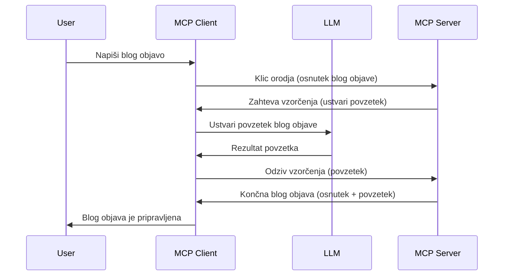

# Vzorcevanje – prenesite funkcije na odjemalca

Včasih potrebujete sodelovanje med MCP odjemalcem in MCP strežnikom, da dosežete skupen cilj. Morda imate primer, kjer strežnik potrebuje pomoč LLM, ki je na odjemalcu. Za ta namen je vzorcevanje prava rešitev.

Raziščimo nekaj primerov uporabe in kako zgraditi rešitev, ki vključuje vzorcevanje.

## Pregled

V tej lekciji se osredotočamo na razlago, kdaj in kje uporabiti vzorcevanje ter kako ga konfigurirati.

## Cilji učenja

V tem poglavju bomo:

- Pojasnili, kaj je vzorcevanje in kdaj ga uporabiti.
- Prikazali, kako konfigurirati vzorcevanje v MCP.
- Podali primere vzorcevanja v praksi.

## Kaj je vzorcevanje in zakaj ga uporabljati?

Vzorcevanje je napredna funkcija, ki deluje na naslednji način:



### Zahteva za vzorcevanje

V redu, zdaj imamo splošen pregled verjetnega scenarija, pogovorimo se o zahtevi za vzorcevanje, ki jo strežnik pošlje nazaj odjemalcu. Tako izgleda takšna zahteva v formatu JSON-RPC:

```json
{
  "jsonrpc": "2.0",
  "id": 1,
  "method": "sampling/createMessage",
  "params": {
    "messages": [
      {
        "role": "user",
        "content": {
          "type": "text",
          "text": "Create a blog post summary of the following blog post: <BLOG POST>"
        }
      }
    ],
    "modelPreferences": {
      "hints": [
        {
          "name": "claude-3-sonnet"
        }
      ],
      "intelligencePriority": 0.8,
      "speedPriority": 0.5
    },
    "systemPrompt": "You are a helpful assistant.",
    "maxTokens": 100
  }
}
```

Nekaj stvari je vrednih poudarka:

- Poziv (prompt), pod content -> text, je naš poziv, ki je navodilo LLM, da povzame vsebino blog zapisa.

- **modelPreferences**. Ta razdelek predstavlja preference oziroma priporočilo, katero konfiguracijo naj LLM uporabi. Uporabnik se lahko odloči, če bo sledil tem priporočilom ali jih spremenil. V tem primeru so priporočila glede modela, hitrosti in prioritete inteligence.
- **systemPrompt**, to je običajen sistemski poziv, ki da vašemu LLM osebnost in vsebuje navodila.
- **maxTokens**, to je lastnost, ki določa priporočeno maksimalno število tokenov za to nalogo.

### Odgovor na vzorcevanje

Ta odgovor pošlje MCP odjemalec nazaj MCP strežniku in je rezultat kliča LLM z odjemalca, nato čakanja na odgovor in konstruiranja te sporočila. Tako izgleda v JSON-RPC:

```json
{
  "jsonrpc": "2.0",
  "id": 1,
  "result": {
    "role": "assistant",
    "content": {
      "type": "text",
      "text": "Here's your abstract <ABSTRACT>"
    },
    "model": "gpt-5",
    "stopReason": "endTurn"
  }
}
```

Opazite, da je odgovor povzetek blog zapisa, tako kot smo zahtevali. Prav tako opazite, da uporabljen `model` ni tisti, ki smo ga zahtevali, ampak "gpt-5" namesto "claude-3-sonnet". To ponazarja, da se lahko uporabnik odloči spremeni svojo izbiro in da je zahteva za vzorcevanje le priporočilo.

V redu, zdaj ko razumemo glavni potek in uporabno nalogo za to – "ustvarjanje blog zapisa + povzetek", poglejmo, kaj moramo storiti, da bo delovalo.

### Vrste sporočil

Vzorcevalska sporočila niso omejena le na besedilo, ampak lahko pošljete tudi slike in zvok. Tako JSON-RPC izgleda drugače:

**Besedilo**

```json
{
  "type": "text",
  "text": "The message content"
}
```

**Vsebina slike**

```json
{
  "type": "image",
  "data": "base64-encoded-image-data",
  "mimeType": "image/jpeg"
}
```

**Vsebina zvoka**

```json
{
  "type": "audio",
  "data": "base64-encoded-audio-data",
  "mimeType": "audio/wav"
}
```

> OPOMBA: za bolj podrobne informacije o vzorcevanju si oglejte [uradno dokumentacijo](https://modelcontextprotocol.io/specification/2025-11-25/client/sampling)

## Kako konfigurirati vzorcevanje na odjemalcu

> Opomba: če gradite samo strežnik, tukaj vam ni treba storiti veliko.

Na odjemalcu morate določiti naslednjo funkcijo tako:

```json
{
  "capabilities": {
    "sampling": {}
  }
}
```

To bo zaznano, ko se bo vaš izbrani odjemalec povezal s strežnikom.

## Primer vzorcevanja v praksi – ustvarjanje blog zapisa

Napišimo server za vzorcevanje skupaj, naredili bomo naslednje:

1. Ustvariti orodje na strežniku.
1. Orodje naj ustvari zahtevo za vzorcevanje.
1. Orodje naj počaka na odgovor na zahtevo za vzorcevanje od odjemalca.
1. Nato naj orodje vrne rezultat.

Poglejmo kodo korak za korakom:

### -1- Ustvarite orodje

**python**

```python
@mcp.tool()
async def create_blog(title: str, content: str, ctx: Context[ServerSession, None]) -> str:
    """Create a blog post and generate a summary"""

```

### -2- Ustvarite zahtevo za vzorcevanje

Razširite orodje z naslednjo kodo:

**python**

```python
post = BlogPost(
        id=len(posts) + 1,
        title=title,
        content=content,
        abstract=""
    )

prompt = f"Create an abstract of the following blog post: title: {title} and draft: {content} "

result = await ctx.session.create_message(
        messages=[
            SamplingMessage(
                role="user",
                content=TextContent(type="text", text=prompt),
            )
        ],
        max_tokens=100,
)

```

### -3- Počakajte na odgovor in ga vrnite

**python**

```python
post.abstract = result.content.text

posts.append(post)

# vrni celoten izdelek
return json.dumps({
    "id": post.title,
    "abstract": post.abstract
})
```

### -4- Celotna koda

**python**

```python
from starlette.applications import Starlette
from starlette.routing import Mount, Host

from mcp.server.fastmcp import Context, FastMCP

from mcp.server.session import ServerSession
from mcp.types import SamplingMessage, TextContent

import json


from uuid import uuid4
from typing import List
from pydantic import BaseModel


mcp = FastMCP("Blog post generator")

# app = FastAPI()

posts = []

class BlogPost(BaseModel):
    id: int
    title: str
    content: str
    abstract: str

posts: List[BlogPost] = []

@mcp.tool()
async def create_blog(title: str, content: str, ctx: Context[ServerSession, None]) -> str:
    """Create a blog post and generate a summary"""

    post = BlogPost(
        id=len(posts) + 1,
        title=title,
        content=content,
        abstract=""
    )

    prompt = f"Create an abstract of the following blog post: title: {title} and draft: {content} "

    result = await ctx.session.create_message(
        messages=[
            SamplingMessage(
                role="user",
                content=TextContent(type="text", text=prompt),
            )
        ],
        max_tokens=100,
    )

    post.abstract = result.content.text

    posts.append(post)

    # vrni celoten blog prispevek
    return json.dumps({
        "id": post.title,
        "abstract": post.abstract
    })

if __name__ == "__main__":
    print("Starting server...")
    # mcp.run()
    mcp.run(transport="streamable-http")

# zaženite aplikacijo z: python server.py
```

### -5- Testiranje v Visual Studio Code

Za testiranje v Visual Studio Code storite naslednje:

1. Zaženite strežnik v terminalu.
1. Dodajte ga v *mcp.json* (in preverite, da je zagnan), nekaj takega:

   ```json
   "servers": {
      "blog-server": {
        "type": "http",
        "url": "http://localhost:8000/mcp"
      }
   }
   ```

1. Vnesite poziv:

   ```text
   create a blog post named "Where Python comes from", the content is "Python is actually named after Monty Python Flying Circus"
   ```

1. Dovolite vzorcevanje. Ob prvem testiranju se bo prikazalo dodatno okno, ki ga boste morali sprejeti, nato boste videli običajno okno za zagon orodja.

1. Preglejte rezultate. Videli boste rezultate lepo prikazane v GitHub Copilot Chatu, lahko pa tudi pregledate surovi JSON odgovor.

**Bonus**. Orodja v Visual Studio Code odlično podpirajo vzorcevanje. Lahko konfigurirate dostop do vzorcevanja na vašem nameščenem strežniku tako:

1. Pojdite v razdelek z razširitvami.
1. Izberite ikono zobnika za vaš nameščeni strežnik v razdelku "MCP SERVERS - INSTALLED".
1. Izberite "Configure Model Access", tukaj lahko izberete, katere modele lahko GitHub Copilot uporablja pri vzorcevanju. Prav tako lahko vidite vse nedavne zahteve za vzorcevanje s klikom na "Show Sampling requests".

## Naloga

V tej nalogi boste zgradili nekoliko drugačno vzorcevanje, in sicer integracijo vzorcevanja, ki omogoča ustvarjanje opisa izdelka. Tu je vaš scenarij:

**Scenarij**: Delavec v back office-u e-trgovine potrebuje pomoč, ker mu vzame preveč časa ustvarjanje opisov izdelkov. Zato boste zgradili rešitev, kjer lahko pokličete orodje "create_product" z argumentoma "title" in "keywords", ki naj ustvari celoten izdelek vključno z "description" poljem, ki naj bo izpolnjeno z LLM odjemalca.

NAMIG: uporabite, kar ste se naučili prej, da sestavite ta strežnik in njegovo orodje z uporabo zahteve za vzorcevanje.

## Rešitev

[Rešitev](./solution/README.md)

## Ključne ugotovitve

Vzorcevanje je zmogljiva funkcija, ki strežniku omogoča, da naloge prenese na odjemalca, kadar potrebuje pomoč LLM.

## Kaj sledi

- [Poglavje 4 – Praktična implementacija](../../04-PracticalImplementation/README.md)

---

<!-- CO-OP TRANSLATOR DISCLAIMER START -->
**Omejitev odgovornosti**:
Ta dokument je bil preveden z uporabo AI prevajalske storitve [Co-op Translator](https://github.com/Azure/co-op-translator). Čeprav si prizadevamo za natančnost, vas prosimo, da upoštevate, da avtomatizirani prevodi lahko vsebujejo napake ali netočnosti. Izvirni dokument v njegovem izvirnem jeziku je treba obravnavati kot avtoritativni vir. Za kritične informacije je priporočljiv strokovni človeški prevod. Ne odgovarjamo za morebitna nesporazume ali napačne interpretacije, ki izhajajo iz uporabe tega prevoda.
<!-- CO-OP TRANSLATOR DISCLAIMER END -->