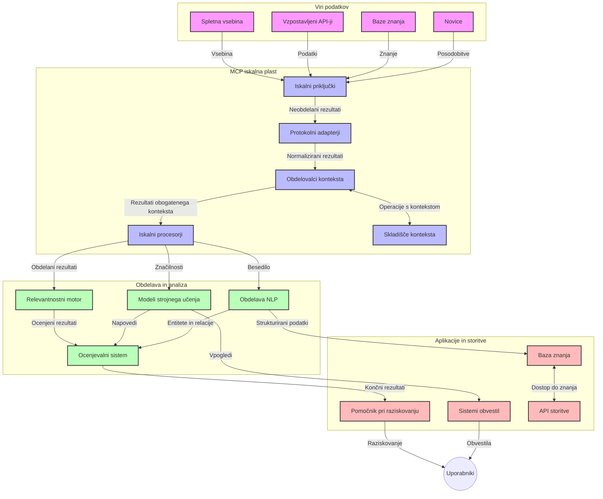
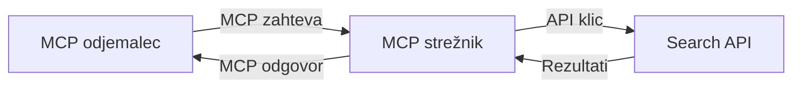
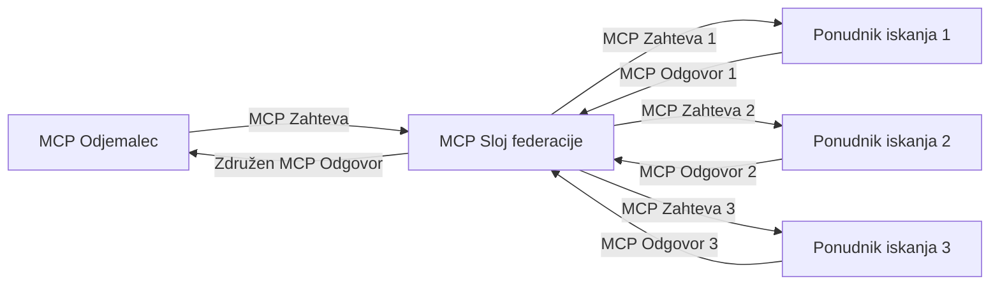
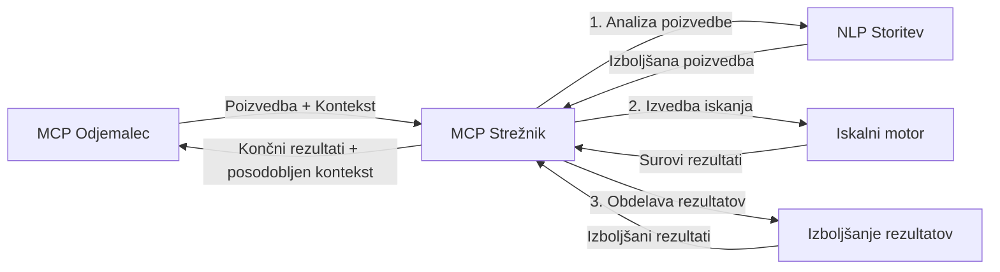

# Protokol konteksta modela za iskanje po spletu v realnem času

## Pregled

Iskanje po spletu v realnem času je postalo bistveno v današnjem okolju, ki ga poganja informacija, kjer aplikacije potrebujejo takojšen dostop do ažurnih informacij po celotnem internetu, da lahko zagotovijo relevantne in pravočasne odgovore. Protokol konteksta modela (MCP) predstavlja pomemben napredek pri optimizaciji teh procesov iskanja v realnem času, izboljšuje učinkovitost iskanja, ohranja kontekstualno celovitost in izboljšuje splošno zmogljivost sistema.

Ta modul raziskuje, kako MCP preoblikuje iskanje po spletu v realnem času s tem, da zagotavlja standardiziran pristop k upravljanju konteksta med AI modeli, iskalniki in aplikacijami.

### Kaj boste spoznali

V tem obsežnem vodiču boste odkrili:

- Kako MCP ustvari neprekinjen most med AI modeli in zmožnostmi iskanja po spletu v realnem času
- Arhitekturne vzorce za implementacijo učinkovitih in razširljivih iskalnih rešitev z MCP
- Tehnike za ohranjanje konteksta iskanja čez več poizvedb in interakcij
- Praktične implementacije kode v Pythonu in JavaScriptu za različne scenarije iskanja
- Metode za uravnoteženje relevantnosti, aktualnosti in zmogljivosti v iskalnih sistemih, ki jih poganja MCP

## Uvod v iskanje po spletu v realnem času

Iskanje po spletu v realnem času je tehnološki pristop, ki omogoča neprekinjeno poizvedovanje, obdelavo in analizo spletnih informacij, ko so objavljene ali posodobljene, ter sistemom omogoča zagotavljanje svežih in relevantnih informacij z minimalnimi zakasnitvami. Za razliko od tradicionalnih iskalnih sistemov, ki delujejo na indeksiranih podatkih, ki so lahko stare ure ali dneve, realnočasovno iskanje uporablja žive podatke z interneta in daje vpoglede ter informacije, ki odražajo trenutno stanje spletne vsebine.

### Glavni koncepti iskanja po spletu v realnem času:

- **Neprekinjena obdelava poizvedb**: Poizvedbe se obdelujejo na vedno posodabljajočih se podatkovnih virih
- **Prednost aktualnosti**: Sistemi so zasnovani tako, da dajejo prednost svežim informacijam
- **Uravnoteženje relevantnosti**: Ohranitev ravnovesja med relevantnostjo in aktualnostjo
- **Razširljiva arhitektura**: Sistemi morajo obvladovati spreminjajoče se obremenitve poizvedb in količine podatkov
- **Kontekstualno razumevanje**: Ohranjanje uporabniškega konteksta skozi več iskalnih iteracij je ključnega pomena za smiselne rezultate
- **Dinamična preoblikava poizvedb**: Prilagajanje poizvedb glede na kontekst in prejšnje rezultate
- **Integracija več virov**: Združevanje rezultatov iz več ponudnikov iskanja in spletnih virov
- **Semantično razumevanje**: Obdelava poizvedb in vsebine na podlagi pomena, ne le ključnih besed
- **Ocena rezultatov v realnem času**: Neprestano prilagajanje vrstnega reda rezultatov, ko so na voljo nove informacije

### Protokol konteksta modela in iskanje po spletu v realnem času

Protokol konteksta modela (MCP) rešuje več ključnih izzivov v okoljih iskanja po spletu v realnem času:

1. **Ohranjanje konteksta iskanja**: MCP standardizira način, kako se kontekst ohranja med razpršenimi komponentami iskanja, s čimer zagotavlja, da imajo AI modeli in procesna vozlišča dostop do relevantne zgodovine poizvedb in uporabniških nastavitev.

2. **Učinkovito upravljanje poizvedb**: Z zagotavljanjem strukturiranih mehanizmov za prenos konteksta MCP zmanjšuje stroške ponavljanja konteksta v vsaki iskalni iteraciji.

3. **Medsebojna združljivost**: MCP ustvarja skupni jezik za deljenje konteksta med različnimi tehnologijami iskanja in AI modeli, kar omogoča bolj prilagodljive in razširljive arhitekture.

4. **Iskanju prilagojen kontekst**: Implementacije MCP lahko dajo prednost najbolj relevantnim elementom konteksta za učinkovito iskanje, obenem optimizirajo zmogljivost in natančnost.

5. **Prilagodljiva obdelava iskanja**: Z ustreznim upravljanjem konteksta prek MCP se lahko iskalni sistemi dinamično prilagajajo procesiranju glede na spreminjajoče se potrebe uporabnikov in informacije.

V sodobnih aplikacijah od zbiranja novic do raziskovalnih pomočnikov omogoča integracija MCP s tehnologijami spletnega iskanja bolj inteligentno, kontekstualno zavedajoče iskanje, ki lahko nudi vse bolj relevantne rezultate, ko se uporabniške interakcije nadaljujejo.

## Cilji učenja

Na koncu te lekcije boste znali:

- Razumeti osnove iskanja po spletu v realnem času in njegove izzive v sodobnih aplikacijah
- Razložiti, kako Protokol konteksta modela (MCP) izboljša zmogljivosti iskanja v realnem času
- Implementirati iskalne rešitve, ki temeljijo na MCP, z uporabo priljubljenih ogrodij in API-jev
- Oblikovati in uvajati razširljive, zmogljive iskalne arhitekture z MCP
- Uporabiti koncepte MCP v različnih primerih uporabe, vključno s semantičnim iskanjem, raziskovalno pomočjo in AI-podprtim brskanjem
- Ovrednotiti prihajajoče trende in prihodnje inovacije v tehnologijah iskanja, ki temeljijo na MCP
- Razviti prostore zavedajoče iskalne sisteme, ki se učijo iz uporabniških interakcij
- Integrirati zmogljivosti spletnega iskanja v AI pomočnike z uporabo standardiziranih protokolov MCP
- Ustvariti iskalne procese v več stopnjah, ki postopoma izboljšujejo rezultate na podlagi konteksta
- Optimizirati zmogljivost iskanja ob ohranjanju celovitega zavedanja o kontekstu

### Definicija in pomembnost

Iskanje po spletu v realnem času vključuje neprekinjeno poizvedovanje, pridobivanje in dostavo spletnih informacij z minimalnim zamikom. Za razliko od tradicionalnih iskalnikov, ki periodično pregledujejo in indeksirajo splet, realnočasovno iskanje stremi k prikazu informacij takoj, ko postanejo na voljo, omogočajoč takojšen dostop do najbolj aktualne vsebine.

Ključne značilnosti iskanja po spletu v realnem času vključujejo:

- **Svežina**: Prioriteta zadnje vsebine in posodobitev
- **Neprekinjena obdelava**: Stalno spremljanje novih informacij
- **Prilagajanje poizvedb**: Izboljševanje iskalnih poizvedb glede na kontekst in povratne informacije
- **Takojšnja dostava**: Zagotavljanje rezultatov iskanja z minimalnimi zamiki
- **Ohranjanje konteksta**: Gradnja na prejšnjih poizvedbah za izboljšano relevantnost

### Izzivi tradicionalnega spletnega iskanja

Tradicionalni pristopi spletnega iskanja se pri uporabi v realnočasovnih scenarijih srečujejo z več omejitvami:

1. **Fragmentacija konteksta**: Težave pri ohranjanju konteksta skozi več poizvedb
2. **Svežina informacij**: Izzivi pri dostopu in prioriteti najbolj aktualnih informacij
3. **Zapletenost integracije**: Problemi z združljivostjo med iskalnimi sistemi in aplikacijami
4. **Težave z zakasnitvami**: Uravnoteženje celovitega iskanja z zahtevami po odzivnem času
5. **Prilagajanje relevantnosti**: Zagotavljanje natančnosti in relevantnosti ob hkratnem upoštevanju aktualnosti

## Razumevanje protokola konteksta modela (MCP) za iskanje

### Kaj je MCP v kontekstu iskanja?

Protokol konteksta modela (MCP) je standardiziran komunikacijski protokol, zasnovan za omogočanje učinkovite interakcije med AI modeli in aplikacijami. V kontekstu iskanja po spletu v realnem času MCP zagotavlja okvir za:

- Ohranjanje konteksta iskanja skozi zaporedja poizvedb
- Standardizacijo formatov iskalnih poizvedb in rezultatov
- Optimizacijo prenosa iskalnih parametrov in rezultatov
- Izboljšanje komunikacije med modeli in iskalnimi sistemi

### Glavne sestavine in arhitektura

Arhitektura MCP za iskanje po spletu v realnem času sestavlja več ključnih komponent:

1. **Upravitelji konteksta poizvedb**: Upravljajo in ohranjajo kontekst iskanja skozi več poizvedb
2. **Procesorji iskanja**: Obdelujejo dohodne iskalne zahteve z uporabo kontekstualno zavednih tehnik
3. **Protocol adapterji**: Pretvarjajo med različnimi iskalnimi API-ji ob ohranjanju konteksta
4. **Shramba konteksta**: Učinkovito shranjujejo in pridobivajo zgodovino iskanja in preference
5. **Povezovalci iskanja**: Povezujejo se z različnimi iskalnimi sistemi in spletnimi API-ji



### Kako MCP izboljšuje realnočasovno iskanje po spletu

MCP rešuje tradicionalne izzive spletnega iskanja z:

- **Kontekstualno kontinuiteto**: Ohranjanje povezav med poizvedbami skozi celotno iskalno sejo
- **Optimiziranim prenosom**: Zmanjševanjem podvajanja iskalnih parametrov z inteligentnim upravljanjem konteksta
- **Standardiziranimi vmesniki**: Zagotavljanjem doslednih API-jev za iskalne komponente
- **Zmanjšano zakasnitvijo**: Minimiziranjem procesnih obremenitev z učinkovitimi metodami obdelave konteksta
- **Izboljšano relevantnostjo**: Izboljševanjem relevantnosti iskanja z ohranjanjem uporabnikovih namenov skozi več poizvedb

## Integracija in implementacija

Sistemi za iskanje po spletu v realnem času zahtevajo skrbno arhitekturno zasnovo in izvedbo za ohranjanje tako zmogljivosti kot kontekstualne celovitosti. Protokol konteksta modela ponuja standardiziran pristop k integraciji AI modelov in iskalnih tehnologij, ki omogoča bolj sofisticirane, kontekstualno zavedajoče iskalne procese.

### Pregled integracije MCP v iskalne arhitekture

Implementacija MCP v okolja iskanja po spletu v realnem času vključuje več ključnih premislekov:

1. **Seralizacija konteksta iskanja**: MCP zagotavlja učinkovite mehanizme za kodiranje kontekstualnih informacij znotraj iskalnih zahtev, kar zagotavlja, da bistveni kontekst sledi poizvedbi skozi celotno procesno cevovod. To vključuje standardizirane formate seralizacije, optimizirane za metapodatke, povezane z iskanjem.

2. **Stanja zavestna obdelava iskanja**: MCP omogoča pametnejšo obdelavo z ohranjanjem dosledne reprezentacije konteksta skozi iskalne iteracije. To je še posebej dragoceno v večstopenjskih iskalnih procesih, kjer izboljšanje konteksta izboljša rezultate.

3. **Razširitev in izpopolnjevanje poizvedb**: Implementacije MCP v iskalnih sistemih lahko olajšajo sofisticirano razširjanje in izpopolnjevanje poizvedb na podlagi nakopičenega konteksta, kar omogoča vse bolj relevantne rezultate skozi iskalno sejo.

4. **Predpomnjenje in prioritetno ravnanje z rezultati**: Standardizacija upravljanja konteksta z MCP pomaga pri upravljanju predpomnjenja in prioritet, kar omogoča komponentam prilagajanje glede na spreminjajoč se kontekst iskanja.

5. **Združevanje in federacija iskanja**: MCP omogoča bolj sofisticirano federacijo iskanja preko več sistemov na zadnjem delu z zagotavljanjem strukturiranih predstavitev konteksta iskanja, kar omogoča bolj smiselno združevanje rezultatov iz raznolikih virov.

Implementacija MCP v različnih iskalnih tehnologijah ustvarja enoten pristop k upravljanju konteksta, zmanjšuje potrebo po namenski integracijski kodi in hkrati izboljšuje zmožnost sistema za ohranjanje smiselnega konteksta, ko se iskalne poizvedbe razvijajo.

### MCP v različnih implementacijah spletnega iskanja

Ti primeri sledijo trenutni specifikaciji MCP, ki se osredotoča na protokol na osnovi JSON-RPC z različnimi transportnimi mehanizmi. Koda prikazuje, kako lahko implementirate lastne integracije iskanja, hkrati pa ohranite popolno združljivost s protokolom MCP.


<details>
<summary>Implementacija v Pythonu z generičnim iskalnim API</summary>

```python
import asyncio
import json
import aiohttp
from typing import Dict, Any, Optional, List
from contextlib import asynccontextmanager
from collections.abc import AsyncIterator

# Uvoz standardnih MCP knjižnic
from mcp.client.session import ClientSession
from mcp.client.streamable_http import streamablehttp_client
from mcp.types import TextContent, CreateMessageRequestParams, CreateMessageResult
from mcp.server.fastmcp import FastMCP

# Ustvari FastMCP strežnik za spletno iskanje
search_server = FastMCP("WebSearch")

# Razred za upravljanje operacij spletnega iskanja
class WebSearchHandler:
    def __init__(self, api_endpoint: str, api_key: str):
        self.api_endpoint = api_endpoint
        self.api_key = api_key
        self.session = None
        
    async def initialize(self):
        """Initialize the HTTP session"""
        self.session = aiohttp.ClientSession(
            headers={"Authorization": f"Bearer {self.api_key}"}
        )
    
    async def close(self):
        """Close the HTTP session"""
        if self.session:
            await self.session.close()
            
    async def perform_search(self, query: str, max_results: int = 5, 
                           include_domains: List[str] = None, 
                           exclude_domains: List[str] = None,
                           time_period: str = "any") -> Dict[str, Any]:
        """Perform web search using the search API"""
        # Sestavi parametre iskanja
        search_params = {
            "q": query,
            "limit": max_results,
            "time": time_period
        }
        
        if include_domains:
            search_params["site"] = ",".join(include_domains)
            
        if exclude_domains:
            search_params["exclude_site"] = ",".join(exclude_domains)
        
        # Izvedi zahtevo za iskanje
        try:
            async with self.session.get(
                self.api_endpoint,
                params=search_params
            ) as response:
                if response.status != 200:
                    error_text = await response.text()
                    raise Exception(f"Search API error: {response.status} - {error_text}")
                
                search_data = await response.json()
                
                # Pretvori odziv, specifičen za API, v standardno obliko
                results = []
                for item in search_data.get("results", []):
                    results.append({
                        "title": item.get("title", ""),
                        "url": item.get("url", ""),
                        "snippet": item.get("snippet", ""),
                        "date": item.get("published_date", ""),
                        "source": item.get("source", "")
                    })
                
                return {
                    "query": query,
                    "totalResults": len(results),
                    "results": results
                }
        except Exception as e:
            print(f"Search API request error: {e}")
            raise

# Inicializiraj upravljalnik iskanja
search_handler = WebSearchHandler(
    api_endpoint="https://api.search-service.example/search",
    api_key="your-api-key-here"
)

# Nastavi življenjsko dobo za upravljanje upravljalnika iskanja
@asyncio.asynccontextmanager
async def app_lifespan(server: FastMCP):
    """Manage application lifecycle"""
    await search_handler.initialize()
    try:
        yield {"search_handler": search_handler}
    finally:
        await search_handler.close()

# Nastavi življenjsko dobo strežnika
search_server = FastMCP("WebSearch", lifespan=app_lifespan)

# Registriraj orodje za spletno iskanje
@search_server.tool()
async def web_search(query: str, max_results: int = 5, 
                   include_domains: List[str] = None,
                   exclude_domains: List[str] = None,
                   time_period: str = "any") -> Dict[str, Any]:
    """
    Search the web for information
    
    Args:
        query: The search query
        max_results: Maximum number of results to return (default: 5)
        include_domains: List of domains to include in search results
        exclude_domains: List of domains to exclude from search results
        time_period: Time period for results ("day", "week", "month", "any")
        
    Returns:
        Dictionary containing search results
    """
    ctx = search_server.get_context()
    search_handler = ctx.request_context.lifespan_context["search_handler"]
    
    results = await search_handler.perform_search(
        query=query,
        max_results=max_results,
        include_domains=include_domains,
        exclude_domains=exclude_domains,
        time_period=time_period
    )
    
    return results

# Primer uporabe odjemalca
async def client_example():
    # Poveži se s strežnikom za iskanje s pomočjo Streamable HTTP prenosa
    async with streamablehttp_client("http://localhost:8000/mcp") as (read, write, _):
        async with ClientSession(read, write) as session:
            # Inicializiraj povezavo
            await session.initialize()
            
            # Pokliči orodje web_search
            search_results = await session.call_tool(
                "web_search", 
                {
                    "query": "latest developments in AI and Model Context Protocol",
                    "max_results": 5,
                    "time_period": "day",
                    "include_domains": ["github.com", "microsoft.com"]
                }
            )
            
            print(f"Search results: {search_results}")

# Primer izvajanja strežnika
if __name__ == "__main__":
    # Zaženi strežnik s Streamable HTTP prenosom
    search_server.run(transport="streamable-http")
```
</details> 

<details>
<summary>Implementacija v JavaScriptu z iskanjem v brskalniku</summary>


```javascript
// Implementacija MCP strežnika za spletno iskanje
import { McpServer, ResourceTemplate } from '@modelcontextprotocol/sdk/server/mcp.js';
import { StreamableHTTPServerTransport } from '@modelcontextprotocol/sdk/server/streamableHttp.js';
import { z } from 'zod';

// Ustvari MCP strežnik za spletno iskanje
const searchServer = new McpServer({
    name: "BrowserSearch",
    description: "A server that provides web search capabilities"
});

// Razred storitve iskanja
class SearchService {
    constructor(searchApiUrl, apiKey) {
        this.searchApiUrl = searchApiUrl;
        this.apiKey = apiKey;
    }

    async performSearch(parameters) {
        const {
            query = '',
            maxResults = 5,
            includeDomains = [],
            excludeDomains = [],
            timePeriod = 'any'
        } = parameters;
        
        // Sestavi URL iskanja s parametri
        const url = new URL(this.searchApiUrl);
        url.searchParams.append('q', query);
        url.searchParams.append('limit', maxResults);
        url.searchParams.append('time', timePeriod);
        
        if (includeDomains.length > 0) {
            url.searchParams.append('site', includeDomains.join(','));
        }
        
        if (excludeDomains.length > 0) {
            url.searchParams.append('exclude_site', excludeDomains.join(','));
        }
        
        try {
            const response = await fetch(url.toString(), {
                method: 'GET',
                headers: {
                    'Authorization': `Bearer ${this.apiKey}`,
                    'Content-Type': 'application/json'
                }
            });
            
            if (!response.ok) {
                const errorText = await response.text();
                throw new Error(`Search API error: ${response.status} - ${errorText}`);
            }
            
            const searchData = await response.json();
            
            // Pretvori odziv specifičen za API v standardno obliko
            const results = searchData.results?.map(item => ({
                title: item.title || '',
                url: item.url || '',
                snippet: item.snippet || '',
                date: item.published_date || '',
                source: item.source || ''
            })) || [];
            
            return {
                query,
                totalResults: results.length,
                results
            };
        } catch (error) {
            console.error('Search API request error:', error);
            throw error;
        }
    }
}

// Inicializiraj storitev iskanja
const searchService = new SearchService(
    'https://api.search-service.example/search',
    'your-api-key-here'
);

// Nastavi ponudnika konteksta za strežnik
searchServer.setContextProvider(() => {
    return {
        searchService
    };
});

// Registriraj orodje za spletno iskanje
searchServer.tool({
    name: 'web_search',
    description: 'Search the web for information',
    parameters: {
        type: 'object',
        properties: {
            query: {
                type: 'string',
                description: 'The search query'
            },
            maxResults: {
                type: 'integer',
                description: 'Maximum number of results to return',
                default: 5
            },
            includeDomains: {
                type: 'array',
                items: { type: 'string' },
                description: 'List of domains to include in search results'
            },
            excludeDomains: {
                type: 'array',
                items: { type: 'string' },
                description: 'List of domains to exclude from search results'
            },
            timePeriod: {
                type: 'string',
                description: 'Time period for results',
                enum: ['day', 'week', 'month', 'any'],
                default: 'any'
            }
        },
        required: ['query']
    },
    handler: async (params, context) => {
        const { searchService } = context;
        return await searchService.performSearch(params);
    }
});

// Primer kode odjemalca za povezavo s strežnikom za iskanje
import { Client } from '@modelcontextprotocol/sdk/client/index.js';
import { StreamableHTTPClientTransport } from '@modelcontextprotocol/sdk/client/streamableHttp.js';

async function connectToSearchServer() {
    // Poveži se s strežnikom za iskanje
    const transport = new StreamableHTTPClientTransport(
        new URL('http://localhost:8000/mcp')
    );
    
    const client = new Client({
        name: 'search-client',
        version: '1.0.0'
    });
    
    await client.connect(transport);
    
    // Izvedi orodje za iskanje
    const searchResults = await client.callTool({
        name: 'web_search',
        arguments: {
            query: 'Model Context Protocol implementation examples',
            maxResults: 10,
            timePeriod: 'week',
            includeDomains: ['github.com', 'docs.microsoft.com']
        }
    });
    
    console.log('Search results:', searchResults);
    
    // Čiščenje
    await client.disconnect();
}

// Zaženi strežnik
const transport = new StreamableHTTPServerTransport();
await searchServer.connect(transport);
console.log('Search server running at http://localhost:8000/mcp');

// V ločenem procesu ali po zagonu strežnika
// connectToSearchServer().catch(console.error);
```
</details> 


## Opozorilo glede primerov kode

> **Pomembna opomba**: Spodnji primeri kode prikazujejo integracijo Protokola konteksta modela (MCP) s funkcionalnostjo spletnega iskanja. Čeprav sledijo vzorcem in strukturam uradnih MCP SDK-jev, so poenostavljeni za izobraževalne namene.
> 
> Ti primeri prikazujejo:
> 
> 1. **Implementacija v Pythonu**: Implementacijo strežnika FastMCP, ki nudi orodje za spletno iskanje in se povezuje z zunanjim iskalnim API-jem. Ta primer prikazuje pravilno upravljanje življenjske dobe, obdelavo konteksta in implementacijo orodja, sledijoč vzorcem uradnega [MCP Python SDK](https://github.com/modelcontextprotocol/python-sdk). Strežnik uporablja priporočeni HTTP transport Streamable, ki je nadomestil starejši SSE transport za produkcijske uvedbe.
> 
> 2. **Implementacija v JavaScriptu**: Implementacija v TypeScript/JavaScript z uporabo vzorca FastMCP iz [uradnega MCP TypeScript SDK](https://github.com/modelcontextprotocol/typescript-sdk) za ustvarjanje iskalnega strežnika z ustrezno opredelitvijo orodij in povezav s stranko. Sledi najnovejšim priporočilom za upravljanje sej in ohranjanje konteksta.
> 
> Ti primeri bi za produkcijsko uporabo zahtevali dodatno obravnavo napak, avtentikacijo in specifično kodo za integracijo API-jev. Prikazani API-končni točki za iskanje (`https://api.search-service.example/search`) sta rezervirani in bi ju morali zamenjati z dejanskimi končnimi točkami iskalnih storitev.
> 
> Za popolne podrobnosti implementacije in najnovejše pristope glejte [uradno specifikacijo MCP](https://spec.modelcontextprotocol.io/) in dokumentacijo SDK.

## Osnovni koncepti

### Okvir Protokola konteksta modela (MCP)

V svoji osnovi protokol konteksta modela zagotavlja standardiziran način za izmenjavo konteksta med AI modeli, aplikacijami in storitvami. Pri iskanju po spletu v realnem času je ta okvir bistven za ustvarjanje koherentnih iskalnih izkušenj v več korakih. Ključne komponente vključujejo:

1. **Arhitektura klient-strežnik**: MCP postavlja jasno ločnico med iskalnimi klienti (zahtevki) in iskalnimi strežniki (ponudniki), kar omogoča prilagodljive načine uvajanja.

2. **Komunikacija JSON-RPC**: Protokol uporablja JSON-RPC za izmenjavo sporočil, zaradi česar je združljiv z spletnimi tehnologijami in enostaven za implementacijo na različnih platformah.

3. **Upravljanje konteksta**: MCP opredeljuje strukturirane metode za vzdrževanje, posodabljanje in uporabo konteksta iskanja skozi več interakcij.

4. **Opredelitve orodij**: Iskalne zmogljivosti so izpostavljene kot standardizirana orodja z dobro opredeljenimi parametri in vrednostmi vračanja.

5. **Podpora pretočnosti**: Protokol podpira pretočno pošiljanje rezultatov, kar je bistveno za iskanje v realnem času, kjer rezultati lahko prihajajo postopno.

### Vzorec integracije spletnega iskanja

Pri integraciji MCP s spletnim iskanjem se pojavijo naslednji vzorci:

#### 1. Neposredna integracija ponudnika iskanja



V tem vzorcu MCP strežnik neposredno komunicira z enim ali več iskalnimi API-ji, prevaja MCP zahteve v API-specifične klice in oblikuje rezultate kot MCP odzive.

#### 2. Federirano iskanje z ohranjanjem konteksta



Ta vzorec razporedi iskalne poizvedbe med več MCP-kompatibilnih ponudnikov iskanja, pri čemer se vsak lahko posebej specializira za različne vrste vsebin ali iskalnih zmogljivosti, z ohranitvijo enotnega konteksta.

#### 3. Veriga iskanja z izboljšanim kontekstom



V tem vzorcu je iskalni proces razdeljen na več stopenj, pri čemer se kontekst obogati na vsakem koraku, kar privede do postopoma bolj relevantnih rezultatov.

### Komponente konteksta iskanja

V spletnem iskanju, temelječem na MCP, kontekst običajno vključuje:

- **Zgodovina poizvedb**: Prejšnje iskalne poizvedbe v seji
- **Uporabniške preference**: Jezik, regija, nastavitve varnega iskanja
- **Zgodovina interakcij**: Katere rezultate je uporabnik izbral, koliko časa je preživel ob rezultatih
- **Parametri iskanja**: Filtri, vrstni redi in drugi iskalni modifikatorji
- **Strokovno znanje**: Specifičen kontekst glede na temo, relevanten za iskanje
- **Časovni kontekst**: Dejavniki relevantnosti glede na čas
- **Preference virov**: Zanesljivi ali prednostni informacijski viri

## Primeri uporabe in aplikacije

### Raziskovanje in zbiranje informacij

MCP izboljšuje raziskovalne delovne tokove z:

- Ohranjanjem raziskovalnega konteksta skozi iskalne seje
- Omogočanjem sofisticiranih in kontekstualno relevantnih poizvedb
- Podporo federiranemu iskanju iz več virov
- Olajšanjem izvlečka znanja iz iskalnih rezultatov

### Spremljanje novic in trendov v realnem času

Iskanje, ki ga poganja MCP, nudi prednosti za spremljanje novic:

- Odkritje novic praktično v realnem času
- Kontekstualno filtriranje relevantnih informacij
- Sledenje tem in entitet več virov
- Personalizirana opozorila novic na podlagi uporabniškega konteksta

### AI-podprto brskanje in raziskovanje

MCP odpira nove možnosti za AI-podprto brskanje:

- Kontekstualni predlogi iskanja na podlagi trenutnih aktivnosti brskalnika
- Brezšivna integracija spletnega iskanja z asistenti na osnovi velikih jezikovnih modelov (LLM)
- Večkorakna izpopolnitev iskanja z ohranjanjem konteksta
- Izboljšano preverjanje dejstev in verifikacija informacij

## Prihodnji trendi in inovacije

### Evolucija MCP v spletnem iskanju

Z napredkom pričakujemo, da se bo MCP razvijal za reševanje:
- **Multimodalno iskanje**: Integracija iskanja v besedilu, slikah, zvoku in videu ob ohranjeni kontekstualnosti  
- **Decentralizirano iskanje**: Podpora distribuiranim in federiranim iskalnim ekosistemom  
- **Zasebnost iskanja**: Mehanizmi za iskanje s spoštovanjem zasebnosti, občutljivi na kontekst  
- **Razumevanje poizvedb**: Globoka semantična analiza naravnih jezikovnih iskalnih poizvedb  

### Potencialni tehnološki napredki

Nastajajoče tehnologije, ki bodo oblikovale prihodnost MCP iskanja:

1. **Nevronske iskalne arhitekture**: Iskalni sistemi na osnovi vdelav, optimizirani za MCP  
2. **Personaliziran iskalni kontekst**: Učenje posameznikovih iskalnih vzorcev skozi čas  
3. **Integracija znanstvenih grafov**: Kontekstualno iskanje, izboljšano z znanstvenimi grafi specifičnih domen  
4. **Križno-modalni kontekst**: Ohranjanje konteksta preko različnih modalnosti iskanja  

## Praktične vaje

### Vaja 1: Postavitev osnovne MCP iskalne verige

V tej vaji se boste naučili:  
- Konfigurirati osnovno MCP iskalno okolje  
- Uvesti ročnike konteksta za spletno iskanje  
- Preizkusiti in potrditi ohranjanje konteksta skozi več iskalnih iteracij  

### Vaja 2: Izgradnja raziskovalnega pomočnika z MCP iskanjem

Ustvarite popolno aplikacijo, ki:  
- Obdeluje raziskovalna vprašanja v naravnem jeziku  
- Izvaja kontekstualna spletna iskanja  
- Sintetizira informacije iz več virov  
- Predstavlja organizirane raziskovalne rezultate  

### Vaja 3: Uvajanje federacije iskanja iz več virov z MCP

Napredna vaja, ki zajema:  
- Kontekstualno usmerjanje poizvedb na več iskalnikov  
- Razvrščanje in agregacijo rezultatov  
- Kontekstualno odstranjevanje podvojenih rezultatov iskanja  
- Obvladovanje metapodatkov specifičnih za vire  

## Dodatni viri

- [Model Context Protocol Specification](https://spec.modelcontextprotocol.io/) - Uradna specifikacija MCP in podrobna dokumentacija protokola  
- [Model Context Protocol Documentation](https://modelcontextprotocol.io/) - Podrobna navodila in vodiči za implementacijo  
- [MCP Python SDK](https://github.com/modelcontextprotocol/python-sdk) - Uradna Python implementacija MCP protokola  
- [MCP TypeScript SDK](https://github.com/modelcontextprotocol/typescript-sdk) - Uradna TypeScript implementacija MCP protokola  
- [MCP Reference Servers](https://github.com/modelcontextprotocol/servers) - Referenčne implementacije MCP strežnikov  
- [Bing Web Search API Documentation](https://learn.microsoft.com/en-us/bing/search-apis/bing-web-search/overview) - API za spletno iskanje Microsofta  
- [Google Custom Search JSON API](https://developers.google.com/custom-search/v1/overview) - Programabilni iskalnik Google  
- [SerpAPI Documentation](https://serpapi.com/search-api) - API strani rezultatov iskalnikov  
- [Meilisearch Documentation](https://www.meilisearch.com/docs) - Odprtokodni iskalnik  
- [Elasticsearch Documentation](https://www.elastic.co/guide/index.html) - Distribuiran iskalno-analitični mehanizem  
- [LangChain Documentation](https://python.langchain.com/docs/get_started/introduction) - Izgradnja aplikacij z LLM-ji  

## Cilji učenja

Z dokončanjem tega modula boste sposobni:  

- Razumeti temelje iskanja v realnem času na spletu in izzive tega področja  
- Pojasniti, kako Model Context Protocol (MCP) izboljšuje zmožnosti iskanja v realnem času na spletu  
- Izvajati iskalne rešitve na osnovi MCP z uporabo priljubljenih ogrodij in API-jev  
- Načrtovati in uvajati skalabilne, zmogljive iskalne arhitekture z MCP  
- Uporabljati koncepte MCP v različnih primerih uporabe, vključno s semantičnim iskanjem, raziskovalno podporo in AI-podprtim brskanjem  
- Ocenjevati nove trende in prihodnje inovacije v MCP-podprtih iskalnih tehnologijah  

### Razmisleki o zaupanju in varnosti

Pri uvajanju spletnih iskalnih rešitev na osnovi MCP upoštevajte naslednja pomembna načela iz MCP specifikacije:  

1. **Privolitev in nadzor uporabnikov**: Uporabniki morajo izrecno privoliti in razumeti vse dostope do podatkov in operacije. To je posebej pomembno za izvedbe spletnega iskanja, ki lahko dostopajo do zunanjih virov podatkov.  

2. **Zasebnost podatkov**: Zagotovite ustrezno ravnanje z iskalnimi poizvedbami in rezultati, še posebej, če lahko vsebujejo občutljive informacije. Uvedite ustrezne nadzore dostopa za zaščito uporabniških podatkov.  

3. **Varnost orodij**: Zagotovite ustrezno avtentikacijo in validacijo iskalnih orodij, saj predstavljajo potencialna varnostna tveganja zaradi izvajanja poljubne kode. Opise vedenja orodij je treba obravnavati kot nezaupljive, razen če so pridobljeni z zaupanja vrednega strežnika.  

4. **Jasna dokumentacija**: Priskrbite jasno dokumentacijo o zmožnostih, omejitvah in varnostnih premislekih vaše MCP-podprte implementacije iskanja, v skladu z navodili implementacije v MCP specifikaciji.  

5. **Zanesljivi poteki privolitve**: Zgradite zanesljive poteke privolitve in avtorizacije, ki jasno pojasnijo delovanje vsakega orodja pred njegovo uporabo, posebej za orodja, ki delujejo z zunanjimi spletnimi viri.  

Za podrobnosti o varnostnih in zaupanja vrednih praksah MCP glejte [uradno dokumentacijo](https://modelcontextprotocol.io/specification/2025-11-25/basic/security_best_practices).  

## Kaj sledi  

- [5.12 Avtentikacija Entra ID za Model Context Protocol strežnike](../mcp-security-entra/README.md)

---

<!-- CO-OP TRANSLATOR DISCLAIMER START -->
**Omejitev odgovornosti**:
Ta dokument je bil preveden z uporabo AI prevajalske storitve [Co-op Translator](https://github.com/Azure/co-op-translator). Čeprav si prizadevamo za natančnost, vas prosimo, da upoštevate, da avtomatizirani prevodi lahko vsebujejo napake ali netočnosti. Izvirni dokument v njegovem izvirnem jeziku je treba obravnavati kot avtoritativni vir. Za kritične informacije je priporočljiv strokovni človeški prevod. Ne odgovarjamo za morebitna nesporazume ali napačne interpretacije, ki izhajajo iz uporabe tega prevoda.
<!-- CO-OP TRANSLATOR DISCLAIMER END -->