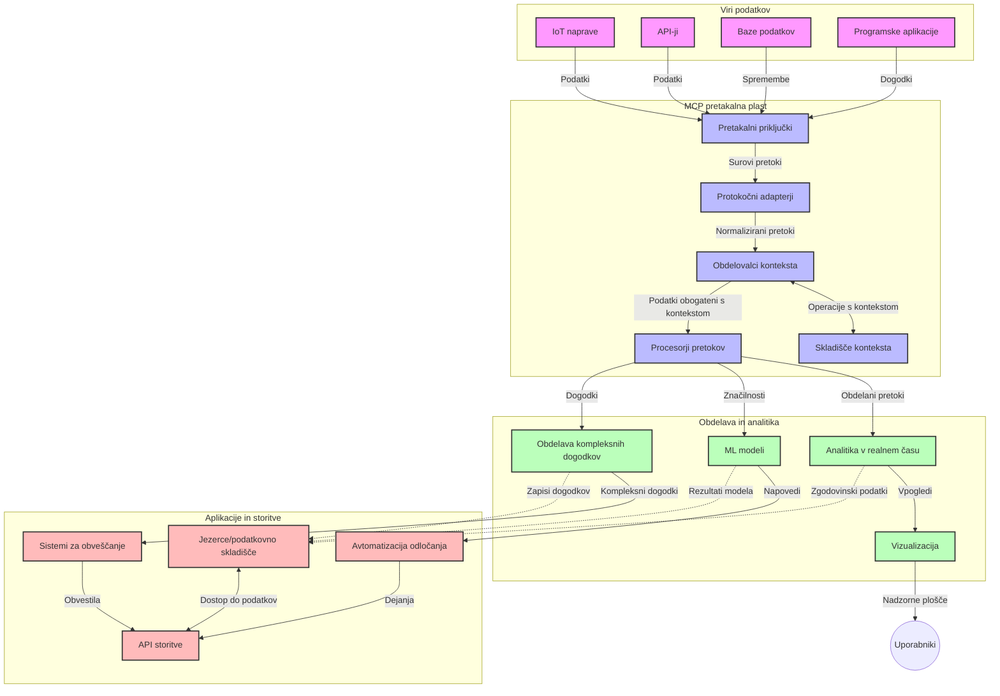

# Protokol konteksta modela za pretočne podatke v realnem času

## Pregled

Pretočni podatki v realnem času so postali bistveni v današnjem svetu, ki temelji na podatkih, kjer podjetja in aplikacije potrebujejo takojšen dostop do informacij za pravočasno odločanje. Protokol konteksta modela (MCP) predstavlja pomemben napredek pri optimizaciji teh procesov pretočnih podatkov v realnem času, izboljšuje učinkovitost obdelave podatkov, ohranja kontekstno celovitost in izboljšuje splošno zmogljivost sistema.

Ta modul raziskuje, kako MCP preoblikuje pretočne podatke v realnem času z zagotavljanjem standardiziranega pristopa k upravljanju konteksta med AI modeli, pretočnimi platformami in aplikacijami.

## Uvod v pretočne podatke v realnem času

Pretočni podatki v realnem času so tehnološki paradigmi, ki omogočajo neprekinjeno prenašanje, obdelavo in analizo podatkov med njihovim generiranjem, kar sistemom omogoča takojšnje odzivanje na nove informacije. V nasprotju s tradicionalnim paketnim procesiranjem, ki deluje nad statičnimi množicami podatkov, pretočni procesi obdelujejo podatke med premikanjem, kar zagotavlja vpoglede in ukrepe z minimalno zakasnitvijo.

### Osnovni koncepti pretočnih podatkov v realnem času:

- **Neprekinjen podatkovni tok**: Podatki se obdelujejo kot neprekinjen, neskončen tok dogodkov ali zapisov.
- **Obdelava z nizko zakasnitvijo**: Sistemi so zasnovani, da zmanjšajo čas med generiranjem podatkov in njihovo obdelavo.
- **Razširljivost**: Arhitekture pretočnega prenosa morajo obvladovati spremenljive količine in hitrost podatkov.
- **Odpornost na napake**: Sistemi morajo biti odporni na okvare, da zagotovijo neprekinjen tok podatkov.
- **Stanjno obdelovanje**: Ohranjanje konteksta med dogodki je ključno za smiselno analizo.

### Protokol konteksta modela in pretočni prenos v realnem času

Protokol konteksta modela (MCP) rešuje več ključnih izzivov v okoljih pretočnega prenosa v realnem času:

1. **Kontekstualna kontinuiteta**: MCP standardizira, kako se kontekst ohranja med distribuiranimi pretočnimi komponentami, zagotavljajoč, da imajo AI modeli in procesne enote dostop do ustreznega zgodovinskega in okoljskega konteksta.

2. **Učinkovito upravljanje stanj**: Z zagotavljanjem strukturiranih mehanizmov za prenos konteksta, MCP zmanjšuje režijske stroške upravljanja stanj v pretočnih cevovodih.

3. **Medsebojna združljivost**: MCP ustvarja skupni jezik za deljenje konteksta med različnimi pretočnimi tehnologijami in AI modeli, kar omogoča bolj prilagodljive in razširljive arhitekture.

4. **Kontekst, optimiziran za pretočni prenos**: Implementacije MCP lahko prioritetno določijo, kateri elementi konteksta so najpomembnejši za odločanje v realnem času, optimizirajo pa zmogljivost in natančnost.

5. **Prilagodljivo obdelovanje**: Z ustreznim upravljanjem konteksta prek MCP lahko pretočni sistemi dinamično prilagajajo obdelavo glede na spreminjajoče se pogoje in vzorce v podatkih.

V sodobnih aplikacijah, od omrežij IoT senzorjev do finančnih trgovalnih platform, integracija MCP s pretočnimi tehnologijami omogoča bolj inteligentno, kontekstno zavedajočo se obdelavo, ki se lahko ustrezno odzove na kompleksne, spreminjajoče se situacije v realnem času.

## Cilji učenja

Do konca te lekcije boste lahko:

- Razumeli temelje pretočnih podatkov v realnem času in njihove izzive
- Pojasnili, kako protokol konteksta modela (MCP) izboljšuje pretočni prenos v realnem času
- Implementirali rešitve pretočnega prenosa na osnovi MCP s priljubljenimi ogrodji, kot sta Kafka in Pulsar
- Oblikovali in uvedli odpornim na napake, visoko zmogljive pretočne arhitekture z MCP
- Uporabljali koncepte MCP v uporabi za IoT, finančno trgovanje in analitiko, ki jo poganja AI
- Ocenili nove trende in prihodnje inovacije v tehnologijah pretočnega prenosa MCP


### Določitev in pomen

Pretočni podatki v realnem času vključujejo neprekinjeno generiranje, obdelavo in dostavo podatkov z minimalno zakasnitvijo. V nasprotju s paketnim procesiranjem, kjer se podatki zbirajo in obdelujejo v skupinah, se pretočni podatki obdelujejo postopoma, ko prispejo, kar omogoča takojšnje vpoglede in ukrepe.

Ključne značilnosti pretočnih podatkov v realnem času vključujejo:

- **Nizka zakasnitev**: Obdelava in analiza podatkov v milisekundah do sekundah
- **Neprekinjen tok**: Neprekinjeni tokovi podatkov iz različnih virov
- **Takojšnja obdelava**: Analiza podatkov takoj ob njihovem prihodu namesto v paketih
- **Arhitektura, ki temelji na dogodkih**: Odzivanje na dogodke takoj, ko se zgodijo

### Izzivi pri tradicionalnem pretočnem prenosu podatkov

Tradicionalni pristopi k pretočnemu prenosu podatkov imajo več omejitev:

1. **Izguba konteksta**: Težave pri ohranjanju konteksta med distribuiranimi sistemi
2. **Težave z razširljivostjo**: Izazivi pri prilagajanju za upravljanje velike količine in hitrosti podatkov
3. **Kompleksnost integracije**: Težave z združljivostjo med različnimi sistemi
4. **Upravljanje zakasnitev**: Uravnoteženje prepustnosti z časom obdelave
5. **Konsistentnost podatkov**: Zagotavljanje natančnosti in popolnosti podatkov po celotnem toku

## Razumevanje protokola konteksta modela (MCP)

### Kaj je MCP?

Protokol konteksta modela (MCP) je standardiziran komunikacijski protokol, zasnovan za učinkovito interakcijo med AI modeli in aplikacijami. V kontekstu pretočnih podatkov v realnem času MCP nudi okvir za:

- Ohranjanje konteksta po celotni podatkovni cevi
- Standardizacijo formatov izmenjave podatkov
- Optimizacijo prenosa velikih nizov podatkov
- Izboljšanje komunikacije med modeli in med modelom in aplikacijo

### Osnovne sestavine in arhitektura

Arhitektura MCP za pretočni prenos v realnem času sestoji iz več ključnih komponent:

1. **Upravitelji konteksta**: Upravljajo in vzdržujejo kontekstualne informacije po celotnem pretočnem cevovodu
2. **Procesorji toka**: Obdelujejo dohodne pretočne podatke z uporabo kontekstno zavedajočih tehnik
3. **Protokolni vmesniki**: Pretvarjajo med različnimi pretočnimi protokoli ob ohranjanju konteksta
4. **Shramba konteksta**: Učinkovito shranjuje in pridobiva kontekstualne informacije
5. **Povezovalniki pretočnega prenosa**: Povezujejo se z različnimi pretočnimi platformami (Kafka, Pulsar, Kinesis itd.)



### Kako MCP izboljšuje obdelavo podatkov v realnem času

MCP rešuje tradicionalne izzive pretočnega prenosa z:

- **Kontekstualno celovitostjo**: Ohranjanje odnosov med podatkovnimi točkami po celem cevovodu
- **Optimiziranim prenosom**: Zmanjševanje odvečnosti pri izmenjavi podatkov skozi inteligentno upravljanje konteksta
- **Standardiziranimi vmesniki**: Zagotavljanje doslednih API-jev za pretočne komponente
- **Zmanjšano zakasnitvijo**: Minimiziranje režijskih stroškov obdelave z učinkovitim ravnanjem s kontekstom
- **Izboljšano razširljivostjo**: Podpora lateralnemu širjenju ob ohranjanju konteksta

## Integracija in izvedba

Sistemi pretočnih podatkov v realnem času zahtevajo skrbno arhitekturno zasnovo in izvedbo, da ohranijo tako zmogljivost kot kontekstualno celovitost. Protokol konteksta modela ponuja standardiziran pristop za integracijo AI modelov in pretočnih tehnologij, kar omogoča bolj sofisticirane, kontekstualno zavedajoče procesne cevovode.

### Pregled integracije MCP v pretočne arhitekture

Izvedba MCP v okoljih pretočnega prenosa v realnem času vključuje več ključnih premislekov:

1. **Serilizacija in prenos konteksta**: MCP nudi učinkovite mehanizme za kodiranje kontekstualnih informacij v pretočnih podatkovnih paketih, kar zagotavlja, da bistveni kontekst spremlja podatke skozi celoten procesni cevovod. To vključuje standardizirane formate serializacije, optimizirane za pretočni prenos.

2. **Stanjna pretočna obdelava**: MCP omogoča bolj inteligentno stanjno obdelavo z vzdrževanjem dosledne predstavitve konteksta med procesnimi vozlišči. To je posebej dragoceno v distribuiranih pretočnih arhitekturah, kjer je upravljanje stanj tradicionalno zahtevno.

3. **Čas dogodka v primerjavi s časom obdelave**: Implementacije MCP v pretočnih sistemih morajo nasloviti pogost izziv razlikovanja med časom dogodkov in časom njihove obdelave. Protokol lahko vključuje časovni kontekst, ki ohranja semantiko časov dogodkov.

4. **Upravljanje povratnega pritiska (backpressure)**: Z zagotavljanjem standardiziranega ravnanja s kontekstom MCP pomaga upravljati povratni pritisk v pretočnih sistemih, kar omogoča komponentam, da komunicirajo svoje zmogljivosti obdelave in ustrezno prilagodijo tok.

5. **Kontekstno okensko filtriranje in agregacija**: MCP omogoča bolj zapletene operacije okenskega filtriranja z zagotavljanjem strukturiranih predstavitev časovnih in relacijskih kontekstov, kar omogoča bolj smiselne agregacije po pretočnih dogodkih.

6. **Obdelava natančno enkrat**: V pretočnih sistemih, ki zahtevajo natančno enkrat semantiko, lahko MCP vključi metapodatke o obdelavi, da pomaga pri sledenju in preverjanju stanja obdelave med distribuiranimi komponentami.

Implementacija MCP v različnih pretočnih tehnologijah ustvarja enoten pristop k upravljanju konteksta, zmanjšuje potrebo po lastni kodi za integracijo, hkrati pa izboljšuje sposobnost sistema za ohranjanje smiselnega konteksta, ko podatki potujejo skozi cevovod.

### MCP v različnih ogrodjih za pretočni prenos podatkov

Ti primeri sledijo trenutni specifikaciji MCP, ki se osredotoča na protokol na osnovi JSON-RPC z različnimi mehanizmi prenosa. Koda prikazuje, kako lahko implementirate lastne prenose, ki integrirajo pretočne platforme, kot sta Kafka in Pulsar, ob ohranjanju polne združljivosti s protokolom MCP.

Primeri so zasnovani tako, da prikažejo, kako je mogoče pretočne platforme povezati z MCP, da se zagotovi obdelava podatkov v realnem času, hkrati pa ohrani kontekstualna ozaveščenost, ki je osrednja za MCP. Ta pristop zagotavlja, da vzorci kode natančno odražajo trenutno stanje specifikacije MCP od junija 2025.

MCP je mogoče integrirati s priljubljenimi pretočnimi ogrodji, vključno z:

#### Integracija Apache Kafka

```python
import asyncio
import json
from typing import Dict, Any, Optional
from confluent_kafka import Consumer, Producer, KafkaError
from mcp.client import Client, ClientCapabilities
from mcp.core.message import JsonRpcMessage
from mcp.core.transports import Transport

# Prilagojena transportna razred za povezavo MCP s Kafka
class KafkaMCPTransport(Transport):
    def __init__(self, bootstrap_servers: str, input_topic: str, output_topic: str):
        self.bootstrap_servers = bootstrap_servers
        self.input_topic = input_topic
        self.output_topic = output_topic
        self.producer = Producer({'bootstrap.servers': bootstrap_servers})
        self.consumer = Consumer({
            'bootstrap.servers': bootstrap_servers,
            'group.id': 'mcp-client-group',
            'auto.offset.reset': 'earliest'
        })
        self.message_queue = asyncio.Queue()
        self.running = False
        self.consumer_task = None
        
    async def connect(self):
        """Connect to Kafka and start consuming messages"""
        self.consumer.subscribe([self.input_topic])
        self.running = True
        self.consumer_task = asyncio.create_task(self._consume_messages())
        return self
        
    async def _consume_messages(self):
        """Background task to consume messages from Kafka and queue them for processing"""
        while self.running:
            try:
                msg = self.consumer.poll(1.0)
                if msg is None:
                    await asyncio.sleep(0.1)
                    continue
                
                if msg.error():
                    if msg.error().code() == KafkaError._PARTITION_EOF:
                        continue
                    print(f"Consumer error: {msg.error()}")
                    continue
                
                # Razčleni vrednost sporočila kot JSON-RPC
                try:
                    message_str = msg.value().decode('utf-8')
                    message_data = json.loads(message_str)
                    mcp_message = JsonRpcMessage.from_dict(message_data)
                    await self.message_queue.put(mcp_message)
                except Exception as e:
                    print(f"Error parsing message: {e}")
            except Exception as e:
                print(f"Error in consumer loop: {e}")
                await asyncio.sleep(1)
    
    async def read(self) -> Optional[JsonRpcMessage]:
        """Read the next message from the queue"""
        try:
            message = await self.message_queue.get()
            return message
        except Exception as e:
            print(f"Error reading message: {e}")
            return None
    
    async def write(self, message: JsonRpcMessage) -> None:
        """Write a message to the Kafka output topic"""
        try:
            message_json = json.dumps(message.to_dict())
            self.producer.produce(
                self.output_topic,
                message_json.encode('utf-8'),
                callback=self._delivery_report
            )
            self.producer.poll(0)  # Sproži povratne klice
        except Exception as e:
            print(f"Error writing message: {e}")
    
    def _delivery_report(self, err, msg):
        """Kafka producer delivery callback"""
        if err is not None:
            print(f'Message delivery failed: {err}')
        else:
            print(f'Message delivered to {msg.topic()} [{msg.partition()}]')
    
    async def close(self) -> None:
        """Close the transport"""
        self.running = False
        if self.consumer_task:
            self.consumer_task.cancel()
            try:
                await self.consumer_task
            except asyncio.CancelledError:
                pass
        self.consumer.close()
        self.producer.flush()

# Primer uporabe Kafka MCP transporta
async def kafka_mcp_example():
    # Ustvari MCP odjemalca s Kafka transportom
    client = Client(
        {"name": "kafka-mcp-client", "version": "1.0.0"},
        ClientCapabilities({})
    )
    
    # Ustvari in poveži Kafka transport
    transport = KafkaMCPTransport(
        bootstrap_servers="localhost:9092",
        input_topic="mcp-responses",
        output_topic="mcp-requests"
    )
    
    await client.connect(transport)
    
    try:
        # Inicializiraj MCP sejo
        await client.initialize()
        
        # Primer izvajanja orodja preko MCP
        response = await client.execute_tool(
            "process_data",
            {
                "data": "sample data",
                "metadata": {
                    "source": "sensor-1",
                    "timestamp": "2025-06-12T10:30:00Z"
                }
            }
        )
        
        print(f"Tool execution response: {response}")
        
        # Čisto zaustavitev
        await client.shutdown()
    finally:
        await transport.close()

# Zaženi primer
if __name__ == "__main__":
    asyncio.run(kafka_mcp_example())
```

#### Izvedba Apache Pulsar

```python
import asyncio
import json
import pulsar
from typing import Dict, Any, Optional
from mcp.core.message import JsonRpcMessage
from mcp.core.transports import Transport
from mcp.server import Server, ServerOptions
from mcp.server.tools import Tool, ToolExecutionContext, ToolMetadata

# Ustvari lasten MCP prenos, ki uporablja Pulsar
class PulsarMCPTransport(Transport):
    def __init__(self, service_url: str, request_topic: str, response_topic: str):
        self.service_url = service_url
        self.request_topic = request_topic
        self.response_topic = response_topic
        self.client = pulsar.Client(service_url)
        self.producer = self.client.create_producer(response_topic)
        self.consumer = self.client.subscribe(
            request_topic,
            "mcp-server-subscription",
            consumer_type=pulsar.ConsumerType.Shared
        )
        self.message_queue = asyncio.Queue()
        self.running = False
        self.consumer_task = None
    
    async def connect(self):
        """Connect to Pulsar and start consuming messages"""
        self.running = True
        self.consumer_task = asyncio.create_task(self._consume_messages())
        return self
    
    async def _consume_messages(self):
        """Background task to consume messages from Pulsar and queue them for processing"""
        while self.running:
            try:
                # Nebloķirajoče sprejemanje s časovnim omejitvijo
                msg = self.consumer.receive(timeout_millis=500)
                
                # Obdelaj sporočilo
                try:
                    message_str = msg.data().decode('utf-8')
                    message_data = json.loads(message_str)
                    mcp_message = JsonRpcMessage.from_dict(message_data)
                    await self.message_queue.put(mcp_message)
                    
                    # Potrdi sporočilo
                    self.consumer.acknowledge(msg)
                except Exception as e:
                    print(f"Error processing message: {e}")
                    # Negativno potrdi, če je prišlo do napake
                    self.consumer.negative_acknowledge(msg)
            except Exception as e:
                # Obravnavaj časovno omejitev ali druge izjeme
                await asyncio.sleep(0.1)
    
    async def read(self) -> Optional[JsonRpcMessage]:
        """Read the next message from the queue"""
        try:
            message = await self.message_queue.get()
            return message
        except Exception as e:
            print(f"Error reading message: {e}")
            return None
    
    async def write(self, message: JsonRpcMessage) -> None:
        """Write a message to the Pulsar output topic"""
        try:
            message_json = json.dumps(message.to_dict())
            self.producer.send(message_json.encode('utf-8'))
        except Exception as e:
            print(f"Error writing message: {e}")
    
    async def close(self) -> None:
        """Close the transport"""
        self.running = False
        if self.consumer_task:
            self.consumer_task.cancel()
            try:
                await self.consumer_task
            except asyncio.CancelledError:
                pass
        self.consumer.close()
        self.producer.close()
        self.client.close()

# Določi vzorčno MCP orodje, ki obdeluje pretočne podatke
@Tool(
    name="process_streaming_data",
    description="Process streaming data with context preservation",
    metadata=ToolMetadata(
        required_capabilities=["streaming"]
    )
)
async def process_streaming_data(
    ctx: ToolExecutionContext,
    data: str,
    source: str,
    priority: str = "medium"
) -> Dict[str, Any]:
    """
    Process streaming data while preserving context
    
    Args:
        ctx: Tool execution context
        data: The data to process
        source: The source of the data
        priority: Priority level (low, medium, high)
        
    Returns:
        Dict containing processed results and context information
    """
    # Primer obdelave, ki izkorišča MCP kontekst
    print(f"Processing data from {source} with priority {priority}")
    
    # Dostop do konteksta pogovora iz MCP
    conversation_id = ctx.conversation_id if hasattr(ctx, 'conversation_id') else "unknown"
    
    # Vrni rezultate z nadgrajenim kontekstom
    return {
        "processed_data": f"Processed: {data}",
        "context": {
            "conversation_id": conversation_id,
            "source": source,
            "priority": priority,
            "processing_timestamp": ctx.get_current_time_iso()
        }
    }

# Primer implementacije MCP strežnika z uporabo Pulsar prenosa
async def run_mcp_server_with_pulsar():
    # Ustvari MCP strežnik
    server = Server(
        {"name": "pulsar-mcp-server", "version": "1.0.0"},
        ServerOptions(
            capabilities={"streaming": True}
        )
    )
    
    # Registriraj naše orodje
    server.register_tool(process_streaming_data)
    
    # Ustvari in poveži Pulsar prenos
    transport = PulsarMCPTransport(
        service_url="pulsar://localhost:6650",
        request_topic="mcp-requests",
        response_topic="mcp-responses"
    )
    
    try:
        # Zaženi strežnik s Pulsar prenosom
        await server.run(transport)
    finally:
        await transport.close()

# Zaženi strežnik
if __name__ == "__main__":
    asyncio.run(run_mcp_server_with_pulsar())
```

### Najboljše prakse za uvajanje

Pri izvajanju MCP za pretočni prenos v realnem času:

1. **Oblikujte za odpornost na napake**:
   - Izvedite ustrezno ravnanje z napakami
   - Uporabite čakalne vrste za sporočila, ki so neuspešno obdelana
   - Oblikujte idempotentne procesorje

2. **Optimizirajte za zmogljivost**:
   - Nastavite ustrezne velikosti medpomnilnikov
   - Uporabite zbiranje paketov, kjer je primerno
   - Izvedite mehanizme povratnega pritiska

3. **Nadzorujte in spremljajte**:
   - Spremljajte metrike obdelave tokov
   - Spremljajte propagacijo konteksta
   - Nastavite opozorila za anomalije

4. **Zavarujte svoje pretočne podatke**:
   - Izvedite šifriranje za občutljive podatke
   - Uporabite avtentikacijo in avtorizacijo
   - Uporabljajte ustrezne dostopne kontrole


### MCP v IoT in edge računalništvu

MCP izboljšuje pretočni prenos IoT z:

- Ohranjanjem konteksta naprav po cevovodu obdelave
- Omogočanjem učinkovitega pretočnega prenosa podatkov od edge do oblaka
- Podporo analitiki v realnem času na pretočnih podatkih IoT
- Omogočanjem komunikacije med napravami s kontekstom

Primer: Omrežja senzorjev pametnih mest
```
Sensors → Edge Gateways → MCP Stream Processors → Real-time Analytics → Automated Responses
```

### Vloga v finančnih transakcijah in trgovanju z visoko frekvenco

MCP nudi pomembne prednosti za pretočne finančne podatke:

- Ultra-nizka latenca obdelave za trgovalne odločitve
- Ohranjanje konteksta transakcij skozi obdelavo
- Podpora kompleksni obdelavi dogodkov s kontekstualno ozaveščenostjo
- Zagotavljanje konsistentnosti podatkov med distribuiranimi trgovalnimi sistemi

### Izboljšanje analitike, ki jo poganja AI

MCP ustvarja nove možnosti za pretočno analitiko:

- Modeliranje in inferenca v realnem času
- Neprestano učenje iz pretočnih podatkov
- Kontekstualno zavedena ekstrakcija značilk
- Večmodelni inferenčni cevovodi s shranjenim kontekstom

## Prihodnji trendi in inovacije

### Razvoj MCP v okoljih realnega časa

V prihodnje pričakujemo, da se bo MCP razvijal za naslavljanje:

- **Integracija kvantnega računalništva**: Priprava na streaming sisteme, ki temeljijo na kvantnem računalništvu
- **Obdelava na edge napravah**: Prenos več obdelav, ki se zavedajo konteksta, na edge naprave
- **Avtonomno upravljanje tokov**: Samooptimizirajoči se pretočni cevovodi
- **Federiran pretočni prenos**: Distribuirana obdelava ob ohranjanju zasebnosti

### Potencialni tehnološki napredki

Naraščajoče tehnologije, ki bodo oblikovale prihodnost pretočnega MCP:

1. **Protokoli, optimizirani za AI**: Prilagojeni protokoli, posebej zasnovani za delovne obremenitve AI
2. **Integracija neuromorfnega računalništva**: Računalništvo, navdihnjeno z delovanjem možganov, za pretočno obdelavo
3. **Brezstrežni pretočni prenos**: Dogodkovno usmerjen, razširljiv pretočni prenos brez upravljanja infrastrukture
4. **Distribuirane shrambe konteksta**: Globalno distribuirano, a zelo konsistentno upravljanje konteksta

## Praktične vaje

### Vaja 1: Nastavitev osnovnega MCP pretočnega cevovoda

V tej vaji se boste naučili:
- Konfigurirati osnovno MCP pretočno okolje
- Implementirati upravitelje konteksta za pretočno obdelavo
- Preizkusiti in potrditi ohranjanje konteksta

### Vaja 2: Izdelava nadzorne plošče za analitiko v realnem času

Ustvarite popolno aplikacijo, ki:
- Vnaša pretočne podatke z uporabo MCP
- Obdeluje tok ob ohranjanju konteksta
- Prikazuje rezultate v realnem času

### Vaja 3: Izvedba kompleksne obdelave dogodkov z MCP

Napotna vaja zajema:
- Prepoznavanje vzorcev v tokovih
- Kontekstualno korelacijo več tokov
- Generiranje kompleksnih dogodkov s shranjenim kontekstom

## Dodatni viri

- [Specifikacija protokola konteksta modela](https://modelcontextprotocol.io) - Uradna specifikacija MCP in dokumentacija
- [Dokumentacija Apache Kafka](https://kafka.apache.org/documentation/) - Spoznajte Kafko za pretočno obdelavo
- [Apache Pulsar](https://pulsar.apache.org/) - Združena platforma za sporočanje in pretočni prenos
- [Streaming Systems: The What, Where, When, and How of Large-Scale Data Processing](https://www.oreilly.com/library/view/streaming-systems/9781491983867/) - Celovita knjiga o arhitekturah pretočnega prenosa
- [Microsoft Azure Event Hubs](https://learn.microsoft.com/azure/event-hubs/event-hubs-about) - Upravljana storitev pretočnih dogodkov
- [Dokumentacija MLflow](https://mlflow.org/docs/latest/index.html) - Za sledenje in uvajanje ML modelov
- [Analitika v realnem času z Apache Storm](https://storm.apache.org/releases/current/index.html) - Okvir za obdelavo v realnem času
- [Flink ML](https://nightlies.apache.org/flink/flink-ml-docs-master/) - Knjižnica strojnega učenja za Apache Flink
- [Dokumentacija LangChain](https://python.langchain.com/docs/get_started/introduction) - Izdelava aplikacij z LLM-ji


## Rezultati učenja

S končanjem tega modula boste lahko:

- Razumeli temelje pretočnih podatkov v realnem času in njihove izzive
- Pojasnili, kako protokol konteksta modela (MCP) izboljšuje pretočni prenos v realnem času
- Implementirali rešitve pretočnega prenosa na osnovi MCP s priljubljenimi ogrodji, kot sta Kafka in Pulsar
- Oblikovali in uvedli odpornim na napake, visoko zmogljive pretočne arhitekture z MCP
- Uporabljali koncepte MCP v uporabi za IoT, finančno trgovanje in analitiko, ki jo poganja AI
- Ocenili nove trende in prihodnje inovacije v tehnologijah pretočnega prenosa MCP

## Kaj sledi

- [5.11 Realnočasovno iskanje](../mcp-realtimesearch/README.md)

---

<!-- CO-OP TRANSLATOR DISCLAIMER START -->
**Omejitev odgovornosti**:
Ta dokument je bil preveden z uporabo AI prevajalske storitve [Co-op Translator](https://github.com/Azure/co-op-translator). Čeprav si prizadevamo za natančnost, vas prosimo, da upoštevate, da avtomatizirani prevodi lahko vsebujejo napake ali netočnosti. Izvirni dokument v njegovem izvirnem jeziku je treba obravnavati kot avtoritativni vir. Za kritične informacije je priporočljiv strokovni človeški prevod. Ne odgovarjamo za morebitna nesporazume ali napačne interpretacije, ki izhajajo iz uporabe tega prevoda.
<!-- CO-OP TRANSLATOR DISCLAIMER END -->