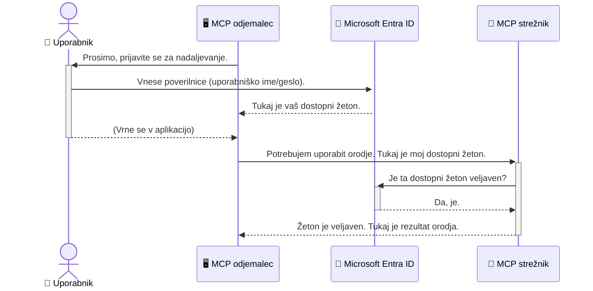

# Zavarovanje AI delovnih tokov: Avtentikacija Entra ID za strežnike protokola Model Context

## Uvod
Zavarovanje vašega strežnika Model Context Protocol (MCP) je enako pomembno kot zaklepanje vhodnih vrat vašega doma. Če pustite vaš MCP strežnik odprt, izpostavite svoja orodja in podatke nepooblaščenemu dostopu, kar lahko vodi do varnostnih kršitev. Microsoft Entra ID zagotavlja robustno rešitev za upravljanje identitet in dostopa v oblaku, ki pomaga zagotoviti, da lahko z vašim MCP strežnikom uporabljajo le pooblaščeni uporabniki in aplikacije. V tem razdelku se boste naučili, kako zaščititi svoje AI delovne tokove z uporabo avtentikacije Entra ID.

## Cilji učenja
Do konca tega razdelka boste znali:

- Razumeti pomen zavarovanja MCP strežnikov.
- Pojasniti osnove Microsoft Entra ID in OAuth 2.0 avtentikacije.
- Prepoznati razliko med javnimi in zaupnimi odjemalci.
- Uporabiti Entra ID avtentikacijo tako v lokalnih (javni odjemalec) kot oddaljenih (zaupni odjemalec) scenarijih MCP strežnika.
- Uvesti varnostne najboljše prakse pri razvoju AI delovnih tokov.

## Varnost in MCP

Tako kot ne bi pustili vhodnih vrat svojega doma odklenjenih, ne bi smeli pustiti MCP strežnika odprtega za kogarkoli. Zavarovanje vaših AI delovnih tokov je bistveno za gradnjo robustnih, zanesljivih in varnih aplikacij. Ta poglavje vas bo seznanilo z uporabo Microsoft Entra ID za zavarovanje vaših MCP strežnikov, s čimer bo zagotovljeno, da lahko z vašimi orodji in podatki komunicirajo le pooblaščeni uporabniki in aplikacije.

## Zakaj je varnost pomembna za MCP strežnike

Predstavljajte si, da ima vaš MCP strežnik orodje, ki lahko pošilja e-pošto ali dostopa do podatkovne baze strank. Nezavarovan strežnik bi pomenil, da bi kdorkoli lahko potencialno uporabljal to orodje, kar bi vodilo do nepooblaščenega dostopa do podatkov, vsiljene pošte ali drugih zlonamernih dejavnosti.

S implementacijo avtentikacije zagotovite, da je vsak zahtevek vašemu strežniku preverjen in da se potrdi identiteta uporabnika ali aplikacije, ki zahtevek pošilja. To je prvi in najpomembnejši korak pri zavarovanju vaših AI delovnih tokov.

## Uvod v Microsoft Entra ID

[**Microsoft Entra ID**](https://adoption.microsoft.com/microsoft-security/entra/) je storitev za upravljanje identitete in dostopa, ki temelji na oblaku. Razmislite o njej kot o univerzalnem varnostnem stražarju za vaše aplikacije. Obvladuje zapletene procese preverjanja identitete uporabnikov (avtentikacija) in določanja, kaj jim je dovoljeno početi (avtorizacija).

Z uporabo Entra ID lahko:

- Omogočite varen prijavni proces za uporabnike.
- Zaščitite API-je in storitve.
- Upravljate dostopne politike iz osrednje točke.

Za MCP strežnike Entra ID ponuja robustno in široko zaupanja vredno rešitev za upravljanje dostopa do funkcionalnosti vašega strežnika.

---

## Razumevanje čarovnije: kako deluje avtentikacija Entra ID

Entra ID uporablja odprte standarde, kot je **OAuth 2.0**, za obravnavo avtentikacije. Čeprav so podrobnosti lahko kompleksne, je osnovni koncept preprost in ga lahko razumemo z analogijo.

### Nežen uvod v OAuth 2.0: Ključ skrbnika parkirišča

OAuth 2.0 lahko primerjamo s storitvijo skrbnika parkirišča za vaš avto. Ko prispete v restavracijo, skrbniku ne daste svojega glavnega ključa. Namesto tega mu podate **ključ skrbnika**, ki ima omejene pravice – lahko vžge avto in zaklene vrata, vendar ne more odpreti prtljažnika ali predala za rokavice.

V tej analogiji:

- **Vi** ste **uporabnik**.
- **Vaš avto** je **MCP strežnik** s svojimi dragocenimi orodji in podatki.
- **Skrbnik** je **Microsoft Entra ID**.
- **Skrbnik parkirišča** je **MCP odjemalec** (aplikacija, ki skuša dostopati do strežnika).
- **Ključ skrbnika** je **dostopni žeton**.

Dostopni žeton je varen niz besedila, ki ga MCP odjemalec prejme od Entra ID po tem, ko se prijavite. Odjemalec nato ta žeton predstavi MCP strežniku pri vsakem zahtevku. Strežnik lahko preveri žeton, da se prepriča, da je zahtevek legitimni in da ima odjemalec potrebna dovoljenja, vse to brez potrebe po ravnanju z vašimi dejanskimi poverilnicami (kot je vaša geslo).

### Potek avtentikacije

Takole proces v praksi deluje:



### Predstavitev knjižnice Microsoft Authentication Library (MSAL)

Preden se poglobimo v kodo, je pomembno spoznati ključno komponento, ki jo boste videli v primerih: **Microsoft Authentication Library (MSAL)**.

MSAL je knjižnica, ki jo je razvil Microsoft in razvijalcem olajša upravljanje avtentikacije. Namesto da bi sami pisali vso zapleteno kodo za ravnanje z varnostnimi žetoni, upravljanje prijav in osveževanje sej, MSAL opravi to delo za vas.

Uporaba knjižnice, kot je MSAL, je zelo priporočljiva, ker:

- **Je varna:** Izvaja industrijske standarde protokolov in najboljše varnostne prakse, s čimer zmanjša tveganje ranljivosti v vaši kodi.
- **Poenostavi razvoj:** Skrije zapletenost protokolov OAuth 2.0 in OpenID Connect, kar vam omogoča enostavno dodajanje robustne avtentikacije v vašo aplikacijo z le nekaj vrsticami kode.
- **Je vzdrževana:** Microsoft aktivno vzdržuje in posodablja MSAL, da se sooči z novimi varnostnimi grožnjami in spremembami platform.

MSAL podpira širok nabor jezikov in razvojnih ogrodij, vključno z .NET, JavaScript/TypeScript, Python, Java, Go in mobilne platforme, kot sta iOS in Android. To pomeni, da lahko uporabite iste dosledne vzorce avtentikacije v celotnem tehnološkem skladišču.

Za več informacij o MSAL si lahko ogledate uradno [MSAL pregledno dokumentacijo](https://learn.microsoft.com/entra/identity-platform/msal-overview).

---

## Zavarovanje vašega MCP strežnika z Entra ID: Vodnik korak za korakom

Zdaj pa si poglejmo, kako zavarovati lokalni MCP strežnik (ki komunicira preko `stdio`) z uporabo Entra ID. Ta primer uporablja **javni odjemalec**, ki je primeren za aplikacije, ki tečejo na uporabnikovem računalniku, kot je namizna aplikacija ali lokalni razvojni strežnik.

### Scenarij 1: Zavarovanje lokalnega MCP strežnika (z javnim odjemalcem)

V tem scenariju bomo pogledali MCP strežnik, ki teče lokalno, komunicira preko `stdio` in uporablja Entra ID za avtentikacijo uporabnika, preden mu dovoli dostop do orodij. Strežnik bo imel eno orodje, ki pridobi podatke o uporabnikovem profilu iz Microsoft Graph API-ja.

#### 1. Nastavitev aplikacije v Entra ID

Preden začnete pisati kodo, morate registrirati svojo aplikacijo v Microsoft Entra ID. Tako Entra ID spozna vašo aplikacijo in ji podeli dovoljenje za uporabo avtentikacijskih storitev.

1. Odprite **[Microsoft Entra portal](https://entra.microsoft.com/)**.
2. Pojdite na **Registracije aplikacij** in kliknite **Nova registracija**.
3. Poimenujte svojo aplikacijo (npr. "Moj lokalni MCP strežnik").
4. Za **Podprti tipi računov** izberite **Računi samo v tej organizacijski enoti**.
5. Za ta primer lahko pustite **Preusmeritveni URI** prazen.
6. Kliknite **Registriraj**.

Ko je aplikacija registrirana, si zabeležite **ID aplikacije (odjemalca)** in **ID imenika (najemnika)**. Te podatke boste potrebovali v kodi.

#### 2. Koda: razčlenitev

Poglejmo ključne dele kode, ki obravnavajo avtentikacijo. Celotna koda za ta primer je na voljo v mapi [Entra ID - Local - WAM](https://github.com/Azure-Samples/mcp-auth-servers/tree/main/src/entra-id-local-wam) v repozitoriju [mcp-auth-servers GitHub](https://github.com/Azure-Samples/mcp-auth-servers).

**`AuthenticationService.cs`**

Ta razred je odgovoren za upravljanje interakcije z Entra ID.

- **`CreateAsync`**: Ta metoda inicializira `PublicClientApplication` iz MSAL (Microsoft Authentication Library). Konfigurirana je z `clientId` in `tenantId` vaše aplikacije.
- **`WithBroker`**: Omogoča uporabo posrednika (kot je Windows Web Account Manager), ki zagotavlja varnejšo in nemoteno izkušnjo enotne prijave.
- **`AcquireTokenAsync`**: To je jedrna metoda. Najprej skuša pridobiti žeton tiho (torej, uporabnik se ne bo moral ponovno prijaviti, če že ima veljavno sejo). Če ni mogoče pridobiti tihega žetona, bo uporabnika pozvala k interaktivni prijavi.

```csharp
// Simplified for clarity
public static async Task<AuthenticationService> CreateAsync(ILogger<AuthenticationService> logger)
{
    var msalClient = PublicClientApplicationBuilder
        .Create(_clientId) // Your Application (client) ID
        .WithAuthority(AadAuthorityAudience.AzureAdMyOrg)
        .WithTenantId(_tenantId) // Your Directory (tenant) ID
        .WithBroker(new BrokerOptions(BrokerOptions.OperatingSystems.Windows))
        .Build();

    // ... cache registration ...

    return new AuthenticationService(logger, msalClient);
}

public async Task<string> AcquireTokenAsync()
{
    try
    {
        // Try silent authentication first
        var accounts = await _msalClient.GetAccountsAsync();
        var account = accounts.FirstOrDefault();

        AuthenticationResult? result = null;

        if (account != null)
        {
            result = await _msalClient.AcquireTokenSilent(_scopes, account).ExecuteAsync();
        }
        else
        {
            // If no account, or silent fails, go interactive
            result = await _msalClient.AcquireTokenInteractive(_scopes).ExecuteAsync();
        }

        return result.AccessToken;
    }
    catch (Exception ex)
    {
        _logger.LogError(ex, "An error occurred while acquiring the token.");
        throw; // Optionally rethrow the exception for higher-level handling
    }
}
```

**`Program.cs`**

Tu je nastavljen MCP strežnik in integrirana storitev avtentikacije.

- **`AddSingleton<AuthenticationService>`**: Registrira `AuthenticationService` v kontejner za odvisnostno vstavljanje, da ga lahko uporabljajo drugi deli aplikacije (kot je naše orodje).
- **Orodje `GetUserDetailsFromGraph`**: To orodje potrebuje instanco `AuthenticationService`. Pred uporabo kliče `authService.AcquireTokenAsync()` za pridobitev veljavnega dostopnega žetona. Če je avtentikacija uspešna, z žetonom pokliče Microsoft Graph API in pridobi uporabnikove podatke.

```csharp
// Simplified for clarity
[McpServerTool(Name = "GetUserDetailsFromGraph")]
public static async Task<string> GetUserDetailsFromGraph(
    AuthenticationService authService)
{
    try
    {
        // This will trigger the authentication flow
        var accessToken = await authService.AcquireTokenAsync();

        // Use the token to create a GraphServiceClient
        var graphClient = new GraphServiceClient(
            new BaseBearerTokenAuthenticationProvider(new TokenProvider(authService)));

        var user = await graphClient.Me.GetAsync();

        return System.Text.Json.JsonSerializer.Serialize(user);
    }
    catch (Exception ex)
    {
        return $"Error: {ex.Message}";
    }
}
```

#### 3. Kako vse skupaj deluje

1. Ko MCP odjemalec poskuša uporabiti orodje `GetUserDetailsFromGraph`, orodje najprej kliče `AcquireTokenAsync`.
2. `AcquireTokenAsync` sproži knjižnico MSAL, da preveri veljaven žeton.
3. Če žeton ni najden, MSAL preko posrednika uporabnika pozove k prijavi z Entra ID računom.
4. Ko se uporabnik prijavi, Entra ID izda dostopni žeton.
5. Orodje prejme žeton in ga uporabi za varen klic Microsoft Graph API-ja.
6. Podatki o uporabniku se vrnejo MCP odjemalcu.

Ta proces zagotavlja, da lahko orodje uporablja le avtenticirani uporabnik, s čimer je vaš lokalni MCP strežnik učinkovito zavarovan.

### Scenarij 2: Zavarovanje oddaljenega MCP strežnika (z zaupnim odjemalcem)

Ko vaš MCP strežnik teče na oddaljenem računalniku (npr. strežnik v oblaku) in komunicira preko protokola, kot je HTTP Streaming, so varnostni zahtevi drugačni. V tem primeru morate uporabiti **zaupni odjemalec** in **potek avtorizacijskega kodeksa**. To je varnejša metoda, saj skrivnosti aplikacije nikoli niso razkrite brskalniku.

Ta primer uporablja MCP strežnik na osnovi TypeScript, ki uporablja Express.js za obravnavo HTTP zahtev.

#### 1. Nastavitev aplikacije v Entra ID

Nastavitev v Entra ID je podobna kot pri javnem odjemalcu, vendar z eno ključno razliko: potrebno je ustvariti **odjemalsko skrivnost**.

1. Odprite **[Microsoft Entra portal](https://entra.microsoft.com/)**.
2. V registraciji vaše aplikacije pojdite na zavihek **Potrdila in skrivnosti**.
3. Kliknite **Nova odjemalska skrivnost**, ji dajte opis in kliknite **Dodaj**.
4. **Pomembno:** Takoj kopirajte vrednost skrivnosti. Kasneje je ne boste mogli ponovno videti.
5. Prav tako morate nastaviti **Preusmeritveni URI**. Pojdite na zavihek **Avtentikacija**, kliknite **Dodaj platformo**, izberite **Splet** in vnesite preusmeritveni URI vaše aplikacije (npr. `http://localhost:3001/auth/callback`).

> **⚠️ Pomembno varnostno opozorilo:** Za produkcijske aplikacije Microsoft močno priporoča uporabo metod avtentikacije brez skrivnosti, kot sta **Managed Identity** ali **Workload Identity Federation**, namesto odjemalskih skrivnosti. Odjemalske skrivnosti predstavljajo varnostno tveganje, saj jih je mogoče razkriti ali kompromitirati. Upravljane identitete zagotavljajo varnejši pristop, saj odpravijo potrebo po shranjevanju poverilnic v kodi ali konfiguraciji.
>
> Za več informacij o upravljanih identitetah in njihovi implementaciji si oglejte [Pregled upravljanih identitet za vire Azure](https://learn.microsoft.com/entra/identity/managed-identities-azure-resources/overview).

#### 2. Koda: razčlenitev

Ta primer uporablja pristop, ki temelji na seji. Ko se uporabnik prijavi, strežnik shrani dostopni žeton in osvežitveni žeton v sejo ter uporabniku vrne žeton seje. Ta žeton se nato uporablja za nadaljnje zahtevke. Celotna koda za ta primer je na voljo v mapi [Entra ID - Confidential client](https://github.com/Azure-Samples/mcp-auth-servers/tree/main/src/entra-id-cca-session) repozitorija [mcp-auth-servers GitHub](https://github.com/Azure-Samples/mcp-auth-servers).

**`Server.ts`**

Ta datoteka nastavi Express strežnik in MCP transportno plast.

- **`requireBearerAuth`**: To je vmesnik, ki ščiti končne točke `/sse` in `/message`. Preverja veljaven žeton nosilca v glavi `Authorization` zahtevka.
- **`EntraIdServerAuthProvider`**: To je lastniški razred, ki implementira vmesnik `McpServerAuthorizationProvider`. Odgovoren je za upravljanje OAuth 2.0 poteka.
- **`/auth/callback`**: Ta končna točka obvladuje preusmeritev iz Entra ID po uspešni prijavi uporabnika. Zamenja avtorizacijsko kodo za dostopni in osvežitveni žeton.

```typescript
// Poenostavljeno za jasnost
const app = express();
const { server } = createServer();
const provider = new EntraIdServerAuthProvider();

// Zaščitite SSE končno točko
app.get("/sse", requireBearerAuth({
  provider,
  requiredScopes: ["User.Read"]
}), async (req, res) => {
  // ... povežite se s prevozom ...
});

// Zaščitite končno točko sporočila
app.post("/message", requireBearerAuth({
  provider,
  requiredScopes: ["User.Read"]
}), async (req, res) => {
  // ... obdelajte sporočilo ...
});

// Obravnava OAuth 2.0 povratni klic
app.get("/auth/callback", (req, res) => {
  provider.handleCallback(req.query.code, req.query.state)
    .then(result => {
      // ... obdelajte uspeh ali neuspeh ...
    });
});
```

**`Tools.ts`**

Ta datoteka opredeljuje orodja, ki jih ponuja MCP strežnik. Orodje `getUserDetails` je podobno kot v prejšnjem primeru, vendar pridobi dostopni žeton iz seje.

```typescript
// Poenostavljeno za preglednost
server.setRequestHandler(CallToolRequestSchema, async (request) => {
  const { name } = request.params;
  const context = request.params?.context as { token?: string } | undefined;
  const sessionToken = context?.token;

  if (name === ToolName.GET_USER_DETAILS) {
    if (!sessionToken) {
      throw new AuthenticationError("Authentication token is missing or invalid. Ensure the token is provided in the request context.");
    }

    // Pridobi Entra ID žeton iz shrambe seje
    const tokenData = tokenStore.getToken(sessionToken);
    const entraIdToken = tokenData.accessToken;

    const graphClient = Client.init({
      authProvider: (done) => {
        done(null, entraIdToken);
      }
    });

    const user = await graphClient.api('/me').get();

    // ... vrni podatke o uporabniku ...
  }
});
```

**`auth/EntraIdServerAuthProvider.ts`**

Ta razred obvladuje logiko za:

- Preusmeritev uporabnika na prijavno stran Entra ID.
- Zamenjavo avtorizacijske kode za dostopni žeton.
- Shranjevanje žetonov v `tokenStore`.
- Osveževanje dostopnega žetona, ko poteče.

#### 3. Kako vse skupaj deluje

1. Ko se uporabnik prvič poskuša povezati z MCP strežnikom, `requireBearerAuth` vmesnik zazna, da nima veljavne seje, in ga preusmeri na prijavno stran Entra ID.
2. Uporabnik se prijavi z svojim Entra ID računom.
3. Entra ID preusmeri uporabnika nazaj na konec `/auth/callback` z avtentikacijskim kodo.
4. Streznik izmenja kodo za dostopni žeton in osvežitveni žeton, jih shrani in ustvari sejo, ki jo pošlje odjemalcu.
5. Odjemalec lahko zdaj za vse prihodnje zahteve do MCP strežnika uporabi to seja žeton v glavi `Authorization`.
6. Ko je orodje `getUserDetails` poklicano, uporabi seja žeton za iskanje Entra ID dostopnega žetona in nato uporabi tega za klic Microsoft Graph API.

Ta tok je bolj zapleten kot tok javnega odjemalca, vendar je potreben za internetno dostopne končne točke. Ker so oddaljeni MCP strežniki dostopni prek javnega interneta, potrebujejo močnejše varnostne ukrepe za zaščito pred nepooblaščenim dostopom in potencialnimi napadi.

## Najboljše varnostne prakse

- **Vedno uporabljajte HTTPS**: Šifrirajte komunikacijo med odjemalcem in strežnikom za zaščito žetonov pred prestrezanjem.
- **Implementirajte nadzor dostopa, temelječ na vlogah (RBAC)**: Ne preverjajte samo *ali* je uporabnik avtenticiran; preverite *kaj* je pooblaščen storiti. V Entra ID lahko definirate vloge in preverjate njihovo prisotnost v vašem MCP strežniku.
- **Nadzorovanje in revizija**: Zabeležite vse dogodke avtentikacije, da lahko zaznate in ukrepate ob sumljivi dejavnosti.
- **Obravnava omejevanja hitrosti in dušenja zahtev**: Microsoft Graph in druge API-ji uporabljajo omejevanje hitrosti za preprečitev zlorab. V vašem MCP strežniku implementirajte eksponentno vračanje in logiko ponovnega poizkusa za elegantno ravnanje z odzivi HTTP 429 (Preveč zahtevkov). Razmislite o predpomnenju pogosto dostopnih podatkov za zmanjšanje števila klicev API-ju.
- **Varnostno shranjevanje žetonov**: Dostopne žetone in osvežitvene žetone shranjujte varno. Za lokalne aplikacije uporabite varnostne mehanizme sistema. Za strežniške aplikacije razmislite o uporabi šifriranega shranjevanja ali varnih storitev za upravljanje ključev, kot je Azure Key Vault.
- **Obravnavanje poteka veljavnosti žetonov**: Dostopni žetoni imajo omejeno življenjsko dobo. Implementirajte samodejno osveževanje žetonov z uporabo osvežitvenih žetonov za nemoteno uporabniško izkušnjo brez ponovne avtentikacije.
- **Razmislite o uporabi Azure API Management**: Medtem ko neposredna implementacija varnosti v vašem MCP strežniku ponuja podrobno kontrolo, lahko API prehodi, kot je Azure API Management, samodejno urejajo veliko teh varnostnih izzivov, vključno z avtentikacijo, avtorizacijo, omejevanjem hitrosti in nadzorovanjem. Nudijo centralizirano varnostno plast med vašimi odjemalci in MCP strežniki. Za več podrobnosti o uporabi API prehodov z MCP glejte našo [Azure API Management Your Auth Gateway For MCP Servers](https://techcommunity.microsoft.com/blog/integrationsonazureblog/azure-api-management-your-auth-gateway-for-mcp-servers/4402690).

## Ključne ugotovitve

- Zavarovanje vašega MCP strežnika je ključno za zaščito podatkov in orodij.
- Microsoft Entra ID nudi robustno in razširljivo rešitev za avtentikacijo in avtorizacijo.
- Za lokalne aplikacije uporabite **javnega odjemalca**, za oddaljene strežnike pa **zaupnega odjemalca**.
- **Tok avtentikacijske kode** je najvarnejša možnost za spletne aplikacije.

## Vaja

1. Pomislite na MCP strežnik, ki bi ga morda zgradili. Bi bil lokalni ali oddaljeni strežnik?
2. Glede na vaš odgovor, bi uporabili javnega ali zaupnega odjemalca?
3. Katere pravice bi vaš MCP strežnik zahteval za izvajanje dejanj proti Microsoft Graph?

## Praktične vaje

### Vaja 1: Registrirajte aplikacijo v Entra ID  
Pojdite na Microsoft Entra portal.  
Registrirajte novo aplikacijo za vaš MCP strežnik.  
Zabeležite ID aplikacije (odjemalca) in ID imenika (najemnika).

### Vaja 2: Zavarujte lokalni MCP strežnik (javni odjemalec)  
- Sledite kodnemu primeru za integracijo MSAL (Microsoft Authentication Library) za uporabniško avtentikacijo.  
- Preizkusite tok avtentikacije z uporabo orodja MCP, ki pridobiva podrobnosti uporabnika iz Microsoft Graph.

### Vaja 3: Zavarujte oddaljeni MCP strežnik (zaupen odjemalec)  
- Registrirajte zaupnega odjemalca v Entra ID in ustvarite skrivnost odjemalca.  
- Konfigurirajte svoj MCP strežnik Express.js, da uporablja tok avtentikacijske kode.  
- Preizkusite zavarovane končne točke in potrdite dostop z žetoni.

### Vaja 4: Uporabite najboljše prakse varnosti  
- Omogočite HTTPS za vaš lokalni ali oddaljeni strežnik.  
- Implementirajte nadzor dostopa, temelječ na vlogah (RBAC), v logiko strežnika.  
- Dodajte obravnavo poteka žetonov in varno shranjevanje žetonov.

## Viri

1. **Dokumentacija MSAL Pregled**  
   Spoznajte, kako Microsoft Authentication Library (MSAL) omogoča varno pridobivanje žetonov na različnih platformah:  
   [MSAL Overview on Microsoft Learn](https://learn.microsoft.com/en-gb/entra/msal/overview)

2. **Azure-Samples/mcp-auth-servers GitHub repozitorij**  
   Primeri implementacij MCP strežnikov, ki prikazujejo tokove avtentikacije:  
   [Azure-Samples/mcp-auth-servers on GitHub](https://github.com/Azure-Samples/mcp-auth-servers)

3. **Pregled upravljanih identitet za Azure vire**  
   Razumite, kako odstraniti skrivnosti z uporabo sistemskih ali uporabniško dodeljenih upravljanih identitet:  
   [Managed Identities Overview on Microsoft Learn](https://learn.microsoft.com/en-us/entra/identity/managed-identities-azure-resources/)

4. **Azure API Management: Vaša avtentikacijska prehodna točka za MCP strežnike**  
   Poglobljen opis uporabe APIM kot varnega OAuth2 prehoda za MCP strežnike:  
   [Azure API Management Your Auth Gateway For MCP Servers](https://techcommunity.microsoft.com/blog/integrationsonazureblog/azure-api-management-your-auth-gateway-for-mcp-servers/4402690)

5. **Reference dovoljenj Microsoft Graph**  
   Celovit seznam pooblaščenj, dodeljenih in aplikacijskih, za Microsoft Graph:  
   [Microsoft Graph Permissions Reference](https://learn.microsoft.com/zh-tw/graph/permissions-reference)

## Učni rezultati  
Po zaključku tega poglavja boste znali:

- Razložiti, zakaj je avtentikacija ključna za MCP strežnike in AI delovne tokove.  
- Nastaviti in konfigurirati Entra ID avtentikacijo za lokalne in oddaljene MCP strežnike.  
- Izbrati ustrezen tip odjemalca (javni ali zaupen) glede na vašo postavitev strežnika.  
- Implementirati varnostne prakse kodiranja, vključno s shranjevanjem žetonov in avtorizacijo, temelječo na vlogah.  
- Zaupanja vredno zaščititi vaš MCP strežnik in njegova orodja pred nepooblaščenim dostopom.

## Kaj sledi

- [5.13 Model Context Protocol (MCP) integracija z Microsoft Foundry](../mcp-foundry-agent-integration/README.md)

---

<!-- CO-OP TRANSLATOR DISCLAIMER START -->
**Omejitev odgovornosti**:
Ta dokument je bil preveden z uporabo AI prevajalske storitve [Co-op Translator](https://github.com/Azure/co-op-translator). Čeprav si prizadevamo za natančnost, vas prosimo, da upoštevate, da avtomatizirani prevodi lahko vsebujejo napake ali netočnosti. Izvirni dokument v njegovem izvirnem jeziku je treba obravnavati kot avtoritativni vir. Za kritične informacije je priporočljiv strokovni človeški prevod. Ne odgovarjamo za morebitna nesporazume ali napačne interpretacije, ki izhajajo iz uporabe tega prevoda.
<!-- CO-OP TRANSLATOR DISCLAIMER END -->