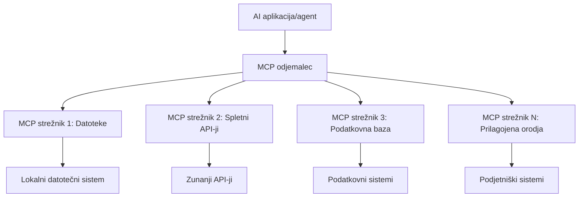

# 🌐 Modul 2: MCP z osnovami Microsoft Foundry Toolkit

[]()
[]()
[]()

## 📋 Cilji učenja

Do konca tega modula boste lahko:
- ✅ Razumeli arhitekturo in prednosti Model Context Protocol (MCP)
- ✅ Raziskali Microsoftov ekosistem MCP strežnikov
- ✅ Integrirali MCP strežnike z Microsoft Foundry Toolkit Agent Builder
- ✅ Zgradili funkcionalnega agenta za avtomatizacijo brskalnika z uporabo Playwright MCP
- ✅ Konfigurirali in testirali MCP orodja znotraj vaših agentov
- ✅ Izvozili in implementirali agente z močjo MCP za produkcijsko uporabo

## 🎯 Nadaljevanje iz Modula 1

V Modulu 1 smo osvojili osnove Microsoft Foundry Toolkit in ustvarili našega prvega Python agenta. Zdaj bomo vaše agente **nadgradili** tako, da jih bomo povezali z zunanjimi orodji in storitvami preko revolucionarnega **Model Context Protocol (MCP)**.

Pomislite na to kot nadgradnjo iz osnovnega kalkulatorja v celoten računalnik – vaši AI agenti bodo pridobili sposobnost:
- 🌐 Brskanja in interakcije z spletnimi stranmi
- 📁 Dostopa in upravljanja datotek
- 🔧 Integracije z enterprise sistemi
- 📊 Obdelave podatkov v realnem času iz API-jev

## 🧠 Razumevanje Model Context Protocol (MCP)

### 🔍 Kaj je MCP?

Model Context Protocol (MCP) je **"USB-C za AI aplikacije"** – revolucionarni odprti standard, ki povezuje velike jezikovne modele (LLM) z zunanjimi orodji, podatkovnimi viri in storitvami. Tako kot je USB-C odpravil kabelski kaos s tem, da je zagotovil en univerzalni priključek, MCP odpravlja kompleksnost AI integracij z enim standardiziranim protokolom.

### 🎯 Težave, ki jih MCP rešuje

**Pred MCP:**
- 🔧 Prilagojene integracije za vsako orodje posebej
- 🔄 Zaklepanje pri prodajalcih z lastniškimi rešitvami  
- 🔒 Varnostne ranljivosti zaradi ad-hoc povezav
- ⏱️ Mesece razvoja za osnovne integracije

**Z MCP:**
- ⚡ Integracija orodij »vtakni in uporabi«
- 🔄 Arhitektura neodvisna od prodajalcev
- 🛡️ Vgrajene najboljše varnostne prakse
- 🚀 Minutni dodatek novih zmogljivosti

### 🏗️ Poglobljen pogled na arhitekturo MCP

MCP sledi **arhitekturi odjemalec-strežnik**, ki ustvarja varen in razširljiv ekosistem:



**🔧 Ključne komponente:**

| Komponenta | Vloga | Primeri |
|------------|-------|---------|
| **MCP Gostitelji** | Aplikacije, ki uporabljajo MCP storitve | Claude Desktop, VS Code, Microsoft Foundry Toolkit |
| **MCP Odjemalci** | Protokolni upravljalci (1:1 s strežniki) | Vgrajeni v gostiteljske aplikacije |
| **MCP Strežniki** | Izpostavljajo zmogljivosti preko standardnega protokola | Playwright, Files, Azure, GitHub |
| **Transportna plast** | Metode komunikacije | stdio, HTTP, WebSockets |


## 🏢 Microsoftov MCP ekosistem strežnikov

Microsoft vodi MCP ekosistem z obsežno zbirko enterprise strežnikov, ki rešujejo realne poslovne potrebe.

### 🌟 Izpostavljeni Microsoftovi MCP strežniki

#### 1. ☁️ Azure MCP strežnik
**🔗 Repozitorij**: [azure/azure-mcp](https://github.com/azure/azure-mcp)
**🎯 Namen**: Celovito upravljanje Azure virov z AI integracijo

**✨ Ključne značilnosti:**
- Deklarativno zagotavljanje infrastrukture
- Spremljanje virov v realnem času
- Priporočila za optimizacijo stroškov
- Preverjanje skladnosti z varnostnimi zahtevami

**🚀 Primeri uporabe:**
- Infrastruktura kot koda s pomočjo AI
- Avtomatsko skaliranje virov
- Optimizacija stroškov v oblaku
- Avtomatizacija DevOps potekov dela

#### 2. 📊 Microsoft Dataverse MCP
**📚 Dokumentacija**: [Integracija Microsoft Dataverse](https://go.microsoft.com/fwlink/?linkid=2320176)
**🎯 Namen**: Vmesnik za poslovne podatke z naravnim jezikom

**✨ Ključne značilnosti:**
- Poizvedbe baz podatkov v naravnem jeziku
- Razumevanje poslovnega konteksta
- Prilagodljivi predlogi za pozive
- Upravljanje podatkov podjetja

**🚀 Primeri uporabe:**
- Poročanje poslovne inteligence
- Analiza podatkov o strankah
- Pregled prodajnega lijaka
- Poizvedbe za skladnost podatkov

#### 3. 🌐 Playwright MCP strežnik
**🔗 Repozitorij**: [microsoft/playwright-mcp](https://github.com/microsoft/playwright-mcp)
**🎯 Namen**: Avtomatizacija brskalnika in spletna interakcija

**✨ Ključne značilnosti:**
- Avtomatizacija med različnimi brskalniki (Chrome, Firefox, Safari)
- Pametno zaznavanje elementov
- Ustvarjanje posnetkov zaslona in PDF-jev
- Spremljanje omrežnega prometa

**🚀 Primeri uporabe:**
- Avtomatizirani preizkusi potekov dela
- Pridobivanje podatkov s spletnih strani
- Spremljanje uporabniške izkušnje
- Avtomatizacija konkurenčnih analiz

#### 4. 📁 Files MCP strežnik
**🔗 Repozitorij**: [microsoft/files-mcp-server](https://github.com/microsoft/files-mcp-server)
**🎯 Namen**: Pametno upravljanje datotečnih sistemov

**✨ Ključne značilnosti:**
- Deklarativno upravljanje datotek
- Sinhronizacija vsebin
- Integracija s kontrolo različic
- Izvleček metapodatkov

**🚀 Primeri uporabe:**
- Upravljanje dokumentacije
- Organizacija kode v repozitorijih
- Poteki dela objavljanja vsebin
- Upravljanje datotek v podatkovnih tokokrogih

#### 5. 📝 MarkItDown MCP strežnik
**🔗 Repozitorij**: [microsoft/markitdown](https://github.com/microsoft/markitdown)
**🎯 Namen**: Napredno obdelovanje in manipulacija Markdown vsebin

**✨ Ključne značilnosti:**
- Bogato razčlenjevanje Markdowna
- Pretvorba formatov (MD ↔ HTML ↔ PDF)
- Analiza strukture vsebin
- Obdelava predlog

**🚀 Primeri uporabe:**
- Tehnična dokumentacija in njenih delov
- Sistemi za upravljanje vsebin
- Generiranje poročil
- Avtomatizacija bazi znanja

#### 6. 📈 Clarity MCP strežnik
**📦 Paket**: [@microsoft/clarity-mcp-server](https://www.npmjs.com/package/@microsoft/clarity-mcp-server)
**🎯 Namen**: Spletna analiza in vpogled v vedenje uporabnikov

**✨ Ključne značilnosti:**
- Analiza podatkov toplotnih zemljevidov
- Snemanje uporabniških sej
- Meritve uspešnosti
- Analiza konverzijskih lijakov

**🚀 Primeri uporabe:**
- Optimizacija spletnih strani
- Raziskave uporabniške izkušnje
- Analiza A/B testiranj
- Plošče poslovne inteligence

### 🌍 Ekosistem skupnosti

Poleg Microsoftovih strežnikov MCP vključuje tudi:
- **🐙 GitHub MCP**: upravljanje repozitorijev in analiza kode
- **🗄️ MCP-ji za baze podatkov**: PostgreSQL, MySQL, MongoDB integracije
- **☁️ MCP-ji ponudnikov oblaka**: orodja AWS, GCP, Digital Ocean
- **📧 MCP-ji za komunikacijo**: Slack, Teams, e-pošta

## 🛠️ Praktična delavnica: Izgradnja agenta za avtomatizacijo brskalnika

**🎯 Cilj projekta**: Ustvarite inteligentnega agenta za avtomatizacijo brskalnika z uporabo Playwright MCP strežnika, ki lahko krmili spletna mesta, pridobiva informacije in izvaja kompleksne spletne interakcije.

### 🚀 Faza 1: Postavitev temeljev agenta

#### Korak 1: Inicializacija vašega agenta
1. **Odprite Microsoft Foundry Toolkit Agent Builder**
2. **Ustvarite novega agenta** z naslednjo konfiguracijo:
   - **Ime**: `BrowserAgent`
   - **Model**: Izberite GPT-4o 


### 🔧 Faza 2: Delovni tok integracije MCP

#### Korak 3: Dodajanje integracije MCP strežnika
1. **Pojdite v razdelek Orodja** v Agent Builderju
2. **Kliknite "Dodaj orodje"** za odpiranje menija integracije
3. **Izberite "MCP Server"** med razpoložljivimi možnostmi


**🔍 Razumevanje vrst orodij:**
- **Vgrajena orodja**: Vnaprej konfigurirane funkcije Microsoft Foundry Toolkit
- **MCP strežniki**: Integracije zunanjih storitev
- **Lastni API-ji**: Vaši lastni končni točki storitev
- **Klici funkcij**: Neposreden dostop do funkcij modela

#### Korak 4: Izbor MCP strežnika
1. **Izberite možnost "MCP Server"** za nadaljevanje


2. **Prebrskajte MCP katalog** za raziskovanje razpoložljivih integracij


### 🎮 Faza 3: Konfiguracija Playwright MCP

#### Korak 5: Izberite in konfigurirajte Playwright
1. **Kliknite "Uporabi izpostavljene MCP strežnike"** za dostop do Microsoftovih preverjenih strežnikov
2. **Izberite "Playwright"** s seznama
3. **Sprejmite privzeti MCP ID** ali prilagodite za vaše okolje


#### Korak 6: Omogočite Playwright zmogljivosti
**🔑 Ključni korak**: Izberite **VSE** razpoložljive Playwright metode za maksimalno funkcionalnost


**🛠️ Ključna Playwright orodja:**
- **Navigacija**: `goto`, `goBack`, `goForward`, `reload`
- **Interakcija**: `click`, `fill`, `press`, `hover`, `drag`
- **Ekstrakcija**: `textContent`, `innerHTML`, `getAttribute`
- **Validacija**: `isVisible`, `isEnabled`, `waitForSelector`
- **Zajemanje**: `screenshot`, `pdf`, `video`
- **Omrežje**: `setExtraHTTPHeaders`, `route`, `waitForResponse`

#### Korak 7: Preverite uspešnost integracije
**✅ Indikatorji uspeha:**
- Vsa orodja so prikazana v vmesniku Agent Builderja
- Ni napak v panelu za integracijo
- Status Playwright strežnika kaže "Connected"


**🔧 Pogoste težave in rešitve:**
- **Povezava ni uspela**: Preverite internetno povezavo in nastavitve požarnega zidu
- **Manjkajo orodja**: Zagotovite, da so bile vse zmogljivosti izbrane med nastavitvijo
- **Napake dovoljenj**: Preverite, da ima VS Code potrebna sistemska dovoljenja

### 🎯 Faza 4: Napredno oblikovanje pozivov

#### Korak 8: Oblikujte inteligentne sistemske pozive
Ustvarite sofisticirane pozive, ki izkoriščajo vse zmogljivosti Playwrighta:

```markdown
# Web Automation Expert System Prompt

## Core Identity
You are an advanced web automation specialist with deep expertise in browser automation, web scraping, and user experience analysis. You have access to Playwright tools for comprehensive browser control.

## Capabilities & Approach
### Navigation Strategy
- Always start with screenshots to understand page layout
- Use semantic selectors (text content, labels) when possible
- Implement wait strategies for dynamic content
- Handle single-page applications (SPAs) effectively

### Error Handling
- Retry failed operations with exponential backoff
- Provide clear error descriptions and solutions
- Suggest alternative approaches when primary methods fail
- Always capture diagnostic screenshots on errors

### Data Extraction
- Extract structured data in JSON format when possible
- Provide confidence scores for extracted information
- Validate data completeness and accuracy
- Handle pagination and infinite scroll scenarios

### Reporting
- Include step-by-step execution logs
- Provide before/after screenshots for verification
- Suggest optimizations and alternative approaches
- Document any limitations or edge cases encountered

## Ethical Guidelines
- Respect robots.txt and rate limiting
- Avoid overloading target servers
- Only extract publicly available information
- Follow website terms of service
```

#### Korak 9: Ustvarite dinamične uporabniške pozive
Oblikujte pozive, ki prikazujejo različne zmogljivosti:

**🌐 Primer spletne analize:**
```markdown
Navigate to github.com/kinfey and provide a comprehensive analysis including:
1. Repository structure and organization
2. Recent activity and contribution patterns  
3. Documentation quality assessment
4. Technology stack identification
5. Community engagement metrics
6. Notable projects and their purposes

Include screenshots at key steps and provide actionable insights.
```


### 🚀 Faza 5: Izvedba in testiranje

#### Korak 10: Zaženite svojo prvo avtomatizacijo
1. **Kliknite "Zaženi"** za zagon avtomatiziranega zaporedja
2. **Spremljajte izvedbo v realnem času**:
   - Spletni brskalnik Chrome se samodejno zažene
   - Agent brska do ciljnega spletnega mesta
   - Posnetki zaslona zajamejo vsak pomemben korak
   - Rezultati analize se prenašajo v realnem času


#### Korak 11: Analizirajte rezultate in vpoglede
Preglejte obsežno analizo v vmesniku Agent Builderja:


### 🌟 Faza 6: Napredne zmogljivosti in uvajanje

#### Korak 12: Izvoz in produkcijska implementacija
Agent Builder podpira več možnosti uvajanja:


## 🎓 Povzetek Modula 2 in nadaljnji koraki

### 🏆 Dosežek odklenjen: Mojster integracije MCP

**✅ Obvladane spretnosti:**
- [ ] Razumevanje arhitekture in prednosti MCP
- [ ] Krmarjenje po Microsoftovem MCP ekosistemu strežnikov
- [ ] Integracija Playwright MCP z Microsoft Foundry Toolkit
- [ ] Izgradnja naprednih agentov za avtomatizacijo brskalnika
- [ ] Napredno oblikovanje pozivov za spletno avtomatizacijo

### 📚 Dodatni viri

- **🔗 MCP specifikacija**: [Uradna protokolna dokumentacija](https://modelcontextprotocol.io/)
- **🛠️ Playwright API**: [Popoln referenčni seznam metod](https://playwright.dev/docs/api/class-playwright)
- **🏢 Microsoft MCP strežniki**: [Vodnik za enterprise integracijo](https://github.com/microsoft/mcp-servers)
- **🌍 Primeri skupnosti**: [Galerija MCP strežnikov](https://github.com/modelcontextprotocol/servers)

**🎉 Čestitke!** Uspešno ste obvladali integracijo MCP in lahko zdaj gradite produkcijsko pripravljene AI agente z zmogljivostmi zunanjih orodij!


### 🔜 Nadaljujte v naslednji modul

Ste pripravljeni nadgraditi svoje MCP spretnosti? Nadaljujte v **[Modul 3: Napreden razvoj MCP z Microsoft Foundry Toolkit](../lab3/README.md)**, kjer se boste naučili:
- Ustvariti svoje lastne MCP strežnike po meri
- Konfigurirati in uporabljati najnovejši MCP Python SDK
- Nastaviti MCP Inspector za odpravljanje napak
- Obvladati napredne delovne tokove razvoja MCP strežnikov
- Izgraditi MCP strežnik za vreme od začetka

---

<!-- CO-OP TRANSLATOR DISCLAIMER START -->
**Omejitev odgovornosti**:
Ta dokument je bil preveden z uporabo AI prevajalske storitve [Co-op Translator](https://github.com/Azure/co-op-translator). Čeprav si prizadevamo za natančnost, vas prosimo, da upoštevate, da avtomatizirani prevodi lahko vsebujejo napake ali netočnosti. Izvirni dokument v njegovem izvirnem jeziku je treba obravnavati kot avtoritativni vir. Za kritične informacije je priporočljiv strokovni človeški prevod. Ne odgovarjamo za morebitna nesporazume ali napačne interpretacije, ki izhajajo iz uporabe tega prevoda.
<!-- CO-OP TRANSLATOR DISCLAIMER END -->