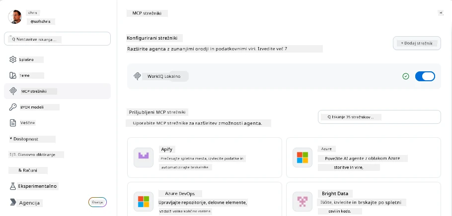
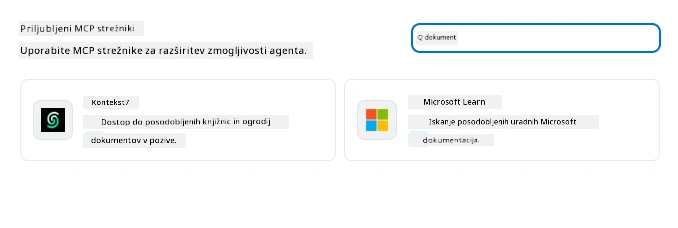
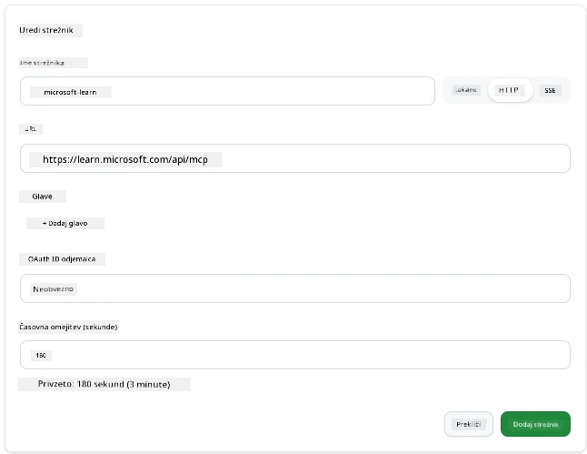
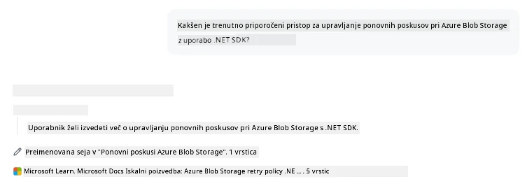
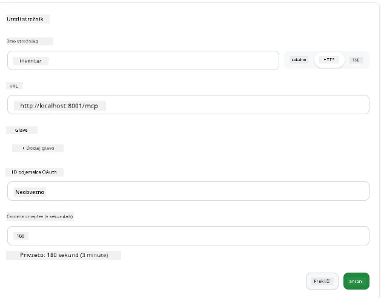
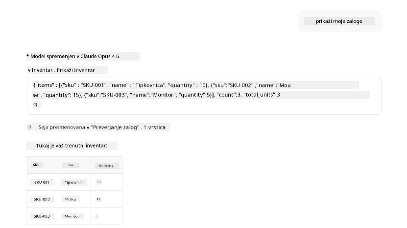
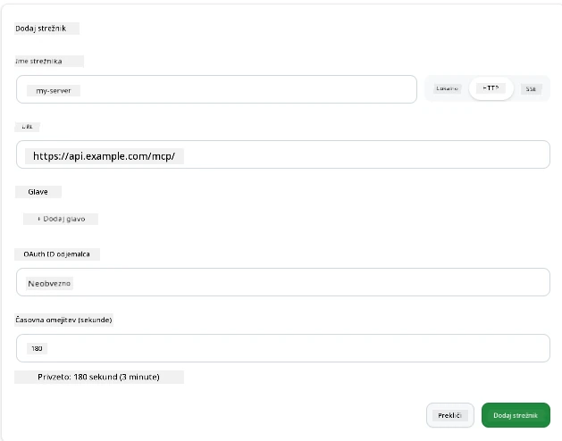
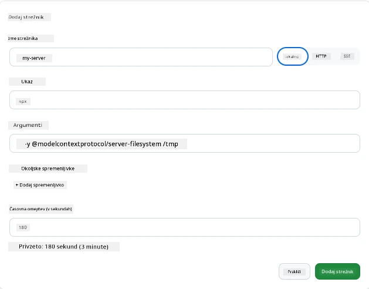

# Uporaba MCP strežnikov v aplikaciji GitHub Copilot

Do sedaj že veste, kako deluje MCP. Zgradili ste strežnike, definirali orodja in vire ter povezali odjemalce. Kar pa še nismo naredili, je, da bi zamenjali perspektivo: namesto da ste vi tisti, ki gradi strežnik, kako izgleda biti na *porabniški* strani — kot uporabnik aplikacije, podprte z AI in MCP?

[GitHub Copilot App](https://github.com/github/app) je namizna aplikacija, ki lahko uporablja MCP strežnike. Z vzpostavitvijo povezave do MCP strežnikov odklenete novo raven: Copilot lahko sedaj dostopa do vaše dokumentacije, kliče vaše notranje API-je, poizveduje vašo podatkovno bazo ali komunicira s katero koli storitvijo, ki ste jo ovili v strežnik. Aplikacija postane gostitelj; vaši MCP strežniki pa postanejo njena orodja.

Ta lekcija vas vodi skozi to izkušnjo od začetka do konca — od iskanja MCP nastavitev, do povezave z resničnim strežnikom za dokumentacijo in nato povezave lastnega prilagojenega strežnika.

## Cilji učenja

Na koncu te lekcije boste znali:

- Najti in navigirati MCP strežnike v nastavitvah aplikacije Copilot.
- Povezati gostujoč strežnik za dokumentacijo in ga uporabiti v seji.
- Registrirati prilagojen strežnik in preveriti, da lahko Copilot kliče njegova orodja.
- Nastaviti način klica strežnika z zagotavljanjem okoljskih spremenljivk ali prilagojenih glavi (če gre za HTTP).

## Aplikacija Copilot kot MCP gostitelj

Temeljna ideja je: **Copilotovi agenti so pametni, vendar vedo samo to, kar jim poveste.** Privzeto lahko agent bere datoteke v vašem delovnem prostoru in izvaja ukaze v terminalu, vendar ne more poizvedovati vaše baze podatkov, pregledovati koledarja ali klicati prilagojenega API-ja brez pomoči. Na tej točki vstopijo MCP strežniki. Ti delujejo kot mostovi med Copilotom in vašimi sistemi — baze podatkov, nadzor verzij, API-ji, orodja za oblikovanje — da agentom omogočajo dostop do informacij in akcij, ki jih potrebujejo za dokončanje dela.

Začnimo z iskanjem nastavitev za upravljanje MCP strežnikov v vaši aplikaciji.

## Korak 1: Iskanje nastavitev MCP strežnikov

Odprite aplikacijo Copilot in poiščite ikono zobnika na spodnjem levem kotu ter kliknite nanjo.


Prepričajte se, da ste izbrali "MCP Servers" in zdaj bi morali videti svoje že konfigurirane strežnike na vrhu, tržnico priljubljenih strežnikov na dnu in gumb "Add Server" na vrhu, kot sledi:



To je vaš kontrolni center. Tukaj dodajate, odstranjujete, vklapljate in izklapljate strežnike. Spremembe začnejo veljati za nove seje; če imate odprto sejo, jo boste morali po spremembi tega seznama znova zagnati.

## Korak 2: Povezava strežnika za dokumentacijo

Naredimo nekaj takoj uporabnega. Microsoft Docs MCP strežnik daje Copilotu dostop do uradne Microsoftove dokumentacije. To vključuje Azure, .NET, TypeScript in več. Namesto da agent zanaša na svoje učne podatke (ki imajo datum rezanja), lahko v času poizvedbe pobere aktualne dokumente.

Tako ga dodate:

1. V mreži priljubljenih strežnikov vtipkajte **learn** in izberite strežnik z imenom "Microsoft Learn".

   

   Ko kliknete, se prikaže obrazec, kjer sta ime, vrsta prenosa in URL že izpolnjena, vse kar morate storiti je klikniti "Add Server".

2. Kliknite "Add Server", povezava s strežnikom bo vzpostavljena v nekaj sekundah.

   

   Ko je dodan, se bo prikazal na vrhu kot konfiguriran strežnik. Preizkusimo ga naslednje.

3. Zaprite pogovorno okno in izberite Quick chat.

4. Vnesite spodnji poziv, ki sproži orodje na strežniku Microsoft Learn.

   ```text
   What's the current recommended approach for handling Azure Blob Storage 
   retries using the .NET SDK?
   ```

   

Videli boste, kako se sklicuje na MCP strežnik, ki smo ga pravkar dodali.

## Korak 3: Povezava prilagojenega stdio strežnika

Prednastavitve so priročne, a prava moč je v povezavi z lastnimi strežniki. Recimo, da ste zgradili strežnik (ali vam je bil dan), ki razkriva vaš notranji API ali bazo znanja podjetja. V tem primeru bomo uporabili MCP strežnik, ki smo ga zgradili in ki obvladuje upravljanje zalog našega podjetja.

1. Kliknite zobnik in ponovno izberite "MCP servers".

2. Izberite gumb "Add Server" in "+ Add Custom server" ter vnesite naslednje vrednosti:

   - Ime: `Inventory Server`
   - Izberite prenos (na desni), **http**

   Izberite "Add Server" in moral bi se pojaviti na vašem seznamu konfiguriranih strežnikov.

   

4. Za preizkus poženite poziv, kot je ta:

    ```
    list inventory
    ```

   

Vrniti bi se moral seznam zalog iz vašega lastnoročno zgrajenega strežnika.

Odlično, zdaj bi morali imeti dobro razumevanje kako dodati zunanje kot tudi lastne MCP strežnike v aplikacijo Copilot. Naslednje govorimo o ravnanju s skrivnostmi in okoljskimi spremenljivkami.

## Korak 4: Napredne nastavitve

Do sedaj ste videli, kako dodati MCP strežnike, kjer preprosto navedete ime in URL. Kaj pa, če vaš strežnik potrebuje API ključ ali kakšno drugo vrednost? Odvisno od vrste prenosa mu lahko zagotovimo, kar potrebuje.

- **http ali SSE prenos**: Tukaj lahko po potrebi nastavimo glave.

   Za avtentikacijo lahko na primer določite Authorization glavo. Vrednost je lahko statična nizek. Če uporabljate OAuth, lahko namesto tega navedete OAuth klientski ID.

   

- **stdio prenos**: Nastavijo se lahko okoljske spremenljivke.

   Tukaj lahko določite poljubno število okoljskih spremenljivk, ki jih strežnik potrebuje in jih mora prejeti ob zagonu.

   

## Povzetek

Aplikacija Copilot obravnava MCP strežnike kot enakovredne razširitve zmožnosti agenta. V tej lekciji ste videli celotno pot od dodajanja MCP strežnikov do njihove uporabe v seji. Zdaj lahko vzpostavite povezave do javnih strežnikov, notranjih API-jev in prilagojenih orodij, s čimer agentom zagotovite dostop do informacij in dejanj, ki jih potrebujejo za samostojno dokončanje nalog.

## 📚 Dodatni viri

### Uradna dokumentacija

- [GitHub Copilot App](https://github.com/github/app)
- [MCP Specification](https://modelcontextprotocol.io/specification/2025-03-26) - specifikacija Model Context Protocol

### Skupnost
- [MCP Community Discord](https://discord.com/invite/ByRwuEEgH4) - žive razprave
- [GitHub Discussions](https://github.com/microsoft/MCP-Server-and-PostgreSQL-Sample-Retail/discussions) - vprašanja in deljenje
- [Stack Overflow](https://stackoverflow.com/questions/tagged/model-context-protocol) - tehnična vprašanja

---

<!-- CO-OP TRANSLATOR DISCLAIMER START -->
**Omejitev odgovornosti**:
Ta dokument je bil preveden z uporabo AI prevajalske storitve [Co-op Translator](https://github.com/Azure/co-op-translator). Čeprav si prizadevamo za natančnost, vas prosimo, da upoštevate, da avtomatizirani prevodi lahko vsebujejo napake ali netočnosti. Izvirni dokument v njegovem izvirnem jeziku je treba obravnavati kot avtoritativni vir. Za kritične informacije je priporočljiv strokovni človeški prevod. Ne odgovarjamo za morebitna nesporazume ali napačne interpretacije, ki izhajajo iz uporabe tega prevoda.
<!-- CO-OP TRANSLATOR DISCLAIMER END -->