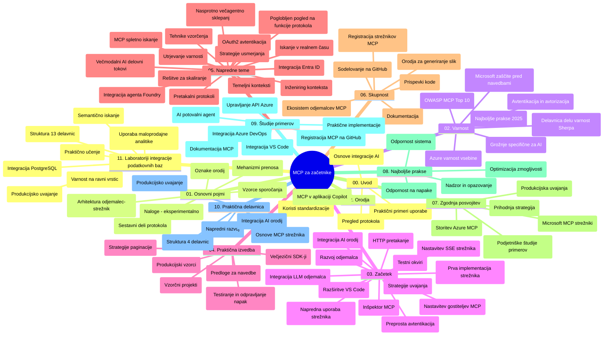

# Model Context Protocol (MCP) za začetnike - Študijski vodič

Ta študijski vodič ponuja pregled strukture in vsebine repozitorija za učni načrt "Model Context Protocol (MCP) za začetnike". Uporabite ta vodič za učinkovito navigacijo po repozitoriju in kar najbolj izkoristite razpoložljive vire.

## Pregled repozitorija

Model Context Protocol (MCP) je standardiziran okvir za interakcije med AI modeli in odjemalskimi aplikacijami. Sprva ga je ustvaril Anthropic, MCP pa zdaj vzdržuje širša MCP skupnost preko uradne organizacije GitHub. Ta repozitorij zagotavlja obsežen učni načrt s praktičnimi primeri kode v C#, Javi, JavaScriptu, Pythonu in TypeScript, namenjen razvijalcem umetne inteligence, sistemskim arhitektom in programski opremi.

## Vizualna karta učnega načrta

## Struktura repozitorija

Repozitorij je organiziran v dvanajst glavnih odsekov, ki se osredotočajo na različne vidike MCP:

1. **Uvod (00-Introduction/)**
   - Pregled Model Context Protocol
   - Zakaj je standardizacija pomembna v AI procesih
   - Praktični primeri uporabe in koristi

2. **Osnovni pojmi (01-CoreConcepts/)**
   - Arhitektura klient-strežnik
   - Ključne sestavine protokola
   - Vzorci sporočanja v MCP

3. **Varnost (02-Security/)**
   - Varnostne grožnje v sistemih, ki temeljijo na MCP
   - Najboljše prakse za varno implementacijo
   - Strategije preverjanja pristnosti in avtorizacije
   - **Celovita varnostna dokumentacija**:
     - MCP varnostne najboljše prakse 2025
     - Priročnik za implementacijo Azure Content Safety
     - MCP varnostni nadzori in tehnike
     - Hiter pregled najboljših praks MCP
   - **Ključne varnostne teme**:
     - Napadi z vstavljanjem pozivov in strupenimi orodji
     - Prestrezanje sej in problemi z zmedenimi odvetniki
     - Ranljivosti pri prenašanju žetonov
     - Pretirane dovoljenja in nadzor dostopa
     - Varnost dobavne verige za AI komponente
     - Integracija Microsoft Prompt Shields

4. **Začetek (03-GettingStarted/)**
   - Nastavitev in konfiguracija okolja
   - Ustvarjanje osnovnih MCP strežnikov in odjemalcev
   - Integracija z obstoječimi aplikacijami
   - Vsebuje odseke za:
     - Prvo implementacijo strežnika
     - Razvoj klienta
     - Integracijo LLM klienta
     - Integracijo z VS Code
     - Strežnik z dogodki, poslanimi od strežnika (SSE)
     - Napredna uporaba strežnika
     - HTTP pretakanje
     - Integracijo AI orodjarne
     - Strategije testiranja
     - Navodila za uvajanje

5. **Praktična implementacija (04-PracticalImplementation/)**
   - Uporaba SDK-jev v različnih programskih jezikih
   - Tehnike odpravljanja napak, testiranja in preverjanja
   - Oblikovanje večkrat uporabnih predlog pozivov in delovnih tokov
   - Primeri projektov s prikazi implementacij

6. **Napredne teme (05-AdvancedTopics/)**
   - Tehnike inženiringa konteksta
   - Integracija Foundry agenta
   - Večmodalni AI delovni tokovi
   - Demonstracije preverjanja pristnosti OAuth2
   - Iskalne zmogljivosti v realnem času
   - Pretakanje v realnem času
   - Implementacija korenskih kontekstov
   - Strategije usmerjanja
   - Tehnike vzorčenja
   - Pristopi skaliranja
   - Varnostne zadeve
   - Integracija varnosti Entra ID
   - Integracija spletnega iskanja
   - Protivovrstno večagentno razmišljanje (vzorec debate)

7. **Prispevki skupnosti (06-CommunityContributions/)**
   - Kako prispevati k kodi in dokumentaciji
   - Sodelovanje preko GitHub
   - Skupnostno vodene izboljšave in povratne informacije
   - Uporaba različnih MCP klientov (Claude Desktop, Cline, VSCode)
   - Delo s priljubljenimi MCP strežniki vključno z generiranjem slik

8. **Nauki iz zgodnjega uvajanja (07-LessonsfromEarlyAdoption/)**
   - Resnični primeri implementacij in zgodbe o uspehu
   - Gradnja in uvajanje rešitev na osnovi MCP
   - Trend in prihodnja roadmapa
   - **Vodnik Microsoft MCP strežnikov**: Celovit vodnik za 10 MCP strežnikov, pripravljenih za produkcijo, vključno z:
     - Microsoft Learn Docs MCP strežnik
     - Azure MCP strežnik (več kot 15 specializiranih priključkov)
     - GitHub MCP strežnik
     - Azure DevOps MCP strežnik
     - MarkItDown MCP strežnik
     - SQL Server MCP strežnik
     - Playwright MCP strežnik
     - Dev Box MCP strežnik
     - Microsoft Foundry MCP strežnik
     - Microsoft 365 Agents Toolkit MCP strežnik

9. **Najboljše prakse (08-BestPractices/)**
   - Prilagajanje performans in optimizacija
   - Načrtovanje odpornih MCP sistemov
   - Strategije testiranja in odpornosti

10. **Študije primerov (09-CaseStudy/)**
    - **Sedem obsežnih študij primerov**, ki prikazujejo vsestranskost MCP v različnih scenarijih:
    - **Azure AI Travel Agents**: večagentna orkestracija z Azure OpenAI in AI Search
    - **Integracija Azure DevOps**: avtomatizacija potekov dela z YouTube posodobitvami podatkov
    - **Pridobivanje dokumentacije v realnem času**: Python konzolni odjemalec z HTTP pretakanjem
    - **Interaktivni generator učnega načrta**: spletna aplikacija Chainlit z govorilno AI
    - **Dokumentacija v urejevalniku**: integracija VS Code z delovnimi tokovi GitHub Copilot
    - **Azure API Management**: integracija poslovnega API-ja z ustvarjanjem MCP strežnika
    - **GitHub MCP Registry**: razvoj ekosistema in platforma za agentno integracijo
    - Primeri implementacije na področju poslovne integracije, produktivnosti razvijalcev in razvoja ekosistema

11. **Praktična delavnica (10-StreamliningAIWorkflowsBuildingAnMCPServerWithAIToolkit/)**
    - Celovita praktična delavnica, ki združuje MCP z AI orodjarno
    - Gradnja inteligentnih aplikacij, ki povezujejo AI modele z realnimi orodji
    - Praktični moduli, ki pokrivajo osnove, razvoj po meri in strategije uvajanja v produkcijo
    - **Struktura laboratorijev**:
      - Laboratorij 1: Osnove MCP strežnika
      - Laboratorij 2: Napredni razvoj MCP strežnika
      - Laboratorij 3: Integracija AI orodjarne
      - Laboratorij 4: Uvajanje v produkcijo in skaliranje
    - Pristop učenja z laboratoriji z navodili korak za korakom

12. **Laboratoriji za integracijo MCP strežnika z bazo podatkov (11-MCPServerHandsOnLabs/)**
    - **Celovit učni program s 13 laboratoriji** za gradnjo produkcijsko pripravljenih MCP strežnikov z integracijo PostgreSQL
    - **Implementacija realnih maloprodajnih analiz** z uporabo primera Zava Retail
    - **Poslovni vzorci** vključno z varnostjo na nivoju vrstic (RLS), semantičnim iskanjem in večnajemniškim dostopom do podatkov
    - **Popolna struktura laboratorijev**:
      - **Laboratoriji 00-03: Temelji** - Uvod, arhitektura, varnost, nastavitev okolja
      - **Laboratoriji 04-06: Izgradnja MCP strežnika** - Oblikovanje baze, implementacija strežnika, razvoj orodij
      - **Laboratoriji 07-09: Napredne funkcije** - Semantično iskanje, testiranje in odpravljanje napak, integracija VS Code
      - **Laboratoriji 10-12: Produkcija in najboljše prakse** - Uvajanje, spremljanje, optimizacija
    - **Pokrite tehnologije**: FastMCP ogrodje, PostgreSQL, Azure OpenAI, Azure Container Apps, Application Insights
    - **Rezultati učenja**: Produkcijsko pripravljeni MCP strežniki, vzorci integracije baz podatkov, AI podprte analize, poslovna varnost

13. **Orodja (12-tooling/)**
    - Naučite se uporabljati MCP v Copilot aplikaciji in drugih orodjih

## Dodatni viri

Repozitorij vključuje podporne vire:

- **Mapa s slikami**: Vsebuje diagrame in ilustracije, uporabljene skozi učni načrt
- **Prevodi**: Večjezična podpora z avtomatiziranimi prevodi dokumentacije
- **Uradni viri MCP**:
  - [MCP dokumentacija](https://modelcontextprotocol.io/)
  - [MCP specifikacija](https://spec.modelcontextprotocol.io/)
  - [MCP repozitorij GitHub](https://github.com/modelcontextprotocol)

## Kako uporabljati ta repozitorij

1. **Učenje po zaporedju**: Sledite poglavjem v vrstnem redu (00 do 11) za strukturirano učenje.
2. **Osredotočenost na jezik**: Če vas zanima določen programski jezik, preglejte mape s primeri implementacij v vašem izbranem jeziku.
3. **Praktična implementacija**: Začnite z razdelkom "Začetek" za nastavitev okolja in ustvarjanje prvega MCP strežnika in odjemalca.
4. **Napredna raziskovanja**: Ko obvladate osnove, poglobite znanje z naprednimi temami.
5. **Skupnostna vključenost**: Pridružite se MCP skupnosti preko GitHub razprav in Discord kanalov za povezovanje z strokovnjaki in razvijalci.

## MCP klienti in orodja

Učni načrt pokriva različne MCP kliente in orodja:

1. **Uradni klienti**:
   - Visual Studio Code
   - MCP v Visual Studio Code
   - Claude Desktop
   - Claude v VSCode
   - Claude API

2. **Skupnostni klienti**:
   - Cline (terminalski)
   - Cursor (urejevalnik kode)
   - ChatMCP
   - Windsurf

3. **Orodja za upravljanje MCP**:
   - MCP CLI
   - MCP Manager
   - MCP Linker
   - MCP Router

## Priljubljeni MCP strežniki

Repozitorij predstavlja različne MCP strežnike, vključno z:

1. **Uradni Microsoft MCP strežniki**:
   - Microsoft Learn Docs MCP strežnik
   - Azure MCP strežnik (več kot 15 specializiranih priključkov)
   - GitHub MCP strežnik
   - Azure DevOps MCP strežnik
   - MarkItDown MCP strežnik
   - SQL Server MCP strežnik
   - Playwright MCP strežnik
   - Dev Box MCP strežnik
   - Microsoft Foundry MCP strežnik
   - Microsoft 365 Agents Toolkit MCP strežnik

2. **Uradni referenčni strežniki**:
   - Filesystem
   - Fetch
   - Memory
   - Sequential Thinking

3. **Generiranje slik**:
   - Azure OpenAI DALL-E 3
   - Stable Diffusion WebUI
   - Replicate

4. **Razvojna orodja**:
   - Git MCP
   - Terminal Control
   - Code Assistant

5. **Specializirani strežniki**:
   - Salesforce
   - Microsoft Teams
   - Jira & Confluence

## Prispevanje

Ta repozitorij sprejema prispevke skupnosti. Za navodila o tem, kako učinkovito prispevati k ekosistemu MCP, si oglejte odsek Prispevki skupnosti.

----

*Ta študijski vodič je bil nazadnje posodobljen 5. februarja 2026, odraža najnovejšo MCP specifikacijo z dne 25.11.2025 in ponuja pregled repozitorija do tega datuma. Vsebina repozitorija se lahko po tem datumu posodablja.*

---

<!-- CO-OP TRANSLATOR DISCLAIMER START -->
**Omejitev odgovornosti**:
Ta dokument je bil preveden z uporabo AI prevajalske storitve [Co-op Translator](https://github.com/Azure/co-op-translator). Čeprav si prizadevamo za natančnost, vas prosimo, da upoštevate, da avtomatizirani prevodi lahko vsebujejo napake ali netočnosti. Izvirni dokument v njegovem izvirnem jeziku je treba obravnavati kot avtoritativni vir. Za kritične informacije je priporočljiv strokovni človeški prevod. Ne odgovarjamo za morebitna nesporazume ali napačne interpretacije, ki izhajajo iz uporabe tega prevoda.
<!-- CO-OP TRANSLATOR DISCLAIMER END -->