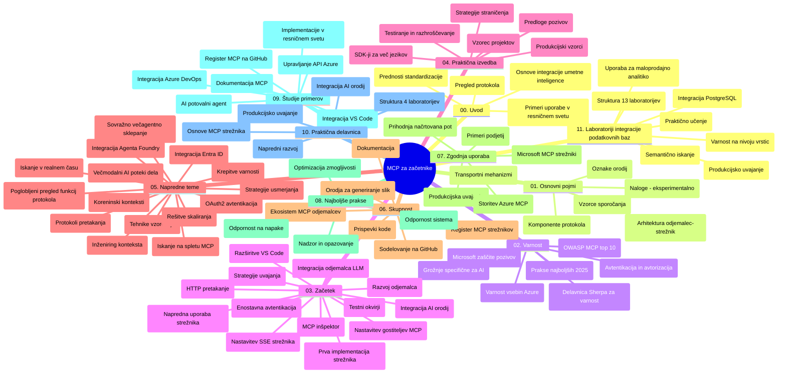

# Protokol konteksta modela (MCP) za začetnike - učni vodič

Ta učni vodič ponuja pregled strukture in vsebine repozitorija za učni načrt "Protokol konteksta modela (MCP) za začetnike". Uporabite ta vodič za učinkovito navigacijo po repozitoriju in kar najbolje izkoristite razpoložljive vire.

## Pregled repozitorija

Protokol konteksta modela (MCP) je standardiziran okvir za interakcije med AI modeli in odjemalskimi aplikacijami. Izvirno ga je ustvaril Anthropic, zdaj pa ga vzdržuje širša MCP skupnost preko uradne organizacije GitHub. Ta repozitorij ponuja celovit učni načrt z praktičnimi primeri kode v C#, Javi, JavaScriptu, Pythonu in TypeScriptu, namenjen razvijalcem AI, sistemskim arhitektom in programskim inženirjem.

## Vizualni zemljevid učnega načrta

## Struktura repozitorija

Repozitorij je organiziran v enajst glavnih razdelkov, od katerih se vsak osredotoča na različne vidike MCP:

1. **Uvod (00-Introduction/)**
   - Pregled protokola konteksta modela
   - Zakaj je standardizacija pomembna v AI procesih
   - Praktične uporabe in koristi

2. **Osnovni pojmi (01-CoreConcepts/)**
   - Odjemalec-strežnik arhitektura
   - Ključni sestavni deli protokola
   - Vzorce sporočanja v MCP

3. **Varnost (02-Security/)**
   - Varnostne grožnje v sistemih temelječih na MCP
   - Najboljše prakse za varno implementacijo
   - Strategije avtentikacije in avtorizacije
   - **Celovita varnostna dokumentacija**:
     - Najboljše varnostne prakse MCP 2025
     - Vodnik za implementacijo Azure Content Safety
     - Varnostni nadzor in tehnike MCP
     - Hiter referenčni vodič najboljših praks MCP
   - **Ključne varnostne teme**:
     - Napadi z vnosom pozivov in zastrupljanje orodij
     - Prevzem sej in težave z zmedenim posrednikom
     - Ranljivosti pri pretoku žetonov
     - Prekomerne pravice in nadzor dostopa
     - Varnost oskrbovalne verige za AI komponente
     - Integracija Microsoft Prompt Shields

4. **Začetek (03-GettingStarted/)**
   - Nastavitev in konfiguracija okolja
   - Ustvarjanje osnovnih MCP strežnikov in odjemalcev
   - Integracija z obstoječimi aplikacijami
   - Vključuje oddelke za:
     - Prvo implementacijo strežnika
     - Razvoj odjemalca
     - Integracijo LLM odjemalca
     - Integracijo Visual Studio Code
     - Strežnik s strežnimi dogodki (SSE)
     - Napredne uporabe strežnika
     - HTTP pretakanje
     - Integracijo AI Toolkit
     - Testne strategije
     - Smernice za uvajanje

5. **Praktična implementacija (04-PracticalImplementation/)**
   - Uporaba SDK-jev v različnih programskih jezikih
   - Tehnike za odpravljanje napak, testiranje in preverjanje
   - Oblikovanje ponovno uporabljivih predlog pozivov in potekov dela
   - Vzorčni projekti z izvedbenimi primeri

6. **Napredne teme (05-AdvancedTopics/)**
   - Tehnike inženiringa konteksta
   - Integracija Foundry agenta
   - Večmodalni AI poteki dela
   - Predstavitve avtentikacije OAuth2
   - Možnosti iskanja v realnem času
   - Pretakanje v realnem času
   - Implementacija korenskih kontekstov
   - Strategije usmerjanja
   - Tehnike vzorčenja
   - Pristopi skaliranja
   - Varnostni premisleki
   - Integracija varnosti Entra ID
   - Integracija spletnega iskanja
   - Protivrednostno večagentno sklepanje (vzorce debate)

7. **Skupnostni prispevki (06-CommunityContributions/)**
   - Kako prispevati k kodi in dokumentaciji
   - Sodelovanje preko GitHub-a
   - Izboljšave in povratne informacije, ki jih vodi skupnost
   - Uporaba različnih MCP odjemalcev (Claude Desktop, Cline, VSCode)
   - Delo s priljubljenimi MCP strežniki vključno z generiranjem slik

8. **Lekcije iz zgodnje uporabe (07-LessonsfromEarlyAdoption/)**
   - Uresničitve in uspešne zgodbe iz prakse
   - Gradnja in uvajanje rešitev temelječih na MCP
   - Trendovske usmeritve in prihodnja strategija
   - **Vodič po Microsoft MCP strežnikih**: Celovit vodič po 10 proizvodno pripravljenih Microsoft MCP strežnikih, vključno z:
     - Microsoft Learn Docs MCP strežnik
     - Azure MCP strežnik (več kot 15 specializiranih priključkov)
     - GitHub MCP strežnik
     - Azure DevOps MCP strežnik
     - MarkItDown MCP strežnik
     - SQL Server MCP strežnik
     - Playwright MCP strežnik
     - Dev Box MCP strežnik
     - Microsoft Foundry MCP strežnik
     - Microsoft 365 Agents Toolkit MCP strežnik

9. **Najboljše prakse (08-BestPractices/)**
   - Učinkovitost in optimizacija delovanja
   - Oblikovanje MCP sistemov, odporno na napake
   - Strategije testiranja in odpornosti

10. **Primeri uporabe (09-CaseStudy/)**
    - **Sedem celovitih primerov uporabe**, ki prikazujejo vsestranskost MCP v različnih scenarijih:
    - **Azure AI Travel Agents**: večagentna orkestracija z Azure OpenAI in AI Search
    - **Azure DevOps integracija**: avtomatizacija potekov dela z osvežitvami podatkov YouTube
    - **Pridobivanje dokumentacije v realnem času**: Python konzolni odjemalec s HTTP pretakanjem
    - **Interaktivni generator učnega načrta**: Chainlit spletna aplikacija s pogovornim AI
    - **Dokumentacija v urejevalniku**: integracija VS Code z GitHub Copilot poteki
    - **Azure API Management**: integracija poslovnih API-jev z ustvarjanjem MCP strežnika
    - **GitHub MCP Register**: razvoj ekosistema in platforma za agentno integracijo
    - Izvedbeni primeri, ki zajemajo poslovno integracijo, produktivnost razvijalcev in razvoj ekosistema

11. **Praktična delavnica (10-StreamliningAIWorkflowsBuildingAnMCPServerWithAIToolkit/)**
    - Celovita praktična delavnica, ki združuje MCP z AI Toolkit
    - Gradnja inteligentnih aplikacij, ki povezujejo AI modele s praktičnimi orodji
    - Praktični moduli, ki pokrivajo temelje, razvoj prilagojenega strežnika in strategije uvajanja v produkcijo
    - **Struktura delavnice**:
      - Delavnica 1: Osnove MCP strežnika
      - Delavnica 2: Napreden razvoj MCP strežnika
      - Delavnica 3: Integracija AI Toolkit
      - Delavnica 4: Uvajanje v produkcijo in skaliranje
    - Učni pristop na osnovi delavnic s korak-po-korak navodili

12. **Integracijske delavnice MCP strežnika z bazo podatkov (11-MCPServerHandsOnLabs/)**
    - **Celovit 13-delni učni načrt** za gradnjo proizvodno pripravljenih MCP strežnikov z integracijo PostgreSQL
    - **Praktična implementacija maloprodajne analitike** na primeru uporabe Zava Retail
    - **Poslovni vzorci** vključno z Row Level Security (RLS), semantičnim iskanjem in dostopom do podatkov več najemnikov
    - **Popolna struktura delavnic**:
      - **Delavnice 00-03: Temelji** - Uvod, arhitektura, varnost, nastavitev okolja
      - **Delavnice 04-06: Izgradnja MCP strežnika** - Oblikovanje baze, implementacija MCP strežnika, razvoj orodij
      - **Delavnice 07-09: Napredne funkcije** - Semantično iskanje, testiranje in odpravljanje napak, integracija VS Code
      - **Delavnice 10-12: Produkcija in najboljše prakse** - Uvajanje, spremljanje, optimizacija
    - **Uporabljene tehnologije**: FastMCP ogrodje, PostgreSQL, Azure OpenAI, Azure Container Apps, Application Insights
    - **Izidi učenja**: proizvodno pripravljeni MCP strežniki, vzorci integracije baz podatkov, analitika na osnovi AI, poslovna varnost

## Dodatni viri

Repozitorij vključuje podporne vire:

- **Mapa slik**: vsebuje diagrame in ilustracije, uporabljene skozi učni načrt
- **Prevodi**: večjezična podpora z avtomatiziranimi prevodi dokumentacije
- **Uradni MCP viri**:
  - [MCP Dokumentacija](https://modelcontextprotocol.io/)
  - [MCP specifikacija](https://spec.modelcontextprotocol.io/)
  - [MCP GitHub repozitorij](https://github.com/modelcontextprotocol)

## Kako uporabljati ta repozitorij

1. **Zaporedno učenje**: sledite poglavjem v vrstnem redu (od 00 do 11) za strukturirano izkušnjo učenja.
2. **Osredotočenost na jezik**: če vas zanima določen programski jezik, brskajte po vzorčnih mapah za implementacije v želenem jeziku.
3. **Praktična implementacija**: začnite z razdelkom "Getting Started" za nastavitev okolja in ustvarjanje prvega MCP strežnika in odjemalca.
4. **Napredno raziskovanje**: ko obvladate osnove, se poglobite v napredne teme za širjenje znanja.
5. **Sodelovanje v skupnosti**: pridružite se MCP skupnosti preko GitHub razprav in Discord kanalov za povezovanje s strokovnjaki in drugimi razvijalci.

## MCP odjemalci in orodja

Učni načrt pokriva različne MCP odjemalce in orodja:

1. **Uradni odjemalci**:
   - Visual Studio Code 
   - MCP v Visual Studio Code
   - Claude Desktop
   - Claude v VSCode
   - Claude API

2. **Skupnostni odjemalci**:
   - Cline (terminalski)
   - Cursor (urejevalnik kode)
   - ChatMCP
   - Windsurf

3. **Orodja za upravljanje MCP**:
   - MCP CLI
   - MCP Manager
   - MCP Linker
   - MCP Router

## Priljubljeni MCP strežniki

Repozitorij predstavlja različne MCP strežnike, vključno z:

1. **Uradni Microsoft MCP strežniki**:
   - Microsoft Learn Docs MCP strežnik
   - Azure MCP strežnik (več kot 15 specializiranih priključkov)
   - GitHub MCP strežnik
   - Azure DevOps MCP strežnik
   - MarkItDown MCP strežnik
   - SQL Server MCP strežnik
   - Playwright MCP strežnik
   - Dev Box MCP strežnik
   - Microsoft Foundry MCP strežnik
   - Microsoft 365 Agents Toolkit MCP strežnik

2. **Uradni referenčni strežniki**:
   - Datotečni sistem
   - Fetch
   - Memorija
   - Zaporedno razmišljanje

3. **Generiranje slik**:
   - Azure OpenAI DALL-E 3
   - Stable Diffusion WebUI
   - Replicate

4. **Razvojna orodja**:
   - Git MCP
   - Terminal Control
   - Code Assistant

5. **Specializirani strežniki**:
   - Salesforce
   - Microsoft Teams
   - Jira & Confluence

## Prispevanje

Ta repozitorij sprejema prispevke iz skupnosti. Oglejte si razdelek Skupnostnih prispevkov za navodila, kako učinkovito prispevati v MCP ekosistem.

----

*Ta učni vodič je bil nazadnje posodobljen 5. februarja 2026, v skladu z najnovejšo MCP specifikacijo 2025-11-25 in prikazuje stanje repozitorija do tega datuma. Vsebina repozitorija je lahko posodobljena po tem datumu.*

---

<!-- CO-OP TRANSLATOR DISCLAIMER START -->
**Omejitev odgovornosti**:
Ta dokument je bil preveden z uporabo AI prevajalske storitve [Co-op Translator](https://github.com/Azure/co-op-translator). Čeprav si prizadevamo za natančnost, vas prosimo, da upoštevate, da avtomatizirani prevodi lahko vsebujejo napake ali netočnosti. Izvirni dokument v njegovem izvirnem jeziku je treba obravnavati kot avtoritativni vir. Za kritične informacije je priporočljiv strokovni človeški prevod. Ne odgovarjamo za morebitna nesporazume ali napačne interpretacije, ki izhajajo iz uporabe tega prevoda.
<!-- CO-OP TRANSLATOR DISCLAIMER END -->