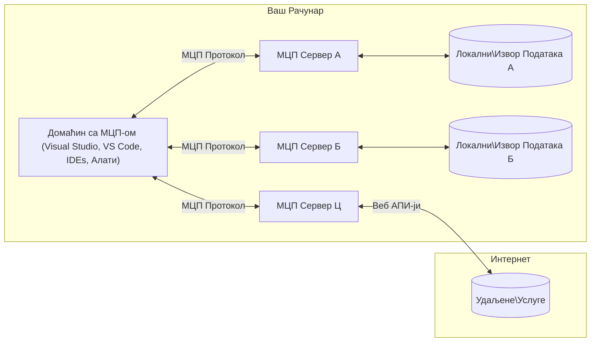

# MCP Основни концепти: Мастеринг Протокола контекста модела за интеграцију вештачке интелигенције

[](https://youtu.be/earDzWGtE84)

_(Кликните на слику изнад да бисте погледали видео о овој лекцији)_

[Model Context Protocol (MCP)](https://github.com/modelcontextprotocol) је моћан, стандардизовани оквир који оптимизује комуникацију између модела великог језика (LLM) и спољних алата, апликација и извора података. 
Овај водич ће вас провести кроз основне концепте MCP. Научићете о његовој клијент-сервер архитектури, суштинским компонентама, механизмима комуникације и најбољим праксама имплементације.

- **Јасна корисничка сагласност**: Сав приступ подацима и операције захтевају изричиту сагласност корисника пре извођења. Корисници морају јасно разумети који подаци ће бити приступљени и које радње ће бити извршене, са детаљном контролом над дозволама и овлашћењима.

- **Заштита приватности података**: Кориснички подаци се излажу само уз изричиту сагласност и морају бити заштићени робусном контролом приступа током целог животног циклуса интеракције. Имплементације морају спречити неовлашћени пренос података и одржавати строге границе приватности.

- **Безбедност извршења алата**: Сваки позив алата захтева изричиту корисничку сагласност са јасним разумевањем функционалности алата, параметара и потенцијалног утицаја. Робусне безбедносне границе морају спречити ненамерно, небезбедно или злонамерно извршење алата.

- **Безбедност транспортног слоја**: Сви комуникациони канали треба да користе одговарајуће механизме шифровања и аутентификације. Удаљене везе треба да користе безбедне транспортне протоколе и правилно управљање акредитивима.

#### Упутства за имплементацију:

- **Управљање дозволама**: Имплементирајте прецизне системе дозвола који омогућавају корисницима да контролишу који сервери, алати и ресурси су доступни
- **Аутентификација и овлашћење**: Користите безбедне методе аутентификације (OAuth, API кључеви) са правилним управљањем токенима и истеком  
- **Валидација улаза**: Валидација свих параметара и уноса података према дефинисаним шемама како би се спречили инјекциони напади
- **Аудит логовање**: Одржавајте свеобухватне записе свих операција за безбедносни мониторинг и усаглашеност

## Преглед

Ова лекција истражује фундаменталну архитектуру и компоненте које чине екосистем Протокола контекста модела (MCP). Научићете о клијент-сервер архитектури, кључним компонентама и механизмима комуникације који покрећу MCP интеракције.

## Кључни циљеви учења

До краја ове лекције, ви ћете:

- Разумети MCP клијент-сервер архитектуру.
- Идентификовати улоге и одговорности Домаћина, Клијената и Серверa.
- Анализирати језгрене карактеристике које чине MCP флексибилним интеграционим слојем.
- Научити како информације теку унутар MCP екосистема.
- Стекнете практичне увиде кроз примере кода у .NET, Java, Python и JavaScript.

## MCP архитектура: Дубљи поглед

MCP екосистем је изграђен на клијент-сервер модели. Ова модуларна структура омогућава AI апликацијама да ефикасно комуницирају са алатима, базама података, API-јима и контекстуалним ресурсима. Разложимо ову архитектуру на њене основне компоненте.

У својој основи, MCP следи клијент-сервер архитектуру где домаћин апликација може да се повеже са више сервера:


- **MCP Домаћини**: Програми као VSCode, Claude Desktop, IDE-ови или AI алати који желе приступ подацима преко MCP
- **MCP Клијенти**: Клијенти протокола који одржавају 1:1 везе са серверима
- **MCP Сервери**: Лагани програми који пружају специфичне могућности кроз стандардизовани Протокол контекста модела
- **Локални извори података**: Фајлови, базе података и сервиси на вашој рачунарској машини до којих MCP сервери могу безбедно да приступе
- **Удаљене услуге**: Спољни системи доступни преко интернета на које се MCP сервери могу повезати преко API-ја.

MCP Протокол је еволутивни стандард који користи верзионисање по датуму (формат ГГГГ-ММ-ДД). Тренутна верзија протокола је **2025-11-25**. Можете видети најновија ажурирања у [спецификацији протокола](https://modelcontextprotocol.io/specification/2025-11-25/)

### 1. Домаћини

У Протоколу контекста модела (MCP), **Домаћини** су AI апликације које служе као примарни интерфејс кроз који корисници комуницирају са протоколом. Домаћини координирају и управљају везама са више MCP сервера кроз креирање посебних MCP клијената за сваку сервер везу. Примери Домаћина укључују:

- **AI апликације**: Claude Desktop, Visual Studio Code, Claude Code
- **Развојна окружења**: IDE-ови и уређивачи кода са MCP интеграцијом  
- **Прилагођене апликације**: Специјално изграђени AI агенти и алати

**Домаћини** су апликације које координирају интеракције AI модела. Они:

- **Оркестрирају AI моделе**: Извршавају или интерагују са LLM-овима за генерисање одговора и координацију AI радних токова
- **Управљају клиентским везама**: Креирају и одржавају по једног MCP клијента за сваку MCP сервер везу
- **Контролишу кориснички интерфејс**: Рукују током разговора, корисничким интеракцијама и представљањем одговора  
- **Примјењују безбедност**: Контролишу дозволе, безбедносне ограничења и аутентификацију
- **Управљају корисничком сагласношћу**: Администрирају корисничко одобрење за дељење података и извршење алата


### 2. Клијенти

**Клијенти** су суштинске компоненете које одржавају посвећене везе један-на-један између Домаћина и MCP сервера. Сваки MCP клијент се инстанцира од стране Домаћина како би се повеzao са одређеним MCP сервером, осигуравајући организоване и безбедне комуникационе канале. Више клијената омогућава Домаћинима да истовремено повежу више сервера.

**Клијенти** су конекторске компоненте унутар домаћинске апликације. Они:

- **Комуникација протоколом**: Слање JSON-RPC 2.0 захтева серверима са упутствима и параметрима
- **Неговање могућности**: Усаглашавање подржаних функција и верзија протокола са серверима током иницијализације
- **Извршење алата**: Управљање захтевима за извршење алата од модела и процесирање одговора
- **Ажурирања у реалном времену**: Руковање обавештењима и ажурирањима од сервера
- **Обрада одговора**: Обрада и форматирање одговора сервера за приказ корисницима

### 3. Сервери

**Сервери** су програми који пружају контекст, алате и могућности MCP клијентима. Могу се извршавати локално (на истом рачунару као Домаћин) или удаљено (на спољним платформама), и одговорни су за обраду клијентских захтева и пружање структурираних одговора. Сервери излажу одређене функционалности кроз стандардизовани Протокол контекста модела.

**Сервери** су услуге које обезбеђују контекст и могућности. Они:

- **Регистрација функција**: Региструју и излажу доступне примитиве (ресурсе, упите, алате) клијентима
- **Обрада захтева**: Примају и извршавају позиве алата, захтеве за ресурсима и упите од клијената
- **Обезбеђење контекста**: Пружају контекстуалне информације и податке за побољшање одговора модела
- **Управљање стањем**: Одржавају стање сесије и рукују интеракцијама које чувају стање по потреби
- **Обавештења у реалном времену**: Слање обавештења о променама могућности и ажурирањима повезаним клијентима

Сервере може направити било ко за проширење могућности модела специјализованом функционалношћу, а подржавају како локални тако и удаљени сценарио распоређивања.

### 4. Серверски примитиви

Сервери у Протоколу контекста модела (MCP) пружају три основна **примитива** који дефинишу фундаменталне грађевинске блокове за богату интеракцију између клијената, домаћина и језичких модела. Ови примитиви одређују типове контекстуалних информација и акција доступних кроз протокол.

MCP сервери могу изложити било коју комбинацију следећа три основна примитива:

#### Ресурси

**Ресурси** су извори података који пружају контекстуалне информације AI апликацијама. Представљају статички или динамички садржај који може побољшати разумевање и доношење одлука моделa:

- **Контекстуални подаци**: Структуриране информације и контекст за конзумирање AI моделом
- **Базе знања**: Репозиторијуми докумената, чланци, приручници и научни радови
- **Локални извори података**: Фајлови, базе података и локалне системске информације  
- **Спољни подаци**: Одговори API-ја, веб услуге и подаци удаљених система
- **Динамички садржај**: Податци у реалном времену који се ажурирају према спољним условима

Ресурси су идентификовани помоћу URI-а и подржавају откривање кроз методе `resources/list` и приступ кроз `resources/read`:

```text
file://documents/project-spec.md
database://production/users/schema
api://weather/current
```

#### Упити

**Упити** су поновно употребљиви шаблони који помажу да се структуирају интеракције са језичким моделима. Обезбеђују стандардизоване обрасце интеракције и шаблонизоване радне токове:

- **Интеракције базиране на шаблонима**: Предструктуриране поруке и почетне фразе за разговор
- **Шаблони радних токова**: Стандардизовани низови за уобичајене задатке и интеракције
- **Примери са мало узорака**: Шаблони засновани на примерима за упутства моделу
- **Системски упити**: Основни упити који дефинишу понашање и контекст модела
- **Динамички шаблони**: Параметризовани упити који се прилагођавају специфичним контекстима

Упити подржавају замену варијабли и могу се открити путем `prompts/list` и приступити са `prompts/get`:

```markdown
Generate a {{task_type}} for {{product}} targeting {{audience}} with the following requirements: {{requirements}}
```

#### Алати

**Алати** су извршне функције које AI модели могу позивати да би извршили одређене радње. Они представљају "глаголе" у MCP екосистему, омогућавајући моделима интеракцију са спољним системима:

- **Извршне функције**: Дискретне операције које модели могу позивати са специфичним параметрима
- **Интеграција спољних система**: Позиви API-ја, упити базе података, рад са фајловима, рачунања
- **Јединствени идентитет**: Сваки алат има јединствено име, опис и шему параметара
- **Структурирани улаз/излаз**: Алат прихвата валидиране параметре и враћа структуриране, типизиране одговоре
- **Могућности акције**: Омогућава моделима да извршавају реалне радње и преузимају живе податке

Алат је дефинисан JSON схемом за валидацију параметара и открива се кроз `tools/list` и извршава се преко `tools/call`. Алат може укључити и **иконе** као додатне метаподатке за бољи приказ у корисничком интерфејсу.

**Анотације алата**: Алат подржава анотације понашања (нпр. `readOnlyHint`, `destructiveHint`) које описују да ли је алат само за читање или деструктиван, помажући клијентима да доносе информисане одлуке о извршењу алата.

Пример дефиниције алата:

```typescript
server.tool(
  "search_products", 
  {
    query: z.string().describe("Search query for products"),
    category: z.string().optional().describe("Product category filter"),
    max_results: z.number().default(10).describe("Maximum results to return")
  }, 
  async (params) => {
    // Изврши претрагу и врати структуриране резултате
    return await productService.search(params);
  }
);
```

## Клијентски примитиви

У Протоколу контекста модела (MCP), **клијенти** могу изложити примитиве које омогућавају серверима да захтевају додатне могућности од домаћинске апликације. Ови примитиви са стране клијента омогућавају богатије, интерактивније серверске имплементације које могу приступити могућностима AI модела и корисничким интеракцијама.

### Узорковање

**Узорковање** омогућава серверима да захтевају комплетирања језичког модела из клијентове AI апликације. Овај примитив омогућава серверима приступ LLM могућностима без уграђивања сопствених зависности модела:

- **Независан приступ моделу**: Сервери могу захтевати комплетирања без укључивања LLM SDK-ова или управљања приступом моделу
- **AI иницијатива сервера**: Омогућава серверима аутономно генерисање садржаја помоћу клијентовог AI модела
- **Рекурзивне LLM интеракције**: Подржава комплексне сценарије где сервери захтевају AI помоћ за обраду
- **Генерисање динамичког садржаја**: Омогућава серверима креирање контекстуалних одговора користећи домаћинов модел
- **Подршка позива алата**: Сервери могу укључити параметре `tools` и `toolChoice` као подршку да модел клијента позива алате током узорковања

Узорковање се покреће методом `sampling/complete`, где сервери шаљу захтеве за комплетирање клијентима.

### Корени

**Корени** пружају стандардизован начин да клијенти изложe системске границе фајл система серверима, помажући серверима да разумеју којим директоријумима и фајловима могу приступити:

- **Границе фајл система**: Дефинишу опсег у којем сервери могу да раде унутар фајл система
- **Контрола приступа**: Помажу серверима да разумеју које директоријуме и фајлове имају овлашћење да приступе
- **Динамичка ажурирања**: Клијенти могу обавестити сервере када се листа корена промени
- **Идентификација заснована на URI-јима**: Корени користе `file://` URI-је за идентификацију доступних директоријума и фајлова

Корени се откривају путем методе `roots/list`, а клијенти шаљу обавештења `notifications/roots/list_changed` када корени буду изменjeni.

### Испитивање

**Испитивање** омогућава серверима да захтевају додатне информације или потврду од корисника преко клијентовог интерфејса:

- **Захтеви уноса корисника**: Сервери могу тражити додатне информације када су потребне за извршење алата
- **Дијалози за потврду**: Захтевају корисничко одобрење за осетљиве или утицајне операције
- **Интерактивни радни токови**: Омогућавају серверима да креирају корак-по-корак интеракције са корисником
- **Прикупљање динамичких параметара**: Прикупљају недостајуће или опционе параметре током извршења алата

Захтеви за испитивање се праве методом `elicitation/request` да би се прикупили уноси корисника путем клијентовог интерфејса.

**Људска интервенција у URL режиму**: Сервери такође могу захтевати корисничке интеракције базиране на URL-у, омогућавајући серверима да усмере кориснике на спољне веб странице ради аутентификације, потврде или уноса података.

### Логовање

**Логовање** омогућава серверима да шаљу структуриране поруке лога клијентима за дебаговање, надзор и оперативну видљивост:

- **Подршка за дебаговање**: Омогућава серверима да пруже детаљне записе извршења ради решавања проблема
- **Оперативни мониторинг**: Слање статуса и метрика перформанси клијентима
- **Извештавање о грешкама**: Пружање детаљног контекста грешки и дијагностичких информација
- **Аудит трагови**: Креирање свеобухватних записа сервера о операцијама и одлукама

Поруке логова се шаљу клијентима ради пружања транспарентности о операцијама сервера и олакшавају дебаговање.

## Проток информација у MCP

Протокол контекста модела (MCP) дефинише структуриран ток информација између домаћина, клијената, сервера и модела. Разумевање овог тока помаже да се разјасни како се захтеви корисника обрађују и како се спољни алати и подаци интегришу у одговоре модела.
- **Домаћин успоставља везу**  
  Апликација домаћина (као што је IDE или интерфејс за ћаскање) успоставља везу са MCP сервером, обично преко STDIO, WebSocket-а или другог подржаног транспорта.

- **Преговарање о могућностима**  
  Клијент (уграђен у домаћина) и сервер размењују информације о својим подржаним функцијама, алатима, ресурсима и верзијама протокола. Ово обезбеђује да обе стране разумеју које могућности су доступне током сесије.

- **Кориснички захтев**  
  Корисник интерагује са домаћином (нпр. уноси упит или команду). Домаћин прикупља овај унос и прослеђује га клијенту на обраду.

- **Коришћење ресурса или алата**  
  - Клијент може затражити додатни контекст или ресурсе од сервера (као што су фајлови, уписи у бази података или чланци знања) како би обогатио разумевање модела.  
  - Ако модел процени да је потребан алат (нпр. за преузимање података, обраду прорачуна или позив API-ја), клијент шаље захтев за позив алата серверу, наводећи име алата и параметре.

- **Извршење од стране сервера**  
  Сервер прими захтев за ресурс или алат, изврши потребне операције (као што је покретање функције, упит базе података или преузимање фајла) и врати резултате клијенту у структурираном формату.

- **Генерисање одговора**  
  Клијент интегрише серверове одговоре (податке ресурса, резултате алата итд.) у текућу интеракцију са моделом. Модел користи ове информације за генерисање свеобухватног и контекстуално релевантног одговора.

- **Приказ резултата**  
  Домаћин прими коначни излаз од клијента и представи га кориснику, често укључујући како текст који је модел генерисао, тако и резултате извршења алата или претраге ресурса.

Овај ток омогућава MCP-у да подржи напредне, интерактивне и контекстуално свесне AI апликације повезујући моделе без прекида са екстерним алатима и изворима података.

## Архитектура протокола и слојеви

MCP се састоји из два јасно раздвојена архитектонска слоја која заједно обезбеђују комплетан комуникациони оквир:

### Слой података

**Слой података** имплементира основни MCP протокол користећи **JSON-RPC 2.0** као основ. Овај слој дефинише структуру порука, семантику и шаблоне интеракције:

#### Кључне компоненте:

- **JSON-RPC 2.0 протокол**: Сва комуникација користи стандардизовани формат JSON-RPC 2.0 за позиве метода, одговоре и нотификације  
- **Управљање животним циклусом**: Обухвата иницијализацију везе, преговарање о могућностима и завршетак сесије између клијената и сервера  
- **Примитиви сервера**: Омогућавају серверима да пружају основну функционалност кроз алате, ресурсе и упите  
- **Примитиви клијента**: Омогућавају серверима да захтевају узорковање из LLM, траже кориснички унос и шаљу лог поруке  
- **Нотификације у реалном времену**: Подржава асинхроне нотификације за динамичка ажурирања без чекања

#### Кључне карактеристике:

- **Преговарање о верзији протокола**: Користи верзионисање засновано на датуму (ГГГГ-ММ-ДД) ради обезбеђења компатибилности  
- **Откривање могућности**: Клијенти и сервери међусобно размењују информације о подржаним функцијама током иницијализације  
- **Сесије са стањем**: Одржава стање везе кроз више интеракција за континуитет контекста

### Слой транспорта

**Слой транспорта** управља комуникационим каналима, обликовањем порука и аутентификацијом између учесника MCP-а:

#### Подржани механизми транспорта:

1. **STDIO транспорт**:  
   - Користи стандардне улазно/излазне токове за директну комуникацију процеса  
   - Оптималан за локалне процесе на истој машини без мрежног оптерећења  
   - Често се користи за локалне имплементације MCP сервера

2. **HTTP транспорт са стримовањем**:  
   - Користи HTTP POST за поруке клијента ка серверу  
   - Опционо Server-Sent Events (SSE) за стримовање од сервера ка клијенту  
   - Омогућава комуникацију са удаљеним серверима преко мреже  
   - Подржава стандардну HTTP аутентификацију (беарер токени, API кључеви, прилагођени заглавља)  
   - MCP препоручује OAuth за безбедну аутентификацију засновану на токенима

#### Апстракција транспорта:

Слой транспорта апстрахује детаље комуникације од слоя података, омогућавајући исти JSON-RPC 2.0 формат порука преко свих транспортних механизама. Ова апстракција омогућава апликацијама да без проблема пребацују између локалних и удаљених сервера.

### Безбедносне разматрања

Имплементације MCP-а морају да се придржавају неколико кључних безбедносних принципа како би се обезбедиле сигурне, поуздане и безбедне интеракције у свим операцијама протокола:

- **Корисникова сагласност и контрола**: Корисници морају дати изричиту сагласност пре него што се приступи било којим подацима или изврше операције. Требало би да имају јасну контролу над тим које податке деле и које акције су овлашћене, уз интуитивне корисничке интерфејсе за преглед и одобрење активности.

- **Приватност података**: Кориснички подаци треба да буду изложени само уз изричиту сагласност и морају бити заштићени одговарајућим контролама приступа. MCP имплементације морају спречити неовлашћени пренос података и обезбедити одржавање приватности током свих интеракција.

- **Безбедност алата**: Пре позива било ког алата потребна је изричита корисничка сагласност. Корисници треба да имају јасно разумевање функционалности сваког алата, а морају се примењивати чврсте безбедносне границе како би се спречило нежељено или несигурно извршење алата.

Пратећи ове безбедносне принципе, MCP осигурава поверење корисника, заштиту приватности и безбедност током свих интеракција протокола, истовремено омогућавајући моћне AI интеграције.

## Примери кода: Кључне компоненте

Испод су примери кода у неколико популарних програмских језика који илуструју како имплементирати кључне MCP серверске компоненте и алате.

### Пример .NET: Креирање једноставног MCP сервера са алатима

Ево практичног .NET примера који показује како имплементирати једноставан MCP сервер са прилагођеним алатима. Овај пример демонстрира како дефинисати и регистровати алате, обрадити захтеве и повезати сервер користећи Model Context Protocol.

```csharp
using System;
using System.Threading.Tasks;
using ModelContextProtocol.Server;
using ModelContextProtocol.Server.Transport;
using ModelContextProtocol.Server.Tools;

public class WeatherServer
{
    public static async Task Main(string[] args)
    {
        // Create an MCP server
        var server = new McpServer(
            name: "Weather MCP Server",
            version: "1.0.0"
        );
        
        // Register our custom weather tool
        server.AddTool<string, WeatherData>("weatherTool", 
            description: "Gets current weather for a location",
            execute: async (location) => {
                // Call weather API (simplified)
                var weatherData = await GetWeatherDataAsync(location);
                return weatherData;
            });
        
        // Connect the server using stdio transport
        var transport = new StdioServerTransport();
        await server.ConnectAsync(transport);
        
        Console.WriteLine("Weather MCP Server started");
        
        // Keep the server running until process is terminated
        await Task.Delay(-1);
    }
    
    private static async Task<WeatherData> GetWeatherDataAsync(string location)
    {
        // This would normally call a weather API
        // Simplified for demonstration
        await Task.Delay(100); // Simulate API call
        return new WeatherData { 
            Temperature = 72.5,
            Conditions = "Sunny",
            Location = location
        };
    }
}

public class WeatherData
{
    public double Temperature { get; set; }
    public string Conditions { get; set; }
    public string Location { get; set; }
}
```

### Пример Java: MCP серверске компоненте

Овај пример демонстрира исти MCP сервер и регистрацију алата као у горе наведеном .NET примеру, али имплементиран у Јави.

```java
import io.modelcontextprotocol.server.McpServer;
import io.modelcontextprotocol.server.McpToolDefinition;
import io.modelcontextprotocol.server.transport.StdioServerTransport;
import io.modelcontextprotocol.server.tool.ToolExecutionContext;
import io.modelcontextprotocol.server.tool.ToolResponse;

public class WeatherMcpServer {
    public static void main(String[] args) throws Exception {
        // Креирај MCP сервер
        McpServer server = McpServer.builder()
            .name("Weather MCP Server")
            .version("1.0.0")
            .build();
            
        // Региструј алат за време
        server.registerTool(McpToolDefinition.builder("weatherTool")
            .description("Gets current weather for a location")
            .parameter("location", String.class)
            .execute((ToolExecutionContext ctx) -> {
                String location = ctx.getParameter("location", String.class);
                
                // Преузми податке о времену (поједностављено)
                WeatherData data = getWeatherData(location);
                
                // Врати форматирани одговор
                return ToolResponse.content(
                    String.format("Temperature: %.1f°F, Conditions: %s, Location: %s", 
                    data.getTemperature(), 
                    data.getConditions(), 
                    data.getLocation())
                );
            })
            .build());
        
        // Повежи сервер користећи stdio транспорт
        try (StdioServerTransport transport = new StdioServerTransport()) {
            server.connect(transport);
            System.out.println("Weather MCP Server started");
            // Одржавај сервер у раду док се процес не заврши
            Thread.currentThread().join();
        }
    }
    
    private static WeatherData getWeatherData(String location) {
        // Имплементација би позивала API за време
        // Пojednostavljeno за примере
        return new WeatherData(72.5, "Sunny", location);
    }
}

class WeatherData {
    private double temperature;
    private String conditions;
    private String location;
    
    public WeatherData(double temperature, String conditions, String location) {
        this.temperature = temperature;
        this.conditions = conditions;
        this.location = location;
    }
    
    public double getTemperature() {
        return temperature;
    }
    
    public String getConditions() {
        return conditions;
    }
    
    public String getLocation() {
        return location;
    }
}
```

### Пример Python: Креирање MCP сервера

Овај пример користи fastmcp, па молимо да га прво инсталирате:

```python
pip install fastmcp
```
Пример кода:

```python
#!/usr/bin/env python3
import asyncio
from fastmcp import FastMCP
from fastmcp.transports.stdio import serve_stdio

# Креирај FastMCP сервер
mcp = FastMCP(
    name="Weather MCP Server",
    version="1.0.0"
)

@mcp.tool()
def get_weather(location: str) -> dict:
    """Gets current weather for a location."""
    return {
        "temperature": 72.5,
        "conditions": "Sunny",
        "location": location
    }

# Алтернативни приступ коришћењем класе
class WeatherTools:
    @mcp.tool()
    def forecast(self, location: str, days: int = 1) -> dict:
        """Gets weather forecast for a location for the specified number of days."""
        return {
            "location": location,
            "forecast": [
                {"day": i+1, "temperature": 70 + i, "conditions": "Partly Cloudy"}
                for i in range(days)
            ]
        }

# Регистровано алатке класе
weather_tools = WeatherTools()

# Покрени сервер
if __name__ == "__main__":
    asyncio.run(serve_stdio(mcp))
```

### Пример JavaScript: Креирање MCP сервера

Овај пример показује креирање MCP сервера у JavaScript-у и како регистровати два алата везана за временску прогнозу.

```javascript
// Коришћење званичног Model Context Protocol SDK-а
import { McpServer } from "@modelcontextprotocol/sdk/server/mcp.js";
import { StdioServerTransport } from "@modelcontextprotocol/sdk/server/stdio.js";
import { z } from "zod"; // За проверу параметара

// Креирај MCP сервер
const server = new McpServer({
  name: "Weather MCP Server",
  version: "1.0.0"
});

// Дефиниши алат за временску прогнозу
server.tool(
  "weatherTool",
  {
    location: z.string().describe("The location to get weather for")
  },
  async ({ location }) => {
    // Ово би обично позивало временски API
    // Поједностављено за демонстрацију
    const weatherData = await getWeatherData(location);
    
    return {
      content: [
        { 
          type: "text", 
          text: `Temperature: ${weatherData.temperature}°F, Conditions: ${weatherData.conditions}, Location: ${weatherData.location}` 
        }
      ]
    };
  }
);

// Дефиниши алат за прогнозу
server.tool(
  "forecastTool",
  {
    location: z.string(),
    days: z.number().default(3).describe("Number of days for forecast")
  },
  async ({ location, days }) => {
    // Ово би обично позивало временски API
    // Поједностављено за демонстрацију
    const forecast = await getForecastData(location, days);
    
    return {
      content: [
        { 
          type: "text", 
          text: `${days}-day forecast for ${location}: ${JSON.stringify(forecast)}` 
        }
      ]
    };
  }
);

// Помоћне функције
async function getWeatherData(location) {
  // Симулирај позив API-ја
  return {
    temperature: 72.5,
    conditions: "Sunny",
    location: location
  };
}

async function getForecastData(location, days) {
  // Симулирај позив API-ја
  return Array.from({ length: days }, (_, i) => ({
    day: i + 1,
    temperature: 70 + Math.floor(Math.random() * 10),
    conditions: i % 2 === 0 ? "Sunny" : "Partly Cloudy"
  }));
}

// Повежи сервер користећи stdio транспорт
const transport = new StdioServerTransport();
server.connect(transport).catch(console.error);

console.log("Weather MCP Server started");
```

Овај JavaScript пример демонстрира како направити MCP сервер који региструје алате за временске информације и повезује се помоћу stdio транспорта за обраду долазних клијентских захтева.

## Безбедност и овлашћење

MCP укључује неколико уграђених концепата и механизама за управљање безбедношћу и овлашћењима током протокола:

1. **Контрола дозвола за алате**:  
  Клијенти могу одредити које алате модел може користити током сесије. Ово осигурава да су доступни само експлицитно овлашћени алати, смањујући ризик од нежељених или несигурних операција. Дозволе се могу динамички конфигурисати у складу са корисничким преференцама, организационим политикама или контекстом интеракције.

2. **Аутентикација**:  
  Сервери могу захтевати аутентикацију пре него што се омогући приступ алатима, ресурсима или осетљивим операцијама. Ово може укључивати API кључеве, OAuth токене или друге шеме аутентикације. Правилна аутентикација осигурава да само поуздани клијенти и корисници могу да позову могућности са серверске стране.

3. **Валидација**:  
  Валидација параметара се примењује за све позиве алата. Сваки алат дефинише очекиване типове, формате и ограничења за своје параметре, а сервер валидацијује долазне захтеве у складу с тим. Ово спречава да неважећи или злонамерни уноси стигну до имплементације алата и помаже у одржавању интегритета операција.

4. **Ограничење учесталости (Rate Limiting)**:  
  Да би се спречила злоупотреба и обезбедила фер употреба сервера, MCP сервери могу имплементирати ограничења брзине за позиве алата и приступ ресурсима. Ограничења могу бити по кориснику, по сесији или глобално и помажу у заштити од DoS напада или прекомерне потрошње ресурса.

Комбинујући ове механизме, MCP пружа безбедну основу за интеграцију језичких модела са екстерним алатима и изворима података, при чему корисницима и развојним инжењерима даје фине контроле приступа и употребе.

## Поруке протокола и ток комуникације

MCP комуникација користи структуиране **JSON-RPC 2.0** поруке за олакшавање јасних и поузданих интеракција између домаћина, клијената и сервера. Протокол дефинише специфичне обрасце порука за различите типове операција:

### Основни типови порука:

#### **Иницијализационе поруке**
- **Захтев `initialize`**: Успоставља везу и преговара верзију протокола и могућности  
- **Одговор `initialize`**: Потврђује подржане функције и информације о серверу  
- **`notifications/initialized`**: Сигнализира да је иницијализација завршена и да је сесија спремна

#### **Поруке за откривање**
- **Захтев `tools/list`**: Открива доступне алате са сервера  
- **Захтев `resources/list`**: Листинг доступних ресурса (извора података)  
- **Захтев `prompts/list`**: Преузима доступне шаблоне упита

#### **Поруке за извршење**  
- **Захтев `tools/call`**: Извршава одређени алат са наведеним параметрима  
- **Захтев `resources/read`**: Преузима садржај са одређеног ресурса  
- **Захтев `prompts/get`**: Преузима шаблон упита са опционим параметрима

#### **Поруке на страни клијента**
- **Захтев `sampling/complete`**: Сервер тражи завршетак из LLM од клијента  
- **`elicitation/request`**: Сервер тражи кориснички унос преко клијентског интерфејса  
- **Лог поруке**: Сервер шаље структуиране лог поруке клијенту

#### **Нотификације**
- **`notifications/tools/list_changed`**: Сервер обавештава клијента о променама у алатима  
- **`notifications/resources/list_changed`**: Сервер обавештава клијента о променама у ресурсима  
- **`notifications/prompts/list_changed`**: Сервер обавештава клијента о променама у упитима

### Структура поруке:

Све MCP поруке прате JSON-RPC 2.0 формат са:  
- **Захтевне поруке**: укључују `id`, `method` и опционе `params`  
- **Одговорне поруке**: укључују `id` и или `result` или `error`  
- **Нотификационе поруке**: укључују `method` и опционе `params` (нема `id` и не очекује се одговор)

Ова структура комуникације обезбеђује поуздану, пратљиву и прошириву интеракцију која подржава напредне сценарије као што су ажурирања у реалном времену, ланац алата и робусно руковање грешкама.

### Задаци (експериментални)

**Задаци** су експериментална функција која пружа трајне омотаче за извршење, омогућавајући одложено преузимање резултата и праћење статуса MCP захтева:

- **Дуготрајне операције**: праћење скупих рачунања, аутоматизације радних токова и пакет обраде  
- **Одложени резултати**: упит за статус задатка и преузимање резултата када се операције заврше  
- **Праћење статуса**: монитори напредак задатка кроз дефинисане фазе животног циклуса  
- **Вишестепене операције**: подршка сложеним радним токовима који се простиру на више интеракција

Задаци увијају стандардне MCP захтеве како би омогућили асинхроне шеме извршења за операције које се не могу одмах завршити.

## Кључне појединости

- **Архитектура**: MCP користи клијент-сервер архитектуру у којој домаћини управљају везама више клијената са серверима  
- **Учесници**: Екосистем укључује домаћине (AI апликације), клијенте (протоколнe конекторe) и сервере (пружаоце могућности)  
- **Механизми транспорта**: комуникација подржава STDIO (локални) и HTTP са стримовањем уз опциони SSE (удаљени)  
- **Основне примитиве**: сервери излажу алате (извршне функције), ресурсе (изворе података) и упите (шаблоне)  
- **Примитиви клијента**: сервери могу тражити узорковање (LLM завршетке са подршком позива алата), еликитацију (кориснички унос укључујући URL мод), корене (границе фајл-система) и логовање од клијената  
- **Експерименталне функције**: задаци пружају трајне омотаче извршења за дуготрајне операције  
- **Основа протокола**: заснован на JSON-RPC 2.0 са везирањем на датум (тренутно: 2025-11-25)  
- **Функционалности у реалном времену**: подржава нотификације за динамичка ажурирања и синхронизацију у реалном времену  
- **Безбедност на првом месту**: експлицитна корисничка сагласност, заштита приватности података и безбедан транспорт су основни захтеви

## Вежба

Дизајнирајте једноставан MCP алат који би био користан у вашем домену. Дефинишите:  
1. Како би се алат звао  
2. Које параметре би прихватао  
3. Који резултат би враћао  
4. Како би модел могао користити овај алат за решавање корисничких проблема

---

## Шта следи

Следеће: [Поглавље 2: Безбедност](../02-Security/README.md)

---

<!-- CO-OP TRANSLATOR DISCLAIMER START -->
**Одрицање одговорности**:  
Овај документ је преведен помоћу AI услуге за превођење [Co-op Translator](https://github.com/Azure/co-op-translator). Иако се трудимо да превод буде тачан, имајте у виду да аутоматски преводи могу садржати грешке или нетачности. Изворни документ на његовом оригиналном језику треба сматрати ауторитетом. За критичне информације препоручује се професионални превод од стране човека. Ниси одговорни за било каква неспоразума или погрешна тумачења настала употребом овог превода.
<!-- CO-OP TRANSLATOR DISCLAIMER END -->