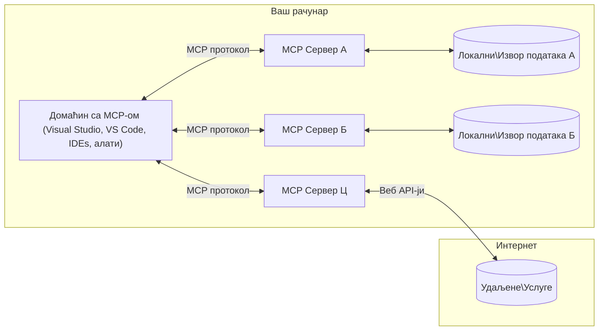

# MCP Core Concepts: Savladavanje Protokola Konteksta Modela za AI Integraciju

[](https://youtu.be/earDzWGtE84)

_(Kliknite na sliku iznad da pogledate video ove lekcije)_

[Model Context Protocol (MCP)](https://github.com/modelcontextprotocol) je moćan, standardizovani okvir koji optimizuje komunikaciju između Velikih Jezičkih Modela (LLM) i eksternih alata, aplikacija i izvora podataka. 
Ovaj vodič će vas provesti kroz osnovne pojmove MCP. Naučićete o njegovoj klijentsko-server arhitekturi, ključnim komponentama, mehanici komunikacije i najboljim praksama implementacije.

- **Izričit pristanak korisnika**: Sav pristup podacima i operacije zahtevaju izričit pristanak korisnika pre izvršenja. Korisnici moraju jasno razumeti kojih podataka će biti pristupljeno i koje će se akcije izvesti, sa detaljnom kontrolom nad dozvolama i ovlašćenjima.

- **Zaštita privatnosti podataka**: Korisnički podaci su dostupni samo uz izričit pristanak i moraju biti zaštićeni jakim kontrolama pristupa tokom celog životnog ciklusa interakcije. Implementacije moraju sprečiti neovlašćeni prenos podataka i održavati stroge granice privatnosti.

- **Bezbednost izvršavanja alata**: Svako pokretanje alata zahteva izričit pristanak korisnika sa jasnim razumevanjem funkcionalnosti alata, parametara i potencijalnog uticaja. Robusne bezbednosne granice moraju sprečiti neplanirano, nesigurno ili maliciozno izvršavanje alata.

- **Bezbednost sloja transporta**: Svi komunikacioni kanali treba da koriste odgovarajuće mehanizme enkripcije i autentifikacije. Udaljene veze treba da primenjuju sigurne transportne protokole i adekvatno upravljanje akreditivima.

#### Smernice za implementaciju:

- **Upravljanje dozvolama**: Implementirajte sisteme finih dozvola koji omogućavaju korisnicima da kontrolišu kojima serverima, alatima i resursima može da se pristupi
- **Autentifikacija i autorizacija**: Koristite sigurne metode autentifikacije (OAuth, API ključevi) uz pravilno upravljanje tokenima i njihovo isticanje  
- **Validacija unosa**: Validirajte sve parametre i unose podataka prema definisanim šemama da sprečite injekcione napade
- **Evidencija aktivnosti (audit logging)**: Održavajte sveobuhvatne zapise svih operacija radi bezbednosnog nadzora i usklađenosti

## Pregled

Ova lekcija istražuje osnovnu arhitekturu i komponente koje čine Model Context Protocol (MCP) ekosistem. Naučićete o klijentsko-server arhitekturi, ključnim komponentama i komunikacionim mehanizmima koji pokreću MCP interakcije.

## Ključni ciljevi učenja

Na kraju ove lekcije, moći ćete da:

- Razumete MCP klijentsko-server arhitekturu.
- Identifikujete uloge i odgovornosti Hostova, Klijenata i Servera.
- Analizirate osnovne karakteristike koje čine MCP fleksibilnim slojem integracije.
- Naučite kako teče informacija unutar MCP ekosistema.
- Steknete praktične uvide kroz primere koda u .NET, Java, Python, i JavaScript.

## MCP arhitektura: Dublji pogled

MCP ekosistem je izgrađen na modelu klijent-server. Ova modularna struktura omogućava AI aplikacijama efikasnu interakciju sa alatima, bazama podataka, API-jima i kontekstualnim resursima. Hajde da razložimo ovu arhitekturu na osnovne komponente.

U srcu, MCP prati klijentsko-server arhitekturu gde host aplikacija može povezati više servera:


- **MCP Hostovi**: Programi kao što su VSCode, Claude Desktop, IDE-ovi ili AI alati koji žele da pristupe podacima putem MCP
- **MCP Klijenti**: Protokol klijenti koji održavaju 1:1 veze sa serverima
- **MCP Serveri**: Laki programi koji izlažu specifične mogućnosti kroz standardizovani Model Context Protocol
- **Lokalni izvori podataka**: Fajlovi, baze podataka i servisi na vašem računaru kojima MCP serveri mogu sigurno pristupiti
- **Udaljene usluge**: Eksterni sistemi dostupni preko interneta kojima MCP serveri mogu pristupati preko API-ja.

MCP protokol je standard u razvoju koji koristi verzionisanje zasnovano na datumu (format GGGG-MM-DD). Trenutna verzija protokola je **2025-11-25**. Možete pogledati najnovija ažuriranja na [specifikaciji protokola](https://modelcontextprotocol.io/specification/2025-11-25/)

### 1. Hostovi

U Model Context Protocol-u (MCP), **Hostovi** su AI aplikacije koje služe kao primarni interfejs preko kojeg korisnici komuniciraju sa protokolom. Hostovi koordiniraju i upravljaju vezama sa više MCP servera kreiranjem posvećenih MCP klijenata za svaku server vezu. Primeri Hostova uključuju:

- **AI aplikacije**: Claude Desktop, Visual Studio Code, Claude Code
- **Razvojna okruženja**: IDE-ovi i uređivači koda sa MCP integracijom  
- **Prilagođene aplikacije**: Namenjeni AI agenti i alati

**Hostovi** su aplikacije koje koordiniraju interakcije AI modela. Oni:

- **Orkestriraju AI modele**: Izvršavaju ili komuniciraju sa LLM-ovima da generišu odgovore i koordiniraju AI tokove rada
- **Upravljaju klijentskim vezama**: Kreiraju i održavaju po jednog MCP klijenta po vezi sa MCP serverom
- **Kontrolišu korisnički interfejs**: Rukovode tokom razgovora, korisničkim interakcijama i prikazom odgovora  
- **Sprovode bezbednost**: Kontrolišu dozvole, bezbednosna ograničenja i autentifikaciju
- **Rukovode korisničkim pristankom**: Upravljaju korisničkim odobravanjem za deljenje podataka i izvršavanje alata


### 2. Klijenti

**Klijenti** su ključne komponente koje održavaju posvećene jedan-na-jedan veze između Hostova i MCP servera. Svaki MCP klijent se instancira od strane Host-a za povezivanje sa specifičnim MCP serverom, obezbeđujući organizovane i sigurne komunikacione kanale. Više klijenata omogućava Host-ovima da se istovremeno povežu sa više servera.

**Klijenti** su konektorski delovi unutar host aplikacije. Oni:

- **Komunikacija protokolom**: Šalju JSON-RPC 2.0 zahteve serverima sa promptovima i instrukcijama
- **Pregovaranje mogućnosti**: Dogovaraju podržane funkcije i verzije protokola sa serverima tokom inicijalizacije
- **Izvršavanje alata**: Upravljaju zahtevima za izvršavanje alata od modela i obrađuju odgovore
- **Ažuriranja u realnom vremenu**: Rukovode notifikacijama i ažuriranjima od servera
- **Obrada odgovora**: Procesuiraju i formatiraju odgovore servera za prikaz korisnicima

### 3. Serveri

**Serveri** su programi koji obezbeđuju kontekst, alate i funkcionalnosti MCP klijentima. Mogu raditi lokalno (na istoj mašini kao i Host) ili udaljeno (na eksternim platformama), i odgovorni su za rukovanje zahtevima klijenata i pružanje strukturiranih odgovora. Serveri izlažu specifične funkcionalnosti kroz standardizovani Model Context Protocol.

**Serveri** su servisi koji pružaju kontekst i mogućnosti. Oni:

- **Registracija mogućnosti**: Registruju i izlažu dostupne primitivne elemente (resurse, promptove, alate) klijentima
- **Obrada zahteva**: Primaju i izvršavaju pozive alata, zahteve za resursima i promptove od klijenata
- **Obezbeđivanje konteksta**: Pružaju kontekstualne informacije i podatke za poboljšanje odgovora modela
- **Upravljanje stanjem**: Održavaju stanje sesije i rukovode sesijskim interakcijama kada je potrebno
- **Notifikacije u realnom vremenu**: Šalju obaveštenja o promenama i ažuriranjima mogućnosti povezanim klijentima

Servere može razviti bilo ko da proširi mogućnosti modela specijalizovanom funkcionalnošću, a podržavaju i lokalnu i udaljenu primenu.

### 4. Primitivi servera

Serveri u Model Context Protocol-u (MCP) pružaju tri osnovna **primitiva** koja definišu fundamentalne gradivne blokove za bogatu interakciju između klijenata, hostova i jezičkih modela. Ovi primitivni elementi definišu tipove kontekstualnih informacija i akcija koje su dostupne kroz protokol.

MCP serveri mogu izlagati bilo koju kombinaciju sledeća tri osnovna primitiva:

#### Resursi 

**Resursi** su izvori podataka koji pružaju kontekstualne informacije AI aplikacijama. Oni predstavljaju statički ili dinamički sadržaj koji može unaprediti razumevanje modela i donošenje odluka:

- **Kontekstualni podaci**: Strukturirane informacije i kontekst za korišćenje od strane AI modela
- **Baze znanja**: Repozitorijumi dokumenata, članci, priručnici i naučni radovi
- **Lokalni izvori podataka**: Fajlovi, baze podataka i lokalne sistemske informacije  
- **Eksterni podaci**: API odgovori, veb servisi i udaljeni podaci sistema
- **Dinamički sadržaj**: Podaci u realnom vremenu koji se ažuriraju na osnovu spoljašnjih uslova

Resursi se identifikuju URI-jevima i podržavaju pronalaženje preko `resources/list` i pristup preko `resources/read` metoda:

```text
file://documents/project-spec.md
database://production/users/schema
api://weather/current
```

#### Promptovi

**Promptovi** su ponovo upotrebljivi šabloni koji pomažu u strukturiranju interakcija sa jezičkim modelima. Oni pružaju standardizovane obrasce interakcije i šablonizovane tokove rada:

- **Interakcije bazirane na šablonima**: Prestruktuirani poruke i započinjanja razgovora
- **Šabloni tokova rada**: Standardizovane sekvence za česte zadatke i interakcije
- **Primeri sa malim brojem uzoraka**: Šabloni zasnovani na primerima za instrukcije modelu
- **Sistemski promptovi**: Osnovni promptovi koji definišu ponašanje i kontekst modela
- **Dinamički šabloni**: Parametrizovani promptovi koji se prilagođavaju specifičnom kontekstu

Promptovi podržavaju zamenu varijabli i mogu se pronalaziti putem `prompts/list` i preuzimati metodom `prompts/get`:

```markdown
Generate a {{task_type}} for {{product}} targeting {{audience}} with the following requirements: {{requirements}}
```

#### Alati

**Alati** su izvršni funkcionalni pozivi koje AI modeli mogu pokretati da bi obavili određene radnje. Oni predstavljaju "glagole" MCP ekosistema, omogućavajući modelima da komuniciraju sa eksternim sistemima:

- **Izvršne funkcije**: Diskretne operacije koje modeli mogu pozivati sa specifičnim parametrima
- **Integracija eksternih sistema**: API pozivi, upiti baza podataka, operacije nad fajlovima, proračuni
- **Jedinstveni identitet**: Svaki alat ima jedinstveno ime, opis i šemu parametara
- **Strukturiran ulaz i izlaz**: Alati prihvataju validirane parametre i vraćaju strukturirane, tipizirane odgovore
- **Akcijske mogućnosti**: Omogućavaju modelima da izvršavaju radnje u stvarnom svetu i pribavljaju aktuelne podatke

Alati su definisani JSON šemom za validaciju parametara i pronalaze se preko `tools/list`, a izvršavaju preko `tools/call`. Alati mogu takođe uključivati **ikone** kao dodatne metapodatke za bolju prezentaciju u korisničkom interfejsu.

**Anotacije alata**: Alati podržavaju ponašajne anotacije (npr. `readOnlyHint`, `destructiveHint`) koje opisuju da li je alat samo-za-čitanje ili destruktivan, pomažući klijentima da donesu informisane odluke o izvršavanju alata.

Primer definicije alata:

```typescript
server.tool(
  "search_products", 
  {
    query: z.string().describe("Search query for products"),
    category: z.string().optional().describe("Product category filter"),
    max_results: z.number().default(10).describe("Maximum results to return")
  }, 
  async (params) => {
    // Изврши претрагу и врати структуиране резултате
    return await productService.search(params);
  }
);
```

## Klijentski primitivni elementi

U Model Context Protocol-u (MCP), **klijenti** mogu izlagati primitivne elemente koji omogućavaju serverima da zahtevaju dodatne mogućnosti od host aplikacije. Ovi primitivni elementi na strani klijenta dozvoljavaju bogatije, interaktivnije implementacije servera koje imaju pristup sposobnostima AI modela i korisničkim interakcijama.

### Uzorkovanje (Sampling)

**Uzorkovanje** omogućava serverima da zahtevaju završetke jezičkog modela iz AI aplikacije klijenta. Ovaj primitiv omogućava serverima da pristupe LLM mogućnostima bez ugradnje sopstvenih zavisnosti modela:

- **Model-nezavisan pristup**: Serveri mogu zahtevati završetke bez uključivanja SDK-ova LLM-a ili upravljanja pristupom modelu
- **AI iniciran od strane servera**: Omogućava serverima da autonomno generišu sadržaj korišćenjem modela AI klijenta
- **Rekurzivne LLM interakcije**: Podržava složene scenarije gde serveri traže AI pomoć za obradu
- **Dinamička generacija sadržaja**: Omogućava serverima da kreiraju kontekstualne odgovore koristeći model hosta
- **Podrška za pozivanje alata**: Serveri mogu uključiti parametre `tools` i `toolChoice` da bi omogućili klijentov model da poziva alate tokom uzorkovanja

Uzorkovanje se inicira preko metode `sampling/complete`, gde serveri šalju zahteve za završetke klijentima.

### Koreni (Roots)

**Koreni** pružaju standardizovani način za klijente da izlože granice fajl sistema serverima, pomažući serverima da razumeju koje direktorijume i fajlove mogu da pristupe:

- **Granice fajl sistema**: Definišu granice unutar kojih serveri mogu da rade u fajl sistemu
- **Kontrola pristupa**: Pomažu serverima da razumeju kojima direktorijumima i fajlovima imaju dozvolu za pristup
- **Dinamička ažuriranja**: Klijenti mogu obaveštavati servere kada se lista korena promeni
- **Identifikacija zasnovana na URI**: Koreni koriste `file://` URI-je za identifikaciju dostupnih direktorijuma i fajlova

Koreni se pronalaze metodom `roots/list`, dok klijenti šalju `notifications/roots/list_changed` kada dođe do promene korena.

### Pribavljanje informacija (Elicitation)  

**Pribavljanje informacija** omogućava serverima da zahtevaju dodatne informacije ili potvrdu od korisnika putem klijentovog interfejsa:

- **Zahtevi za korisničkim unosom**: Serveri mogu tražiti dodatne informacije kada je to potrebno za izvršavanje alata
- **Dijalozi za potvrdu**: Traže korisnički pristanak za osetljive ili važne operacije
- **Interaktivni tokovi rada**: Omogućavaju serverima da kreiraju korak-po-korak korisničke interakcije
- **Dinamičko prikupljanje parametara**: Prikupljanje nedostajućih ili opcionih parametara tokom izvršavanja alata

Zahtevi pribavljanja se vrše korišćenjem metode `elicitation/request` za prikupljanje korisničkog unosa kroz interfejs klijenta.

**Zahtevi u režimu URL-a**: Serveri takođe mogu zahtevati korisničke interakcije bazirane na URL-u, omogućavajući serverima da usmere korisnike na spoljne veb stranice radi autentifikacije, potvrde ili unosa podataka.

### Logovanje

**Logovanje** omogućava serverima da šalju strukturisane log poruke klijentima radi otklanjanja grešaka, nadzora i vidljivosti operacija:

- **Podrška za otklanjanje grešaka**: Omogućava serverima da pruže detaljne zapise izvršenja radi rešavanja problema
- **Operativni nadzor**: Šalju ažuriranja statusa i performansi klijentima
- **Prijavljivanje grešaka**: Pružaju detaljan kontekst grešaka i dijagnostičke informacije
- **Evidencija aktivnosti**: Kreiraju sveobuhvatne zapise operacija i odluka servera

Log poruke se šalju klijentima da bi se obezbedila transparentnost u radu servera i olakšalo otklanjanje grešaka.

## Tok informacija u MCP

Model Context Protocol (MCP) definiše strukturirani tok informacija između hostova, klijenata, servera i modela. Razumevanje ovog toka pomaže da se razjasni kako se obrađuju korisnički zahtevi i kako se eksterni alati i podaci integrišu u odgovore modela.
- **Домаћин покреће везу**  
  Апликација домаћина (као што је IDE или интерфејс за ћаскање) успоставља везу са MCP сервером, обично преко STDIO, WebSocket-а или неког другог подржаног транспорта.

- **Негосијација могућности**  
  Клијент (уграђен у домаћина) и сервер размењују информације о својим подржаним функцијама, алатима, ресурсима и верзијама протокола. Ово осигурава да обе стране разумеју које су могућности доступне током сесије.

- **Кориснички захтев**  
  Корисник интерагује са домаћином (нпр. уноси упит или команду). Домаћин прикупља овај унос и прослеђује га клијенту на обраду.

- **Коришћење ресурса или алата**  
  - Клијент може затражити додатни контекст или ресурсе од сервера (попут датотека, уноса базе података или чланака из базе знања) како би обогатио разумевање модела.  
  - Ако модел утврди да је потребан алат (нпр. за преузимање података, израчунавање или позивање API-ја), клијент шаље серверу захтев за позив алата, наводећи име алата и параметре.

- **Извршавање на серверу**  
  Сервер прими захтев за ресурс или алат, изврши неопходне операције (као што је покретање функције, упит у базу података или преузимање датотеке), и враћа резултате клијенту у структурираном формату.

- **Генерисање одговора**  
  Клијент интегрише одговоре сервера (подаци о ресурсима, излази алата итд.) у текућу интеракцију са моделом. Модел користи ове информације да генерише свеобухватан и контекстуално релевантан одговор.

- **Презентација резултата**  
  Домаћин прими коначни излаз од клијента и приказује га кориснику, често укључујући и текст који је генерисао модел као и резултате позива алата или претрага ресурса.

Овај ток омогућава MCP да подржи напредне, интерактивне и контекстуално свесне AI апликације повезујући моделе са спољним алатима и изворима података.

## Архитектура протокола и слојеви

MCP се састоји из два јасно раздвојена архитектонска слоја који заједно пружају комплетан оквир за комуникацију:

### Слој података

**Слој података** имплементира основни MCP протокол користећи **JSON-RPC 2.0** као основу. Тај слој дефинише структуру порука, семантику и обрасце интеракције:

#### Основне компоненте:

- **JSON-RPC 2.0 протокол**: Сав саобраћај користи стандардизовани JSON-RPC 2.0 формат за позиве метода, одговоре и обавештења  
- **Управљање животним циклусом**: Обрађује иницијализацију везе, преговорање могућности и завршетак сесије између клијената и сервера  
- **Примитиви сервера**: Омогућавају серверима да пруже основну функционалност преко алата, ресурса и упита  
- **Примитиви клијента**: Омогућавају серверима да захтевају узорковање из LLM-ова, добијање корисничког уноса и слање логова  
- **Обавештења у реалном времену**: Подржава асинхрона обавештења за динамичка ажурирања без потребе за периодичним упитима

#### Кључне карактеристике:

- **Преговарање верзије протокола**: Користи верзије базиране на датуму (ГГГГ-ММ-ДД) ради осигурања компатибилности  
- **Откривање могућности**: Клијенти и сервери размењују податке о подржаним функцијама током иницијализације  
- **Сесије са стањем**: Одржава стање везе кроз више интеракција за континуитет контекста

### Слој транспорта

**Слој транспорта** управља комуникационим каналима, форматирањем порука и аутентификацијом између учесника MCP:

#### Подржани механизми транспорта:

1. **STDIO транспорт**:  
   - Користи стандардне улазне/излазне токове за директну комуникацију процеса  
   - Оптималан за локалне процесе на истом рачунару без мрежног оптерећења  
   - Често коришћен за локалне имплементације MCP сервера

2. **HTTP транспорт са стримингом**:  
   - Користи HTTP POST за поруке од клијента ка серверу  
   - Опционо Server-Sent Events (SSE) за стримовање од сервера ка клијенту  
   - Омогућава удаљену комуникацију преко мрежа  
   - Подржава стандардну HTTP аутентификацију (bearer токени, API кључеви, прилагођени заглавља)  
   - MCP препоручује OAuth за сигурну аутентификацију на бази токена

#### Абстракција транспорта:

Слој транспорта апстрахује детаље комуникације од слоја података, омогућавајући исти формат порука JSON-RPC 2.0 преко свих транспортних механизама. Ова абстракција омогућава апликацијама прелазак између локалних и удаљених сервера без проблема.

### Безбедносна разматрања

Имплементације MCP морају се придржавати неколико критичних безбедносних принципа како би осигурале безбедне, поуздане и сигурне интеракције у свим протоколским операцијама:

- **Сагласност и контрола корисника**: Корисници морају дати изричиту сагласност пре приступа подацима или извођења операција. Треба да имају јасну контролу о томе који се подаци деле и које радње су овлашћене, подржане интуитивним корисничким интерфејсима за преглед и одобрење активности.

- **Приватност података**: Кориснички подаци се смеју откривати само уз изричиту сагласност и морају бити заштићени одговарајућом контролом приступа. MCP имплементације морају заштитити од неовлашћеног преноса података и обезбедити одржавање приватности током свих интеракција.

- **Безбедност алата**: Пре позива било ког алата потребна је изричита корисничка сагласност. Корисници морају јасно разумети функције сваког алата, а морају се спровести јаке безбедносне границе како би се спречило нежељено или небезбедно извршавање алата.

Пратећи ове принципе безбедности, MCP обезбеђује поверење корисника, приватност и безбедност током свих интеракција протокола, истовремено омогућавајући моћне AI интеграције.

## Примери кода: Кључне компоненте

Испод су примери кода у неколико популарних програмских језика који илуструју како имплементирати кључне компоненте MCP сервера и алата.

### .NET пример: Креирање једноставног MCP сервера са алатима

Ево практичног .NET примера који показује како имплементирати једноставан MCP сервер са прилагођеним алатима. Овај пример приказује како дефинисати и регистровати алате, обрађивати захтеве и повезати сервер користећи Model Context Protocol.

```csharp
using System;
using System.Threading.Tasks;
using ModelContextProtocol.Server;
using ModelContextProtocol.Server.Transport;
using ModelContextProtocol.Server.Tools;

public class WeatherServer
{
    public static async Task Main(string[] args)
    {
        // Create an MCP server
        var server = new McpServer(
            name: "Weather MCP Server",
            version: "1.0.0"
        );
        
        // Register our custom weather tool
        server.AddTool<string, WeatherData>("weatherTool", 
            description: "Gets current weather for a location",
            execute: async (location) => {
                // Call weather API (simplified)
                var weatherData = await GetWeatherDataAsync(location);
                return weatherData;
            });
        
        // Connect the server using stdio transport
        var transport = new StdioServerTransport();
        await server.ConnectAsync(transport);
        
        Console.WriteLine("Weather MCP Server started");
        
        // Keep the server running until process is terminated
        await Task.Delay(-1);
    }
    
    private static async Task<WeatherData> GetWeatherDataAsync(string location)
    {
        // This would normally call a weather API
        // Simplified for demonstration
        await Task.Delay(100); // Simulate API call
        return new WeatherData { 
            Temperature = 72.5,
            Conditions = "Sunny",
            Location = location
        };
    }
}

public class WeatherData
{
    public double Temperature { get; set; }
    public string Conditions { get; set; }
    public string Location { get; set; }
}
```

### Java пример: Компоненте MCP сервера

Овај пример демонстрира исти MCP сервер и регистрацију алата као горе наведени .NET пример, али имплементиран у Јави.

```java
import io.modelcontextprotocol.server.McpServer;
import io.modelcontextprotocol.server.McpToolDefinition;
import io.modelcontextprotocol.server.transport.StdioServerTransport;
import io.modelcontextprotocol.server.tool.ToolExecutionContext;
import io.modelcontextprotocol.server.tool.ToolResponse;

public class WeatherMcpServer {
    public static void main(String[] args) throws Exception {
        // Креирај MCP сервер
        McpServer server = McpServer.builder()
            .name("Weather MCP Server")
            .version("1.0.0")
            .build();
            
        // Региструј алатку за време
        server.registerTool(McpToolDefinition.builder("weatherTool")
            .description("Gets current weather for a location")
            .parameter("location", String.class)
            .execute((ToolExecutionContext ctx) -> {
                String location = ctx.getParameter("location", String.class);
                
                // Добиј податке о времену (поједностављено)
                WeatherData data = getWeatherData(location);
                
                // Врати форматиран одговор
                return ToolResponse.content(
                    String.format("Temperature: %.1f°F, Conditions: %s, Location: %s", 
                    data.getTemperature(), 
                    data.getConditions(), 
                    data.getLocation())
                );
            })
            .build());
        
        // Повежи сервер користећи стандардни улаз/излаз пренос
        try (StdioServerTransport transport = new StdioServerTransport()) {
            server.connect(transport);
            System.out.println("Weather MCP Server started");
            // Остави сервер активним док процес не буде прекинут
            Thread.currentThread().join();
        }
    }
    
    private static WeatherData getWeatherData(String location) {
        // Имплементација би позвала временски API
        // Пojедностављено за потребе примера
        return new WeatherData(72.5, "Sunny", location);
    }
}

class WeatherData {
    private double temperature;
    private String conditions;
    private String location;
    
    public WeatherData(double temperature, String conditions, String location) {
        this.temperature = temperature;
        this.conditions = conditions;
        this.location = location;
    }
    
    public double getTemperature() {
        return temperature;
    }
    
    public String getConditions() {
        return conditions;
    }
    
    public String getLocation() {
        return location;
    }
}
```

### Python пример: Прављење MCP сервера

Овај пример користи fastmcp, зато је потребно да га прво инсталирате:

```python
pip install fastmcp
```
Пример кода:

```python
#!/usr/bin/env python3
import asyncio
from fastmcp import FastMCP
from fastmcp.transports.stdio import serve_stdio

# Креирај FastMCP сервер
mcp = FastMCP(
    name="Weather MCP Server",
    version="1.0.0"
)

@mcp.tool()
def get_weather(location: str) -> dict:
    """Gets current weather for a location."""
    return {
        "temperature": 72.5,
        "conditions": "Sunny",
        "location": location
    }

# Алтернативни приступ коришћењем класе
class WeatherTools:
    @mcp.tool()
    def forecast(self, location: str, days: int = 1) -> dict:
        """Gets weather forecast for a location for the specified number of days."""
        return {
            "location": location,
            "forecast": [
                {"day": i+1, "temperature": 70 + i, "conditions": "Partly Cloudy"}
                for i in range(days)
            ]
        }

# Региструј алате класе
weather_tools = WeatherTools()

# Покрени сервер
if __name__ == "__main__":
    asyncio.run(serve_stdio(mcp))
```

### JavaScript пример: Креирање MCP сервера

Овај пример показује креирање MCP сервера у JavaScript-у и како регистровати два алата везана за прогнозу времена.

```javascript
// Користећи званични Model Context Protocol SDK
import { McpServer } from "@modelcontextprotocol/sdk/server/mcp.js";
import { StdioServerTransport } from "@modelcontextprotocol/sdk/server/stdio.js";
import { z } from "zod"; // За валидацију параметара

// Креирај MCP сервер
const server = new McpServer({
  name: "Weather MCP Server",
  version: "1.0.0"
});

// Дефиниши алатку за временску прогнозу
server.tool(
  "weatherTool",
  {
    location: z.string().describe("The location to get weather for")
  },
  async ({ location }) => {
    // Ово би обично позивало API за временску прогнозу
    // Поједностављено за демонстрацију
    const weatherData = await getWeatherData(location);
    
    return {
      content: [
        { 
          type: "text", 
          text: `Temperature: ${weatherData.temperature}°F, Conditions: ${weatherData.conditions}, Location: ${weatherData.location}` 
        }
      ]
    };
  }
);

// Дефиниши алатку за прогнозу
server.tool(
  "forecastTool",
  {
    location: z.string(),
    days: z.number().default(3).describe("Number of days for forecast")
  },
  async ({ location, days }) => {
    // Ово би обично позивало API за временску прогнозу
    // Поједностављено за демонстрацију
    const forecast = await getForecastData(location, days);
    
    return {
      content: [
        { 
          type: "text", 
          text: `${days}-day forecast for ${location}: ${JSON.stringify(forecast)}` 
        }
      ]
    };
  }
);

// Помоћне функције
async function getWeatherData(location) {
  // Симулирај позив API-ја
  return {
    temperature: 72.5,
    conditions: "Sunny",
    location: location
  };
}

async function getForecastData(location, days) {
  // Симулирај позив API-ја
  return Array.from({ length: days }, (_, i) => ({
    day: i + 1,
    temperature: 70 + Math.floor(Math.random() * 10),
    conditions: i % 2 === 0 ? "Sunny" : "Partly Cloudy"
  }));
}

// Повежи сервер користећи stdio транспорт
const transport = new StdioServerTransport();
server.connect(transport).catch(console.error);

console.log("Weather MCP Server started");
```

Овај JavaScript пример демонстрира како направити MCP сервер користећи Model Context Protocol SDK. Показује како регистровати два алата под именима `weatherTool` и `forecastTool` и учинити их доступним MCP клијентима преко `StdioServerTransport`.

## Безбедност и овлашћење

MCP укључује неколико уграђених концепата и механизама за управљање безбедношћу и овлашћењем у протоколу:

1. **Контрола дозвола за алате**:  
  Клијенти могу одредити које алате модел сме да користи током сесије. Ово осигурава да су приступачни само јасно овлашћени алати, смањујући ризик од нежељених или небезбедних операција. Дозволе се могу динамички конфигурисати по корисничким преференцама, организационим политикама или контексту интеракције.

2. **Аутентификација**:  
  Сервери могу захтевати аутентификацију пре одобравања приступа алатима, ресурсима или осетљивим операцијама. То може укључивати API кључеве, OAuth токене или друге шеме аутентификације. Правилна аутентификација осигурава да само поуздани клијенти и корисници могу да покрећу серверске функције.

3. **Валидација**:  
  Валидација параметара је обавезна за све позиве алата. Сваки алат дефинише очекиване типове, формате и ограничења за своје параметре, а сервер верификује долазне захтеве према тим правилима. Ово спречава неисправне или злонамерне уносе који би могли утицати на имплементацију алата и помаже у одржавању интегритета операција.

4. **Ограничење учесталости**:  
  Да би се спречила злоупотреба и обезбедила фер употреба ресурса сервера, MCP сервери могу спроводити ограничења учесталости за позиве алата и приступ ресурсима. Ограничења могу бити по кориснику, по сесији или глобално, и помажу у заштити од DoS напада или претеране потрошње ресурса.

Комбиновањем ових механизама, MCP пружа сигурну основу за интеграцију језичких модела са спољним алатима и изворима података, уз прецизну контролу приступа и коришћења за кориснике и програмере.

## Поруке протокола и ток комуникације

MCP комуникација користи структуриран формат порука **JSON-RPC 2.0** за јасне и поуздане интеракције између домаћина, клијената и сервера. Протокол дефинише специфичне обрасце порука за различите типове операција:

### Основни типови порука:

#### **Поруке иницијализације**
- **`initialize` захтев**: Успоставља везу и преговара верзију протокола и могућности  
- **`initialize` одговор**: Потврђује подржане функције и информације о серверу  
- **`notifications/initialized`**: Сигнализира да је иницијализација завршена и сесија спремна

#### **Поруке откривања**
- **`tools/list` захтев**: Открива доступне алате на серверу  
- **`resources/list` захтев**: Листира расположиве ресурсе (изворе података)  
- **`prompts/list` захтев**: Преузима доступне шаблоне упита

#### **Поруке извршавања**  
- **`tools/call` захтев**: Извршава одређени алат са прослеђеним параметрима  
- **`resources/read` захтев**: Преузима садржај одређеног ресурса  
- **`prompts/get` захтев**: Преузима шаблон упита са опционим параметрима

#### **Поруке са клијентске стране**
- **`sampling/complete` захтев**: Сервер тражи LLM завршетак од клијента  
- **`elicitation/request`**: Сервер тражи кориснички унос преко клијент интерфејса  
- **Поруке логовања**: Сервер шаље структуиране лог поруке клијенту

#### **Обавештења (Notifications)**
- **`notifications/tools/list_changed`**: Сервер обавештава клијента о изменама листе алата  
- **`notifications/resources/list_changed`**: Сервер обавештава клијента о изменама списка ресурса  
- **`notifications/prompts/list_changed`**: Сервер обавештава клијента о изменама у шаблонима упита

### Структура поруке:

Све MCP поруке прате формат JSON-RPC 2.0 са:  
- **Захтевним порукама**: укључују `id`, `method` и опционе `params`  
- **Одговорним порукама**: укључују `id` и или `result` или `error`  
- **Обавештењима**: укључују `method` и опционе `params` (нема `id` нити се очекује одговор)

Ова структура омогућава поуздану, прегледну и прошириву интеракцију која подржава напредне сценарије као што су ажурирања у реалном времену, ланац алата и робусно руковање грешкама.

### Задаци (експериментално)

**Задаци** су експериментална функција која пружа трајне омотаче за извршавање, омогућавајући одложено преузимање резултата и праћење статуса MCP захтева:

- **Дуготрајне операције**: Прати скупе прорачуне, аутоматизацију радних токова и пакетно обрађивање  
- **Одложени резултати**: Омогућава упите о статусу задатка и преузимање резултата након завршетка операција  
- **Праћење статуса**: Контролише напредак задатка кроз дефинисане стадијуме животног циклуса  
- **Вишестепене операције**: Подржава сложене радне токове који обухватају више интеракција

Задаци обавијају стандардне MCP захтеве како би омогућили асинхроно извршавање операција које се не могу одмах завршити.

## Кључне поуке

- **Архитектура**: MCP користи клијент-сервер архитектуру где домаћини управљају везама више клијената ка серверима  
- **Учесници**: Екосистем укључује домаћине (AI апликације), клијенте (протоколске конекторе) и сервере (преговарче могућности)  
- **Механизми транспорта**: Комуникација подржава STDIO (локално) и HTTP са стримингом и опционим SSE (удалено)  
- **Основне примитиве**: Сервери излажу алате (извршне функције), ресурсе (изворе података) и упите (шаблоне)  
- **Клијентске примитиве**: Сервери могу тражити узорковање (LLM завршетке са подршком за позив алата), добијање уноса (укључујући режим са URL-ом), коренове (границе система фајлова) и логовање од клијената  
- **Експерименталне функције**: Задаци пружају трајне омотаче извршавања за дуготрајне операције  
- **Основа протокола**: Изграђен на JSON-RPC 2.0 са верзионисањем на основу датума (тренутна: 2025-11-25)  
- **Капацитети у реалном времену**: Подржава обавештења за динамичка ажурирања и синхронизацију у реалном времену  
- **Безбедност на првом месту**: Изричита сагласност корисника, заштита приватности података и сигуран транспорт су основни захтеви

## Вежба

Осмислите једноставан MCP алат који би био користан у вашем домену. Опишите:  
1. Како би се алат звао  
2. Које параметре би прихватао  
3. Који би излаз враћао  
4. Како би модел могао користити овај алат да реши проблеме корисника


---

## Следеће

Следеће: [Поглавље 2: Безбедност](../02-Security/README.md)

---

<!-- CO-OP TRANSLATOR DISCLAIMER START -->
**Одрицање од одговорности**:
Овај документ је преведен коришћењем AI преводилачке услуге [Co-op Translator](https://github.com/Azure/co-op-translator). Иако тежимо тачности, молимо имајте у виду да аутоматизовани преводи могу садржати грешке или нетачности. Оригинални документ на његовом изворном језику треба сматрати ауторитетним извором. За критичне информације препоручује се професионални људски превод. Нисмо одговорни за било каква неспоразума или погрешна тумачења која произилазе из коришћења овог превода.
<!-- CO-OP TRANSLATOR DISCLAIMER END -->