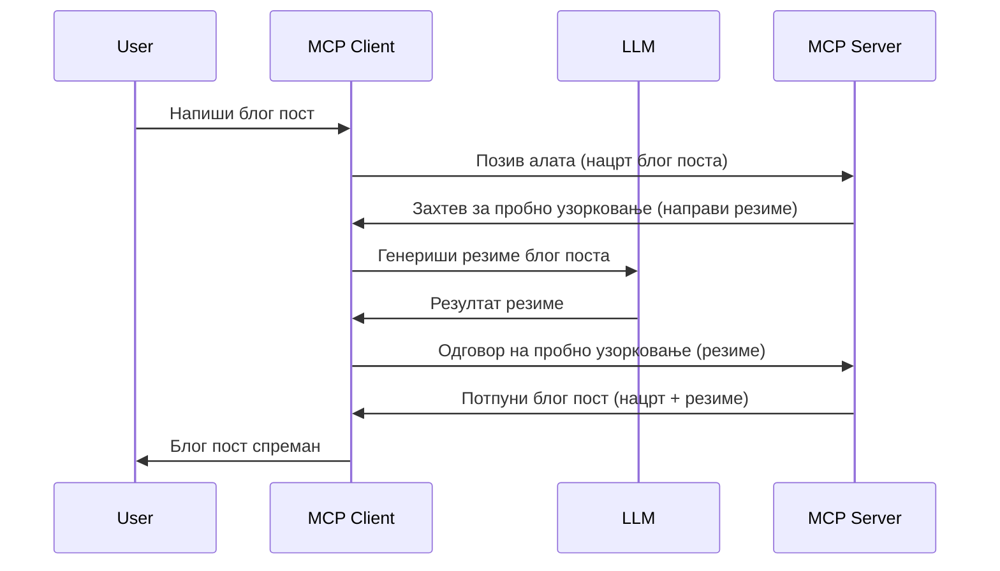

# Узимање узорака - делегирање функција клијенту

Понекад је потребно да MCP клијент и MCP сервер сарађују да би постигли заједнички циљ. Може се десити да сервер затражи помоћ LLM-а који се налази на клијенту. За ову ситуацију треба користити узимање узорака.

Хајде да истражимо неке случајеве употребе и како изградити решење које укључује узимање узорака.

## Преглед

У овој лекцији фокусираћемо се на објашњење када и где користити узимање узорака и како га подесити.

## Циљеви учења

У овом поглављу ћемо:

- Објаснити шта је узимање узорака и када га користити.
- Приказати како подесити узимање узорака у MCP-у.
- Пружити примере узимања узорака у пракси.

## Шта је узимање узорака и зашто га користити?

Узимање узорака је напредна функција која ради на следећи начин:



### Захтев за узорковање

У реду, сада када имамо преглед веродостојног сценарија, хајде да причамо о захтеву за узорковање који сервер шаље клијенту. Ево како такав захтев може изгледати у JSON-RPC формату:

```json
{
  "jsonrpc": "2.0",
  "id": 1,
  "method": "sampling/createMessage",
  "params": {
    "messages": [
      {
        "role": "user",
        "content": {
          "type": "text",
          "text": "Create a blog post summary of the following blog post: <BLOG POST>"
        }
      }
    ],
    "modelPreferences": {
      "hints": [
        {
          "name": "claude-3-sonnet"
        }
      ],
      "intelligencePriority": 0.8,
      "speedPriority": 0.5
    },
    "systemPrompt": "You are a helpful assistant.",
    "maxTokens": 100
  }
}
```

Постоји неколико ствари које вреди истаћи:

- Prompt, под content -> text, је наш упит који даје упутство LLM-у да сумира садржај блога.

- **modelPreferences**. Овај одељак је баш то, препорука, савет о томе какву конфигурацију користити са LLM-ом. Корисник може изабрати да ли ће прихватити те препоруке или их променити. У овом случају препоруке су о моделу који треба користити, приоритету брзине и интелигенције.
- **systemPrompt**, ово је ваш уобичајени системски упит који даје вашој LLM личности и садржи упутства.
- **maxTokens**, још једно својство које указује колико токена се препоручује користити за овај задатак.

### Одговор на узорковање

Овај одговор је оно што MCP клијент на крају пошаље назад MCP серверу и представља резултат позива LLM-у од стране клијента, чекања на одговор и затим конструкције ове поруке. Ево како може изгледати у JSON-RPC формату:

```json
{
  "jsonrpc": "2.0",
  "id": 1,
  "result": {
    "role": "assistant",
    "content": {
      "type": "text",
      "text": "Here's your abstract <ABSTRACT>"
    },
    "model": "gpt-5",
    "stopReason": "endTurn"
  }
}
```

Примећујемо да је одговор сажетак блога баш као што смо тражили. Такође се примећује да коришћени `model` није онај који смо тражили, већ "gpt-5" уместо "claude-3-sonnet". Ово илуструје да корисник може променити мишљење о томе шта да користи и да је ваш захтев за узорковање препорука.

У реду, сада када разумемо главни ток и користан задатак као што је "креирање блога + сажетак", хајде да видимо шта треба да урадимо да бисмо то функционисало.

### Типови порука

Поруке за узорковање нису ограничене само на текст, већ можете слати и слике и аудио. Ево како JSON-RPC изгледа различито:

**Текст**

```json
{
  "type": "text",
  "text": "The message content"
}
```

**Садржај слике**

```json
{
  "type": "image",
  "data": "base64-encoded-image-data",
  "mimeType": "image/jpeg"
}
```

**Аудио садржај**

```json
{
  "type": "audio",
  "data": "base64-encoded-audio-data",
  "mimeType": "audio/wav"
}
```

> NOTE: за детаљније информације о узимању узорака, погледајте [званичну документацију](https://modelcontextprotocol.io/specification/2025-11-25/client/sampling)

## Како подесити узимање узорака у клијенту

> Напомена: ако правите само сервер, овде не морате много радити.

У клијенту потребно је да одредите следећу функцију на овај начин:

```json
{
  "capabilities": {
    "sampling": {}
  }
}
```

Ово ће бити узето у обзир када ваш изабрани клијент иницијализује везу са сервером.

## Пример узимања узорака у пракси - Креирање блога

Хајде да заједно напишемо sampling сервер, потребно је урадити следеће:

1. Креирати алат на серверу.
2. Тај алат треба да креира захтев за узорковање.
3. Алат треба да сачека да клијентов захтев за узорковање буде одговорен.
4. Онда треба да се произведе резултат алата.

Хајде да видимо код корак по корак:

### -1- Креирање алата

**python**

```python
@mcp.tool()
async def create_blog(title: str, content: str, ctx: Context[ServerSession, None]) -> str:
    """Create a blog post and generate a summary"""

```

### -2- Креирање захтева за узорковање

Проширите свој алат следећим кодом:

**python**

```python
post = BlogPost(
        id=len(posts) + 1,
        title=title,
        content=content,
        abstract=""
    )

prompt = f"Create an abstract of the following blog post: title: {title} and draft: {content} "

result = await ctx.session.create_message(
        messages=[
            SamplingMessage(
                role="user",
                content=TextContent(type="text", text=prompt),
            )
        ],
        max_tokens=100,
)

```

### -3- Чекање на одговор и враћање одговора

**python**

```python
post.abstract = result.content.text

posts.append(post)

# врати цео производ
return json.dumps({
    "id": post.title,
    "abstract": post.abstract
})
```

### -4- Комплетан код

**python**

```python
from starlette.applications import Starlette
from starlette.routing import Mount, Host

from mcp.server.fastmcp import Context, FastMCP

from mcp.server.session import ServerSession
from mcp.types import SamplingMessage, TextContent

import json


from uuid import uuid4
from typing import List
from pydantic import BaseModel


mcp = FastMCP("Blog post generator")

# app = FastAPI()

posts = []

class BlogPost(BaseModel):
    id: int
    title: str
    content: str
    abstract: str

posts: List[BlogPost] = []

@mcp.tool()
async def create_blog(title: str, content: str, ctx: Context[ServerSession, None]) -> str:
    """Create a blog post and generate a summary"""

    post = BlogPost(
        id=len(posts) + 1,
        title=title,
        content=content,
        abstract=""
    )

    prompt = f"Create an abstract of the following blog post: title: {title} and draft: {content} "

    result = await ctx.session.create_message(
        messages=[
            SamplingMessage(
                role="user",
                content=TextContent(type="text", text=prompt),
            )
        ],
        max_tokens=100,
    )

    post.abstract = result.content.text

    posts.append(post)

    # врати цео блог пост
    return json.dumps({
        "id": post.title,
        "abstract": post.abstract
    })

if __name__ == "__main__":
    print("Starting server...")
    # mcp.run()
    mcp.run(transport="streamable-http")

# покрени апликацију са: python server.py
```

### -5- Тестирање у Visual Studio Code-у

Да бисте тестирали ово у Visual Studio Code-у, урадите следеће:

1. Покрените сервер у терминалу
2. Додајте га у *mcp.json* (и уверите се да је покренут), нпр. овако:

   ```json
   "servers": {
      "blog-server": {
        "type": "http",
        "url": "http://localhost:8000/mcp"
      }
   }
   ```

3. Унесите позив:

   ```text
   create a blog post named "Where Python comes from", the content is "Python is actually named after Monty Python Flying Circus"
   ```

4. Дозволите узорковање. При првом тестирању биће вам приказан додатни дијалог који морате прихватити, а затим ћете видети уобичајени дијалог за покретање алата.

5. Прегледајте резултате. Резултате ћете видети лепо приказане у GitHub Copilot Chat-у али можете и прегледати сиров JSON одговор.

**Бонус**. Visual Studio Code алат има одличну подршку за узорковање. Можете подесити приступ узорковању на вашем инсталираном серверу на следећи начин:

1. Идите у одељак екстензија.
2. Изаберите иконицу зупчаника за ваш инсталирани сервер у одељку "MCP SERVERS - INSTALLED".
3. Изаберите "Configure Model Access", овде можете одабрати које моделе GitHub Copilot сме да користи приликом узорковања. Такође можете видети све захтеве за узорковање који су се недавно догодили избором "Show Sampling requests".

## Задатак

У овом задатку треба да направите нешто другачије узорковање, односно интеграцију узорковања која подржава генерисање описа производа. Ево вашег сценарија:

**Сценарио**: Радник у позадини е-продаје има проблем јер му прегенерисање описа производа одузима превише времена. Зато треба да направите решење где можете позвати алат "create_product" са параметрима "title" и "keywords", и он треба да произведе комплетан производ укључујући поље "description" које треба да попуни LLM са клијента.

САВЕТ: користите оно што сте раније научили да конструишете овај сервер и његов алат користећи захтев за узорковање.

## Решење

[Решење](./solution/README.md)

## Кључни закључци

Узимање узорака је моћна функција која омогућава серверу да делегира задатке клијенту када му је потребна помоћ LLM-а.

## Шта следи

- [Поглавље 4 - Практична имплементација](../../04-PracticalImplementation/README.md)

---

<!-- CO-OP TRANSLATOR DISCLAIMER START -->
**Изјава о одрицању одговорности**:
Овај документ је преведен коришћењем услуге за аутоматски превод [Co-op Translator](https://github.com/Azure/co-op-translator). Иако тежимо тачности, имајте у виду да аутоматски преводи могу садржати грешке или нетачности. Оригинални документ на његовом изворном језику треба сматрати ауторитативним извором. За критичне информације препоручује се професионални људски превод. Нисмо одговорни за било каква неспоразума или погрешна тумачења која произилазе из коришћења овог превода.
<!-- CO-OP TRANSLATOR DISCLAIMER END -->