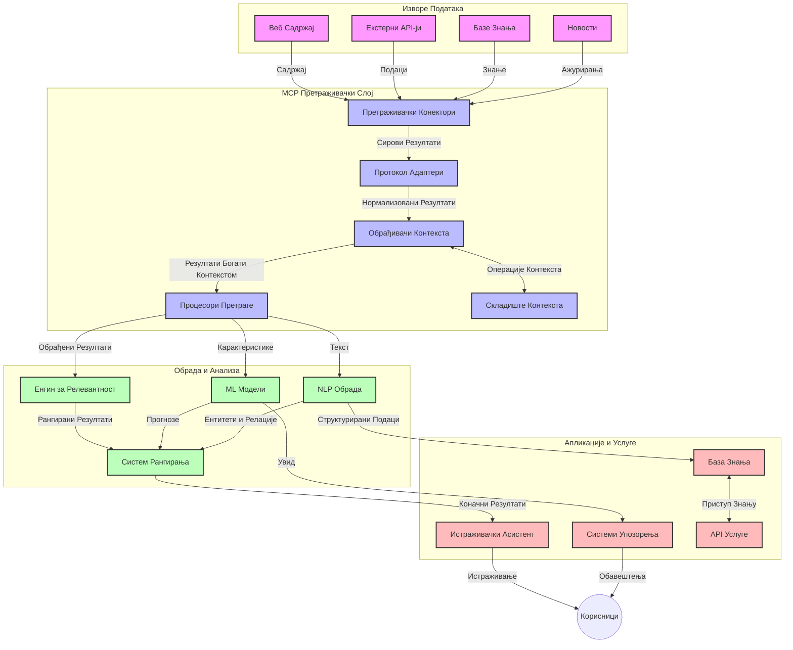
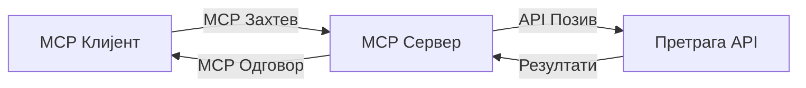
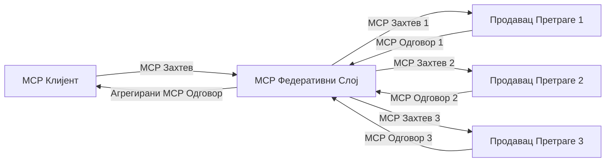
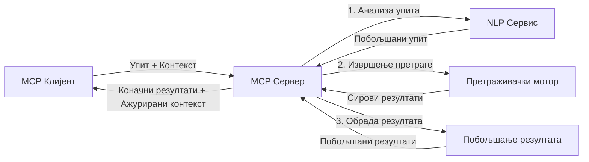

# Протокол Контекста Модела за Претраживање Веба у Реалном Времену

## Преглед

Претраживање веба у реалном времену постало је неопходно у данашњем информатичком окружењу, где апликације захтевају непосредан приступ најновијим информацијама са интернета како би обезбедиле релевантне и благовремене одговоре. Протокол Контекста Модела (MCP) представља значајан напредак у оптимизацији ових процеса претраживања у реалном времену, побољшавајући ефикасност претраге, одржавајући контекстуалну интегритет и унапређујући укупне перформансе система.

Овај модул истражује како MCP трансформише претраживање веба у реалном времену пружајући стандардизован приступ управљању контекстом између AI модела, претраживача и апликација.

### Шта ћете научити

У овом обимном водичу, сазнаћете:

- Како MCP ствара беспрекорну повезницу између AI модела и могућности претраживања веба у реалном времену
- Архитектонске обрасце за имплементацију ефикасних и скалабилних решења претраге са MCP
- Технике за очување контекста претраге кроз више упита и интеракција
- Практичне имплементације кода у Пајтону и ЈаваСкрипту за различите сценарије претраге
- Методе за балансирање релевантности, новитета и перформанси у системима претраге покретаним MCP-ом

## Увод у Претраживање Веба у Реалном Времену

Претраживање веба у реалном времену представља технолошки приступ који омогућава континуирано постављање упита, процесирање и анализу веб-базираних информација у тренутку када су објављене или ажуриране, омогућавајући системима да пруже свеже и релевантне информације са минималним закашњењем. За разлику од традиционалних система претраге који раде на индексним подацима који могу бити старих сатима или данима, претраживање у реалном времену обрађује живе податке са интернета, пружајући увиде и информације које одражавају тренутно стање онлајн садржаја.

### Основни појмови о претраживању веба у реалном времену:

- **Континуирано обрађивање упита**: Упити се обрађују преко стално ажурираних извора података
- **Приоритет новитета**: Системи су дизајнирани да пренаглашавају свеже информације
- **Баланс релевантности**: Одржавање равнотеже између релевантности и новитета
- **Скалабилна архитектура**: Системи морају да поднесу променљиве оптерећења упитима и обим података
- **Контекстуално разумевање**: Одржавање корисничког контекста кроз више итерација претраге је кључно за значајне резултате
- **Динамичка преформулација упита**: Прилагођавање упита у складу са контекстом и претходним резултатима
- **Интеграција више извора**: Комбиновaње резултата са више добављача претраге и веб извора
- **Семантичко разумевање**: Обрада упита и садржаја на основу значења, а не само кључних речи
- **Рангирање у реалном времену**: Континуирано подешавање рангирања резултата како нове информације постају доступне

### Протокол Контекста Модела и претраживање веба у реалном времену

Протокол Контекста Модела (MCP) решава неколико кључних изазова у окружењима претраживања веба у реалном времену:

1. **Очување контекста претраге**: MCP стандардује начин одржавања контекста кроз дистрибуиране компоненте претраге, осигуравајући да AI модели и процесни чворови имају приступ релевантној историји упита и корисничким преференцама.

2. **Ефикасно управљање упитима**: Пружајући структуиране механизме за пренос контекста, MCP смањује оптерећење понављања контекста у свакој итерацији претраге.

3. **Интероперабилност**: MCP креира заједнички језик за дељење контекста између различитих технологија претраге и AI модела, омогућавајући флексибилније и проширивије архитектуре.

4. **Контекст оптимизован за претрагу**: Имплементације MCP-а могу да дају приоритет елементима контекста који су најрелевантнији за ефективну претрагу, оптимизујући и за перформансе и за прецизност.

5. **Адаптивно процесирање претраге**: Са правилним управљањем контекстом кроз MCP, системи претраге могу динамички прилагођавати обраду у складу са развијајућим потребама корисника и информационим окружењем.

У савременим апликацијама, од агрегатора вести до асистената за истраживање, интеграција MCP-а са веб претраживачким технологијама омогућава интелигентније, свесније контекста претраге које могу пружити све релевантније резултате како интеракције корисника напредују.

## Циљеви учења

На крају ове лекције, моћи ћете да:

- Разумете основе претраге веба у реалном времену и њене изазове у савременим апликацијама
- Објасните како Протокол Контекста Модела (MCP) унапређује могућности претраге веба у реалном времену
- Имплементирате претраживачка решења заснована на MCP-у користећи популарне оквире и API-је
- Дизајнирате и имплементирате скалабилне претраживачке архитектуре виских перформанси са MCP-ом
- Примените концепте MCP-а у различитим случајевима коришћења укључујући семантичку претрагу, помоћ у истраживању и претраживач са AI подршком
- Оцјењујете нове трендове и будуће иновације у технологијама претраге заснованим на MCP-у
- Развијате системе претраге свесне контекста који уче из корисничких интеракција
- Интегришете могућности претраге веба у AI асистенте користећи стандардизоване MCP протоколе
- Креирате вишефазне претраживачке токове који постепено унапређују резултате на основу контекста
- Оптимизујете перформансе претраге при одржавању свеобухватне свести о контексту

### Дефиниција и значај

Претраживање веба у реалном времену подразумева континуирано постављање упита, препознавање и испоруку веб-базираних информација са минималним кашњењем. За разлику од традиционалних претраживача који периодично претражују и индексирају веб, претраживање у реалном времену има за циљ да износи информације одмах по њиховом појављивању, омогућавајући тренутни приступ најсавременијем садржају.

Кључне карактеристике претраге веба у реалном времену укључују:

- **Свеже информације**: Приоритет новим садржајима и ажурирањима
- **Континуирана обрада**: Стално праћење нових информација
- **Прилагођавање упита**: Унапређивање претраживачких упита у складу са контекстом и повратним информацијама
- **Одмах испорука**: Пружање резултата претраге са минималним одлагањем
- **Чување контекста**: Настајање на претходним упитима за побољшану релевантност

### Изазови у традиционалном претраживању веба

Традиционални приступи претрази веба суочавају се са неколико ограничења када се примењују у сценаријима реалног времена:

1. **Фрагментација контекста**: Тешкоће у одржавању контекста претраге кроз више упита
2. **Свеже информације**: Изазови у приступу и приоритету најновијих информација
3. **Комплексност интеграције**: Проблеми интероперабилности између претраживачких система и апликација
4. **Проблеми са латенцијом**: Балансирање свеобухватне претраге са захтевима времена одговора
5. **Параметар релевантности**: Осигуравање тачности и релевантности при истовременом наглашавању новитета

## Разумевање Протокола Контекста Модела (MCP) за претрагу

### Шта је MCP у контексту претраге?

Протокол Контекста Модела (MCP) је стандардизован протокол комуникације дизајниран да олакша ефикасну интеракцију између AI модела и апликација. У контексту претраге веба у реалном времену, MCP пружа оквир за:

- Очување контекста претраге током секвенци упита
- Стандартизацију формата претраживачких упита и резултата
- Оптимизацију преноса параметара претраге и резултата
- Унапређење комуникације између модела и претраживача

### Основне компоненте и архитектура

Архитектура MCP за претрагу веба у реалном времену састоји се од неколико кључних компоненти:

1. **Управљање контекстом упита**: Упрaвљање и одржавање контекста претраге кроз више упита
2. **Обрађивачи претраге**: Обрађују долазне захтеве за претрагу користећи технике свесне контекста
3. **Протоколски адаптери**: Преображавају између различитих претраживачких API-ја уз очување контекста
4. **Складиште контекста**: Ефикасно чување и преузимање историје претраге и преференција
5. **Конектори за претрагу**: Повезују се са различитим претраживачким системима и веб API-јима



### Како MCP побољшава претрагу у реалном времену

MCP решава традиционалне изазове претраге веба кроз:

- **Контекстуалну континуитет**: Одржавање веза између упита кроз целу сесију претраге
- **Оптимизовани пренос**: Смањење понављања параметара претраге интелигентним управљањем контекстом
- **Стандаризовани интерфејси**: Пружање конзистентних API-ја за компоненте претраге
- **Смањена латенција**: Минимализација процесног оптерећења кроз ефикасно руковање контекстом
- **Побољшана релевантност**: Унапређење релевантности претраге очувањем корисничке намере кроз више упита

## Интеграција и имплементација

Системи претраге веба у реалном времену захтевају пажљив дизајн архитектуре и имплементацију како би одржали перформансе и контекстуалну интегритет. Протокол Контекста Модела нуди стандардизован приступ интеграцији AI модела и технологија претраге, што омогућава напредне, контекстно свесне претраживачке токове.

### Преглед интеграције MCP-а у претраживачке архитектуре

Имплементација MCP-а у окружењима претраге у реалном времену укључује неколико кључних аспеката:

1. **Серијализација контекста претраге**: MCP пружа ефикасне механизме за кодирање контекстуалних информација унутар претраживачких захтева, осигуравајући да суштински контекст прати упит кроз целу процесну цевовод. То укључује стандардизоване формате серијализације оптимизоване за метаподатке релевантне претрази.

2. **Државно свесна обрада претраге**: MCP омогућава интелигентнију обраду која је свесна стања одржавајући конзистентну репрезентацију контекста кроз итерације претраге. Ово је нарочито вредно у вишефазним претраживачким токовима где унапређење контекста побољшава резултате.

3. **Проширење и унапређење упита**: Имплементације MCP-а у системима претраге могу да олакшају софистицирано проширење и унапређење упита на основу акумулираног контекста, омогућавајући све релевантније резултате како сесија претраге напредује.

4. **Кеширање резултата и приоритетизација**: Стандардизацијом руковања контекстом, MCP помаже у управљању кеширањем и приоритетизацијом резултата, омогућавајући компонентама прилагођавање у складу са развијајућим контекстом претраге.

5. **Федерација и агрегат претраге**: MCP омогућава напреднију федерацију претраге преко више позадинских система пружајући структуиране репрезентације контекста претраге, што омогућава смисленију агрегат резултата из различитих извора.

Имплементација MCP-а у разним претраживачким технологијама ствара уједињен приступ управљању контекстом, смањујући потребу за прилагођеним интеграцијским кодом уз унапређење способности система да одржи смислен контекст како се претраживачки упити развијају.

### MCP у различитим имплементацијама претраге веба

Ови примери прате актуелну MCP спецификацију која се фокусира на JSON-RPC базиран протокол са различитим транспортним механизмима. Код показује како можете реализовати прилагођене интеграције претраге уз одржавање пунe компатибилности са MCP протоколом.


<details>
<summary>Пајтон имплементација са Генеричким Претраживачким API-јем</summary>

```python
import asyncio
import json
import aiohttp
from typing import Dict, Any, Optional, List
from contextlib import asynccontextmanager
from collections.abc import AsyncIterator

# Увези стандардне MCP библиотеке
from mcp.client.session import ClientSession
from mcp.client.streamable_http import streamablehttp_client
from mcp.types import TextContent, CreateMessageRequestParams, CreateMessageResult
from mcp.server.fastmcp import FastMCP

# Креирај FastMCP сервер за претрагу веба
search_server = FastMCP("WebSearch")

# Класа за руковање операцијама претраге веба
class WebSearchHandler:
    def __init__(self, api_endpoint: str, api_key: str):
        self.api_endpoint = api_endpoint
        self.api_key = api_key
        self.session = None
        
    async def initialize(self):
        """Initialize the HTTP session"""
        self.session = aiohttp.ClientSession(
            headers={"Authorization": f"Bearer {self.api_key}"}
        )
    
    async def close(self):
        """Close the HTTP session"""
        if self.session:
            await self.session.close()
            
    async def perform_search(self, query: str, max_results: int = 5, 
                           include_domains: List[str] = None, 
                           exclude_domains: List[str] = None,
                           time_period: str = "any") -> Dict[str, Any]:
        """Perform web search using the search API"""
        # Конструиши параметре претраге
        search_params = {
            "q": query,
            "limit": max_results,
            "time": time_period
        }
        
        if include_domains:
            search_params["site"] = ",".join(include_domains)
            
        if exclude_domains:
            search_params["exclude_site"] = ",".join(exclude_domains)
        
        # Изврши захтев за претрагу
        try:
            async with self.session.get(
                self.api_endpoint,
                params=search_params
            ) as response:
                if response.status != 200:
                    error_text = await response.text()
                    raise Exception(f"Search API error: {response.status} - {error_text}")
                
                search_data = await response.json()
                
                # Претвори API-специфичан одговор у стандардни формат
                results = []
                for item in search_data.get("results", []):
                    results.append({
                        "title": item.get("title", ""),
                        "url": item.get("url", ""),
                        "snippet": item.get("snippet", ""),
                        "date": item.get("published_date", ""),
                        "source": item.get("source", "")
                    })
                
                return {
                    "query": query,
                    "totalResults": len(results),
                    "results": results
                }
        except Exception as e:
            print(f"Search API request error: {e}")
            raise

# Иницијализуј обрађивач претраге
search_handler = WebSearchHandler(
    api_endpoint="https://api.search-service.example/search",
    api_key="your-api-key-here"
)

# Подеси животни век за управљање обрађивачем претраге
@asyncio.asynccontextmanager
async def app_lifespan(server: FastMCP):
    """Manage application lifecycle"""
    await search_handler.initialize()
    try:
        yield {"search_handler": search_handler}
    finally:
        await search_handler.close()

# Подеси животни век сервера
search_server = FastMCP("WebSearch", lifespan=app_lifespan)

# Региструј алат за претрагу веба
@search_server.tool()
async def web_search(query: str, max_results: int = 5, 
                   include_domains: List[str] = None,
                   exclude_domains: List[str] = None,
                   time_period: str = "any") -> Dict[str, Any]:
    """
    Search the web for information
    
    Args:
        query: The search query
        max_results: Maximum number of results to return (default: 5)
        include_domains: List of domains to include in search results
        exclude_domains: List of domains to exclude from search results
        time_period: Time period for results ("day", "week", "month", "any")
        
    Returns:
        Dictionary containing search results
    """
    ctx = search_server.get_context()
    search_handler = ctx.request_context.lifespan_context["search_handler"]
    
    results = await search_handler.perform_search(
        query=query,
        max_results=max_results,
        include_domains=include_domains,
        exclude_domains=exclude_domains,
        time_period=time_period
    )
    
    return results

# Пример коришћења клијента
async def client_example():
    # Повежи се на сервер за претрагу користећи Streamable HTTP транспорт
    async with streamablehttp_client("http://localhost:8000/mcp") as (read, write, _):
        async with ClientSession(read, write) as session:
            # Иницијализуј везу
            await session.initialize()
            
            # Позови алат web_search
            search_results = await session.call_tool(
                "web_search", 
                {
                    "query": "latest developments in AI and Model Context Protocol",
                    "max_results": 5,
                    "time_period": "day",
                    "include_domains": ["github.com", "microsoft.com"]
                }
            )
            
            print(f"Search results: {search_results}")

# Пример извршавања сервера
if __name__ == "__main__":
    # Покрени сервер са Streamable HTTP транспортом
    search_server.run(transport="streamable-http")
```
</details> 

<details>
<summary>ЈаваСкрипт имплементација са претрагом у оквирима претраживача</summary>


```javascript
// Имплементација MCP сервера за веб претрагу
import { McpServer, ResourceTemplate } from '@modelcontextprotocol/sdk/server/mcp.js';
import { StreamableHTTPServerTransport } from '@modelcontextprotocol/sdk/server/streamableHttp.js';
import { z } from 'zod';

// Креирај MCP сервер за веб претрагу
const searchServer = new McpServer({
    name: "BrowserSearch",
    description: "A server that provides web search capabilities"
});

// Класа сервиса за претрагу
class SearchService {
    constructor(searchApiUrl, apiKey) {
        this.searchApiUrl = searchApiUrl;
        this.apiKey = apiKey;
    }

    async performSearch(parameters) {
        const {
            query = '',
            maxResults = 5,
            includeDomains = [],
            excludeDomains = [],
            timePeriod = 'any'
        } = parameters;
        
        // Конструиши URL претраге са параметрима
        const url = new URL(this.searchApiUrl);
        url.searchParams.append('q', query);
        url.searchParams.append('limit', maxResults);
        url.searchParams.append('time', timePeriod);
        
        if (includeDomains.length > 0) {
            url.searchParams.append('site', includeDomains.join(','));
        }
        
        if (excludeDomains.length > 0) {
            url.searchParams.append('exclude_site', excludeDomains.join(','));
        }
        
        try {
            const response = await fetch(url.toString(), {
                method: 'GET',
                headers: {
                    'Authorization': `Bearer ${this.apiKey}`,
                    'Content-Type': 'application/json'
                }
            });
            
            if (!response.ok) {
                const errorText = await response.text();
                throw new Error(`Search API error: ${response.status} - ${errorText}`);
            }
            
            const searchData = await response.json();
            
            // Претвори одговор специфичан за API у стандардни формат
            const results = searchData.results?.map(item => ({
                title: item.title || '',
                url: item.url || '',
                snippet: item.snippet || '',
                date: item.published_date || '',
                source: item.source || ''
            })) || [];
            
            return {
                query,
                totalResults: results.length,
                results
            };
        } catch (error) {
            console.error('Search API request error:', error);
            throw error;
        }
    }
}

// Иницијализуј сервис за претрагу
const searchService = new SearchService(
    'https://api.search-service.example/search',
    'your-api-key-here'
);

// Подеси провајдер контекста за сервер
searchServer.setContextProvider(() => {
    return {
        searchService
    };
});

// Региструј алат за веб претрагу
searchServer.tool({
    name: 'web_search',
    description: 'Search the web for information',
    parameters: {
        type: 'object',
        properties: {
            query: {
                type: 'string',
                description: 'The search query'
            },
            maxResults: {
                type: 'integer',
                description: 'Maximum number of results to return',
                default: 5
            },
            includeDomains: {
                type: 'array',
                items: { type: 'string' },
                description: 'List of domains to include in search results'
            },
            excludeDomains: {
                type: 'array',
                items: { type: 'string' },
                description: 'List of domains to exclude from search results'
            },
            timePeriod: {
                type: 'string',
                description: 'Time period for results',
                enum: ['day', 'week', 'month', 'any'],
                default: 'any'
            }
        },
        required: ['query']
    },
    handler: async (params, context) => {
        const { searchService } = context;
        return await searchService.performSearch(params);
    }
});

// Пример клијентског кода за повезивање са сервером за претрагу
import { Client } from '@modelcontextprotocol/sdk/client/index.js';
import { StreamableHTTPClientTransport } from '@modelcontextprotocol/sdk/client/streamableHttp.js';

async function connectToSearchServer() {
    // Повежи се са сервером за претрагу
    const transport = new StreamableHTTPClientTransport(
        new URL('http://localhost:8000/mcp')
    );
    
    const client = new Client({
        name: 'search-client',
        version: '1.0.0'
    });
    
    await client.connect(transport);
    
    // Покрени алат за претрагу
    const searchResults = await client.callTool({
        name: 'web_search',
        arguments: {
            query: 'Model Context Protocol implementation examples',
            maxResults: 10,
            timePeriod: 'week',
            includeDomains: ['github.com', 'docs.microsoft.com']
        }
    });
    
    console.log('Search results:', searchResults);
    
    // Очисти ресурсе
    await client.disconnect();
}

// Покрени сервер
const transport = new StreamableHTTPServerTransport();
await searchServer.connect(transport);
console.log('Search server running at http://localhost:8000/mcp');

// У засебном процесу или након покретања сервера
// connectToSearchServer().catch(console.error);
```
</details> 


## Одрицање од одговорности у вези са примерима кода

> **Важна напомена**: Доњи примери кода демонстрирају интеграцију Протокола Контекста Модела (MCP) са функционалношћу претраге веба. Иако прате обрасце и структуре званичних MCP SDK-а, поједностављени су у образовне сврхе.
> 
> Ови примери приказују:
> 
> 1. **Пајтон имплементација**: Имплементацију FastMCP сервера која пружа алат за претрагу веба и повезује се са екстерним претраживачким API-јем. Пример показује правилно управљање животним циклусом, руковање контекстом и имплементацију алата у складу са обрасцима из [званичног MCP Пајтон SDK-а](https://github.com/modelcontextprotocol/python-sdk). Сервер користи препоручени Streamable HTTP транспорт који је заменио старији SSE транспорт за продукционе примене.
> 
> 2. **ЈаваСкрипт имплементација**: Имплементацију у TypeScript/JavaScript-у користећи FastMCP образац из [званичног MCP TypeScript SDK-а](https://github.com/modelcontextprotocol/typescript-sdk) за креирање сервера претраге са правилним дефиницијама алата и клијентским конекцијама. Прати најновије препоручене обрасце за управљање сесијама и очување контекста.
> 
> Ови примери би захтевали додатно руковање грешкама, аутентикацију и специфичан код интеграције API-ја за производна окружења. Приказане тачке приступа претраживачком API-ју (`https://api.search-service.example/search`) су замене и требало би их заменити стварним тачкама приступа.
> 
> За комплетне детаље имплементације и најсавременије приступе, молимо погледајте [званичну MCP спецификацију](https://spec.modelcontextprotocol.io/) и документацију SDK-а.

## Основни појмови

### Оквир Протокола Контекста Модела (MCP)

У основи, Протокол Контекста Модела пружа стандардизован начин за размену контекста између AI модела, апликација и сервиса. У претрази веба у реалном времену, овај оквир је неопходан за креирање кохерентних искустава претраге са више корака. Кључне компоненте укључују:

1. **Клијент-сервер архитектура**: MCP успоставља јасно раздвајање између клијената претраге (захтевача) и сервера претраге (пружаоца), омогућавајући флексибилне моделе распореда.

2. **JSON-RPC комуникација**: Протокол користи JSON-RPC за размену порука, чинећи га компатибилним са веб технологијама и лакшим за имплементацију на различитим платформама.

3. **Управљање контекстом**: MCP дефинише структуиране методе за одржавање, ажурирање и коришћење контекста претраге кроз више интеракција.

4. **Дефиниције алата**: Могућности претраге изложене су као стандардизовани алати са добро дефинисаним параметрима и вредностима повратка.

5. **Подршка за стриминг**: Протокол подржава стримовање резултата, што је суштински важно за претрагу у реалном времену где резултати могу постепено пристизати.

### Обрасци интеграције претраге веба

При интеграцији MCP-а са претраживањем веба, појављује се неколико образаца:

#### 1. Директна интеграција добављача претраге



У овом обрасцу, MCP сервер директно комуницира са једним или више претраживачких API-ја, преводећи MCP захтеве у API-специфичне позиве и форматирајући резултате као MCP одговоре.

#### 2. Федеративна претрага уз очување контекста



Овај образац дистрибуира упите за претрагу на више MCP-компатибилних пружаоца претраге, од којих се сваки потенцијално специјализује за различите типове садржаја или претраживачке могућности, уз одржавање уједињеног контекста.

#### 3. Ланац претраге са побољшаним контекстом



У овом обрасцу, процес претраге поделјен је на више фаза, а контекст се у сваком кораку обогаћује, резултујући прогресивно релевантнијим резултатима.

### Компоненте контекста претраге

У претраживању веба заснованом на MCP-у, контекст обухвата обично:

- **Историја упита**: Претходни претраживачки упити у сесији
- **Корисничке преференције**: Језик, регион, подешавања безбедне претраге
- **Историја интеракција**: Који резултати су кликнути, време проведено на резултатима
- **Параметри претраге**: Филтери, редоследи и други модификатори претраге
- **Домeнско знање**: Контекст специфичан за предмет релевантан претрази
- **Времeнски контекст**: Фактори релевантности засновани на времену
- **Преференце извора**: Поуздани или преферирани извори информација

## Случајеви коришћења и апликације

### Истраживање и прикупљање информација

MCP унапређује токове рада истраживања кроз:

- Очување контекста истраживања кроз претраживачке сесије
- Омогућавање софистициранијих и контекстуално релевантнијих упита
- Подршка федерацији претраге са више извора
- Олакшавање извлачења знања из резултата претраге

### Праћење вести и трендова у реалном времену

Претрага покретана MCP-ом нуди предности за праћење вести:

- Приближан откривању новоразвијених вести у реалном времену
- Контекстуално филтрирање релевантних информација
- Праћење тема и ентитета кроз више извора
- Персонализоване новости на бази корисничког контекста

### AI-ограничено прегледање и истраживање

MCP ствара нове могућности за AI-подржано прегледање:

- Контекстуалне предлоге претраге на основу тренутних активности претраживача
- Беспрекорна интеграција претраге веба са асистентима покретаним LLM
- Мулти-турнална дорађивања претраге уз очуван контекст
- Побољшана проверa чињеница и верификација информација

## Будући трендови и иновације

### Еволуција MCP-а у претрази веба

Гледајући унапред, очекујемо да ће MCP развити како би одговорио на:
- **Мултимодална претрага**: Интегрисање претраге по тексту, слици, аудио и видео снимцима са очуваним контекстом
- **Децентрализована претрага**: Подршка за дистрибуиране и федеративне екосистеме претраге
- **Приватност претраге**: Механизми претраге који штите приватност и узимају у обзир контекст
- **Разумевање упита**: Дубока семантичка анализа упита за претрагу на природном језику

### Потенцијални технолошки напредак

Нове технологије које ће обликовати будућност MCP претраге:

1. **Неуралне архитектуре претраге**: Системи претраге засновани на уграђеним (embedding) моделима оптимизовани за MCP
2. **Персонализовани контекст претраге**: Учење индивидуалних обрасца претрага корисника током времена
3. **Интеграција графа знања**: Контекстуална претрага унапређена графовима знања специфичним за домен
4. **Крос-модални контекст**: Очекивање и одржавање контекста кроз различите модалитете претраге

## Практичне вежбе

### Вежба 1: Подешавање основне MCP претраживачке пипелине

У овој вежби ћете научити како да:
- Конфигуришете основно MCP претраживачко окружење
- Имплементирате обрађиваче контекста за веб претрагу
- Тестирајте и потврдите очување контекста кроз више итерација претраге

### Вежба 2: Креирање асистента за истраживање са MCP претрагом

Направите комплетну апликацију која:
- Обрађује питања за истраживање на природном језику
- Изводи веб претраге узимајући у обзир контекст
- Синтетизује информације из више извора
- Представља организоване резултате истраживања

### Вежба 3: Имплементација федерације претраге из више извора са MCP-ом

Напредна вежба која обухвата:
- Контекстуално прослеђивање упита ка више претраживача
- Рангирање и агрегирање резултата
- Контекстуално уклањање дупликата резултата претраге
- Обраду метаподатака специфичних за изворе

## Додатни ресурси

- [Model Context Protocol Specification](https://spec.modelcontextprotocol.io/) - Званична MCP спецификација и детаљна протокол документација
- [Model Context Protocol Documentation](https://modelcontextprotocol.io/) - Детаљни туторијали и водичи за имплементацију
- [MCP Python SDK](https://github.com/modelcontextprotocol/python-sdk) - Званична Python имплементација MCP протокола
- [MCP TypeScript SDK](https://github.com/modelcontextprotocol/typescript-sdk) - Званична TypeScript имплементација MCP протокола
- [MCP Reference Servers](https://github.com/modelcontextprotocol/servers) - Референтне имплементације MCP сервера
- [Bing Web Search API Documentation](https://learn.microsoft.com/en-us/bing/search-apis/bing-web-search/overview) - Мицрософт-ов веб претраживачки API
- [Google Custom Search JSON API](https://developers.google.com/custom-search/v1/overview) - Гуглов програмски претраживач
- [SerpAPI Documentation](https://serpapi.com/search-api) - API за страницу са резултатима претраге
- [Meilisearch Documentation](https://www.meilisearch.com/docs) - Отворени извор претраживача
- [Elasticsearch Documentation](https://www.elastic.co/guide/index.html) - Дистрибуирани систем за претрагу и анализу
- [LangChain Documentation](https://python.langchain.com/docs/get_started/introduction) - Креирање апликација са LLM моделима

## Очекивани резултати учења

Након завршетка овог модула бићете у стању да:

- Разумете основе претраге у реалном времену и њене изазове
- Објасните како Model Context Protocol (MCP) унапређује могућности претраге у реалном времену
- Имплементирате решења претраге заснована на MCP користећи популарне рамворке и API-је
- Дизајнирате и имплементирате скалабилне и високо перформантне архитектуре претраге са MCP-ом
- Примените MCP концепте у различитим случајевима коришћења као што су семантичка претрага, асистенција у истраживању и претраживање уз помоћ вештачке интелигенције
- Процените трендове и будуће иновације у технологијама претраге заснованим на MCP

### Разматрања о поверењу и безбедности

При имплементацији веб претрага заснованих на MCP, имајте на уму ове важне принципе из MCP спецификације:

1. **Кориснички пристанак и контрола**: Корисници морају јасно дати пристанак и разумети сваки приступ и операцију над подацима. Ово је посебно важно за веб претраге које могу приступати екстерним изворима података.

2. **Приватност података**: Обезбедите одговарајућу обраду упита и резултата претраге, посебно када садрже поверљиве информације. Имплементирајте одговарајуће контроле приступа ради заштите корисничких података.

3. **Безбедност алата**: Имплементирајте исправну ауторизацију и валидацију за алате претраге јер представљају потенцијалне безбедносне ризике кроз извршавање произвољног кода. Описи понашања алата требају се сматрати непоузданим осим ако нису добијени са поузданог сервера.

4. **Јасна документација**: Обезбедите јасну документацију о могућностима, ограничењима и безбедносним аспектима ваше MCP базиране имплементације, пратећи смернице из MCP спецификације.

5. **Робусни токови пристанка**: Креирајте робусне токове за пристанак и ауторизацију који јасно објашњавају шта сваки алат ради пре његове употребе, посебно за алате који интерагују са екстерним веб ресурсима.

За комплетне детаље о безбедности и питањима поверења у MCP, погледајте [званичну документацију](https://modelcontextprotocol.io/specification/2025-11-25/basic/security_best_practices).

## Шта следи

- [5.12 Entra ID Authentication for Model Context Protocol Servers](../mcp-security-entra/README.md)

---

<!-- CO-OP TRANSLATOR DISCLAIMER START -->
**Изјава о одрицању одговорности**:
Овај документ је преведен коришћењем услуге за аутоматски превод [Co-op Translator](https://github.com/Azure/co-op-translator). Иако тежимо тачности, имајте у виду да аутоматски преводи могу садржати грешке или нетачности. Оригинални документ на његовом изворном језику треба сматрати ауторитативним извором. За критичне информације препоручује се професионални људски превод. Нисмо одговорни за било каква неспоразума или погрешна тумачења која произилазе из коришћења овог превода.
<!-- CO-OP TRANSLATOR DISCLAIMER END -->