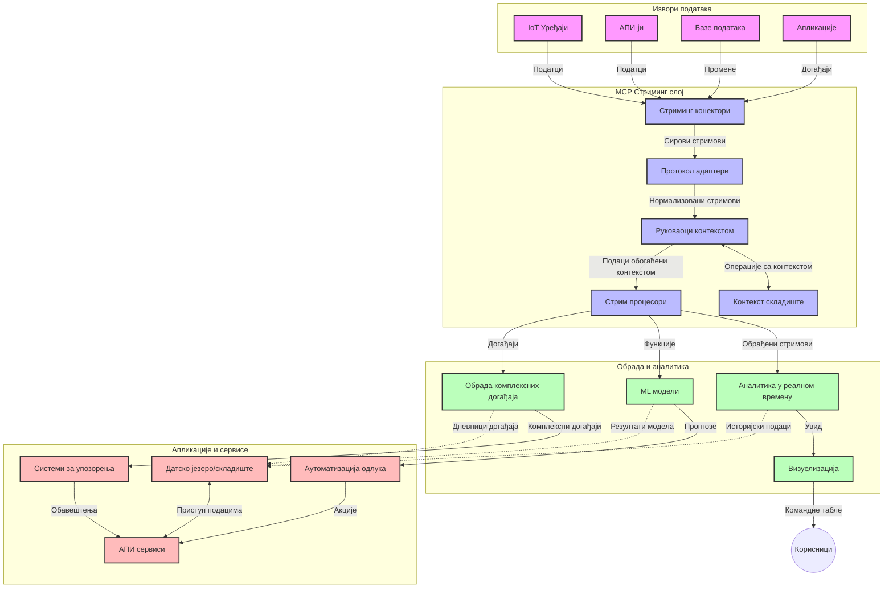

# Протокол контекста модела за стриминг података у реалном времену

## Преглед

Стриминг података у реалном времену постао је есенцијалан у данашњем свету вођеном подацима, где предузећа и апликације захтевају тренутни приступ информацијама ради правовремених одлука. Протокол контекста модела (MCP) представља значајан напредак у оптимизацији ових процеса стриминга у реалном времену, побољшавајући ефикасност обраде података, одржавајући контекстуалну интегритет, и унапређујући укупне перформансе система.

Овај модул истражује како MCP трансформише стриминг података у реалном времену пружајући стандардан приступ управљању контекстом преко AI модела, платформи за стриминг и апликација.

## Увод у стриминг података у реалном времену

Стриминг података у реалном времену технолошки је парадигма која омогућава континуирани пренос, обраду и анализу података како се производе, омогућавајући системима да одмах реагују на нове информације. За разлику од традиционалне обраде по пакетима која ради са статичким скуповима података, стриминг обрађује податке у покрету, испоручујући увиде и акције са минималним закашњењем.

### Основни концепти стриминга података у реалном времену:

- **Континуирани ток података**: Подаци се обрађују као континуирани, непрекинути ток догађаја или записа.
- **Обрада са ниским закашњењем**: Системи су дизајнирани да минимализују време између генерисања и обраде података.
- **Скалабилност**: Архитектуре за стриминг морају да поднесу променљиве количине и брзину података.
- **Отпорност на грешке**: Системи треба да буду отпорни на кварове како би обезбедили непрекидни ток података.
- **Обрада са стањем**: Одржавање контекста кроз догађаје је кључно за смислену анализу.

### Протокол контекста модела и стриминг у реалном времену

Протокол контекста модела (MCP) одговара на неколико критичних изазова у окружењима за стриминг у реалном времену:

1. **Континуитет контекста**: MCP стандардује начин одржавања контекста кроз распоређене компоненте стриминга, обезбеђујући да AI модели и чворови за обраду имају приступ релевантном историјском и окружењском контексту.

2. **Ефикасно управљање стањем**: Пружајући структуиране механизме за пренос контекста, MCP смањује оптерећење управљања стањем у стриминг цевоводима.

3. **Интероперабилност**: MCP ствара заједнички језик за дељење контекста између различитих технологија стриминга и AI модела, омогућавајући флексибилније и проширивије архитектуре.

4. **Контекст оптимизован за стриминг**: Имплементације MCP-а могу приоритетизовати које су контекстуалне компоненте најрелевантније за доношење одлука у реалном времену, оптимизујући перформансе и прецизност.

5. **Адаптивна обрада**: Уз адекватно управљање контекстом путем MCP-а, стриминг системи могу динамички прилагођавати обраду на основу еволуирајућих услова и образаца у подацима.

У модерним апликацијама, од мрежа IoT сензора до финансијских платформи за трговање, интеграција MCP-а са технологијама стриминга омогућава интелигентнију, контекстуално свесну обраду која може адекватно реаговати на сложене, еволуирајуће ситуације у реалном времену.

## Циљеви учења

На крају ове лекције, моћи ћете да:

- Разумете основе стриминга података у реалном времену и његове изазове
- Објасните како Протокол контекста модела (MCP) унапређује стриминг података у реалном времену
- Имплементирате стриминг решења заснована на MCP користећи популарне оквире попут Kafka и Pulsar
- Дизајнирате и развијете архитектуре стриминга отпорне на грешке и високе перформансе са MCP
- Примените MCP концепте у случајевима употребе за IoT, финансијско трговање и аналитику вођену AI
- Процените нове трендове и будуће иновације у технологијама стриминга заснованим на MCP

### Дефиниција и значај

Стриминг података у реалном времену обухвата континуирано генерисање, обраду и испоруку података са минималним закашњењем. За разлику од обраде по пакетима, где се подаци сакупљају и обрађују у групама, подаци се у стримингу обрађују инкрементално како пристижу, омогућавајући тренутне увиде и акције.

Кључне карактеристике стриминга података у реалном времену укључују:

- **Ниско закашњење**: Обрада и анализа података у року од милисекунди до секунди
- **Континуирани ток**: Непрекидни токови података из различитих извора
- **Тренутна обрада**: Анализа података по доласку, а не у пакетима
- **Архитектура вођена догађајима**: Реакција на догађаје чим се догоде

### Изазови у традиционалном стримингу података

Традиционални приступи стримингу података суочавају се са неколико ограничења:

1. **Губитак контекста**: Тешкоћа одржавања контекста кроз распоређене системе
2. **Проблеми са скалабилношћу**: Изазови у скалирању за руковање великим обимом и брзином података
3. **Комплексност интеграције**: Проблеми у интероперабилности између различитих система
4. **Управљање закашњењем**: Балансирање пропусног опсега са временом обраде
5. **Конзистентност података**: Осигуравање тачности и потпуности података кроз ток

## Разумевање Протокола контекста модела (MCP)

### Шта је MCP?

Протокол контекста модела (MCP) је стандардан комуникациони протокол дизајниран да олакша ефикасну интеракцију између AI модела и апликација. У контексту стриминга података у реалном времену, MCP пружа оквир за:

- Очување контекста током целог цевовода података
- Стандартизацију формата размене података
- Оптимизацију преноса великих скупова података
- Унапређење комуникације између модела и апликација

### Основне компоненте и архитектура

MCP архитектура за стриминг у реалном времену састоји се од неколико кључних компоненти:

1. **Управљачи контекста**: Управљају и одржавају контекстуалне информације кроз стриминг цевовод
2. **Обрадари стримова**: Обрађују улазне токове података користећи технике свесне контекста
3. **Протоколски адаптери**: Претварају између различитих протокола стриминга при чему чувају контекст
4. **Складиште контекста**: Ефикасно чува и преузима контекстуалне информације
5. **Конектори за стриминг**: Повезују се са разним платформама за стриминг (Kafka, Pulsar, Kinesis итд.)



### Како MCP побољшава обраду података у реалном времену

MCP решава традиционалне изазове стриминга кроз:

- **Контекстуални интегритет**: Одржавање веза између тачака података кроз цео цевовод
- **Оптимизован пренос**: Смањење вишка у размени података путем интелигентног управљања контекстом
- **Стандардирани интерфејси**: Пружање конзистентних API-ја за компоненте стриминга
- **Смањење закашњења**: Минимално оптерећење обрадом уз ефикасно руковање контекстом
- **Побољшана скалабилност**: Подршка за хоризонтално скалирање уз очување контекста

## Интеграција и имплементација

Системи за стриминг података у реалном времену захтевају пажљиви архитектонски дизајн и имплементацију како би одржали и перформансе и контекстуални интегритет. Протокол контекста модела нуди стандардизовани приступ интеграцији AI модела и технологија стриминга, омогућавајући сложеније, контекстуално свесне цевоводе за обраду.

### Преглед интеграције MCP у архитектуре стриминга

Имплементација MCP у окружењима стриминга у реалном времену укључује неколико кључних разматрања:

1. **Серијализација и транспорт контекста**: MCP пружа ефикасне механизме за кодирање контекстуалних информација унутар пакета стриминг података, обезбеђујући да се суштински контекст прати кроз цео процес обраде. Укључује стандардизоване формате серијализације оптимизоване за стриминг транспорт.

2. **Обрада стримова са стањем**: MCP омогућава интелигентнију обраду са стањем одржавајући конзистентну представу контекста кроз чворове за обраду. Ово је посебно вредно у распоређеним архитектурама стриминга где је управљање стањем традиционално изазовно.

3. **Време догађаја у односу на време обраде**: Имплементације MCP у стриминг системима морају се позабавити уобичајеним изазовом разликовања када су догађаји настали и када се обрађују. Протокол може укључити временски контекст који чува семантику времена догађаја.

4. **Управљање повратним притиском**: Стандардизацијом руковања контекстом, MCP помаже у управљању повратним притиском у стриминг системима, омогућавајући компонентама да комуницирају своје капацитете обраде и регулишу проток према томе.

5. **Проследне прозоре и агрегатe контекста**: MCP олакшава сложеније операције са прозорима пружајући структуиране представе временског и релативног контекста, омогућавајући смисленије агрегате кроз токове догађаја.

6. **Обрада тачно једном**: У стриминг системима који захтевају семантику тачно једном, MCP може укључити метаподатке обраде да помогне у праћењу и верификацији статуса обраде кроз распоређене компоненте.

Имплементација MCP-а кроз разне технологије стриминга креира унифицирани приступ управљању контекстом, смањујући потребу за прилагођеним кодом интеграције док унапређује способности система да одржи смислен контекст кроз проток података.

### MCP у различитим оквирима за стриминг података

Ови примери прате тренутну MCP спецификацију која се фокусира на JSON-RPC базирани протокол са различитим механизмима транспорта. Код приказује како можете имплементирати прилагођене транспортне режиме који интегришу платформе за стриминг као што су Kafka и Pulsar уз пуни компатибилан рад са MCP протоколом.

Примери су осмишљени да покажу како платформе за стриминг могу бити интегрисане са MCP-ом да пруже обраду података у реалном времену уз очување контекстуалне свести која је централна за MCP. Овај приступ осигурава да примерци кода тачно одражавају тренутно стање MCP спецификације од јуна 2025.

MCP се може интегрисати са популарним оквирима за стриминг укључујући:

#### Интеграција Apache Kafka

```python
import asyncio
import json
from typing import Dict, Any, Optional
from confluent_kafka import Consumer, Producer, KafkaError
from mcp.client import Client, ClientCapabilities
from mcp.core.message import JsonRpcMessage
from mcp.core.transports import Transport

# Прилагођена транспорта класа за повезивање MCP-а са Кафком
class KafkaMCPTransport(Transport):
    def __init__(self, bootstrap_servers: str, input_topic: str, output_topic: str):
        self.bootstrap_servers = bootstrap_servers
        self.input_topic = input_topic
        self.output_topic = output_topic
        self.producer = Producer({'bootstrap.servers': bootstrap_servers})
        self.consumer = Consumer({
            'bootstrap.servers': bootstrap_servers,
            'group.id': 'mcp-client-group',
            'auto.offset.reset': 'earliest'
        })
        self.message_queue = asyncio.Queue()
        self.running = False
        self.consumer_task = None
        
    async def connect(self):
        """Connect to Kafka and start consuming messages"""
        self.consumer.subscribe([self.input_topic])
        self.running = True
        self.consumer_task = asyncio.create_task(self._consume_messages())
        return self
        
    async def _consume_messages(self):
        """Background task to consume messages from Kafka and queue them for processing"""
        while self.running:
            try:
                msg = self.consumer.poll(1.0)
                if msg is None:
                    await asyncio.sleep(0.1)
                    continue
                
                if msg.error():
                    if msg.error().code() == KafkaError._PARTITION_EOF:
                        continue
                    print(f"Consumer error: {msg.error()}")
                    continue
                
                # Парсирај вредност поруке као JSON-RPC
                try:
                    message_str = msg.value().decode('utf-8')
                    message_data = json.loads(message_str)
                    mcp_message = JsonRpcMessage.from_dict(message_data)
                    await self.message_queue.put(mcp_message)
                except Exception as e:
                    print(f"Error parsing message: {e}")
            except Exception as e:
                print(f"Error in consumer loop: {e}")
                await asyncio.sleep(1)
    
    async def read(self) -> Optional[JsonRpcMessage]:
        """Read the next message from the queue"""
        try:
            message = await self.message_queue.get()
            return message
        except Exception as e:
            print(f"Error reading message: {e}")
            return None
    
    async def write(self, message: JsonRpcMessage) -> None:
        """Write a message to the Kafka output topic"""
        try:
            message_json = json.dumps(message.to_dict())
            self.producer.produce(
                self.output_topic,
                message_json.encode('utf-8'),
                callback=self._delivery_report
            )
            self.producer.poll(0)  # Покрени повратне функције
        except Exception as e:
            print(f"Error writing message: {e}")
    
    def _delivery_report(self, err, msg):
        """Kafka producer delivery callback"""
        if err is not None:
            print(f'Message delivery failed: {err}')
        else:
            print(f'Message delivered to {msg.topic()} [{msg.partition()}]')
    
    async def close(self) -> None:
        """Close the transport"""
        self.running = False
        if self.consumer_task:
            self.consumer_task.cancel()
            try:
                await self.consumer_task
            except asyncio.CancelledError:
                pass
        self.consumer.close()
        self.producer.flush()

# Пример коришћења Kafka MCP транспорта
async def kafka_mcp_example():
    # Креирај MCP клијента са Kafka транспортом
    client = Client(
        {"name": "kafka-mcp-client", "version": "1.0.0"},
        ClientCapabilities({})
    )
    
    # Креирај и повећи Kafka транспорт
    transport = KafkaMCPTransport(
        bootstrap_servers="localhost:9092",
        input_topic="mcp-responses",
        output_topic="mcp-requests"
    )
    
    await client.connect(transport)
    
    try:
        # Иницијализуј MCP сесију
        await client.initialize()
        
        # Пример извршавања алата преко MCP-а
        response = await client.execute_tool(
            "process_data",
            {
                "data": "sample data",
                "metadata": {
                    "source": "sensor-1",
                    "timestamp": "2025-06-12T10:30:00Z"
                }
            }
        )
        
        print(f"Tool execution response: {response}")
        
        # Чисто затварање
        await client.shutdown()
    finally:
        await transport.close()

# Покрени пример
if __name__ == "__main__":
    asyncio.run(kafka_mcp_example())
```

#### Имплементација Apache Pulsar

```python
import asyncio
import json
import pulsar
from typing import Dict, Any, Optional
from mcp.core.message import JsonRpcMessage
from mcp.core.transports import Transport
from mcp.server import Server, ServerOptions
from mcp.server.tools import Tool, ToolExecutionContext, ToolMetadata

# Креирајте прилагођени MCP транспорт који користи Pulsar
class PulsarMCPTransport(Transport):
    def __init__(self, service_url: str, request_topic: str, response_topic: str):
        self.service_url = service_url
        self.request_topic = request_topic
        self.response_topic = response_topic
        self.client = pulsar.Client(service_url)
        self.producer = self.client.create_producer(response_topic)
        self.consumer = self.client.subscribe(
            request_topic,
            "mcp-server-subscription",
            consumer_type=pulsar.ConsumerType.Shared
        )
        self.message_queue = asyncio.Queue()
        self.running = False
        self.consumer_task = None
    
    async def connect(self):
        """Connect to Pulsar and start consuming messages"""
        self.running = True
        self.consumer_task = asyncio.create_task(self._consume_messages())
        return self
    
    async def _consume_messages(self):
        """Background task to consume messages from Pulsar and queue them for processing"""
        while self.running:
            try:
                # Не-блокирајуће примање са временским ограничењем
                msg = self.consumer.receive(timeout_millis=500)
                
                # Обрадите поруку
                try:
                    message_str = msg.data().decode('utf-8')
                    message_data = json.loads(message_str)
                    mcp_message = JsonRpcMessage.from_dict(message_data)
                    await self.message_queue.put(mcp_message)
                    
                    # Потврдите поруку
                    self.consumer.acknowledge(msg)
                except Exception as e:
                    print(f"Error processing message: {e}")
                    # Потврдите као негативно ако је дошло до грешке
                    self.consumer.negative_acknowledge(msg)
            except Exception as e:
                # Обрадите временско ограничење или друге изузетке
                await asyncio.sleep(0.1)
    
    async def read(self) -> Optional[JsonRpcMessage]:
        """Read the next message from the queue"""
        try:
            message = await self.message_queue.get()
            return message
        except Exception as e:
            print(f"Error reading message: {e}")
            return None
    
    async def write(self, message: JsonRpcMessage) -> None:
        """Write a message to the Pulsar output topic"""
        try:
            message_json = json.dumps(message.to_dict())
            self.producer.send(message_json.encode('utf-8'))
        except Exception as e:
            print(f"Error writing message: {e}")
    
    async def close(self) -> None:
        """Close the transport"""
        self.running = False
        if self.consumer_task:
            self.consumer_task.cancel()
            try:
                await self.consumer_task
            except asyncio.CancelledError:
                pass
        self.consumer.close()
        self.producer.close()
        self.client.close()

# Дефинишите пример алата MCP који обрађује стриминг податке
@Tool(
    name="process_streaming_data",
    description="Process streaming data with context preservation",
    metadata=ToolMetadata(
        required_capabilities=["streaming"]
    )
)
async def process_streaming_data(
    ctx: ToolExecutionContext,
    data: str,
    source: str,
    priority: str = "medium"
) -> Dict[str, Any]:
    """
    Process streaming data while preserving context
    
    Args:
        ctx: Tool execution context
        data: The data to process
        source: The source of the data
        priority: Priority level (low, medium, high)
        
    Returns:
        Dict containing processed results and context information
    """
    # Пример обраде који користи MCP контекст
    print(f"Processing data from {source} with priority {priority}")
    
    # Приступите контексту разговора из MCP
    conversation_id = ctx.conversation_id if hasattr(ctx, 'conversation_id') else "unknown"
    
    # Вратите резултате са побољшаним контекстом
    return {
        "processed_data": f"Processed: {data}",
        "context": {
            "conversation_id": conversation_id,
            "source": source,
            "priority": priority,
            "processing_timestamp": ctx.get_current_time_iso()
        }
    }

# Пример имплементације MCP сервера користећи Pulsar транспорт
async def run_mcp_server_with_pulsar():
    # Креирајте MCP сервер
    server = Server(
        {"name": "pulsar-mcp-server", "version": "1.0.0"},
        ServerOptions(
            capabilities={"streaming": True}
        )
    )
    
    # Региструјте наш алат
    server.register_tool(process_streaming_data)
    
    # Креирајте и повежите Pulsar транспорт
    transport = PulsarMCPTransport(
        service_url="pulsar://localhost:6650",
        request_topic="mcp-requests",
        response_topic="mcp-responses"
    )
    
    try:
        # Покрените сервер са Pulsar транспортом
        await server.run(transport)
    finally:
        await transport.close()

# Покрените сервер
if __name__ == "__main__":
    asyncio.run(run_mcp_server_with_pulsar())
```

### Најбоље праксе за имплементацију

При имплементацији MCP за стриминг у реалном времену:

1. **Дизајн за отпорност на грешке**:
   - Имплементирајте адекватно руковање грешкама
   - Користите редове за непроцесиране поруке (dead-letter queues)
   - Дизајнирајте идемпотентне процесоре

2. **Оптимизујте перформансе**:
   - Конфигуришите одговарајуће величине бафера
   - Користите пакетирање где је прикладно
   - Имплементирајте механизме за повратни притисак

3. **Праћење и посматрање**:
   - Пратите метрике обраде стримова
   - Надгледајте пропагацију контекста
   - Подесите аларме за аномалије

4. **Обезбедите своје токове**:
   - Имплементирајте криптовање осетљивих података
   - Користите аутентификацију и ауторизацију
   - Примените адекватне контроле приступа

### MCP у IoT и Edge Computing

MCP унапређује IoT стриминг:

- Очекивање контекста уређаја кроз цевовод обраде
- Омогућава ефикасан стриминг података са ивице до облака
- Подржава аналитике у реалном времену на IoT токовима података
- Олакшава комуникацију између уређаја уз контекст

Пример: Мреже сензора у паметним градовима
```
Sensors → Edge Gateways → MCP Stream Processors → Real-time Analytics → Automated Responses
```

### Улога у финансијским трансакцијама и трговању високом фреквенцијом

MCP пружа значајне предности за финансијски стриминг података:

- Изузетно ниско закашњење обраде за трговинске одлуке
- Очекивање контекста трансакција током целе обраде
- Подршка сложеној обради догађаја уз контекстуалну свест
- Осигурање конзистентности података кроз распоређене трговинске системе

### Унапређење AI vođene анализе података

MCP отвара нове могућности за стриминг анализу:

- Обука и инференца модела у реалном времену
- Континуирано учење са стриминг подацима
- Извлачење карактеристика уз свест о контексту
- Пипелайнови за више модела са очуваним контекстом

## Будући трендови и иновације

### Еволуција MCP у окружењима реалног времена

У будућности очекујемо да MCP одговори на:

- **Интеграцију квантних рачунара**: Припрема за квантне системе за стриминг
- **Обраду усредсређену на ивицу**: Померање више контекстуално свесне обраде на ивичне уређаје
- **Аутономно управљање стримингом**: Самооптимизујући цевоводи стриминга
- **Федеративни стриминг**: Распоређена обрада уз очување приватности

### Потенцијални технолошки напредак

Нове технологије које ће обликовати будућност MCP стриминга:

1. **AI-оптимизовани протоколи за стриминг**: Прилагођени протоколи дизајнирани посебно за AI радне задатке
2. **Интеграција неуроморфног рачунања**: Рачунање инспирисано мозгом за обраду стримова
3. **Серверлес стриминг**: Стриминг вођен догађајима, скалабилан, без управљања инфраструктуром
4. **Распоређена складишта контекста**: Глобално распоређено, али високо конзистентно управљање контекстом

## Практичне вежбе

### Вежба 1: Постављање основног MCP стриминг цевовода

У овој вежби научићете како да:
- Конфигуришете основно MCP стриминг окружење
- Имплементирате управљаче контекста за обраду стримова
- Тестирате и верификујете очување контекста

### Вежба 2: Израда контролне табле за аналитику у реалном времену

Креирајте комплетну апликацију која:
- Прихвата стриминг податке користећи MCP
- Обрађује ток док одржава контекст
- Визуелизује резултате у реалном времену

### Вежба 3: Имплементација сложене обраде догађаја са MCP

Напредна вежба која обухвата:
- Детекцију образаца у струјама
- Контекстуалну корелацију кроз више токова
- Генерисање сложених догађаја уз очуван контекст

## Додатни ресурси

- [Model Context Protocol Specification](https://modelcontextprotocol.io) - званична MCP спецификација и документација
- [Apache Kafka Documentation](https://kafka.apache.org/documentation/) - учење о Kafka за обраду стримова
- [Apache Pulsar](https://pulsar.apache.org/) - уједињена платформа за поруке и стриминг
- [Streaming Systems: The What, Where, When, and How of Large-Scale Data Processing](https://www.oreilly.com/library/view/streaming-systems/9781491983867/) - свеобухватна књига о архитектурама стриминга
- [Microsoft Azure Event Hubs](https://learn.microsoft.com/azure/event-hubs/event-hubs-about) - управљана услуга за стриминг догађаја
- [MLflow Documentation](https://mlflow.org/docs/latest/index.html) - за праћење и развој ML модела
- [Real-Time Analytics with Apache Storm](https://storm.apache.org/releases/current/index.html) - оквир за обраду у реалном времену
- [Flink ML](https://nightlies.apache.org/flink/flink-ml-docs-master/) - библиотека машинског учења за Apache Flink
- [LangChain Documentation](https://python.langchain.com/docs/get_started/introduction) - израда апликација са LLM-овима

## Резултати учења

Завршетком овог модула моћи ћете да:

- Разумете основе стриминга података у реалном времену и његове изазове
- Објасните како Протокол контекста модела (MCP) унапређује стриминг података у реалном времену
- Имплементирате стриминг решења заснована на MCP користећи популарне оквире као што су Kafka и Pulsar
- Дизајнирате и развијете архитектуре стриминга отпорне на грешке и високе перформансе са MCP
- Примените MCP концепте у случајевима употребе IoT-а, финансијског трговања и аналитике вођене AI
- Процените нове трендове и будуће иновације у технологијама стриминга заснованим на MCP

## Шта следи

- [5.11 Realtime Search](../mcp-realtimesearch/README.md)

---

<!-- CO-OP TRANSLATOR DISCLAIMER START -->
**Изјава о одрицању одговорности**:
Овај документ је преведен коришћењем услуге за аутоматски превод [Co-op Translator](https://github.com/Azure/co-op-translator). Иако тежимо тачности, имајте у виду да аутоматски преводи могу садржати грешке или нетачности. Оригинални документ на његовом изворном језику треба сматрати ауторитативним извором. За критичне информације препоручује се професионални људски превод. Нисмо одговорни за било каква неспоразума или погрешна тумачења која произилазе из коришћења овог превода.
<!-- CO-OP TRANSLATOR DISCLAIMER END -->