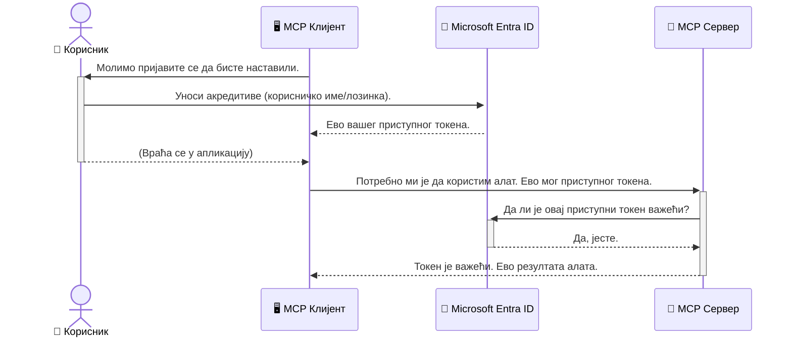

# Осигуравање AI радних токова: Entra ID аутентификација за сервере протокола контекста модела

## Увод
Осигуравање вашег сервера протокола контекста модела (MCP) је толико важно колико и закључавање главних врата вашег дома. Остављање MCP сервера отвореним излаже ваше алате и податке неовлашћеном приступу, што може довести до безбедносних пропуста. Microsoft Entra ID пружа робусно решење за управљање идентитетима и приступом у облаку, помажући да само овлашћени корисници и апликације могу да комуницирају са вашим MCP сервером. У овом одељку ћете научити како да заштитите своје AI радне токове користећи Entra ID аутентификацију.

## Циљеви учења
До краја овог одељка моћи ћете да:

- Разумете важност осигуравања MCP сервера.
- Објасните основе Microsoft Entra ID и OAuth 2.0 аутентификације.
- Препознате разлику између јавних и поверљивих клијената.
- Имплементирате Entra ID аутентификацију у локалним (јавни клијент) и удаљеним (поверљиви клијент) сценаријима MCP сервера.
- Примените безбедносне најбоље праксе приликом развоја AI радних токова.

## Безбедност и MCP

Као што не бисте оставили главна врата свог дома откључана, не бисте требали оставити свој MCP сервер отворен за приступ било коме. Осигуравање ваших AI радних токова је неопходно за изградњу робусних, поузданих и безбедних апликација. Ово поглавље ће вас упознати са коришћењем Microsoft Entra ID за осигуравање ваших MCP сервера, обезбеђујући да само овлашћени корисници и апликације могу да комуницирају са вашим алатима и подацима.

## Зашто безбедност значи за MCP сервере

Замислите да ваш MCP сервер има алат који може слати е-поруке или приступити бази података клијената. Несигуран сервер значи да било ко потенцијално може користити тај алат, што доводи до неовлашћеног приступа подацима, спамова или других злонамерних активности.

Имплементирањем аутентификације обезбеђујете да сваки захтев упућен вашем серверу буде верификован, потврђујући идентитет корисника или апликације која захтев шаље. Ово је први и најкритичнији корак у осигуравању ваших AI радних токова.

## Увод у Microsoft Entra ID

[**Microsoft Entra ID**](https://adoption.microsoft.com/microsoft-security/entra/) је услуга за управљање идентитетом и приступом заснована на облаку. Замислите га као универзалног чувара безбедности за ваше апликације. Он обрађује сложен процес провере идентитета корисника (аутентификацију) и одлучивања шта им је дозвољено (ауторизацију).

Користећи Entra ID, можете:

- Омогућити безбедно пријављивање корисника.
- Заштитити API-је и сервисе.
- Управљати политиком приступа са централизованог места.

За MCP сервере, Entra ID пружа поуздано и широко прихваћено решење за управљање тиме ко може приступити могућностима вашег сервера.

---

## Разумевање магије: како Entra ID аутентификација функционише

Entra ID користи отворене стандарде попут **OAuth 2.0** за управљање аутентификацијом. Иако детаљи могу бити сложени, основни концепт је једноставан и може се разумети кроз аналогију.

### Љубазан увод у OAuth 2.0: Валејт Кључ

Замислите OAuth 2.0 као услугу парковача за ваш ауто. Када стигнете у ресторан, не дајете парковачу свој главни кључ. Уместо тога, дајете **валејт кључ** који има ограничена овлашћења — може да покрене ауто и закључа врата, али не може да отвори пртљажник или боксер за рукавице.

У овој аналогији:

- **Ви** сте **Корисник**.
- **Ваш ауто** је **MCP сервер** са својим вредним алатима и подацима.
- **Парковач** је **Microsoft Entra ID**.
- **Паркератна особа** је **MCP клијент** (апликација која покушава да приступи серверу).
- **Валејт кључ** је **Access Token**.

Access токен је безбедан низ текста који MCP клијент добија од Entra ID након што се пријавите. Клијент затим овај токен представља MCP серверу при сваком захтеву. Сервер може проверити токен како би се уверио да је захтев легитиман и да клијент има потребна овлашћења, све то без потребе да управља вашим стварним акредитивима (попут лозинке).

### Ток аутентификације

Ево како процес функционише у пракси:



### Упознавање са Microsoft Authentication Library (MSAL)

Пре него што пређемо на код, важно је представити кључну компоненту коју ћете видети у примерима: **Microsoft Authentication Library (MSAL)**.

MSAL је библиотека коју је развио Microsoft и која значајно олакшава програмерима управљање аутентификацијом. Уместо да ви пишете сав сложени код за управљање безбедносним токенима, пријавама и освежавањем сесија, MSAL обавља сав тај тежак посао.

Препоручује се коришћење библиотеке као што је MSAL зато што:

- **Безбедна је:** Имплементира индустријске протоколе и безбедносне најбоље праксе, смањујући ризик од рањивости у вашем коду.
- **Поједностављује развој:** Абстрахује сложеност OAuth 2.0 и OpenID Connect протокола, омогућавајући вам да додате снажну аутентификацију у апликацију уз само неколико линија кода.
- **Одржава се:** Microsoft активно одржава и ажурира MSAL да би одговорио на нове безбедносне претње и промене платформи.

MSAL подржава велики број језика и оквира за апликације, укључујући .NET, JavaScript/TypeScript, Python, Java, Go и мобилне платформе као што су iOS и Android. То значи да можете користити исте образце аутентификације кроз цео ваш технолошки стек.

За више информација о MSAL, можете погледати званичну [MSAL overview документацију](https://learn.microsoft.com/entra/identity-platform/msal-overview).

---

## Осигуравање вашег MCP сервера са Entra ID: корак по корак водич

Сада, хајде да прођемо кроз процес осигуравања локалног MCP сервера (који комуницира преко `stdio`) користећи Entra ID. Овај пример користи **јавног клијента**, што је прикладно за апликације које раде на корисниковом уређају, као што је десктоп апликација или локални развојни сервер.

### Сценарио 1: Осигуравање локалног MCP сервера (са јавним клијентом)

У овом сценарију, погледаћемо MCP сервер који ради локално, комуницира преко `stdio`, и користи Entra ID за аутентификацију корисника пре него што омогући приступ својим алатима. Сервер ће имати један алат који преузима информације о профилу корисника из Microsoft Graph API-ја.

#### 1. Постављање апликације у Entra ID

Пре писања кода, потребно је да региструјете своју апликацију у Microsoft Entra ID. Ово говори Entra ID-у о вашој апликацији и даје јој овлашћење да користи услугу аутентификације.

1. Идите на **[Microsoft Entra портал](https://entra.microsoft.com/)**.
2. Идите на **App registrations** и кликните **New registration**.
3. Дайте својој апликацији име (нпр. "My Local MCP Server").
4. За **Supported account types** изаберите **Accounts in this organizational directory only**.
5. Можете оставити **Redirect URI** празан за овај пример.
6. Кликните **Register**.

Када је регистрација завршена, запишите **Application (client) ID** и **Directory (tenant) ID**. Биће вам потребни у вашем коду.

#### 2. Код: Разлагање

Погледајмо главне делове кода који рукују аутентификацијом. Потпуни код за овај пример налази се у фасцикли [Entra ID - Local - WAM](https://github.com/Azure-Samples/mcp-auth-servers/tree/main/src/entra-id-local-wam) у репозиторијуму [mcp-auth-servers на GitHub-у](https://github.com/Azure-Samples/mcp-auth-servers).

**`AuthenticationService.cs`**

Ова класа је одговорна за руковање интеракцијом са Entra ID.

- **`CreateAsync`**: Ова метода иницијализује `PublicClientApplication` из MSAL библиотеке. Конфигурисана је са `clientId` и `tenantId` ваше апликације.
- **`WithBroker`**: Омогућава коришћење брокера (као што је Windows Web Account Manager), што пружа сигурније и брже искуство једноструког пријављивања (SSO).
- **`AcquireTokenAsync`**: Главна метода. Прво покушава да добије токен тихо (што значи да корисник неће морати поново да се пријављује ако већ има валидну сесију). Ако тихи метод не успе, кориснику ће бити приказан интерактивни екран за пријаву.

```csharp
// Simplified for clarity
public static async Task<AuthenticationService> CreateAsync(ILogger<AuthenticationService> logger)
{
    var msalClient = PublicClientApplicationBuilder
        .Create(_clientId) // Your Application (client) ID
        .WithAuthority(AadAuthorityAudience.AzureAdMyOrg)
        .WithTenantId(_tenantId) // Your Directory (tenant) ID
        .WithBroker(new BrokerOptions(BrokerOptions.OperatingSystems.Windows))
        .Build();

    // ... cache registration ...

    return new AuthenticationService(logger, msalClient);
}

public async Task<string> AcquireTokenAsync()
{
    try
    {
        // Try silent authentication first
        var accounts = await _msalClient.GetAccountsAsync();
        var account = accounts.FirstOrDefault();

        AuthenticationResult? result = null;

        if (account != null)
        {
            result = await _msalClient.AcquireTokenSilent(_scopes, account).ExecuteAsync();
        }
        else
        {
            // If no account, or silent fails, go interactive
            result = await _msalClient.AcquireTokenInteractive(_scopes).ExecuteAsync();
        }

        return result.AccessToken;
    }
    catch (Exception ex)
    {
        _logger.LogError(ex, "An error occurred while acquiring the token.");
        throw; // Optionally rethrow the exception for higher-level handling
    }
}
```

**`Program.cs`**

Овде се поставља MCP сервер и интегрише аутентификациона служба.

- **`AddSingleton<AuthenticationService>`**: Региструје `AuthenticationService` у dependency injection контејнеру, тако да други делови апликације (као наш алат) могу да га користе.
- **`GetUserDetailsFromGraph` алат**: Овај алат захтева инстанцу `AuthenticationService`. Пре него што нешто уради, позива `authService.AcquireTokenAsync()` да добије валидан access токен. Ако је аутентификација успешна, користи токен да позове Microsoft Graph API и преузме корисничке детаље.

```csharp
// Simplified for clarity
[McpServerTool(Name = "GetUserDetailsFromGraph")]
public static async Task<string> GetUserDetailsFromGraph(
    AuthenticationService authService)
{
    try
    {
        // This will trigger the authentication flow
        var accessToken = await authService.AcquireTokenAsync();

        // Use the token to create a GraphServiceClient
        var graphClient = new GraphServiceClient(
            new BaseBearerTokenAuthenticationProvider(new TokenProvider(authService)));

        var user = await graphClient.Me.GetAsync();

        return System.Text.Json.JsonSerializer.Serialize(user);
    }
    catch (Exception ex)
    {
        return $"Error: {ex.Message}";
    }
}
```

#### 3. Како све заједно функционише

1. Када MCP клијент покуша да користи алат `GetUserDetailsFromGraph`, алат прво позива `AcquireTokenAsync`.
2. `AcquireTokenAsync` покреће MSAL библиотеку да провери валидан токен.
3. Ако није пронађен валидан токен, MSAL преко брокера ће тражити од корисника да се интерактивно пријави својим Entra ID налогом.
4. Након пријаве, Entra ID издаје access токен.
5. Алат добија токен и користи га за безбедан позив Microsoft Graph API-ју.
6. Детаљи о кориснику се враћају MCP клијенту.

Овај процес обезбеђује да само аутентификовани корисници могу користити алат, ефикасно осигуравајући ваш локални MCP сервер.

### Сценарио 2: Осигуравање удаљеног MCP сервера (са поверљивим клијентом)

Када ваш MCP сервер ради на удаљеном рачунару (попут облачног сервера) и комуницира преко протокола као што је HTTP Streaming, безбедносни захтеви су другачији. У овом случају требало би да користите **поверљивог клијента** и **Authorization Code Flow**. Ово је сигурнија метода јер се тајне апликације никада не излажу прегледачу.

Овај пример користи TypeScript базиран MCP сервер који користи Express.js за руковање HTTP захтевима.

#### 1. Постављање апликације у Entra ID

Постављање у Entra ID је слично као и код јавног клијента, али са једном битном разликом: потребно је да направите **client secret**.

1. Идите на **[Microsoft Entra портал](https://entra.microsoft.com/)**.
2. У својој регистрацији апликације идите на таб **Certificates & secrets**.
3. Кликните **New client secret**, дајте му опис и кликните **Add**.
4. **Важно:** Одмах копирајте вредност секрета. Невероватно је да је више нећете видети.
5. Такође треба да конфигуришете **Redirect URI**. Идите на таб **Authentication**, кликните **Add a platform**, изаберите **Web** и унесите redirect URI за своју апликацију (нпр. `http://localhost:3001/auth/callback`).

> **⚠️ Важно безбедносно упозорење:** За продукционе апликације, Microsoft снажно препоручује коришћење **аутентификације без тајни** као што су **Managed Identity** или **Workload Identity Federation** уместо client secrets. Client secrets носе безбедносне ризике јер могу бити изложени или компромитовани. Managed identities пружају сигурнији приступ елиминишући потребу за чувањем акредитива у вашем коду или конфигурацији.
>
> За више информација о managed identities и како их имплементирати, погледајте [Pregled managed identities for Azure resources](https://learn.microsoft.com/entra/identity/managed-identities-azure-resources/overview).

#### 2. Код: Разлагање

Овај пример користи приступ заснован на сесијама. Када се корисник аутентификује, сервер сачува access токен и refresh токен у сесији и даје кориснику session token. Овај session token се користи за наредне захтеве. Потпуни код за овај пример налази се у фасцикли [Entra ID - Confidential client](https://github.com/Azure-Samples/mcp-auth-servers/tree/main/src/entra-id-cca-session) у репозиторијуму [mcp-auth-servers на GitHub-у](https://github.com/Azure-Samples/mcp-auth-servers).

**`Server.ts`**

Овај фајл поставља Express сервер и MCP transport layer.

- **`requireBearerAuth`**: Ово је middleware који штити ендпоинте `/sse` и `/message`. Проверава валидан bearer token у `Authorization` заглављу захтева.
- **`EntraIdServerAuthProvider`**: Ово је прилагођена класа која имплементира интерфејс `McpServerAuthorizationProvider`. Одговорна је за руковање OAuth 2.0 током.
- **`/auth/callback`**: Овај ендпоинт обрађује redirect са Entra ID након што се корисник аутентификује. Обавља размену authorization кода за access токен и refresh токен.

```typescript
// Поједностављено ради јасноће
const app = express();
const { server } = createServer();
const provider = new EntraIdServerAuthProvider();

// Заштитите SSE крајњу тачку
app.get("/sse", requireBearerAuth({
  provider,
  requiredScopes: ["User.Read"]
}), async (req, res) => {
  // ... повежите се са транспортом ...
});

// Заштитите крајњу тачку поруке
app.post("/message", requireBearerAuth({
  provider,
  requiredScopes: ["User.Read"]
}), async (req, res) => {
  // ... обрадите поруку ...
});

// Обрадите повратни позив OAuth 2.0
app.get("/auth/callback", (req, res) => {
  provider.handleCallback(req.query.code, req.query.state)
    .then(result => {
      // ... обрадите успех или неуспех ...
    });
});
```

**`Tools.ts`**

Овај фајл дефинише алате које MCP сервер пружа. Алат `getUserDetails` је сличан оном из претходног примера, али добија access токен из сесије.

```typescript
// Поједностављено ради јасноће
server.setRequestHandler(CallToolRequestSchema, async (request) => {
  const { name } = request.params;
  const context = request.params?.context as { token?: string } | undefined;
  const sessionToken = context?.token;

  if (name === ToolName.GET_USER_DETAILS) {
    if (!sessionToken) {
      throw new AuthenticationError("Authentication token is missing or invalid. Ensure the token is provided in the request context.");
    }

    // Узми Entra ID токен из продавнице сесија
    const tokenData = tokenStore.getToken(sessionToken);
    const entraIdToken = tokenData.accessToken;

    const graphClient = Client.init({
      authProvider: (done) => {
        done(null, entraIdToken);
      }
    });

    const user = await graphClient.api('/me').get();

    // ... врати детаље корисника ...
  }
});
```

**`auth/EntraIdServerAuthProvider.ts`**

Ова класа управља логиком за:

- Преусмеравање корисника на Entra ID страницу за пријаву.
- Размену authorization кода за access токен.
- Складиштење токена у `tokenStore`.
- Освежавање access токена када истекне.

#### 3. Како све заједно функционише

1. Када се корисник први пут покуша повезати са MCP сервером, `requireBearerAuth` middleware ће уочити да нема валидну сесију и преусмериће га на Entra ID страницу за пријаву.
2. Корисник се пријављује својим Entra ID налогом.
3. Entra ID преусмерава корисника назад на крајњу тачку `/auth/callback` са кодом за ауторизацију.
4. Сервер замењује код за приступни токен и освежавајући токен, чува их и креира сесијски токен који се шаље клијенту.
5. Клијент сада може користити овај сесијски токен у заглављу `Authorization` за све будуће захтеве ка MCP серверу.
6. Када се позове алат `getUserDetails`, он користи сесијски токен да потражи Entra ID приступни токен, а затим га користи за позив Microsoft Graph API-ја.

Овај ток је сложенији од тока јавног клијента, али је потребан за крајње тачке које су изложене интернету. Пошто су удаљени MCP сервери доступни преко јавног интернета, потребне су јаче мере безбедности заштите од неовлашћеног приступа и потенцијалних напада.


## Најбоље безбедносне праксе

- **Увек користите HTTPS**: Енкриптујте комуникацију између клијента и сервера како бисте заштитили токене од пресретања.
- **Имплементирајте контролу приступа засновану на улогама (RBAC)**: Не проверавајте само *да ли* је корисник аутентификован; проверавајте *шта* има овлашћење да ради. Можете дефинисати улоге у Entra ID и проверавати их у вашем MCP серверу.
- **Мониторинг и аудит**: Логирајте све догађаје аутентификације како бисте могли открити и реаговати на сумњиве активности.
- **Обрада ограничења учесталости и пропусности**: Microsoft Graph и други API-ји имплементирају ограничења учесталости како би се спречила злоупотреба. Имплементирајте експоненцијалну паузу и логику поновног покушаја у вашем MCP серверу да бисте лепо обрадили HTTP 429 (Превише захтева) одговоре. Размотрите кеширање често приступаних података ради смањења броја API позива.
- **Сигурно чување токена**: Складиштите приступне токене и освежавајуће токене безбедно. За локалне апликације користите сигурне системе за складиштење. За серверске апликације размотрите коришћење енкриптованог складишта или услуге за управљање кључевима као што је Azure Key Vault.
- **Обрада истека токена**: Приступни токени имају ограничен рок трајања. Имплементирајте аутоматско освежавање токена коришћењем освежавајућих токена како бисте одржали непрекинут кориснички доживљај без потребе поновне аутентификације.
- **Размотрите коришћење Azure API Management**: Док имплементирање безбедности директно у вашем MCP серверу пружа прецизну контролу, API Gateway-ји као што је Azure API Management могу аутоматски обрадити многе од ових безбедносних питања, укључујући аутентификацију, овлашћење, ограничење учесталости и мониторинг. Они пружају централизирану безбедносну слојницу између ваших клијената и MCP сервера. За више детаља о коришћењу API Gateway-ја са MCP-ом, погледајте наш [Azure API Management Your Auth Gateway For MCP Servers](https://techcommunity.microsoft.com/blog/integrationsonazureblog/azure-api-management-your-auth-gateway-for-mcp-servers/4402690).


## Кључни закључци

- Заштићеност вашег MCP сервера је кључна за заштиту ваших података и алата.
- Microsoft Entra ID пружа поуздано и скалабилно решење за аутентификацију и овлашћење.
- Користите **јавног клијента** за локалне апликације и **поверљивог клијента** за удаљене сервере.
- **Authorization Code Flow** је најсигурнија опција за веб апликације.


## Вежба

1. Размислите о MCP серверу који бисте могли направити. Да ли би то био локални или удаљени сервер?
2. На основу вашег одговора, да ли бисте користили јавно или поверљиво клијентско подешавање?
3. Коју дозволу би ваш MCP сервер захтевао за извођење операција према Microsoft Graph?


## Практичне вежбе

### Вежба 1: Региструјте апликацију у Entra ID
Пређите у Microsoft Entra портал.
Региструјте нову апликацију за ваш MCP сервер.
Забележите Application (client) ID и Directory (tenant) ID.

### Вежба 2: Осигурање локалног MCP сервера (јавни клијент)
- Пратите пример кода за интеграцију MSAL (Microsoft Authentication Library) за аутентификацију корисника.
- Тестирајте ток аутентификације позивом MCP алата који преузима корисничке податке из Microsoft Graph.

### Вежба 3: Осигурање удаљеног MCP сервера (поверљиви клијент)
- Региструјте поверљивог клијента у Entra ID и креирајте client secret.
- Конфигуришите ваш Express.js MCP сервер да користи Authorization Code Flow.
- Тестирајте заштићене крајње тачке и потврдите приступ заснован на токенима.

### Вежба 4: Примените најбоље безбедносне праксе
- Омогућите HTTPS за локални или удаљени сервер.
- Имплементирајте контролу приступа засновану на улогама (RBAC) у логици сервера.
- Додајте обраду истека токена и сигурно чување токена.

## Ресурси

1. **Документација о MSAL прегледу**  
   Сазнајте како Microsoft Authentication Library (MSAL) омогућава безбедно добијање токена преко платформи:  
   [MSAL Overview on Microsoft Learn](https://learn.microsoft.com/en-gb/entra/msal/overview)

2. **Azure-Samples/mcp-auth-servers GitHub Репозиторијум**  
   Референце имплементације MCP сервера које демонстрирају токове аутентификације:  
   [Azure-Samples/mcp-auth-servers on GitHub](https://github.com/Azure-Samples/mcp-auth-servers)

3. **Преглед Managed Identities за Azure ресурсе**  
   Схватите како елиминисати тајне коришћењем системски или кориснички додељених управљаних идентитета:  
   [Managed Identities Overview on Microsoft Learn](https://learn.microsoft.com/en-us/entra/identity/managed-identities-azure-resources/)

4. **Azure API Management: Your Auth Gateway for MCP Servers**  
   Детаљан преглед коришћења APIM као безбедног OAuth2 gateway-а за MCP сервере:  
   [Azure API Management Your Auth Gateway For MCP Servers](https://techcommunity.microsoft.com/blog/integrationsonazureblog/azure-api-management-your-auth-gateway-for-mcp-servers/4402690)

5. **Референце дозвола за Microsoft Graph**  
   Комплетна листа делегираних и апликацијских дозвола за Microsoft Graph:  
   [Microsoft Graph Permissions Reference](https://learn.microsoft.com/zh-tw/graph/permissions-reference)


## Резултати учења
Након завршетка овог дела, моћи ћете да:

- Објасните зашто је аутентификација критична за MCP сервере и AI радне токове.
- Подесите и конфигуришете Entra ID аутентификацију за локалне и удаљене MCP серверске сценарије.
- Изаберете одговарајући тип клијента (јавни или поверљиви) у зависности од имплементације вашег сервера.
- Имплементирате безбедне програмске праксе, укључујући чување токена и овлашћење засновано на улогама.
- Са поверењем заштитите ваш MCP сервер и његове алате од неовлашћеног приступа.

## Шта следи

- [5.13 Model Context Protocol (MCP) интеграција са Microsoft Foundry](../mcp-foundry-agent-integration/README.md)

---

<!-- CO-OP TRANSLATOR DISCLAIMER START -->
**Изјава о одрицању одговорности**:
Овај документ је преведен коришћењем услуге за аутоматски превод [Co-op Translator](https://github.com/Azure/co-op-translator). Иако тежимо тачности, имајте у виду да аутоматски преводи могу садржати грешке или нетачности. Оригинални документ на његовом изворном језику треба сматрати ауторитативним извором. За критичне информације препоручује се професионални људски превод. Нисмо одговорни за било каква неспоразума или погрешна тумачења која произилазе из коришћења овог превода.
<!-- CO-OP TRANSLATOR DISCLAIMER END -->