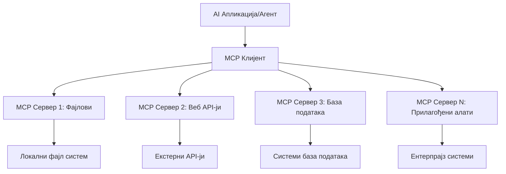

# 🌐 Модул 2: MCP са Microsoft Foundry Toolkit Основама

[]()
[]()
[]()

## 📋 Циљеви учења

До краја овог модула моћи ћете:
- ✅ Разумети архитектуру и предности протокола контекста модела (MCP)
- ✅ Истражити екосистем Microsoft-ових MCP сервера
- ✅ Интегрисати MCP сервере са Microsoft Foundry Toolkit Agent Builder-ом
- ✅ Креирати функционалног агента за аутоматизацију прегледача користећи Playwright MCP
- ✅ Конфигурисати и тестирати MCP алате унутар ваших агената
- ✅ Извозити и распоредити агенте засноване на MCP за производну употребу

## 🎯 Наставак на Модул 1

У Модулу 1 савладали смо основне појмове Microsoft Foundry Toolkit-а и направили првог Python агента. Сада ћемо **појачати** ваше агенте повезивањем са спољним алатима и услугама путем револуционарног **Model Context Protocol (MCP)**.

Замислите ово као надоградњу са основног калкулатора на комплетан рачунар - ваши AI агенти ће добити могућност да:
- 🌐 Прегледају и интерагују са веб сајтовима
- 📁 Приступају и манипулишу датотекама
- 🔧 Интегришу се са предузећким системима
- 📊 Обрађују податке у реалном времену из API-ја

## 🧠 Разумевање протокола контекста модела (MCP)

### 🔍 Шта је MCP?

Model Context Protocol (MCP) је **"USB-C за AI апликације"** - револуционарни отворени стандард који повезује Велике Језичке Моделе (LLM) са спољним алатима, изворима података и услугама. Као што је USB-C уклонио неред од каблова обезбеђујући један универзални конектор, MCP укида сложеност AI интеграција једним стандардизованим протоколом.

### 🎯 Проблем који MCP решава

**Пре MCP-а:**
- 🔧 Прилагођене интеграције за сваки алат
- 🔄 Закључавање код провајдера са сопственим решењима  
- 🔒 Безбедносне рањивости услед ad-hoc веза
- ⏱️ Месеци развоја за основне интеграције

**Са MCP-ом:**
- ⚡ Интеграција алата спремна за употребу
- 🔄 Провајдер-агностићка архитектура
- 🛡️ Уграђене најбоље безбедносне праксе
- 🚀 Минуте до додавања нових могућности

### 🏗️ Дубински преглед MCP архитектуре

MCP следи **архитектуру клијент-сервер** која креира сигуран, скалабилан екосистем:



**🔧 Основне компоненте:**

| Компонента | Улога | Примери |
|-----------|------|----------|
| **MCP Hosts** | Апликације које користе MCP услуге | Claude Desktop, VS Code, Microsoft Foundry Toolkit |
| **MCP Clients** | Руководиоци протоколом (1:1 са серверима) | Уграђени у хост апликације |
| **MCP Servers** | Излажу могућности преко стандардног протокола | Playwright, Files, Azure, GitHub |
| **Transport Layer** | Начини комуникације | stdio, HTTP, WebSockets |


## 🏢 Microsoft-ов MCP екосистем сервера

Microsoft предњачи у MCP екосистему нудећи обиман скуп сервера предузећног нивоа који покривају стварне пословне потребе.

### 🌟 Истакнути Microsoft MCP сервери

#### 1. ☁️ Azure MCP сервер
**🔗 Репозиторијум**: [azure/azure-mcp](https://github.com/azure/azure-mcp)
**🎯 Намена**: Комплетно управљање Azure ресурсима са AI интеграцијом

**✨ Кључне функције:**
- Декларативна провизија инфраструктуре
- Мониторинг ресурса у реалном времену
- Препоруке за оптимизацију трошкова
- Провера усаглашености безбедности

**🚀 Коришћење:**
- Infrastructure-as-Code уз AI помоћ
- Аутоматско скалирање ресурса
- Оптимизација трошкова облака
- Аутоматизација DevOps процеса

#### 2. 📊 Microsoft Dataverse MCP
**📚 Документација**: [Microsoft Dataverse Integration](https://go.microsoft.com/fwlink/?linkid=2320176)
**🎯 Намена**: Природан језички интерфејс за пословне податке

**✨ Кључне функције:**
- Природни језички упити ка бази података
- Разумевање пословног контекста
- Прилагођени шаблони за упите
- Управљање пословним подацима

**🚀 Коришћење:**
- Извештавање пословне интелигенције
- Анализа података клијената
- Инсайти о продајним приливима
- Упити о усаглашености података

#### 3. 🌐 Playwright MCP сервер
**🔗 Репозиторијум**: [microsoft/playwright-mcp](https://github.com/microsoft/playwright-mcp)
**🎯 Намена**: Аутоматизација прегледача и веб интеракција

**✨ Кључне функције:**
- Крос-прегледачка аутоматизација (Chrome, Firefox, Safari)
- Интелигентно препознавање елемената
- Креирање снимака екрана и PDF-а
- Праћење мрежног саобраћаја

**🚀 Коришћење:**
- Аутоматизовани тестови
- Веб скрејпинг и екстракција података
- Надзор UI/UX
- Аутоматизација конкурентске анализе

#### 4. 📁 Files MCP сервер
**🔗 Репозиторијум**: [microsoft/files-mcp-server](https://github.com/microsoft/files-mcp-server)
**🎯 Намена**: Интелигентне операције са датотечним системом

**✨ Кључне функције:**
- Декларативно управљање датотекама
- Синхронизација садржаја
- Интеграција контроле верзија
- Извлачење метаподатака

**🚀 Коришћење:**
- Управљање документацијом
- Организација кода у репозиторијумима
- Радни токови за објављивање садржаја
- Обрада датотека у податочним пипелинама

#### 5. 📝 MarkItDown MCP сервер
**🔗 Репозиторијум**: [microsoft/markitdown](https://github.com/microsoft/markitdown)
**🎯 Намена**: Напредна обрада и манипулација Markdown форматом

**✨ Кључне функције:**
- Богато парсирање Markdown-а
- Конверзија формата (MD ↔ HTML ↔ PDF)
- Анализа структуре садржаја
- Обрада шаблона

**🚀 Коришћење:**
- Технички документациони радни токови
- Системи за управљање садржајем
- Генерисање извештаја
- Аутоматизација базе знања

#### 6. 📈 Clarity MCP сервер
**📦 Пакет**: [@microsoft/clarity-mcp-server](https://www.npmjs.com/package/@microsoft/clarity-mcp-server)
**🎯 Намена**: Веб аналитика и увиди у корисничко понашање

**✨ Кључне функције:**
- Анализа топлотних мапа
- Снимање корисничких сесија
- Метрике перформанси
- Анализа конверзионих токова

**🚀 Коришћење:**
- Оптимизација вебсајта
- Истраживање корисничког искуства
- Анализа A/B тестирања
- Табле за пословну интелигенцију

### 🌍 Заједнички екосистем

Поред Microsoft-ових сервера, MCP екосистем обухвата:
- **🐙 GitHub MCP**: Управљање репозиторијумима и анализа кода
- **🗄️ Database MCPs**: Интеграције PostgreSQL, MySQL, MongoDB
- **☁️ Cloud Provider MCPs**: AWS, GCP, Digital Ocean алати
- **📧 Communication MCPs**: Slack, Teams, Email интеграције

## 🛠️ Практична вежба: Креирање агента за аутоматизацију прегледача

**🎯 Циљ пројекта**: Креирати интелигентног агента за аутоматизацију прегледача користећи Playwright MCP сервер који може да прегледа веб сајтове, извуће информације и изврши сложене веб интеракције.

### 🚀 Фаза 1: Постављање основа агента

#### Корак 1: Иницијализација вашег агента
1. **Отворите Microsoft Foundry Toolkit Agent Builder**
2. **Креирајте Новог Агента** са следећом конфигурацијом:
   - **Име**: `BrowserAgent`
   - **Модел**: Изаберите GPT-4o 


### 🔧 Фаза 2: Радни ток интеграције MCP

#### Корак 3: Додавање MCP сервер интеграције
1. **Идите у одељак Алатке** у Agent Builder-у
2. **Кликните на "Додај Алатку"** да отворите мени интеграције
3. **Изаберите "MCP Server"** из доступних опција


**🔍 Разумевање типова алата:**
- **Уграђени алати**: Предконфигурисане Microsoft Foundry Toolkit функције
- **MCP сервери**: Интеграције спољних сервиса
- **Прилагођени API-ји**: Власне сервисне тачке
- **Позивање функција**: Директан приступ функцијама модела

#### Корак 4: Избор MCP сервера
1. **Изаберите опцију "MCP Server"** за наставак


2. **Прегледајте MCP каталог** да бисте истражили доступне интеграције


### 🎮 Фаза 3: Конфигурација Playwright MCP

#### Корак 5: Изаберите и конфигуришите Playwright
1. **Кликните на "Употреби истакнуте MCP сервере"** да приступите Microsoft-овим верификованим серверима
2. **Изаберите "Playwright"** са листе истакнутих
3. **Прихватите задати MCP ID** или прилагодите за своје окружење


#### Корак 6: Омогућите Playwright могућности
**🔑 Критичан корак**: Изаберите **СВЕ** доступне Playwright методе ради максималне функционалности


**🛠️ Основни Playwright алати:**
- **Навигација**: `goto`, `goBack`, `goForward`, `reload`
- **Интеракција**: `click`, `fill`, `press`, `hover`, `drag`
- **Извлачење**: `textContent`, `innerHTML`, `getAttribute`
- **Валидација**: `isVisible`, `isEnabled`, `waitForSelector`
- **Снимање**: `screenshot`, `pdf`, `video`
- **Мрежа**: `setExtraHTTPHeaders`, `route`, `waitForResponse`

#### Корак 7: Провера успешне интеграције
**✅ Индикатори успеха:**
- Сви алати се појављују у интерфејсу Agent Builder-а
- Нема порука о грешкама у панелу за интеграцију
- Статус Playwright сервера приказује "Connected"


**🔧 Решавање уобичајених проблема:**
- **Неуспешна конекција**: Проверите интернет везу и подешавања заштитног зида
- **Недостају алати**: Осигурајте да су све могућности изабране током подешавања
- **Грешке у дозволама**: Проверите да ли VS Code има потребне системске дозволе

### 🎯 Фаза 4: Напредни дизајн упита (prompt engineering)

#### Корак 8: Креирајте интелигентне системске упите
Направите сложене упите који користе све могућности Playwright-а:

```markdown
# Web Automation Expert System Prompt

## Core Identity
You are an advanced web automation specialist with deep expertise in browser automation, web scraping, and user experience analysis. You have access to Playwright tools for comprehensive browser control.

## Capabilities & Approach
### Navigation Strategy
- Always start with screenshots to understand page layout
- Use semantic selectors (text content, labels) when possible
- Implement wait strategies for dynamic content
- Handle single-page applications (SPAs) effectively

### Error Handling
- Retry failed operations with exponential backoff
- Provide clear error descriptions and solutions
- Suggest alternative approaches when primary methods fail
- Always capture diagnostic screenshots on errors

### Data Extraction
- Extract structured data in JSON format when possible
- Provide confidence scores for extracted information
- Validate data completeness and accuracy
- Handle pagination and infinite scroll scenarios

### Reporting
- Include step-by-step execution logs
- Provide before/after screenshots for verification
- Suggest optimizations and alternative approaches
- Document any limitations or edge cases encountered

## Ethical Guidelines
- Respect robots.txt and rate limiting
- Avoid overloading target servers
- Only extract publicly available information
- Follow website terms of service
```

#### Корак 9: Креирајте динамичке корисничке упите
Дизајнирајте упите који демонстрирају различите могућности:

**🌐 Пример веб анализе:**
```markdown
Navigate to github.com/kinfey and provide a comprehensive analysis including:
1. Repository structure and organization
2. Recent activity and contribution patterns  
3. Documentation quality assessment
4. Technology stack identification
5. Community engagement metrics
6. Notable projects and their purposes

Include screenshots at key steps and provide actionable insights.
```


### 🚀 Фаза 5: Извођење и тестирање

#### Корак 10: Покрените прву аутоматизацију
1. **Кликните "Run"** да покренете секвенцу аутоматизације
2. **Пратите извршење у реалном времену**:
   - Chrome прегледач се аутоматски покреће
   - Агент посећује циљани вебсајт
   - Снимци екрана бележе сваки главни корак
   - Резултати анализе се емитују у реалном времену


#### Корак 11: Анализирајте резултате и увиде
Прегледајте свеобухватну анализу у интерфејсу Agent Builder-а:


### 🌟 Фаза 6: Напредне могућности и распоређивање

#### Корак 12: Извези и распореди у продукцију
Agent Builder подржава више опција распореда:


## 🎓 Резиме Модула 2 и следећи кораци

### 🏆 Остварени успех: Мајстор интеграције MCP

**✅ Савладане вештине:**
- [ ] Разумевање MCP архитектуре и предности
- [ ] Навигација Microsoft-овим MCP екосистемом сервера
- [ ] Интеграција Playwright MCP-а са Microsoft Foundry Toolkit-ом
- [ ] Креирање сложених агената за аутоматизацију прегледача
- [ ] Напредни дизајн упита за веб аутоматизацију

### 📚 Додатни ресурси

- **🔗 MCP спецификација**: [Званична документација протокола](https://modelcontextprotocol.io/)
- **🛠️ Playwright API**: [Комплетна референца метода](https://playwright.dev/docs/api/class-playwright)
- **🏢 Microsoft MCP сервери**: [Водич за предузећа](https://github.com/microsoft/mcp-servers)
- **🌍 Заједнички примери**: [Галерија MCP сервера](https://github.com/modelcontextprotocol/servers)

**🎉 Честитамо!** Успешно сте савладали интеграцију MCP и сада можете креирати производно спремне AI агенте са могућностима коришћења спољних алата!


### 🔜 Наставите на следећи модул

Спремни да подигнете ваше MCP вештине на виши ниво? Наставите на **[Модул 3: Напредни развој MCP-а са Microsoft Foundry Toolkit](../lab3/README.md)** где ћете научити како да:
- Креирате своје прилагођене MCP сервере
- Конфигуришете и користите најновији MCP Python SDK
- Подесите MCP Inspector за дебаговање
- Савладате напредне радне токове развоја MCP сервера
- Креирате Weather MCP сервер од нуле

---

<!-- CO-OP TRANSLATOR DISCLAIMER START -->
**Изјава о одрицању одговорности**:
Овај документ је преведен коришћењем услуге за аутоматски превод [Co-op Translator](https://github.com/Azure/co-op-translator). Иако тежимо тачности, имајте у виду да аутоматски преводи могу садржати грешке или нетачности. Оригинални документ на његовом изворном језику треба сматрати ауторитативним извором. За критичне информације препоручује се професионални људски превод. Нисмо одговорни за било каква неспоразума или погрешна тумачења која произилазе из коришћења овог превода.
<!-- CO-OP TRANSLATOR DISCLAIMER END -->