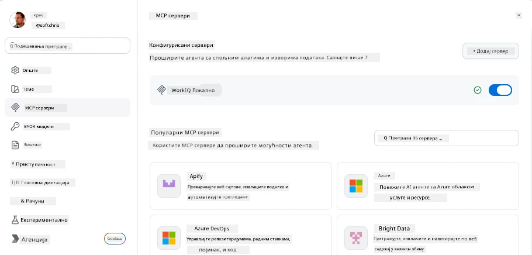
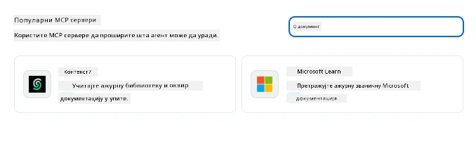
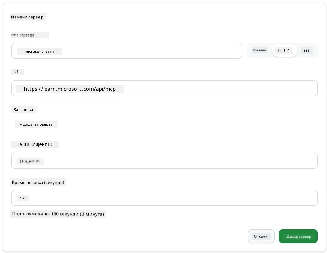
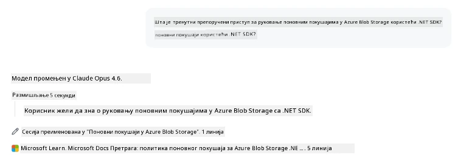
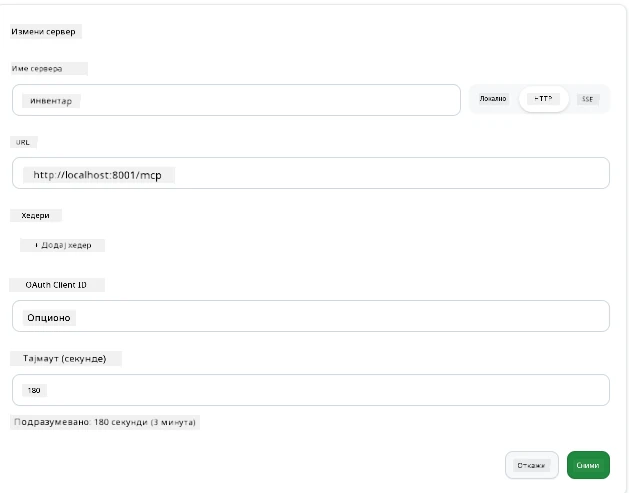
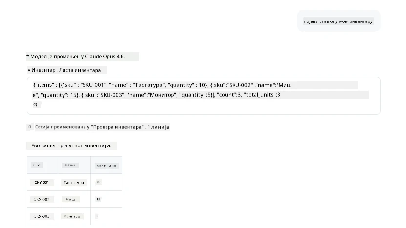
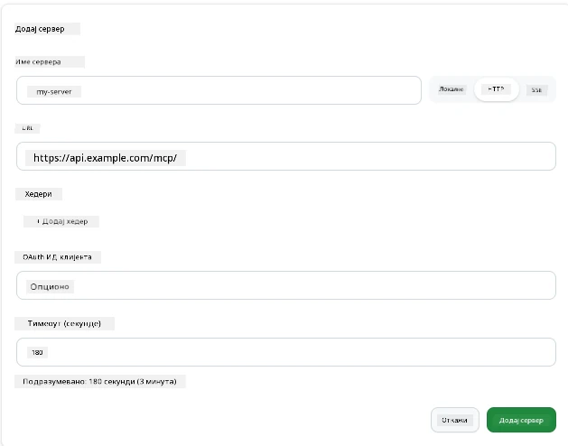
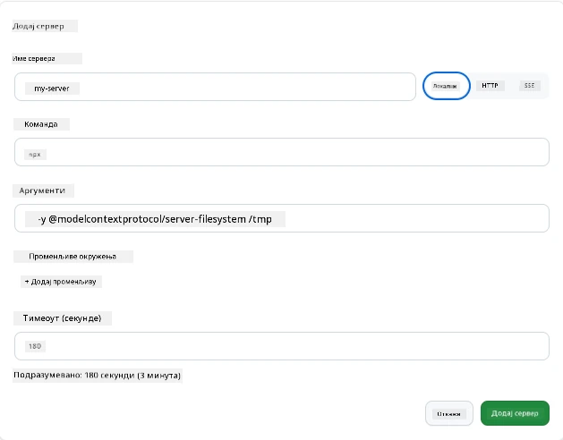

# Коришћење MCP сервера у GitHub Copilot апликацији

До сада знате како MCP функционише. Направили сте сервере, дефинисали алате и ресурсе и повезали клијенте. Оно што још нисмо урадили јесте да променимо перспективу: уместо да ви градите сервер, како изгледа бити на страни *конзумирања* — као корисник апликације са вештачком интелигенцијом која подржава MCP?

[GitHub Copilot Апликација](https://github.com/github/app) је десктоп апликација која може користити MCP сервере. Повезивањем MCP сервера са њом, откључавате нови ниво: Copilot може сада да дохвати вашу документацију, позове ваше интерне API-је, упита вашу базу података или комуницира са било којом услугом коју сте имплементирали у сервер. Апликација постаје домаћин; ваши MCP сервери постају њени алати.

Овај водич ће вас провести кроз то искуство од почетка до краја — од проналаска панела подешавања MCP до повезивања стварног документационог сервера и потом повезивања вашег прилагођеног.

## Циљеви учења

До краја ове лекције, моћи ћете да:

- Пронађете и навигирате MCP Servers панел у подешавањима Copilot апликације.
- Повежете хостовани документациони сервер и користите га у сесији.
- Региструјете прилагођени сервер и проверите да ли Copilot може да позове његове алате.
- Конфигуришете како се сервер позива пружајући или променљиве окружења или прилагођене хедере (ако је HTTP)

## Copilot апликација као MCP домаћин

Основна идеја је: **Copilot-ови агенти су паметни, али знају само оно што им ви кажете.** По дефаулту, агент може читати фајлове у вашој радној области и покретати терминалске команде, али не може упитати вашу базу података, проверити ваш календар или позвати прилагођени API без помоћи. Ту долазе MCP сервери. Они делују као мостови између Copilot-а и ваших система — база података, верзионих контрола, API-ја, алата за дизајн — пружајући агентима приступ информацијама и акцијама које су им потребне за завршетак посла.

Хајде да почнемо проналажењем подешавања за управљање MCP Server-има у апликацији.

## Корак 1: Проналажење MCP панела подешавања

Отворите Copilot апликацију и лоцирајте икону зупчаника у доњем левом углу и кликните на њу.


Уверите се да сте одабрали "MCP Servers" и сада бисте требали видети већ конфигурисане сервере на врху, тржиште популарних сервера на дну, и дугме "Add Server" горе, као у следећем примеру:



Ово је ваш центар за контролу. Овде додате, уклањате, омогућавате или онемогућавате сервере. Промене ступају на снагу у новим сесијама; ако имате отворену сесију, мораћете да покренете нову након измене ове листе.

## Корак 2: Повезивање документационог сервера

Хајде да урадимо нешто одмах корисно. Microsoft Docs MCP сервер даје Copilot-у приступ службеној Microsoft документацији. Ово укључује Azure, .NET, TypeScript и још много тога. Уместо да агент зависи од свог обучавања (које има крајњи датум), може у реалном времену дохватити актуелну документацију.

Ево како да га додате:

1. У мрежи популарних сервера укуцајте **learn** и изаберите сервер "Microsoft Learn".

   

   Када кликнете, појавиће се образац где су име, тип транспорта и URL унапред попуњени, а све што треба да урадите је да кликнете "Add Server".

2. Кликните "Add Server", повезивање са сервером би требало да траје неколико секунди.

   

   Након додавања, сервер ће се појавити у горњем делу као конфигурисани сервер. Хајде да га испробамо следеће.

3. Затворите дијалог и изаберите Quick chat.

4. Укуцајте следећи упит да активирате алат на Microsoft Learn серверу.

   ```text
   What's the current recommended approach for handling Azure Blob Storage 
   retries using the .NET SDK?
   ```

   

Видећете како се позива MCP сервер који смо управо додали.

## Корак 3: Повезивање прилагођеног stdio сервера

Поставке су згодне, али права снага је у повезивању ваших властитих сервера. Рецимо да сте направили сервер (или вам је обезбеђен) који пружа ваш интерни API или базу знања компаније. У овом случају ћемо користити MCP сервер који смо направили и који управља нашим управљањем залихама.

1. Кликните икону зупчаника и поново одаберите "MCP servers".

2. Изаберите дугме "Add Server" и "+ Add Custom server", и унесите следеће вредности:

   - Име: `Inventory Server`
   - Изаберите транспорт (са десне стране), **http**

   Кликните "Add Server" и сервер треба да се појави у вашој листи конфигурисаних сервера.

   

4. Да бисте га тестирали, покрените упит овако:

    ```
    list inventory
    ```

   

   Сада би требало да видите листу ставки из инвентара враћених са вашег прилагођеног сервера.

Одлично, сада би требало да имате добру контролу над додавањем спољних и ваших властитих MCP сервера у Copilot апликацију. Следеће, хајде да разговарамо о руковању тајнама и променљивим окружења.

## Корак 4: Напредна подешавања

Досад сте видели како се додају MCP сервери где бирате само име и URL. Али шта ако вашем серверу треба API кључ или нека друга вредност? У зависности од типа транспорта, можемо му обезбедити шта је потребно.

- **http или SSE транспорт**: Овде можемо подесити хедере по потреби.

   За аутентификацију можете назначити Authorization хедер, на пример. Вредност може бити статички низ. Ако користите OAuth, уместо тога можете унети OAuth client ID.

   

- **stdio транспорт**: Могу се подесити променљиве окружења.

   Овде можете назначити било који број променљивих окружења које сервер треба да прими приликом покретања.

   

## Резиме

Copilot апликација третира MCP сервере као пуноправне екстензије агентових способности. Видео сте цео процес у овој лекцији — од додавања MCP сервера до коришћења у сесији. Сада можете да се повежете на јавне сервере, интерне API-је и прилагођене алате, дајући вашим агентима способност да приступе информацијама и акцијама које су им потребне за аутономно завршавање задатака.

## 📚 Додатни извори

### Званична документација

- [GitHub Copilot Апликација](https://github.com/github/app)
- [MCP Спецификација](https://modelcontextprotocol.io/specification/2025-03-26) - Спецификација Model Context Protocol

### Заједница
- [MCP Community Discord](https://discord.com/invite/ByRwuEEgH4) - Живе дискусије
- [GitHub Discussions](https://github.com/microsoft/MCP-Server-and-PostgreSQL-Sample-Retail/discussions) - Питања и одговори и размена искустава
- [Stack Overflow](https://stackoverflow.com/questions/tagged/model-context-protocol) - Техничка питања

---

<!-- CO-OP TRANSLATOR DISCLAIMER START -->
**Изјава о одрицању одговорности**:
Овај документ је преведен коришћењем услуге за аутоматски превод [Co-op Translator](https://github.com/Azure/co-op-translator). Иако тежимо тачности, имајте у виду да аутоматски преводи могу садржати грешке или нетачности. Оригинални документ на његовом изворном језику треба сматрати ауторитативним извором. За критичне информације препоручује се професионални људски превод. Нисмо одговорни за било каква неспоразума или погрешна тумачења која произилазе из коришћења овог превода.
<!-- CO-OP TRANSLATOR DISCLAIMER END -->