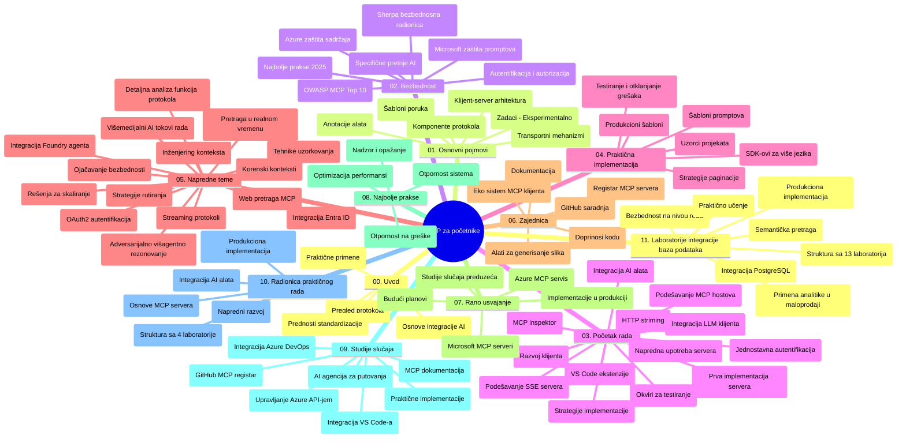

# Протокол модели контекста (MCP) за почетнике - водич за учење

Овај водич за учење даје преглед структуре и садржаја репозиторијума за наставни програм "Протокол модели контекста (MCP) за почетнике". Користите овај водич за ефикасно сналажење у репозиторијуму и максимално коришћење доступних ресурса.

## Преглед репозиторијума

Протокол модела контекста (MCP) је стандардизовани оквир за интеракције између AI модела и клијентских апликација. Првобитно га је створио Anthropic, а сада MCP одржава шире MCP заједница преко званичне GitHub организације. Овај репозиторијум пружа свеобухватан наставни програм са практичним примерима кода у C#, Јава, ЈаваСкрипт, Пајтон и ТајпСкрипт-у, намењен AI програмерима, системским архитекти и софтверским инжењерима.

## Визуелна мапа наставног програма

## Структура репозиторијума

Репозиторијум је организован у једанаест главних секција, од којих се свака фокусира на различите аспекте MCP:

1. **Увод (00-Introduction/)**
   - Преглед Протокола модела контекста
   - Зашто је стандардизација важна у AI процесима
   - Практичне примене и користи

2. **Основни концепти (01-CoreConcepts/)**
   - Клијент-сервер архитектура
   - Кључне компоненте протокола
   - Обрасци слања порука у MCP

3. **Безбедност (02-Security/)**
   - Безбедносне претње у MCP системима
   - Најбоље праксе за обезбеђење имплементација
   - Стратегије аутентификације и ауторизације
   - **Свеобухватна документација о безбедности**:
     - Најбоље праксе безбедности MCP 2025
     - Водич за имплементацију Azure Content Safety
     - Контроле и технике безбедности MCP
     - Брзи референтни водич најбољих пракси MCP
   - **Кључне теме безбедности**:
     - Напади уношења промпта и отровања алата
     - Отмица сесије и проблеми у улози збуњеног заменика
     - Рупе у пропуштању токена
     - Прекомерне дозволе и контроле приступа
     - Безбедност ланца снабдевања AI компоненти
     - Интеграција Microsoft Prompt Shields

4. **Почетак рада (03-GettingStarted/)**
   - Подешавање и конфигурација окружења
   - Креирање основних MCP сервера и клијената
   - Интеграција са постојећим апликацијама
   - Укључује одељке за:
     - Прву имплементацију сервера
     - Развој клијента
     - Интеграцију LLM клијента
     - Интеграцију у VS Code
     - Сервер са Server-Sent Events (SSE)
     - Напредну употребу сервера
     - HTTP стриминг
     - Интеграцију AI Toolkit-а
     - Стратегије тестирања
     - Упутства за деплојмент

5. **Практична имплементација (04-PracticalImplementation/)**
   - Коришћење SDK-ова на различитим програмским језицима
   - Технике отклањања грешака, тестирања и валидације
   - Креирање поново употребљивих шаблона промпта и радних токова
   - Пример пројеката са примерима имплементације

6. **Напредне теме (05-AdvancedTopics/)**
   - Технике инжењерства контекста
   - Интеграција Foundry агента
   - Мулти-модални AI радни токови
   - Оукх2 аутентификацијски демо-и
   - Капацитети претраге у реалном времену
   - Стриминг у реалном времену
   - Имплементација коренских контекста
   - Стратегије рутирања
   - Технике узорковања
   - Приступи скалирању
   - Безбедносне разматрања
   - Интеграција Entra ID безбедности
   - Интеграција веб претраге
   - Адверзаријално мулти-агентско резоновање (образци дебате)

7. **Доприноси заједнице (06-CommunityContributions/)**
   - Како допринети коду и документацији
   - Сарадња преко GitHub-а
   - Повећавања и повратне информације покренуте заједницом
   - Коришћење разних MCP клијената (Claude Desktop, Cline, VSCode)
   - Рад са популарним MCP серверима укључујући генерисање слика

8. **Усвојене лекције из раног периода (07-LessonsfromEarlyAdoption/)**
   - Реалне имплементације и приче о успеху
   - Изградња и деплојмент решења заснованих на MCP
   - Трендови и будућа мапа пута
   - **Водич за Microsoft MCP сервере**: Свеобухватан водич за 10 Microsoft MCP сервера спремних за производњу укључујући:
     - Microsoft Learn Docs MCP Server
     - Azure MCP Server (15+ специјализованих конектора)
     - GitHub MCP Server
     - Azure DevOps MCP Server
     - MarkItDown MCP Server
     - SQL Server MCP Server
     - Playwright MCP Server
     - Dev Box MCP Server
     - Microsoft Foundry MCP Server
     - Microsoft 365 Agents Toolkit MCP Server

9. **Најбоље праксе (08-BestPractices/)**
   - Тунинг перформанси и оптимизација
   - Дизајн MCP система отпорних на недаће
   - Стратегије тестирања и отпорности

10. **Студије случаја (09-CaseStudy/)**
    - **Седам свеобухватних студија случаја** које демонстрирају свестраност MCP у различитим сценаријима:
    - **Azure AI Travel Agents**: Оркестрација више агената са Azure OpenAI и AI претрагом
    - **Интеграција Azure DevOps**: Аутоматизација процеса радног тока са YouTube ажурирањима података
    - **Претраживање документације у реалном времену**: Пајтон конзолни клијент са стриминг HTTP-ом
    - **Интерактивни генерaтор студијског плана**: Chainlit веб апликација са конверзационим AI
    - **Документација у уређивачу**: Интеграција VS Code-а са GitHub Copilot радним токовима
    - **Azure API Management**: Интеграција предузећа API-а креирањем MCP сервера
    - **GitHub MCP Registry**: Развој екосистема и платформа за агентску интеграцију
    - Примери имплементације који обухватају интеграцију предузећа, продуктивност програмера и развој екосистема

11. **Практична радионица (10-StreamliningAIWorkflowsBuildingAnMCPServerWithAIToolkit/)**
    - Свеобухватна практична радионица која комбинује MCP са AI Toolkit-ом
    - Изградња интелигентних апликација које повезују AI моделе са стварним алатима
    - Практични модули који покривају основне појмове, развој прилагођених сервера и стратегије за продукцијски деплојмент
    - **Структура лабораторије**:
      - Лабораторија 1: Основе MCP сервера
      - Лабораторија 2: Напредни развој MCP сервера
      - Лабораторија 3: Интеграција AI Toolkit-а
      - Лабораторија 4: Деплојмент у продукцију и скалирање
    - Приступ учењу заснован на лабораторијским вежбама са корак по корак упутствима

12. **Лабораторије за интеграцију MCP сервера са базом података (11-MCPServerHandsOnLabs/)**
    - **Свеобухватан пут учења од 13 лабораторија** за израду продукцијски спремних MCP сервера са интеграцијом PostgreSQL базе података
    - **Имплементација аналитике у реалном свету у малопродаји** користећи Zava Retail употребни случај
    - **Обрасци нивоа предузећа** који укључују Редни ниво безбедности (Row Level Security, RLS), семантичку претрагу и мулти-тенант приступ подацима
    - **Комплетна структура лабораторија**:
      - **Лабораторије 00-03: Основе** - Увод, Архитектура, Безбедност, Подешавање окружења
      - **Лабораторије 04-06: Изградња MCP сервера** - Дизајн базе података, Имплементација MCP сервера, Развој алата
      - **Лабораторије 07-09: Напредне функције** - Семантичка претрага, Тестирање и отклањање грешака, Интеграција у VS Code
      - **Лабораторије 10-12: Продукција & најбоље праксе** - Деплојмент, Мониторинг, Оптимизација
    - **Обухваћене технологије**: FastMCP фрејмворк, PostgreSQL, Azure OpenAI, Azure Container Apps, Application Insights
    - **Исходи учења**: Продукцијски спремни MCP сервери, обрасци интеграције база података, аналитика подржана AI-јем, безбедност на нивоу предузећа

## Додатни ресурси

Репозиторијум укључује пратеће ресурсе:

- **Фасцикла са сликама**: Садржи дијаграме и илустрације коришћене кроз наставни програм
- **Преводи**: Вишезначна подршка са аутоматизованим преводима документације
- **Званични MCP ресурси**:
  - [MCP документација](https://modelcontextprotocol.io/)
  - [MCP спецификација](https://spec.modelcontextprotocol.io/)
  - [MCP GitHub репозиторijум](https://github.com/modelcontextprotocol)

## Како користити овај репозиторијум

1. **Секвенцијално учење**: Пратите поглавља по реду (од 00 до 11) за структурирано учење.
2. **Фокус на одређени језик**: Ако вас занима одређени програмски језик, истражите фолдере са примерима за имплементације на вашем језику.
3. **Практична имплементација**: Почните са одељком "Почетак рада" да подесите окружење и креирате свој први MCP сервер и клијент.
4. **Напредно истраживање**: Када савладате основе, уроните у напредне теме за проширење знања.
5. **Укључивање заједнице**: Придружите се MCP заједници преко GitHub дискусија и Discord канала да се повежете са стручњацима и другим програмерима.

## MCP клијенти и алати

Наставни програм покрива различите MCP клијенте и алате:

1. **Званични клијенти**:
   - Visual Studio Code
   - MCP у Visual Studio Code-у
   - Claude Desktop
   - Claude у VSCode-у
   - Claude API

2. **Заједнички клијенти**:
   - Cline (терминалски)
   - Cursor (уређивач кода)
   - ChatMCP
   - Windsurf

3. **Алатке за управљање MCP-ом**:
   - MCP CLI
   - MCP Manager
   - MCP Linker
   - MCP Router

## Популарни MCP сервери

Репозиторијум представља различите MCP сервере, укључујући:

1. **Званични Microsoft MCP сервери**:
   - Microsoft Learn Docs MCP Server
   - Azure MCP Server (15+ специјализованих конектора)
   - GitHub MCP Server
   - Azure DevOps MCP Server
   - MarkItDown MCP Server
   - SQL Server MCP Server
   - Playwright MCP Server
   - Dev Box MCP Server
   - Microsoft Foundry MCP Server
   - Microsoft 365 Agents Toolkit MCP Server

2. **Званични референтни сервери**:
   - Filesystem
   - Fetch
   - Memory
   - Sequential Thinking

3. **Генерисање слика**:
   - Azure OpenAI DALL-E 3
   - Stable Diffusion WebUI
   - Replicate

4. **Развојни алати**:
   - Git MCP
   - Terminal Control
   - Code Assistant

5. **Специјализовани сервери**:
   - Salesforce
   - Microsoft Teams
   - Jira & Confluence

## Доприношење

Овај репозиторијум поздравља доприносе заједнице. Погледајте одељак Доприноси заједнице за смернице о ефикасном доприносу MCP екосистему.

----

*Овај водич за учење је последњи пут ажуриран 5. фебруара 2026. године, рефлектујући најновију MCP спецификацију 2025-11-25 и пружа преглед стања репозиторијума на тај датум. Садржај репозиторијума може бити ажуриран након овог датума.*

---

<!-- CO-OP TRANSLATOR DISCLAIMER START -->
**Изјава о одрицању одговорности**:
Овај документ је преведен коришћењем услуге за аутоматски превод [Co-op Translator](https://github.com/Azure/co-op-translator). Иако тежимо тачности, имајте у виду да аутоматски преводи могу садржати грешке или нетачности. Оригинални документ на његовом изворном језику треба сматрати ауторитативним извором. За критичне информације препоручује се професионални људски превод. Нисмо одговорни за било каква неспоразума или погрешна тумачења која произилазе из коришћења овог превода.
<!-- CO-OP TRANSLATOR DISCLAIMER END -->