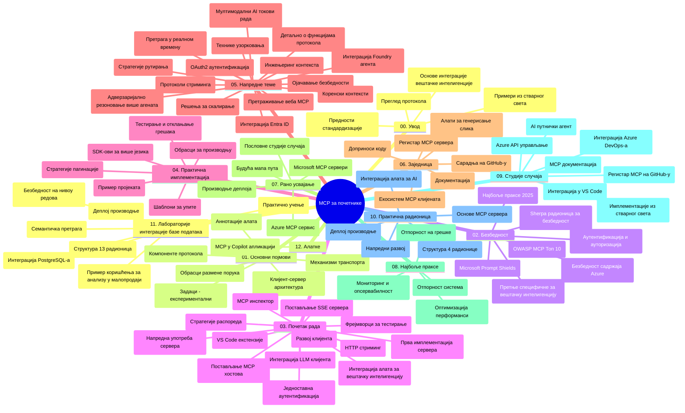

# Протокол контекста модела (MCP) за почетнике - Водич за учење

Овај водич за учење пружа преглед структуре и садржаја репозиторијума за план и програм "Протокол контекста модела (MCP) за почетнике". Користите овај водич да бисте ефикасно навигирали репозиторијумом и максимално искористили доступне ресурсе.

## Преглед репозиторијума

Протокол контекста модела (MCP) је стандардизован оквир за интеракције између AI модела и клијентских апликација. Првобитно га је креирала компанија Anthropic, а сада га одржава шира MCP заједница преко званичне GitHub организације. Овај репозиторијум пружа свеобухватан план и програм са практичним примерима кода на C#, Java, JavaScript, Python и TypeScript, дизајниран за AI програмере, системске архитекте и софтверске инжењере.

## Визуелна мапа програма

## Структура репозиторијума

Репозиторијум је организован у дванаест главних одељка, сваки фокусиран на различите аспекте MCP:

1. **Увод (00-Introduction/)**
   - Преглед протокола контекста модела
   - Зашто стандардизација има значај у AI процесима
   - Практичне примене и користи

2. **Основни појмови (01-CoreConcepts/)**
   - Клијент-сервер архитектура
   - Кључне компоненте протокола
   - Обрасци слања порука у MCP

3. **Безбедност (02-Security/)**
   - Безбедносне претње у системима заснованим на MCP
   - Најбоље праксе за обезбеђење имплементација
   - Стратегије за аутентикацију и ауторизацију
   - **Свеобухватна документација о безбедности**:
     - MCP најбоље безбедносне праксе 2025
     - Водич за имплементацију Azure Content Safety
     - MCP контроле и технике безбедности
     - Брзи преглед најбољих MCP пракси
   - **Кључне безбедносне теме**:
     - Напади убризгавања упита и тровања алата
     - Овлашћење сесије и проблем „збуњеног заменика“
     - Ранљивости токен прослеђивања
     - Прекомерне дозволе и контрола приступа
     - Безбедност ланца снабдевања AI компоненти
     - Интеграција Microsoft Prompt Shields

4. **Почетак рада (03-GettingStarted/)**
   - Постављање и конфигурација окружења
   - Креирање основних MCP сервера и клијената
   - Интеграција са постојећим апликацијама
   - Садржи одељке за:
     - Прву имплементацију сервера
     - Развој клијента
     - Интеграцију LLM клијента
     - Интеграцију у VS Code
     - Server-Sent Events (SSE) сервер
     - Напредну употребу сервера
     - HTTP стриминг
     - Интеграцију AI Toolkit-а
     - Стратегије тестирања
     - Упутства за постављање у продукцију

5. **Практична имплементација (04-PracticalImplementation/)**
   - Коришћење SDK-ова у различитим програмским језицима
   - Технике отклањања грешака, тестирања и валидације
   - Креирање поновно коришћених шаблона упита и радних токова
   - Пример пројеката са примерима имплементације

6. **Напредне теме (05-AdvancedTopics/)**
   - Технике инжењеринга контекста
   - Интеграција Foundry агента
   - Мултимодални AI радни токови
   - Демонстрације OAuth2 аутентификације
   - Реал-тайм претрага
   - Реал-тајм стриминг
   - Имплементација коренских контекста
   - Стратегије рутирања
   - Технике узорковања
   - Приступи скалирању
   - Безбедносне разматрања
   - Интеграција Entra ID безбедности
   - Интеграција веб претраге
   - Мулти-агентско ривалско резоновање (шеме дебате)

7. **Заједнички доприноси (06-CommunityContributions/)**
   - Како допринети коду и документацији
   - Сарадња преко GitHub-а
   - Заједнички покретане надоградње и повратне информације
   - Коришћење разних MCP клијената (Claude Desktop, Cline, VSCode)
   - Рад са популарним MCP серверима укључујући генерисање слика

8. **Услови усвајања (07-LessonsfromEarlyAdoption/)**
   - Имплементације из стварног света и успешне приче
   - Изградња и постављање решења заснованих на MCP
   - Трендови и будућа путања
   - **Водич за Microsoft MCP сервере**: Свеобухватан водич за 10 продукцијски спремних Microsoft MCP сервера укључујући:
     - Microsoft Learn Docs MCP сервер
     - Azure MCP сервер (Више од 15 специјализованих конектора)
     - GitHub MCP сервер
     - Azure DevOps MCP сервер
     - MarkItDown MCP сервер
     - SQL Server MCP сервер
     - Playwright MCP сервер
     - Dev Box MCP сервер
     - Microsoft Foundry MCP сервер
     - Microsoft 365 Agents Toolkit MCP сервер

9. **Најбоље праксе (08-BestPractices/)**
   - Тунинг перформанси и оптимизација
   - Дизајнирање отказоупорних MCP система
   - Стратегије тестирања и отпорности

10. **Студије случаја (09-CaseStudy/)**
    - **Седам свеобухватних студија случаја** које показују разноврсност MCP у различитим сценаријима:
    - **Azure AI Travel Agents**: Оркестрација више агената са Azure OpenAI и AI Search
    - **Azure DevOps интеграција**: Аутоматизација радних токова са ажурирањима података са YouTube-а
    - **Претраживање докумената у реалном времену**: Python конзолн клијент са HTTP стримингом
    - **Интерактивни генератор плана учења**: Chainlit веб апликација са конверзационим AI
    - **Документација у уређивачу**: Интеграција у VS Code са GitHub Copilot радним токовима
    - **Azure API Management**: Интеграција корпоративних API-ја кроз креирање MCP сервера
    - **GitHub MCP Registry**: Развој екосистема и платформа за агенцијску интеграцију
    - Примери имплементација који обухватају корпоративну интеграцију, продуктивност програмера и развој екосистема

11. **Практична радионица (10-StreamliningAIWorkflowsBuildingAnMCPServerWithAIToolkit/)**
    - Свеобухватна практична радионица која комбинује MCP са AI Toolkit-ом
    - Изградња интелигентних апликација које спајају AI моделе са стварним алатима
    - Практични модули покривају основе, развој по мери и стратегије продукцијског постављања
    - **Структура лабораторија**:
      - Лабораторија 1: Основе MCP сервера
      - Лабораторија 2: Напредни развој MCP сервера
      - Лабораторија 3: Интеграција AI Toolkit-а
      - Лабораторија 4: Постављање у продукцију и скалирање
    - Метод учења заснован на лабораторијским задацима са корак по корак упутствима

12. **Лабораторије интеграције MCP сервера са базом података (11-MCPServerHandsOnLabs/)**
    - **Свеобухватан пут учења од 13 лабораторија** за израду продукцијски спремних MCP сервера са интеграцијом PostgreSQL
    - **Имплементација из стварног света у ритейл аналитици** користећи Zava Retail пример
    - **Обрасци класе предузећа** укључујући Редни ниво безбедности (RLS), семантичку претрагу и приступ подацима више закупаца
    - **Комплетна структура лабораторија**:
      - **Лабораторије 00-03: Основе** - Увод, архитектура, безбедност, постављање окружења
      - **Лабораторије 04-06: Изградња MCP сервера** - Дизајн базе података, имплементација MCP сервера, развој алата
      - **Лабораторије 07-09: Напредне функције** - Семантичка претрага, тестирање и отклањање грешака, интеграција у VS Code
      - **Лабораторије 10-12: Производња и најбоље праксе** - Постављање, праћење, оптимизација
    - **Обухваћене технологије**: FastMCP оквир, PostgreSQL, Azure OpenAI, Azure Container Apps, Application Insights
    - **Резултати учења**: Продукцијски спремни MCP сервери, обрасци интеграције база података, AI-покретана аналитика, корпоративна безбедност

13. **Алати (12-tooling/)**
    - Научите како користити MCP у апликацији Copilot и другим алатима

## Додатни ресурси

Репозиторијум укључује подржавајуће ресурсе:

- **Папка са сликама**: Садржи дијаграме и илустрације коришћене током целог програма
- **Преводи**: Подршка за више језика са аутоматизованим преводима документације
- **Званични MCP ресурси**:
  - [MCP документација](https://modelcontextprotocol.io/)
  - [MCP спецификација](https://spec.modelcontextprotocol.io/)
  - [MCP GitHub репозиторијум](https://github.com/modelcontextprotocol)

## Како користити овај репозиторијум

1. **Секвенцијално учење**: Пратите поглавља по реду (од 00 до 11) за структуирано учење.
2. **Фокус на одређени језик**: Уколико вас занима одређени програмски језик, истражите директоријуме са примерима за имплементације на вашем језику.
3. **Практична имплементација**: Почните са одељком "Почетак рада" како бисте поставили окружење и креирали ваш први MCP сервер и клијента.
4. **Напредно истраживање**: Када овладате основама, уроните у напредне теме ради проширења знања.
5. **Учествовање у заједници**: Придружите се MCP заједници кроз GitHub дискусије и Discord канале да бисте се повезали са стручњацима и другим програмерима.

## MCP клијенти и алати

Програм покрива разне MCP клијенте и алате:

1. **Званични клијенти**:
   - Visual Studio Code
   - MCP у Visual Studio Code
   - Claude Desktop
   - Claude у VSCode
   - Claude API

2. **Заједнички клијенти**:
   - Cline (терминалски)
   - Cursor (уређивач кода)
   - ChatMCP
   - Windsurf

3. **Алати за управљање MCP-ом**:
   - MCP CLI
   - MCP Manager
   - MCP Linker
   - MCP Router

## Популарни MCP сервери

Репозиторијум представља различите MCP сервере, укључујући:

1. **Званични Microsoft MCP сервери**:
   - Microsoft Learn Docs MCP сервер
   - Azure MCP сервер (више од 15 специјализованих конектора)
   - GitHub MCP сервер
   - Azure DevOps MCP сервер
   - MarkItDown MCP сервер
   - SQL Server MCP сервер
   - Playwright MCP сервер
   - Dev Box MCP сервер
   - Microsoft Foundry MCP сервер
   - Microsoft 365 Agents Toolkit MCP сервер

2. **Званични референтни сервери**:
   - Фајл систем
   - Fetch
   - Меморија
   - Секвенцијално размишљање

3. **Генерисање слика**:
   - Azure OpenAI DALL-E 3
   - Stable Diffusion WebUI
   - Replicate

4. **Алати за развој**:
   - Git MCP
   - Terminal Control
   - Code Assistant

5. **Специјализовани сервери**:
   - Salesforce
   - Microsoft Teams
   - Jira & Confluence

## Доприноси

Овај репозиторијум поздравља доприносе заједнице. Погледајте одељак Заједнички доприноси за смернице о ефикасном доприносу MCP екосистему.

----

*Овај водич за учење је последњи пут ажуриран 5. фебруара 2026. године, одражавајући најновију MCP спецификацију 2025-11-25 и пружа преглед репозиторијума по том датуму. Садржај репозиторијума може бити ажуриран и након тог датума.*

---

<!-- CO-OP TRANSLATOR DISCLAIMER START -->
**Изјава о одрицању одговорности**:
Овај документ је преведен коришћењем услуге за аутоматски превод [Co-op Translator](https://github.com/Azure/co-op-translator). Иако тежимо тачности, имајте у виду да аутоматски преводи могу садржати грешке или нетачности. Оригинални документ на његовом изворном језику треба сматрати ауторитативним извором. За критичне информације препоручује се професионални људски превод. Нисмо одговорни за било каква неспоразума или погрешна тумачења која произилазе из коришћења овог превода.
<!-- CO-OP TRANSLATOR DISCLAIMER END -->