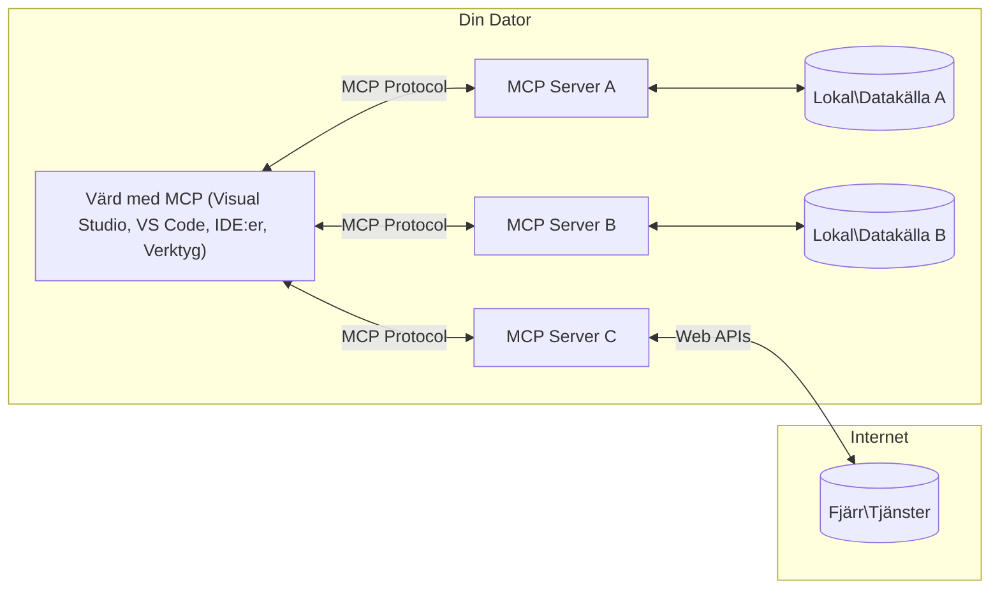

# MCP Core Concepts: Bemästra Model Context Protocol för AI-integration

[](https://youtu.be/earDzWGtE84)

_(Klicka på bilden ovan för att se videon från denna lektion)_

[Model Context Protocol (MCP)](https://github.com/modelcontextprotocol) är ett kraftfullt, standardiserat ramverk som optimerar kommunikationen mellan stora språkmodeller (LLM) och externa verktyg, applikationer och datakällor. 
Denna guide tar dig igenom kärnbegreppen i MCP. Du kommer att lära dig om dess klient-serverarkitektur, grundläggande komponenter, kommunikationsmekanismer och bästa praxis för implementering.

- **Uttryckligt användarsamtycke**: All datatillgång och operationer kräver uttryckligt användargodkännande innan de utförs. Användare måste tydligt förstå vilken data som kommer att nås och vilka åtgärder som kommer att utföras, med detaljerad kontroll över behörigheter och auktorisationer.

- **Skydd av dataintegritet**: Användardata exponeras endast med uttryckligt samtycke och måste skyddas med robusta åtkomstkontroller under hela interaktionscykeln. Implementationer måste förhindra obehörig datatransmission och upprätthålla strikta sekretessgränser.

- **Verktygssäkerhet vid exekvering**: Varje anrop till verktyg kräver uttryckligt användarsamtycke med klar förståelse av verktygets funktionalitet, parametrar och potentiella påverkan. Robusta säkerhetsgränser måste förhindra oavsiktlig, osäker eller skadlig verktygsexekvering.

- **Säkerhet på transportlagret**: Alla kommunikationskanaler ska använda lämpliga krypterings- och autentiseringsmekanismer. Fjärranslutningar ska implementera säkra transportprotokoll och korrekt hantering av autentiseringsuppgifter.

#### Implementationsriktlinjer:

- **Behörighetshantering**: Implementera finmaskiga behörighetssystem som låter användare kontrollera vilka servrar, verktyg och resurser som är åtkomliga
- **Autentisering & Auktorisation**: Använd säkra autentiseringsmetoder (OAuth, API-nycklar) med korrekt tokenhantering och utgångsdatum  
- **Inmatningsvalidering**: Validera alla parametrar och datainmatningar enligt definierade scheman för att förhindra injektionsattacker
- **Revisionsloggning**: Underhåll omfattande loggar över alla operationer för säkerhetsövervakning och regelefterlevnad

## Översikt

Denna lektion utforskar den grundläggande arkitekturen och komponenterna som utgör Model Context Protocol (MCP) ekosystemet. Du kommer att lära dig om klient-serverarkitekturen, nyckelkomponenterna och kommunikationsmekanismerna som möjliggör MCP-interaktioner.

## Viktiga inlärningsmål

Efter denna lektion kommer du att:

- Förstå MCP:s klient-serverarkitektur.
- Identifiera roller och ansvar för Hosts, Clients och Servers.
- Analysera kärnfunktioner som gör MCP till ett flexibelt integrationslager.
- Lära dig hur information flödar inom MCP-ekosystemet.
- Få praktiska insikter genom kodexempel i .NET, Java, Python och JavaScript.

## MCP-arkitektur: En djupare titt

MCP-ekosystemet är uppbyggt på en klient-servermodell. Denna modulära struktur tillåter AI-applikationer att effektivt interagera med verktyg, databaser, API:er och kontextuella resurser. Låt oss bryta ned denna arkitektur i dess kärnkomponenter.

I grunden följer MCP en klient-serverarkitektur där en host-applikation kan ansluta till flera servrar:


- **MCP Hosts**: Program som VSCode, Claude Desktop, IDE:er eller AI-verktyg som vill få tillgång till data via MCP
- **MCP Clients**: Protokollklienter som upprätthåller 1:1-anslutningar med servrar
- **MCP Servers**: Lätta program som vardera exponerar specifika funktioner via det standardiserade Model Context Protocol
- **Lokala datakällor**: Din dators filer, databaser och tjänster som MCP-servrar kan nå säkert
- **Fjärrtjänster**: Externa system tillgängliga över internet som MCP-servrar kan ansluta till via API:er.

MCP-protokollet är en utvecklande standard som använder datum-baserad versionshantering (YYYY-MM-DD-format). Den aktuella protokollversionen är **2025-11-25**. Du kan se de senaste uppdateringarna i [protokollspecifikationen](https://modelcontextprotocol.io/specification/2025-11-25/)

### 1. Hosts

I Model Context Protocol (MCP) är **Hosts** AI-applikationer som fungerar som huvudsakligt gränssnitt genom vilket användare interagerar med protokollet. Hosts koordinerar och hanterar anslutningar till flera MCP-servrar genom att skapa dedikerade MCP-klienter för varje serveranslutning. Exempel på Hosts inkluderar:

- **AI-applikationer**: Claude Desktop, Visual Studio Code, Claude Code
- **Utvecklingsmiljöer**: IDE:er och kodredigerare med MCP-integrering  
- **Anpassade applikationer**: Specialbyggda AI-agenter och verktyg

**Hosts** är program som koordinerar AI-modellinteraktioner. De:

- **Orkestrerar AI-modeller**: Utför eller interagerar med LLMs för att generera svar och koordinera AI-arbetsflöden
- **Hantera klientanslutningar**: Skapar och upprätthåller en MCP-klient per MCP-serveranslutning
- **Styr användargränssnittet**: Hanterar samtalsflöde, användarinteraktioner och presentationssvar  
- **Tillämpa säkerhet**: Kontrollerar behörigheter, säkerhetsbegränsningar och autentisering
- **Hantera användarsamtycke**: Sköter användarens godkännande för datadelning och verktygsexekvering


### 2. Clients

**Clients** är viktiga komponenter som upprätthåller dedikerade en-till-en-anslutningar mellan Hosts och MCP-servrar. Varje MCP-klient instansieras av Host för att ansluta till en specifik MCP-server och säkerställer organiserade och säkra kommunikationskanaler. Flera klienter möjliggör för Hosts att ansluta till flera servrar samtidigt.

**Clients** är anslutningskomponenter inom host-applikationen. De:

- **Protokollkommunikation**: Skickar JSON-RPC 2.0-förfrågningar till servrar med prompts och instruktioner
- **Funktionalitetsförhandling**: Förhandlar om stödda funktioner och protokollversioner med servrar vid initiering
- **Verktygsexekvering**: Hanterar verktygsanrop från modeller och bearbetar svar
- **Uppdateringar i realtid**: Hanterar notifieringar och realtidsuppdateringar från servrar
- **Svarsbehandling**: Bearbetar och formaterar serversvar för visning för användare

### 3. Servers

**Servers** är program som förser MCP-klienter med kontext, verktyg och funktioner. De kan köras lokalt (på samma maskin som Host) eller fjärrstyrt (på externa plattformar), och är ansvariga för att hantera klientförfrågningar och ge strukturerade svar. Servrar exponerar specifik funktionalitet via det standardiserade Model Context Protocol.

**Servers** är tjänster som tillhandahåller kontext och möjligheter. De:

- **Funktionregistrering**: Registrerar och exponerar tillgängliga primitiva objekt (resurser, prompts, verktyg) till klienter
- **Begäranbearbetning**: Tar emot och utför anrop av verktyg, resursförfrågningar och promptförfrågningar från klienter
- **Kontexttillhandahållande**: Erbjuder kontextuell information och data för att förbättra modelsvar
- **Statushantering**: Underhåller sessionsstatus och hanterar tillståndsberoende interaktioner när det behövs
- **Realtidsnotifieringar**: Skickar aviseringar om förändringar och uppdateringar av funktioner till anslutna klienter

Servrar kan utvecklas av vem som helst för att utöka modellernas förmågor med specialfunktionalitet, och de stödjer både lokal och fjärrdistribution.

### 4. Serverprimitiver

Servrar i Model Context Protocol (MCP) tillhandahåller tre kärn-**primitiver** som definierar de fundamentala byggstenarna för rika interaktioner mellan klienter, hosts och språkmodeller. Dessa primitiver specificerar typer av kontextuell information och åtgärder som är tillgängliga via protokollet.

MCP-servrar kan exponera en kombination av följande tre kärnprimitiver:

#### Resurser

**Resurser** är datakällor som förser AI-applikationer med kontextuell information. De representerar statiskt eller dynamiskt innehåll som kan förbättra modellens förståelse och beslutsfattande:

- **Kontextuell data**: Strukturerad information och kontext för AI-modellers konsumtion
- **Kunskapsbaser**: Dokumentarkiv, artiklar, manualer och forskningsartiklar
- **Lokala datakällor**: Filer, databaser och lokal systeminformation  
- **Extern data**: API-svar, webbtjänster och fjärrsystemdata
- **Dynamiskt innehåll**: Realtidsdata som uppdateras baserat på externa villkor

Resurser identifieras med URI:er och stöds för upptäckt genom `resources/list` och hämtning via `resources/read` metoderna:

```text
file://documents/project-spec.md
database://production/users/schema
api://weather/current
```

#### Prompter

**Prompter** är återanvändbara mallar som hjälper till att strukturera interaktioner med språkmodeller. De tillhandahåller standardiserade interaktionsmönster och mallbaserade arbetsflöden:

- **Mallbaserade interaktioner**: Förstrukturerade meddelanden och samtalsstartare
- **Arbetsflödesmallar**: Standardiserade sekvenser för vanliga uppgifter och interaktioner
- **Få-skottsexempel**: Exempelbaserade mallar för modellinstruktion
- **Systemprompter**: Grundläggande prompter som definierar modellens beteende och kontext
- **Dynamiska mallar**: Parameteriserade prompter som anpassar sig till specifika kontexter

Prompter stödjer variabelsubstitution och kan upptäckas via `prompts/list` och hämtas med `prompts/get`:

```markdown
Generate a {{task_type}} for {{product}} targeting {{audience}} with the following requirements: {{requirements}}
```

#### Verktyg

**Verktyg** är exekverbara funktioner som AI-modeller kan anropa för att utföra specifika åtgärder. De representerar "verben" i MCP-ekosystemet, som gör det möjligt för modeller att interagera med externa system:

- **Exekverbara funktioner**: Diskreta operationer som modeller kan anropa med specifika parametrar
- **Integration med externa system**: API-anrop, databassökningar, filoperationer, beräkningar
- **Unik identitet**: Varje verktyg har ett distinkt namn, beskrivning och parameterschema
- **Strukturerad in- och utdata**: Verktyg accepterar validerade parametrar och returnerar strukturerade, typade svar
- **Åtgärdskapabiliteter**: Tillåter modeller att utföra verkliga handlingar och hämta live-data

Verktyg definieras med JSON Schema för parameter-validering och upptäcks via `tools/list` och exekveras via `tools/call`. Verktyg kan också inkludera **ikoner** som ytterligare metadata för bättre UI-presentation.

**Verktygsannoteringar**: Verktyg stödjer beteendeannoteringar (t.ex. `readOnlyHint`, `destructiveHint`) som beskriver om ett verktyg är skrivskyddat eller destruktivt, vilket hjälper klienter att fatta informerade beslut om verktygsexekvering.

Exempel på verktygsdefinition:

```typescript
server.tool(
  "search_products", 
  {
    query: z.string().describe("Search query for products"),
    category: z.string().optional().describe("Product category filter"),
    max_results: z.number().default(10).describe("Maximum results to return")
  }, 
  async (params) => {
    // Utför sökning och returnera strukturerade resultat
    return await productService.search(params);
  }
);
```

## Klientprimitiver

I Model Context Protocol (MCP) kan **klienter** exponera primitiver som möjliggör för servrar att begära ytterligare funktioner från host-applikationen. Dessa klientbaserade primitiver tillåter rikare, mer interaktiva serverimplementationer som kan få tillgång till AI-modellfunktioner och användarinteraktioner.

### Sampling

**Sampling** tillåter servrar att begära färdigställanden från språkmodellens AI-applikation på klienten. Denna primitiv gör det möjligt för servrar att få tillgång till LLM-kapaciteter utan att bädda in egna modellberoenden:

- **Modelloberoende åtkomst**: Servrar kan begära färdigställanden utan att inkludera LLM-SDK:er eller hantera modellåtkomst
- **Serverinitierad AI**: Möjliggör för servrar att autonomt generera innehåll med klientens AI-modell
- **Rekursiva LLM-interaktioner**: Stöder komplexa scenarier där servrar behöver AI-assistans för bearbetning
- **Dynamisk innehållsgenerering**: Tillåter servrar att skapa kontextuella svar med hostens modell
- **Verktygsanropssupport**: Servrar kan inkludera `tools` och `toolChoice` parametrar för att låta klientens modell anropa verktyg under sampling

Sampling initieras genom `sampling/complete`-metoden, där servrar skickar färdigställandeförfrågningar till klienter.

### Roots

**Roots** tillhandahåller ett standardiserat sätt för klienter att exponera filsystemets gränser till servrar, vilket hjälper servrar att förstå vilka kataloger och filer de har tillgång till:

- **Filsystemgränser**: Definierar gränserna för var servrar kan verka inom filsystemet
- **Behörighetskontroll**: Hjälper servrar att förstå vilka kataloger och filer de har rätt att nå
- **Dynamiska uppdateringar**: Klienter kan notifiera servrar när listan över roots ändras
- **URI-baserad identifiering**: Roots använder `file://` URI:er för att identifiera tillgängliga kataloger och filer

Roots upptäcks via `roots/list`-metoden, med klienter som skickar `notifications/roots/list_changed` när roots ändras.

### Elicitation

**Elicitation** gör det möjligt för servrar att begära ytterligare information eller bekräftelse från användare via klientgränssnittet:

- **Användarinmatningsförfrågningar**: Servrar kan be om mer information när det behövs för verktygsexekvering
- **Bekräftelsedialoger**: Begär användarens godkännande för känsliga eller betydande operationer
- **Interaktiva arbetsflöden**: Gör det möjligt för servrar att skapa stegvisa användarinteraktioner
- **Dynamisk parameterinsamling**: Samlar in saknade eller valfria parametrar under verktygsexekvering

Elicitation-förfrågningar görs med `elicitation/request`-metoden för att samla in användarinmatningar genom klientens gränssnitt.

**URL-lägeselicitation**: Servrar kan också begära URL-baserade användarinteraktioner, vilket gör det möjligt för servrar att dirigera användare till externa webbsidor för autentisering, bekräftelse eller dataregistrering.

### Logging

**Logging** tillåter servrar att skicka strukturerade loggmeddelanden till klienter för felsökning, övervakning och operativ insyn:

- **Felsökningsstöd**: Gör det möjligt för servrar att tillhandahålla detaljerade exekveringsloggar för felsökning
- **Operativ övervakning**: Skicka statusuppdateringar och prestandamått till klienter
- **Felrapportering**: Ge detaljerad felkontext och diagnostisk information
- **Revisionsspår**: Skapa omfattande loggar över serverns operationer och beslut

Loggmeddelanden skickas till klienter för att ge insyn i serveroperationer och underlätta felsökning.

## Informationsflöde i MCP

Model Context Protocol (MCP) definierar ett strukturerat informationsflöde mellan hosts, clients, servers och modeller. Att förstå detta flöde hjälper till att klargöra hur användarförfrågningar behandlas och hur externa verktyg och data integreras i modelsvaren.
- **Värden initierar anslutning**  
  Värdapplikationen (såsom en IDE eller chattgränssnitt) etablerar en anslutning till en MCP-server, vanligtvis via STDIO, WebSocket eller någon annan stödjad transport.

- **Funktionalitetsförhandling**  
  Klienten (inbäddad i värden) och servern utbyter information om vilka funktioner, verktyg, resurser och protokollversioner de stödjer. Detta säkerställer att båda sidor förstår vilka möjligheter som är tillgängliga för sessionen.

- **Användarförfrågan**  
  Användaren interagerar med värden (t.ex. anger en prompt eller kommando). Värden samlar denna indata och skickar den till klienten för bearbetning.

- **Användning av resurs eller verktyg**  
  - Klienten kan begära ytterligare kontext eller resurser från servern (såsom filer, databasposter eller kunskapsbasartiklar) för att berika modellens förståelse.  
  - Om modellen bedömer att ett verktyg behövs (t.ex. för att hämta data, utföra en beräkning eller anropa ett API), skickar klienten en förfrågan om verktygsanrop till servern, där verktygets namn och parametrar specificeras.

- **Serverns utförande**  
  Servern tar emot förfrågan om resurs eller verktygsanrop, utför nödvändiga operationer (såsom att köra en funktion, fråga en databas eller hämta en fil), och returnerar resultaten till klienten i ett strukturerat format.

- **Generering av svar**  
  Klienten integrerar serverns svar (resursdata, verktygsutdata, etc.) i den pågående modellinteraktionen. Modellen använder denna information för att generera ett omfattande och kontextuellt relevant svar.

- **Resultatpresentation**  
  Värden tar emot det slutgiltiga resultatet från klienten och visar det för användaren, ofta inklusive såväl modellens genererade text som eventuella resultat från verktygsutföranden eller resursuppslagningar.

Detta flöde möjliggör för MCP att stödja avancerade, interaktiva och kontextmedvetna AI-applikationer genom att sömlöst koppla samman modeller med externa verktyg och datakällor.

## Protokollarkitektur & lager

MCP består av två distinkta arkitekturlager som samarbetar för att tillhandahålla en komplett kommunikationsram:

### Datalagret

**Datalagret** implementerar den grundläggande MCP-protokollet med **JSON-RPC 2.0** som bas. Detta lager definierar meddelandestruktur, semantik och interaktionsmönster:

#### Kärnkomponenter:

- **JSON-RPC 2.0-protokoll**: All kommunikation använder standardiserat JSON-RPC 2.0-meddelandformat för metodanrop, svar och notifikationer
- **Livscykelhantering**: Hanterar anslutningsinitialisering, funktionalitetsförhandling och sessionavslut mellan klienter och servrar
- **Serverprimitiver**: Möjliggör för servrar att erbjuda kärnfunktionalitet via verktyg, resurser och prompts
- **Klientprimitiver**: Möjliggör för servrar att begära sampling från LLMs, inhämta användarinmatning och skicka loggmeddelanden
- **Realtidsnotifikationer**: Stödjer asynkrona notifikationer för dynamiska uppdateringar utan polling

#### Nyckelfunktioner:

- **Protokollversionsförhandling**: Använder datum-baserad versionering (ÅÅÅÅ-MM-DD) för att säkerställa kompatibilitet
- **Funktionalitetsupptäckt**: Klienter och servrar utbyter information om stödjade funktioner under initialiseringen
- **Statusbehållande sessioner**: Bibehåller anslutningstillstånd över flera interaktioner för kontextkontinuitet

### Transportlagret

**Transportlagret** hanterar kommunikationskanaler, meddelanderamning och autentisering mellan MCP-deltagare:

#### Stödjade transportmekanismer:

1. **STDIO-transport**:  
   - Använder standard in-/ut-flöden för direkt processkommunikation  
   - Optimalt för lokala processer på samma maskin utan nätverksöverliggande  
   - Vanligt vid lokala MCP-serverimplementationer

2. **Strömbara HTTP-transport**:  
   - Använder HTTP POST för klient-till-server-meddelanden  
   - Valfria Server-Sent Events (SSE) för server-till-klient-strömning  
   - Möjliggör fjärrserverkommunikation över nätverk  
   - Stödjer standard HTTP-autentisering (bearer tokens, API-nycklar, anpassade headers)  
   - MCP rekommenderar OAuth för säker token-baserad autentisering

#### Transportabstraktion:

Transportlagret abstraherar kommunikationsdetaljer bort från datalagret, vilket gör att samma JSON-RPC 2.0-meddelandformat kan användas över alla transportmekanismer. Denna abstraktion gör det möjligt för applikationer att smidigt byta mellan lokala och fjärrservrar.

### Säkerhetsaspekter

MCP-implementationer måste följa flera kritiska säkerhetsprinciper för att garantera säkra, pålitliga och trygga interaktioner över alla protokolloperationer:

- **Användarsamtycke och kontroll**: Användare måste uttryckligen samtycka innan någon data nås eller någon operation utförs. De ska ha tydlig kontroll över vilken data som delas och vilka åtgärder som godkänns, understött av intuitiva användargränssnitt för granskning och godkännande.

- **Dataskydd**: Användardata bör bara exponeras med uttryckligt samtycke och måste skyddas med lämpliga åtkomstkontroller. MCP-implementationer måste skydda mot obehörig datatransmission och säkerställa att integritet upprätthålls genom alla interaktioner.

- **Verktygssäkerhet**: Innan något verktyg anropas krävs uttryckligt användarsamtycke. Användare ska ha en tydlig förståelse för varje verktygs funktion och robusta säkerhetsgränser måste upprättas för att förhindra oavsiktlig eller osäker verktygsutförande.

Genom att följa dessa säkerhetsprinciper säkerställer MCP användarförtroende, integritet och säkerhet i alla protokollinteraktioner samtidigt som kraftfulla AI-integrationer möjliggörs.

## Kodexempel: Nyckelkomponenter

Nedan följer kodexempel i flera populära programmeringsspråk som visar hur man implementerar nyckelkomponenter av en MCP-server och verktyg.

### .NET-exempel: Skapa en enkel MCP-server med verktyg

Här är ett praktiskt .NET-kodexempel som visar hur man implementerar en enkel MCP-server med egna verktyg. Exemplet demonstrerar hur man definierar och registrerar verktyg, hanterar förfrågningar och ansluter servern med Model Context Protocol.

```csharp
using System;
using System.Threading.Tasks;
using ModelContextProtocol.Server;
using ModelContextProtocol.Server.Transport;
using ModelContextProtocol.Server.Tools;

public class WeatherServer
{
    public static async Task Main(string[] args)
    {
        // Create an MCP server
        var server = new McpServer(
            name: "Weather MCP Server",
            version: "1.0.0"
        );
        
        // Register our custom weather tool
        server.AddTool<string, WeatherData>("weatherTool", 
            description: "Gets current weather for a location",
            execute: async (location) => {
                // Call weather API (simplified)
                var weatherData = await GetWeatherDataAsync(location);
                return weatherData;
            });
        
        // Connect the server using stdio transport
        var transport = new StdioServerTransport();
        await server.ConnectAsync(transport);
        
        Console.WriteLine("Weather MCP Server started");
        
        // Keep the server running until process is terminated
        await Task.Delay(-1);
    }
    
    private static async Task<WeatherData> GetWeatherDataAsync(string location)
    {
        // This would normally call a weather API
        // Simplified for demonstration
        await Task.Delay(100); // Simulate API call
        return new WeatherData { 
            Temperature = 72.5,
            Conditions = "Sunny",
            Location = location
        };
    }
}

public class WeatherData
{
    public double Temperature { get; set; }
    public string Conditions { get; set; }
    public string Location { get; set; }
}
```

### Java-exempel: MCP-serverkomponenter

Detta exempel visar samma MCP-server och verktygsregistrering som .NET-exemplet ovan, men implementerat i Java.

```java
import io.modelcontextprotocol.server.McpServer;
import io.modelcontextprotocol.server.McpToolDefinition;
import io.modelcontextprotocol.server.transport.StdioServerTransport;
import io.modelcontextprotocol.server.tool.ToolExecutionContext;
import io.modelcontextprotocol.server.tool.ToolResponse;

public class WeatherMcpServer {
    public static void main(String[] args) throws Exception {
        // Skapa en MCP-server
        McpServer server = McpServer.builder()
            .name("Weather MCP Server")
            .version("1.0.0")
            .build();
            
        // Registrera ett väderverktyg
        server.registerTool(McpToolDefinition.builder("weatherTool")
            .description("Gets current weather for a location")
            .parameter("location", String.class)
            .execute((ToolExecutionContext ctx) -> {
                String location = ctx.getParameter("location", String.class);
                
                // Hämta väderdata (förenklat)
                WeatherData data = getWeatherData(location);
                
                // Returnera formaterat svar
                return ToolResponse.content(
                    String.format("Temperature: %.1f°F, Conditions: %s, Location: %s", 
                    data.getTemperature(), 
                    data.getConditions(), 
                    data.getLocation())
                );
            })
            .build());
        
        // Anslut servern med stdio-transport
        try (StdioServerTransport transport = new StdioServerTransport()) {
            server.connect(transport);
            System.out.println("Weather MCP Server started");
            // Håll servern igång tills processen avslutas
            Thread.currentThread().join();
        }
    }
    
    private static WeatherData getWeatherData(String location) {
        // Implementeringen skulle anropa en väder-API
        // Förenklat för exempeländamål
        return new WeatherData(72.5, "Sunny", location);
    }
}

class WeatherData {
    private double temperature;
    private String conditions;
    private String location;
    
    public WeatherData(double temperature, String conditions, String location) {
        this.temperature = temperature;
        this.conditions = conditions;
        this.location = location;
    }
    
    public double getTemperature() {
        return temperature;
    }
    
    public String getConditions() {
        return conditions;
    }
    
    public String getLocation() {
        return location;
    }
}
```

### Python-exempel: Bygga en MCP-server

Detta exempel använder fastmcp, så säkerställ att du installerar det först:

```python
pip install fastmcp
```
Kodexempel:

```python
#!/usr/bin/env python3
import asyncio
from fastmcp import FastMCP
from fastmcp.transports.stdio import serve_stdio

# Skapa en FastMCP-server
mcp = FastMCP(
    name="Weather MCP Server",
    version="1.0.0"
)

@mcp.tool()
def get_weather(location: str) -> dict:
    """Gets current weather for a location."""
    return {
        "temperature": 72.5,
        "conditions": "Sunny",
        "location": location
    }

# Alternativt tillvägagångssätt med en klass
class WeatherTools:
    @mcp.tool()
    def forecast(self, location: str, days: int = 1) -> dict:
        """Gets weather forecast for a location for the specified number of days."""
        return {
            "location": location,
            "forecast": [
                {"day": i+1, "temperature": 70 + i, "conditions": "Partly Cloudy"}
                for i in range(days)
            ]
        }

# Registrera klassverktyg
weather_tools = WeatherTools()

# Starta servern
if __name__ == "__main__":
    asyncio.run(serve_stdio(mcp))
```

### JavaScript-exempel: Skapa en MCP-server

Detta exempel visar skapande av en MCP-server i JavaScript och hur man registrerar två väderrelaterade verktyg.

```javascript
// Använder den officiella Model Context Protocol SDK:n
import { McpServer } from "@modelcontextprotocol/sdk/server/mcp.js";
import { StdioServerTransport } from "@modelcontextprotocol/sdk/server/stdio.js";
import { z } from "zod"; // För parameterkontroll

// Skapa en MCP-server
const server = new McpServer({
  name: "Weather MCP Server",
  version: "1.0.0"
});

// Definiera ett väderverktyg
server.tool(
  "weatherTool",
  {
    location: z.string().describe("The location to get weather for")
  },
  async ({ location }) => {
    // Detta skulle normalt anropa ett väder-API
    // Förenklat för demonstration
    const weatherData = await getWeatherData(location);
    
    return {
      content: [
        { 
          type: "text", 
          text: `Temperature: ${weatherData.temperature}°F, Conditions: ${weatherData.conditions}, Location: ${weatherData.location}` 
        }
      ]
    };
  }
);

// Definiera ett prognosverktyg
server.tool(
  "forecastTool",
  {
    location: z.string(),
    days: z.number().default(3).describe("Number of days for forecast")
  },
  async ({ location, days }) => {
    // Detta skulle normalt anropa ett väder-API
    // Förenklat för demonstration
    const forecast = await getForecastData(location, days);
    
    return {
      content: [
        { 
          type: "text", 
          text: `${days}-day forecast for ${location}: ${JSON.stringify(forecast)}` 
        }
      ]
    };
  }
);

// Hjälpfunktioner
async function getWeatherData(location) {
  // Simulera API-anrop
  return {
    temperature: 72.5,
    conditions: "Sunny",
    location: location
  };
}

async function getForecastData(location, days) {
  // Simulera API-anrop
  return Array.from({ length: days }, (_, i) => ({
    day: i + 1,
    temperature: 70 + Math.floor(Math.random() * 10),
    conditions: i % 2 === 0 ? "Sunny" : "Partly Cloudy"
  }));
}

// Anslut servern med stdio-transport
const transport = new StdioServerTransport();
server.connect(transport).catch(console.error);

console.log("Weather MCP Server started");
```

Detta JavaScript-exempel demonstrerar hur man skapar en MCP-server som registrerar väderverktyg och kopplar sig via stdio-transport för att hantera inkommande klientförfrågningar.

## Säkerhet och auktorisering

MCP inkluderar flera inbyggda koncept och mekanismer för att hantera säkerhet och auktorisering genom hela protokollet:

1. **Verktygstillståndskontroll**:  
  Klienter kan specificera vilka verktyg en modell får använda under en session. Detta säkerställer att endast explicit auktoriserade verktyg är tillgängliga, vilket minskar risken för oavsiktliga eller osäkra operationer. Tillstånden kan konfigureras dynamiskt baserat på användarpreferenser, organisationspolicyer eller interaktionskontexten.

2. **Autentisering**:  
  Servrar kan kräva autentisering innan åtkomst ges till verktyg, resurser eller känsliga operationer. Detta kan involvera API-nycklar, OAuth-token eller andra autentiseringsscheman. Korrekt autentisering säkerställer att endast betrodda klienter och användare kan anropa serverfunktioner.

3. **Validering**:  
  Parameter-validering gäller för alla verktygsanrop. Varje verktyg definierar förväntade typer, format och begränsningar för sina parametrar, och servern validerar inkommande förfrågningar därefter. Detta förhindrar felaktig eller illvillig indata från att nå verktygsimplementeringarna och hjälper till att bevara operationernas integritet.

4. **Begränsning av anrop (Rate Limiting)**:  
  För att förhindra missbruk och säkerställa rättvis användning av serverresurser kan MCP-servrar implementera begränsningar av antalet verktygsanrop och resursåtkomst. Begränsningar kan tillämpas per användare, per session eller globalt och skyddar mot överbelastningsattacker eller alltför hög resursförbrukning.

Genom att kombinera dessa mekanismer erbjuder MCP en säker grund för att integrera språkmodeller med externa verktyg och datakällor, samtidigt som användare och utvecklare ges finmaskig kontroll över åtkomst och användning.

## Protokollmeddelanden & kommunikationsflöde

MCP-kommunikation använder strukturerade **JSON-RPC 2.0**-meddelanden för att möjliggöra tydliga och pålitliga interaktioner mellan värdar, klienter och servrar. Protokollet definierar särskilda meddelandemönster för olika typer av operationer:

### Kärnmeddelandetyper:

#### **Initialiseringsmeddelanden**
- **`initialize`-förfrågan**: Etablerar anslutning och förhandlar protokollversion och funktioner
- **`initialize`-svar**: Bekräftar stöd för funktioner och serverinformation  
- **`notifications/initialized`**: Signalera att initialisering är klar och sessionen är redo

#### **Upptäcktsmeddelanden**
- **`tools/list`-förfrågan**: Upptäcker tillgängliga verktyg från servern
- **`resources/list`-förfrågan**: Listar tillgängliga resurser (datakällor)
- **`prompts/list`-förfrågan**: Hämtar tillgängliga promptmallar

#### **Utförandemeddelanden**  
- **`tools/call`-förfrågan**: Kör ett specifikt verktyg med angivna parametrar
- **`resources/read`-förfrågan**: Hämtar innehåll från en specifik resurs
- **`prompts/get`-förfrågan**: Hämtar en promptmall med valfria parametrar

#### **Klientsidans meddelanden**
- **`sampling/complete`-förfrågan**: Server begär LLM-komplettering från klienten
- **`elicitation/request`**: Server begär användarinmatning via klientgränssnittet
- **Loggningsmeddelanden**: Server skickar strukturerade loggmeddelanden till klienten

#### **Notifikationsmeddelanden**
- **`notifications/tools/list_changed`**: Server meddelar klient om verktygsändringar
- **`notifications/resources/list_changed`**: Server meddelar klient om resursändringar  
- **`notifications/prompts/list_changed`**: Server meddelar klient om promptändringar

### Meddelandestruktur:

Alla MCP-meddelanden följer JSON-RPC 2.0-format med:
- **Förfrågningsmeddelanden**: Innehåller `id`, `method` och valfria `params`
- **Svarmeddelanden**: Innehåller `id` och antingen `result` eller `error`  
- **Notifikationsmeddelanden**: Innehåller `method` och valfria `params` (ingen `id` eller svar förväntas)

Denna strukturerade kommunikation säkerställer pålitliga, spårbara och utbyggbara interaktioner som stödjer avancerade scenarier såsom realtidsuppdateringar, verktygskedjning och robust felhantering.

### Uppgifter (experimentellt)

**Uppgifter** är en experimentell funktion som tillhandahåller beständiga exekveringsomslag för att möjliggöra fördröjd resultatinhämtning och statusuppföljning av MCP-förfrågningar:

- **Långvariga operationer**: Spåra kostsamma beräkningar, arbetsflödesautomatisering och batchbearbetning
- **Fördröjda resultat**: Pollning för uppgiftsstatus och inhämtning av resultat när operationen är klar
- **Statusuppföljning**: Övervaka uppgiftens framsteg genom definierade livscykelstadier
- **Flerstegsoperationer**: Stöd för komplexa arbetsflöden som sträcker sig över flera interaktioner

Uppgifter omger standard-MCP-förfrågningar för att möjliggöra asynkrona exekveringsmönster för operationer som inte kan slutföras omedelbart.

## Viktiga slutsatser

- **Arkitektur**: MCP använder klient-server-arkitektur där värdar hanterar flera klientanslutningar till servrar
- **Deltagare**: Ekosystemet inkluderar värdar (AI-applikationer), klienter (protokollkopplingar) och servrar (funktionalitetsleverantörer)
- **Transportmekanismer**: Kommunikation stöder STDIO (lokalt) och strömbart HTTP med valfria SSE (fjärran)
- **Kärnprimitiver**: Servrar exponerar verktyg (körbara funktioner), resurser (datakällor) och prompts (mallar)
- **Klientprimitiver**: Servrar kan begära sampling (LLM-kompletteringar med stöd för verktygsanrop), elicitation (användarinmatning inkl. URL-läge), roots (filsystemgränser) och loggning från klienter
- **Experimentella funktioner**: Uppgifter tillhandahåller beständiga omslag för långvariga operationer
- **Protokollsgrund**: Byggt på JSON-RPC 2.0 med datum-baserad versionering (nuvarande: 2025-11-25)
- **Realtidsmöjligheter**: Stödjer notifikationer för dynamiska uppdateringar och realtidssynkronisering
- **Säkerhet först**: Uttryckligt användarsamtycke, dataskydd och säker transport är kärnkrav

## Övning

Designa ett enkelt MCP-verktyg som skulle vara användbart inom ditt område. Definiera:
1. Vad verktyget skulle heta
2. Vilka parametrar det skulle ta emot
3. Vilket resultat det skulle returnera
4. Hur en modell skulle kunna använda detta verktyg för att lösa användarproblem


---

## Vad händer härnäst

Nästa: [Kapitel 2: Säkerhet](../02-Security/README.md)

---

<!-- CO-OP TRANSLATOR DISCLAIMER START -->
**Ansvarsfriskrivning**:
Detta dokument har översatts med hjälp av AI-översättningstjänsten [Co-op Translator](https://github.com/Azure/co-op-translator). Även om vi strävar efter noggrannhet, vänligen notera att automatiska översättningar kan innehålla fel eller brister. Det ursprungliga dokumentet på dess modersmål bör anses vara den auktoritativa källan. För viktig information rekommenderas professionell mänsklig översättning. Vi ansvarar inte för eventuella missförstånd eller feltolkningar som uppstår från användningen av denna översättning.
<!-- CO-OP TRANSLATOR DISCLAIMER END -->