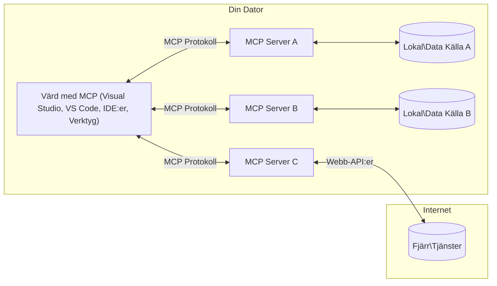

# MCP Core Concepts: Bemästra Model Context Protocol för AI-integration

[](https://youtu.be/earDzWGtE84)

_(Klicka på bilden ovan för att se videon av denna lektion)_

[Model Context Protocol (MCP)](https://github.com/modelcontextprotocol) är ett kraftfullt, standardiserat ramverk som optimerar kommunikationen mellan Stora Språkmodeller (LLMs) och externa verktyg, applikationer och datakällor.
Denna guide leder dig genom MCP:s grundläggande koncept. Du kommer att lära dig om dess klient-server-arkitektur, viktiga komponenter, kommunikationsmekanik och bästa praxis för implementering.

- **Explicit användarsamtycke**: All datatillgång och operationer kräver tydligt användargodkännande innan utförande. Användare måste klart förstå vilken data som kommer att nås och vilka åtgärder som ska utföras, med detaljerad kontroll över behörigheter och tillstånd.

- **Dataskydd och integritet**: Användardata exponeras endast med uttryckligt samtycke och måste skyddas av robusta åtkomstkontroller genom hela interaktionslivscykeln. Implementeringar måste förhindra obehörig datatransmission och upprätthålla strikta sekretessgränser.

- **Säker verktygsexekvering**: Varje verktygsanrop kräver uttryckligt användarsamtycke med tydlig förståelse för verktygets funktionalitet, parametrar och potentiell påverkan. Robust säkerhetsgränser måste förhindra oavsiktlig, osäker eller illvillig verktygsexekvering.

- **Säkerhet i transportlager**: Alla kommunikationskanaler bör använda lämpliga krypterings- och autentiseringsmekanismer. Fjärranslutningar ska implementera säkra transportprotokoll och korrekt hantering av referenser.

#### Implementeringsriktlinjer:

- **Behörighetshantering**: Implementera detaljstyrda behörighetssystem som låter användare kontrollera vilka servrar, verktyg och resurser som är tillgängliga  
- **Autentisering & auktorisation**: Använd säkra autentiseringsmetoder (OAuth, API-nycklar) med korrekt tokenhantering och utgångsdatum  
- **Inmatningsvalidering**: Validera alla parametrar och datainmatningar enligt definierade scheman för att förhindra injektionsattacker  
- **Revisionsloggning**: Upprätthåll omfattande loggar över alla operationer för säkerhetsövervakning och efterlevnad

## Översikt

Denna lektion utforskar den grundläggande arkitekturen och komponenterna som utgör Model Context Protocol (MCP)-ekosystemet. Du kommer att lära dig om klient-server-arkitektur, nyckelkomponenter och kommunikationsmekanismer som driver MCP-interaktioner.

## Viktiga lärandemål

I slutet av denna lektion kommer du att:

- Förstå MCP:s klient-server-arkitektur.  
- Identifiera roller och ansvar för Hosts, Clients och Servers.  
- Analysera kärnfunktioner som gör MCP till ett flexibelt integrationslager.  
- Lära dig hur information flödar inom MCP-ekosystemet.  
- Få praktiska insikter genom kodexempel i .NET, Java, Python och JavaScript.  

## MCP-arkitektur: En djupare titt

MCP-ekosystemet är byggt på en klient-server-modell. Denna modulära struktur låter AI-applikationer interagera effektivt med verktyg, databaser, API:er och kontextuella resurser. Låt oss bryta ned denna arkitektur i dess kärnkomponenter.

I grunden följer MCP en klient-server-arkitektur där en host-applikation kan ansluta till flera servrar:


- **MCP Hosts**: Program som VSCode, Claude Desktop, IDE:er eller AI-verktyg som vill få tillgång till data via MCP  
- **MCP Clients**: Protokollklienter som upprätthåller 1:1-anslutningar med servrar  
- **MCP Servers**: Lätta program som var och en exponerar specifika funktioner via standardiserade Model Context Protocol  
- **Lokala datakällor**: Din dators filer, databaser och tjänster som MCP-servrar kan nå säkert  
- **Fjärrtjänster**: Externa system tillgängliga via internet som MCP-servrar kan ansluta till via API:er.

MCP-protokollet är en utvecklande standard som använder datum-baserad versionshantering (formatet ÅÅÅÅ-MM-DD). Den aktuella protokollversionen är **2025-11-25**. Du kan se de senaste uppdateringarna i [protokollspezifikationen](https://modelcontextprotocol.io/specification/2025-11-25/)

### 1. Hosts

I Model Context Protocol (MCP) är **Hosts** AI-applikationer som fungerar som primär gränssnitt genom vilket användare interagerar med protokollet. Hosts koordinerar och hanterar anslutningar till flera MCP-servrar genom att skapa dedikerade MCP-klienter för varje serveranslutning. Exempel på Hosts inkluderar:

- **AI-applikationer**: Claude Desktop, Visual Studio Code, Claude Code  
- **Utvecklingsmiljöer**: IDE:er och kodredigerare med MCP-integration  
- **Specialanpassade applikationer**: Skräddarsydda AI-agenter och verktyg

**Hosts** är applikationer som koordinerar AI-modellsinteraktioner. De:

- **Orkestrerar AI-modeller**: Utför eller interagerar med LLM:er för att generera svar och koordinera AI-arbetsflöden  
- **Hantera klientanslutningar**: Skapar och upprätthåller en MCP-klient per MCP-serveranslutning  
- **Styr användargränssnittet**: Hanterar konversationsflöde, användarinteraktioner och presentationssvar  
- **Upprätthåller säkerhet**: Kontrollerar behörigheter, säkerhetsbegränsningar och autentisering  
- **Hantera användarsamtycke**: Förvaltar användargodkännande för datadelning och verktygsexekvering  


### 2. Clients

**Clients** är viktiga komponenter som upprätthåller dedikerade one-to-one-anslutningar mellan Hosts och MCP-servrar. Varje MCP-klient skapas av Host för att ansluta till en specifik MCP-server, vilket säkerställer organiserade och säkra kommunikationskanaler. Flera klienter möjliggör att Hosts kan ansluta till flera servrar samtidigt.

**Clients** är anslutningskomponenter inom host-applikationen. De:

- **Protokollkommunikation**: Skickar JSON-RPC 2.0-begäranden till servrar med prompts och instruktioner  
- **Förhandla kapabiliteter**: Förhandlar om stödda funktioner och protokollversioner med servrar under initiering  
- **Verktygsexekvering**: Hanterar verktygsanrop från modeller och bearbetar svar  
- **Uppdateringar i realtid**: Hanterar notifieringar och realtidsuppdateringar från servrar  
- **Bearbetning av svar**: Bearbetar och formaterar serversvar för visning till användare  

### 3. Servers

**Servers** är program som tillhandahåller kontext, verktyg och kapabiliteter till MCP-klienter. De kan köras lokalt (på samma maskin som Host) eller fjärrstyrt (på externa plattformar) och ansvarar för att hantera klientförfrågningar och leverera strukturerade svar. Servrar exponerar specifik funktionalitet via standardiserade Model Context Protocol.

**Servers** är tjänster som tillhandahåller kontext och kapabiliteter. De:

- **Registrering av funktioner**: Registrerar och exponerar tillgängliga primitivelement (resurser, prompts, verktyg) till klienter  
- **Bearbetning av förfrågningar**: Tar emot och kör verktygsanrop, resursförfrågningar och promptförfrågningar från klienter  
- **Tillhandahålla kontext**: Förser kontextuell information och data för att förbättra modelsvar  
- **Tillståndshantering**: Upprätthåller sessionsstatus och hanterar tillståndsbaserade interaktioner vid behov  
- **Notifieringar i realtid**: Skickar notifieringar om kapabilitetsändringar och uppdateringar till anslutna klienter

Servrar kan utvecklas av vem som helst för att utöka modellkapabiliteter med specialiserad funktionalitet och stöder både lokala och fjärrdrivna distributionsscenarier.

### 4. Server Primitives

Servrar i Model Context Protocol (MCP) tillhandahåller tre kärn-**primitives** som definierar grundläggande byggstenar för rika interaktioner mellan klienter, hosts och språkmodeller. Dessa primitives specificerar vilka typer av kontextuell information och åtgärder som finns tillgängliga via protokollet.

MCP-servrar kan exponera vilken kombination som helst av följande tre kärnprimitives:

#### Resources

**Resurser** är datakällor som tillhandahåller kontextuell information till AI-applikationer. De representerar statiskt eller dynamiskt innehåll som kan förbättra modellens förståelse och beslutsfattande:

- **Kontextuell data**: Strukturerad information och kontext för AI-modellens konsumtion  
- **Kunskapsbaser**: Dokumentarkiv, artiklar, manualer och forskningsrapporter  
- **Lokala datakällor**: Filer, databaser och lokalsysteminformation  
- **Extern data**: API-svar, webbtjänster och fjärrsystemdata  
- **Dynamiskt innehåll**: Realtidsdata som uppdateras baserat på externa förhållanden

Resurser identifieras via URI:er och stödjer upptäckt via `resources/list` och hämtning via `resources/read` metoder:

```text
file://documents/project-spec.md
database://production/users/schema
api://weather/current
```

#### Prompts

**Prompts** är återanvändbara mallar som hjälper till att strukturera interaktioner med språkmodeller. De tillhandahåller standardiserade interaktionsmönster och mallade arbetsflöden:

- **Mallbaserade interaktioner**: Förstrukturerade meddelanden och samtalsstarter  
- **Arbetsflödesmallar**: Standardiserade sekvenser för vanliga uppgifter och interaktioner  
- **Få-exempel (few-shot) modeller**: Exempelbaserade mallar för modellinstruktion  
- **Systempromptar**: Grundläggande prompts som definierar modellbeteende och kontext  
- **Dynamiska mallar**: Parameterstyrda prompts som anpassar sig efter specifika kontexter

Prompts stödjer variabelsubstitution och kan upptäckas via `prompts/list` och hämtas med `prompts/get`:

```markdown
Generate a {{task_type}} for {{product}} targeting {{audience}} with the following requirements: {{requirements}}
```

#### Tools

**Verktyg** är exekverbara funktioner som AI-modeller kan anropa för att utföra specifika åtgärder. De representerar "verben" i MCP-ekosystemet och möjliggör att modeller kan interagera med externa system:

- **Exekverbara funktioner**: Diskreta operationer som modeller kan anropa med specifika parametrar  
- **Integration med externa system**: API-anrop, databasfrågor, filoperationer, beräkningar  
- **Unik identitet**: Varje verktyg har ett distinkt namn, beskrivning och parameterschema  
- **Strukturerad I/O**: Verktyg accepterar validerade parametrar och returnerar strukturerade, typade svar  
- **Åtgärdskapacitet**: Gör det möjligt för modeller att utföra verkliga handlingar och hämta live-data

Verktyg definieras med JSON Schema för parameter-validering och upptäcks via `tools/list` och exekveras via `tools/call`. Verktyg kan också inkludera **ikoner** som ytterligare metadata för bättre UI-presentation.

**Verktygsannoteringar**: Verktyg stödjer beteendeannoteringar (t.ex. `readOnlyHint`, `destructiveHint`) som beskriver om ett verktyg är skrivskyddat eller destruktivt, vilket hjälper klienter att fatta informerade beslut om verktygsexekvering.

Exempel på verktygsdefinition:

```typescript
server.tool(
  "search_products", 
  {
    query: z.string().describe("Search query for products"),
    category: z.string().optional().describe("Product category filter"),
    max_results: z.number().default(10).describe("Maximum results to return")
  }, 
  async (params) => {
    // Utför sökning och returnera strukturerade resultat
    return await productService.search(params);
  }
);
```

## Client Primitives

I Model Context Protocol (MCP) kan **klienter** exponera primitives som möjliggör för servrar att begära ytterligare kapabiliteter från host-applikationen. Dessa klient-side primitives tillåter rikare, mer interaktiva serverimplementeringar som kan få tillgång till AI-modellkapabiliteter och användarinteraktioner.

### Sampling

**Sampling** tillåter servrar att begära språkmodellsfullföljanden från klientens AI-applikation. Denna primitive möjliggör för servrar att få tillgång till LLM-kapabiliteter utan att bädda in egna modellberoenden:

- **Modelloberoende tillgång**: Servrar kan begära fullföljanden utan att inkludera LLM-SDK:er eller hantera modellåtkomst  
- **Serverinitierad AI**: Möjliggör för servrar att självständigt generera innehåll med klientens AI-modell  
- **Rekursiva LLM-interaktioner**: Stödjer komplexa scenarier där servrar behöver AI-assistans för bearbetning  
- **Dynamisk innehållsgenerering**: Låter servrar skapa kontextuella svar med hostens modell  
- **Verktygsanropsstöd**: Servrar kan inkludera `tools` och `toolChoice` parametrar för att tillåta klientens modell att anropa verktyg under sampling

Sampling initieras genom `sampling/complete`-metoden där servrar skickar fullföljandebegäranden till klienter.

### Roots

**Roots** tillhandahåller ett standardiserat sätt för klienter att exponera filsystemgränser till servrar, vilket hjälper servrar att förstå vilka kataloger och filer de har tillgång till:

- **Filsystemgränser**: Definierar gränserna för var servrar kan operera i filsystemet  
- **Åtkomstkontroll**: Hjälper servrar att förstå vilka kataloger och filer de har behörighet att nå  
- **Dynamiska uppdateringar**: Klienter kan notifiera servrar när listan över roots ändras  
- **URI-baserad identifiering**: Roots använder `file://` URI:er för att identifiera åtkomliga kataloger och filer

Roots upptäcks via `roots/list`-metoden, där klienter skickar `notifications/roots/list_changed` när roots ändras.

### Elicitation

**Elicitation** gör det möjligt för servrar att begära ytterligare information eller bekräftelse från användare via klientgränssnittet:

- **Begäranden om användarinmatning**: Servrar kan be om mer information när det behövs för verktygsexekvering  
- **Bekräftelsedialoger**: Begär användarens godkännande för känsliga eller påverkande operationer  
- **Interaktiva arbetsflöden**: Möjliggör för servrar att skapa steg-för-steg användarinteraktioner  
- **Dynamisk parametrinsamling**: Samlar in saknade eller valfria parametrar under verktygsexekvering

Elicitation-begäranden görs med `elicitation/request`-metoden för att samla in användarinmatning via klientens gränssnitt.

**URL-läge för elicitation**: Servrar kan också begära URL-baserade användarinteraktioner, vilket låter servrar dirigera användare till externa webbsidor för autentisering, bekräftelse eller dataregistrering.

### Logging

**Logging** låter servrar skicka strukturerade loggmeddelanden till klienter för felsökning, övervakning och operationell synlighet:

- **Felsökningsstöd**: Gör det möjligt för servrar att förse detaljerade körloggar för felsökning  
- **Operationell övervakning**: Skicka statusuppdateringar och prestationsmått till klienter  
- **Felrapportering**: Ge detaljerad felkontekst och diagnostisk information  
- **Revisionsspår**: Skapa omfattande loggar över serveroperationer och beslut

Loggmeddelanden skickas till klienter för att ge transparens i serververksamheten och underlätta felsökning.

## Informationsflöde i MCP

Model Context Protocol (MCP) definierar ett strukturerat informationsflöde mellan hosts, clients, servers och modeller. Att förstå detta flöde hjälper till att klargöra hur användarförfrågningar behandlas och hur externa verktyg och data integreras i modelsvar.
- **Värden initierar anslutning**  
  Värdprogrammet (såsom en IDE eller chattgränssnitt) etablerar en anslutning till en MCP-server, vanligtvis via STDIO, WebSocket eller annan stöd transport.

- **Kapabilitetsförhandling**  
  Klienten (inbäddad i värden) och servern utbyter information om deras stödda funktioner, verktyg, resurser och protokollversioner. Detta säkerställer att båda parter förstår vilka kapabiliteter som finns tillgängliga för sessionen.

- **Användarförfrågan**  
  Användaren interagerar med värden (t.ex. anger en prompt eller kommando). Värden samlar in denna indatavärde och skickar det till klienten för bearbetning.

- **Användning av resurs eller verktyg**  
  - Klienten kan begära ytterligare kontext eller resurser från servern (såsom filer, databaspunkter eller kunskapsbasartiklar) för att berika modellens förståelse.  
  - Om modellen avgör att ett verktyg behövs (t.ex. för att hämta data, utföra en beräkning eller anropa ett API) skickar klienten en verktygsanropsförfrågan till servern med verktygets namn och parametrar.

- **Serverutförande**  
  Servern tar emot resurs- eller verktygsbegäran, utför de nödvändiga operationerna (såsom att köra en funktion, fråga en databas eller hämta en fil) och returnerar resultaten till klienten i ett strukturerat format.

- **Svarsgenerering**  
  Klienten integrerar serverns svar (resursdata, verktygsutdata etc.) i den pågående modellinteraktionen. Modellen använder denna information för att generera ett omfattande och kontextuellt relevant svar.

- **Resultatpresentation**  
  Värden tar emot det slutgiltiga resultatet från klienten och presenterar det för användaren, ofta inklusive både modellens genererade text och eventuella resultat från verktygsexekveringar eller resursuppslagningar.

Detta flöde möjliggör för MCP att stödja avancerade, interaktiva och kontextmedvetna AI-applikationer genom att sömlöst koppla modeller med externa verktyg och datakällor.

## Protokollarkitektur & lager

MCP består av två distinkta arkitekturlager som samarbetar för att tillhandahålla en komplett kommunikationsram:

### Datalager

**Datalagret** implementerar den kärnprotokoll som MCP utgör med **JSON-RPC 2.0** som grund. Detta lager definierar meddelandets struktur, semantik och interaktionsmönster:

#### Kärnkomponenter:

- **JSON-RPC 2.0-protokoll**: All kommunikation använder standardiserat JSON-RPC 2.0-meddelandformat för metodanrop, svar och notifieringar  
- **Livscykelhantering**: Hanterar anslutningsinitiering, kapabilitetsförhandling och sessionsavslut mellan klienter och servrar  
- **Serverprimitive**: Möjliggör för servrar att erbjuda kärnfunktionalitet genom verktyg, resurser och prompts  
- **Klientprimitive**: Möjliggör för servrar att begära sampling från LLM, inhämtning av användarinput och skicka loggmeddelanden  
- **Real-tids-notifieringar**: Stödjer asynkrona notifieringar för dynamiska uppdateringar utan polling

#### Nyckelfunktioner:

- **Versionsförhandling av protokoll**: Använder datum-baserad versionshantering (ÅÅÅÅ-MM-DD) för att säkerställa kompatibilitet  
- **Kapabilitetsupptäckt**: Klienter och servrar utbyter information om stödda funktioner vid initiering  
- **Tillståndsbevarande sessioner**: Behåller anslutningstillstånd över flera interaktioner för kontextkontinuitet

### Transportlager

**Transportlagret** hanterar kommunikationskanaler, meddelanderamning och autentisering mellan MCP-deltagare:

#### Stödda transportmekanismer:

1. **STDIO-transport**:  
   - Använder standard in- och utströmmar för direkt processkommunikation  
   - Optimalt för lokala processer på samma maskin utan nätverksöverhuvud  
   - Vanligt för lokala MCP-serverimplementationer

2. **Streambar HTTP-transport**:  
   - Använder HTTP POST för klient-till-server-meddelanden  
   - Valfria Server-Sent Events (SSE) för server-till-klient streaming  
   - Möjliggör fjärrserverkommunikation över nätverk  
   - Stödjer standard HTTP-autentisering (bearer tokens, API-nycklar, anpassade headers)  
   - MCP rekommenderar OAuth för säker tokenbaserad autentisering

#### Transportabstraktion:

Transportlagret abstraherar kommunikationsdetaljer från datalagret, vilket möjliggör samma JSON-RPC 2.0-meddelandformat över alla transportmekanismer. Denna abstraktion gör det möjligt för applikationer att sömlöst byta mellan lokala och fjärrservrar.

### Säkerhetsöverväganden

MCP-implementationer måste följa flera kritiska säkerhetsprinciper för att säkerställa säkra, pålitliga och trygga interaktioner över hela protokolloperationerna:

- **Användarsamtycke och kontroll**: Användare måste ge uttryckligt samtycke innan någon data nås eller åtgärder utförs. De ska ha tydlig kontroll över vilken data som delas och vilka åtgärder som godkänns, understödda av intuitiva användargränssnitt för att granska och godkänna aktiviteter.

- **Dataskydd**: Användardata bör endast exponeras med uttryckligt samtycke och måste skyddas av lämpliga åtkomstkontroller. MCP-implementationer måste skydda mot obehörig dataöverföring och säkerställa att sekretess upprätthålls i alla interaktioner.

- **Verktygssäkerhet**: Innan något verktyg anropas krävs uttryckligt användarsamtycke. Användarna bör ha klar förståelse för varje verktygs funktionalitet, och robusta säkerhetsgränser måste upprätthållas för att förhindra oavsiktlig eller osäker verktygsexekvering.

Genom att följa dessa säkerhetsprinciper säkerställer MCP användarnas förtroende, integritet och säkerhet över hela protokollinteraktioner samtidigt som kraftfulla AI-integrationer möjliggörs.

## Kodexempel: Nyckelkomponenter

Nedan följer kodexempel i flera populära programmeringsspråk som illustrerar hur man implementerar viktiga MCP-serverkomponenter och verktyg.

### .NET-exempel: Skapa en enkel MCP-server med verktyg

Här är ett praktiskt .NET-kodexempel som demonstrerar hur man implementerar en enkel MCP-server med anpassade verktyg. Detta exempel visar hur man definierar och registrerar verktyg, hanterar förfrågningar och ansluter servern med Model Context Protocol.

```csharp
using System;
using System.Threading.Tasks;
using ModelContextProtocol.Server;
using ModelContextProtocol.Server.Transport;
using ModelContextProtocol.Server.Tools;

public class WeatherServer
{
    public static async Task Main(string[] args)
    {
        // Create an MCP server
        var server = new McpServer(
            name: "Weather MCP Server",
            version: "1.0.0"
        );
        
        // Register our custom weather tool
        server.AddTool<string, WeatherData>("weatherTool", 
            description: "Gets current weather for a location",
            execute: async (location) => {
                // Call weather API (simplified)
                var weatherData = await GetWeatherDataAsync(location);
                return weatherData;
            });
        
        // Connect the server using stdio transport
        var transport = new StdioServerTransport();
        await server.ConnectAsync(transport);
        
        Console.WriteLine("Weather MCP Server started");
        
        // Keep the server running until process is terminated
        await Task.Delay(-1);
    }
    
    private static async Task<WeatherData> GetWeatherDataAsync(string location)
    {
        // This would normally call a weather API
        // Simplified for demonstration
        await Task.Delay(100); // Simulate API call
        return new WeatherData { 
            Temperature = 72.5,
            Conditions = "Sunny",
            Location = location
        };
    }
}

public class WeatherData
{
    public double Temperature { get; set; }
    public string Conditions { get; set; }
    public string Location { get; set; }
}
```

### Java-exempel: MCP-serverkomponenter

Detta exempel demonstrerar samma MCP-server och verktygsregistrering som .NET-exemplet ovan, men implementerat i Java.

```java
import io.modelcontextprotocol.server.McpServer;
import io.modelcontextprotocol.server.McpToolDefinition;
import io.modelcontextprotocol.server.transport.StdioServerTransport;
import io.modelcontextprotocol.server.tool.ToolExecutionContext;
import io.modelcontextprotocol.server.tool.ToolResponse;

public class WeatherMcpServer {
    public static void main(String[] args) throws Exception {
        // Skapa en MCP-server
        McpServer server = McpServer.builder()
            .name("Weather MCP Server")
            .version("1.0.0")
            .build();
            
        // Registrera ett väderverktyg
        server.registerTool(McpToolDefinition.builder("weatherTool")
            .description("Gets current weather for a location")
            .parameter("location", String.class)
            .execute((ToolExecutionContext ctx) -> {
                String location = ctx.getParameter("location", String.class);
                
                // Hämta väderdata (förenklat)
                WeatherData data = getWeatherData(location);
                
                // Returnera formaterat svar
                return ToolResponse.content(
                    String.format("Temperature: %.1f°F, Conditions: %s, Location: %s", 
                    data.getTemperature(), 
                    data.getConditions(), 
                    data.getLocation())
                );
            })
            .build());
        
        // Anslut servern med stdio-transport
        try (StdioServerTransport transport = new StdioServerTransport()) {
            server.connect(transport);
            System.out.println("Weather MCP Server started");
            // Håll servern igång tills processen avslutas
            Thread.currentThread().join();
        }
    }
    
    private static WeatherData getWeatherData(String location) {
        // Implementation skulle anropa ett väder-API
        // Förenklat för exempeländamål
        return new WeatherData(72.5, "Sunny", location);
    }
}

class WeatherData {
    private double temperature;
    private String conditions;
    private String location;
    
    public WeatherData(double temperature, String conditions, String location) {
        this.temperature = temperature;
        this.conditions = conditions;
        this.location = location;
    }
    
    public double getTemperature() {
        return temperature;
    }
    
    public String getConditions() {
        return conditions;
    }
    
    public String getLocation() {
        return location;
    }
}
```

### Python-exempel: Bygga en MCP-server

Detta exempel använder fastmcp, så var noga med att installera det först:

```python
pip install fastmcp
```
Kodexempel:

```python
#!/usr/bin/env python3
import asyncio
from fastmcp import FastMCP
from fastmcp.transports.stdio import serve_stdio

# Skapa en FastMCP-server
mcp = FastMCP(
    name="Weather MCP Server",
    version="1.0.0"
)

@mcp.tool()
def get_weather(location: str) -> dict:
    """Gets current weather for a location."""
    return {
        "temperature": 72.5,
        "conditions": "Sunny",
        "location": location
    }

# Alternativ metod med hjälp av en klass
class WeatherTools:
    @mcp.tool()
    def forecast(self, location: str, days: int = 1) -> dict:
        """Gets weather forecast for a location for the specified number of days."""
        return {
            "location": location,
            "forecast": [
                {"day": i+1, "temperature": 70 + i, "conditions": "Partly Cloudy"}
                for i in range(days)
            ]
        }

# Registrera klassverktyg
weather_tools = WeatherTools()

# Starta servern
if __name__ == "__main__":
    asyncio.run(serve_stdio(mcp))
```

### JavaScript-exempel: Skapa en MCP-server

Detta exempel visar MCP-serveruppbyggnad i JavaScript och hur man registrerar två väderrelaterade verktyg.

```javascript
// Använder den officiella Model Context Protocol SDK
import { McpServer } from "@modelcontextprotocol/sdk/server/mcp.js";
import { StdioServerTransport } from "@modelcontextprotocol/sdk/server/stdio.js";
import { z } from "zod"; // För parameter validering

// Skapa en MCP-server
const server = new McpServer({
  name: "Weather MCP Server",
  version: "1.0.0"
});

// Definiera ett väderverktyg
server.tool(
  "weatherTool",
  {
    location: z.string().describe("The location to get weather for")
  },
  async ({ location }) => {
    // Detta skulle normalt anropa en väder-API
    // Förenklat för demonstration
    const weatherData = await getWeatherData(location);
    
    return {
      content: [
        { 
          type: "text", 
          text: `Temperature: ${weatherData.temperature}°F, Conditions: ${weatherData.conditions}, Location: ${weatherData.location}` 
        }
      ]
    };
  }
);

// Definiera ett prognosverktyg
server.tool(
  "forecastTool",
  {
    location: z.string(),
    days: z.number().default(3).describe("Number of days for forecast")
  },
  async ({ location, days }) => {
    // Detta skulle normalt anropa en väder-API
    // Förenklat för demonstration
    const forecast = await getForecastData(location, days);
    
    return {
      content: [
        { 
          type: "text", 
          text: `${days}-day forecast for ${location}: ${JSON.stringify(forecast)}` 
        }
      ]
    };
  }
);

// Hjälpfunktioner
async function getWeatherData(location) {
  // Simulera API anrop
  return {
    temperature: 72.5,
    conditions: "Sunny",
    location: location
  };
}

async function getForecastData(location, days) {
  // Simulera API anrop
  return Array.from({ length: days }, (_, i) => ({
    day: i + 1,
    temperature: 70 + Math.floor(Math.random() * 10),
    conditions: i % 2 === 0 ? "Sunny" : "Partly Cloudy"
  }));
}

// Anslut servern med stdio transport
const transport = new StdioServerTransport();
server.connect(transport).catch(console.error);

console.log("Weather MCP Server started");
```

Detta JavaScript-exempel visar hur man skapar en MCP-server med Model Context Protocol SDK. Det visar hur man registrerar två verktyg kallade `weatherTool` och `forecastTool` och gör dem tillgängliga för MCP-klienter via `StdioServerTransport`.

## Säkerhet och auktorisering

MCP inkluderar flera inbyggda koncept och mekanismer för att hantera säkerhet och auktorisering genom hela protokollet:

1. **Verktygstillsyn och kontroll**:  
  Klienter kan specificera vilka verktyg en modell får använda under en session. Detta säkerställer att endast uttryckligen auktoriserade verktyg är tillgängliga, vilket minskar risken för oavsiktliga eller osäkra operationer. Behörigheter kan konfigurera dynamiskt baserat på användarpreferenser, organisationspolicyer eller interaktionskontext.

2. **Autentisering**:  
  Servrar kan kräva autentisering innan åtkomst ges till verktyg, resurser eller känsliga operationer. Detta kan involvera API-nycklar, OAuth-token eller andra autentiseringsscheman. Korrekt autentisering säkerställer att endast betrodda klienter och användare kan använda serverns möjligheter.

3. **Validering**:  
  Parametervalidering genomdrivs för alla verktygsanrop. Varje verktyg definierar förväntade typer, format och begränsningar för sina parametrar, och servern validerar inkommande förfrågningar därefter. Detta förhindrar att felaktig eller illvillig input når verktygens implementationer och hjälper till att upprätthålla operationernas integritet.

4. **Hastighetsbegränsning**:  
  För att förhindra missbruk och säkerställa rättvis användning av serverresurser kan MCP-servrar implementera hastighetsbegränsning för verktygsanrop och resursåtkomst. Gränser kan appliceras per användare, per session eller globalt, och hjälper till att skydda mot överbelastningsattacker eller överdriven resursanvändning.

Genom att kombinera dessa mekanismer ger MCP en säker grund för att integrera språkmodeller med externa verktyg och datakällor, samtidigt som användare och utvecklare får detaljerad kontroll över åtkomst och användning.

## Protokollmeddelanden & kommunikationsflöde

MCP-kommunikation använder strukturerade **JSON-RPC 2.0**-meddelanden för att möjliggöra tydliga och pålitliga interaktioner mellan värdar, klienter och servrar. Protokollet definierar specifika meddelandemönster för olika typer av operationer:

### Kärntypmeddelanden:

#### **Initieringsmeddelanden**
- **`initialize`-begäran**: Etablerar anslutning och förhandlar protokollversion samt kapabiliteter  
- **`initialize`-svar**: Bekräftar stödda funktioner och serverinformation  
- **`notifications/initialized`**: Signal om att initiering är klar och sessionen är redo

#### **Upptäcktsmeddelanden**
- **`tools/list`-begäran**: Upptäcker tillgängliga verktyg på servern  
- **`resources/list`-begäran**: Listar tillgängliga resurser (datakällor)  
- **`prompts/list`-begäran**: Hämtar tillgängliga promptmallar

#### **Exekveringsmeddelanden**  
- **`tools/call`-begäran**: Kör ett specifikt verktyg med angivna parametrar  
- **`resources/read`-begäran**: Hämtar innehåll från en specifik resurs  
- **`prompts/get`-begäran**: Hämtar en promptmall med valfria parametrar

#### **Klientsidesmeddelanden**
- **`sampling/complete`-begäran**: Server begär LLM-komplettering från klienten  
- **`elicitation/request`**: Server begär användarinput via klientgränssnitt  
- **Loggningsmeddelanden**: Server skickar strukturerade loggmeddelanden till klienten

#### **Notifieringsmeddelanden**
- **`notifications/tools/list_changed`**: Server meddelar klient om verktygsändringar  
- **`notifications/resources/list_changed`**: Server meddelar klient om resursändringar  
- **`notifications/prompts/list_changed`**: Server meddelar klient om promptändringar

### Meddelandestruktur:

Alla MCP-meddelanden följer JSON-RPC 2.0-format med:  
- **Begäran**: Inkluderar `id`, `method` och valfria `params`  
- **Svar**: Inkluderar `id` och antingen `result` eller `error`  
- **Notifieringar**: Inkluderar `method` och valfria `params` (ingen `id` eller svar förväntas)

Denna strukturerade kommunikation säkerställer pålitliga, spårbara och utbyggbara interaktioner som stöder avancerade scenarier som realtidsuppdateringar, kedjning av verktyg och robust felhantering.

### Uppgifter (experimentellt)

**Uppgifter** är en experimentell funktion som tillhandahåller hållbara exekveringsomslag för att möjliggöra uppskjuten resultatinhämtning och statusuppföljning för MCP-förfrågningar:

- **Långvariga operationer**: Spåra kostsamma beräkningar, arbetsflödesautomation och batchbearbetning  
- **Uppskjutna resultat**: Pollning av uppgiftsstatus och hämta resultat när operationer avslutats  
- **Statusspårning**: Övervaka uppgiftsframsteg genom definierade livscykelstadier  
- **Flerstegsoperationer**: Stöd komplexa arbetsflöden som sträcker sig över flera interaktioner

Uppgifter omsluter standard MCP-förfrågningar för att möjliggöra asynkrona exekveringsmönster för operationer som inte kan slutföras omedelbart.

## Viktiga slutsatser

- **Arkitektur**: MCP använder klient-serverarkitektur där värdar hanterar flera klientanslutningar till servrar  
- **Deltagare**: Ekosystemet innefattar värdar (AI-applikationer), klienter (protokollanslutare) och servrar (kapabilitetsleverantörer)  
- **Transportmekanismer**: Kommunikation stöder STDIO (lokal) och streambar HTTP med valfritt SSE (fjärran)  
- **Kärnprimitive**: Servrar exponerar verktyg (exekverbara funktioner), resurser (datakällor) och prompts (mallar)  
- **Klientprimitive**: Servrar kan begära sampling (LLM-kompletteringar med verktygsanropsstöd), elicitation (användarinput inklusive URL-läge), root boundaries (filsystemgränser) och loggning från klienter  
- **Experimentella funktioner**: Uppgifter ger hållbara exekveringsomslag för långvariga operationer  
- **Protokollgrund**: Bygger på JSON-RPC 2.0 med datum-baserad version (nuvarande: 2025-11-25)  
- **Real-tids-funktioner**: Stödjer notifieringar för dynamiska uppdateringar och realtidssynkronisering  
- **Säkerhet först**: Uttryckligt användarsamtycke, datasekretess och säker transport är kärnkrav

## Övning

Designa ett enkelt MCP-verktyg som skulle vara användbart inom ditt område. Definiera:  
1. Vad verktyget skulle heta  
2. Vilka parametrar det skulle acceptera  
3. Vilket resultat det skulle returnera  
4. Hur en modell kan använda detta verktyg för att lösa användarproblem


---

## Vad händer härnäst

Nästa: [Kapitel 2: Säkerhet](../02-Security/README.md)

---

<!-- CO-OP TRANSLATOR DISCLAIMER START -->
**Ansvarsfriskrivning**:
Detta dokument har översatts med hjälp av AI-översättningstjänsten [Co-op Translator](https://github.com/Azure/co-op-translator). Även om vi strävar efter noggrannhet, vänligen var medveten om att automatiska översättningar kan innehålla fel eller brister. Det ursprungliga dokumentet på dess modersmål bör betraktas som den auktoritativa källan. För kritisk information rekommenderas professionell mänsklig översättning. Vi ansvarar inte för några missförstånd eller feltolkningar som uppstår från användningen av denna översättning.
<!-- CO-OP TRANSLATOR DISCLAIMER END -->