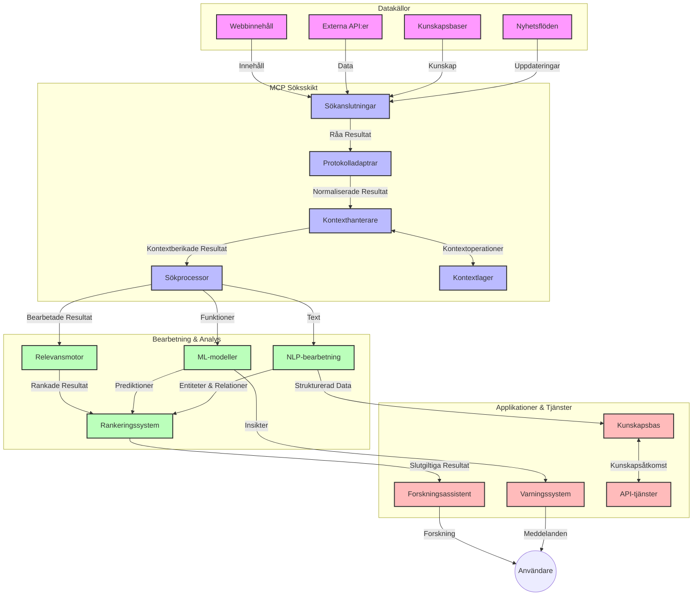
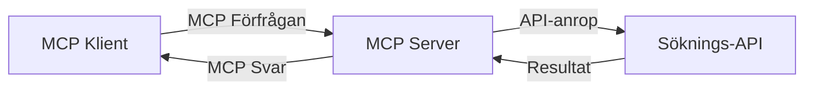
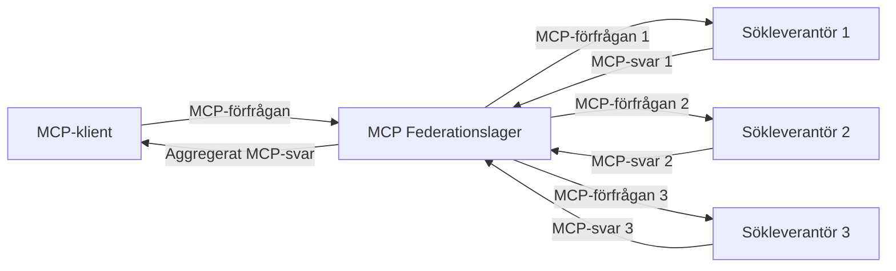
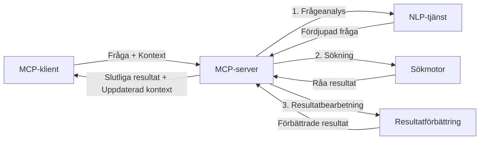

# Model Context Protocol för Realtidswebbsökning

## Översikt

Realtidswebbsökning har blivit essentiellt i dagens informationsdrivna miljö, där applikationer behöver omedelbar tillgång till aktuell information över internet för att kunna leverera relevanta och tidsmässigt passande svar. Model Context Protocol (MCP) representerar ett betydande framsteg i att optimera dessa realtids-sökprocesser, förbättra sökeffektiviteten, bibehålla kontextuell integritet och höja den övergripande systemprestandan.

Denna modul utforskar hur MCP transformerar realtidswebbsökning genom att erbjuda ett standardiserat tillvägagångssätt för kontexthantering över AI-modeller, sökmotorer och applikationer.

### Vad du kommer att lära dig

I denna omfattande guide kommer du att upptäcka:

- Hur MCP skapar en sömlös länk mellan AI-modeller och realtidswebbsökningsfunktioner  
- Arkitekturmönster för att implementera effektiva och skalbara söklösningar med MCP  
- Tekniker för att bevara sökkontext över flera förfrågningar och interaktioner  
- Praktiska kodimplementationer i Python och JavaScript för olika sökscenarier  
- Metoder för att balansera relevans, aktualitet och prestanda i MCP-drivna söksystem  

## Introduktion till Realtidswebbsökning

Realtidswebbsökning är en teknologisk metod som möjliggör kontinuerlig förfrågning, bearbetning och analys av webbaserad information allteftersom den publiceras eller uppdateras, vilket tillåter system att förse färsk och relevant information med minimal fördröjning. Till skillnad från traditionella söksystem som arbetar på indexerad data som kan vara timmar eller dagar gammal, processar realtidsökning levande data från webben och levererar insikter och information som speglar det aktuella tillståndet för onlineinnehållet.

### Kärnkoncept för Realtidswebbsökning:

- **Kontinuerlig Förfrågningsbearbetning**: Sökuppdrag processas mot ständigt uppdaterande datakällor  
- **Aktualitet Prioritering**: System är designade för att prioritera färsk information  
- **Balans mellan Relevans och Aktualitet**: Bibehålla balans mellan relevans och aktualitet  
- **Skalbar Arkitektur**: System måste hantera varierande förfrågningsbelastningar och datavolymer  
- **Kontextuell Förståelse**: Bibehålla användarkontext mellan sökinteraktioner är avgörande för meningsfulla resultat  
- **Dynamisk Omformulering av Frågor**: Adaptivt modifiera förfrågningar baserat på kontext och tidigare resultat  
- **Integration av Flera Källor**: Kombinera resultat från flera sökleverantörer och webbkällor  
- **Semantisk Förståelse**: Bearbeta frågor och innehåll baserat på betydelse snarare än bara nyckelord  
- **Realtidsrankning**: Ständigt justera resultatens rankning när ny information blir tillgänglig  

### Model Context Protocol och Realtidswebbsökning

Model Context Protocol (MCP) adresserar flera kritiska utmaningar i realtidswebbsökningsmiljöer:

1. **Bevarande av Sökkontext**: MCP standardiserar hur kontext bibehålls över distribuerade sökkomponenter och säkerställer att AI-modeller och bearbetningsnoder får tillgång till relevant förfrågningshistorik och användarpreferenser.  

2. **Effektiv Förfrågningshantering**: Genom att erbjuda strukturerade mekanismer för kontextöverföring minskar MCP överbelastningen av upprepning av kontext i varje sökiteration.  

3. **Interoperabilitet**: MCP skapar ett gemensamt språk för kontextdelning mellan olika sökteknologier och AI-modeller, vilket möjliggör mer flexibla och utbyggbara arkitekturer.  

4. **Sökoptimerad Kontext**: MCP-implementationer kan prioritera vilka kontextelement som är mest relevanta för effektiv sökning, vilket optimerar både prestanda och noggrannhet.  

5. **Adaptiv Sökbearbetning**: Med korrekt kontexthantering genom MCP kan söksystem dynamiskt justera bearbetningen baserat på användarens föränderliga behov och informationslandskap.  

I moderna applikationer, från nyhetsaggregering till forskningsassistenter, möjliggör integrationen av MCP med webbsökteknologier intelligent, kontextmedveten sökning som kan leverera allt mer relevanta resultat i takt med användarinteraktionerna.

## Lärandemål

I slutet av denna lektion kommer du att kunna:

- Förstå grunderna i realtidswebbsökning och dess utmaningar i moderna applikationer  
- Förklara hur Model Context Protocol (MCP) förbättrar realtidswebbsökningsfunktioner  
- Implementera MCP-baserade söklösningar med populära ramverk och API:er  
- Designa och distribuera skalbara, högpresterande sökarkitekturer med MCP  
- Tillämpa MCP-koncept på olika användningsfall inklusive semantisk sökning, forskningsassistans och AI-förstärkt webbläsning  
- Utvärdera framväxande trender och framtida innovationer inom MCP-baserad sökteknik  
- Utveckla kontextmedvetna söksystem som lär av användarinteraktioner  
- Integrera webbsökningsfunktioner i AI-assistenter med standardiserade MCP-protokoll  
- Skapa flerstegs sökkedjor som successivt förfinar resultat baserat på kontext  
- Optimera sökprestanda samtidigt som omfattande kontextmedvetenhet bibehålls  

### Definition och Betydelse

Realtidswebbsökning innebär kontinuerlig förfrågning, hämtning och leverans av webbaserad information med minimal fördröjning. Till skillnad från traditionella sökmotorer som periodiskt genomsöker och indexerar webben, syftar realtidsökning till att yta information i takt med att den blir tillgänglig, vilket möjliggör omedelbar tillgång till det mest aktuella innehållet.

Viktiga kännetecken för realtidswebbsökning inkluderar:

- **Färskhet**: Prioritering av nyare innehåll och uppdateringar  
- **Kontinuerlig Bearbetning**: Ständigt övervakande efter ny information  
- **Anpassning av Förfrågningar**: Förfining av sökfrågor baserat på kontext och återkoppling  
- **Omedelbar Leverans**: Leverera sökresultat med minimal fördröjning  
- **Bevarande av Kontext**: Bygga vidare på tidigare frågeställningar för förbättrad relevans  

### Utmaningar i Traditionell Webbsökning

Traditionella webbsökningsmetoder står inför flera begränsningar när de tillämpas i realtidsscenarier:

1. **Fragmentering av Kontext**: Svårigheter att bevara sökkontext över flera förfrågningar  
2. **Informationsfärskhet**: Utmaningar med att fånga upp och prioritera den senaste informationen  
3. **Integrationskomplexitet**: Problem med interoperabilitet mellan söksystem och applikationer  
4. **Latensproblem**: Balans mellan omfattande sökning och svarstidskrav  
5. **Finjustering av Relevans**: Säkerställa accuracy och relevans samtidigt som aktualitet prioriteras  

## Att Förstå Model Context Protocol (MCP) för Sökanvändning

### Vad är MCP i Sökkontext?

Model Context Protocol (MCP) är ett standardiserat kommunikationsprotokoll utformat för att underlätta effektiv interaktion mellan AI-modeller och applikationer. I sammanhanget realtidswebbsökning erbjuder MCP en ram för:

- Bevarande av sökkontext genom hela förfrågningssekvenser  
- Standardisering av sökförfrågnings- och resultatformat  
- Optimering av överföring av sökparametrar och resultat  
- Förbättring av kommunikation mellan modeller och sökmotorer  

### Kärnkomponenter och Arkitektur

MCP-arkitekturen för realtidswebbsökning består av flera centrala komponenter:

1. **Query Context Handlers**: Hanterar och bibehåller sökkontext över flera förfrågningar  
2. **Search Processors**: Bearbetar inkommande sökförfrågningar med kontextmedvetna tekniker  
3. **Protocol Adapters**: Konverterar mellan olika sök-API:er samtidigt som kontext bevaras  
4. **Context Store**: Lagrar och hämtar effektivt sökhistorik och preferenser  
5. **Search Connectors**: Ansluter till olika sökmotorer och webbaserade API:er  



### Hur MCP Förbättrar Realtidswebbsökning

MCP hanterar traditionella problem i webbsökning genom:

- **Kontextuell Kontinuitet**: Bibehåller relationer mellan förfrågningar under hela söksessionen  
- **Optimerad Överföring**: Minskar redundans i sökparametrar genom intelligent kontexthantering  
- **Standardiserade Gränssnitt**: Erbjuder konsekventa API:er för sökkomponenter  
- **Reducerad Latens**: Minimerar bearbetningsöverhuvud genom effektiv kontexthantering  
- **Förbättrad Relevans**: Förhöjer sökresultatens relevans genom att bevara användarens intention över flera förfrågningar  

## Integration och Implementering

Realtidswebbsöksystem kräver noggrann arkitektonisk design och implementering för att bibehålla både prestanda och kontextuell integritet. Model Context Protocol erbjuder ett standardiserat tillvägagångssätt för integration av AI-modeller och sökteknologier, vilket möjliggör mer sofistikerade och kontextmedvetna sökkedjor.

### Översikt av MCP-integration i Sökartekturer

Att implementera MCP i realtidswebbsökningsmiljöer involverar flera viktiga överväganden:

1. **Sökkontext-serialisering**: MCP erbjuder effektiva mekanismer för att koda kontextuell information inom sökförfrågningar, vilket säkerställer att essentiell kontext följer med förfrågan genom hela bearbetningskedjan. Detta inkluderar standardiserade serialiseringsformat optimerade för sökrelevant metadata.  

2. **Tillståndsbaserad Sökbearbetning**: MCP möjliggör mer intelligent, tillståndsbaserad bearbetning genom att bibehålla konsekvent kontextrepresentation över sökiterationer. Detta är särskilt värdefullt i flerstegs sökkedjor där kontextförfining förbättrar resultat.  

3. **Utvidgning och Förfining av Frågor**: MCP-implementationer i söksystem kan underlätta avancerad expansion och förfining av sökfrågor baserat på samlad kontext, vilket tillåter allt mer relevanta resultat i takt med att söksessionen fortgår.  

4. **Resultatcache och Prioritering**: Genom att standardisera kontexthantering hjälper MCP till att hantera cachelagring och prioritering av resultat, vilket låter komponenter anpassa sig efter den föränderliga sökkontexten.  

5. **Sökfederation och Aggregation**: MCP underlättar mer avancerad federation av sökning över flera backend genom att tillhandahålla strukturerade representationer av sökkontext, vilket möjliggör mer meningsfull aggregering av resultat från olika källor.  

Implementeringen av MCP över olika sökteknologier skapar ett enhetligt tillvägagångssätt för kontexthantering, vilket minskar behovet av skräddarsydd integrationskod samtidigt som systemets förmåga att bibehålla meningsfull kontext över sökfrågor som utvecklas förbättras.

### MCP i Olika Webbsöksimplementationer

Dessa exempel följer den aktuella MCP-specifikationen som fokuserar på ett JSON-RPC-baserat protokoll med distinkta transportmekanismer. Koden visar hur du kan implementera egna sökintegrationer samtidigt som full kompatibilitet med MCP-protokollet bibehålls.

<details>
<summary>Python-implementering med Generisk Sök-API</summary>

```python
import asyncio
import json
import aiohttp
from typing import Dict, Any, Optional, List
from contextlib import asynccontextmanager
from collections.abc import AsyncIterator

# Importera standard MCP-bibliotek
from mcp.client.session import ClientSession
from mcp.client.streamable_http import streamablehttp_client
from mcp.types import TextContent, CreateMessageRequestParams, CreateMessageResult
from mcp.server.fastmcp import FastMCP

# Skapa en FastMCP-server för webbsökning
search_server = FastMCP("WebSearch")

# Klass för att hantera webbsökningsoperationer
class WebSearchHandler:
    def __init__(self, api_endpoint: str, api_key: str):
        self.api_endpoint = api_endpoint
        self.api_key = api_key
        self.session = None
        
    async def initialize(self):
        """Initialize the HTTP session"""
        self.session = aiohttp.ClientSession(
            headers={"Authorization": f"Bearer {self.api_key}"}
        )
    
    async def close(self):
        """Close the HTTP session"""
        if self.session:
            await self.session.close()
            
    async def perform_search(self, query: str, max_results: int = 5, 
                           include_domains: List[str] = None, 
                           exclude_domains: List[str] = None,
                           time_period: str = "any") -> Dict[str, Any]:
        """Perform web search using the search API"""
        # Konstruera sökparametrar
        search_params = {
            "q": query,
            "limit": max_results,
            "time": time_period
        }
        
        if include_domains:
            search_params["site"] = ",".join(include_domains)
            
        if exclude_domains:
            search_params["exclude_site"] = ",".join(exclude_domains)
        
        # Utför sökförfrågan
        try:
            async with self.session.get(
                self.api_endpoint,
                params=search_params
            ) as response:
                if response.status != 200:
                    error_text = await response.text()
                    raise Exception(f"Search API error: {response.status} - {error_text}")
                
                search_data = await response.json()
                
                # Omvandla API-specifikt svar till ett standardformat
                results = []
                for item in search_data.get("results", []):
                    results.append({
                        "title": item.get("title", ""),
                        "url": item.get("url", ""),
                        "snippet": item.get("snippet", ""),
                        "date": item.get("published_date", ""),
                        "source": item.get("source", "")
                    })
                
                return {
                    "query": query,
                    "totalResults": len(results),
                    "results": results
                }
        except Exception as e:
            print(f"Search API request error: {e}")
            raise

# Initiera sökhanteraren
search_handler = WebSearchHandler(
    api_endpoint="https://api.search-service.example/search",
    api_key="your-api-key-here"
)

# Ställ in livslängd för att hantera sökhanteraren
@asyncio.asynccontextmanager
async def app_lifespan(server: FastMCP):
    """Manage application lifecycle"""
    await search_handler.initialize()
    try:
        yield {"search_handler": search_handler}
    finally:
        await search_handler.close()

# Ange livslängd för servern
search_server = FastMCP("WebSearch", lifespan=app_lifespan)

# Registrera ett verktyg för webbsökning
@search_server.tool()
async def web_search(query: str, max_results: int = 5, 
                   include_domains: List[str] = None,
                   exclude_domains: List[str] = None,
                   time_period: str = "any") -> Dict[str, Any]:
    """
    Search the web for information
    
    Args:
        query: The search query
        max_results: Maximum number of results to return (default: 5)
        include_domains: List of domains to include in search results
        exclude_domains: List of domains to exclude from search results
        time_period: Time period for results ("day", "week", "month", "any")
        
    Returns:
        Dictionary containing search results
    """
    ctx = search_server.get_context()
    search_handler = ctx.request_context.lifespan_context["search_handler"]
    
    results = await search_handler.perform_search(
        query=query,
        max_results=max_results,
        include_domains=include_domains,
        exclude_domains=exclude_domains,
        time_period=time_period
    )
    
    return results

# Exempel på klientanvändning
async def client_example():
    # Anslut till sökservern med Streamable HTTP-transport
    async with streamablehttp_client("http://localhost:8000/mcp") as (read, write, _):
        async with ClientSession(read, write) as session:
            # Initiera anslutningen
            await session.initialize()
            
            # Anropa verktyget web_search
            search_results = await session.call_tool(
                "web_search", 
                {
                    "query": "latest developments in AI and Model Context Protocol",
                    "max_results": 5,
                    "time_period": "day",
                    "include_domains": ["github.com", "microsoft.com"]
                }
            )
            
            print(f"Search results: {search_results}")

# Exempel på serverkörning
if __name__ == "__main__":
    # Kör servern med Streamable HTTP-transport
    search_server.run(transport="streamable-http")
```
</details> 

<details>
<summary>JavaScript-implementering med Webbläsarbaserad Sökning</summary>

```javascript
// MCP-serverimplementering för webbsökning
import { McpServer, ResourceTemplate } from '@modelcontextprotocol/sdk/server/mcp.js';
import { StreamableHTTPServerTransport } from '@modelcontextprotocol/sdk/server/streamableHttp.js';
import { z } from 'zod';

// Skapa en MCP-server för webbsökning
const searchServer = new McpServer({
    name: "BrowserSearch",
    description: "A server that provides web search capabilities"
});

// Söktjänstklass
class SearchService {
    constructor(searchApiUrl, apiKey) {
        this.searchApiUrl = searchApiUrl;
        this.apiKey = apiKey;
    }

    async performSearch(parameters) {
        const {
            query = '',
            maxResults = 5,
            includeDomains = [],
            excludeDomains = [],
            timePeriod = 'any'
        } = parameters;
        
        // Skapa sök-URL med parametrar
        const url = new URL(this.searchApiUrl);
        url.searchParams.append('q', query);
        url.searchParams.append('limit', maxResults);
        url.searchParams.append('time', timePeriod);
        
        if (includeDomains.length > 0) {
            url.searchParams.append('site', includeDomains.join(','));
        }
        
        if (excludeDomains.length > 0) {
            url.searchParams.append('exclude_site', excludeDomains.join(','));
        }
        
        try {
            const response = await fetch(url.toString(), {
                method: 'GET',
                headers: {
                    'Authorization': `Bearer ${this.apiKey}`,
                    'Content-Type': 'application/json'
                }
            });
            
            if (!response.ok) {
                const errorText = await response.text();
                throw new Error(`Search API error: ${response.status} - ${errorText}`);
            }
            
            const searchData = await response.json();
            
            // Omvandla API-specifikt svar till ett standardformat
            const results = searchData.results?.map(item => ({
                title: item.title || '',
                url: item.url || '',
                snippet: item.snippet || '',
                date: item.published_date || '',
                source: item.source || ''
            })) || [];
            
            return {
                query,
                totalResults: results.length,
                results
            };
        } catch (error) {
            console.error('Search API request error:', error);
            throw error;
        }
    }
}

// Initiera söktjänsten
const searchService = new SearchService(
    'https://api.search-service.example/search',
    'your-api-key-here'
);

// Ställ in kontextleverantören för servern
searchServer.setContextProvider(() => {
    return {
        searchService
    };
});

// Registrera webbsökverktyg
searchServer.tool({
    name: 'web_search',
    description: 'Search the web for information',
    parameters: {
        type: 'object',
        properties: {
            query: {
                type: 'string',
                description: 'The search query'
            },
            maxResults: {
                type: 'integer',
                description: 'Maximum number of results to return',
                default: 5
            },
            includeDomains: {
                type: 'array',
                items: { type: 'string' },
                description: 'List of domains to include in search results'
            },
            excludeDomains: {
                type: 'array',
                items: { type: 'string' },
                description: 'List of domains to exclude from search results'
            },
            timePeriod: {
                type: 'string',
                description: 'Time period for results',
                enum: ['day', 'week', 'month', 'any'],
                default: 'any'
            }
        },
        required: ['query']
    },
    handler: async (params, context) => {
        const { searchService } = context;
        return await searchService.performSearch(params);
    }
});

// Exempel på klientkod för att ansluta till sökservern
import { Client } from '@modelcontextprotocol/sdk/client/index.js';
import { StreamableHTTPClientTransport } from '@modelcontextprotocol/sdk/client/streamableHttp.js';

async function connectToSearchServer() {
    // Anslut till sökservern
    const transport = new StreamableHTTPClientTransport(
        new URL('http://localhost:8000/mcp')
    );
    
    const client = new Client({
        name: 'search-client',
        version: '1.0.0'
    });
    
    await client.connect(transport);
    
    // Kör sökverktyget
    const searchResults = await client.callTool({
        name: 'web_search',
        arguments: {
            query: 'Model Context Protocol implementation examples',
            maxResults: 10,
            timePeriod: 'week',
            includeDomains: ['github.com', 'docs.microsoft.com']
        }
    });
    
    console.log('Search results:', searchResults);
    
    // Rensa upp
    await client.disconnect();
}

// Starta servern
const transport = new StreamableHTTPServerTransport();
await searchServer.connect(transport);
console.log('Search server running at http://localhost:8000/mcp');

// I en separat process eller efter att servern startats
// connectToSearchServer().catch(console.error);
```
</details> 

## Ansvarsfriskrivning för Kodexempel

> **Viktig Anmärkning**: Kodexemplen nedan demonstrerar integrationen av Model Context Protocol (MCP) med webbsökningsfunktionalitet. Även om de följer mönster och strukturer från de officiella MCP-SDK:erna har de förenklats för pedagogiska ändamål.  
> 
> Dessa exempel illustrerar:  
> 
> 1. **Python-implementering**: En FastMCP-serverimplementation som tillhandahåller ett verktyg för webbsökning och ansluter till ett externt sök-API. Detta exempel demonstrerar korrekt livscykelhantering, kontexthantering och verktygsimplementation enligt mönstren i [den officiella MCP Python SDK](https://github.com/modelcontextprotocol/python-sdk). Servern använder den rekommenderade Streamable HTTP-transporten som ersatt den äldre SSE-transporten för produktionsdeployment.  
> 
> 2. **JavaScript-implementering**: En TypeScript/JavaScript-implementation som använder FastMCP-mönstret från [den officiella MCP TypeScript SDK](https://github.com/modelcontextprotocol/typescript-sdk) för att skapa en sökserver med korrekta verktygsdefinitioner och klientanslutningar. Den följer de senaste rekommenderade mönstren för sessionshantering och kontextbevarande.  
> 
> Dessa exempel skulle kräva ytterligare felhantering, autentisering och specifik API-integrationskod för produktionsbruk. De visade sök-API-endpointsen (`https://api.search-service.example/search`) är platshållare och måste bytas ut mot faktiska söktjänstendpoints.  
> 
> För fullständiga implementeringsdetaljer och de mest aktuella tillvägagångssätten, vänligen hänvisa till [den officiella MCP-specifikationen](https://spec.modelcontextprotocol.io/) och SDK-dokumentationen.  

## Kärnkoncept

### Model Context Protocol (MCP) Ramverk

I sin grund utgör Model Context Protocol ett standardiserat sätt för AI-modeller, applikationer och tjänster att utbyta kontext. I realtidswebbsökning är detta ramverk avgörande för att skapa koherenta sökupplevelser med flera steg. Nyckelkomponenter inkluderar:

1. **Klient-Serverarkitektur**: MCP etablerar en tydlig separation mellan sökklienter (förfrågare) och sökservrar (tjänsteleverantörer), vilket möjliggör flexibla distributionsmodeller.  

2. **JSON-RPC Kommunikation**: Protokollet använder JSON-RPC för meddelandeutbyte, vilket gör det kompatibelt med webteknologier och lätt att implementera över olika plattformar.  

3. **Kontexthantering**: MCP definierar strukturerade metoder för att bibehålla, uppdatera och utnyttja sökkontext över flera interaktioner.  

4. **Verksdefinitionsmallar**: Sökkapabiliteter exponeras som standardiserade verktyg med väldefinierade parametrar och returvärden.  

5. **Streamingstöd**: Protokollet stödjer strömmande resultat, vilket är nödvändigt för realtidsökning där resultat kan anlända successivt.  

### Integrationsmönster för Webbsökning

Vid integration av MCP med webbsökning framträder flera mönster:

#### 1. Direkt Sökleverantörsintegration


  
I detta mönster gränssnittar MCP-servern direkt med en eller flera sök-API:er, översätter MCP-förfrågningar till API-specifika anrop och formaterar resultaten som MCP-svar.  

#### 2. Federerad Sökning med Kontextbevarande


  
Detta mönster distribuerar sökförfrågningar över flera MCP-kompatibla sökleverantörer, som var och en potentiellt specialiserar sig på olika typer av innehåll eller sökfunktioner, samtidigt som en enhetlig kontext bibehålls.  

#### 3. Kontextförbättrad Sökkedja


  
I detta mönster delas sökprocessen upp i flera steg, där kontext berikas vid varje steg, vilket resulterar i successivt mer relevanta resultat.  

### Komponenter i Sökkontext

I MCP-baserad webbsökning inkluderar kontext typiskt:

- **Förfrågningshistorik**: Tidigare sökfrågor i sessionen  
- **Användarpreferenser**: Språk, region, säkert sökläge  
- **Interaktionshistorik**: Vilka resultat som klickats, tid spenderad på resultat  
- **Sökparametrar**: Filter, sorteringsordningar och andra sökmodifierare  
- **Domänkunskap**: Ämnesspecifik kontext relevant för sökningen  
- **Tidsmässig Kontext**: Tidsbaserade relevansfaktorer  
- **Källpreferenser**: Betrodda eller föredragna informationskällor  

## Användningsfall och Applikationer

### Forskning och Informationsinsamling

MCP förbättrar forskningsarbetsflöden genom att:

- Bevara forskningskontext över söksessioner  
- Möjliggöra mer sofistikerade och kontextuellt relevanta frågor  
- Stödja flerkälla-sökfederation  
- Underlätta kunskapsextraktion från sökresultat  

### Realtidsnyheter och Trendövervakning

MCP-drivna söklösningar erbjuder fördelar för nyhetsövervakning:

- Nära-realtidsupptäckt av framväxande nyhetshändelser  
- Kontextuell filtrering av relevant information  
- Spårning av ämnen och entiteter över flera källor  
- Personliga nyhetslarm baserade på användarkontext  

### AI-Förstärkt Webbläsning och Forskning

MCP skapar nya möjligheter för AI-förstärkt webbläsning:

- Kontextuella sökförslag baserade på aktuell webbläsaraktivitet  
- Sömlös integration av webbsökning med LLM-drivna assistenter  
- Flerstegs förfinad sökning med bibehållen kontext  
- Förbättrad faktakoll och informationsverifiering  

## Framtida Trender och Innovationer

### MCP:s Utveckling inom Webbsökning

Med blicken framåt förväntar vi oss att MCP utvecklas för att adressera:
- **Multimodal Sökning**: Integrera text-, bild-, ljud- och videosökning med bevarad kontext  
- **Decentraliserad Sökning**: Stöd för distribuerade och federerade sökekosystem  
- **Sökningsintegritet**: Kontextmedvetna sekretessbevarande sökmetoder  
- **Frågeförståelse**: Djup semantisk analys av naturliga språksökfrågor  

### Potentiella Framsteg inom Teknologi  

Framväxande teknologier som kommer att forma framtiden för MCP-sökning:  

1. **Neurala Sökarkitekturer**: Inbäddningsbaserade söksystem optimerade för MCP  
2. **Personlig Sökkontext**: Inlärning av individuella användares sökmönster över tid  
3. **Kunskapsgrafintegration**: Kontextuell sökning förbättrad med domänspecifika kunskapsgrafer  
4. **Tvärmodal Kontext**: Bibehållen kontext över olika sökmodaliteter  

## Praktiska Övningar  

### Övning 1: Ställa in en Grundläggande MCP-sökrörledning  

I denna övning lär du dig att:  
- Konfigurera en grundläggande MCP-sökmiljö  
- Implementera kontexthanterare för webbsökning  
- Testa och validera kontextbevarande över sökiterationer  

### Övning 2: Bygga en Forskningsassistent med MCP-sökning  

Skapa en komplett applikation som:  
- Bearbetar naturliga språks forskningsfrågor  
- Utför kontextmedvetna webbsökningar  
- Syntetiserar information från flera källor  
- Presenter organiserade forskningsresultat  

### Övning 3: Implementera Multi-källor Federerad Sökning med MCP  

Avancerad övning som omfattar:  
- Kontextmedveten frågedistribution till flera sökmotorer  
- Resultatrangordning och aggregering  
- Kontextuell dubblettborttagning av sökresultat  
- Hantering av källspecifik metadata  

## Ytterligare Resurser  

- [Model Context Protocol Specification](https://spec.modelcontextprotocol.io/) - Officiell MCP-specifikation och detaljerad protokolldokumentation  
- [Model Context Protocol Documentation](https://modelcontextprotocol.io/) - Detaljerade handledningar och implementationsguider  
- [MCP Python SDK](https://github.com/modelcontextprotocol/python-sdk) - Officiell Python-implementation av MCP-protokollet  
- [MCP TypeScript SDK](https://github.com/modelcontextprotocol/typescript-sdk) - Officiell TypeScript-implementation av MCP-protokollet  
- [MCP Reference Servers](https://github.com/modelcontextprotocol/servers) - Referensimplementationer av MCP-servrar  
- [Bing Web Search API Documentation](https://learn.microsoft.com/en-us/bing/search-apis/bing-web-search/overview) - Microsofts webbsöks-API  
- [Google Custom Search JSON API](https://developers.google.com/custom-search/v1/overview) - Googles programmerbara sökmotor  
- [SerpAPI Documentation](https://serpapi.com/search-api) - API för sökmotorresultatsidor  
- [Meilisearch Documentation](https://www.meilisearch.com/docs) - Öppen källkod sökmotor  
- [Elasticsearch Documentation](https://www.elastic.co/guide/index.html) - Distribuerad sök- och analysmotor  
- [LangChain Documentation](https://python.langchain.com/docs/get_started/introduction) - Bygga applikationer med LLMs  

## Inlärningsresultat  

Genom att genomföra denna modul kommer du att kunna:  

- Förstå grunderna i realtidswebbsökning och dess utmaningar  
- Förklara hur Model Context Protocol (MCP) förbättrar realtidswebbsökningsmöjligheter  
- Implementera MCP-baserade söklösningar med populära ramverk och API:er  
- Designa och distribuera skalbara, högpresterande sökarkitekturer med MCP  
- Använda MCP-koncept för olika användningsfall inklusive semantisk sökning, forskningsassistans och AI-förstärkt surfning  
- Utvärdera framväxande trender och framtida innovationer inom MCP-baserad sökteknologi  

### Överväganden för Tillit och Säkerhet  

När du implementerar MCP-baserade webbsöklösningar, kom ihåg dessa viktiga principer från MCP-specifikationen:  

1. **Användarsamtycke och Kontroll**: Användare måste uttryckligen samtycka till och förstå all åtkomst och alla operationer på data. Detta är särskilt viktigt för webbsöksimplementationer som kan komma åt externa datakällor.  

2. **Datasäkerhet**: Säkerställ lämplig hantering av sökfrågor och resultat, särskilt när de kan innehålla känslig information. Implementera lämpliga åtkomstkontroller för att skydda användardata.  

3. **Verktygssäkerhet**: Implementera korrekt auktorisering och validering för sökverktyg, eftersom de kan utgöra potentiella säkerhetsrisker genom godtycklig kodkörning. Beskrivningar av verktygsbeteende bör betraktas som opålitliga om de inte hämtats från en betrodd server.  

4. **Tydlig Dokumentation**: Tillhandahåll tydlig dokumentation om kapaciteter, begränsningar och säkerhetsaspekter för din MCP-baserade sökimplementation, i enlighet med implementeringsriktlinjerna i MCP-specifikationen.  

5. **Robusta Samtyckesflöden**: Skapa robusta samtyckes- och auktoriseringsflöden som klart förklarar vad varje verktyg gör innan du godkänner dess användning, särskilt för verktyg som interagerar med externa webbresurser.  

För fullständiga detaljer om MCP:s säkerhets- och tillitsaspekter, se [officiell dokumentation](https://modelcontextprotocol.io/specification/2025-11-25/basic/security_best_practices).  

## Vad händer härnäst  

- [5.12 Entra ID-autentisering för Model Context Protocol-servrar](../mcp-security-entra/README.md)

---

<!-- CO-OP TRANSLATOR DISCLAIMER START -->
**Ansvarsfriskrivning**:
Detta dokument har översatts med hjälp av AI-översättningstjänsten [Co-op Translator](https://github.com/Azure/co-op-translator). Även om vi strävar efter noggrannhet, var vänlig notera att automatiska översättningar kan innehålla fel eller brister. Det ursprungliga dokumentet på dess modersmål bör betraktas som den auktoritativa källan. För kritisk information rekommenderas professionell mänsklig översättning. Vi ansvarar inte för några missförstånd eller feltolkningar som uppstår till följd av användningen av denna översättning.
<!-- CO-OP TRANSLATOR DISCLAIMER END -->