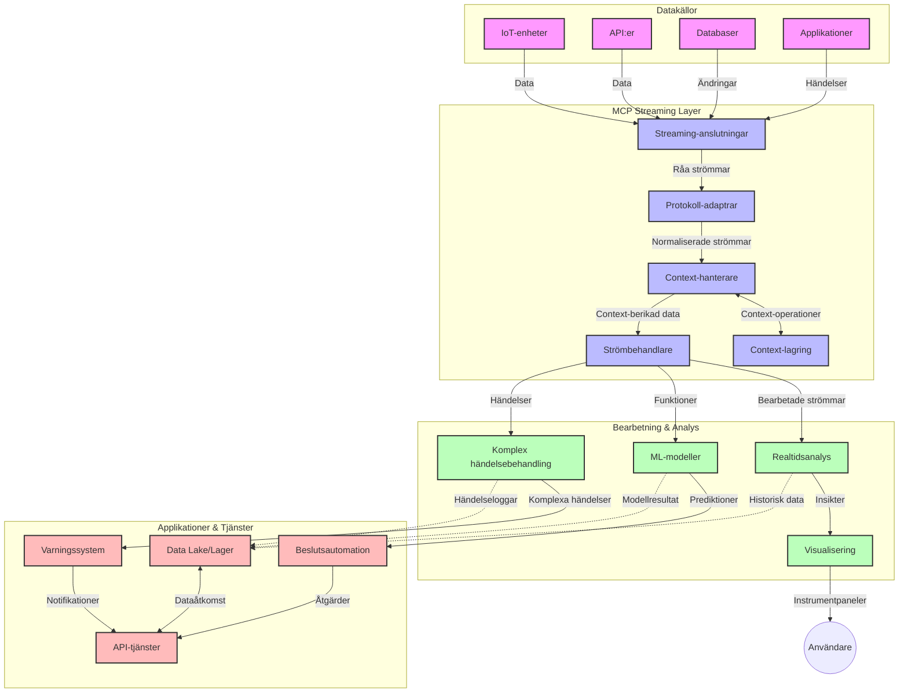

# Model Context Protocol för Realtidsdatastreaming

## Översikt

Realtidsdatastreaming har blivit väsentligt i dagens datadrivna värld, där företag och applikationer kräver omedelbar tillgång till information för att fatta snabba beslut. Model Context Protocol (MCP) representerar ett betydande framsteg i optimeringen av dessa realtidsströmningsprocesser, förbättrar databehandlingens effektivitet, upprätthåller kontextuell integritet och förbättrar den övergripande systemprestandan.

Denna modul undersöker hur MCP förvandlar realtidsdatastreaming genom att erbjuda ett standardiserat tillvägagångssätt för kontexthantering över AI-modeller, strömningsplattformar och applikationer.

## Introduktion till Realtidsdatastreaming

Realtidsdatastreaming är ett teknologiskt paradigmskifte som möjliggör kontinuerlig överföring, bearbetning och analys av data när den genereras, vilket tillåter system att reagera omedelbart på ny information. Till skillnad från traditionell batchbearbetning som arbetar på statiska dataset, bearbetar streaming data i rörelse, levererar insikter och åtgärder med minimal latens.

### Kärnkoncept för Realtidsdatastreaming:

- **Kontinuerligt dataflöde**: Data bearbetas som en kontinuerlig, oavbruten ström av händelser eller poster.
- **Låg latensbearbetning**: System är utformade för att minimera tiden mellan datagenerering och bearbetning.
- **Skalbarhet**: Streamingarkitekturer måste hantera variabla datavolym- och hastighetsnivåer.
- **Feluthållighet**: System måste vara motståndskraftiga mot fel för att säkerställa oavbrutet dataflöde.
- **Stateful bearbetning**: Att upprätthålla kontext över händelser är avgörande för meningsfull analys.

### Model Context Protocol och Realtidsstreaming

Model Context Protocol (MCP) hanterar flera kritiska utmaningar i realtidsströmningsmiljöer:

1. **Kontekstuell kontinuitet**: MCP standardiserar hur kontext upprätthålls över distribuerade strömningskomponenter och säkerställer att AI-modeller och bearbetningsnoder har tillgång till relevant historisk och miljöbaserad kontext.

2. **Effektiv tillståndshantering**: Genom att erbjuda strukturerade mekanismer för kontextöverföring minskar MCP hanteringskostnaden för tillstånd i strömningspipelines.

3. **Interoperabilitet**: MCP skapar ett gemensamt språk för kontextdelning mellan olika strömnings- och AI-teknologier, vilket möjliggör mer flexibla och utbyggbara arkitekturer.

4. **Streamingoptimerad kontext**: MCP-implementationer kan prioritera vilka kontekstelement som är mest relevanta för realtidsbeslut, vilket optimerar både prestanda och noggrannhet.

5. **Adaptiv bearbetning**: Med korrekt kontexthantering via MCP kan strömningssystem dynamiskt anpassa bearbetning baserat på föränderliga förhållanden och mönster i data.

I moderna applikationer, från IoT-sensornätverk till finansiella handelsplattformar, möjliggör integrationen av MCP med strömningssystem smartare, kontextmedveten bearbetning som kan reagera korrekt på komplexa och föränderliga situationer i realtid.

## Lärandemål

I slutet av denna lektion kommer du att kunna:

- Förstå grunderna i realtidsdatastreaming och dess utmaningar
- Förklara hur Model Context Protocol (MCP) förbättrar realtidsdatastreaming
- Implementera MCP-baserade strömningslösningar med populära ramverk som Kafka och Pulsar
- Designa och driftsätta feluthålliga, högpresterande strömningsarkitekturer med MCP
- Tillämpa MCP-koncept på IoT, finansiell handel och AI-drivna analysfall
- Utvärdera framväxande trender och framtida innovationer inom MCP-baserad strömning


### Definition och Betydelse

Realtidsdatastreaming innebär kontinuerlig generering, bearbetning och leverans av data med minimal latens. Till skillnad från batchbearbetning, där data samlas in och bearbetas i grupper, bearbetas streamingdata inkrementellt när den anländer, vilket möjliggör omedelbara insikter och åtgärder.

Nyckelkarakteristika för realtidsdatastreaming inkluderar:

- **Låg latens**: Bearbetning och analys av data inom millisekunder till sekunder
- **Kontinuerligt flöde**: Oavbrutna datastreams från olika källor
- **Omedelbar bearbetning**: Analyserar data när den anländer istället för i batchar
- **Händelsedriven arkitektur**: Svarar på händelser när de inträffar

### Utmaningar i Traditionell Datastreaming

Traditionella metoder för datastreaming möter flera begränsningar:

1. **Kontekstförlust**: Svårighet att bevara kontext över distribuerade system
2. **Skalbarhetsproblem**: Utmaningar att skala för att hantera hög volym och hastighet
3. **Integrationskomplexitet**: Problem med interoperabilitet mellan olika system
4. **Latenshantering**: Balans mellan genomströmning och bearbetningstid
5. **Datakonsistens**: Säkerställa datanoggrannhet och fullständighet över strömmen

## Förståelse av Model Context Protocol (MCP)

### Vad är MCP?

Model Context Protocol (MCP) är ett standardiserat kommunikationsprotokoll utformat för att underlätta effektiv interaktion mellan AI-modeller och applikationer. I kontexten av realtidsdatastreaming erbjuder MCP en ram för:

- Att bevara kontext genom hela datapipelinen
- Standardisera datautbytesformat
- Optimera överföring av stora dataset
- Förbättra kommunikation mellan modell-till-modell och modell-till-applikation

### Kärnkomponenter och Arkitektur

MCP-arkitekturen för realtidsstreaming består av flera nyckelkomponenter:

1. **Context Handlers**: Hanterar och upprätthåller kontextuell information genom strömningspipen
2. **Stream Processors**: Bearbetar inkommande datastreams med kontextmedvetna tekniker
3. **Protocol Adapters**: Konverterar mellan olika strömningsprotokoll samtidigt som kontext bevaras
4. **Context Store**: Effektivt lagrar och hämtar kontextuell information
5. **Streaming Connectors**: Ansluter till olika strömningsplattformar (Kafka, Pulsar, Kinesis, etc.)



### Hur MCP förbättrar realtidsdatahantering

MCP hanterar traditionella utmaningar inom streaming genom:

- **Kontektuell integritet**: Upprätthåller relationer mellan datapunkter genom hela pipelinen
- **Optimerad överföring**: Minskar redundant datautbyte via intelligent kontexthantering
- **Standardiserade gränssnitt**: Ger konsekventa API:er för strömningskomponenter
- **Minskad latens**: Minimerar bearbetningsöverhuvud via effektiv kontexthantering
- **Förbättrad skalbarhet**: Stöder horisontell skalning samtidigt som kontext bevaras

## Integration och Implementering

Realtidsdatastreamingsystem kräver noggrann arkitektonisk design och implementering för att bibehålla både prestanda och kontextuell integritet. Model Context Protocol erbjuder ett standardiserat tillvägagångssätt för att integrera AI-modeller och strömningsteknologier, vilket möjliggör mer sofistikerade och kontextmedvetna bearbetningspipelines.

### Översikt av MCP-integration i strömningsarkitekturer

Implementering av MCP i realtidsströmningsmiljöer involverar flera viktiga överväganden:

1. **Kontextserialisering och transport**: MCP erbjuder effektiva mekanismer för att koda kontextuell information inom strömningsdatapaket, vilket säkerställer att väsentlig kontext följer med data genom hela bearbetningspipen. Detta inkluderar standardiserade serialiseringsformat optimerade för streamingtransport.

2. **Stateful strömningsbearbetning**: MCP möjliggör mer intelligent stateful bearbetning genom att upprätthålla konsekvent kontextrepresentation över bearbetningsnoder. Detta är särskilt värdefullt i distribuerade streamingarkitekturer där tillståndshantering traditionellt är utmanande.

3. **Event-tid vs Processing-tid**: MCP-implementationer i strömningssystem måste hantera utmaningen att skilja mellan när händelser inträffade och när de bearbetas. Protokollet kan inkorporera temporal kontext som bevarar eventtidssemantik.

4. **Backpressure-hantering**: Genom att standardisera kontexthantering hjälper MCP till att hantera backpressure i strömningssystem, vilket tillåter komponenter att kommunicera sina bearbetningskapaciteter och justera flödet därefter.

5. **Kontextfönster och aggregering**: MCP underlättar mer sofistikerade fönsteroperationer genom att tillhandahålla strukturerade representationer av temporär och relationell kontext, vilket möjliggör mer meningsfulla aggregeringar över händelseströmmar.

6. **Exakt-en-gångs bearbetning**: I strömningssystem som kräver exakt-en-gång-semantik kan MCP inkorporera bearbetningsmetadata för att spåra och verifiera bearbetningsstatus över distribuerade komponenter.

Implementeringen av MCP i olika strömningsteknologier skapar en enhetlig strategi för kontexthantering, vilket minskar behovet av skräddarsydd integrationskod och samtidigt förbättrar systemets förmåga att upprätthålla meningsfull kontext när data flödar genom pipelinen.

### MCP i Olika Data Streaming-ramverk

Dessa exempel följer aktuell MCP-specifikation som fokuserar på ett JSON-RPC-baserat protokoll med distinkta transportmekanismer. Koden demonstrerar hur du kan implementera egna transportörer som integrerar strömningsplattformar som Kafka och Pulsar samtidigt som full kompatibilitet med MCP-protokollet bibehålls.

Exemplen är designade för att visa hur strömningsplattformar kan integreras med MCP för att leverera realtidsdatabehandling samtidigt som den kontextuella medvetenheten som är central för MCP bevaras. Detta tillvägagångssätt säkerställer att kodexemplen korrekt speglar MCP-specifikationens nuvarande status från och med juni 2025.

MCP kan integreras med populära strömningsramverk inklusive:

#### Apache Kafka Integration

```python
import asyncio
import json
from typing import Dict, Any, Optional
from confluent_kafka import Consumer, Producer, KafkaError
from mcp.client import Client, ClientCapabilities
from mcp.core.message import JsonRpcMessage
from mcp.core.transports import Transport

# Anpassad transportklass för att koppla MCP med Kafka
class KafkaMCPTransport(Transport):
    def __init__(self, bootstrap_servers: str, input_topic: str, output_topic: str):
        self.bootstrap_servers = bootstrap_servers
        self.input_topic = input_topic
        self.output_topic = output_topic
        self.producer = Producer({'bootstrap.servers': bootstrap_servers})
        self.consumer = Consumer({
            'bootstrap.servers': bootstrap_servers,
            'group.id': 'mcp-client-group',
            'auto.offset.reset': 'earliest'
        })
        self.message_queue = asyncio.Queue()
        self.running = False
        self.consumer_task = None
        
    async def connect(self):
        """Connect to Kafka and start consuming messages"""
        self.consumer.subscribe([self.input_topic])
        self.running = True
        self.consumer_task = asyncio.create_task(self._consume_messages())
        return self
        
    async def _consume_messages(self):
        """Background task to consume messages from Kafka and queue them for processing"""
        while self.running:
            try:
                msg = self.consumer.poll(1.0)
                if msg is None:
                    await asyncio.sleep(0.1)
                    continue
                
                if msg.error():
                    if msg.error().code() == KafkaError._PARTITION_EOF:
                        continue
                    print(f"Consumer error: {msg.error()}")
                    continue
                
                # Tolka meddelandevärdet som JSON-RPC
                try:
                    message_str = msg.value().decode('utf-8')
                    message_data = json.loads(message_str)
                    mcp_message = JsonRpcMessage.from_dict(message_data)
                    await self.message_queue.put(mcp_message)
                except Exception as e:
                    print(f"Error parsing message: {e}")
            except Exception as e:
                print(f"Error in consumer loop: {e}")
                await asyncio.sleep(1)
    
    async def read(self) -> Optional[JsonRpcMessage]:
        """Read the next message from the queue"""
        try:
            message = await self.message_queue.get()
            return message
        except Exception as e:
            print(f"Error reading message: {e}")
            return None
    
    async def write(self, message: JsonRpcMessage) -> None:
        """Write a message to the Kafka output topic"""
        try:
            message_json = json.dumps(message.to_dict())
            self.producer.produce(
                self.output_topic,
                message_json.encode('utf-8'),
                callback=self._delivery_report
            )
            self.producer.poll(0)  # Utlösa callbacks
        except Exception as e:
            print(f"Error writing message: {e}")
    
    def _delivery_report(self, err, msg):
        """Kafka producer delivery callback"""
        if err is not None:
            print(f'Message delivery failed: {err}')
        else:
            print(f'Message delivered to {msg.topic()} [{msg.partition()}]')
    
    async def close(self) -> None:
        """Close the transport"""
        self.running = False
        if self.consumer_task:
            self.consumer_task.cancel()
            try:
                await self.consumer_task
            except asyncio.CancelledError:
                pass
        self.consumer.close()
        self.producer.flush()

# Exempel på användning av Kafka MCP-transport
async def kafka_mcp_example():
    # Skapa MCP-klient med Kafka-transport
    client = Client(
        {"name": "kafka-mcp-client", "version": "1.0.0"},
        ClientCapabilities({})
    )
    
    # Skapa och anslut Kafka-transporten
    transport = KafkaMCPTransport(
        bootstrap_servers="localhost:9092",
        input_topic="mcp-responses",
        output_topic="mcp-requests"
    )
    
    await client.connect(transport)
    
    try:
        # Initiera MCP-sessionen
        await client.initialize()
        
        # Exempel på att köra ett verktyg via MCP
        response = await client.execute_tool(
            "process_data",
            {
                "data": "sample data",
                "metadata": {
                    "source": "sensor-1",
                    "timestamp": "2025-06-12T10:30:00Z"
                }
            }
        )
        
        print(f"Tool execution response: {response}")
        
        # Säkert avslut
        await client.shutdown()
    finally:
        await transport.close()

# Kör exemplet
if __name__ == "__main__":
    asyncio.run(kafka_mcp_example())
```

#### Apache Pulsar Implementation

```python
import asyncio
import json
import pulsar
from typing import Dict, Any, Optional
from mcp.core.message import JsonRpcMessage
from mcp.core.transports import Transport
from mcp.server import Server, ServerOptions
from mcp.server.tools import Tool, ToolExecutionContext, ToolMetadata

# Skapa en anpassad MCP-transport som använder Pulsar
class PulsarMCPTransport(Transport):
    def __init__(self, service_url: str, request_topic: str, response_topic: str):
        self.service_url = service_url
        self.request_topic = request_topic
        self.response_topic = response_topic
        self.client = pulsar.Client(service_url)
        self.producer = self.client.create_producer(response_topic)
        self.consumer = self.client.subscribe(
            request_topic,
            "mcp-server-subscription",
            consumer_type=pulsar.ConsumerType.Shared
        )
        self.message_queue = asyncio.Queue()
        self.running = False
        self.consumer_task = None
    
    async def connect(self):
        """Connect to Pulsar and start consuming messages"""
        self.running = True
        self.consumer_task = asyncio.create_task(self._consume_messages())
        return self
    
    async def _consume_messages(self):
        """Background task to consume messages from Pulsar and queue them for processing"""
        while self.running:
            try:
                # Icke-blockerande mottagning med timeout
                msg = self.consumer.receive(timeout_millis=500)
                
                # Bearbeta meddelandet
                try:
                    message_str = msg.data().decode('utf-8')
                    message_data = json.loads(message_str)
                    mcp_message = JsonRpcMessage.from_dict(message_data)
                    await self.message_queue.put(mcp_message)
                    
                    # Bekräfta meddelandet
                    self.consumer.acknowledge(msg)
                except Exception as e:
                    print(f"Error processing message: {e}")
                    # Negativ bekräftelse om det uppstod ett fel
                    self.consumer.negative_acknowledge(msg)
            except Exception as e:
                # Hantera timeout eller andra undantag
                await asyncio.sleep(0.1)
    
    async def read(self) -> Optional[JsonRpcMessage]:
        """Read the next message from the queue"""
        try:
            message = await self.message_queue.get()
            return message
        except Exception as e:
            print(f"Error reading message: {e}")
            return None
    
    async def write(self, message: JsonRpcMessage) -> None:
        """Write a message to the Pulsar output topic"""
        try:
            message_json = json.dumps(message.to_dict())
            self.producer.send(message_json.encode('utf-8'))
        except Exception as e:
            print(f"Error writing message: {e}")
    
    async def close(self) -> None:
        """Close the transport"""
        self.running = False
        if self.consumer_task:
            self.consumer_task.cancel()
            try:
                await self.consumer_task
            except asyncio.CancelledError:
                pass
        self.consumer.close()
        self.producer.close()
        self.client.close()

# Definiera ett exempelverktyg för MCP som bearbetar strömmande data
@Tool(
    name="process_streaming_data",
    description="Process streaming data with context preservation",
    metadata=ToolMetadata(
        required_capabilities=["streaming"]
    )
)
async def process_streaming_data(
    ctx: ToolExecutionContext,
    data: str,
    source: str,
    priority: str = "medium"
) -> Dict[str, Any]:
    """
    Process streaming data while preserving context
    
    Args:
        ctx: Tool execution context
        data: The data to process
        source: The source of the data
        priority: Priority level (low, medium, high)
        
    Returns:
        Dict containing processed results and context information
    """
    # Exempel på bearbetning som använder MCP-kontext
    print(f"Processing data from {source} with priority {priority}")
    
    # Åtkomst till konversationskontext från MCP
    conversation_id = ctx.conversation_id if hasattr(ctx, 'conversation_id') else "unknown"
    
    # Returnera resultat med förbättrad kontext
    return {
        "processed_data": f"Processed: {data}",
        "context": {
            "conversation_id": conversation_id,
            "source": source,
            "priority": priority,
            "processing_timestamp": ctx.get_current_time_iso()
        }
    }

# Exempel på MCP-serverimplementation som använder Pulsar-transport
async def run_mcp_server_with_pulsar():
    # Skapa MCP-server
    server = Server(
        {"name": "pulsar-mcp-server", "version": "1.0.0"},
        ServerOptions(
            capabilities={"streaming": True}
        )
    )
    
    # Registrera vårt verktyg
    server.register_tool(process_streaming_data)
    
    # Skapa och anslut Pulsar-transport
    transport = PulsarMCPTransport(
        service_url="pulsar://localhost:6650",
        request_topic="mcp-requests",
        response_topic="mcp-responses"
    )
    
    try:
        # Starta servern med Pulsar-transporten
        await server.run(transport)
    finally:
        await transport.close()

# Kör servern
if __name__ == "__main__":
    asyncio.run(run_mcp_server_with_pulsar())
```

### Bästa Praxis för Driftsättning

När du implementerar MCP för realtidsstreaming:

1. **Designa för feluthållighet**:
   - Implementera korrekt felhantering
   - Använd dead-letter-köer för misslyckade meddelanden
   - Designa idempotenta processorer

2. **Optimera för prestanda**:
   - Konfigurera lämpliga buffertstorlekar
   - Använd batchning där det är lämpligt
   - Implementera backpressure-mekanismer

3. **Övervaka och observera**:
   - Spåra strömmande bearbetningsmått
   - Övervaka kontextpropagering
   - Sätt upp larm för avvikelser

4. **Säkra dina strömmar**:
   - Implementera kryptering för känslig data
   - Använd autentisering och auktorisering
   - Tillämpa korrekta åtkomstkontroller


### MCP i IoT och Edge Computing

MCP förbättrar IoT-streaming genom att:

- Bevara enhetskontext över hela bearbetningspipen
- Möjliggöra effektiv edge-till-moln datastreaming
- Stödja realtidsanalys på IoT-datastreams
- Underlätta enhet-till-enhet-kommunikation med kontext

Exempel: Smart City Sensorsystem
```
Sensors → Edge Gateways → MCP Stream Processors → Real-time Analytics → Automated Responses
```

### Roll i Finansiella Transaktioner och High-Frequency Trading

MCP ger betydande fördelar för finansiell datastreaming:

- Ultra-låg latensbearbetning för handelsbeslut
- Upprätthållande av transaktionskontext genom hela bearbetningen
- Stöd för komplex händelsebearbetning med kontextmedvetenhet
- Säkerställande av datakonsistens över distribuerade handelssystem

### Förbättring av AI-drivna Dataanalyser

MCP öppnar nya möjligheter för streaminganalys:

- Realtidsmodellträning och inferens
- Kontinuerligt lärande från streamingdata
- Kontextmedveten funktionsutvinning
- Multimodell-inferenspipelines med bevarad kontext

## Framtida Trender och Innovationer

### MCP:s utveckling i Realtidsmiljöer

Med blicken framåt förväntas MCP utvecklas för att hantera:

- **Integration med kvantdatorer**: Förberedelser för kvantbaserade strömningssystem
- **Edge-native bearbetning**: Flytta mer kontextmedveten bearbetning till edge-enheter
- **Autonom strömningshantering**: Självoptimerande strömningspipelines
- **Federated Streaming**: Distribuerad bearbetning samtidigt som integritet bevaras

### Potentiella Teknologiska Framsteg

Framväxande teknologier som kommer att forma MCP-streamingens framtid:

1. **AI-optimerade strömningsprotokoll**: Specialdesignade protokoll specificerade för AI-arbetsbelastningar
2. **Neuromorfisk databehandling**: Hjärninspirerad databehandling för strömningsbearbetning
3. **Serverlös streaming**: Händelsedriven, skalbar streaming utan infrastrukturhantering
4. **Distribuerade Context Stores**: Globalt distribuerad men högkonsistent kontexthantering

## Praktiska Övningar

### Övning 1: Sätta upp en grundläggande MCP-strömningspipeline

I denna övning lär du dig att:
- Konfigurera en grundläggande MCP-strömningsmiljö
- Implementera kontexthanterare för strömningsbearbetning
- Testa och validera kontextbevarande

### Övning 2: Skapa en Realtidsanalys Dashboard

Skapa en komplett applikation som:
- Tar emot strömmande data via MCP
- Bearbetar strömmen medan den upprätthåller kontext
- Visualiserar resultat i realtid

### Övning 3: Implementera avancerad händelsebearbetning med MCP

Avancerad övning som täcker:
- Mönsterigenkänning i strömmar
- Kontextuell korrelation över flera strömmar
- Generering av komplexa händelser med bevarad kontext

## Ytterligare Resurser

- [Model Context Protocol Specification](https://modelcontextprotocol.io) - Officiell MCP-specifikation och dokumentation
- [Apache Kafka Documentation](https://kafka.apache.org/documentation/) - Lär dig om Kafka för strömningsbearbetning
- [Apache Pulsar](https://pulsar.apache.org/) - Enhetlig meddelande- och strömningsplattform
- [Streaming Systems: The What, Where, When, and How of Large-Scale Data Processing](https://www.oreilly.com/library/view/streaming-systems/9781491983867/) - Omfattande bok om strömningsarkitekturer
- [Microsoft Azure Event Hubs](https://learn.microsoft.com/azure/event-hubs/event-hubs-about) - Hanterad tjänst för händelseströmning
- [MLflow Documentation](https://mlflow.org/docs/latest/index.html) - För spårning och driftsättning av ML-modeller
- [Real-Time Analytics with Apache Storm](https://storm.apache.org/releases/current/index.html) - Bearbetningsramverk för realtidsberäkning
- [Flink ML](https://nightlies.apache.org/flink/flink-ml-docs-master/) - Maskininlärningsbibliotek för Apache Flink
- [LangChain Documentation](https://python.langchain.com/docs/get_started/introduction) - Skapa applikationer med LLMs


## Läranderesultat

Genom att slutföra denna modul kommer du att kunna:

- Förstå grunderna i realtidsdatastreaming och dess utmaningar
- Förklara hur Model Context Protocol (MCP) förbättrar realtidsdatastreaming
- Implementera MCP-baserade strömningslösningar med populära ramverk som Kafka och Pulsar
- Designa och driftsätta feluthålliga, högpresterande strömningsarkitekturer med MCP
- Tillämpa MCP-koncept på IoT, finansiell handel och AI-drivna analysfall
- Utvärdera framväxande trender och framtida innovationer inom MCP-baserad strömning

## Vad händer härnäst

- [5.11 Realtime Search](../mcp-realtimesearch/README.md)

---

<!-- CO-OP TRANSLATOR DISCLAIMER START -->
**Ansvarsfriskrivning**:
Detta dokument har översatts med hjälp av AI-översättningstjänsten [Co-op Translator](https://github.com/Azure/co-op-translator). Även om vi strävar efter noggrannhet, var vänlig notera att automatiska översättningar kan innehålla fel eller brister. Det ursprungliga dokumentet på dess modersmål bör betraktas som den auktoritativa källan. För kritisk information rekommenderas professionell mänsklig översättning. Vi ansvarar inte för några missförstånd eller feltolkningar som uppstår till följd av användningen av denna översättning.
<!-- CO-OP TRANSLATOR DISCLAIMER END -->