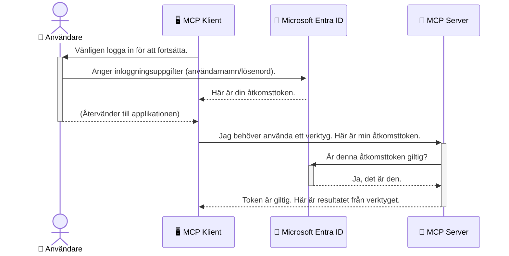

# Säkerställ AI-arbetsflöden: Entra ID-autentisering för Model Context Protocol-servrar

## Introduktion
Att säkra din Model Context Protocol (MCP)-server är lika viktigt som att låsa ytterdörren till ditt hus. Att lämna din MCP-server öppen utsätter dina verktyg och data för obehörig åtkomst, vilket kan leda till säkerhetsöverträdelser. Microsoft Entra ID erbjuder en robust molnbaserad lösning för identitets- och åtkomsthantering, som hjälper till att säkerställa att endast auktoriserade användare och applikationer kan interagera med din MCP-server. I detta avsnitt kommer du att lära dig hur du skyddar dina AI-arbetsflöden med hjälp av autentisering via Entra ID.

## Läromål
När du har avslutat detta avsnitt ska du kunna:

- Förstå vikten av att säkra MCP-servrar.
- Förklara grunderna i Microsoft Entra ID och OAuth 2.0-autentisering.
- Känna igen skillnaden mellan publika och konfidentiella klienter.
- Implementera Entra ID-autentisering i både lokala (publik klient) och fjärrstyrda (konfidentiell klient) MCP-server-scenarier.
- Tillämpa bästa säkerhetspraxis vid utveckling av AI-arbetsflöden.

## Säkerhet och MCP

Precis som du inte skulle lämna ytterdörren olåst ska du inte lämna din MCP-server öppen för vem som helst att komma åt. Att säkra dina AI-arbetsflöden är avgörande för att bygga robusta, pålitliga och säkra applikationer. Detta kapitel introducerar hur du använder Microsoft Entra ID för att säkra dina MCP-servrar, så att endast auktoriserade användare och applikationer kan interagera med dina verktyg och data.

## Varför säkerhet är viktigt för MCP-servrar

Föreställ dig att din MCP-server har ett verktyg som kan skicka e-post eller komma åt en kunddatabas. En osäker server skulle innebära att vem som helst kan använda detta verktyg, vilket leder till obehörig dataåtkomst, skräppost eller andra skadliga aktiviteter.

Genom att implementera autentisering säkerställer du att varje förfrågan till din server verifieras, vilket bekräftar identiteten på användaren eller applikationen som gör förfrågan. Detta är det första och mest kritiska steget för att säkra dina AI-arbetsflöden.

## Introduktion till Microsoft Entra ID

[**Microsoft Entra ID**](https://adoption.microsoft.com/microsoft-security/entra/) är en molnbaserad tjänst för identitets- och åtkomsthantering. Tänk på det som en universell säkerhetsvakt för dina applikationer. Den hanterar den komplexa processen att verifiera användaridentiteter (autentisering) och att bestämma vad de får göra (auktorisation).

Genom att använda Entra ID kan du:

- Möjliggöra säker inloggning för användare.
- Skydda API:er och tjänster.
- Hantera åtkomstpolicyer från en central plats.

För MCP-servrar erbjuder Entra ID en robust och allmänt betrodd lösning för att hantera vem som kan komma åt serverns funktioner.

---

## Förstå magin: Hur Entra ID-autentisering fungerar

Entra ID använder öppna standarder som **OAuth 2.0** för att hantera autentisering. Även om detaljerna kan vara komplexa är kärnkonceptet enkelt och kan förstås med en analogi.

### En enkel introduktion till OAuth 2.0: Nyckeln till parkeringsvakten

Tänk på OAuth 2.0 som en parkeringsvaktstjänst för din bil. När du anländer till en restaurang ger du inte parkeringsvakten din huvudnyckel. Istället ger du en **parkeringsnyckel** som har begränsade behörigheter – den kan starta bilen och låsa dörrarna, men kan inte öppna bagageutrymmet eller handskfacket.

I denna analogi:

- **Du** är **Användaren**.
- **Din bil** är **MCP-servern** med dess värdefulla verktyg och data.
- **Parkeringsvakten** är **Microsoft Entra ID**.
- **Parkeringsassistenten** är **MCP-klienten** (applikationen som försöker nå servern).
- **Parkeringsnyckeln** är **Åtkomsttoken**.

Åtkomsttoken är en säker textsträng som MCP-klienten får från Entra ID efter att du loggat in. Klienten skickar sedan denna token till MCP-servern med varje begäran. Servern kan verifiera token för att säkerställa att förfrågan är legitim och att klienten har nödvändiga behörigheter, utan att någonsin behöva hantera dina faktiska inloggningsuppgifter (som ditt lösenord).

### Autentiseringsflödet

Så här fungerar processen i praktiken:



### Introduktion till Microsoft Authentication Library (MSAL)

Innan vi går in på koden är det viktigt att introducera en nyckelkomponent som du kommer att se i exemplen: **Microsoft Authentication Library (MSAL)**.

MSAL är ett bibliotek utvecklat av Microsoft som gör det mycket enklare för utvecklare att hantera autentisering. Istället för att du måste skriva all komplex kod för att hantera säkerhetstoken, hantera inloggningar och förnya sessioner tar MSAL hand om det tyngsta jobbet.

Att använda ett bibliotek som MSAL rekommenderas starkt eftersom:

- **Det är säkert:** Det implementerar industristandardprotokoll och säkerhetsbästa praxis, vilket minskar risken för sårbarheter i din kod.
- **Det förenklar utveckling:** Det abstraherar komplexiteten i OAuth 2.0 och OpenID Connect-protokollen, vilket gör det möjligt att lägga till robust autentisering i din applikation med bara några få rader kod.
- **Det är underhållet:** Microsoft underhåller och uppdaterar aktivt MSAL för att hantera nya säkerhetshot och plattformsförändringar.

MSAL stöder ett brett urval av språk och applikationsramverk, inklusive .NET, JavaScript/TypeScript, Python, Java, Go och mobila plattformar som iOS och Android. Detta innebär att du kan använda samma konsekventa autentiseringsmönster i hela din teknikstack.

För att läsa mer om MSAL kan du besöka den officiella [övergripande MSAL-dokumentationen](https://learn.microsoft.com/entra/identity-platform/msal-overview).

---

## Säkra din MCP-server med Entra ID: En steg-för-steg-guide

Nu ska vi gå igenom hur man säkrar en lokal MCP-server (en som kommunicerar via `stdio`) med hjälp av Entra ID. Detta exempel använder en **publik klient**, vilket är lämpligt för applikationer som körs på en användares dator, som en skrivbordsapp eller lokal utvecklingsserver.

### Scenario 1: Säkerställa en lokal MCP-server (med publik klient)

I detta scenario tittar vi på en MCP-server som körs lokalt, kommunicerar över `stdio` och använder Entra ID för att autentisera användaren innan verktygen får tillgång. Servern kommer att ha ett enda verktyg som hämtar användarens profilinformation från Microsoft Graph API.

#### 1. Ställa in applikationen i Entra ID

Innan du skriver någon kod måste du registrera din applikation i Microsoft Entra ID. Detta talar om för Entra ID om din applikation och ger den rättigheter att använda autentiseringstjänsten.

1. Navigera till **[Microsoft Entra-portalen](https://entra.microsoft.com/)**.
2. Gå till **Appregistreringar** och klicka på **Ny registrering**.
3. Ge din applikation ett namn (t.ex. "Min lokala MCP-server").
4. För **Stödda kontotyper**, välj **Konton endast i denna organisationskatalog**.
5. Du kan lämna **Omdirigerings-URI** tom för detta exempel.
6. Klicka på **Registrera**.

När registreringen är klar, notera **Applikations-ID (klient-ID)** och **Katalog-ID (tenant-ID)**. Du behöver dessa i din kod.

#### 2. Koden: En genomgång

Låt oss titta på huvuddelarna i koden som hanterar autentisering. Den fullständiga koden för detta exempel finns i mappen [Entra ID - Local - WAM](https://github.com/Azure-Samples/mcp-auth-servers/tree/main/src/entra-id-local-wam) i [mcp-auth-servers GitHub-repositoryn](https://github.com/Azure-Samples/mcp-auth-servers).

**`AuthenticationService.cs`**

Denna klass ansvarar för att hantera interaktionen med Entra ID.

- **`CreateAsync`**: Denna metod initierar `PublicClientApplication` från MSAL (Microsoft Authentication Library). Den konfigureras med din applikations `clientId` och `tenantId`.
- **`WithBroker`**: Detta möjliggör användning av en broker (som Windows Web Account Manager), vilket ger en säkrare och smidigare single sign-on-upplevelse.
- **`AcquireTokenAsync`**: Detta är kärnmetoden. Den försöker först hämta en token tyst (vilket innebär att användaren inte behöver logga in igen om de redan har en giltig session). Om en tyst token inte kan hämtas kommer den att be användaren att logga in interaktivt.

```csharp
// Simplified for clarity
public static async Task<AuthenticationService> CreateAsync(ILogger<AuthenticationService> logger)
{
    var msalClient = PublicClientApplicationBuilder
        .Create(_clientId) // Your Application (client) ID
        .WithAuthority(AadAuthorityAudience.AzureAdMyOrg)
        .WithTenantId(_tenantId) // Your Directory (tenant) ID
        .WithBroker(new BrokerOptions(BrokerOptions.OperatingSystems.Windows))
        .Build();

    // ... cache registration ...

    return new AuthenticationService(logger, msalClient);
}

public async Task<string> AcquireTokenAsync()
{
    try
    {
        // Try silent authentication first
        var accounts = await _msalClient.GetAccountsAsync();
        var account = accounts.FirstOrDefault();

        AuthenticationResult? result = null;

        if (account != null)
        {
            result = await _msalClient.AcquireTokenSilent(_scopes, account).ExecuteAsync();
        }
        else
        {
            // If no account, or silent fails, go interactive
            result = await _msalClient.AcquireTokenInteractive(_scopes).ExecuteAsync();
        }

        return result.AccessToken;
    }
    catch (Exception ex)
    {
        _logger.LogError(ex, "An error occurred while acquiring the token.");
        throw; // Optionally rethrow the exception for higher-level handling
    }
}
```

**`Program.cs`**

Här sätts MCP-servern upp och autentiseringstjänsten integreras.

- **`AddSingleton<AuthenticationService>`**: Detta registrerar `AuthenticationService` i dependency injection-behållaren, så att den kan användas av andra delar av applikationen (som vårt verktyg).
- **`GetUserDetailsFromGraph`-verktyget**: Detta verktyg kräver en instans av `AuthenticationService`. Innan det gör något, anropar det `authService.AcquireTokenAsync()` för att hämta en giltig åtkomsttoken. Om autentiseringen lyckas använder det token för att anropa Microsoft Graph API och hämta användarens information.

```csharp
// Simplified for clarity
[McpServerTool(Name = "GetUserDetailsFromGraph")]
public static async Task<string> GetUserDetailsFromGraph(
    AuthenticationService authService)
{
    try
    {
        // This will trigger the authentication flow
        var accessToken = await authService.AcquireTokenAsync();

        // Use the token to create a GraphServiceClient
        var graphClient = new GraphServiceClient(
            new BaseBearerTokenAuthenticationProvider(new TokenProvider(authService)));

        var user = await graphClient.Me.GetAsync();

        return System.Text.Json.JsonSerializer.Serialize(user);
    }
    catch (Exception ex)
    {
        return $"Error: {ex.Message}";
    }
}
```

#### 3. Hur allt fungerar tillsammans

1. När MCP-klienten försöker använda verktyget `GetUserDetailsFromGraph` anropar verktyget först `AcquireTokenAsync`.
2. `AcquireTokenAsync` triggar MSAL-biblioteket att kontrollera om en giltig token finns.
3. Om ingen token hittas kommer MSAL, via brokern, att be användaren logga in med sitt Entra ID-konto.
4. När användaren loggar in utfärdar Entra ID en åtkomsttoken.
5. Verktyget tar emot token och använder den för att göra ett säkert anrop till Microsoft Graph API.
6. Användarens detaljer returneras till MCP-klienten.

Denna process säkerställer att endast autentiserade användare kan använda verktyget och säkrar därmed effektivt din lokala MCP-server.

### Scenario 2: Säkerställa en fjärrstyrd MCP-server (med konfidentiell klient)

När din MCP-server körs på en fjärrmaskin (som en molnserver) och kommunicerar över ett protokoll som HTTP Streaming, skiljer sig säkerhetskraven. I detta fall bör du använda en **konfidentiell klient** och **Authorization Code Flow**. Detta är en säkrare metod eftersom applikationens hemligheter aldrig exponeras för webbläsaren.

Detta exempel använder en TypeScript-baserad MCP-server som använder Express.js för att hantera HTTP-förfrågningar.

#### 1. Ställa in applikationen i Entra ID

Inställningen i Entra ID är liknande den för publik klient, men med en viktig skillnad: du måste skapa en **klienthemlighet**.

1. Navigera till **[Microsoft Entra-portalen](https://entra.microsoft.com/)**.
2. Gå till din appregistrering, öppna fliken **Certifikat och hemligheter**.
3. Klicka på **Ny klienthemlighet**, ge den en beskrivning och klicka på **Lägg till**.
4. **Viktigt:** Kopiera hemlighetsvärdet direkt. Du kommer inte kunna se det igen.
5. Du måste också konfigurera en **Omdirigerings-URI**. Gå till fliken **Autentisering**, klicka på **Lägg till en plattform**, välj **Webb**, och ange omdirigerings-URI:n för din applikation (t.ex. `http://localhost:3001/auth/callback`).

> **⚠️ Viktigt säkerhetsmeddelande:** För produktionsapplikationer rekommenderar Microsoft starkt att använda **autentisering utan hemlighet** som t.ex. **Managed Identity** eller **Workload Identity Federation** istället för klienthemligheter. Klienthemligheter kan innebära säkerhetsrisker eftersom de kan exponeras eller komprometteras. Hanterade identiteter ger en säkrare metod genom att eliminera behovet av att lagra inloggningsuppgifter i kod eller konfiguration.
>
> För mer information om hanterade identiteter och hur du implementerar dem, se [Översikt av hanterade identiteter för Azure-resurser](https://learn.microsoft.com/entra/identity/managed-identities-azure-resources/overview).

#### 2. Koden: En genomgång

Detta exempel använder en sessionsbaserad metod. När användaren autentiserar lagrar servern åtkomsttoken och uppfriskningstoken i en session och ger användaren en sessionstoken. Denna sessionstoken används sedan för efterföljande förfrågningar. Den fullständiga koden för detta exempel finns i mappen [Entra ID - Confidential client](https://github.com/Azure-Samples/mcp-auth-servers/tree/main/src/entra-id-cca-session) i [mcp-auth-servers GitHub-repositoryn](https://github.com/Azure-Samples/mcp-auth-servers).

**`Server.ts`**

Denna fil sätter upp Express-servern och MCP-transportlagret.

- **`requireBearerAuth`**: Detta är middleware som skyddar `/sse` och `/message` endpoints. Den kontrollerar att en giltig bearer-token finns i `Authorization`-huvudet i förfrågan.
- **`EntraIdServerAuthProvider`**: Detta är en anpassad klass som implementerar `McpServerAuthorizationProvider`-gränssnittet. Den ansvarar för att hantera OAuth 2.0-flödet.
- **`/auth/callback`**: Denna endpoint hanterar redirect från Entra ID efter att användaren autentiserat. Den byter auktoriseringskoden mot en åtkomsttoken och en uppfriskningstoken.

```typescript
// Förenklat för tydlighet
const app = express();
const { server } = createServer();
const provider = new EntraIdServerAuthProvider();

// Skydda SSE-endpointen
app.get("/sse", requireBearerAuth({
  provider,
  requiredScopes: ["User.Read"]
}), async (req, res) => {
  // ... anslut till transporten ...
});

// Skydda meddelandeendpointen
app.post("/message", requireBearerAuth({
  provider,
  requiredScopes: ["User.Read"]
}), async (req, res) => {
  // ... hantera meddelandet ...
});

// Hantera OAuth 2.0 callback
app.get("/auth/callback", (req, res) => {
  provider.handleCallback(req.query.code, req.query.state)
    .then(result => {
      // ... hantera framgång eller misslyckande ...
    });
});
```

**`Tools.ts`**

Denna fil definierar verktyg som MCP-servern tillhandahåller. `getUserDetails`-verktyget är liknande det i föregående exempel, men hämtar åtkomsttoken från sessionen.

```typescript
// Förenklat för tydlighet
server.setRequestHandler(CallToolRequestSchema, async (request) => {
  const { name } = request.params;
  const context = request.params?.context as { token?: string } | undefined;
  const sessionToken = context?.token;

  if (name === ToolName.GET_USER_DETAILS) {
    if (!sessionToken) {
      throw new AuthenticationError("Authentication token is missing or invalid. Ensure the token is provided in the request context.");
    }

    // Hämta Entra ID-token från sessionslagret
    const tokenData = tokenStore.getToken(sessionToken);
    const entraIdToken = tokenData.accessToken;

    const graphClient = Client.init({
      authProvider: (done) => {
        done(null, entraIdToken);
      }
    });

    const user = await graphClient.api('/me').get();

    // ... returnera användaruppgifter ...
  }
});
```

**`auth/EntraIdServerAuthProvider.ts`**

Denna klass hanterar logiken för:

- Att dirigera användaren till Entra ID:s inloggningssida.
- Att byta auktoriseringskoden mot en åtkomsttoken.
- Att lagra token i `tokenStore`.
- Att förnya åtkomsttoken när den går ut.

#### 3. Hur allt fungerar tillsammans

1. När en användare först försöker ansluta till MCP-servern ser `requireBearerAuth`-middleware att det inte finns någon giltig session och omdirigerar användaren till inloggningssidan för Entra ID.
2. Användaren loggar in med sitt Entra ID-konto.
3. Entra ID omdirigerar användaren tillbaka till `/auth/callback`-slutpunkten med en auktoriseringskod.  
4. Servern byter koden mot en åtkomsttoken och en uppfräschnings-token, sparar dem och skapar en sessionstoken som skickas till klienten.  
5. Klienten kan nu använda denna sessionstoken i `Authorization`-huvudet för alla framtida förfrågningar till MCP-servern.  
6. När verktyget `getUserDetails` anropas använder det sessionstoken för att slå upp Entra ID:s åtkomsttoken och använder sedan den för att anropa Microsoft Graph API.

Detta flöde är mer komplext än flödet för offentlig klient, men krävs för internetexponerade slutpunkter. Eftersom fjärrserverar för MCP är tillgängliga över det publika internet behöver de starkare säkerhetsåtgärder för att skydda mot obehörig åtkomst och potentiella attacker.


## Säkerhetsbästa praxis

- **Använd alltid HTTPS**: Kryptera kommunikationen mellan klient och server för att skydda tokens från att avlyssnas.  
- **Implementera rollbaserad åtkomstkontroll (RBAC)**: Kontrollera inte bara *om* en användare är autentiserad; kontrollera *vad* de är auktoriserade att göra. Du kan definiera roller i Entra ID och kontrollera dessa i din MCP-server.  
- **Övervaka och granska**: Logga alla autentiseringshändelser så att du kan upptäcka och reagera på misstänkt aktivitet.  
- **Hantera hastighetsbegränsning och reglering**: Microsoft Graph och andra API:er implementerar hastighetsbegränsningar för att förhindra missbruk. Implementera exponentiell backoff och omförsökslogik i din MCP-server för att hantera HTTP 429 (För många förfrågningar) på ett smidigt sätt. Överväg caching av ofta åtkommen data för att minska API-anrop.  
- **Säkert lagra tokens**: Spara åtkomst- och uppfräschnings-token säkert. För lokala applikationer, använd systemets säkra lagringsmekanismer. För serverapplikationer, överväg krypterad lagring eller säkra nyckelhanteringstjänster som Azure Key Vault.  
- **Hantering av tokenutgång**: Åtkomsttoken har en begränsad livslängd. Implementera automatisk tokenuppdatering med hjälp av uppfräschnings-token för att bibehålla en sömlös användarupplevelse utan krav på omautentisering.  
- **Överväg att använda Azure API Management**: Medan implementering av säkerhet direkt i din MCP-server ger dig detaljstyrning, kan API-gateways som Azure API Management hantera många av dessa säkerhetsfrågor automatiskt, inklusive autentisering, auktorisation, hastighetsbegränsning och övervakning. De tillhandahåller ett centraliserat säkerhetslager som sitter mellan dina klienter och dina MCP-servrar. För fler detaljer om att använda API-gateways med MCP, se vår [Azure API Management Your Auth Gateway For MCP Servers](https://techcommunity.microsoft.com/blog/integrationsonazureblog/azure-api-management-your-auth-gateway-for-mcp-servers/4402690).


## Viktiga slutsatser

- Att säkra din MCP-server är avgörande för att skydda dina data och verktyg.  
- Microsoft Entra ID erbjuder en robust och skalbar lösning för autentisering och auktorisation.  
- Använd en **offentlig klient** för lokala applikationer och en **konfidentiell klient** för fjärrservrar.  
- **Authorization Code Flow** är det säkraste alternativet för webbapplikationer.


## Övning

1. Fundera på en MCP-server som du kan tänka dig att bygga. Skulle det vara en lokal server eller en fjärrserver?  
2. Baserat på ditt svar, skulle du använda en offentlig eller konfidentiell klient?  
3. Vilken behörighet skulle din MCP-server begära för att utföra åtgärder mot Microsoft Graph?


## Praktiska övningar

### Övning 1: Registrera en applikation i Entra ID  
Navigera till Microsoft Entra-portalen.  
Registrera en ny applikation för din MCP-server.  
Anteckna applikations-ID (klient-ID) och katalog-ID (tenant-ID).

### Övning 2: Säkerställ en lokal MCP-server (offentlig klient)  
- Följ kodexemplet för att integrera MSAL (Microsoft Authentication Library) för användarautentisering.  
- Testa autentiseringsflödet genom att anropa MCP-verktyget som hämtar användardetaljer från Microsoft Graph.

### Övning 3: Säkerställ en fjärr-MCP-server (konfidentiell klient)  
- Registrera en konfidentiell klient i Entra ID och skapa en klienthemlighet.  
- Konfigurera din Express.js MCP-server att använda Authorization Code Flow.  
- Testa de skyddade slutpunkterna och bekräfta åtkomst baserat på token.

### Övning 4: Tillämpa säkerhetsbästa praxis  
- Aktivera HTTPS för din lokala eller fjärrserver.  
- Implementera rollbaserad åtkomstkontroll (RBAC) i din serverlogik.  
- Lägg till hantering av tokenutgång och säker tokenlagring.


## Resurser

1. **MSAL Översiktsdokumentation**  
   Lär dig hur Microsoft Authentication Library (MSAL) möjliggör säker tokenhämtning över plattformar:  
   [MSAL Overview on Microsoft Learn](https://learn.microsoft.com/en-gb/entra/msal/overview)

2. **Azure-Samples/mcp-auth-servers GitHub-repo**  
   Referensimplementationer av MCP-servrar som demonstrerar autentiseringsflöden:  
   [Azure-Samples/mcp-auth-servers on GitHub](https://github.com/Azure-Samples/mcp-auth-servers)

3. **Översikt av Managed Identities för Azure Resources**  
   Förstå hur du eliminerar hemligheter genom att använda system- eller användartilldelade hanterade identiteter:  
   [Managed Identities Overview on Microsoft Learn](https://learn.microsoft.com/en-us/entra/identity/managed-identities-azure-resources/)

4. **Azure API Management: Din Auth-gateway för MCP-servrar**  
   En djupdykning i att använda APIM som en säker OAuth2-gateway för MCP-servrar:  
   [Azure API Management Your Auth Gateway For MCP Servers](https://techcommunity.microsoft.com/blog/integrationsonazureblog/azure-api-management-your-auth-gateway-for-mcp-servers/4402690)

5. **Microsoft Graph Permissions Reference**  
   En omfattande lista över delegerade och applikationsbehörigheter för Microsoft Graph:  
   [Microsoft Graph Permissions Reference](https://learn.microsoft.com/zh-tw/graph/permissions-reference)


## Inlärningsmål  
Efter att ha slutfört denna sektion kommer du kunna:

- Redogöra för varför autentisering är kritisk för MCP-servrar och AI-arbetsflöden.  
- Ställa in och konfigurera Entra ID-autentisering för både lokala och fjärr-MCP-server scenarier.  
- Välja rätt klienttyp (offentlig eller konfidentiell) baserat på din servers distribution.  
- Implementera säkra kodningspraxis, inklusive tokenlagring och rollbaserad auktorisation.  
- Självsäkert skydda din MCP-server och dess verktyg mot obehörig åtkomst.

## Vad händer härnäst

- [5.13 Model Context Protocol (MCP) Integration with Microsoft Foundry](../mcp-foundry-agent-integration/README.md)

---

<!-- CO-OP TRANSLATOR DISCLAIMER START -->
**Ansvarsfriskrivning**:
Detta dokument har översatts med hjälp av AI-översättningstjänsten [Co-op Translator](https://github.com/Azure/co-op-translator). Även om vi strävar efter noggrannhet, var vänlig notera att automatiska översättningar kan innehålla fel eller brister. Det ursprungliga dokumentet på dess modersmål bör betraktas som den auktoritativa källan. För kritisk information rekommenderas professionell mänsklig översättning. Vi ansvarar inte för några missförstånd eller feltolkningar som uppstår till följd av användningen av denna översättning.
<!-- CO-OP TRANSLATOR DISCLAIMER END -->