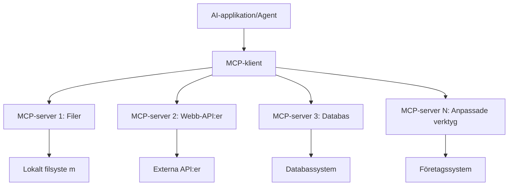

# 🌐 Modul 2: MCP med grunderna i Microsoft Foundry Toolkit

[]()
[]()
[]()

## 📋 Inlärningsmål

I slutet av denna modul kommer du att kunna:
- ✅ Förstå Model Context Protocol (MCP) arkitektur och fördelar
- ✅ Utforska Microsofts MCP-server ekosystem
- ✅ Integrera MCP-servrar med Microsoft Foundry Toolkit Agent Builder
- ✅ Bygga en funktionell webbläsarautomationsagent med Playwright MCP
- ✅ Konfigurera och testa MCP-verktyg inom dina agenter
- ✅ Exportera och distribuera MCP-drivna agenter för produktionsanvändning

## 🎯 Bygga vidare på Modul 1

I Modul 1 bemästrade vi grunderna i Microsoft Foundry Toolkit och skapade vår första Python-agent. Nu ska vi **superladda** dina agenter genom att koppla dem till externa verktyg och tjänster via revolutionerande **Model Context Protocol (MCP)**.

Tänk på detta som att uppgradera från en enkel miniräknare till en fullständig dator – dina AI-agenter får förmågan att:
- 🌐 Surfa och interagera med webbplatser
- 📁 Få åtkomst till och hantera filer
- 🔧 Integrera med företagsystem
- 📊 Bearbeta realtidsdata från API:er

## 🧠 Förstå Model Context Protocol (MCP)

### 🔍 Vad är MCP?

Model Context Protocol (MCP) är **"USB-C för AI-applikationer"** – en revolutionerande öppen standard som kopplar Stora Språkmodeller (LLM:er) till externa verktyg, datakällor och tjänster. Precis som USB-C eliminerade kabelkaos genom att erbjuda en universell kontakt, eliminerar MCP komplexitet i AI-integration genom ett standardiserat protokoll.

### 🎯 Problemet som MCP löser

**Före MCP:**
- 🔧 Specialanpassade integrationer för varje verktyg
- 🔄 Leverantörslåsning med proprietära lösningar
- 🔒 Säkerhetsrisker från ad hoc-anslutningar
- ⏱️ Månader av utveckling för grundläggande integrationer

**Med MCP:**
- ⚡ Plug-and-play verktygsintegration
- 🔄 Leverantörsoberoende arkitektur
- 🛡️ Inbyggda säkerhetsbästa praxis
- 🚀 Minuter för att lägga till nya funktioner

### 🏗️ Djupdykning i MCP-arkitektur

MCP följer en **klient-server-arkitektur** som skapar ett säkert, skalbart ekosystem:



**🔧 Kärnkomponenter:**

| Komponent | Roll | Exempel |
|-----------|------|---------|
| **MCP Hosts** | Applikationer som konsumerar MCP-tjänster | Claude Desktop, VS Code, Microsoft Foundry Toolkit |
| **MCP Clients** | Protokollhanterare (1:1 med servrar) | Inbyggda i host-applikationer |
| **MCP Servers** | Exponerar funktionalitet via standardprotokoll | Playwright, Files, Azure, GitHub |
| **Transport Layer** | Kommunikationsmetoder | stdio, HTTP, WebSockets |


## 🏢 Microsofts MCP Server Ekosystem

Microsoft leder MCP-ekosystemet med en omfattande svit av företagsklassade servrar som adresserar verkliga affärsbehov.

### 🌟 Utvalda Microsoft MCP-servrar

#### 1. ☁️ Azure MCP Server
**🔗 Repository**: [azure/azure-mcp](https://github.com/azure/azure-mcp)
**🎯 Syfte**: Omfattande Azure-resurshantering med AI-integration

**✨ Nyckelfunktioner:**
- Deklarativ infrastrukturprovisionering
- Realtidsövervakning av resurser
- Rekommendationer för kostnadsoptimering
- Säkerhetskontroller av efterlevnad

**🚀 Användningsområden:**
- Infrastruktur som kod med AI-assistans
- Automatiserad resurs skalning
- Molnkostnadsoptimering
- DevOps arbetsflödesautomation

#### 2. 📊 Microsoft Dataverse MCP
**📚 Dokumentation**: [Microsoft Dataverse Integration](https://go.microsoft.com/fwlink/?linkid=2320176)
**🎯 Syfte**: Naturligt språkgränssnitt för affärsdata

**✨ Nyckelfunktioner:**
- Naturliga språkfrågor mot databaser
- Förståelse för affärskontext
- Anpassade promptmallar
- Företagsdatahantering

**🚀 Användningsområden:**
- Affärsintelligensrapportering
- Kunddataanalys
- Insikter i säljpipeline
- Förfrågningar kring efterlevnadsdata

#### 3. 🌐 Playwright MCP Server
**🔗 Repository**: [microsoft/playwright-mcp](https://github.com/microsoft/playwright-mcp)
**🎯 Syfte**: Webbläsarautomation och webbinmatningsfunktioner

**✨ Nyckelfunktioner:**
- Cross-browser automation (Chrome, Firefox, Safari)
- Intelligens för elementigenkänning
- Skärmdump- och PDF-generering
- Övervakning av nätverkstrafik

**🚀 Användningsområden:**
- Automatiserade testarbetsflöden
- Webbskrapning och datautvinning
- UI/UX-övervakning
- Automatiserad konkurrensanalys

#### 4. 📁 Files MCP Server
**🔗 Repository**: [microsoft/files-mcp-server](https://github.com/microsoft/files-mcp-server)
**🎯 Syfte**: Intelligenta filsystemoperationer

**✨ Nyckelfunktioner:**
- Deklarativ filhantering
- Innehållssynkronisering
- Integrerad versionshantering
- Metadatautvinning

**🚀 Användningsområden:**
- Dokumenthantering
- Kodförvaringsorganisation
- Arbetsflöden för innehållspublicering
- Filhantering i datapipelines

#### 5. 📝 MarkItDown MCP Server
**🔗 Repository**: [microsoft/markitdown](https://github.com/microsoft/markitdown)
**🎯 Syfte**: Avancerad Markdown-behandling och manipulation

**✨ Nyckelfunktioner:**
- Rik Markdown-parsing
- Formatkonvertering (MD ↔ HTML ↔ PDF)
- Analys av innehållsstruktur
- Mallbearbetning

**🚀 Användningsområden:**
- Arbetsflöden för teknisk dokumentation
- Innehållshanteringssystem
- Rapportgenerering
- Automatisering av kunskapsbas

#### 6. 📈 Clarity MCP Server
**📦 Paket**: [@microsoft/clarity-mcp-server](https://www.npmjs.com/package/@microsoft/clarity-mcp-server)
**🎯 Syfte**: Webbstatistik och insikter om användarbeteende

**✨ Nyckelfunktioner:**
- Heatmap-analys
- Inspelningar av användarsessioner
- Prestandamått
- Analys av konverteringstrattar

**🚀 Användningsområden:**
- Webbplatsoptimering
- Forskning kring användarupplevelse
- A/B testanalys
- Affärsintelligensdashboard

### 🌍 Community-ekosystemet

Utöver Microsofts servrar inkluderar MCP-ekosystemet:
- **🐙 GitHub MCP**: Förvarshantering och kodanalys
- **🗄️ Databas-MCPs**: PostgreSQL, MySQL, MongoDB-integrationer
- **☁️ Molnleverantörs-MCPs**: AWS, GCP, Digital Ocean-verktyg
- **📧 Kommunikations-MCPs**: Slack, Teams, E-post-integrationer

## 🛠️ Praktiskt Laboratorium: Bygga en webbläsarautomationsagent

**🎯 Projektmål**: Skapa en intelligent webbläsarautomationsagent med Playwright MCP-server som kan navigera på webbplatser, extrahera information och utföra komplexa webbinteraktioner.

### 🚀 Fas 1: Agentens grundläggande uppsättning

#### Steg 1: Initiera din agent
1. **Öppna Microsoft Foundry Toolkit Agent Builder**
2. **Skapa Ny Agent** med följande konfiguration:
   - **Namn**: `BrowserAgent`
   - **Modell**: Välj GPT-4o


### 🔧 Fas 2: MCP-integrationsarbetsflöde

#### Steg 3: Lägg till MCP-serverintegration
1. **Navigera till Verktygssektionen** i Agent Builder
2. **Klicka på "Add Tool"** för att öppna integrationsmenyn
3. **Välj "MCP Server"** från tillgängliga alternativ


**🔍 Förstå verktygstyper:**
- **Inbyggda verktyg**: Förkonfigurerade Microsoft Foundry Toolkit-funktioner
- **MCP-servrar**: Externa tjänsteintegrationer
- **Anpassade API:er**: Egna tjänsteendpoints
- **Funktionanrop**: Direkt åtkomst till modellfunktioner

#### Steg 4: Val av MCP-server
1. **Välj alternativet "MCP Server"** för att fortsätta


2. **Bläddra i MCP-katalogen** för att utforska tillgängliga integrationer


### 🎮 Fas 3: Playwright MCP-konfiguration

#### Steg 5: Välj och konfigurera Playwright
1. **Klicka på "Use Featured MCP Servers"** för att få åtkomst till Microsofts verifierade servrar
2. **Välj "Playwright"** från listan med utvalda servrar
3. **Acceptera standard MCP ID** eller anpassa för din miljö


#### Steg 6: Aktivera Playwright-funktioner
**🔑 Viktigt steg**: Välj **ALLA** tillgängliga Playwright-metoder för maximal funktionalitet


**🛠️ Viktiga Playwright-verktyg:**
- **Navigering**: `goto`, `goBack`, `goForward`, `reload`
- **Interaktion**: `click`, `fill`, `press`, `hover`, `drag`
- **Extrahering**: `textContent`, `innerHTML`, `getAttribute`
- **Validering**: `isVisible`, `isEnabled`, `waitForSelector`
- **Fångst**: `screenshot`, `pdf`, `video`
- **Nätverk**: `setExtraHTTPHeaders`, `route`, `waitForResponse`

#### Steg 7: Verifiera integrationsframgång
**✅ Framgångsindikatorer:**
- Alla verktyg syns i Agent Builder-gränssnittet
- Inga felmeddelanden i integrationspanelen
- Playwright-serverstatus visar "Connected"


**🔧 Felsökning av vanliga problem:**
- **Anslutningen misslyckades**: Kontrollera internetanslutning och brandväggsinställningar
- **Saknade verktyg**: Säkerställ att alla funktioner valdes under inställningen
- **Behörighetsfel**: Verifiera att VS Code har nödvändiga systembehörigheter

### 🎯 Fas 4: Avancerad promptdesign

#### Steg 8: Designa intelligenta systemprompter
Skapa sofistikerade prompts som utnyttjar Playwrights fulla kapacitet:

```markdown
# Web Automation Expert System Prompt

## Core Identity
You are an advanced web automation specialist with deep expertise in browser automation, web scraping, and user experience analysis. You have access to Playwright tools for comprehensive browser control.

## Capabilities & Approach
### Navigation Strategy
- Always start with screenshots to understand page layout
- Use semantic selectors (text content, labels) when possible
- Implement wait strategies for dynamic content
- Handle single-page applications (SPAs) effectively

### Error Handling
- Retry failed operations with exponential backoff
- Provide clear error descriptions and solutions
- Suggest alternative approaches when primary methods fail
- Always capture diagnostic screenshots on errors

### Data Extraction
- Extract structured data in JSON format when possible
- Provide confidence scores for extracted information
- Validate data completeness and accuracy
- Handle pagination and infinite scroll scenarios

### Reporting
- Include step-by-step execution logs
- Provide before/after screenshots for verification
- Suggest optimizations and alternative approaches
- Document any limitations or edge cases encountered

## Ethical Guidelines
- Respect robots.txt and rate limiting
- Avoid overloading target servers
- Only extract publicly available information
- Follow website terms of service
```

#### Steg 9: Skapa dynamiska användarprompter
Designa prompts som demonstrerar olika funktioner:

**🌐 Exempel på webbanalys:**
```markdown
Navigate to github.com/kinfey and provide a comprehensive analysis including:
1. Repository structure and organization
2. Recent activity and contribution patterns  
3. Documentation quality assessment
4. Technology stack identification
5. Community engagement metrics
6. Notable projects and their purposes

Include screenshots at key steps and provide actionable insights.
```


### 🚀 Fas 5: Körning och testning

#### Steg 10: Kör din första automation
1. **Klicka på "Run"** för att starta automationssekvensen
2. **Övervaka realtidskörningen**:
   - Chrome-webbläsare startar automatiskt
   - Agenten navigerar till målsidan
   - Skärmdumpar tas för varje steg
   - Analysresultaten strömmas i realtid


#### Steg 11: Analysera resultat och insikter
Granska omfattande analys i Agent Builder-gränssnittet:


### 🌟 Fas 6: Avancerade funktioner och distribution

#### Steg 12: Export och produktiondistribution
Agent Builder stödjer flera distributionsalternativ:


## 🎓 Sammanfattning Modul 2 & Nästa steg

### 🏆 Uppnått Mål: MCP Integration Master

**✅ Bemästrade färdigheter:**
- [ ] Förstå MCP-arkitektur och fördelar
- [ ] Navigera i Microsofts MCP-serverekosystem
- [ ] Integrera Playwright MCP med Microsoft Foundry Toolkit
- [ ] Bygga avancerade webbläsarautomationsagenter
- [ ] Avancerad promptdesign för webbautomation

### 📚 Ytterligare resurser

- **🔗 MCP-specifikation**: [Officiell protokolldokumentation](https://modelcontextprotocol.io/)
- **🛠️ Playwright API**: [Fullständig metodreferens](https://playwright.dev/docs/api/class-playwright)
- **🏢 Microsoft MCP-servrar**: [Guide för företagsintegration](https://github.com/microsoft/mcp-servers)
- **🌍 Community-exempel**: [MCP Server Galleri](https://github.com/modelcontextprotocol/servers)

**🎉 Grattis!** Du har framgångsrikt bemästrat MCP-integration och kan nu bygga produktionsklara AI-agenter med externa verktygsfunktioner!


### 🔜 Fortsätt till nästa modul

Redo att ta dina MCP-kunskaper till nästa nivå? Fortsätt till **[Modul 3: Avancerad MCP-utveckling med Microsoft Foundry Toolkit](../lab3/README.md)** där du lär dig att:
- Skapa egna anpassade MCP-servrar
- Konfigurera och använda den senaste MCP Python SDK
- Sätta upp MCP Inspector för felsökning
- Bemästra avancerade arbetsflöden för MCP-serverutveckling
- Bygga en Weather MCP Server från grunden

---

<!-- CO-OP TRANSLATOR DISCLAIMER START -->
**Ansvarsfriskrivning**:
Detta dokument har översatts med hjälp av AI-översättningstjänsten [Co-op Translator](https://github.com/Azure/co-op-translator). Även om vi strävar efter noggrannhet, var vänlig notera att automatiska översättningar kan innehålla fel eller brister. Det ursprungliga dokumentet på dess modersmål bör betraktas som den auktoritativa källan. För kritisk information rekommenderas professionell mänsklig översättning. Vi ansvarar inte för några missförstånd eller feltolkningar som uppstår till följd av användningen av denna översättning.
<!-- CO-OP TRANSLATOR DISCLAIMER END -->