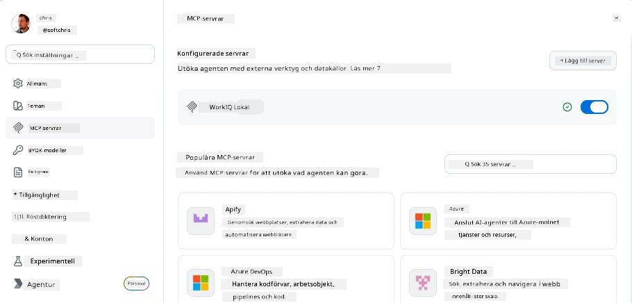
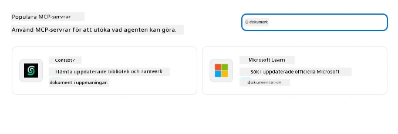
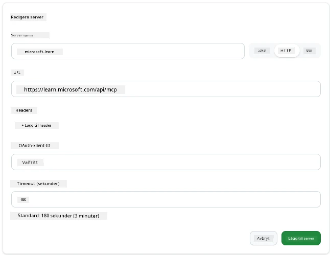
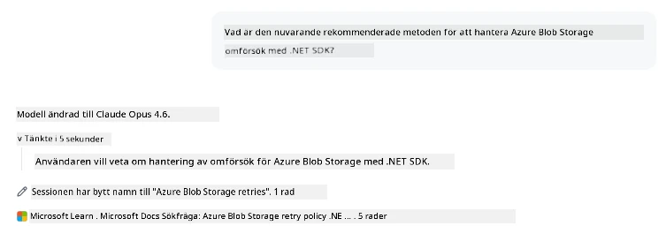
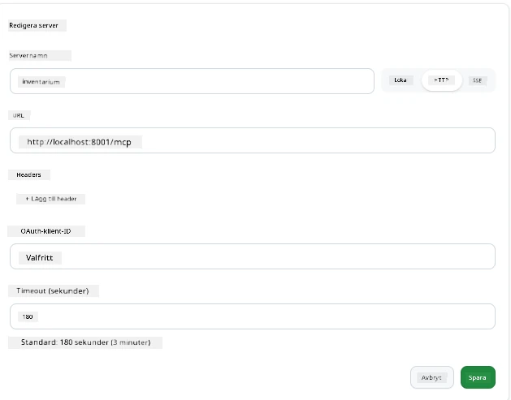
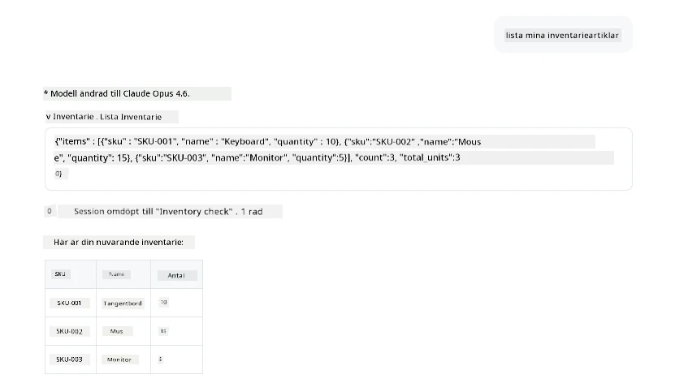
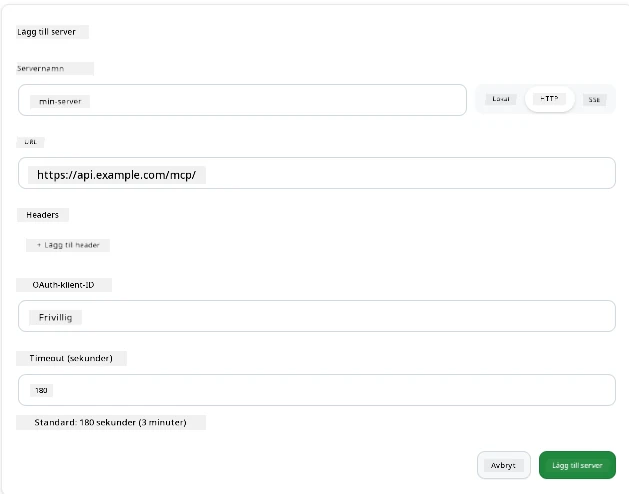
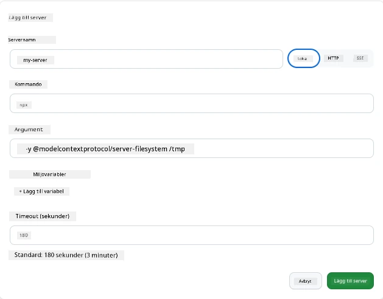

# Använda MCP-servrar i GitHub Copilot-appen

Nu vet du hur MCP fungerar. Du har byggt servrar, definierat verktyg och resurser, och kopplat samman klienter. Det vi inte har gjort än är att vända på perspektivet: istället för att du bygger servern, hur ser det ut att vara på *konsumerande* sidan—som användare av en AI-driven app som stöder MCP?

[GitHub Copilot App](https://github.com/github/app) är en desktop-app som kan använda MCP-servrar. Genom att koppla MCP-servrar till den, öppnar du en ny nivå: Copilot kan nu nå i din dokumentation, anropa dina interna API:er, fråga i din databas eller prata med vilken tjänst du än har paketerat i en server. Appen blir värden; dina MCP-servrar blir dess verktyg.

Den här lektionen leder dig igenom hela upplevelsen från början till slut—från att hitta MCP-inställningspanelen till att koppla en verklig dokumentationsserver och sedan koppla upp en egen specialbyggd.

## Läromål

I slutet av denna lektion kommer du att kunna:

- Lokalisera och navigera i MCP Servers-panelen i Copilot App-inställningarna.
- Koppla en hostad dokumentationsserver och använda den i en session.
- Registrera en anpassad server och verifiera att Copilot kan anropa dess verktyg.
- Konfigurera hur en server anropas genom att ange antingen miljövariabler eller anpassade headers (om HTTP).

## Copilot-appen som MCP-värd

Här är den grundläggande idén: **Copilots agenter är smarta, men de vet bara det du berättar för dem.** Som standard kan en agent läsa filer i din arbetsyta och köra terminalkommandon, men den kan inte fråga din databas, kika i din kalender eller anropa en specialanpassad API utan hjälp. Där kommer MCP-servrar in. De fungerar som broar mellan Copilot och dina system—databaser, versionskontroll, API:er, designverktyg—och ger agenter tillgång till information och åtgärder de behöver för att utföra arbetet.

Låt oss börja med att hitta inställningarna för att hantera din apps MCP-servrar.

## Steg 1: Hitta MCP-inställningspanelen

Öppna Copilot-appen och hitta en kugghjulsikon längst ner till vänster och klicka på den.


Se till att du väljer "MCP Servers" och du bör nu se dina redan konfigurerade servrar högst upp, en marknadsplats med populära servrar längst ner och en knapp "Add Server" högst upp som så:



Det här är din kontrollpanel. Här lägger du till, tar bort, aktiverar och inaktiverar servrar. Ändringar gäller för nya sessioner; om du har en session öppen behöver du starta en ny efter att ha ändrat denna lista.

## Steg 2: Koppla en dokumentationsserver

Låt oss göra något omedelbart användbart. Microsoft Docs MCP-servern ger Copilot tillgång till officiell Microsoft-dokumentation. Detta inkluderar Azure, .NET, TypeScript och mer. Istället för att agenterna förlitar sig på sin träningsdata (som har en cutoff-datum), kan den nu hämta aktuella docs i realtid vid fråga.

Så här lägger du till den:

1. Skriv **learn** i rutan för populära servrar och välj servern som heter "Microsoft Learn".

   

   När du klickar visas ett formulär där namn, transporttyp och URL är ifyllda, allt du behöver göra är att klicka på "Add Server".

2. Klicka på "Add Server", det bör ta några sekunder att koppla upp mot servern.

   

   När den lagts till ska den visas i det övre området som en konfigurerad server. Låt oss testa nästa.

3. Stäng dialogrutan och välj Quick chat.

4. Skriv nedanstående prompt för att trigga ett verktyg på Microsoft Learn-servern.

   ```text
   What's the current recommended approach for handling Azure Blob Storage 
   retries using the .NET SDK?
   ```

   

Du bör se hur den hänvisar till MCP-servern vi just lade till.

## Steg 3: Koppla en anpassad stdio-server

Förinställningarna är bekväma, men den verkliga styrkan är att koppla dina egna servrar. Säg att du har byggt en server (eller fått en) som exponerar din interna API eller företagets kunskapsbas. I detta fall använder vi en MCP-server som vi byggt som hanterar företagets lagerhantering.

1. Klicka på kugghjulet och välj "MCP servers" igen.

2. Välj "Add Server"-knappen och "+ Add Custom server" och ange följande värden:

   - Name: `Inventory Server`
   - Välj transport (längst till höger), **http**

   Välj "Add Server" och den bör dyka upp i din lista över konfigurerade servrar.

   

4. För att testa, kör en prompt så här:

    ```
    list inventory
    ```

   

   Du bör nu se en lista med inventarieobjekt som returneras från din egenbyggda server.

Bra, du bör nu ha en god förståelse för hur man lägger till externa såväl som egna MCP-servrar i Copilot-appen. Nästa, låt oss prata om hantering av hemligheter och miljövariabler.

## Steg 4: Avancerade inställningar

Hittills har du sett hur du lägger till MCP-servrar där du bara anger ett namn och URL. Men vad händer om din server kräver en API-nyckel eller något annat värde? Beroende på transporttyp kan vi förse den med det den behöver.

- **http eller SSE-transport**: Här kan vi ställa in headers efter behov.

   För autentisering kan du ange en Authorization-header, till exempel. Värdet kan vara en statisk sträng. Om du använder OAuth kan du istället ange en OAuth client ID.

   

- **stdio-transport**: Miljövariabler kan anges.

   Här kan du ange valfritt antal miljövariabler som ska skickas till servern när du startar den.

   

## Sammanfattning

Copilot-appen behandlar MCP-servrar som förstklassiga tillägg till agentens kapacitet. Du har sett hela resan i denna lektion från att lägga till MCP-servrar till att använda dem i en session. Du kan nu ansluta till publika servrar, interna API:er och anpassade verktyg, vilket ger dina agenter möjlighet att få tillgång till den information och de åtgärder de behöver för att autonomt slutföra uppgifter.

## 📚 Ytterligare resurser

### Officiella dokument

- [GitHub Copilot App](https://github.com/github/app)
- [MCP Specification](https://modelcontextprotocol.io/specification/2025-03-26) - Modell Context Protocol-specifikation

### Community
- [MCP Community Discord](https://discord.com/invite/ByRwuEEgH4) - Live-diskussioner
- [GitHub Discussions](https://github.com/microsoft/MCP-Server-and-PostgreSQL-Sample-Retail/discussions) - Frågor & svar och delning
- [Stack Overflow](https://stackoverflow.com/questions/tagged/model-context-protocol) - Tekniska frågor

---

<!-- CO-OP TRANSLATOR DISCLAIMER START -->
**Ansvarsfriskrivning**:
Detta dokument har översatts med hjälp av AI-översättningstjänsten [Co-op Translator](https://github.com/Azure/co-op-translator). Även om vi strävar efter noggrannhet, var vänlig notera att automatiska översättningar kan innehålla fel eller brister. Det ursprungliga dokumentet på dess modersmål bör betraktas som den auktoritativa källan. För kritisk information rekommenderas professionell mänsklig översättning. Vi ansvarar inte för några missförstånd eller feltolkningar som uppstår till följd av användningen av denna översättning.
<!-- CO-OP TRANSLATOR DISCLAIMER END -->