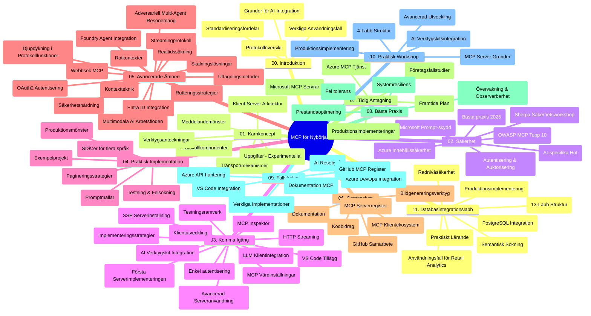

# Model Context Protocol (MCP) för nybörjare - Studieguiden

Denna studieguiden ger en översikt över repots struktur och innehåll för "Model Context Protocol (MCP) för nybörjare"-kursen. Använd den här guiden för att navigera i repot effektivt och få ut maximalt av de tillgängliga resurserna.

## Översikt av repot

Model Context Protocol (MCP) är ett standardiserat ramverk för interaktioner mellan AI-modeller och klientapplikationer. Ursprungligen skapat av Anthropic, underhålls MCP nu av det bredare MCP-communityt genom den officiella GitHub-organisationen. Detta repo erbjuder en omfattande kursplan med praktiska kodexempel i C#, Java, JavaScript, Python och TypeScript, designad för AI-utvecklare, systemarkitekter och mjukvaruingenjörer.

## Visuell kurskarta

## Repos struktur

Repot är organiserat i elva huvudsektioner, var och en fokuserad på olika aspekter av MCP:

1. **Introduktion (00-Introduction/)**
   - Översikt av Model Context Protocol
   - Varför standardisering är viktigt i AI-pipelines
   - Praktiska användningsfall och fördelar

2. **Kärnkoncept (01-CoreConcepts/)**
   - Klient-server-arkitektur
   - Viktiga protokollkomponenter
   - Meddelandemönster i MCP

3. **Säkerhet (02-Security/)**
   - Säkerhetshot i MCP-baserade system
   - Bästa praxis för säkra implementationer
   - Autentisering och auktoriseringsstrategier
   - **Omfattande säkerhetsdokumentation**:
     - MCP Security Best Practices 2025
     - Azure Content Safety Implementation Guide
     - MCP Security Controls and Techniques
     - MCP Best Practices Quick Reference
   - **Viktiga säkerhetsämnen**:
     - Prompt-injektion och verktygsförgiftning
     - Sessionskapning och confused deputy-problem
     - Token passthrough-sårbarheter
     - Överdrivna behörigheter och åtkomstkontroll
     - Leverantörskedjesäkerhet för AI-komponenter
     - Microsoft Prompt Shields-integration

4. **Kom igång (03-GettingStarted/)**
   - Miljösetup och konfiguration
   - Skapa grundläggande MCP-servrar och klienter
   - Integration med befintliga applikationer
   - Innehåller sektioner för:
     - Första server-implementationen
     - Klientutveckling
     - LLM-klientintegration
     - VS Code-integration
     - Server-Sent Events (SSE)-server
     - Avancerad serveranvändning
     - HTTP-strömning
     - AI Toolkit-integration
     - Teststrategier
     - Driftsättningsriktlinjer

5. **Praktisk implementering (04-PracticalImplementation/)**
   - Användning av SDK:er i olika programspråk
   - Debugging, testning och valideringstekniker
   - Skapa återanvändbara prompt-mallar och arbetsflöden
   - Exempelprojekt med implementationsexempel

6. **Avancerade ämnen (05-AdvancedTopics/)**
   - Kontextsdesigntekniker
   - Foundry-agentintegration
   - Multimodala AI-arbetsflöden
   - OAuth2-autentiseringsexempel
   - Realtidssökning
   - Realtidsströmning
   - Root contexts-implementationer
   - Routingstrategier
   - Samplingstekniker
   - Skalningsmetoder
   - Säkerhetsaspekter
   - Entra ID-säkerhetsintegration
   - Webbsökning-integration
   - Adversariell multi-agent-resonemang (debattmönster)

7. **Community-bidrag (06-CommunityContributions/)**
   - Hur man bidrar med kod och dokumentation
   - Samarbeta via GitHub
   - Communitydrivna förbättringar och feedback
   - Använda olika MCP-klienter (Claude Desktop, Cline, VSCode)
   - Arbeta med populära MCP-servrar inklusive bildgenerering

8. **Lärdomar från tidig adoption (07-LessonsfromEarlyAdoption/)**
   - Verkliga implementationer och framgångshistorier
   - Bygga och driftsätta MCP-baserade lösningar
   - Trender och framtida roadmap
   - **Microsoft MCP Servers Guide**: Omfattande guide till 10 produktionsklara Microsoft MCP-servrar inklusive:
     - Microsoft Learn Docs MCP Server
     - Azure MCP Server (15+ specialiserade connectors)
     - GitHub MCP Server
     - Azure DevOps MCP Server
     - MarkItDown MCP Server
     - SQL Server MCP Server
     - Playwright MCP Server
     - Dev Box MCP Server
     - Microsoft Foundry MCP Server
     - Microsoft 365 Agents Toolkit MCP Server

9. **Bästa praxis (08-BestPractices/)**
   - Prestandaoptimering och finjustering
   - Design av feltoleranta MCP-system
   - Testning och resiliensstrategier

10. **Fallstudier (09-CaseStudy/)**
    - **Sju omfattande fallstudier** som visar MCP:s mångsidighet i olika scenarier:
    - **Azure AI Travel Agents**: Multi-agent orkestrering med Azure OpenAI och AI Search
    - **Azure DevOps-integration**: Automatisering av arbetsflöden med YouTube-datauppdateringar
    - **Realtidsdokumenthämtning**: Python-konsolklient med HTTP-strömning
    - **Interaktiv studieplansgenerator**: Chainlit webbapp med konverserande AI
    - **Dokumentation i editorn**: VS Code-integration med GitHub Copilot-arbetsflöden
    - **Azure API Management**: Företags-API-integration med MCP-serveruppbyggnad
    - **GitHub MCP Registry**: Ekosystemutveckling och agentisk integrationsplattform
    - Implementationsexempel inom företagsintegration, utvecklarproduktivitet och ekosystemutveckling

11. **Praktisk workshop (10-StreamliningAIWorkflowsBuildingAnMCPServerWithAIToolkit/)**
    - Omfattande praktisk workshop som kombinerar MCP med AI Toolkit
    - Bygga intelligenta applikationer som kopplar samman AI-modeller med verkliga verktyg
    - Praktiska moduler som täcker grunder, anpassad serverutveckling och produktionsdriftsättningsstrategier
    - **Lab-struktur**:
      - Lab 1: MCP Server Fundamentals
      - Lab 2: Avancerad MCP-serverutveckling
      - Lab 3: AI Toolkit-integration
      - Lab 4: Produktionsdriftsättning och skalning
    - Lab-baserat lärande med steg-för-steg-instruktioner

12. **MCP-server databasintegrationslabs (11-MCPServerHandsOnLabs/)**
    - **Omfattande 13-labbar lång inlärningsväg** för att bygga produktionsklara MCP-servrar med PostgreSQL-integration
    - **Verkliga detaljhandelsanalysimplementationer** med Zava Retail-användningsfall
    - **Företagsmönster** inklusive Row Level Security (RLS), semantisk sökning och multi-tenant-dataåtkomst
    - **Fullständig labbstruktur**:
      - **Labbar 00-03: Grunder** - Introduktion, arkitektur, säkerhet, miljösetup
      - **Labbar 04-06: Bygga MCP-servern** - Databasedesign, MCP-serverimplementation, verktygsutveckling
      - **Labbar 07-09: Avancerade funktioner** - Semantisk sökning, testning & debugging, VS Code-integration
      - **Labbar 10-12: Produktion & bästa praxis** - Driftsättning, övervakning, optimering
    - **Täckta teknologier**: FastMCP-ramverket, PostgreSQL, Azure OpenAI, Azure Container Apps, Application Insights
    - **Lärandemål**: Produktionsklara MCP-servrar, databasintegrationsmönster, AI-driven analys, företagsäkerhet

## Ytterligare resurser

Repostrukturen innehåller stödresurser:

- **Mapp med bilder**: Innehåller diagram och illustrationer som används genom kursplanen
- **Översättningar**: Flerspråkigt stöd med automatiska översättningar av dokumentationen
- **Officiella MCP-resurser**:
  - [MCP Documentation](https://modelcontextprotocol.io/)
  - [MCP Specification](https://spec.modelcontextprotocol.io/)
  - [MCP GitHub Repository](https://github.com/modelcontextprotocol)

## Hur du använder detta repo

1. **Sekventiellt lärande**: Följ kapitlen i ordning (00 till 11) för en strukturerad inlärningsupplevelse.
2. **Språkspecifikt fokus**: Om du är intresserad av ett särskilt programspråk, utforska samples-mapparna för implementationer i ditt favoritspråk.
3. **Praktisk implementering**: Börja med "Kom igång"-sektionen för att ställa in miljön och skapa din första MCP-server och klient.
4. **Avancerad utforskning**: När du är bekväm med grunderna, fördjupa dig i avancerade ämnen för att bredda din kunskap.
5. **Community-engagemang**: Gå med i MCP-communityt via GitHub-diskussioner och Discord-kanaler för att knyta kontakt med experter och andra utvecklare.

## MCP-klienter och verktyg

Kursplanen täcker olika MCP-klienter och verktyg:

1. **Officiella klienter**:
   - Visual Studio Code 
   - MCP i Visual Studio Code
   - Claude Desktop
   - Claude i VSCode 
   - Claude API

2. **Community-klienter**:
   - Cline (terminalbaserad)
   - Cursor (kodredigerare)
   - ChatMCP
   - Windsurf

3. **MCP-hanteringsverktyg**:
   - MCP CLI
   - MCP Manager
   - MCP Linker
   - MCP Router

## Populära MCP-servrar

Repostrukturen introducerar olika MCP-servrar, inklusive:

1. **Officiella Microsoft MCP-servrar**:
   - Microsoft Learn Docs MCP Server
   - Azure MCP Server (15+ specialiserade connectors)
   - GitHub MCP Server
   - Azure DevOps MCP Server
   - MarkItDown MCP Server
   - SQL Server MCP Server
   - Playwright MCP Server
   - Dev Box MCP Server
   - Microsoft Foundry MCP Server
   - Microsoft 365 Agents Toolkit MCP Server

2. **Officiella referensservrar**:
   - Filesystem
   - Fetch
   - Memory
   - Sequential Thinking

3. **Bildgenerering**:
   - Azure OpenAI DALL-E 3
   - Stable Diffusion WebUI
   - Replicate

4. **Utvecklingsverktyg**:
   - Git MCP
   - Terminal Control
   - Code Assistant

5. **Specialiserade servrar**:
   - Salesforce
   - Microsoft Teams
   - Jira & Confluence

## Bidra

Detta repo välkomnar bidrag från communityt. Se sektionen Community Contributions för vägledning om hur du effektivt kan bidra till MCP-ekosystemet.

----

*Denna studieguiden uppdaterades senast den 5 februari 2026, återspeglar den senaste MCP Specification 2025-11-25 och ger en översikt av repots innehåll vid detta datum. Repo-innehåll kan uppdateras efter detta datum.*

---

<!-- CO-OP TRANSLATOR DISCLAIMER START -->
**Ansvarsfriskrivning**:
Detta dokument har översatts med hjälp av AI-översättningstjänsten [Co-op Translator](https://github.com/Azure/co-op-translator). Även om vi strävar efter noggrannhet, var vänlig notera att automatiska översättningar kan innehålla fel eller brister. Det ursprungliga dokumentet på dess modersmål bör betraktas som den auktoritativa källan. För kritisk information rekommenderas professionell mänsklig översättning. Vi ansvarar inte för några missförstånd eller feltolkningar som uppstår till följd av användningen av denna översättning.
<!-- CO-OP TRANSLATOR DISCLAIMER END -->