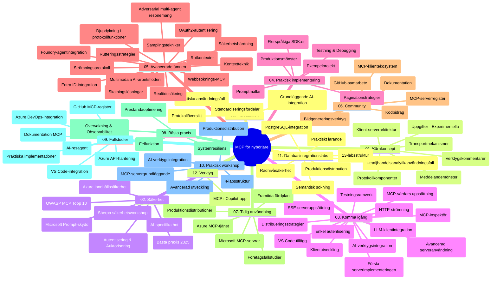

# Model Context Protocol (MCP) för nybörjare - Studieguidning

Denna studieguidning ger en översikt över struktur och innehåll i repot för kursplanen "Model Context Protocol (MCP) för nybörjare". Använd denna guide för att navigera i repot effektivt och få ut mesta möjliga av de tillgängliga resurserna.

## Översikt av repot

Model Context Protocol (MCP) är ett standardiserat ramverk för interaktioner mellan AI-modeller och klientapplikationer. MCP skapades ursprungligen av Anthropic och underhålls nu av den bredare MCP-gemenskapen via den officiella GitHub-organisationen. Detta repo tillhandahåller en omfattande kursplan med praktiska kodexempel i C#, Java, JavaScript, Python och TypeScript, utformad för AI-utvecklare, systemarkitekter och mjukvaruingenjörer.

## Visuell kurskarta

## Repositorystruktur

Repot är organiserat i tolv huvudsektioner, var och en med fokus på olika aspekter av MCP:

1. **Introduktion (00-Introduction/)**
   - Översikt av Model Context Protocol
   - Varför standardisering är viktigt i AI-flöden
   - Praktiska användningsfall och fördelar

2. **Grundläggande koncept (01-CoreConcepts/)**
   - Klient-server-arkitektur
   - Nyckelkomponenter i protokollet
   - Meddelandemönster i MCP

3. **Säkerhet (02-Security/)**
   - Säkerhetshot i MCP-baserade system
   - Bästa praxis för säker implementering
   - Autentiserings- och auktoriseringsstrategier
   - **Omfattande säkerhetsdokumentation**:
     - MCP Security Best Practices 2025
     - Azure Content Safety Implementation Guide
     - MCP Security Controls and Techniques
     - MCP Best Practices Quick Reference
   - **Viktiga säkerhetsämnen**:
     - Prompt injection och förgiftningsattacker av verktyg
     - Sessionkapning och confused deputy-problem
     - Token passthrough-sårbarheter
     - Överdrivna behörigheter och åtkomstkontroll
     - Säkerhet i leveranskedjan för AI-komponenter
     - Microsoft Prompt Shields-integration

4. **Kom igång (03-GettingStarted/)**
   - Miljöinstallation och konfiguration
   - Skapa grundläggande MCP-servrar och klienter
   - Integration med befintliga applikationer
   - Inkluderar sektioner för:
     - Första serverimplementationen
     - Klientutveckling
     - LLM-klientintegration
     - VS Code-integration
     - Server-Sent Events (SSE) server
     - Avancerad serveranvändning
     - HTTP-streaming
     - AI Toolkit-integration
     - Teststrategier
     - Driftsättningsriktlinjer

5. **Praktisk implementering (04-PracticalImplementation/)**
   - Användning av SDK:er i olika programmeringsspråk
   - Felsökning, testning och valideringstekniker
   - Skapande av återanvändbara promptmallar och arbetsflöden
   - Exempelprojekt med implementationsexempel

6. **Avancerade ämnen (05-AdvancedTopics/)**
   - Kontexttekniker
   - Foundry-agentintegration
   - Multimodala AI-arbetsflöden
   - OAuth2-autentiseringsdemos
   - Realtidssökning
   - Realtidsstreaming
   - Implementering av root contexts
   - Routingstrategier
   - Samplingstekniker
   - Skalningsmetoder
   - Säkerhetsaspekter
   - Entra ID-säkerhetsintegration
   - Webb sökintegration
   - Adversarial multi-agent reasoning (debattmönster)

7. **Gemenskapens bidrag (06-CommunityContributions/)**
   - Hur man bidrar med kod och dokumentation
   - Samarbeta via GitHub
   - Gemenskapsdrivna förbättringar och feedback
   - Använda olika MCP-klienter (Claude Desktop, Cline, VSCode)
   - Arbeta med populära MCP-servrar inklusive bildgenerering

8. **Lärdomar från tidig adoption (07-LessonsfromEarlyAdoption/)**
   - Verkliga implementationer och framgångshistorier
   - Bygga och driftsätta MCP-baserade lösningar
   - Trender och framtida färdplan
   - **Microsoft MCP Servers Guide**: Omfattande guide till 10 produktionsfärdiga Microsoft MCP-servrar inklusive:
     - Microsoft Learn Docs MCP Server
     - Azure MCP Server (15+ specialiserade connectors)
     - GitHub MCP Server
     - Azure DevOps MCP Server
     - MarkItDown MCP Server
     - SQL Server MCP Server
     - Playwright MCP Server
     - Dev Box MCP Server
     - Microsoft Foundry MCP Server
     - Microsoft 365 Agents Toolkit MCP Server

9. **Bästa praxis (08-BestPractices/)**
   - Prestandaoptimering och tuning
   - Design av feldörrande MCP-system
   - Test- och motståndsstrategier

10. **Fallstudier (09-CaseStudy/)**
    - **Sju omfattande fallstudier** som visar MCP:s mångsidighet i olika scenarier:
    - **Azure AI Travel Agents**: Multi-agent orkestrering med Azure OpenAI och AI Search
    - **Azure DevOps Integration**: Automatiserade arbetsflöden med YouTube-datauppdateringar
    - **Realtidsdokumenthämtning**: Python konsument med streaming HTTP
    - **Interaktiv studieplansgenerator**: Chainlit webbapp med konverserande AI
    - **Dokumentation i redigeraren**: VS Code-integration med GitHub Copilot-arbetsflöden
    - **Azure API Management**: Företags-API-integration med MCP-server skapande
    - **GitHub MCP Registry**: Ekosystemutveckling och agentplattform
    - Implementationsexempel för företagsintegration, utvecklarproduktivitet och ekosystemutveckling

11. **Workshop med praktiska övningar (10-StreamliningAIWorkflowsBuildingAnMCPServerWithAIToolkit/)**
    - Omfattande praktisk workshop som kombinerar MCP med AI Toolkit
    - Bygga intelligenta applikationer som förbinder AI-modeller med verkliga verktyg
    - Praktiska moduler som täcker grunder, anpassad serverutveckling och produktionsdriftsättning
    - **Labstruktur**:
      - Lab 1: MCP Server Fundamentals
      - Lab 2: Avancerad MCP-serverutveckling
      - Lab 3: AI Toolkit-integration
      - Lab 4: Produktionsdrift och skalning
    - Lab-baserad inlärning med steg-för-steg-instruktioner

12. **MCP Serverdatabas integrationslaboratorium (11-MCPServerHandsOnLabs/)**
    - **Omfattande 13-labbs utbildningsväg** för att bygga produktionsfärdiga MCP-servrar med PostgreSQL-integration
    - **Verkliga detaljhandelsanalysimplementeringar** med Zava Retail-användningsfall
    - **Företagsmönster** inklusive Row Level Security (RLS), semantisk sökning och multi-tenant dataåtkomst
    - **Fullständig labstruktur**:
      - **Labs 00-03: Grunder** - Introduktion, arkitektur, säkerhet, miljöinställning
      - **Labs 04-06: Bygga MCP-servern** - Databasdesign, MCP serverimplementation, verktygsutveckling
      - **Labs 07-09: Avancerade funktioner** - Semantisk sökning, testning & felsökning, VS Code-integration
      - **Labs 10-12: Produktion & Bästa praxis** - Driftsättning, övervakning, optimering
    - **Teknologier som täcks**: FastMCP-ramverk, PostgreSQL, Azure OpenAI, Azure Container Apps, Application Insights
    - **Lärandemål**: Produktionsfärdiga MCP-servrar, databasintegrationsmönster, AI-drivna analyser, företagssäkerhet

13. **Verktyg (12-tooling/)**
    - Lär dig hur man använder MCP i Copilot-app och andra verktyg

## Ytterligare resurser

Repot inkluderar stödresurser:

- **Bilder-mappen**: Innehåller diagram och illustrationer som används genom kursplanen
- **Översättningar**: Flerspråkigt stöd med automatiska översättningar av dokumentationen
- **Officiella MCP-resurser**:
  - [MCP Documentation](https://modelcontextprotocol.io/)
  - [MCP Specification](https://spec.modelcontextprotocol.io/)
  - [MCP GitHub Repository](https://github.com/modelcontextprotocol)

## Hur du använder detta repo

1. **Sekventiellt lärande**: Följ kapitlen i ordning (00 till 11) för en strukturerad inlärningsupplevelse.
2. **Språkspecifikt fokus**: Om du är intresserad av ett särskilt programmeringsspråk, utforska exempelmappar för implementationer i ditt föredragna språk.
3. **Praktisk implementering**: Börja med "Kom igång"-sektionen för att ställa in din miljö och skapa din första MCP-server och klient.
4. **Avancerad utforskning**: När du känner dig bekväm med grunderna, fördjupa dig i de avancerade ämnena för att utöka din kunskap.
5. **Communityengagemang**: Gå med i MCP-gemenskapen via GitHub-diskussioner och Discord-kanaler för att knyta kontakter med experter och andra utvecklare.

## MCP-klienter och verktyg

Kursplanen täcker olika MCP-klienter och verktyg:

1. **Officiella klienter**:
   - Visual Studio Code
   - MCP i Visual Studio Code
   - Claude Desktop
   - Claude i VSCode
   - Claude API

2. **Gemenskapsklienter**:
   - Cline (terminalbaserad)
   - Cursor (kodredigerare)
   - ChatMCP
   - Windsurf

3. **MCP-hanteringsverktyg**:
   - MCP CLI
   - MCP Manager
   - MCP Linker
   - MCP Router

## Populära MCP-servrar

Repot introducerar olika MCP-servrar, inklusive:

1. **Officiella Microsoft MCP-servrar**:
   - Microsoft Learn Docs MCP Server
   - Azure MCP Server (15+ specialiserade connectors)
   - GitHub MCP Server
   - Azure DevOps MCP Server
   - MarkItDown MCP Server
   - SQL Server MCP Server
   - Playwright MCP Server
   - Dev Box MCP Server
   - Microsoft Foundry MCP Server
   - Microsoft 365 Agents Toolkit MCP Server

2. **Officiella referensservrar**:
   - Filesystem
   - Fetch
   - Memory
   - Sequential Thinking

3. **Bildgenerering**:
   - Azure OpenAI DALL-E 3
   - Stable Diffusion WebUI
   - Replicate

4. **Utvecklingsverktyg**:
   - Git MCP
   - Terminal Control
   - Code Assistant

5. **Specialiserade servrar**:
   - Salesforce
   - Microsoft Teams
   - Jira & Confluence

## Bidra

Detta repo välkomnar bidrag från gemenskapen. Se avsnittet Community Contributions för vägledning om hur du bidrar effektivt till MCP-ekosystemet.

----

*Denna studieguidning uppdaterades senast den 5 februari 2026 och speglar den senaste MCP Specification 2025-11-25 samt ger en översikt över repots innehåll per detta datum. Repositoryinnehållet kan uppdateras efter detta datum.*

---

<!-- CO-OP TRANSLATOR DISCLAIMER START -->
**Ansvarsfriskrivning**:
Detta dokument har översatts med hjälp av AI-översättningstjänsten [Co-op Translator](https://github.com/Azure/co-op-translator). Även om vi strävar efter noggrannhet, var vänlig notera att automatiska översättningar kan innehålla fel eller brister. Det ursprungliga dokumentet på dess modersmål bör betraktas som den auktoritativa källan. För kritisk information rekommenderas professionell mänsklig översättning. Vi ansvarar inte för några missförstånd eller feltolkningar som uppstår till följd av användningen av denna översättning.
<!-- CO-OP TRANSLATOR DISCLAIMER END -->