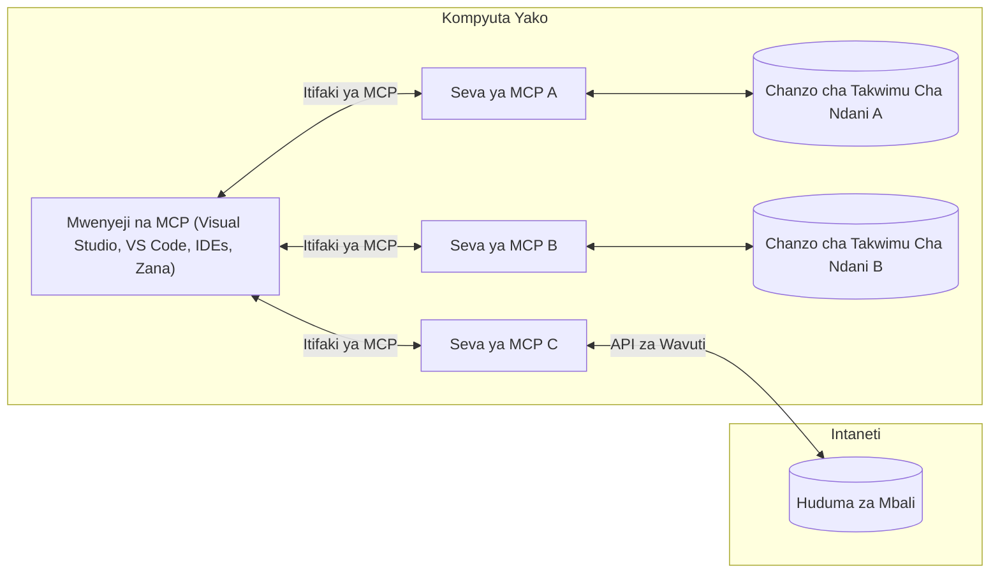

# MCP Core Concepts: Kumasteria Itifaki ya Muktadha wa Mfano kwa Uingizaji AI

[](https://youtu.be/earDzWGtE84)

_(Bonyeza picha hapo juu kutazama video ya somo hili)_

[Iitaki ya Muktadha wa Mfano (MCP)](https://github.com/modelcontextprotocol) ni mfumo wenye nguvu na uliowekwa viwango unaoongeza mawasiliano kati ya Mifano Mikubwa ya Lugha (LLMs) na zana za nje, programu, na vyanzo vya data. 
Mwongozo huu utakuelekeza kupitia dhana za msingi za MCP. Utajifunza kuhusu usanifu wake wa mteja-na-seva, vipengele muhimu, mbinu za mawasiliano, na mbinu bora za utekelezaji.

- **Idhini Dhahiri ya Mtumiaji**: Ufikiaji data na shughuli zote zinahitaji idhini dhahiri ya mtumiaji kabla ya utekelezaji. Watumiaji lazima waelewe wazi ni data gani itafikiwa na ni vitendo gani vitatekelezwa, na kudhibiti kwa kina ruhusa na idhini.

- **Ulinzi wa Usiri wa Data**: Data ya mtumiaji inaonyeshwa tu kwa idhini dhahiri na lazima ilindwe kwa udhibiti imara wa upatikanaji kupitia mzunguko mzima wa mwingiliano. Utekelezaji unapaswa kuzuia usambazaji usioidhinishwa wa data na kudumisha mipaka madhubuti ya usiri.

- **Usalama wa Utekelezaji wa Zana**: Kila kuitwa zana inahitaji idhini dhahiri ya mtumiaji huku ikieleweka vizuri kazi ya zana, vigezo, na athari inayoweza kutokea. Mipaka madhubuti ya usalama inapaswa kuzuia utekelezaji wa zana usio kusudiwa, usio salama, au wa kibaya.

- **Usalama wa Tabaka la Usafirishaji**: Njia zote za mawasiliano zitumie usimbaji fiche na mbinu sahihi za uthibitisho. Mifumo ya mbali itekeleze itifaki salama za usafirishaji na usimamizi sahihi wa vitambulisho.

#### Mwongozo wa Utekelezaji:

- **Usimamizi wa Ruhusa**: Tekeleza mifumo ya ruhusa yenye undani inayomruhusu mtumiaji kudhibiti seva, zana, na rasilimali zinazopatikana  
- **Uthibitishaji & Uidhinishaji**: Tumia mbinu za uthibitishaji salama (OAuth, API keys) zenye usimamizi sahihi wa tokeni na kumalizika kwake  
- **Ukuaji wa Ingizo**: Thibitisha vigezo na data zote kulingana na mfumo uliowekwa ili kuzuia mashambulizi ya sindano  
- **Kumbukumbu za Ukaguzi**: Dumisha kumbukumbu kamili za shughuli zote kwa ajili ya ufuatiliaji wa usalama na uzingatiaji

## Muhtasari

Somo hili linachunguza usanifu wa msingi na vipengele vinavyoumba mfumo wa Itifaki ya Muktadha wa Mfano (MCP). Utajifunza kuhusu usanifu wa mteja-na-seva, vipengele muhimu, na mbinu za mawasiliano zinazowezesha mwingiliano wa MCP.

## Malengo Muhimu ya Kujifunza

Mwisho wa somo hili, utakuwa umeelewa:

- Kunielewa usanifu wa mteja-na-seva wa MCP.  
- Kutambua majukumu ya Wenyeji, Wateja, na Waseriveri.  
- Kuchambua sifa kuu zinazofanya MCP kuwa tabaka lenye kubadilika la uingizaji.  
- Kujifunza jinsi habari zinavyotiririka ndani ya mfumo wa MCP.  
- Kupata maarifa ya vitendo kupitia mifano ya msimbo katika .NET, Java, Python, na JavaScript.

## Usanifu wa MCP: Mtazamo wa Kina

Mfumo wa MCP umejengwa kwa mfano wa mteja-na-seva. Muundo huu wa vipande unaruhusu programu za AI kuwasiliana na zana, hifadhidata, API, na rasilimali za muktadha kwa ufanisi. Hebu tugawanye usanifu huu katika vipengele vyake vya msingi.

Katika msingi wake, MCP inafuata usanifu wa mteja-na-seva ambapo programu mwenyeji inaweza kuunganishwa na waseriveri wengi:


- **Wenyeji wa MCP**: Programu kama VSCode, Claude Desktop, IDEs, au zana za AI zinazotaka kufikia data kupitia MCP  
- **Wateja wa MCP**: Wakili wa itifaki wanaoshikilia muunganisho wa 1:1 na waseriveri  
- **Waseriveri wa MCP**: Programu nyepesi ambazo kila moja inaonyesha uwezo maalum kupitia Itifaki ya Muktadha wa Mfano iliyowekwa viwango  
- **Vyanzo vya Data vya Ndani**: Faili za kompyuta yako, hifadhidata, na huduma ambazo waseriveri wa MCP wanaweza kufikia kwa usalama  
- **Huduma za Mbali**: Mifumo ya nje inayopatikana mtandaoni ambayo waseriveri wa MCP wanaweza kuungana nayo kupitia API.

Itifaki ya MCP ni kiwango kinachobadilika kinachotumia toleo la tarehe (muundo wa YYYY-MM-DD). Toleo la sasa la itifaki ni **2025-11-25**. Unaweza kuona masasisho ya karibuni kwenye [maelezo ya itifaki](https://modelcontextprotocol.io/specification/2025-11-25/)

### 1. Wenyeji

Katika Itifaki ya Muktadha wa Mfano (MCP), **Wenyeji** ni programu za AI zinazotumika kama kiolesura kikuu ambacho watumiaji hufanya mwingiliano na itifaki. Wenyeji huandaa na kusimamia muunganisho na waseriveri wengi wa MCP kwa kuunda wateja wa MCP maalum kwa kila muunganisho wa seva. Mifano ya Wenyeji ni pamoja na:

- **Programu za AI**: Claude Desktop, Visual Studio Code, Claude Code  
- **Mazingira ya Maendeleo**: IDE na wahariri wa msimbo wenye uingizaji wa MCP  
- **Programu Maalum**: Maajenti na zana za AI zilizojengewa madhumuni maalum

**Wenyeji** ni programu zinazoratibu mwingiliano wa mifano ya AI. Wana:

- **Kuandaa Mifano ya AI**: Kutekeleza au kuingiliana na LLMs kuzalisha majibu na kuratibu taratibu za AI  
- **Kusimamia Muunganisho wa Wateja**: Kuunda na kudumisha mteja mmoja wa MCP kwa kila muunganisho wa seva  
- **Kudhibiti Kiolesura Mtumiaji**: Kusimamia mtiririko wa mazungumzo, mwingiliano wa watumiaji, na uwasilishaji wa majibu  
- **Kutekeleza Usalama**: Kudhibiti ruhusa, mipaka ya usalama, na uthibitishaji  
- **Kusimamia Idhini ya Mtumiaji**: Kusimamia idhini ya mtumiaji kwa ushirikiano wa data na utekelezaji wa zana

### 2. Wateja

**Wateja** ni vipengele muhimu vinavyoshikilia muunganisho wa moja kwa moja kati ya Wenyeji na waseriveri wa MCP. Kila mteja MCP huundwa na Mwenyeji kuungana na seva maalum ya MCP, kuhakikisha njia za mawasiliano zikiwa za kupanga na salama. Wateja wengi huruhusu Wenyeji kuungana na waseriveri wengi kwa wakati mmoja.

**Wateja** ni vipengele vya kuunganisha ndani ya programu mwenyeji. Wanatenda:

- **Mawasiliano ya Itifaki**: Kutuma maombi ya JSON-RPC 2.0 kwa waseriveri yenye maelekezo na maagizo  
- **Mizungumzo ya Uwezo**: Kujadiliana sifa zinazotambulika na toleo la itifaki na waseriveri wakati wa kuanzishwa  
- **Utekelezaji wa Zana**: Kusimamia maombi ya utekelezaji zana kutoka kwa mifano na kuchakata majibu  
- **Mabadiliko ya Muda Halisi**: Kushughulikia taarifa na masasisho ya muda halisi kutoka kwa waseriveri  
- **Usindikaji wa Majibu**: Kuchakata na kuandaa majibu ya seva kwa ajili ya kuonyeshwa kwa watumiaji

### 3. Waseriveri

**Waseriveri** ni programu zinazotoa muktadha, zana, na uwezo kwa wateja wa MCP. Wanaweza kutekelezwa ndani (kompyuta sawa na Mwenyeji) au kwa mbali ( kwenye majukwaa ya nje) na wanahusika na kushughulikia maombi ya wateja na kutoa majibu yaliyo na muundo. Waseriveri huonyesha kazi maalum kupitia Itifaki ya Muktadha wa Mfano iliyowekwa viwango.

**Waseriveri** ni huduma zinazotoa muktadha na uwezo. Wanatenda:

- **Usajili wa Sifa**: Kusajili na kuonyesha vitu vilivyopo (rasilimali, maelekezo, zana) kwa wateja  
- **Kushughulikia Maombi**: Kupokea na kutekeleza simu za zana, maombi ya rasilimali, na maombi ya maelekezo kutoka kwa wateja  
- **Kutoa Muktadha**: Kutoa taarifa na data ya muktadha ili kuboresha majibu ya mfano  
- **Usimamizi wa Hali**: Kudumisha hali ya kikao na kushughulikia mwingiliano unaohitaji hali fulani  
- **Taarifa za Muda Halisi**: Kutuma taarifa kuhusu mabadiliko ya uwezo na masasisho kwa wateja waliounganishwa

Waseriveri wanaweza kuendelezwa na mtu yeyote kuongeza uwezo wa mifano kwa utendaji maalum, na wanasaidia usanidi wa ndani na wa mbali.

### 4. Vitu Msingi vya Seva

Waseriveri katika Itifaki ya Muktadha wa Mfano (MCP) hutoa vitu vitatu vya msingi **(primitives)** vinavyoainisha vipengele vya msingi vya mwingiliano tajiri kati ya wateja, wenyeji, na mifano ya lugha. Vitu hivi huonyesha aina za taarifa za muktadha na vitendo vinavyopatikana kupitia itifaki.

Waseriveri wa MCP wanaweza kuonyesha mchanganyiko wowote wa vitu vitatu vya msingi ifuatavyo:

#### Rasilimali

**Rasilimali** ni vyanzo vya data vinavyotoa taarifa za muktadha kwa programu za AI. Zinawakilisha maudhui ya kudumu au ya mabadiliko yanayoweza kuongeza uelewa wa mfano na kufanya maamuzi:

- **Data ya Muktadha**: Taarifa zenye muundo na muktadha kwa utumiaji wa mfano wa AI  
- **Hifadhidata za Maarifa**: Makusanyo ya nyaraka, makala, mikono, na karatasi za utafiti  
- **Vyanzo vya Data vya Ndani**: Faili, hifadhidata, na taarifa za mfumo wa ndani  
- **Data ya Nje**: Majibu ya API, huduma za wavuti, na data ya mifumo ya mbali  
- **Maudhui ya Mabadiliko**: Data ya wakati halisi inayosasishwa kutokana na hali za nje

Rasilimali hutambulika kwa URI na kusaidia ugunduzi kupitia `resources/list` na upokezi kupitia njia za `resources/read`:

```text
file://documents/project-spec.md
database://production/users/schema
api://weather/current
```

#### Maelekezo

**Maelekezo** ni templeti zinazotumika tena zinazosaidia kuunda muundo wa mwingiliano na mifano ya lugha. Hutoa mifumo ya kawaida ya mwingiliano na taratibu zilizo na templeti:

- **Mwingiliano wa Kutegemea Templeti**: Ujumbe uliopangwa awali na mwanzo wa mazungumzo  
- **Templeti za Taratibu**: Mfululizo uliowekwa viwango kwa kazi na mwingiliano ya kawaida  
- **Mifano ya Kidogo**: Templeti za mfano kwa maelekezo ya mfano  
- **Maelekezo ya Mfumo**: Maelekezo ya msingi yanayoelekeza tabia na muktadha wa mfano  
- **Templeti Zinazobadilika**: Maelekezo yenye vigezo vinavyobadilika kulingana na muktadha maalum

Maelekezo yanaunga mkono mbadilishaji wa vigezo na yanaweza kugunduliwa kupitia `prompts/list` na kupokelewa kwa `prompts/get`:

```markdown
Generate a {{task_type}} for {{product}} targeting {{audience}} with the following requirements: {{requirements}}
```

#### Zana

**Zana** ni kazi zinazotekelezwa ambazo mifano ya AI inaweza kuitia ili kufanya vitendo maalum. Zinawakilisha "vitenzi" vya ekosistimu ya MCP, zikiruhusu mifano kuingiliana na mifumo ya nje:

- **Kazi Zinazotekelezwa**: Vitendo maalum ambavyo mifano inaweza kuitia na vigezo maalum  
- **Uingizaji wa Mifumo ya Nje**: Simu za API, maswali ya hifadhidata, shughuli za faili, mahesabu  
- **Utambulisho wa Kipekee**: Kila zana ina jina la kipekee, maelezo, na mfumo wa vigezo  
- **Ingizo/Mwisho ulio na Muundo**: Zana zinakubali vigezo vilivyothibitishwa na kurudisha majibu yaliyo na muundo na aina  
- **Uwezo wa Vitendo**: Kuruhusu mifano kufanya vitendo halisi duniani na kupata data ya moja kwa moja

Zana zimetengenezwa kwa kutumia JSON Schema kwa uthibitishaji wa vigezo na kugunduliwa kupitia `tools/list` na kutekelezwa kwa `tools/call`. Zana pia zinaweza kujumuisha **alama** kama metadata ya ziada kwa uwasilishaji bora wa UI.

**Maelezo ya Zana**: Zana zinaunga mkono maelezo ya tabia (k.m. `readOnlyHint`, `destructiveHint`) yanayoelezea kama zana ni ya kusoma tu au yenye madhara, zikisaidia wateja kufanya maamuzi sahihi kuhusu utekelezaji wa zana.

Mfano wa maelezo ya zana:

```typescript
server.tool(
  "search_products", 
  {
    query: z.string().describe("Search query for products"),
    category: z.string().optional().describe("Product category filter"),
    max_results: z.number().default(10).describe("Maximum results to return")
  }, 
  async (params) => {
    // Fanya utafutaji na rudisha matokeo yaliyopangwa
    return await productService.search(params);
  }
);
```

## Vitu Msingi vya Mteja

Katika Itifaki ya Muktadha wa Mfano (MCP), **wateja** wanaweza kuonyesha vitu vinavyowezesha waseriveri kuomba uwezo wa ziada kutoka kwa programu mwenyeji. Vitu hivi vya upande wa mteja vinaruhusu utekelezaji wa waseriveri wenye mwingiliano tajiri zaidi yanayoweza kupata uwezo wa mfano wa AI na mwingiliano wa mtumiaji.

### Sampuli

**Sampuli** inaruhusu waseriveri kuomba ukamilishaji wa mfano wa lugha kutoka kwa programu ya AI ya mteja. Kitu hiki kinawawezesha waseriveri kupata uwezo wa LLM bila kuweka utegemezi wa mfano wao wenyewe:

- **Ufikiaji Huru wa Mfano**: Waseriveri wanaweza kuomba ukamilishaji bila kujumuisha SDK za LLM au kusimamia upatikanaji wa mfano  
- **AI Inayoanzishwa na Seva**: Inaruhusu waseriveri kuzalisha maudhui kwa uhuru kwa kutumia mfano wa AI wa mteja  
- **Mwingiliano wa Kizunguzo wa LLM**: Inasaidia hali ngumu ambapo waseriveri wanahitaji msaada wa AI kwa usindikaji  
- **Uzalishaji wa Maudhui ya Muktadha**: Inaruhusu waseriveri kuunda majibu yenye muktadha kwa kutumia mfano wa mwenyeji  
- **Msaada wa Kuitwa Zana**: Waseriveri wanaweza kujumuisha vigezo vya `tools` na `toolChoice` kuruhusu mfano wa mteja kuitia zana wakati wa sampuli

Sampuli huanzishwa kupitia njia ya `sampling/complete`, ambapo waseriveri hutuma maombi ya ukamilishaji kwa wateja.

### Mizizi

**Mizizi** hutoa njia ya kawaida kwa wateja kufunua mipaka ya mfumo wa faili kwa waseriveri, kusaidia waseriveri kuelewa ni saraka na faili gani wanazo ruhusa ya kufikia:

- **Mipaka ya Mfumo wa Faili**: Kuelezea mipaka ya maeneo ambapo waseriveri wanaweza kufanya kazi ndani ya mfumo wa faili  
- **Udhibiti wa Ufikiaji**: Kusaidia waseriveri kuelewa saraka na faili wana ruhusa ya kufikia  
- **Masasisho ya Muda Halisi**: Wateja wanaweza kuarifu waseriveri wakati orodha ya mizizi inabadilika  
- **Utambulisho kwa Kutegemea URI**: Mizizi hutumia URI za `file://` kutambua saraka na faili zinazopatikana

Mizizi hugunduliwa kupitia njia ya `roots/list`, na wateja hutuma `notifications/roots/list_changed` wakati mizizi inapo badilika.

### Ukuaji wa Habari

**Ukuaji wa Habari** unaruhusu waseriveri kuomba taarifa za ziada au uthibitisho kutoka kwa watumiaji kupitia kiolesura cha mteja:

- **Maombi ya Ingizo la Mtumiaji**: Waseriveri wanaweza kuomba taarifa zaidi wanapohitaji kwa ajili ya utekelezaji wa zana  
- **Mizani ya Uthibitisho**: Kuomba idhini ya mtumiaji kwa shughuli nyeti au zenye athari  
- **Tararribu za Kuingiliano**: Kuruhusu waseriveri kuunda mwingiliano wa hatua kwa hatua na mtumiaji  
- **Ukusanyaji wa Vigezo vya Mabadiliko**: Kukusanya vigezo vilivyokosekana au hiari wakati wa utekelezaji wa zana

Maombi ya kukuaji wa habari hufanywa kwa kutumia njia ya `elicitation/request` kukusanya ingizo la mtumiaji kupitia kiolesura cha mteja.

**Ukuaji wa Habari kwa Mode ya URL**: Waseriveri pia wanaweza kuomba mwingiliano wa mtumiaji unaotegemea URL, kuruhusu waseriveri kuelekeza watumiaji kwa kurasa za wavuti za nje kwa uthibitisho, idhini, au kuingiza data.

### Ufuatiliaji wa Kumbukumbu  

**Ufuatiliaji wa Kumbukumbu** unaruhusu waseriveri kutuma ujumbe wa kumbukumbu uliopangwa vizuri kwa wateja kwa ajili ya ugunduzi hitilafu, ufuatiliaji, na ufanisi wa operesheni:

- **Msaada wa Ugunduzi**: Kuruhusu waseriveri kutoa rekodi za utekelezaji kwa ufafanuzi wa utatuzi  
- **Ufuatiliaji wa Operesheni**: Kutuma taarifa za hali na vipimo vya utendaji kwa wateja  
- **Ripoti za Makosa**: Kutoa muktadha wa kina wa makosa na taarifa za uchunguzi  
- **Njia za Ukaguzi**: Kuunda kumbukumbu kamili za shughuli na maamuzi ya seva

Ujumbe wa kumbukumbu hutumwa kwa wateja kutoa uwazi katika shughuli za seva na kuwezesha ugunduzi wa hitilafu.

## Mtiririko wa Habari katika MCP

Itifaki ya Muktadha wa Mfano (MCP) inaelezea mtiririko uliopangwa wa habari kati ya wenyeji, wateja, waseriveri, na mifano. Kuelewa mtiririko huu husaidia kufafanua jinsi maombi ya mtumiaji yanavyoshughulikiwa na jinsi zana za nje na data zinavyoingizwa katika majibu ya mfano.
- **Mwenyeji Huanzisha Muunganisho**  
  Programu mwenyeji (kama IDE au kiolesura cha mazungumzo) huanzisha muunganisho na seva ya MCP, kawaida kupitia STDIO, WebSocket, au usafirishaji mwingine unaoungwa mkono.

- **Mazungumzo ya Uwezo**  
  Mteja (aliyejumuishwa ndani ya mwenyeji) na seva hubadilishana taarifa kuhusu vipengele vinavyounga mkono, zana, rasilimali, na matoleo ya itifaki. Hii huhakikisha pande zote mbili zinaelewa uwezo uliopo kwa kikao.

- **Ombi la Mtumiaji**  
  Mtumiaji huingiliana na mwenyeji (mfano, kuingiza agizo au amri). Mwenyeji hukusanya pembejeo hii na kuipitisha kwa mteja kwa ajili ya usindikaji.

- **Matumizi ya Rasilimali au Zana**  
  - Mteja anaweza kuomba muktadha wa ziada au rasilimali kutoka seva (kama faili, rekodi za hifadhidata, au makala za hifadhidata ya maarifa) ili kuimarisha uelewa wa mfano.  
  - Ikiwa mfano unagundua kuwa zana inahitajika (mfano, kupata data, kufanya hesabu, au kuita API), mteja hutuma ombi la kuitisha zana kwa seva, akielezea jina la zana na vigezo.

- **Utekelezaji wa Seva**  
  Seva hupokea ombi la rasilimali au zana, hufanya operesheni zinazohitajika (kama kuendesha kazi, kuuliza hifadhidata, au kupata faili), na hurudisha matokeo kwa mteja kwa muundo ulioratibiwa.

- **Uundaji wa Majibu**  
  Mteja huingiza majibu ya seva (data za rasilimali, matokeo ya zana, nk) katika mwingiliano unaoendelea wa mfano. Mfano hutumia taarifa hii kutoa jibu jumuishi na linalofaa kwa muktadha.

- **Uwasilishaji wa Matokeo**  
  Mwenyeji hupokea matokeo ya mwisho kutoka kwa mteja na kuonyesha kwa mtumiaji, mara nyingi ikijumuisha maandishi yaliyotengenezwa na mfano pamoja na matokeo yoyote kutoka kwa utekelezaji wa zana au utafutaji wa rasilimali.

Mtiririko huu unaiwezesha MCP kusaidia programu za AI za kisasa, za mwingiliano, na zinazoelewa muktadha kwa kuunganisha mifano kwa urahisi na zana na vyanzo vya data vya nje.

## Miundo na Tabaka za Itifaki

MCP ina tabaka mbili tofauti za miundo ambayo hufanya kazi pamoja kutoa mfumo kamili wa mawasiliano:

### Tabaka la Data

**Tabaka la Data** linaweka itifaki kuu ya MCP kwa kutumia **JSON-RPC 2.0** kama msingi wake. Tabaka hili linafafanua muundo wa ujumbe, maana, na mifumo ya mwingiliano:

#### Vipengele Vikuu:

- **Itifaki ya JSON-RPC 2.0**: Mawasiliano yote yanatumia muundo wa ujumbe uliobinafsishwa wa JSON-RPC 2.0 kwa ajili ya simu za mbinu, majibu, na taarifa  
- **Usimamizi wa Mzunguko wa Maisha**: Hushughulikia uanzishaji wa muunganisho, mazungumzo ya uwezo, na kumalizika kwa kikao kati ya wateja na seva  
- **Viwango vya Seva**: Huwezesha seva kutoa kazi msingi kupitia zana, rasilimali, na maelekezo  
- **Viwango vya Mteja**: Huwezesha seva kuomba sampuli kutoka LLMs, kuuliza pembejeo kutoka kwa mtumiaji, na kutuma ujumbe wa kumbukumbu  
- **Taarifa za Wakati Halisi**: Husaidia taarifa zisizosubiri (asynchronous) kwa masasisho ya mabadiliko bila kuhitaji kuhoji mara kwa mara

#### Sifa Muhimu:

- **Mazungumzo ya Toleo la Itifaki**: Inatumia matoleo ya tarehe (YYYY-MM-DD) kuhakikisha ulinganifu  
- **Ugunduzi wa Uwezo**: Wateja na seva hubadilishana taarifa za vipengele vinavyounga mkono wakati wa uanzishaji  
- **Vikao Vilivyo na Hali**: Inahifadhi hali ya muunganisho katika mwingiliano kadhaa kwa kuendeleza muktadha

### Tabaka la Usafirishaji

**Tabaka la Usafirishaji** linaendesha njia za mawasiliano, uundaji wa ujumbe, na uthibitishaji kati ya washiriki wa MCP:

#### Mekanizimu Zinazoungwa Mkono za Usafirishaji:

1. **Usafirishaji wa STDIO**:  
   - Inatumia mapokezi na matoleo ya kawaida kwa mawasiliano ya mchakato moja kwa moja  
   - Ni bora kwa michakato ya ndani kwenye mashine ile ile bila mzigo wa mtandao  
   - Inatumika sana kwa utekelezaji wa seva wa MCP wa ndani

2. **Usafirishaji wa HTTP Unaoweza Kuicheza (Streamable)**:  
   - Inatumia HTTP POST kwa ujumbe kutoka kwa mteja kwenda seva  
   - Hudhuria Matukio ya Seva kutuma (SSE) kwa utiririshaji kutoka seva kwenda kwa mteja  
   - Inawezesha mawasiliano kupitia mtandao kutoka seva za mbali  
   - Inasaidia uthibitishaji wa kawaida wa HTTP (vinyago vya bearer, funguo za API, vichwa maalum)  
   - MCP inapendekeza OAuth kwa uthibitishaji salama wa tokeni

#### Ukandamizaji wa Usafirishaji:

Tabaka la usafirishaji huficha maelezo ya mawasiliano kutoka tabaka la data, kuruhusu muundo uleule wa ujumbe wa JSON-RPC 2.0 kutumiwa kwa mekanizimu zote za usafirishaji. Hii huruhusu programu kubadilisha kati ya seva za ndani na za mbali bila matatizo.

### Misingi ya Usalama

Utekelezaji wa MCP lazima uzingatie kanuni muhimu za usalama ili kuhakikisha mwingiliano salama, wa kuaminika, na uliolindwa katika shughuli zote za itifaki:

- **Ruhusa na Udhibiti wa Mtumiaji**: Watumiaji lazima wape ruhusa wazi kabla data yoyote kuingiliwa au shughuli kufanywa. Wanapaswa kuwa na udhibiti wazi ni data gani inashirikiwa na ni hatua gani zinakaribishwa, zikisaidiwa na interfaces rahisi za mtumiaji kwa ukaguzi na idhini.

- **Faragha ya Data**: Data za watumiaji zinapaswa kuonyeshwa tu kwa ruhusa wazi na lazima zilihifadhiwe kwa udhibiti sahihi wa upatikanaji. Utekelezaji wa MCP lazima ulinde dhidi ya usafirishaji usioidhinishwa wa data na uhakikishe faragha inahifadhiwa katika mwingiliano wote.

- **Usalama wa Zana**: Kabla ya kuitisha zana yoyote, ruhusa wazi ya mtumiaji inahitajika. Watumiaji wanapaswa kuelewa kazi za kila zana kwa uwazi, na mipaka thabiti ya usalama lazima itumike kuzuia utekelezaji wa zana usizokusudiwa au hatari.

Kwa kufuata kanuni hizi za usalama, MCP huhakikisha imani ya mtumiaji, faragha, na usalama vinahifadhiwa katika mwingiliano yote wa itifaki huku ikiruhusu ushirikiano mkubwa wa AI.

## Mifano ya Msimbo: Vipengele Vikuu

Hapo chini kuna mifano ya msimbo katika lugha kadhaa maarufu inayonyesha jinsi ya kutekeleza vipengele muhimu vya seva ya MCP na zana.

### Mifano ya .NET: Kuunda Seva Rahisi ya MCP na Zana

Huu ni mfano wa msimbo wa .NET unaoonyesha jinsi ya kutekeleza seva rahisi ya MCP yenye zana za kurekebishwa. Mfano huu unaonyesha jinsi ya kufafanua na kusajili zana, kushughulikia maombi, na kuunganisha seva kupitia Itifaki ya Muktadha wa Mfano.

```csharp
using System;
using System.Threading.Tasks;
using ModelContextProtocol.Server;
using ModelContextProtocol.Server.Transport;
using ModelContextProtocol.Server.Tools;

public class WeatherServer
{
    public static async Task Main(string[] args)
    {
        // Create an MCP server
        var server = new McpServer(
            name: "Weather MCP Server",
            version: "1.0.0"
        );
        
        // Register our custom weather tool
        server.AddTool<string, WeatherData>("weatherTool", 
            description: "Gets current weather for a location",
            execute: async (location) => {
                // Call weather API (simplified)
                var weatherData = await GetWeatherDataAsync(location);
                return weatherData;
            });
        
        // Connect the server using stdio transport
        var transport = new StdioServerTransport();
        await server.ConnectAsync(transport);
        
        Console.WriteLine("Weather MCP Server started");
        
        // Keep the server running until process is terminated
        await Task.Delay(-1);
    }
    
    private static async Task<WeatherData> GetWeatherDataAsync(string location)
    {
        // This would normally call a weather API
        // Simplified for demonstration
        await Task.Delay(100); // Simulate API call
        return new WeatherData { 
            Temperature = 72.5,
            Conditions = "Sunny",
            Location = location
        };
    }
}

public class WeatherData
{
    public double Temperature { get; set; }
    public string Conditions { get; set; }
    public string Location { get; set; }
}
```

### Mfano wa Java: Vipengele vya Seva ya MCP

Mfano huu unaonyesha seva ile ile ya MCP na usajili wa zana kama ilivyo kwenye mfano wa .NET hapo juu, lakini umeandikwa kwa Java.

```java
import io.modelcontextprotocol.server.McpServer;
import io.modelcontextprotocol.server.McpToolDefinition;
import io.modelcontextprotocol.server.transport.StdioServerTransport;
import io.modelcontextprotocol.server.tool.ToolExecutionContext;
import io.modelcontextprotocol.server.tool.ToolResponse;

public class WeatherMcpServer {
    public static void main(String[] args) throws Exception {
        // Tengeneza seva ya MCP
        McpServer server = McpServer.builder()
            .name("Weather MCP Server")
            .version("1.0.0")
            .build();
            
        // Sajili chombo cha hali ya hewa
        server.registerTool(McpToolDefinition.builder("weatherTool")
            .description("Gets current weather for a location")
            .parameter("location", String.class)
            .execute((ToolExecutionContext ctx) -> {
                String location = ctx.getParameter("location", String.class);
                
                // Pata data za hali ya hewa (imefupishwa)
                WeatherData data = getWeatherData(location);
                
                // Rejesha jibu lililopangwa
                return ToolResponse.content(
                    String.format("Temperature: %.1f°F, Conditions: %s, Location: %s", 
                    data.getTemperature(), 
                    data.getConditions(), 
                    data.getLocation())
                );
            })
            .build());
        
        // Unganisha seva ukitumia usafirishaji wa stdio
        try (StdioServerTransport transport = new StdioServerTransport()) {
            server.connect(transport);
            System.out.println("Weather MCP Server started");
            // Endelea kuendesha seva hadi mchakato unapomalizika
            Thread.currentThread().join();
        }
    }
    
    private static WeatherData getWeatherData(String location) {
        // Utekelezaji ungeita API ya hali ya hewa
        // Imefupishwa kwa madhumuni ya mfano
        return new WeatherData(72.5, "Sunny", location);
    }
}

class WeatherData {
    private double temperature;
    private String conditions;
    private String location;
    
    public WeatherData(double temperature, String conditions, String location) {
        this.temperature = temperature;
        this.conditions = conditions;
        this.location = location;
    }
    
    public double getTemperature() {
        return temperature;
    }
    
    public String getConditions() {
        return conditions;
    }
    
    public String getLocation() {
        return location;
    }
}
```

### Mfano wa Python: Kujenga Seva ya MCP

Mfano huu unatumia fastmcp, hivyo tafadhali hakikisha umeisakinisha kwanza:

```python
pip install fastmcp
```
Mfano wa Msimbo:

```python
#!/usr/bin/env python3
import asyncio
from fastmcp import FastMCP
from fastmcp.transports.stdio import serve_stdio

# Tengeneza seva ya FastMCP
mcp = FastMCP(
    name="Weather MCP Server",
    version="1.0.0"
)

@mcp.tool()
def get_weather(location: str) -> dict:
    """Gets current weather for a location."""
    return {
        "temperature": 72.5,
        "conditions": "Sunny",
        "location": location
    }

# Njia mbadala kutumia darasa
class WeatherTools:
    @mcp.tool()
    def forecast(self, location: str, days: int = 1) -> dict:
        """Gets weather forecast for a location for the specified number of days."""
        return {
            "location": location,
            "forecast": [
                {"day": i+1, "temperature": 70 + i, "conditions": "Partly Cloudy"}
                for i in range(days)
            ]
        }

# Sajili zana za darasa
weather_tools = WeatherTools()

# Anzisha seva
if __name__ == "__main__":
    asyncio.run(serve_stdio(mcp))
```

### Mfano wa JavaScript: Kuunda Seva ya MCP

Mfano huu unaonyesha uundaji wa seva ya MCP kwa JavaScript na jinsi ya kusajili zana mbili zinazohusiana na hali ya hewa.

```javascript
// Kutumia SDK rasmi ya Itifaki ya Muktadha wa Mfano
import { McpServer } from "@modelcontextprotocol/sdk/server/mcp.js";
import { StdioServerTransport } from "@modelcontextprotocol/sdk/server/stdio.js";
import { z } from "zod"; // Kwa uhakiki wa vigezo

// Unda seva ya MCP
const server = new McpServer({
  name: "Weather MCP Server",
  version: "1.0.0"
});

// Tafsiri chombo cha hali ya hewa
server.tool(
  "weatherTool",
  {
    location: z.string().describe("The location to get weather for")
  },
  async ({ location }) => {
    // Hii kawaida itaomba API ya hali ya hewa
    // Imepunguzwa kwa ajili ya onyesho
    const weatherData = await getWeatherData(location);
    
    return {
      content: [
        { 
          type: "text", 
          text: `Temperature: ${weatherData.temperature}°F, Conditions: ${weatherData.conditions}, Location: ${weatherData.location}` 
        }
      ]
    };
  }
);

// Tafsiri chombo cha utabiri
server.tool(
  "forecastTool",
  {
    location: z.string(),
    days: z.number().default(3).describe("Number of days for forecast")
  },
  async ({ location, days }) => {
    // Hii kawaida itaomba API ya hali ya hewa
    // Imepunguzwa kwa ajili ya onyesho
    const forecast = await getForecastData(location, days);
    
    return {
      content: [
        { 
          type: "text", 
          text: `${days}-day forecast for ${location}: ${JSON.stringify(forecast)}` 
        }
      ]
    };
  }
);

// Kazi za msaidizi
async function getWeatherData(location) {
  // Tengeneza simu ya API
  return {
    temperature: 72.5,
    conditions: "Sunny",
    location: location
  };
}

async function getForecastData(location, days) {
  // Tengeneza simu ya API
  return Array.from({ length: days }, (_, i) => ({
    day: i + 1,
    temperature: 70 + Math.floor(Math.random() * 10),
    conditions: i % 2 === 0 ? "Sunny" : "Partly Cloudy"
  }));
}

// Unganisha seva kwa kutumia usafirishaji wa stdio
const transport = new StdioServerTransport();
server.connect(transport).catch(console.error);

console.log("Weather MCP Server started");
```

Mfano huu wa JavaScript unaonyesha jinsi ya kuunda seva ya MCP kwa kutumia SDK ya Itifaki ya Muktadha wa Mfano. Unaonesha jinsi ya kusajili zana mbili zilizoitwa `weatherTool` na `forecastTool` na kuzipa wateja wa MCP kupitia `StdioServerTransport`.

## Usalama na Uidhinishaji

MCP ina dhana na mbinu kadhaa za ndani za kusimamia usalama na uidhinishaji katika itifaki nzima:

1. **Udhibiti wa Ruhusa kwa Zana**:  
  Wateja wanaweza kubainisha zana gani mfano anaruhusiwa kutumia wakati wa kikao. Hii huhakikisha zana zinazoruhusiwa wazi tu ndizo zinazopatikana, kupunguza hatari ya utekelezaji usiotarajiwa au hatari. Ruhusa zinaweza kusanidiwa kwa mujibu wa mapendeleo ya mtumiaji, sera za shirika, au muktadha wa mwingiliano.

2. **Uthibitishaji**:  
  Seva zinaweza kuhitaji uthibitishaji kabla ya kutoa upatikanaji wa zana, rasilimali, au shughuli nyeti. Hii inaweza kujumuisha funguo za API, tokeni za OAuth, au mifumo mingine ya uthibitishaji. Uthibitishaji sahihi huhakikisha wateja na watumiaji waliothibitishwa tu ndio wanaoweza kuitisha uwezo wa seva.

3. **Uhakiki**:  
  Uhakiki wa vigezo huwekwa kwa kila kuitisha zana. Kila zana hufafanua aina, muundo, na vizingiti vinavyotarajiwa kwa vigezo vyake, na seva inahakiki maombi yanayokuja ipasavyo. Hii huzuia pembejeo zisizo za kawaida au hatari kufikia utekelezaji wa zana na husaidia kudumisha uadilifu wa shughuli.

4. **Uzuiaji wa Kiwango (Rate Limiting)**:  
  Ili kuzuia matumizi mabaya na kuhakikisha usawa katika matumizi ya rasilimali za seva, seva za MCP zinaweza kutekeleza uzuiaji wa kiwango kwa simu za zana na upatikanaji wa rasilimali. Vibali vya kiwango vinaweza kutumika kwa mtumiaji mmoja, kikao, au kwa kiwango cha jumla, na husaidia kulinda dhidi ya mashambulizi ya kuzuia huduma au matumizi makubwa ya rasilimali.

Kwa kuunganisha mbinu hizi, MCP hutoa msingi salama wa kuunganisha mifano ya lugha na zana na vyanzo vya data vya nje, huku ikiwapa watumiaji na waendelezaji udhibiti wa kina juu ya upatikanaji na matumizi.

## Ujumbe wa Itifaki na Mtiririko wa Mawasiliano

Mawasiliano ya MCP yanatumia ujumbe wa **JSON-RPC 2.0** uliopangwa kutoa mwingiliano wazi na wa kuaminika kati ya mwenyeji, mteja, na seva. Itifaki inaelekeza mifumo maalum ya ujumbe kwa aina mbalimbali za shughuli:

### Aina kuu za Ujumbe:

#### **Ujumbe wa Uanzishaji**
- Ombi la **`initialize`**: Huanzisha muunganisho na kuzungumza toleo la itifaki na uwezo  
- Jibu la **`initialize`**: Linathibitisha vipengele vinavyotegemea na taarifa za seva  
- **`notifications/initialized`**: Inaashiria kuwa uanzishaji umekamilika na kikao kiko tayari

#### **Ujumbe wa Ugunduzi**
- Ombi la **`tools/list`**: Kugundua zana zinazopatikana kutoka seva  
- Ombi la **`resources/list`**: Orodhesha rasilimali zinazopatikana (vyanzo vya data)  
- Ombi la **`prompts/list`**: Inapata mifano ya maelekezo inayopatikana

#### **Ujumbe wa Utekelezaji**  
- Ombi la **`tools/call`**: Hutekeleza zana maalum kwa vigezo vilivyotolewa  
- Ombi la **`resources/read`**: Inapata yaliyomo kutoka rasilimali maalum  
- Ombi la **`prompts/get`**: Inapata mfano wa maelekezo na vigezo vya hiari

#### **Ujumbe wa Sehemu ya Mteja**
- Ombi la **`sampling/complete`**: Seva huomba kukamilika kwa LLM kutoka kwa mteja  
- **`elicitation/request`**: Seva huomba pembejeo za mtumiaji kupitia kiolesura cha mteja  
- Ujumbe wa Kumbukumbu (Logging): Seva hutuma ujumbe wa kumbukumbu uliopangwa kwa mteja

#### **Ujumbe wa Taarifa**
- **`notifications/tools/list_changed`**: Seva inaarifu mteja kuhusu mabadiliko ya zana  
- **`notifications/resources/list_changed`**: Seva inaarifu mteja kuhusu mabadiliko ya rasilimali  
- **`notifications/prompts/list_changed`**: Seva inaarifu mteja kuhusu mabadiliko ya maelekezo

### Muundo wa Ujumbe:

Ujumbe wote wa MCP hufuata muundo wa JSON-RPC 2.0 na:  
- **Ujumbe wa Ombi**: Huongeza `id`, `method`, na vigezo vya hiari (`params`)  
- **Ujumbe wa Jibu**: Huongeza `id` na matokeo (`result`) au kosa (`error`)  
- **Ujumbe wa Taarifa**: Huongeza `method` na vigezo vya hiari (`params`) (hakuna `id` wala jibu linalotarajiwa)

Mawasiliano haya yaliyopangwa huhakikisha mwingiliano thabiti, unaoweza kufuatiliwa, na unaoweza kupanuliwa kusaidia matukio ya hali ya juu kama masasisho ya wakati halisi, mnyororo wa zana, na usimamizi thabiti wa makosa.

### Kazi (Jaribio)

**Kazi** ni kipengele cha majaribio kinachotoa vifungashio vya utekelezaji vinavyodumu vinavyoruhusu upokeaji wa matokeo kwa kuchelewa na ufuatiliaji wa hadhi kwa maombi ya MCP:

- **Shughuli Ndefu**: Kufuatilia mahesabu ghali, uendeshaji wa mtiririko wa kazi, na usindikaji wa kundi  
- **Matokeo Yaliyochelewa**: Kuhoji hadhi ya kazi na kupata matokeo wakati shughuli zinapokamilika  
- **Ufuatiliaji wa Hali**: Kusimamia maendeleo ya kazi kupitia hali za mzunguko wa maisha zilizofafanuliwa  
- **Shughuli za Hatua Nyingi**: Kusaidia mtiririko tata wa kazi unaoenea katika mwingiliano kadhaa

Kazi hutingisha maombi ya kawaida ya MCP kuwezesha mifumo ya utekelezaji isiyo ya papo hapo kwa shughuli ambazo haziwezi kukamilika mara moja.

## Muhimu Zaidi Kukumbuka

- **Miundo**: MCP hutumia usanifu wa mteja-seva ambapo mwenyeji husimamia muunganisho mwingi wa mteja kwa seva  
- **Washiriki**: Eneo linahusisha wenyeji (programu za AI), wateja (vianzio vya itifaki), na seva (watoa uwezo)  
- **Mekanizimu za Usafirishaji**: Mawasiliano yanaunga mkono STDIO (ndani) na HTTP Unaoweza Kuicheza na SSE (mbali)  
- **Viwango vya Msingi**: Seva hutoa zana (kazi zinazoweza kutekelezwa), rasilimali (vyanzo vya data), na maelekezo (mifano)  
- **Viwango vya Mteja**: Seva zinaweza kuomba sampuli (kukamilika kwa LLM zenye msaada wa kuita zana), uulizaji (pembejeo za mtumiaji zikiwemo za aina ya URL), mipaka ya mizizi (kikomo cha mfumo wa faili), na kumbukumbu kutoka kwa wateja  
- **Vipengele vya Jaribio**: Kazi hutoa vifungashio vya utekelezaji vinavyodumu kwa shughuli ndefu  
- **Msingi wa Itifaki**: Inajengwa juu ya JSON-RPC 2.0 na matoleo ya tarehe (sasa: 2025-11-25)  
- **Uwezo wa Wakati Halisi**: Inasaidia taarifa kwa masasisho ya mabadiliko na usawazishaji wa wakati halisi  
- **Usalama Kwanza**: Ruhusa wazi ya mtumiaji, ulinzi wa faragha ya data, na usafirishaji wa usalama ni mahitaji msingi

## Zoome

Buni zana rahisi ya MCP ambayo itakuwa muhimu katika eneo lako. Tafsiri:  
1. Jina la zana  
2. Vigezo itakavyopokea  
3. Matokeo itakayotolewa  
4. Jinsi mfano unavyoweza kutumia zana hii kutatua matatizo ya mtumiaji


---

## Nini Kifuatacho

Kifuatacho: [Sura ya 2: Usalama](../02-Security/README.md)

---

<!-- CO-OP TRANSLATOR DISCLAIMER START -->
**Kengele ya Kukataa**:
Hati hii imetafsiriwa kwa kutumia huduma ya tafsiri ya AI [Co-op Translator](https://github.com/Azure/co-op-translator). Ingawa tunajitahidi kuhakikisha usahihi, tafadhali fahamu kuwa tafsiri za kiotomatiki zinaweza kuwa na makosa au upungufu. Hati ya awali katika lugha yake asili inapaswa kuchukuliwa kama chanzo halali. Kwa taarifa muhimu, tafsiri za wataalamu wa binadamu zinapendekezwa. Hatubebwi dhamana kwa kutoelewana au tafsiri potofu zinazotokana na matumizi ya tafsiri hii.
<!-- CO-OP TRANSLATOR DISCLAIMER END -->