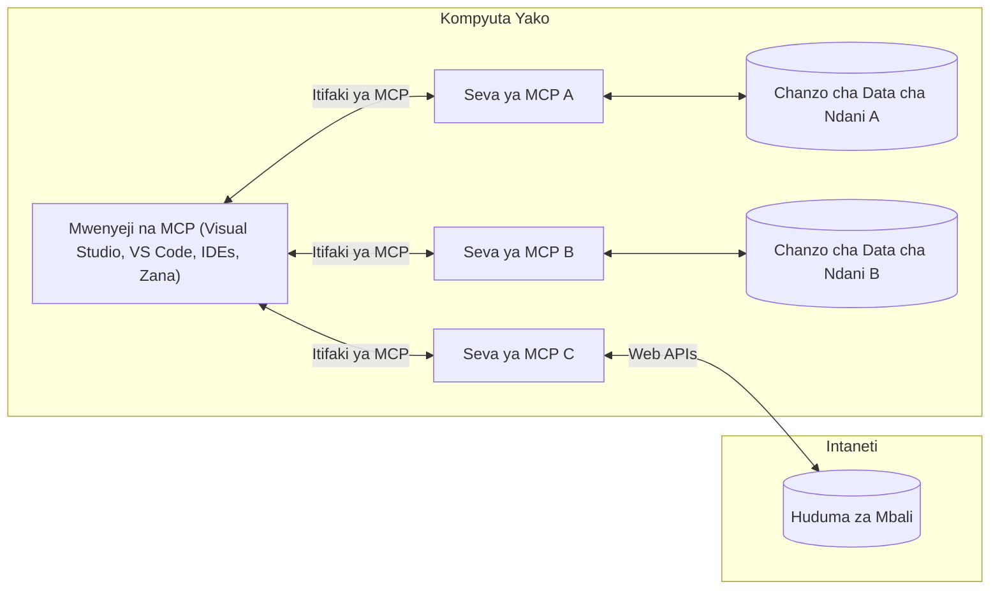

# MCP Core Concepts: Kufanikiwa na Itifaki ya Muktadha wa Mfano kwa Uingiliano wa AI

[](https://youtu.be/earDzWGtE84)

_(Bofya picha hapo juu kutazama video ya somo hili)_

[Model Context Protocol (MCP)](https://github.com/modelcontextprotocol) ni mfumo wenye nguvu, uliopangwa kwa kiwango kwamba unaongeza ufanisi wa mawasiliano kati ya Modeli Kubwa za Lugha (LLMs) na zana za nje, programu, na vyanzo vya data. 
Mwongozo huu utakuelekeza kupitia dhana kuu za MCP. Utafahamu kuhusu usanifu wake wa mteja-mtumiaji, vipengele muhimu, mbinu za mawasiliano, na kanuni bora za utekelezaji.

- **Idhini Wazi ya Mtumiaji**: Kufikia data zote na shughuli zote kunahitaji idhini wazi kutoka kwa mtumiaji kabla ya utekelezaji. Watumiaji wanapaswa kuelewa kwa uwazi data zipi zitatumiwa na hatua gani zitatekelezwa, na kudhibiti kwa ukamilifu ruhusa na vibali.
  
- **Ulinzi wa Faragha ya Data**: Data za mtumiaji zinaonyeshwa tu kwa idhini wazi na lazima zilindwe kwa udhibiti mzuri wa upatikanaji katika mzunguko mzima wa mwingiliano. Utekelezaji lazima uzuie usambazaji usioidhinishwa wa data na kudumisha mipaka mkali ya faragha.

- **Usalama wa Utekelezaji wa Zana**: Kila mtumiaji wa zana unahitaji idhini wazi ya mtumiaji kwa ufahamu wa wazi wa kazi, vigezo, na athari zinazowezekana za zana hiyo. Mipaka imara ya usalama lazima izuie utekelezaji wa zana usiotarajiwa, hatari, au ulaghai.

- **Usalama wa Tabaka la Usafirishaji**: Njia zote za mawasiliano zinapaswa kutumia mbinu sahihi za usimbaji fiche na uthibitishaji. Muunganisho wa mbali unapaswa kutumia itifaki salama za usafirishaji na usimamizi sahihi wa vyeti.

#### Miongozo ya Utekelezaji:

- **Usimamizi wa Ruhusa**: Tekeleza mifumo ya ruhusa za kina inayowawezesha watumiaji kudhibiti seva, zana, na rasilimali zinazopatikana
- **Uthibitishaji & Uidhinishaji**: Tumia mbinu salama za uthibitishaji (OAuth, API keys) kwa usimamizi sahihi wa tokeni na kumalizika kwa tokeni  
- **Uhakiki wa Ingizo**: Hakiki vigezo vyote na vyanzo vya data kulingana na schemata zilizoainishwa ili kuzuia mashambulizi ya kuingiza
- **Kumbukumbu ya Ukaguzi**: Hifadhi kumbukumbu kamili za shughuli zote kwa ufuatiliaji wa usalama na uzingatiaji

## Muhtasari

Somo hili linachunguza usanifu wa msingi na vipengele vinavyojumuisha mfumo wa Model Context Protocol (MCP). Utajifunza kuhusu usanifu wa mteja-mtumiaji, vipengele muhimu, na mbinu za mawasiliano zinazotoa nguvu ya mwingiliano wa MCP.

## Malengo Muhimu ya Kujifunza

Mwisho wa somo hili, utakuwa umeweza:

- Kuelewa usanifu wa mteja-mtumiaji wa MCP.
- Kutambua majukumu na wajibu wa Wageni, Wateja, na Seva.
- Kuchambua sifa kuu zinazofanya MCP kuwa tabaka lenye ufanisi wa uingiliano.
- Kujifunza jinsi taarifa zinavyotiririka ndani ya mfumo wa MCP.
- Kupata maarifa ya vitendo kupitia mifano ya msimbo katika .NET, Java, Python, na JavaScript.

## Usanifu wa MCP: Muangalizi wa Kina

Mfumo wa MCP umejengwa kwa mfano wa mteja-mtumiaji. Muundo huu wa moduli unaruhusu programu za AI kuingiliana kwa ufanisi na zana, hifadhidata, APIs, na rasilimali za muktadha. Hebu tugawanye usanifu huu katika vipengele vikuu vyake.

Katika msingi wake, MCP hufuata usanifu wa mteja-mtumiaji ambapo programu mwenyeji inaweza kuunganishwa na seva nyingi:


- **MCP Hosts**: Programu kama VSCode, Claude Desktop, IDEs, au zana za AI zinazotaka kupata data kupitia MCP
- **MCP Clients**: Wateja wa itifaki wanaoshikilia muunganisho wa 1:1 na seva
- **MCP Servers**: Programu nyepesi ambazo kila moja inaonyesha uwezo maalum kupitia Model Context Protocol uliosawazishwa
- **Local Data Sources**: Faili, hifadhidata, na huduma za kompyuta yako ambazo seva za MCP zinaweza kufikia kwa usalama
- **Remote Services**: Mifumo ya nje inayopatikana mtandaoni ambayo seva za MCP zinaweza kuunganishwa nayo kupitia APIs.

Itifaki ya MCP ni kiwango kinachobadilika kinachotumia toleo linalotegemea tarehe (fomati ya YYYY-MM-DD). Toleo la sasa la itifaki ni **2025-11-25**. Unaweza kuona masasisho ya hivi karibuni kwenye [maelezo ya itifaki](https://modelcontextprotocol.io/specification/2025-11-25/)

### 1. Wageni (Hosts)

Katika Model Context Protocol (MCP), **Wageni** ni programu za AI zinazotumika kama kiolesura kuu ambacho watumiaji huingiliana nacho na itifaki. Wageni huandaa na kusimamia muunganisho wa seva nyingi za MCP kwa kuanzisha wateja wa MCP wa kujitolea kwa kila muunganisho wa seva. Mfano wa Wageni ni:

- **Programu za AI**: Claude Desktop, Visual Studio Code, Claude Code
- **Mazingira ya Maendeleo**: IDEs na wahariri wa msimbo wenye uingiliano wa MCP  
- **Programu Maalum**: Mawakala na zana za AI zilizojengwa kwa madhumuni maalum

**Wageni** ni programu zinazoratibu mwingiliano wa modeli za AI. Wanafanya:

- **Kuratibu Modeli za AI**: Kukimbia au kuingiliana na LLMs ili kuzalisha majibu na kuratibu mtiririko wa kazi za AI
- **Kusimamia Muunganisho wa Wateja**: Kuunda na kudumisha mteja mmoja wa MCP kwa kila muunganisho wa seva ya MCP
- **Kudhibiti Kiolesura cha Mtumiaji**: Kudhibiti mtiririko wa mazungumzo, mwingiliano wa watumiaji, na uwasilishaji wa majibu  
- **Kutekeleza Usalama**: Kudhibiti ruhusa, vizingiti vya usalama, na uthibitishaji
- **Kusimamia Idhini ya Mtumiaji**: Kusimamia idhini ya mtumiaji kwa kushiriki data na utekelezaji wa zana


### 2. Wateja (Clients)

**Wateja** ni vipengele muhimu vinavyoshikilia miunganisho maalum wa mtu kwa mtu kati ya Wageni na seva za MCP. Kila mteja wa MCP huanzishwa na Mgeni kuunganishwa na seva maalum ya MCP, kuhakikisha njia za mawasiliano zilizoandaliwa na salama. Wateja wengi huruhusu Wageni kuunganishwa na seva nyingi kwa wakati mmoja.

**Wateja** ni vipengele vya kiunganishi ndani ya programu ya mwenyeji. Wanafanya:

- **Mawasiliano ya Itifaki**: Kutuma maombi ya JSON-RPC 2.0 kwa seva zenye maelekezo na maagizo
- **Majadiliano ya Uwezo**: Kujadiliana vipengele vinavyoungwa mkono na matoleo ya itifaki na seva wakati wa kuanzisha
- **Utekelezaji wa Zana**: Kusimamia maombi ya utekelezaji wa zana kutoka kwa modeli na kuchakata majibu
- **Mabadiliko ya Wakati Halisi**: Kushughulikia arifa na masasisho ya wakati halisi kutoka kwa seva
- **Usindikaji wa Majibu**: Kusindika na kupanga majibu ya seva kwa ajili ya kuonyeshwa kwa watumiaji

### 3. Seva (Servers)

**Seva** ni programu zinazotoa muktadha, zana, na uwezo kwa wateja wa MCP. Zinaweza kutekelezwa ndani ya kompyuta moja (nyumbani) au kwa mbali (kwenye jukwaa la nje), na zinawajibika kushughulikia maombi ya mteja na kutoa majibu yaliyopangwa. Seva huonyesha utendaji maalum kupitia Model Context Protocol uliosawazishwa.

**Seva** ni huduma zinazotoa muktadha na uwezo. Zina:

- **Usajili wa Vipengele**: Kusajili na kuonyesha msingi wa huduma zinazopatikana (rasilimali, maelekezo, zana) kwa wateja
- **Usindikaji wa Maombi**: Kupokea na kutekeleza simu za zana, maombi ya rasilimali, na maombi ya maelekezo kutoka kwa wateja
- **Utoaji wa Muktadha**: Kutoa taarifa na data ya muktadha ili kuboresha majibu ya modeli
- **Usimamizi wa Hali**: Kudumisha hali ya kikao na kushughulikia mwingiliano wa hali inapohitajika
- **Arifa za Wakati Halisi**: Kutuma arifa kuhusu mabadiliko ya uwezo na masasisho kwa wateja waliounganishwa

Seva zinaweza kuundwa na mtu yeyote kuongeza uwezo wa modeli kwa utendaji maalum, na zinaunga mkono matukio ya usambazaji ya ndani na ya mbali.

### 4. Primitives za Seva

Seva katika Model Context Protocol (MCP) hutoa **primitives** tatu kuu zinazobainisha kanuni za msingi za mwingiliano wa kina kati ya wateja, wageni, na modeli za lugha. Primitives hizi zinaelezea aina za taarifa za muktadha na hatua zinazopatikana kupitia itifaki.

Seva za MCP zinaweza kuonyesha mchanganyiko wowote wa primitives tatu kuu zifuatazo:

#### Rasilimali (Resources)

**Rasilimali** ni vyanzo vya data vinavyotoa taarifa za muktadha kwa programu za AI. Zinawakilisha maudhui ya kudumu au ya mabadiliko yanayoweza kuongeza uelewa wa modeli na uamuzi:

- **Data ya Muktadha**: Taarifa zilizo na muundo na muktadha kwa matumizi ya modeli za AI
- **Maktaba za Maarifa**: Hifadhi za nyaraka, makala, mikataba, na karatasi za utafiti
- **Vyanzo vya Data vya Ndani**: Faili, hifadhidata, na taarifa za mfumo wa ndani  
- **Data ya Nje**: Majibu ya API, huduma za wavuti, na data ya mifumo ya mbali
- **Maudhui ya Mabadiliko**: Data ya wakati halisi inayobadilika kulingana na hali za nje

Rasilimali hutambulika kwa URIs na zinaunga mkono kugunduliwa kupitia njia `resources/list` na upokeaji kupitia `resources/read`:

```text
file://documents/project-spec.md
database://production/users/schema
api://weather/current
```

#### Maelekezo (Prompts)

**Maelekezo** ni templeti zinazorejelewa zinazosaidia kupanga mwingiliano na modeli za lugha. Zinatoa mifumo ya kawaida ya mwingiliano na mtiririko wa kazi uliofunikwa katika templates:

- **Mwingiliano wa Kitempleti**: Ujumbe uliopangwa mapema na vionjo vya mazungumzo
- **Templeti za Mtiririko wa Kazi**: Mifumo iliyopangwa kwa kazi na mwingiliano wa kawaida
- **Mifano ya Few-shot**: Templeti za mifano kwa maelekezo ya modeli
- **Maelekezo ya Mfumo**: Maelekezo msingi yanayobainisha tabia na muktadha wa modeli
- **Templeti Zinazobadilika**: Maelekezo yenye vigezo vinavyobadilika kulingana na muktadha maalum

Maelekezo yanaunga mkono uingizwaji wa vigezo na yanaweza kugunduliwa kupitia `prompts/list` na kupokelewa kwa `prompts/get`:

```markdown
Generate a {{task_type}} for {{product}} targeting {{audience}} with the following requirements: {{requirements}}
```

#### Zana (Tools)

**Zana** ni kazi zinazotekelezwa ambazo modeli za AI zinaweza kuitisha ili kufanya hatua maalum. Zinawakilisha "vitenzi" vya mfumo wa MCP, zikiruhusu modeli kuingiliana na mifumo ya nje:

- **Kazi Zinazotekelezwa**: Operesheni zilizojitenga ambazo modeli zinaweza kuitisha na vigezo maalum
- **Uunganishaji wa Mifumo ya Nje**: Simu za API, maswali ya hifadhidata, operesheni za faili, mahesabu
- **Utambulisho wa Kipekee**: Kila zana ina jina, maelezo, na muundo wa vigezo
- **Pembejeo/Milisho Yenye Muundo**: Zana zinakubali vigezo vilivyothibitishwa na kurudisha majibu yenye Mfumo na aina
- **Uwezo wa Hatua**: Kuwezesha modeli kufanya hatua halisi na kupata data ya moja kwa moja

Zana zinafafanuliwa kwa Schema ya JSON kwa uthibitishaji wa vigezo na kugunduliwa kupitia `tools/list` na kutekelezwa kupitia `tools/call`. Zana zinaweza pia kujumuisha **vikundi** kama metadata ya ziada kwa uwasilishaji bora wa kiolesura.

**Maelezo ya Zana**: Zana zinaunga mkono maelezo ya tabia (mfano, `readOnlyHint`, `destructiveHint`) yanayoelezea kama zana ni kwa kusoma tu au za uharibifu, kusaidia wateja kufanya maamuzi sahihi kuhusu utekelezaji wa zana.

Mfano wa ufafanuzi wa zana:

```typescript
server.tool(
  "search_products", 
  {
    query: z.string().describe("Search query for products"),
    category: z.string().optional().describe("Product category filter"),
    max_results: z.number().default(10).describe("Maximum results to return")
  }, 
  async (params) => {
    // Fanya utafutaji na urudishe matokeo yaliyopangwa
    return await productService.search(params);
  }
);
```

## Primitives za Mteja

Katika Model Context Protocol (MCP), **wateja** wanaweza kuonyesha primitives zinazowezesha seva kuomba uwezo zaidi kutoka kwa programu mwenyeji. Primitives hizi za upande wa mteja huruhusu utekelezaji wa seva ulio na mwingiliano mkubwa zinazoweza kupata uwezo wa modeli za AI na mwingiliano wa mtumiaji.

### Sampuli (Sampling)

**Sampuli** inaruhusu seva kuomba makamilisho ya modeli za lugha kutoka kwa programu ya AI ya mteja. Primitive hii inawawezesha seva kupata uwezo wa LLM bila kuingiza utegemezi wa modeli zao:

- **Upatikanaji Huru wa Modeli**: Seva zinaweza kuomba makamilisho bila kujumuisha SDK za LLM au kusimamia upatikanaji wa modeli
- **AI Inayoanzishwa na Seva**: Inawawezesha seva kuzalisha maudhui kwa kujitegemea kwa kutumia modeli ya AI ya mteja
- **Mwingiliano wa Kurudia wa LLM**: Inasaidia matukio magumu ambapo seva zinahitaji msaada wa AI kwa usindikaji
- **Uzalishaji wa Maudhui ya Muktadha**: Seva zinaweza kutengeneza majibu ya muktadha kwa kutumia modeli ya mwenyeji
- **Msaada wa Kuitisha Zana**: Seva zinaweza kujumuisha parameta `tools` na `toolChoice` kuziwezesha modeli ya mteja kuitisha zana wakati wa sampuli

Sampuli huanzishwa kupitia njia ya `sampling/complete`, ambapo seva hutuma maombi ya makamilisho kwa wateja.

### Mizizi (Roots)

**Mizizi** hutoa njia iliyosawazishwa kwa wateja kuonyesha mipaka ya mfumo wa faili kwa seva, kusaidia seva kuelewa saraka na faili ambazo zinaweza kufikiwa:

- **Mipaka ya Mfumo wa Faili**: Bainisha mipaka ya eneo ambalo seva zinaweza kufanya kazi ndani ya mfumo wa faili
- **Usimamizi wa Upatikanaji**: Saidia seva kuelewa saraka na faili ambazo zinaruhusiwa kuzifikia
- **Masasisho ya Mabadiliko**: Wateja wanaweza kuuliza seva wakati orodha ya mizizi inabadilika
- **Utambuzi kwa Msingi wa URI**: Mizizi hutumia URI `file://` kutambulisha saraka na faili zinazopatikana

Mizizi hugunduliwa kupitia njia ya `roots/list`, ambapo wateja hutuma `notifications/roots/list_changed` wakati mizizi inapo badilika.

### Omba Taarifa (Elicitation)

**Omba Taarifa** inaruhusu seva kuomba taarifa zaidi au uthibitisho kutoka kwa watumiaji kupitia kiolesura cha mteja:

- **Maombi ya Kuingizo Mtumiaji**: Seva zinaweza kuomba taarifa zaidi wakati zinapohitajika kwa utekelezaji wa zana
- **Masuala ya Uthibitisho**: Kuomba idhini ya mtumiaji kwa shughuli nyeti au zinazoathiri
- **Mtiririko wa Kazi wa Kuingiliana**: Kuwezesha seva kuunda mwingiliano wa mtumiaji hatua kwa hatua
- **Kukusanya Parameta Zinazobadilika**: Kukusanya vigezo vinavyokosekana au hiari wakati wa utekelezaji wa zana

Maombi ya elicitation hufanywa kwa kutumia njia ya `elicitation/request` kukusanya maingizo ya mtumiaji kupitia kiolesura cha mteja.

**Hali ya URL ya Elicitation**: Seva pia zinaweza kuomba mwingiliano wa mtumiaji unaotegemea URL, na kuruhusu seva kuelekeza watumiaji kwa kurasa za wavuti za nje kwa uthibitishaji, idhini, au kuingiza data.

### Kumbukumbu (Logging)

**Kumbukumbu** inaruhusu seva kutuma ujumbe wa kumbukumbu zilizo na muundo kwa wateja kwa uchunguzi, ufuatiliaji, na uwekaji wa ufanisi wa shughuli:

- **Msaada wa Uchunguzi**: Kuwezesha seva kutoa kumbukumbu za kina za utekelezaji kwa ajili ya kutatua matatizo
- **Ufuatiliaji wa Operesheni**: Kutuma masasisho ya hali na vipimo vya utendaji kwa wateja
- **Ripoti za Makosa**: Kutoa muktadha wa makosa na taarifa za uchunguzi
- **Njia za Ukaguzi**: Kuunda kumbukumbu kamili za shughuli na maamuzi ya seva

Ujumbe wa kumbukumbu hutumwa kwa wateja kutoa uwazi juu ya shughuli za seva na kusaidia uchunguzi.

## Mtiririko wa Taarifa katika MCP

Model Context Protocol (MCP) hufafanua mtiririko uliopangwa wa taarifa kati ya wageni, wateja, seva, na modeli. Kuelewa mtiririko huu husaidia kufafanua jinsi maombi ya watumiaji yanavyosindikwa na jinsi zana za nje na data zinavyounganishwa katika majibu ya modeli.
- **Mwenyeji Anaanzisha Muunganisho**  
  Programu ya mwenyeji (kama IDE au kiolesura cha mazungumzo) huanzisha muunganisho na seva ya MCP, kawaida kupitia STDIO, WebSocket, au usafirishaji mwingine unaounga mkono.

- **Mjadala wa Uwezo**  
  Mteja (aliyemo kwenye mwenyeji) na seva hubadilishana taarifa kuhusu vipengele vinavyoumuliwa, zana, rasilimali, na matoleo ya itifaki. Hii kuhakikisha pande zote mbili zinaelewa uwezo unaopatikana kwa kikao hicho.

- **Ombi la Mtumiaji**  
  Mtumiaji huingiliana na mwenyeji (mfano, kuingiza maelekezo au amri). Mwenyeji hukusanya maelezo haya na kuyapeleka kwa mteja kwa ajili ya usindikaji.

- **Matumizi ya Rasilimali au Zana**  
  - Mteja anaweza kuomba muktadha zaidi au rasilimali kutoka seva (kama vile faili, rekodi za hifadhidata, au makala za hifadhidata ya maarifa) ili kuimarisha uelewa wa mfano.  
  - Ikiwa mfano unahisi kuwa zana inahitajika (mfano, kupata data, kufanya hesabu, au kuita API), mteja hutuma ombi la kuitisha zana kwa seva, akielezea jina la zana na vigezo.

- **Utekelezaji wa Seva**  
  Seva hupokea ombi la rasilimali au zana, hufanya shughuli zinazohitajika (kama kukimbiza kazi, kuulizia hifadhidata, au kupata faili), na hurudisha matokeo kwa mteja kwa muundo uliopangwa.

- **Uundaji wa Majibu**  
  Mteja huunganisha majibu ya seva (data za rasilimali, matokeo ya zana, n.k.) katika mwingiliano wa mfano unaoendelea. Mfano hutumia taarifa hii kuunda jibu jumuishi na linalohusiana na muktadha.

- **Uwasilishaji wa Matokeo**  
  Mwenyeji hupokea matokeo ya mwisho kutoka kwa mteja na kuonyesha kwa mtumiaji, mara nyingi ikijumuisha maandishi yaliyotengenezwa na mfano pamoja na matokeo ya utekelezaji wa zana au utafutaji wa rasilimali.

Mtiririko huu unawezesha MCP kusaidia programu za AI zilizo juu, zenye mwingiliano, na zenye ufahamu wa muktadha kwa kuunganisha mifano kwa urahisi na zana za nje na vyanzo vya data.

## Mimarisha ya Itifaki & Tabaka

MCP ina tabaka mbili za usanifu tofauti zinazofanya kazi pamoja kutoa mfumo kamili wa mawasiliano:

### Tabaka la Data

**Tabaka la Data** linautekeleza itifaki kuu ya MCP kwa kutumia **JSON-RPC 2.0** kama msingi wake. Tabaka hili linafafanua muundo wa ujumbe, maana, na mifumo ya mwingiliano:

#### Vipengele Muhimu:

- **Itifaki ya JSON-RPC 2.0**: Mawasiliano yote hutumia muundo ulioratibiwa wa ujumbe wa JSON-RPC 2.0 kwa miito ya method, majibu, na taarifa  
- **Usimamizi wa Mzunguko wa Maisha**: Hushughulikia kuanzishwa kwa muunganisho, mjadala wa uwezo, na kusitisha vikao kati ya wateja na seva  
- **Vipengele vya Seva**: Huwezesha seva kutoa huduma kuu kupitia zana, rasilimali, na maelekezo  
- **Vipengele vya Mteja**: Huwezesha seva kuomba sampuli kutoka kwa LLMs, kuomba maingiliano ya mtumiaji, na kutuma ujumbe za kumbukumbu  
- **Taarifa za Muda Halisi**: Inasaidia taarifa zisizo za simu kwa masasisho ya mabadiliko bila kuomba mara kwa mara  

#### Sifa Muhimu:

- **Mjadala wa Matoleo ya Itifaki**: Hutumia uundaji wa matoleo kwa tarehe (YYYY-MM-DD) kuhakikisha muingiliano  
- **Ugunduzi wa Uwezo**: Wateja na seva hubadilishana taarifa za vipengele vilivyotangazwa wakati wa kuanzisha  
- **Vikao Vyenye Hali**: Huhifadhi hali ya muunganisho katika mwingiliano mingi kwa kuendeleza muktadha  

### Tabaka la Usafirishaji

**Tabaka la Usafirishaji** hushughulikia njia za mawasiliano, ufunikaji wa ujumbe, na uthibitishaji kati ya washiriki wa MCP:

#### Njia Zinazounga Mkono Usafirishaji:

1. **Usafirishaji wa STDIO**:  
   - Hutumia mikondo ya kawaida ya kuingiza/tokea kwa mawasiliano ya moja kwa moja ya mchakato  
   - Bora kwa michakato ya ndani kwenye mashine hiyo hiyo bila mzigo wa mtandao  
   - Inatumika sana kwa utekelezaji wa seva za MCP za ndani  

2. **Usafirishaji wa HTTP Unaoweza Kupelekwa**:  
   - Hutumia HTTP POST kwa ujumbe kutoka mteja kwenda seva  
   - Matukio ya Server-Sent Events (SSE) yanayopatikana kwa mtiririko kutoka seva kwenda mteja  
   - Inawezesha mawasiliano ya seva za mbali kupitia mitandao  
   - Inasaidia uthibitishaji wa HTTP wa kawaida (tokeni za mwendeshaji, API keys, vichwa maalum)  
   - MCP inapendekeza OAuth kwa uthibitishaji salama wa tokeni  

#### Ufunikaji wa Usafirishaji:

Tabaka la usafirishaji hulinda maelezo ya mawasiliano kutoka tabaka la data, hii inaruhusu muundo sawa wa ujumbe wa JSON-RPC 2.0 kutumia njia zote za usafirishaji. Ufunikaji huu huruhusu programu kubadili kati ya seva za ndani na za mbali kwa urahisi.

### Mambo ya Usalama

Utekelezaji wa MCP lazima uzingatie kanuni kadhaa muhimu za usalama kuhakikisha mwingiliano salama, wa kuaminika, na ulio salama katika shughuli zote za itifaki:

- **Ruhusa na Udhibiti wa Mtumiaji**: Watumiaji wanapaswa kutoa ruhusa wazi kabla ya data yoyote kufikiwa au shughuli zozote kufanywa. Wanapaswa kuwa na udhibiti wazi juu ya data inayoshirikiwa na hatua zinazoidhinishwa, zikichochewa na kiolesura rahisi cha mtumiaji cha kupitia na kuidhinisha shughuli.

- **Faragha ya Data**: Data za mtumiaji zinapaswa kuonyeshwa tu baada ya ruhusa wazi na kulindwa kwa vidhibiti vyenye ufanisi vya upatikanaji. Utekelezaji wa MCP lazima uzingatie kuzuia usambazaji usioidhinishwa wa data na kuhakikisha faragha inahifadhiwa katika mwingiliano wote.

- **Usalama wa Zana**: Kabla ya kuitisha zana yoyote, ruhusa wazi ya mtumiaji inahitajika. Watumiaji wanapaswa kuelewa kazi za kila zana, na mipaka salama ya usalama lazima itekelezwe kuzuia utekelezaji usio makusudi au hatari wa zana.

Kwa kufuata kanuni hizi za usalama, MCP huhakikisha imani ya mtumiaji, faragha, na usalama vinahifadhiwa katika mwingiliano wote wa itifaki wakati ikiruhusu muungano wenye nguvu wa AI.

## Mifano ya Msimbo: Vipengele Muhimu

Hapa chini kuna mifano ya msimbo katika lugha kadhaa maarufu inayoonyesha jinsi ya kutekeleza vipengele kuu vya seva za MCP na zana.

### Mfano wa .NET: Kuunda Seva Rahisi ya MCP na Zana

Hii ni mfano wa vitendo wa msimbo wa .NET unaoonesha jinsi ya kutekeleza seva rahisi ya MCP na zana maalum. Mfano huu unaonyesha jinsi ya kufafanua na kusajili zana, kushughulikia maombi, na kuunganisha seva kwa kutumia Itifaki ya Muktadha wa Mfano.

```csharp
using System;
using System.Threading.Tasks;
using ModelContextProtocol.Server;
using ModelContextProtocol.Server.Transport;
using ModelContextProtocol.Server.Tools;

public class WeatherServer
{
    public static async Task Main(string[] args)
    {
        // Create an MCP server
        var server = new McpServer(
            name: "Weather MCP Server",
            version: "1.0.0"
        );
        
        // Register our custom weather tool
        server.AddTool<string, WeatherData>("weatherTool", 
            description: "Gets current weather for a location",
            execute: async (location) => {
                // Call weather API (simplified)
                var weatherData = await GetWeatherDataAsync(location);
                return weatherData;
            });
        
        // Connect the server using stdio transport
        var transport = new StdioServerTransport();
        await server.ConnectAsync(transport);
        
        Console.WriteLine("Weather MCP Server started");
        
        // Keep the server running until process is terminated
        await Task.Delay(-1);
    }
    
    private static async Task<WeatherData> GetWeatherDataAsync(string location)
    {
        // This would normally call a weather API
        // Simplified for demonstration
        await Task.Delay(100); // Simulate API call
        return new WeatherData { 
            Temperature = 72.5,
            Conditions = "Sunny",
            Location = location
        };
    }
}

public class WeatherData
{
    public double Temperature { get; set; }
    public string Conditions { get; set; }
    public string Location { get; set; }
}
```

### Mfano wa Java: Vipengele vya Seva ya MCP

Mfano huu unaonyesha seva ile ile ya MCP na usajili wa zana kama mfano wa .NET hapo juu, lakini umeandikwa kwa Java.

```java
import io.modelcontextprotocol.server.McpServer;
import io.modelcontextprotocol.server.McpToolDefinition;
import io.modelcontextprotocol.server.transport.StdioServerTransport;
import io.modelcontextprotocol.server.tool.ToolExecutionContext;
import io.modelcontextprotocol.server.tool.ToolResponse;

public class WeatherMcpServer {
    public static void main(String[] args) throws Exception {
        // Unda seva ya MCP
        McpServer server = McpServer.builder()
            .name("Weather MCP Server")
            .version("1.0.0")
            .build();
            
        // Jisajili chombo cha hali ya hewa
        server.registerTool(McpToolDefinition.builder("weatherTool")
            .description("Gets current weather for a location")
            .parameter("location", String.class)
            .execute((ToolExecutionContext ctx) -> {
                String location = ctx.getParameter("location", String.class);
                
                // Pata data ya hali ya hewa (imeboreshwa)
                WeatherData data = getWeatherData(location);
                
                // Rudisha jibu lililotengenezwa
                return ToolResponse.content(
                    String.format("Temperature: %.1f°F, Conditions: %s, Location: %s", 
                    data.getTemperature(), 
                    data.getConditions(), 
                    data.getLocation())
                );
            })
            .build());
        
        // Unganisha seva kwa kutumia usafirishaji wa stdio
        try (StdioServerTransport transport = new StdioServerTransport()) {
            server.connect(transport);
            System.out.println("Weather MCP Server started");
            // Endelea kufanya kazi kwa seva hadi mchakato ukhuzwe
            Thread.currentThread().join();
        }
    }
    
    private static WeatherData getWeatherData(String location) {
        // Utekelezaji ungetumia API ya hali ya hewa
        // Imeboreshwa kwa madhumuni ya mfano
        return new WeatherData(72.5, "Sunny", location);
    }
}

class WeatherData {
    private double temperature;
    private String conditions;
    private String location;
    
    public WeatherData(double temperature, String conditions, String location) {
        this.temperature = temperature;
        this.conditions = conditions;
        this.location = location;
    }
    
    public double getTemperature() {
        return temperature;
    }
    
    public String getConditions() {
        return conditions;
    }
    
    public String getLocation() {
        return location;
    }
}
```

### Mfano wa Python: Kujenga Seva ya MCP

Mfano huu unatumia fastmcp, tafadhali hakikisha umeisakinisha kwanza:

```python
pip install fastmcp
```
Mfano wa Msimbo:

```python
#!/usr/bin/env python3
import asyncio
from fastmcp import FastMCP
from fastmcp.transports.stdio import serve_stdio

# Unda seva ya FastMCP
mcp = FastMCP(
    name="Weather MCP Server",
    version="1.0.0"
)

@mcp.tool()
def get_weather(location: str) -> dict:
    """Gets current weather for a location."""
    return {
        "temperature": 72.5,
        "conditions": "Sunny",
        "location": location
    }

# Njia mbadala kutumia darasa
class WeatherTools:
    @mcp.tool()
    def forecast(self, location: str, days: int = 1) -> dict:
        """Gets weather forecast for a location for the specified number of days."""
        return {
            "location": location,
            "forecast": [
                {"day": i+1, "temperature": 70 + i, "conditions": "Partly Cloudy"}
                for i in range(days)
            ]
        }

# Sajili zana za darasa
weather_tools = WeatherTools()

# Anzisha seva
if __name__ == "__main__":
    asyncio.run(serve_stdio(mcp))
```

### Mfano wa JavaScript: Kuunda Seva ya MCP

Mfano huu unaonyesha utengenezaji wa seva ya MCP kwa JavaScript na jinsi ya kusajili zana mbili zinazohusiana na hali ya hewa.

```javascript
// Kutumia SDK Rasmi ya Itifaki ya Muktadha wa Mfano
import { McpServer } from "@modelcontextprotocol/sdk/server/mcp.js";
import { StdioServerTransport } from "@modelcontextprotocol/sdk/server/stdio.js";
import { z } from "zod"; // Kwa uthibitishaji wa vigezo

// Unda seva ya MCP
const server = new McpServer({
  name: "Weather MCP Server",
  version: "1.0.0"
});

// Eleza chombo cha hali ya hewa
server.tool(
  "weatherTool",
  {
    location: z.string().describe("The location to get weather for")
  },
  async ({ location }) => {
    // Hii kawaida itaomba API ya hali ya hewa
    // Imefanywa rahisi kwa maonyesho
    const weatherData = await getWeatherData(location);
    
    return {
      content: [
        { 
          type: "text", 
          text: `Temperature: ${weatherData.temperature}°F, Conditions: ${weatherData.conditions}, Location: ${weatherData.location}` 
        }
      ]
    };
  }
);

// Eleza chombo cha utabiri
server.tool(
  "forecastTool",
  {
    location: z.string(),
    days: z.number().default(3).describe("Number of days for forecast")
  },
  async ({ location, days }) => {
    // Hii kawaida itaomba API ya hali ya hewa
    // Imefanywa rahisi kwa maonyesho
    const forecast = await getForecastData(location, days);
    
    return {
      content: [
        { 
          type: "text", 
          text: `${days}-day forecast for ${location}: ${JSON.stringify(forecast)}` 
        }
      ]
    };
  }
);

// Kazi za msaada
async function getWeatherData(location) {
  // Kuiga wito wa API
  return {
    temperature: 72.5,
    conditions: "Sunny",
    location: location
  };
}

async function getForecastData(location, days) {
  // Kuiga wito wa API
  return Array.from({ length: days }, (_, i) => ({
    day: i + 1,
    temperature: 70 + Math.floor(Math.random() * 10),
    conditions: i % 2 === 0 ? "Sunny" : "Partly Cloudy"
  }));
}

// Unganisha seva kwa kutumia usafirishaji wa stdio
const transport = new StdioServerTransport();
server.connect(transport).catch(console.error);

console.log("Weather MCP Server started");
```

Mfano huu wa JavaScript unaonyesha jinsi ya kuunda seva ya MCP inayosajili zana zinazohusiana na hali ya hewa na kuunganishwa kupitia usafirishaji wa stdio kushughulikia maombi yanayoingia kutoka kwa mteja.

## Usalama na Idhini

MCP ina dhana na mifumo kadhaa jengo la usalama na idhini katika itifaki nzima:

1. **Udhibiti wa Ruhusa za Zana**:  
  Wateja wanaweza kupunguza zana gani mfano unaruhusiwa kutumia wakati wa kikao. Hii huhakikisha kuwa zana tu zilizoidhinishwa wazi ndizo zinapatikana, kupunguza hatari ya shughuli zisizotarajiwa au hatari. Ruhusa zinaweza kusanidiwa kwa njia ya mabadiliko kulingana na mapendeleo ya mtumiaji, sera za shirika, au muktadha wa mwingiliano.

2. **Uthibitishaji**:  
  Seva zinaweza kuhitaji uthibitishaji kabla ya kutoa ruhusa kwa zana, rasilimali, au shughuli zenye usalama wa hali ya juu. Hii inaweza kuhusisha vitambulisho vya API, tokeni za OAuth, au mifumo mingine ya uthibitishaji. Uthibitishaji sahihi huhakikisha wateja na watumiaji wa kuaminika pekee wanaweza kuitisha huduma za seva.

3. **Uthibitishaji wa Vigezo**:  
  Uthibitishaji wa vigezo unatekelezwa kwa miito yote ya zana. Kila zana huainisha aina, muundo, na vizingiti vinavyotarajiwa kwa vigezo vyake, na seva huhakiki maombi yanayoingia ipasavyo. Hii huzuia maingizo mabaya au hatari kufikia utekelezaji wa zana na kusaidia kulinda integriti ya shughuli.

4. **Kuingizwa Kiwango cha Mwitikio**:  
  Ili kuzuia matumizi mabaya na kuhakikisha matumizi sawa ya rasilimali za seva, seva za MCP zinaweza kutekeleza ukomo wa kiwango kwa miito ya zana na upatikanaji wa rasilimali. Vikomo vinaweza kuwekwa kwa mtumiaji mmoja, kikao, au kwa jumla, na kusaidia kulinda dhidi ya mashambulizi ya denial-of-service au matumizi ya rasilimali kupita kiasi.

Kwa kuunganisha mifumo hii, MCP hutoa msingi salama kwa kuunganisha mifano ya lugha na zana za nje na vyanzo vya data, pamoja na kutoa watumiaji na watengenezaji udhibiti wa kina juu ya upatikanaji na matumizi.

## Ujumbe wa Itifaki & Mtiririko wa Mawasiliano

Mawasiliano ya MCP hutumia ujumbe wa muundo wa **JSON-RPC 2.0** kuwezesha mwingiliano wazi na wa kuaminika kati ya wenyeji, wateja, na seva. Itifaki inaainisha mifumo maalum ya ujumbe kwa aina tofauti za shughuli:

### Aina za Ujumbe za Msingi:

#### **Ujumbe wa Kuanzisha**
- Ombi la **`initialize`**: Huaanzisha muunganisho na kujadili matoleo ya itifaki na uwezo  
- Jibu la **`initialize`**: Huthibitisha vipengele vilivyotangazwa na taarifa za seva  
- **`notifications/initialized`**: Inaashiria kuwa uanzishaji umekamilika na kikao kiko tayari  

#### **Ujumbe wa Ugunduzi**
- Ombi la **`tools/list`**: Kugundua zana zinazopatikana kutoka seva  
- Ombi la **`resources/list`**: Orodhesha rasilimali zinazo patikana (vyanzo vya data)  
- Ombi la **`prompts/list`**: Kupata templates za maelekezo zinazo patikana  

#### **Ujumbe wa Utekelezaji**  
- Ombi la **`tools/call`**: Hutekeleza zana maalum kwa vigezo vilivyotolewa  
- Ombi la **`resources/read`**: Hupata yaliyomo kutoka rasilimali maalum  
- Ombi la **`prompts/get`**: Hupata template ya maelekezo na vigezo hiaria  

#### **Ujumbe wa upande wa Mteja**
- Ombi la **`sampling/complete`**: Seva huomba ukamilishaji wa LLM kutoka kwa mteja  
- **`elicitation/request`**: Seva huomba maingiliano ya mtumiaji kupitia kiolesura cha mteja  
- Ujumbe wa Kumbukumbu: Seva hutuma ujumbe za kumbukumbu za muundo kwa mteja  

#### **Ujumbe wa Taarifa**
- **`notifications/tools/list_changed`**: Seva inaripoti mteja juu ya mabadiliko ya zana  
- **`notifications/resources/list_changed`**: Seva inaripoti mteja juu ya mabadiliko ya rasilimali  
- **`notifications/prompts/list_changed`**: Seva inaripoti mteja juu ya mabadiliko ya maelekezo  

### Muundo wa Ujumbe:

Ujumbe wote wa MCP hufuata muundo wa JSON-RPC 2.0 na:
- **Ujumbe wa Ombi**: Zina `id`, `method`, na vigezo hiaria `params`  
- **Ujumbe wa Jibu**: Zina `id` na moja kati ya `result` au `error`  
- **Ujumbe za Taarifa**: Zina `method` na vigezo hiaria `params` (hakuna `id` wala majibu yanayotarajiwa)  

Mawasiliano hii ya muundo huhakikisha mwingiliano wenye kuaminika, unaoripotiwa, na unaoweza kupanuka unaounga mkono hali za juu kama masasisho ya muda halisi, mfuatano wa zana, na udhibiti thabiti wa makosa.

### Kazi (Jaribio)

**Kazi** ni kipengele cha majaribio kinachotoa vifuniko vya utekelezaji vinavyodumu vinavyowawezesha upatikanaji wa matokeo kwa kuchelewesha na ufuatiliaji wa hali kwa maombi ya MCP:

- **Shughuli Ndefu**: Kufuatilia hesabu ghali, ut automatishaji wa mtiririko wa kazi, na usindikaji wa kundi  
- **Matokeo ya Kuchelewa**: Kuchafuliwa hali ya kazi na kupata matokeo inapokamilika  
- **Ufuatiliaji wa Hali**: Kufuatilia maendeleo ya kazi kupitia hatua za mzunguko wa maisha zilizobainishwa  
- **Shughuli za Hatua Nyingi**: Kusaidia mitiririko ya kazi tata inayojumuisha mwingiliano mingi  

Kazi huweka maombi ya kawaida ya MCP kufanikisha mifumo ya utekelezaji wa asynchronous kwa shughuli zisizoweza kukamilika papo hapo.

## Muhimu Za Kukumbuka

- **Mimarisha**: MCP hutumia usanifu wa mteja-seva ambapo wenyeji husimamia muunganisho wa wateja wengi kwa seva  
- **Washiriki**: Mfumo unajumuisha wenyeji (programu za AI), wateja (viana vya itifaki), na seva (watoa uwezo)  
- **Njia za Usafirishaji**: Mawasiliano hutoa STDIO (ndani) na HTTP Unaoweza Kupelekwa na SSE hiari (mbali)  
- **Vipengele vya Msingi**: Seva huonyesha zana (kazi zinazotekelezwa), rasilimali (vyanzo vya data), na maelekezo (templates)  
- **Vipengele vya Mteja**: Seva zinaweza kuomba sampuli (ukamilishaji wa LLM zenye msaada wa kuitisha zana), maingiliano (input ya mtumiaji ikiwa ni pamoja na hali ya URL), mipaka ya mizizi (mipaka ya mfumo wa faili), na kumbukumbu kutoka kwa wateja  
- **Vipengele vya Jaribio**: Kazi hutoa vifuniko vya utekelezaji vya kudumu kwa shughuli za muda mrefu  
- **Msingi wa Itifaki**: Imejengwa juu ya JSON-RPC 2.0 yenye toleo la tarehe (sasa: 2025-11-25)  
- **Uwezo wa Muda Halisi**: Inasaidia taarifa za masasisho ya mabadiliko na usawazishaji wa wakati halisi  
- **Usalama Kwanza**: Ruhusa wazi ya mtumiaji, ulinzi wa faragha, na usafirishaji salama ni mahitaji muhimu  

## Zoefu

Buni zana rahisi ya MCP itakayokuwa na manufaa katika eneo lako. Tafsiri:
1. Zana hiyo itaitwaje  
2. Vigezo gani itakavyokubali  
3. Itarudisha matokeo gani  
4. Mfano utaweza kutumia zana hii jinsi gani kutatua matatizo ya mtumiaji  


---

## Nini Kifuatacho

Kifuatacho: [Sura ya 2: Usalama](../02-Security/README.md)

---

<!-- CO-OP TRANSLATOR DISCLAIMER START -->
**Kangiso**:
Hati hii imetafsiriwa kwa kutumia huduma ya tafsiri ya AI [Co-op Translator](https://github.com/Azure/co-op-translator). Ingawa tunajitahidi kwa usahihi, tafadhali fahamu kuwa tafsiri za kiotomatiki zinaweza kuwa na makosa au upungufu wa usahihi. Hati ya asili katika lugha yake ya asili inapaswa kuchukuliwa kama chanzo cha mamlaka. Kwa habari muhimu, tafsiri ya mtaalamu wa binadamu inapendekezwa. Hatuchukui dhamana kwa kutokuelewana au tafsiri potofu zinazotokana na matumizi ya tafsiri hii.
<!-- CO-OP TRANSLATOR DISCLAIMER END -->