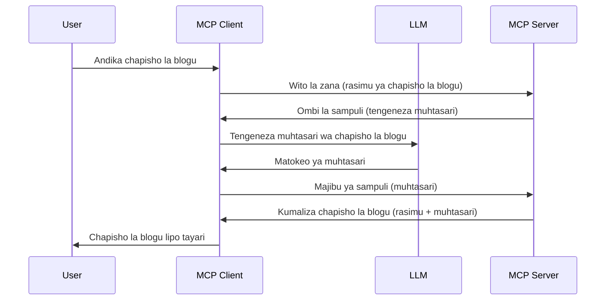

# Sampuli - kuwasilisha vipengele kwa Mteja

Wakati mwingine, unahitaji MCP Mteja na MCP Server kushirikiana kufikia lengo la pamoja. Huenda ukaona hali ambapo Server inahitaji msaada wa LLM iliyoko kwenye mteja. Kwa hali hii, sampuli ndiyo unapaswa kutumia.

Tuchambue baadhi ya matumizi na jinsi ya kujenga suluhisho linalohusisha sampuli.

## Muhtasari

Katika somo hili, tunazingatia kuelezea lini na wapi kutumia Sampuli na jinsi ya kuiweka.

## Malengo ya Kujifunza

Katika sura hii, tutafanya:

- Elezea ni nini Sampuli na lini ya kuitumia.
- Onyesha jinsi ya kusanidi Sampuli katika MCP.
- Toa mifano ya Sampuli ikifanya kazi.

## Sampuli ni nini na kwa nini uitumie?

Sampuli ni kipengele cha juu kinachofanya kazi kwa njia ifuatayo:



### Ombi la Sampuli

Sawa, sasa tuna mtazamo wa juu wa hali inayowezekana, tueleze kuhusu ombi la sampuli ambalo server inarudisha kwa mteja. Hapa ni mfano wa ombi hilo katika mfumo wa JSON-RPC:

```json
{
  "jsonrpc": "2.0",
  "id": 1,
  "method": "sampling/createMessage",
  "params": {
    "messages": [
      {
        "role": "user",
        "content": {
          "type": "text",
          "text": "Create a blog post summary of the following blog post: <BLOG POST>"
        }
      }
    ],
    "modelPreferences": {
      "hints": [
        {
          "name": "claude-3-sonnet"
        }
      ],
      "intelligencePriority": 0.8,
      "speedPriority": 0.5
    },
    "systemPrompt": "You are a helpful assistant.",
    "maxTokens": 100
  }
}
```

Kuna mambo machache hapa yanayostahili kutajwa:

- Prompt, chini ya content -> text, ni mwongozo wetu ambao ni agizo kwa LLM kufupisha maudhui ya chapisho la blogu.

- **modelPreferences**. Sehemu hii ni kama hiyo, ni upendeleo, mapendekezo ya usanidi wa kutumia na LLM. Mtumiaji anaweza kuchagua kufuata mapendekezo haya au kuyabadilisha. Katika kesi hii kuna mapendekezo kuhusu mfano wa kutumia na kipaumbele cha kasi na akili.
- **systemPrompt**, hii ni mwongozo wako wa kawaida wa mfumo unaompa LLM yako tabia na una maelekezo ya mwongozo.
- **maxTokens**, hiki ni kipengele kingine kinachotumika kusema ni vitokeni vingapi vinapendekezwa kutumika kwa kazi hii.

### Jibu la Sampuli

Jibu hili ndilo MCP Mteja hutuma kurudisha kwa MCP Server na ni matokeo ya mteja kupiga simu kwa LLM, kusubiri jibu hilo kisha kutengeneza ujumbe huu. Hapa ni mfano wake katika JSON-RPC:

```json
{
  "jsonrpc": "2.0",
  "id": 1,
  "result": {
    "role": "assistant",
    "content": {
      "type": "text",
      "text": "Here's your abstract <ABSTRACT>"
    },
    "model": "gpt-5",
    "stopReason": "endTurn"
  }
}
```

Angalia jinsi jibu ni muhtasari wa chapisho la blogu kama tulivyoomba. Pia angalia jinsi `model` iliyotumika si ile tuliyoomba bali "gpt-5" badala ya "claude-3-sonnet". Hii ni kuonyesha kuwa mtumiaji anaweza kubadili maamuzi kuhusu kutumia nini na ombi lako la sampuli ni pendekezo tu.

Sawa, sasa tunapoelewa mtiririko mkuu na kazi yenye manufaa ya kuitumia "utengenezaji wa chapisho la blogu + muhtasari", tuchunguze tunachotakiwa kufanya ili iweze kufanya kazi.

### Aina za Ujumbe

Ujumbe wa Sampuli hauwezi kuwa wa maandishi tu bali unaweza pia kutuma, picha na sauti. Hapa ni jinsi JSON-RPC inavyotofautiana:

**Maandishi**

```json
{
  "type": "text",
  "text": "The message content"
}
```

**Yaliyomo ya Picha**

```json
{
  "type": "image",
  "data": "base64-encoded-image-data",
  "mimeType": "image/jpeg"
}
```

**Yaliyomo ya Sauti**

```json
{
  "type": "audio",
  "data": "base64-encoded-audio-data",
  "mimeType": "audio/wav"
}
```

> NOTE: kwa maelezo zaidi kuhusu Sampuli, angalia [nyaraka rasmi](https://modelcontextprotocol.io/specification/2025-11-25/client/sampling)

## Jinsi ya Kusanidi Sampuli katika Mteja

> Kumbuka: kama unajenga server tu, hauitaji kufanya mengi hapa.

Katika mteja, unahitaji kufafanua kipengele hiki kama ifuatavyo:

```json
{
  "capabilities": {
    "sampling": {}
  }
}
```

Hii kisha itachaguliwa wakati mteja wako aliyechaguliwa anapoanzisha sambamba na server.

## Mfano wa Sampuli Kazini - Tengeneza Chapisho la Blogu

Tuanze kuandika server ya sampuli pamoja, tutahitaji kufanya yafuatayo:

1. Tengeneza chombo kwenye Server.
1. Chombo kilicho hapo kitengeneze ombi la sampuli
1. Chombo kitangojee jibu la ombi la sampuli la mteja.
1. Kisha matokeo ya chombo yatatolewa.

Tazama msimbo hatua kwa hatua:

### -1- Tengeneza chombo

**python**

```python
@mcp.tool()
async def create_blog(title: str, content: str, ctx: Context[ServerSession, None]) -> str:
    """Create a blog post and generate a summary"""

```

### -2- Tengeneza ombi la sampuli

Panua chombo chako kwa msimbo ufuatao:

**python**

```python
post = BlogPost(
        id=len(posts) + 1,
        title=title,
        content=content,
        abstract=""
    )

prompt = f"Create an abstract of the following blog post: title: {title} and draft: {content} "

result = await ctx.session.create_message(
        messages=[
            SamplingMessage(
                role="user",
                content=TextContent(type="text", text=prompt),
            )
        ],
        max_tokens=100,
)

```

### -3- Ngojee jibu na rudisha jibu

**python**

```python
post.abstract = result.content.text

posts.append(post)

# rudisha bidhaa kamili
return json.dumps({
    "id": post.title,
    "abstract": post.abstract
})
```

### -4- Msimbo kamili

**python**

```python
from starlette.applications import Starlette
from starlette.routing import Mount, Host

from mcp.server.fastmcp import Context, FastMCP

from mcp.server.session import ServerSession
from mcp.types import SamplingMessage, TextContent

import json


from uuid import uuid4
from typing import List
from pydantic import BaseModel


mcp = FastMCP("Blog post generator")

# app = FastAPI()

posts = []

class BlogPost(BaseModel):
    id: int
    title: str
    content: str
    abstract: str

posts: List[BlogPost] = []

@mcp.tool()
async def create_blog(title: str, content: str, ctx: Context[ServerSession, None]) -> str:
    """Create a blog post and generate a summary"""

    post = BlogPost(
        id=len(posts) + 1,
        title=title,
        content=content,
        abstract=""
    )

    prompt = f"Create an abstract of the following blog post: title: {title} and draft: {content} "

    result = await ctx.session.create_message(
        messages=[
            SamplingMessage(
                role="user",
                content=TextContent(type="text", text=prompt),
            )
        ],
        max_tokens=100,
    )

    post.abstract = result.content.text

    posts.append(post)

    # rudisha chapisho kamili la blogu
    return json.dumps({
        "id": post.title,
        "abstract": post.abstract
    })

if __name__ == "__main__":
    print("Starting server...")
    # mcp.run()
    mcp.run(transport="streamable-http")

# endesha programu kwa: python server.py
```

### -5- Kuijaribu katika Visual Studio Code

Ili kujaribu hii katika Visual Studio Code, fanya yafuatayo:

1. Anzisha server kwenye terminal
1. Iiweke kwenye *mcp.json* (na hakikisha imeshasakazwa) mfano kama huu:

   ```json
   "servers": {
      "blog-server": {
        "type": "http",
        "url": "http://localhost:8000/mcp"
      }
   }
   ```

1. Andika prompt:

   ```text
   create a blog post named "Where Python comes from", the content is "Python is actually named after Monty Python Flying Circus"
   ```

1. Ruhusu sampuli ifanyike. Mara ya kwanza unapotest hii utapokea mazungumzo ya ziada ambayo utahitaji kuyakubali, kisha utaona mazungumzo ya kawaida ya kukuomba utumie chombo.

1. Chunguza matokeo. Utaona matokeo yakiwa yanaonyeshwa vizuri katika GitHub Copilot Chat lakini pia unaweza kuchunguza jibu mbichi la JSON.

**Ziada**. Zana za Visual Studio Code zina msaada mzuri kwa sampuli. Unaweza kusanidi upatikanaji wa Sampuli kwenye server uliyosakinishwa kwa kupita hatua hizi:

1. Nenda kwenye sehemu ya nyongeza.
1. Chagua ikoni ya gia kwa server uliyosakinisha katika sehemu ya "MCP SERVERS - INSTALLED".
1. Chagua "Configure Model Access", hapa unaweza kuchagua ni Miundo gani GitHub Copilot inaruhusiwa kuitumia wakati wa kufanya sampuli. Pia unaweza kuona maombi yote ya sampuli yaliyotokea hivi karibuni kwa kuchagua "Show Sampling requests".

## Kazi ya Nyumbani

Katika kazi hii ya nyumbani, utajenga Sampuli tofauti kidogo yaani muunganisho wa sampuli unaounga mkono kuzalisha maelezo ya bidhaa. Hili ndilo hali yako:

**Hali**: Mfanyakazi wa back office katika e-commerce anahitaji msaada, huchukua muda mrefu sana kutengeneza maelezo ya bidhaa. Kwa hiyo, unapaswa kujenga suluhisho ambapo unaweza kupiga simu chombo "create_product" na hoja "title" na "keywords" na chombo kinapaswa kutoa bidhaa kamili ikiwa na sehemu ya "description" ambayo itajazwa na LLM ya mteja.

TIP: tumia ulichojifunza hapo awali kutengeneza server hii na chombo chake kwa kutumia ombi la sampuli.

## Suluhisho

[Solution](./solution/README.md)

## Muhimu Kutafakari

Sampuli ni kipengele chenye nguvu kinachoruhusu server kuwapeleka kazi kwa mteja wakati inahitaji msaada wa LLM.

## Nini Kufuata

- [Sura ya 4 - Utekelezaji wa vitendo](../../04-PracticalImplementation/README.md)

---

<!-- CO-OP TRANSLATOR DISCLAIMER START -->
**Kionyozo**:
Hati hii imetafsiriwa kwa kutumia huduma ya tafsiri ya AI [Co-op Translator](https://github.com/Azure/co-op-translator). Ingawa tunajitahidi kupata usahihi, tafadhali fahamu kwamba tafsiri za kiotomatiki zinaweza kuwa na makosa au upungufu wa usahihi. Hati ya asili katika lugha yake halisi inapaswa kuchukuliwa kama chanzo cha mamlaka. Kwa taarifa muhimu, tafsiri ya kitaalamu inayofanywa na binadamu inapendekezwa. Hatutojibu kwa kuelewa vibaya au tafsiri potofu zinazotokea kutokana na matumizi ya tafsiri hii.
<!-- CO-OP TRANSLATOR DISCLAIMER END -->