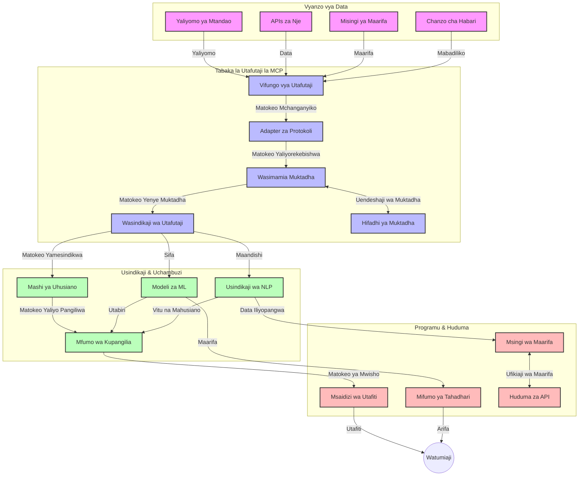
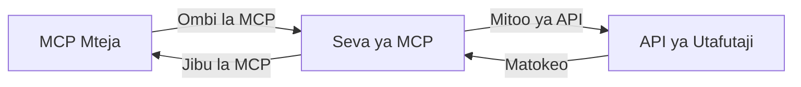
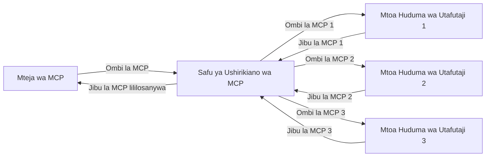
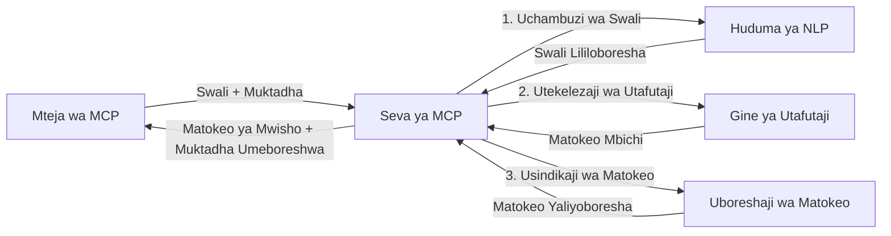

# Itifaki ya Muktadha wa Mfano kwa Utafutaji wa Wavuti wa Muda Halisi

## Muhtasari

Utafutaji wa wavuti wa muda halisi umekuwa muhimu katika mazingira ya kisasa yanayotegemea taarifa, ambapo programu zinahitaji ufikiaji wa papo hapo wa taarifa za kisasa kutoka katika mtandao mzima ili kutoa majibu yanayofaa na ya wakati. Itifaki ya Muktadha wa Mfano (MCP) inaonesha maendeleo makubwa katika kuboresha michakato hii ya utafutaji wa muda halisi, kuboresha ufanisi wa utafutaji, kudumisha uadilifu wa muktadha, na kuboresha utendaji wa jumla wa mfumo.

Moduli hii inachunguza jinsi MCP inavyobadilisha utafutaji wa wavuti wa muda halisi kwa kutoa mbinu iliyo sawirishwa ya usimamizi wa muktadha kati ya mifano ya AI, injini za utafutaji, na programu.

### Utakachojifunza

Katika mwongozo huu kamili, utagundua:

- Jinsi MCP inavyounda daraja linaloendelea kati ya mifano ya AI na uwezo wa utafutaji wa wavuti wa muda halisi
- Mifumo ya usanifu kwa kutekeleza suluhisho zenye ufanisi na uwezo wa kupanuka wa utafutaji kwa MCP
- Mbinu za kuhifadhi muktadha wa utafutaji kati ya maswali na mwingiliano mbalimbali
- Matumizi halisi ya msimbo wa Python na JavaScript kwa hali tofauti za utafutaji
- Njia za kusawazisha uhusiano, ukaribuni, na utendaji katika mifumo ya utafutaji unaotumia MCP

## Utangulizi wa Utafutaji wa Wavuti wa Muda Halisi

Utafutaji wa wavuti wa muda halisi ni mbinu ya kiteknolojia inayowezesha kuuliza maswali, kuchakata, na kuchambua taarifa za wavuti zinapochapishwa au kusasishwa, ikiruhusu mifumo kutoa taarifa mpya na zinazofaa kwa kuchelewa kidogo sana. Tofauti na mifumo ya kawaida ya utafutaji inayofanya kazi kwenye data iliyoorodheshwa ambayo inaweza kuwa ya masaa au siku zilizopita, utafutaji wa muda halisi huchakata data ya moja kwa moja kutoka wavuti, na kutoa maarifa na taarifa zinazohusiana na hali ya sasa ya maudhui ya mtandaoni.

### Misingi ya Utafutaji wa Wavuti wa Muda Halisi:

- **Uchakataji Endelea wa Maswali**: Maswali ya utafutaji huchakatwa dhidi ya vyanzo vya data vinavyosasishwa kila mara
- **Kuweka Kipaumbele Ukaribuni**: Mifumo imeundwa kuweka kipaumbele juu ya taarifa mpya
- **Usawazishwaji wa Uhusiano**: Kudumisha usawazishwaji kati ya uhusiano na ukaribuni
- **Usanifu Unaoweza Kupanuka**: Mifumo inapaswa kushughulikia mzigo mbalimbali wa maswali na kiasi cha data
- **Uelewa wa Muktadha**: Kudumisha muktadha wa mtumiaji kati ya mizunguko ya utafutaji ni muhimu kwa matokeo yenye maana
- **Marekebisho ya Maswali kwa Kujiboresha**: Kubadilisha maswali kwa ustadi kulingana na muktadha na matokeo ya awali
- **Ushirikishaji wa Vyanzo Mbalimbali**: Kuchanganya matokeo kutoka kwa watoa huduma wa utafutaji wa aina tofauti na vyanzo vya wavuti
- **Uelewa wa Kidhamira**: Kuchakata maswali na maudhui kulingana na maana badala ya maneno muhimu pekee
- **Kuweka Viwango kwa Muda Halisi**: Kubadilisha viwango vya matokeo mara kwa mara kadri taarifa mpya zinavyopatikana

### Itifaki ya Muktadha wa Mfano na Utafutaji wa Wavuti wa Muda Halisi

Itifaki ya Muktadha wa Mfano (MCP) inashughulikia changamoto kadhaa muhimu katika mazingira ya utafutaji wa wavuti wa muda halisi:

1. **Kudumisha Muktadha wa Utafutaji**: MCP huweka viwango vya jinsi muktadha unavyodumishwa kati ya vipengele vya utafutaji vilivyoenea, kuhakikisha mifano ya AI na nodi za usindikaji zinapata historia zinazoendana za maswali na mapendeleo ya mtumiaji.

2. **Usimamizi Bora wa Maswali**: Kwa kutoa mbinu zilizo na muundo wa usafirishaji wa muktadha, MCP hupunguza mzigo wa kurudia muktadha katika kila mizunguko ya utafutaji.

3. **Uingiliano**: MCP huunda lugha ya kawaida ya kushirikiana muktadha kati ya teknolojia tofauti za utafutaji na mifano ya AI, kuruhusu usanifu wenye urahisi zaidi na wa kupanuka.

4. **Muktadha ulioboreshwa kwa Utafutaji**: Matumizi ya MCP yanaweza kuweka kipaumbele vipengele vya muktadha ambavyo ni muhimu zaidi kwa utafutaji wa ufanisi, kuboresha utendaji na usahihi.

5. **Usindikaji wa Utafutaji Unaobadilika**: Kwa usimamizi sahihi wa muktadha kupitia MCP, mifumo ya utafutaji inaweza kubadilisha kwa kutoegemea hali ya mtumiaji inayobadilika na mandhari ya taarifa.

Katika programu za kisasa kuanzia kukusanya habari za habari hadi wasaidizi wa utafiti, ushirikiano wa MCP na teknolojia za utafutaji huwezesha utafutaji wenye akili zaidi, unaotambua muktadha na unaweza kutoa matokeo yanayohitajika zaidi kadri mwingiliano wa mtumiaji unavyoongezeka.

## Malengo ya Kujifunza

Mwisho wa somo hili, utaweza:

- Kuelewa misingi ya utafutaji wa wavuti wa muda halisi na changamoto zake katika programu za kisasa
- Kueleza jinsi Itifaki ya Muktadha wa Mfano (MCP) inavyoboresha uwezo wa utafutaji wa wavuti wa muda halisi
- Kutekeleza suluhisho za utafutaji zinazotumia MCP kwa kutumia mifumo maarufu na API
- Kubuni na kupeleka usanifu wa utafutaji wenye uwezo wa kupanuka na utendaji wa hali ya juu kwa MCP
- Kutumia dhana za MCP kwa matumizi mbalimbali ikiwemo utafutaji wa semantiki, usaidizi wa utafiti, na kuvinjari kwa msaada wa AI
- Kutathmini mwelekeo unaochipuka na uvumbuzi wa baadaye katika teknolojia za utafutaji zinazotumia MCP
- Kuendeleza mifumo ya utafutaji inayotambua muktadha inayojifunza kutokana na mwingiliano wa watumiaji
- Kuunganisha uwezo wa utafutaji wa wavuti katika wasaidizi wa AI kwa kutumia itifaki za MCP zilizo sanifu
- Kuunda njia za utafutaji zenye hatua nyingi zinazoboreka kwa hatua kulingana na muktadha
- Kuboresha utendaji wa utafutaji huku ukidumisha ufahamu mpana wa muktadha

### Ufafanuzi na Umuhimu

Utafutaji wa wavuti wa muda halisi unahusisha kuuliza maswali, kupata, na kusambaza taarifa za wavuti kwa kuchelewa kidogo sana. Tofauti na injini za utafutaji za jadi zinazozunguka na kuorodhesha wavuti mara kwa mara, utafutaji wa muda halisi unalenga kuonyesha taarifa linapopatikana, kuruhusu ufikiaji wa papo hapo kwa maudhui ya hivi punde zaidi.

Sifa kuu za utafutaji wa wavuti wa muda halisi ni:

- **Ukaribuni**: Kuweka kipaumbele maudhui na masasisho ya hivi punde
- **Uchakataji Endelevu**: Kufuatilia mara kwa mara taarifa mpya
- **Kubadilisha Maswali**: Kuboresha maswali ya utafutaji kulingana na muktadha na maoni
- **Usambazaji wa Mara Moja**: Kutoa matokeo ya utafutaji kwa kuchelewa kidogo sana
- **Kudumisha Muktadha**: Kujenga juu ya maswali ya awali kwa uhusiano bora

### Changamoto Katika Utafutaji wa Wavuti wa Kawaida

Njia za kawaida za utafutaji wa wavuti zinakumbana na vikwazo kadhaa inapohusishwa na mazingira ya muda halisi:

1. **Mgawanyiko wa Muktadha**: Ugumu wa kudumisha muktadha wa utafutaji kati ya maswali mengi
2. **Ukaribuni wa Taarifa**: Changamoto za kupata na kuweka kipaumbele kwa taarifa za hivi punde
3. **Ugumu wa Uingiliano**: Matatizo ya uananishaji kati ya mifumo ya utafutaji na programu
4. **Masuala ya Uchovu wa Muda**: Kusawazisha utafutaji kamili na mahitaji ya wakati wa majibu
5. **Kurekebisha Uhusiano**: Kuhakikisha usahihi na uhusiano huku ukizingatia ukaribuni

## Kuelewa Itifaki ya Muktadha wa Mfano (MCP) kwa Utafutaji

### MCP ni Nini katika Muktadha wa Utafutaji?

Itifaki ya Muktadha wa Mfano (MCP) ni itifaki ya mawasiliano iliyosanifiwa kusaidia mwingiliano wa ufanisi kati ya mifano ya AI na programu. Katika muktadha wa utafutaji wa wavuti wa muda halisi, MCP hutoa mfumo wa:

- Kuhifadhi muktadha wa utafutaji katika mfululizo wa maswali
- Kuweka viwango vya muundo wa maswali na matokeo ya utafutaji
- Kuboresha usafirishaji wa vigezo vya utafutaji na matokeo
- Kuboresha mawasiliano kati ya mifano na injini za utafutaji

### Vipengele Muhimu na Usanifu

Usanifu wa MCP kwa utafutaji wa wavuti wa muda halisi unajumuisha vipengele muhimu kadhaa:

1. **Wasimamizi wa Muktadha wa Maswali**: Kusimamia na kudumisha muktadha wa utafutaji kati ya maswali mengi
2. **Wasindikaji wa Utafutaji**: Kuchakata maombi ya utafutaji yanayoingia kwa mbinu zinazoelewa muktadha
3. **Vibadilishaji vya Itifaki**: Kubadilisha kati ya API za utafutaji tofauti huku wakihifadhi muktadha
4. **Hifadhi ya Muktadha**: Kuhifadhi na kupata historia ya utafutaji na mapendeleo kwa ufanisi
5. **Viwango vya Utafutaji**: Kuunganisha na injini za utafutaji na API za wavuti mbalimbali



### MCP Inavyoboresha Utafutaji wa Wavuti wa Muda Halisi

MCP inashughulikia changamoto za utafutaji wa wavuti wa jadi kwa:

- **Mwendelezo wa Muktadha**: Kudumisha uhusiano kati ya maswali katika kikao chote cha utafutaji
- **Usafirishaji Ulioboreshwa**: Kupunguza rudufu katika vigezo vya utafutaji kupitia usimamizi wa akili wa muktadha
- **Viwango Vilivyosanifiwa**: Kutoa API thabiti kwa vipengele vya utafutaji
- **Kupunguza Uchovu wa Muda**: Kupunguza mzigo wa usindikaji kwa usimamizi mzuri wa muktadha
- **Kuboresha Uhusiano**: Kuongeza uhusiano wa utafutaji kwa kuhifadhi nia ya mtumiaji katika maswali mengi

## Ushirikiano na Utekelezaji

Mifumo ya utafutaji wa wavuti wa muda halisi inahitaji usanifu makini na utekelezaji kudumisha utendaji na uadilifu wa muktadha. Itifaki ya Muktadha wa Mfano hutoa njia iliyo sanifu ya kuunganisha mifano ya AI na teknolojia za utafutaji, kuruhusu njia za utafutaji zenye ujuzi na zitambue muktadha.

### Muhtasari wa Ushirikiano wa MCP katika Usanifu wa Utafutaji

Kutekeleza MCP katika mazingira ya utafutaji wa wavuti wa muda halisi kunahusisha mambo muhimu kadhaa:

1. **Mtindo wa Kusambaza Muktadha wa Maswali**: MCP hutoa mbinu zenye ufanisi kwa kusimbua taarifa za muktadha ndani ya maombi ya utafutaji, kuhakikisha muktadha muhimu unafuata swali katika mchakato mzima. Hii ni pamoja na miundo ya muundo wa serialization iliyoboreshwa kwa metadata inayohusiana na utafutaji.

2. **Usindikaji unaohifadhi Hali (Stateful)**: MCP inawezesha usindikaji mwenye akili zaidi unaohifadhi hali kwa kudumisha uwakilishi thabiti wa muktadha kati ya mizunguko ya utafutaji. Hii ni muhimu hasa katika njia za utafutaji zenye hatua nyingi ambapo marekebisho ya muktadha huongeza matokeo.

3. **Upanuzi wa Maswali na Marekebisho**: Matumizi ya MCP katika mifumo ya utafutaji yanaweza kuwezesha upanuzi na marekebisho ya maswali kupitia muktadha uliokusanywa, kuruhusu matokeo yanayozidi kuwa ya maana kadri kikao cha utafutaji kinavyoendelea.

4. **Kuweka Matokeo Kwenye Kache na Kuweka Kipaumbele**: Kwa kuweka viwango katika usimamizi wa muktadha, MCP husaidia kusimamia cache ya matokeo na kipaumbele, kuruhusu vipengele kubadilika kulingana na muktadha unaokua wa utafutaji.

5. **Ushirikiano wa Utafutaji na Muungano**: MCP hurahisisha ushirikiano wenye ujuzi zaidi wa utafutaji kati ya vyanzo mbalimbali kwa kutoa uwakilishi wenye muundo wa muktadha wa utafutaji, kuruhusu muungano mzuri wa matokeo kutoka vyanzo tofauti.

Utekelezaji wa MCP katika teknolojia mbalimbali za utafutaji huunda njia moja ya kusimamia muktadha, kupunguza haja ya msimbo wa uingiliano maalum huku ukiongeza uwezo wa mfumo kudumisha muktadha wenye maana kadri maswali ya utafutaji yanavyobadilika.

### MCP Katika Matumizi Mbalimbali ya Utafutaji wa Wavuti

Mifano hii ifuatayo inafuata mahitaji ya MCP ya sasa ambayo yanazingatia itifaki ya JSON-RPC yenye mbinu tofauti za usafirishaji. Msimbo unaonyesha jinsi unavyoweza kutekeleza miunganisho maalum ya utafutaji huku ukidumisha uwiano kamili na itifaki ya MCP.


<details>
<summary>Utekelezaji wa Python na API ya Utafutaji ya Kijenetiki</summary>

```python
import asyncio
import json
import aiohttp
from typing import Dict, Any, Optional, List
from contextlib import asynccontextmanager
from collections.abc import AsyncIterator

# Ingiza maktaba za kawaida za MCP
from mcp.client.session import ClientSession
from mcp.client.streamable_http import streamablehttp_client
from mcp.types import TextContent, CreateMessageRequestParams, CreateMessageResult
from mcp.server.fastmcp import FastMCP

# Unda seva ya FastMCP kwa ajili ya utafutaji wa wavuti
search_server = FastMCP("WebSearch")

# Darasa la kushughulikia shughuli za utafutaji wa wavuti
class WebSearchHandler:
    def __init__(self, api_endpoint: str, api_key: str):
        self.api_endpoint = api_endpoint
        self.api_key = api_key
        self.session = None
        
    async def initialize(self):
        """Initialize the HTTP session"""
        self.session = aiohttp.ClientSession(
            headers={"Authorization": f"Bearer {self.api_key}"}
        )
    
    async def close(self):
        """Close the HTTP session"""
        if self.session:
            await self.session.close()
            
    async def perform_search(self, query: str, max_results: int = 5, 
                           include_domains: List[str] = None, 
                           exclude_domains: List[str] = None,
                           time_period: str = "any") -> Dict[str, Any]:
        """Perform web search using the search API"""
        # Tengeneza vigezo vya utafutaji
        search_params = {
            "q": query,
            "limit": max_results,
            "time": time_period
        }
        
        if include_domains:
            search_params["site"] = ",".join(include_domains)
            
        if exclude_domains:
            search_params["exclude_site"] = ",".join(exclude_domains)
        
        # Fanya ombi la utafutaji
        try:
            async with self.session.get(
                self.api_endpoint,
                params=search_params
            ) as response:
                if response.status != 200:
                    error_text = await response.text()
                    raise Exception(f"Search API error: {response.status} - {error_text}")
                
                search_data = await response.json()
                
                # Badilisha jibu la API maalum kuwa muundo wa kawaida
                results = []
                for item in search_data.get("results", []):
                    results.append({
                        "title": item.get("title", ""),
                        "url": item.get("url", ""),
                        "snippet": item.get("snippet", ""),
                        "date": item.get("published_date", ""),
                        "source": item.get("source", "")
                    })
                
                return {
                    "query": query,
                    "totalResults": len(results),
                    "results": results
                }
        except Exception as e:
            print(f"Search API request error: {e}")
            raise

# anzisha mshughuliki wa utafutaji
search_handler = WebSearchHandler(
    api_endpoint="https://api.search-service.example/search",
    api_key="your-api-key-here"
)

# Andaa kipindi cha maisha kudhibiti mshughuliki wa utafutaji
@asyncio.asynccontextmanager
async def app_lifespan(server: FastMCP):
    """Manage application lifecycle"""
    await search_handler.initialize()
    try:
        yield {"search_handler": search_handler}
    finally:
        await search_handler.close()

# Weka kipindi cha maisha kwa seva
search_server = FastMCP("WebSearch", lifespan=app_lifespan)

# Sajili chombo cha utafutaji wa wavuti
@search_server.tool()
async def web_search(query: str, max_results: int = 5, 
                   include_domains: List[str] = None,
                   exclude_domains: List[str] = None,
                   time_period: str = "any") -> Dict[str, Any]:
    """
    Search the web for information
    
    Args:
        query: The search query
        max_results: Maximum number of results to return (default: 5)
        include_domains: List of domains to include in search results
        exclude_domains: List of domains to exclude from search results
        time_period: Time period for results ("day", "week", "month", "any")
        
    Returns:
        Dictionary containing search results
    """
    ctx = search_server.get_context()
    search_handler = ctx.request_context.lifespan_context["search_handler"]
    
    results = await search_handler.perform_search(
        query=query,
        max_results=max_results,
        include_domains=include_domains,
        exclude_domains=exclude_domains,
        time_period=time_period
    )
    
    return results

# Mfano wa matumizi ya mteja
async def client_example():
    # Unganisha na seva ya utafutaji kwa kutumia usafirishaji wa HTTP unaoweza kusambazwa
    async with streamablehttp_client("http://localhost:8000/mcp") as (read, write, _):
        async with ClientSession(read, write) as session:
            # anzisha muunganisho
            await session.initialize()
            
            # Piga chombo cha web_search
            search_results = await session.call_tool(
                "web_search", 
                {
                    "query": "latest developments in AI and Model Context Protocol",
                    "max_results": 5,
                    "time_period": "day",
                    "include_domains": ["github.com", "microsoft.com"]
                }
            )
            
            print(f"Search results: {search_results}")

# Mfano wa utekelezaji wa seva
if __name__ == "__main__":
    # Endesha seva kwa usafirishaji wa HTTP unaoweza kusambazwa
    search_server.run(transport="streamable-http")
```
</details> 

<details>
<summary>Utekelezaji wa JavaScript na Utafutaji Unaofanywa Kwenye Kivinjari</summary>


```javascript
// Utekelezaji wa seva ya MCP kwa utafutaji wa wavuti
import { McpServer, ResourceTemplate } from '@modelcontextprotocol/sdk/server/mcp.js';
import { StreamableHTTPServerTransport } from '@modelcontextprotocol/sdk/server/streamableHttp.js';
import { z } from 'zod';

// Tengeneza seva ya MCP kwa utafutaji wa wavuti
const searchServer = new McpServer({
    name: "BrowserSearch",
    description: "A server that provides web search capabilities"
});

// Darasa la huduma ya utafutaji
class SearchService {
    constructor(searchApiUrl, apiKey) {
        this.searchApiUrl = searchApiUrl;
        this.apiKey = apiKey;
    }

    async performSearch(parameters) {
        const {
            query = '',
            maxResults = 5,
            includeDomains = [],
            excludeDomains = [],
            timePeriod = 'any'
        } = parameters;
        
        // Tengeneza URL ya utafutaji na vigezo
        const url = new URL(this.searchApiUrl);
        url.searchParams.append('q', query);
        url.searchParams.append('limit', maxResults);
        url.searchParams.append('time', timePeriod);
        
        if (includeDomains.length > 0) {
            url.searchParams.append('site', includeDomains.join(','));
        }
        
        if (excludeDomains.length > 0) {
            url.searchParams.append('exclude_site', excludeDomains.join(','));
        }
        
        try {
            const response = await fetch(url.toString(), {
                method: 'GET',
                headers: {
                    'Authorization': `Bearer ${this.apiKey}`,
                    'Content-Type': 'application/json'
                }
            });
            
            if (!response.ok) {
                const errorText = await response.text();
                throw new Error(`Search API error: ${response.status} - ${errorText}`);
            }
            
            const searchData = await response.json();
            
            // Badilisha jibu la API maalum kwa muundo wa kawaida
            const results = searchData.results?.map(item => ({
                title: item.title || '',
                url: item.url || '',
                snippet: item.snippet || '',
                date: item.published_date || '',
                source: item.source || ''
            })) || [];
            
            return {
                query,
                totalResults: results.length,
                results
            };
        } catch (error) {
            console.error('Search API request error:', error);
            throw error;
        }
    }
}

// Anzisha huduma ya utafutaji
const searchService = new SearchService(
    'https://api.search-service.example/search',
    'your-api-key-here'
);

// Weka mtoa muktadha kwa seva
searchServer.setContextProvider(() => {
    return {
        searchService
    };
});

// Sajili chombo cha utafutaji wa wavuti
searchServer.tool({
    name: 'web_search',
    description: 'Search the web for information',
    parameters: {
        type: 'object',
        properties: {
            query: {
                type: 'string',
                description: 'The search query'
            },
            maxResults: {
                type: 'integer',
                description: 'Maximum number of results to return',
                default: 5
            },
            includeDomains: {
                type: 'array',
                items: { type: 'string' },
                description: 'List of domains to include in search results'
            },
            excludeDomains: {
                type: 'array',
                items: { type: 'string' },
                description: 'List of domains to exclude from search results'
            },
            timePeriod: {
                type: 'string',
                description: 'Time period for results',
                enum: ['day', 'week', 'month', 'any'],
                default: 'any'
            }
        },
        required: ['query']
    },
    handler: async (params, context) => {
        const { searchService } = context;
        return await searchService.performSearch(params);
    }
});

// Mfano wa msimbo wa mteja kuunganishwa na seva ya utafutaji
import { Client } from '@modelcontextprotocol/sdk/client/index.js';
import { StreamableHTTPClientTransport } from '@modelcontextprotocol/sdk/client/streamableHttp.js';

async function connectToSearchServer() {
    // Ungana na seva ya utafutaji
    const transport = new StreamableHTTPClientTransport(
        new URL('http://localhost:8000/mcp')
    );
    
    const client = new Client({
        name: 'search-client',
        version: '1.0.0'
    });
    
    await client.connect(transport);
    
    // Tekeleza chombo cha utafutaji
    const searchResults = await client.callTool({
        name: 'web_search',
        arguments: {
            query: 'Model Context Protocol implementation examples',
            maxResults: 10,
            timePeriod: 'week',
            includeDomains: ['github.com', 'docs.microsoft.com']
        }
    });
    
    console.log('Search results:', searchResults);
    
    // Safisha
    await client.disconnect();
}

// Anzisha seva
const transport = new StreamableHTTPServerTransport();
await searchServer.connect(transport);
console.log('Search server running at http://localhost:8000/mcp');

// Katika mchakato tofauti au baada ya seva kuanzishwa
// connectToSearchServer().catch(console.error);
```
</details> 


## Kauli ya Kueleza Mifano ya Msimbo

> **Kumbuka Muhimu**: Mifano ya msimbo hapa chini inaonyesha ushirikiano wa Itifaki ya Muktadha wa Mfano (MCP) na utafutaji wa wavuti. Ingawa inafuata mifumo na miundo ya SDK rasmi ya MCP, imefupishwa kwa madhumuni ya elimu.
> 
> Mifano hii inaonyesha:
> 
> 1. **Utekelezaji wa Python**: Utekelezaji wa seva ya FastMCP inayotoa chombo cha utafutaji wa wavuti na kuunganishwa na API ya utafutaji ya nje. Mfano huu unaonyesha usimamizi mzuri wa maisha, usimamizi wa muktadha, na utekelezaji wa chombo kufuata mifumo ya [SDK rasmi ya MCP ya Python](https://github.com/modelcontextprotocol/python-sdk). Seva inatumia usafirishaji uliopendekezwa wa Streamable HTTP uliobadilisha usafirishaji wa zamani wa SSE kwa matumizi ya uzalishaji.
> 
> 2. **Utekelezaji wa JavaScript**: Utekelezaji wa TypeScript/JavaScript kwa kutumia mtindo wa FastMCP kutoka [SDK rasmi ya MCP ya TypeScript](https://github.com/modelcontextprotocol/typescript-sdk) ili kuunda seva ya utafutaji na ufafanuzi sahihi wa vifaa na muunganisho wa wateja. Inafuata mifumo ya hivi karibuni iliyopendekezwa kwa usimamizi wa kikao na uhifadhi wa muktadha.
> 
> Mifano hii ingehitaji usimamizi zaidi wa makosa, uthibitishaji, na msimbo maalum wa kuunganishwa na API kwa matumizi ya uzalishaji. Mipaka ya API ya utafutaji iliyowekwa (`https://api.search-service.example/search`) ni mahali tu pa kuonyesha na yatahitaji kubadilishwa na viungo halisi vya huduma ya utafutaji.
> 
> Kwa maelezo kamili ya utekelezaji na mbinu za kisasa zaidi, tafadhali rejea [mahitaji rasmi ya MCP](https://spec.modelcontextprotocol.io/) na nyaraka za SDK.

## Misingi ya Misingi

### Mfumo wa Itifaki ya Muktadha wa Mfano (MCP)

Katika msingi wake, Itifaki ya Muktadha wa Mfano hutoa njia iliyo sawa kwa mifano ya AI, programu, na huduma kubadilishana muktadha. Katika utafutaji wa wavuti wa muda halisi, mfumo huu ni muhimu kwa kuunda uzoefu wa utafutaji wa mazungumzo mengi yenye muundo mzuri. Vipengele muhimu ni:

1. **Usanifu wa Mteja-Seva**: MCP inaweka mgawanyo wazi kati ya wateja wa utafutaji (waomba) na seva za utafutaji (watoa huduma), kuruhusu mifano ya utoaji huduma yenye urahisi.

2. **Mawasiliano ya JSON-RPC**: Itifaki hutumia JSON-RPC kwa kubadilishana ujumbe, naifanya iwe na ufanisi kwa teknolojia za wavuti na rahisi kutekelezwa kwenye majukwaa mbalimbali.

3. **Usimamizi wa Muktadha**: MCP hufafanua mbinu zilizo na muundo wa kudumisha, kusasisha, na kutumia muktadha wa utafutaji kati ya mwingiliano mingi.

4. **Ufafanuzi wa Vifaa**: Uwezo wa utafutaji unaonyeshwa kama vifaa vilivyosanifiwa vyema na vigezo na thamani za kurudisha.

5. **Msaada wa Mtiririko wa Data**: Itifaki inaunga mkono mtiririko wa matokeo, muhimu kwa utafutaji wa muda halisi ambapo matokeo yanaweza kuwasili hatua kwa hatua.

### Mifano ya Ushirikiano wa Utafutaji wa Wavuti

Unapounganisha MCP na utafutaji wa wavuti, mifumo kadhaa hutokea:

#### 1. Ushirikiano wa Moja kwa Moja na Mtoaji wa Utafutaji



Katika mfumo huu, seva ya MCP inafanya kazi moja kwa moja na API moja au zaidi za utafutaji, ikitafsiri maombi ya MCP kuwa simu maalum za API na kuandaa matokeo kama majibu ya MCP.

#### 2. Muungano wa Utafutaji kwa Kuhifadhi Muktadha



Mfumo huu hueneza maswali ya utafutaji kwa watoa huduma wa MCP tofauti, kila mmoja akikosaidia katika aina tofauti za maudhui au uwezo wa utafutaji, huku ikiendelea kudumisha muktadha mmoja.

#### 3. Mnyororo wa Utafutaji Ulioimarishwa kwa Muktadha



Katika mfumo huu, mchakato wa utafutaji umegawanyika katika hatua nyingi, ambapo muktadha huongezwa kila hatua, na matokeo yanazidi kuwa na maana.

### Vipengele vya Muktadha wa Utafutaji

Katika utafutaji wa wavuti unaotumia MCP, muktadha kawaida unajumuisha:

- **Historia ya Maswali**: Maswali ya awali ya utafutaji katika kikao
- **Mapendeleo ya Mtumiaji**: Lugha, eneo, mipangilio ya utafutaji salama
- **Historia ya Mwingiliano**: Matokeo gani yaliibuliwa, muda uliotumika kwenye matokeo
- **Vigezo vya Utafutaji**: Vichujio, mpangilio wa matokeo, na viongeza vingine vya utafutaji
- **Maarifa ya Kikoa**: Muktadha maalum wa somo unaohusiana na utafutaji
- **Muktadha wa Muda**: Vigezo vya umuhimu kuhusu wakati
- **Mapendeleo ya Chanzo**: Vyanzo vya taarifa vinavyotegemewa au vinavyopendeleawa

## Matumizi na Programu

### Utafiti na Ukusanyaji Taarifa

MCP huboresha mtiririko wa utafiti kwa:

- Kudumisha muktadha wa utafiti kati ya vikao vya utafutaji
- Kuwezesha maswali tata zaidi na yaliyo na uhusiano wa muktadha
- Kusaidia muungano wa utafutaji kutoka vyanzo mbalimbali
- Kurahisisha uondoaji wa maarifa kutoka kwa matokeo ya utafutaji

### Ufuatiliaji wa Habari na Mitindo kwa Muda Halisi

Utafutaji unaotumia MCP hutoa faida kwa ufuatiliaji wa habari:

- Ugunduzi wa haraka wa habari zinazochipuka
- Kuchuja taarifa zinazohusiana kwa muktadha
- Ufuatiliaji wa mada na vitu kwa vyanzo vingi
- Arifa za habari za kibinafsi kulingana na muktadha wa mtumiaji

### Kuviwandalia na Utafiti Unaosaidiwa na AI

MCP huunda fursa mpya za kuvinjari kwa msaada wa AI:

- Mapendekezo ya utafutaji yanayotokana na shughuli ya kivinjari ya sasa
- Ushirikiano usio na mshono wa utafutaji wa wavuti na wasaidizi wa LLM
- Marekebisho ya utafutaji wa mizunguko mingi kwa muktadha uliohifadhiwa
- Uboreshaji wa uhakiki wa ukweli na uthibitishaji wa taarifa

## Mwelekeo wa Baadaye na Uvumbuzi

### Mabadiliko ya MCP katika Utafutaji wa Wavuti

Tunapotazama mbele, tunatarajia MCP itakua ili kushughulikia:
- **Utafutaji wa Multimodal**: Kuunganisha utafutaji wa maandishi, picha, sauti, na video huku muktadha ukihifadhiwa
- **Utafutaji wa Usambazaji**: Kusaidia mifumo ya utafutaji iliotawanyika na ya shirikisho
- **Faragha ya Utafutaji**: Mbinu za kuhifadhi faragha zenye uelewa wa muktadha katika utafutaji
- **Ufahamu wa Maswali**: Uchambuzi wa kina wa semantiki wa maswali ya utafutaji kwa lugha ya asili

### Maendeleo Yanayoweza Kutokea Katika Teknolojia

Teknolojia zinazoibuka ambazo zitaunda mustakabali wa utafutaji wa MCP:

1. **Miundo ya Utafutaji ya Neva**: Mifumo ya utafutaji inayotegemea uingizaji iliyoimarishwa kwa MCP
2. **Muktadha wa Utafutaji Uliobinafsishwa**: Kujifunza mifumo ya utafutaji ya mtumiaji binafsi kwa muda
3. **Uunganishaji wa Michoro ya Maarifa**: Utafutaji wenye muktadha ulioboreshwa na michoro ya maarifa maalum ya fani
4. **Muktadha wa Mseto wa Modal**: Kuhifadhi muktadha kati ya aina tofauti za utafutaji

## Mazoezi ya Vitendo

### Zoefaz 1: Kuweka Mfumo Msingi wa Utafutaji wa MCP

Katika zoezi hili, utajifunza jinsi ya:
- Kusanidi mazingira ya msingi ya utafutaji wa MCP
- Kutekeleza wasimamizi wa muktadha kwa utafutaji mtandaoni
- Kupima na kuthibitisha uhifadhi wa muktadha katika mizunguko ya utafutaji

### Zoefaz 2: Kujenga Msaidizi wa Utafiti kwa MCP

Tengeneza programu kamili inayofanya:
- Kuchakata maswali ya utafiti kwa lugha ya asili
- Kufanya utafutaji mtandaoni ulio na uelewa wa muktadha
- Kusintetiza habari kutoka vyanzo vingi
- Kuonyesha matokeo ya utafiti yamepangwa kwa mpangilio

### Zoefaz 3: Kutekeleza Shirikisho la Utafutaji wa Vyanzo Vingi kwa MCP

Zoezi la hali ya juu linalojumuisha:
- Kusambaza maswali yenye uelewa wa muktadha kwa injini mbalimbali za utafutaji
- Kupanga na kujumlisha matokeo
- Kuondoa rudufu za matokeo yenye muktadha
- Kushughulikia metadata maalum ya chanzo

## Rasilimali Zaidi

- [Maelezo ya Itifaki ya Muktadha wa Mfano](https://spec.modelcontextprotocol.io/) - Maelezo rasmi ya MCP na nyaraka za itifaki kwa kina
- [Nyaraka za Itifaki ya Muktadha wa Mfano](https://modelcontextprotocol.io/) - Mafunzo ya kina na miongozo ya utekelezaji
- [MCP Python SDK](https://github.com/modelcontextprotocol/python-sdk) - Utekelezaji rasmi wa Python wa itifaki ya MCP
- [MCP TypeScript SDK](https://github.com/modelcontextprotocol/typescript-sdk) - Utekelezaji rasmi wa TypeScript wa itifaki ya MCP
- [Seva za Marejeleo za MCP](https://github.com/modelcontextprotocol/servers) - Utekelezaji wa marejeleo wa seva za MCP
- [Nyaraka za Bing Web Search API](https://learn.microsoft.com/en-us/bing/search-apis/bing-web-search/overview) - API ya utafutaji mtandaoni ya Microsoft
- [Google Custom Search JSON API](https://developers.google.com/custom-search/v1/overview) - Injini ya utafutaji inayoweza kupangwa ya Google
- [Nyaraka za SerpAPI](https://serpapi.com/search-api) - API ya ukurasa wa matokeo ya injini ya utafutaji
- [Nyaraka za Meilisearch](https://www.meilisearch.com/docs) - Injini ya utafutaji ya chanzo wazi
- [Nyaraka za Elasticsearch](https://www.elastic.co/guide/index.html) - Injini ya utafutaji na uchanganuzi iliyosambazwa
- [Nyaraka za LangChain](https://python.langchain.com/docs/get_started/introduction) - Kujenga programu kwa LLMs

## Matokeo ya Kujifunza

Kwa kukamilisha moduli hii, utaweza:

- Kuelewa misingi ya utafutaji mtandaoni wa wakati halisi na changamoto zake
- Kueleza jinsi Itifaki ya Muktadha wa Mfano (MCP) inavyoboreshwa uwezo wa utafutaji mtandaoni wa wakati halisi
- Kutekeleza suluhisho za utafutaji zilizo msingi wa MCP kwa kutumia mifumo na API maarufu
- Kubuni na kupeleka miundo ya utafutaji inayoweza skala na yenye utendaji wa juu kwa MCP
- Kutumia dhana za MCP katika matumizi mbalimbali ikiwemo utafutaji wa semantiki, msaada wa utafiti, na uvinjari wenye msaada wa AI
- Kutathmini mitindo inayoibuka na uvumbuzi wa baadaye katika teknolojia za utafutaji za msingi MCP

### Mambo Muhimu Kuhusu Uaminifu na Usalama

Unapotekeleza suluhisho za utafutaji mtandaoni zenye msingi wa MCP, kumbuka kanuni muhimu hizi kutoka kwa maelezo ya MCP:

1. **Idhini na Udhibiti wa Mtumiaji**: Watumiaji lazima walipe idhini wazi na kuelewa upatikanaji na shughuli zote za data. Hii ni muhimu hasa kwa utekelezaji wa utafutaji mtandaoni unaoweza kupata vyanzo vya data vya nje.

2. **Faragha ya Data**: Hakikisha utunzaji sahihi wa maswali ya utafutaji na matokeo, hasa inapojumuisha taarifa nyeti. Tekeleza udhibiti wa upatikanaji unaofaa kulinda data za watumiaji.

3. **Usalama wa Zana**: Tekeleza idhini na uthibitisho sahihi kwa zana za utafutaji, kwani zinaweza kuwa hatari za usalama kupitia utekelezaji wa nambari yoyote. Maelezo ya tabia ya zana yasizingatiwe kuwa ya kuaminika isipokuwa yanatoka kwa seva ya kuaminika.

4. **Nyaraka Wazi**: Toa nyaraka wazi kuhusu uwezo, vikwazo, na masuala ya usalama ya utekelezaji wako wa utafutaji wa MCP, ukifuata miongozo ya utekelezaji kutoka kwa maelezo ya MCP.

5. **Mifumo Imara ya Idhini**: Jenga mifumo imara ya kutoa idhini na udhibiti inayotoa maelezo wazi kuhusu kile kila zana inachofanya kabla ya kuruhusu matumizi yake, hasa kwa zana zinazoingiliana na rasilimali za mtandao za nje.

Kwa maelezo kamili juu ya usalama na mambo ya kuaminika ya MCP, rejea [nyaraka rasmi](https://modelcontextprotocol.io/specification/2025-11-25/basic/security_best_practices).

## Ifuatayo

- [5.12 Uthibitishaji wa Entra ID kwa Seva za Itifaki ya Muktadha wa Mfano](../mcp-security-entra/README.md)

---

<!-- CO-OP TRANSLATOR DISCLAIMER START -->
**Kionyozo**:
Hati hii imetafsiriwa kwa kutumia huduma ya tafsiri ya AI [Co-op Translator](https://github.com/Azure/co-op-translator). Ingawa tunajitahidi kupata usahihi, tafadhali fahamu kwamba tafsiri za kiotomatiki zinaweza kuwa na makosa au upungufu wa usahihi. Hati ya asili katika lugha yake halisi inapaswa kuchukuliwa kama chanzo cha mamlaka. Kwa taarifa muhimu, tafsiri ya kitaalamu inayofanywa na binadamu inapendekezwa. Hatutojibu kwa kuelewa vibaya au tafsiri potofu zinazotokea kutokana na matumizi ya tafsiri hii.
<!-- CO-OP TRANSLATOR DISCLAIMER END -->