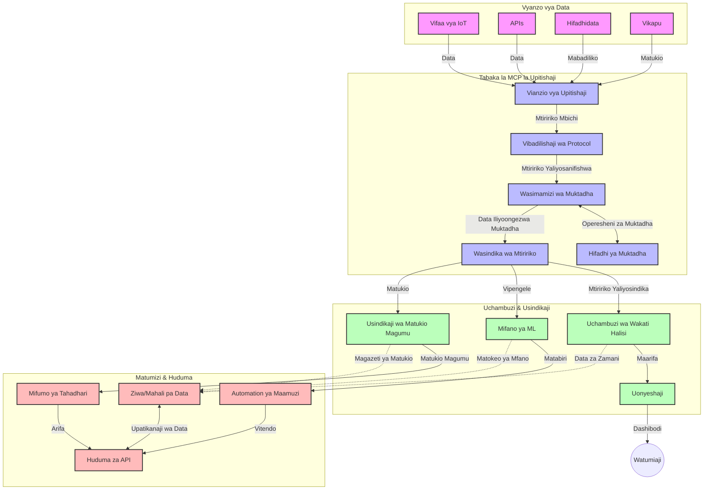

# Protocol ya Muktadha wa Mfano kwa Uenezaji wa Data kwa Wakati Halisi

## Muhtasari

Uenezaji wa data kwa wakati halisi umekuwa muhimu katika dunia ya sasa inayotegemea data, ambapo biashara na programu zinahitaji upatikanaji wa haraka wa taarifa kusaidia kufanya maamuzi ya haraka. Protocol ya Muktadha wa Mfano (MCP) inawakilisha maendeleo makubwa katika kuboresha mchakato huu wa uenezaji wakati halisi, ikibonyeza ufanisi wa usindikaji wa data, kudumisha uhalisia wa muktadha, na kuboresha utendaji wa jumla wa mfumo.

Moduli hii inachunguza jinsi MCP inavyoibadilisha uenezaji wa data kwa wakati halisi kwa kutoa njia ya viwango ya usimamizi wa muktadha kati ya mifano ya AI, majukwaa ya uenezaji, na programu.

## Utangulizi wa Uenezaji wa Data kwa Wakati Halisi

Uenezaji wa data kwa wakati halisi ni mtindo wa kiteknolojia unaowezesha usafirishaji, usindikaji, na uchambuzi wa data inayozalishwa, kuruhusu mifumo kujibu mara moja kwa taarifa mpya. Tofauti na usindikaji wa kundi unaofanya kazi kwenye makundi ya data yaliyotulizwa, uenezaji hufanya usindikaji wa data zinazoendelea, ukitoa maarifa na hatua kwa ucheleweshaji mdogo sana.

### Dhahania Muhimu za Uenezaji wa Data kwa Wakati Halisi:

- **Mtiririko Endelevu wa Data**: Data husindikwa kama mtiririko endelevu usioisha wa matukio au rekodi.
- **Usindikaji wa Ucheleweshaji Mdogo**: Mifumo imeundwa kupunguza muda kati ya uzalishaji wa data na usindikaji wake.
- **Uwezo wa Kuongeza Kiwango**: Miundombinu ya uenezaji lazima iendane na idadi na kasi tofauti za data.
- **Uvumilivu wa Hitilafu**: Mifumo inahitaji kuwa na uwezo wa kuhimili kushindwa ili kuhakikisha mtiririko wa data haukatizwi.
- **Usindikaji wa Kiwango cha Hali**: Kudumisha muktadha kati ya matukio ni muhimu kwa uchambuzi wenye maana.

### Protocol ya Muktadha wa Mfano na Uenezaji kwa Wakati Halisi

Protocol ya Muktadha wa Mfano (MCP) inashughulikia changamoto kadhaa muhimu katika mazingira ya uenezaji kwa wakati halisi:

1. **Mfuatano wa Muktadha**: MCP hurekebisha jinsi muktadha unavyohifadhiwa kati ya vipengele vya uenezaji vilivyoenea, kuhakikisha mifano ya AI na vitu vya usindikaji vina upatikanaji wa muktadha wa kihistoria na mazingira unaohitajika.

2. **Usimamizi wa Hali kwa Ufanisi**: Kwa kutoa mifumo iliyo na muundo wa usambazaji wa muktadha, MCP hupunguza mzigo wa usimamizi wa hali katika mihanda ya uenezaji.

3. **Ushirikiano wa Mifumo**: MCP huanzisha lugha ya pamoja ya kushirikiana muktadha kati ya teknolojia mbalimbali za uenezaji na mifano ya AI, kuruhusu miundombinu inayobadilika na inayopanuka.

4. **Muktadha ulioboreshwa kwa Uenezaji**: Matumizi ya MCP yanaweza kuipa kipaumbele sehemu za muktadha zilizo muhimu zaidi kwa maamuzi ya wakati halisi, kuboresha utendaji na usahihi.

5. **Usindikaji unaobadilika**: Kwa usimamizi mzuri wa muktadha kupitia MCP, mifumo ya uenezaji inaweza kubadilisha usindikaji kulingana na hali na mifumo inayobadilika katika data.

Katika programu za kisasa kuanzia mitandao ya sensor za IoT hadi majukwaa ya biashara za kifedha, muunganiko wa MCP na teknolojia za uenezaji unaruhusu usindikaji wa akili zaidi, unaojua muktadha, na unaweza kujibu ipasavyo kwa hali ngumu, zinazoendelea kwa wakati halisi.

## Malengo ya Kujifunza

Mwisho wa somo hili, utaweza:

- Kuelewa misingi ya uenezaji wa data kwa wakati halisi na changamoto zake
- Eleza jinsi Protocol ya Muktadha wa Mfano (MCP) inavyoboresha uenezaji wa data kwa wakati halisi
- Tekeleza suluhisho za uenezaji zenye MCP kwa kutumia mifumo maarufu kama Kafka na Pulsar
- Buni na tuma miundombinu ya uenezaji iliyo imara, yenye utendaji wa juu kwa MCP
- Tumia dhahania za MCP katika kesi za matumizi za IoT, biashara za kifedha, na uchambuzi unaoendeshwa na AI
- Tathmini mwenendo unaojitokeza na ubunifu wa baadaye katika teknolojia za uenezaji zilizoanzishwa kwa MCP


### Ufafanuzi na Umuhimu

Uenezaji wa data kwa wakati halisi unahusisha uzalishaji endelevu, usindikaji, na utoaji wa data kwa ucheleweshaji mdogo sana. Tofauti na usindikaji wa kundi, ambapo data hukusanywa na kusindikwa kwa makundi, uenezaji wa data hufanyika hatua kwa hatua inapofika, kuruhusu maarifa na hatua za papo hapo.

Sifa kuu za uenezaji wa data kwa wakati halisi ni:

- **Ucheleweshaji Mdogo**: Kusindika na kuchambua data ndani ya milisekunde hadi sekunde
- **Mtiririko Endelevu**: Mtiririko usiokatika wa data kutoka vyanzo mbalimbali
- **Usindikaji wa Mara Moja**: Kuchambua data inavyofika badala ya kwa makundi
- **Miundo ya Kielekezi ya Matukio**: Kujibu matukio yanapotokea

### Changamoto katika Uenezaji wa Data wa Kiasili

Mbinu za jadi za uenezaji wa data zinakutana na changamoto kadhaa:

1. **Kupotea kwa Muktadha**: Ugumu wa kudumisha muktadha kati ya mifumo iliyosambaa
2. **Masuala ya Kuwezesha Ukuaji**: Changamoto katika kuongeza kiwango kushughulikia data yenye kiwango kikubwa na kasi
3. **Uchanganuzi Changamano**: Matatizo ya ushirikiano kati ya mifumo tofauti
4. **Usimamizi wa Ucheleweshaji**: Kulinganisha kati ya uwezo wa kupokea data na muda wa usindikaji
5. **Ulinganifu wa Data**: Kuhakikisha usahihi na ukamilifu wa data katika mtiririko

## Kuelewa Protocol ya Muktadha wa Mfano (MCP)

### MCP ni Nini?

Protocol ya Muktadha wa Mfano (MCP) ni itifaki ya mawasiliano iliyostandadishwa iliyoundwa kuwezesha mwingiliano mzuri kati ya mifano ya AI na programu. Katika muktadha wa uenezaji wa data kwa wakati halisi, MCP hutoa mfumo wa:

- Kuhifadhi muktadha katika mchakato mzima wa usindikaji wa data
- Kuweka viwango vya kubadilishana data
- Kuboresha usafirishaji wa seti kubwa za data
- Kuongeza mawasiliano kati ya modeli na kati ya modeli na programu

### Vifaa Muhimu na Miundombinu

Miundombinu ya MCP kwa uenezaji wa wakati halisi ina vipengele muhimu vifuatavyo:

1. **Wasimamizi wa Muktadha**: Kusimamia na kudumisha taarifa za muktadha kwenye mnyororo wa uenezaji
2. **Wasindikaji wa Mtiririko**: Kusindika mitiririko ya data inayokuja kwa mbinu zinazojua muktadha
3. **Vibadilishaji vya Itifaki**: Kubadilisha kati ya itifaki tofauti za uenezaji huku muktadha ukihifadhiwa
4. **Hifadhi ya Muktadha**: Kuhifadhi na kupata taarifa za muktadha kwa ufanisi
5. **Viunganishi vya Uenezaji**: Kuunganishwa na majukwaa mbalimbali ya uenezaji (Kafka, Pulsar, Kinesis, n.k.)



### MCP Inavyoboresha Usimamizi wa Data kwa Wakati Halisi

MCP inashughulikia changamoto za uenezaji wa jadi kwa:

- **Uhalisia wa Muktadha**: Kudumisha uhusiano kati ya data yaliyopo katika mnyororo mzima
- **Usafirishaji Ulioboreshwa**: Kupunguza kurudia rekodi za kubadilishana data kupitia usimamizi wa muktadha wenye akili
- **Miface Iliyostandadishwa**: Kutoa API yenye mtindo unaoendana kwa vipengele vya uenezaji
- **Kupungua kwa Ucheleweshaji**: Kupunguza mzigo wa usindikaji kwa usimamizi mzuri wa muktadha
- **Kuboresha Uwezo wa Ukuaji**: Kusaidia ongezeko la kawaida sambamba na kudumisha muktadha

## Muunganiko na Utekelezaji

Mifumo ya uenezaji wa data kwa wakati halisi yanahitaji muundo makini wa usanifu na utekelezaji ili kudumisha utendaji kazi na uhalisia wa muktadha. Protocol ya Muktadha wa Mfano hutoa njia za viwango kwa kuunganisha mifano ya AI na teknolojia za uenezaji, kuruhusu mifumo ya uenezaji yenye akili zaidi inayojua muktadha.

### Muhtasari wa Muunganisho wa MCP katika Miundo ya Uenezaji

Kutekeleza MCP katika mazingira ya uenezaji wa wakati halisi kunahusisha mambo muhimu yafuatayo:

1. **Uandikishaji na Usafirishaji wa Muktadha**: MCP hutoa mbinu za ufanisi za kufunga taarifa za muktadha ndani ya vipakuzi vya data vya uenezaji, kuhakikisha muktadha muhimu unafuata data kupitia mnyororo wa usindikaji. Hii ni pamoja na viwango vya usaidizi vilivyodhibitiwa vya uandikishaji vilivyo optimized kwa usafirishaji wa uenezaji.

2. **Usindikaji wa Mtiririko wa Kiwango cha Hali**: MCP inawezesha usindikaji wenye akili zaidi wa hali kwa kudumisha uwakilishi thabiti wa muktadha kati ya vitu vya usindikaji. Hii ni muhimu hasa katika miundo ya usambazaji wa uenezaji ambapo usimamizi wa hali kwa kawaida ni changamoto.

3. **Muda wa Tukio vs. Muda wa Usindikaji**: Matumizi ya MCP katika mifumo ya uenezaji yanapaswa kushughulikia changamoto ya tofauti kati ya wakati tukio lilitokea na wakati linaposindikwa. Protocol inaweza kuingiza muktadha wa muda unaohifadhi maana za muda wa tukio.

4. **Usimamizi wa Backpressure**: Kwa kuweka viwango vya usimamizi wa muktadha, MCP husaidia kusimamia backpressure katika mifumo ya uenezaji, kuruhusu vipengele kuwasiliana uwezo wao wa usindikaji na kubadilisha mtiririko ipasavyo.

5. **Kufifia na Kusanya Muktadha wa Dirisha la Wakati**: MCP hurahisisha operesheni za dirisha kwa kutoa uwakilishi wenye muundo wa muktadha wa muda na wa uhusiano, kuruhusu ukusanyaji wa maana zaidi katika mitiririko ya matukio.

6. **Usindikaji Mapema-Marudio-Pamoja (Exactly-Once Processing)**: Katika mifumo ya uenezaji inayohitaji semantics ya mara moja tu, MCP inaweza kuingiza metadata ya usindikaji kusaidia kufuatilia na kuthibitisha hali ya usindikaji katika vipengele vilivyoenea.

Utekelezaji wa MCP katika teknolojia mbalimbali za uenezaji huunda njia moja ya usimamizi wa muktadha, kupunguza hitaji la nambari za muunganiko maalum huku ikiboresha uwezo wa mfumo kudumisha muktadha wenye maana wakati data inapita kwenye mnyororo.

### MCP katika Mifumo Mbalimbali ya Uenezaji wa Data

Mifano hii inafuata maelezo ya MCP ya sasa inayojikita katika itifaki ya JSON-RPC yenye mbinu tofauti za usafirishaji. Msimbo unaonyesha jinsi unavyoweza kutekeleza usafirishaji maalum unaounganisha majukwaa ya uenezaji kama Kafka na Pulsar huku ukidumisha uzingativu kamili na itifaki ya MCP.

Mifano imeundwa kuonyesha jinsi majukwaa ya uenezaji yanaweza kuunganishwa na MCP kutoa usindikaji wa data kwa wakati halisi huku ukidumisha ufahamu wa muktadha ulioelimishwa ambao ni kiini cha MCP. Njia hii inahakikisha sampuli za msimbo zinaakisi hali ya sasa ya maelezo ya MCP kama ya Juni 2025.

MCP inaweza kuunganishwa na mifumo maarufu ya uenezaji ikijumuisha:

#### Muunganisho wa Apache Kafka

```python
import asyncio
import json
from typing import Dict, Any, Optional
from confluent_kafka import Consumer, Producer, KafkaError
from mcp.client import Client, ClientCapabilities
from mcp.core.message import JsonRpcMessage
from mcp.core.transports import Transport

# Darasa la usafirishaji maalum kuunganisha MCP na Kafka
class KafkaMCPTransport(Transport):
    def __init__(self, bootstrap_servers: str, input_topic: str, output_topic: str):
        self.bootstrap_servers = bootstrap_servers
        self.input_topic = input_topic
        self.output_topic = output_topic
        self.producer = Producer({'bootstrap.servers': bootstrap_servers})
        self.consumer = Consumer({
            'bootstrap.servers': bootstrap_servers,
            'group.id': 'mcp-client-group',
            'auto.offset.reset': 'earliest'
        })
        self.message_queue = asyncio.Queue()
        self.running = False
        self.consumer_task = None
        
    async def connect(self):
        """Connect to Kafka and start consuming messages"""
        self.consumer.subscribe([self.input_topic])
        self.running = True
        self.consumer_task = asyncio.create_task(self._consume_messages())
        return self
        
    async def _consume_messages(self):
        """Background task to consume messages from Kafka and queue them for processing"""
        while self.running:
            try:
                msg = self.consumer.poll(1.0)
                if msg is None:
                    await asyncio.sleep(0.1)
                    continue
                
                if msg.error():
                    if msg.error().code() == KafkaError._PARTITION_EOF:
                        continue
                    print(f"Consumer error: {msg.error()}")
                    continue
                
                # Tafsiri thamani ya ujumbe kama JSON-RPC
                try:
                    message_str = msg.value().decode('utf-8')
                    message_data = json.loads(message_str)
                    mcp_message = JsonRpcMessage.from_dict(message_data)
                    await self.message_queue.put(mcp_message)
                except Exception as e:
                    print(f"Error parsing message: {e}")
            except Exception as e:
                print(f"Error in consumer loop: {e}")
                await asyncio.sleep(1)
    
    async def read(self) -> Optional[JsonRpcMessage]:
        """Read the next message from the queue"""
        try:
            message = await self.message_queue.get()
            return message
        except Exception as e:
            print(f"Error reading message: {e}")
            return None
    
    async def write(self, message: JsonRpcMessage) -> None:
        """Write a message to the Kafka output topic"""
        try:
            message_json = json.dumps(message.to_dict())
            self.producer.produce(
                self.output_topic,
                message_json.encode('utf-8'),
                callback=self._delivery_report
            )
            self.producer.poll(0)  # Chochea wito wa marejeleo
        except Exception as e:
            print(f"Error writing message: {e}")
    
    def _delivery_report(self, err, msg):
        """Kafka producer delivery callback"""
        if err is not None:
            print(f'Message delivery failed: {err}')
        else:
            print(f'Message delivered to {msg.topic()} [{msg.partition()}]')
    
    async def close(self) -> None:
        """Close the transport"""
        self.running = False
        if self.consumer_task:
            self.consumer_task.cancel()
            try:
                await self.consumer_task
            except asyncio.CancelledError:
                pass
        self.consumer.close()
        self.producer.flush()

# Mfano wa matumizi ya usafirishaji wa Kafka MCP
async def kafka_mcp_example():
    # Tengeneza mteja wa MCP kwa usafirishaji wa Kafka
    client = Client(
        {"name": "kafka-mcp-client", "version": "1.0.0"},
        ClientCapabilities({})
    )
    
    # Tengeneza na ungana na usafirishaji wa Kafka
    transport = KafkaMCPTransport(
        bootstrap_servers="localhost:9092",
        input_topic="mcp-responses",
        output_topic="mcp-requests"
    )
    
    await client.connect(transport)
    
    try:
        # Anzisha kikao cha MCP
        await client.initialize()
        
        # Mfano wa kutekeleza chombo kupitia MCP
        response = await client.execute_tool(
            "process_data",
            {
                "data": "sample data",
                "metadata": {
                    "source": "sensor-1",
                    "timestamp": "2025-06-12T10:30:00Z"
                }
            }
        )
        
        print(f"Tool execution response: {response}")
        
        # Kufunga kwa usafi
        await client.shutdown()
    finally:
        await transport.close()

# Endesha mfano
if __name__ == "__main__":
    asyncio.run(kafka_mcp_example())
```

#### Utekelezaji wa Apache Pulsar

```python
import asyncio
import json
import pulsar
from typing import Dict, Any, Optional
from mcp.core.message import JsonRpcMessage
from mcp.core.transports import Transport
from mcp.server import Server, ServerOptions
from mcp.server.tools import Tool, ToolExecutionContext, ToolMetadata

# Unda usafirishaji wa MCP wa kawaida unaotumia Pulsar
class PulsarMCPTransport(Transport):
    def __init__(self, service_url: str, request_topic: str, response_topic: str):
        self.service_url = service_url
        self.request_topic = request_topic
        self.response_topic = response_topic
        self.client = pulsar.Client(service_url)
        self.producer = self.client.create_producer(response_topic)
        self.consumer = self.client.subscribe(
            request_topic,
            "mcp-server-subscription",
            consumer_type=pulsar.ConsumerType.Shared
        )
        self.message_queue = asyncio.Queue()
        self.running = False
        self.consumer_task = None
    
    async def connect(self):
        """Connect to Pulsar and start consuming messages"""
        self.running = True
        self.consumer_task = asyncio.create_task(self._consume_messages())
        return self
    
    async def _consume_messages(self):
        """Background task to consume messages from Pulsar and queue them for processing"""
        while self.running:
            try:
                # Kupokea bila kuzuiliwa na wakati wa kusubiri
                msg = self.consumer.receive(timeout_millis=500)
                
                # Shughulikia ujumbe
                try:
                    message_str = msg.data().decode('utf-8')
                    message_data = json.loads(message_str)
                    mcp_message = JsonRpcMessage.from_dict(message_data)
                    await self.message_queue.put(mcp_message)
                    
                    # Thibitisha ujumbe
                    self.consumer.acknowledge(msg)
                except Exception as e:
                    print(f"Error processing message: {e}")
                    # Kataa uthibitisho ikiwa kulikuwa na hitilafu
                    self.consumer.negative_acknowledge(msg)
            except Exception as e:
                # Shughulikia muda wa kusubiri au makosa mengine
                await asyncio.sleep(0.1)
    
    async def read(self) -> Optional[JsonRpcMessage]:
        """Read the next message from the queue"""
        try:
            message = await self.message_queue.get()
            return message
        except Exception as e:
            print(f"Error reading message: {e}")
            return None
    
    async def write(self, message: JsonRpcMessage) -> None:
        """Write a message to the Pulsar output topic"""
        try:
            message_json = json.dumps(message.to_dict())
            self.producer.send(message_json.encode('utf-8'))
        except Exception as e:
            print(f"Error writing message: {e}")
    
    async def close(self) -> None:
        """Close the transport"""
        self.running = False
        if self.consumer_task:
            self.consumer_task.cancel()
            try:
                await self.consumer_task
            except asyncio.CancelledError:
                pass
        self.consumer.close()
        self.producer.close()
        self.client.close()

# Fafanua chombo cha sampuli cha MCP kinachoshughulikia data inayotiririka
@Tool(
    name="process_streaming_data",
    description="Process streaming data with context preservation",
    metadata=ToolMetadata(
        required_capabilities=["streaming"]
    )
)
async def process_streaming_data(
    ctx: ToolExecutionContext,
    data: str,
    source: str,
    priority: str = "medium"
) -> Dict[str, Any]:
    """
    Process streaming data while preserving context
    
    Args:
        ctx: Tool execution context
        data: The data to process
        source: The source of the data
        priority: Priority level (low, medium, high)
        
    Returns:
        Dict containing processed results and context information
    """
    # Mfano wa usindikaji unaotumia muktadha wa MCP
    print(f"Processing data from {source} with priority {priority}")
    
    # Fikia muktadha wa mazungumzo kutoka MCP
    conversation_id = ctx.conversation_id if hasattr(ctx, 'conversation_id') else "unknown"
    
    # Rejesha matokeo yenye muktadha ulioboreshwa
    return {
        "processed_data": f"Processed: {data}",
        "context": {
            "conversation_id": conversation_id,
            "source": source,
            "priority": priority,
            "processing_timestamp": ctx.get_current_time_iso()
        }
    }

# Mfano wa utekelezaji wa seva ya MCP ukitumia usafirishaji wa Pulsar
async def run_mcp_server_with_pulsar():
    # Unda seva ya MCP
    server = Server(
        {"name": "pulsar-mcp-server", "version": "1.0.0"},
        ServerOptions(
            capabilities={"streaming": True}
        )
    )
    
    # Sajili chombo chetu
    server.register_tool(process_streaming_data)
    
    # Unda na ungana na usafirishaji wa Pulsar
    transport = PulsarMCPTransport(
        service_url="pulsar://localhost:6650",
        request_topic="mcp-requests",
        response_topic="mcp-responses"
    )
    
    try:
        # Anzisha seva kwa usafirishaji wa Pulsar
        await server.run(transport)
    finally:
        await transport.close()

# Endesha seva
if __name__ == "__main__":
    asyncio.run(run_mcp_server_with_pulsar())
```

### Mbinu Bora za Kutoa Huduma

Unapotekeleza MCP kwa uenezaji wa wakati halisi:

1. **Tengeneza Kwa Uvumilivu wa Hitilafu**:
   - Tekeleza udhibiti wa makosa unaofaa
   - Tumia foleni za vikundi vya ujumbe uliofaulu kupita kwa makosa
   - Buni wasindikaji wanaoweza kukimbia mara nyingi bila madhara

2. **Boresha Utendaji**:
   - Pangilia ukubwa sahihi wa buffer
   - Tumia mabatch pale inapofaa
   - Tekeleza mbinu za usimamizi wa backpressure

3. **Angalia na Chunguza**:
   - Fuata vipimo vya usindikaji wa mtiririko
   - Angalia usambazaji wa muktadha
   - Weka onyo la tukio la kimatukio

4. **Linda Mitiririko Yako**:
   - Tekeleza usimbaji fiche kwa data nyeti
   - Tumia uthibitishaji na mamlaka ya ruhusa
   - Weka udhibiti sahihi wa upatikanaji


### MCP Katika IoT na Uenezaji wa Edge

MCP huongeza uenezaji wa IoT kwa:

- Kudumisha muktadha wa kifaa katika mnyororo wa usindikaji
- Kuwezesha uenezaji wa data wenye ufanisi kutoka pembe mpaka wingu
- Kusaidia uchambuzi wa wakati halisi wa mitiririko ya data ya IoT
- Kurahisisha mawasiliano kati ya vifaa kwa kutumia muktadha

Mfano: Mitandao ya Sensor za Mji Mpangilio
```
Sensors → Edge Gateways → MCP Stream Processors → Real-time Analytics → Automated Responses
```

### Nafasi Katika Miamala ya Kifedha na Biashara za Wakati Mfupi

MCP hutoa faida kubwa kwa uenezaji wa data ya kifedha:

- Usindikaji wa ucheleweshaji mdogo sana kwa maamuzi ya biashara
- Kudumisha muktadha wa shughuli kupitia usindikaji mzima
- Kusaidia usindikaji wa matukio changamano na ufahamu wa muktadha
- Kuhakikisha ulinganifu wa data kati ya mifumo ya biashara iliyosambaa

### Kuboresha Uchambuzi wa Data unaoendeshwa na AI

MCP huunda fursa mpya kwa uchambuzi wa uenezaji:

- Mafunzo na tathmini ya modeli kwa wakati halisi
- Kujifunza endelevu kutoka kwa data ya mtiririko
- Utoaji wa vipengele vinavyojua muktadha
- Mifumo ya tathmini ya modeli nyingi yenye muktadha ulihifadhiwa

## Mwenendo wa Baadaye na Ubunifu

### Mageuzi ya MCP Katika Mazingira ya Wakati Halisi

Tukiangalia mbele, tunatarajia MCP itabadilika ili kushughulikia:

- **Muunganiko wa Kompyuta ya Quantum**: Kujiandaa kwa mifumo ya uenezaji inayotumia quantum
- **Usindikaji wa Edge-Native**: Kuhamisha usindikaji unaojua muktadha zaidi kwa vifaa vya pembe
- **Usimamizi wa Mtiririko wa Kujitawala**: Mihanda ya uenezaji inayoboresha yenyewe
- **Uenezaji wa Federated**: Usindikaji ulioenea huku ukihifadhi faragha

### Maboresho yanayoweza Kutokea katika Teknolojia

Teknolojia mpya zitakazoumba MCP ya baadaye:

1. **Itifaki za Uenezaji Zinazoendeshwa na AI**: Itifaki maalum zilizoundwa hasa kwa kazi za AI
2. **Muunganiko wa Kompyuta ya Neuromorphic**: Kompyuta iliyobuniwa kwa mfano wa ubongo kwa usindikaji wa mtiririko
3. **Uenezaji Bila Server**: Uenezaji unaoendeshwa kwa matukio, unaoweza kupanuka bila kusimamia miundombinu
4. **Hifadhi za Muktadha Zilizogawanyika**: Usimamizi wa muktadha ulioenea duniani mzima lakini wenye ulinganifu mkubwa

## Mazoezi ya Vitendo

### Zoeezi 1: Kuweka Msingi wa Mnyororo wa Uenezaji wa MCP

Katika zoezi hili, utajifunza jinsi ya:
- Kupanga mazingira ya msingi ya uenezaji wa MCP
- Kutekeleza wasimamizi wa muktadha kwa usindikaji wa mtiririko
- Kupima na kuthibitisha uhifadhi wa muktadha

### Zoeezi 2: Kujenga Dashibodi ya Uchambuzi wa Wakati Halisi

Tengeneza programu kamili inayofanya:
- Kupokea data za mtiririko kwa kutumia MCP
- Kusindika mtiririko huku muktadha ukidumishwa
- Kuonyesha matokeo kwa wakati halisi

### Zoeezi 3: Kutekeleza Usindikaji wa Matukio Changamano kwa MCP

Zoeezi la juu linalojumuisha:
- Kugundua mifumo katika mitiririko
- Uhusiano wa muktadha kati ya mitiririko mingi
- Kutengeneza matukio changamano yenye muktadha uliohifadhiwa

## Vyanzo Zaidi

- [Model Context Protocol Specification](https://modelcontextprotocol.io) - Maelezo rasmi ya MCP na nyaraka zake
- [Apache Kafka Documentation](https://kafka.apache.org/documentation/) - Jifunze kuhusu Kafka kwa usindikaji wa mtiririko
- [Apache Pulsar](https://pulsar.apache.org/) - Jukwaa la ujumbe na uenezaji lililojumuishwa
- [Streaming Systems: The What, Where, When, and How of Large-Scale Data Processing](https://www.oreilly.com/library/view/streaming-systems/9781491983867/) - Kitabu kamili kuhusu miundo ya uenezaji
- [Microsoft Azure Event Hubs](https://learn.microsoft.com/azure/event-hubs/event-hubs-about) - Huduma ya uenezaji wa tukio iliyosimamiwa
- [MLflow Documentation](https://mlflow.org/docs/latest/index.html) - Kwa ufuatiliaji na usambazaji wa modeli za ML
- [Real-Time Analytics with Apache Storm](https://storm.apache.org/releases/current/index.html) - Mfumo wa usindikaji kwa wingi wa wakati halisi
- [Flink ML](https://nightlies.apache.org/flink/flink-ml-docs-master/) - Maktaba ya mashine ya kujifunza ya Apache Flink
- [LangChain Documentation](https://python.langchain.com/docs/get_started/introduction) - Kujenga programu kwa kutumia LLM

## Matokeo ya Kujifunza

Kwa kumaliza moduli hii, utaweza:

- Kuelewa misingi ya uenezaji wa data kwa wakati halisi na changamoto zake
- Eleza jinsi Protocol ya Muktadha wa Mfano (MCP) inavyoboresha uenezaji wa data kwa wakati halisi
- Tekeleza suluhisho za uenezaji zenye MCP kwa kutumia mifumo maarufu kama Kafka na Pulsar
- Buni na tuma miundombinu ya uenezaji iliyo imara, yenye utendaji wa juu kwa MCP
- Tumia dhahania za MCP katika kesi za matumizi za IoT, biashara za kifedha, na uchambuzi unaoendeshwa na AI
- Tathmini mwenendo unaojitokeza na ubunifu wa baadaye katika teknolojia za uenezaji zilizoanzishwa kwa MCP

## Ifuatayo

- [5.11 Utafutaji wa Wakati Halisi](../mcp-realtimesearch/README.md)

---

<!-- CO-OP TRANSLATOR DISCLAIMER START -->
**Kionyozo**:
Hati hii imetafsiriwa kwa kutumia huduma ya tafsiri ya AI [Co-op Translator](https://github.com/Azure/co-op-translator). Ingawa tunajitahidi kupata usahihi, tafadhali fahamu kwamba tafsiri za kiotomatiki zinaweza kuwa na makosa au upungufu wa usahihi. Hati ya asili katika lugha yake halisi inapaswa kuchukuliwa kama chanzo cha mamlaka. Kwa taarifa muhimu, tafsiri ya kitaalamu inayofanywa na binadamu inapendekezwa. Hatutojibu kwa kuelewa vibaya au tafsiri potofu zinazotokea kutokana na matumizi ya tafsiri hii.
<!-- CO-OP TRANSLATOR DISCLAIMER END -->