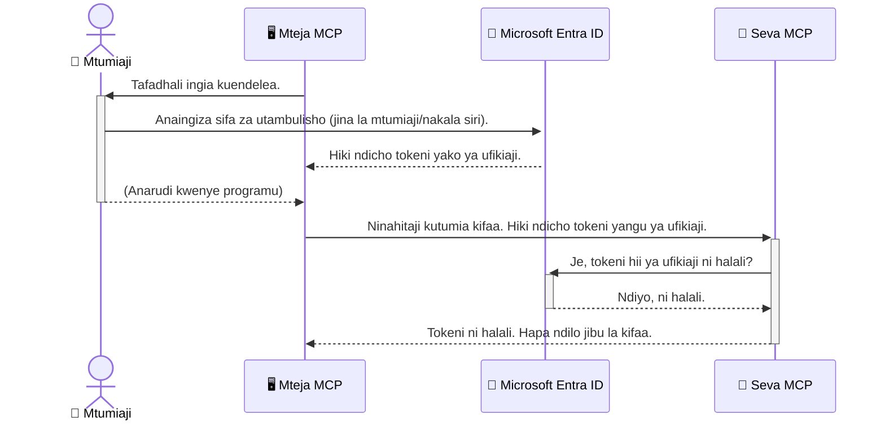

# Kuweka Usalama wa Mipangilio ya AI: Uthibitishaji wa Entra ID kwa Seva za Itifaki ya Muktadha wa Mfano

## Utangulizi
Kuweka usalama kwenye seva yako ya Itifaki ya Muktadha wa Mfano (MCP) ni muhimu kama kufungwa kwa mlango wa mbele wa nyumba yako. Kuacha seva yako ya MCP wazi kunaweka zana na data zako kwenye hatari ya mtu asiyeidhinishwa kufikia, na hii inaweza kusababisha uvunjaji wa usalama. Microsoft Entra ID hutoa suluhisho thabiti la usimamizi wa utambulisho na upatikanaji ulio kwenye wingu, kusaidia kuhakikisha kuwa ni watumiaji na programu zilizoruhusiwa tu ndio wanaweza kuingiliana na seva yako ya MCP. Katika sehemu hii, utajifunza jinsi ya kulinda mipangilio yako ya AI kwa kutumia uthibitishaji wa Entra ID.

## Malengo ya Kujifunza
Mwisho wa sehemu hii, utaweza:

- Kuelewa umuhimu wa kuweka usalama kwa seva za MCP.
- Kuelezea misingi ya Microsoft Entra ID na uthibitishaji wa OAuth 2.0.
- Kutambua tofauti kati ya wateja wa umma na waliosiri.
- Kutekeleza uthibitishaji wa Entra ID katika hali za seva ya MCP za mtaa (mteja wa umma) na mbali (mteja wa siri).
- Kutumia mbinu bora za usalama wakati wa kuendeleza mipangilio ya AI.

## Usalama na MCP

Kama vile hupendi kuacha mlango wa mbele wa nyumba yako ukiwa wazi, hupaswi kuacha seva yako ya MCP wazi kwa mtu yeyote kuipigia upatu. Kuweka usalama kwa mipangilio yako ya AI ni muhimu kwa kujenga programu thabiti, za kuaminika, na salama. Sura hii itakuanzishia matumizi ya Microsoft Entra ID kuhakikisha usalama wa seva zako za MCP, kuhakikisha kuwa ni watumiaji na programu zilizoruhusiwa tu ndio wanaweza kuingiliana na zana na data zako.

## Kwa Nini Usalama Ni Muhimu kwa Seva za MCP

Fikiria seva yako ya MCP ina zana inayoweza kutuma barua pepe au kufikia hifadhidata ya wateja. Seva isiyo na usalama itamaanisha mtu yeyote anaweza kutumia zana hiyo, ikisababisha upatikanaji batili wa data, barua taka, au shughuli nyingine hatarishi.

Kwa kutumia uthibitishaji, unahakikisha kila ombi kwa seva yako linathibitishwa, likithibitisha utambulisho wa mtumiaji au programu inayotoa ombi. Huu ni hatua ya kwanza na muhimu zaidi katika kuweka usalama wa mipangilio yako ya AI.

## Utangulizi wa Microsoft Entra ID

[**Microsoft Entra ID**](https://adoption.microsoft.com/microsoft-security/entra/) ni huduma ya usimamizi wa utambulisho na upatikanaji iliyoko kwenye wingu. Fikiria kama mlinzi wa usalama wa ulimwengu kwa programu zako. Inashughulikia mchakato mgumu wa kuthibitisha utambulisho wa watumiaji (uthibitishaji) na kuamua kile kinachowaruhusu kufanya (idhini).

Kwa kutumia Entra ID, unaweza:

- Kuruhusu kuingia kwa watumiaji kwa usalama.
- Kulinda API na huduma.
- Kusimamia sera za upatikanaji kutoka mahali pa kati.

Kwa seva za MCP, Entra ID hutoa suluhisho thabiti na lenye kuaminika sana kudhibiti nani anaweza kufikia uwezo wa seva yako.

---

## Kuelewa Uchawi: Jinsi Uthibitishaji wa Entra ID Unavyofanya Kazi

Entra ID hutumia viwango wazi kama **OAuth 2.0** kushughulikia uthibitishaji. Ingawa maelezo yanaweza kuwa magumu, dhana kuu ni rahisi na inaweza kueleweka kwa mfano.

### Utangulizi Mpole wa OAuth 2.0: Ufunguo wa Mlezi

Fikiria OAuth 2.0 kama huduma ya mlezi wa gari lako. Unapofika mgahawa, hupati mlezi ufunguo wako mkuu. Badala yake, unampa **ufunguo wa mlezi** ambao una ruhusa za mdogo—unaweza kuwasha gari na kufunga milango, lakini hauwezi kufungua sanduku la mizigo au kofia ya glove.

Katika mfano huu:

- **Wewe** ni **Mtumiaji**.
- **Gari lako** ni **Seva ya MCP** yenye zana na data muhimu.
- **Mlezi** ni **Microsoft Entra ID**.
- **Mhudumu wa Parking** ni **Mteja wa MCP** (programu inayojaribu kufikia seva).
- **Ufunguo wa mlezi** ni **Tokeni ya Upatikanaji**.

Tokeni ya upatikanaji ni mnyororo wa maandishi salama ambao mteja wa MCP anapokea kutoka Entra ID baada ya wewe kuingia. Mteja kisha huonyesha tokeni hii kwa seva ya MCP katika kila ombi. Seva inaweza kuthibitisha tokeni kuhakikisha ombi ni halali na mteja ana ruhusa zinazohitajika, yote bila kuhitaji kushughulikia nywila zako halisi (kama neno lako la siri).

### Mtiririko wa Uthibitishaji

Hivi ndivyo mchakato unavyofanya kazi katika vitendo:



### Utambulisho wa Maktaba ya Uthibitishaji ya Microsoft (MSAL)

Kabla hatujaingia katika msimbo, ni muhimu kuanzisha sehemu muhimu utakayoiona katika mifano: **Maktaba ya Uthibitishaji ya Microsoft (MSAL)**.

MSAL ni maktaba iliyotengenezwa na Microsoft inayofanya iwe rahisi kwa waendelezaji kushughulikia uthibitishaji. Badala yako kuandika msimbo mgumu kushughulikia tokeni za usalama, kusimamia kuingia, na kufufua vikao, MSAL inashughulikia kazi ngumu hii.

Kutumia maktaba kama MSAL kunapendekezwa kwa sababu:

- **Ni Salama:** Inatekeleza itifaki za viwango vya viwandani na mbinu bora za usalama, kupunguza hatari za udhaifu katika msimbo wako.
- **Inarahisisha Maendeleo:** Inaondoa ugumu wa itifaki za OAuth 2.0 na OpenID Connect, ikikuwezesha kuongeza uthibitishaji thabiti kwenye programu yako kwa mistari michache tu ya msimbo.
- **Inadumishwa:** Microsoft inaendelea kudumisha na kusasisha MSAL kukabiliana na vitisho vipya vya usalama na mabadiliko ya jukwaa.

MSAL inaunga mkono lugha nyingi na mifumo ya programu, ikiwa ni pamoja na .NET, JavaScript/TypeScript, Python, Java, Go, na majukwaa ya simu kama iOS na Android. Hii ina maana unaweza kutumia mtindo mmoja wa uthibitishaji katika teknolojia yako yote.

Ili kujifunza zaidi kuhusu MSAL, unaweza kusoma [nyaraka rasmi za muhtasari wa MSAL](https://learn.microsoft.com/entra/identity-platform/msal-overview).

---

## Kuweka Usalama wa Seva Yako ya MCP kwa Entra ID: Mwongozo wa Hatua kwa Hatua

Sasa, tuangalie jinsi ya kuweka usalama kwenye seva ya MCP ya mtaa (inayozungumza kwa `stdio`) kwa kutumia Entra ID. Mfano huu unatumia **mteja wa umma**, unaofaa kwa programu zinazotumia katika mashine ya mtumiaji, kama programu ya desktop au seva ya maendeleo ya mtaa.

### Hali ya Kwanza: Kuweka Usalama wa Seva ya MCP ya Mtaa (na Mteja wa Umma)

Katika hali hii, tutaangalia seva ya MCP inayotekelezwa mtaa, inazungumza kwa `stdio`, na hutumia Entra ID kuthibitisha mtumiaji kabla ya kuruhusu upatikanaji wa zana zake. Seva itakuwa na zana moja inayochukua taarifa za wasifu wa mtumiaji kutoka Microsoft Graph API.

#### 1. Kuweka Programu kwenye Entra ID

Kabla ya kuandika msimbo wowote, unahitaji kusajili programu yako kwenye Microsoft Entra ID. Hii inamjulisha Entra ID kuhusu programu yako na kumpa ruhusa ya kutumia huduma ya uthibitishaji.

1. Tembelea **[mlango wa Microsoft Entra](https://entra.microsoft.com/)**.
2. Nenda kwenye **Usajili wa Programu** na bonyeza **Usajili Mpya**.
3. Weka jina la programu yako (kwa mfano, "Seva Yangu Ya MCP Ya Mtaa").
4. Kwa **Aina za akaunti zinazoungwa mkono**, chagua **Akaunti katika orodha hii ya shirika tu**.
5. Unaweza kuacha **Redirect URI** tupu kwa mfano huu.
6. Bonyeza **Sajili**.

Baada ya kusajili, kumbuka **Kitambulisho cha Programu (client ID)** na **Kitambulisho cha Saraka (tenant ID)**. Utahitaji haya kwenye msimbo wako.

#### 2. Msimbo: Muhtasari

Tazama sehemu muhimu za msimbo zinazoshughulikia uthibitishaji. Msimbo kamili wa mfano huu upo kwenye folda ya [Entra ID - Local - WAM](https://github.com/Azure-Samples/mcp-auth-servers/tree/main/src/entra-id-local-wam) katika [hifadhi ya mcp-auth-servers GitHub](https://github.com/Azure-Samples/mcp-auth-servers).

**`AuthenticationService.cs`**

Darasa hili linahusika kushughulikia mwingiliano na Entra ID.

- **`CreateAsync`**: Hii huanzisha `PublicClientApplication` kutoka MSAL. Imewekwa na `clientId` na `tenantId` ya programu yako.
- **`WithBroker`**: Hii inaruhusu matumizi ya broker (kama Windows Web Account Manager), inayotoa uzoefu salama na rahisi wa kuingia mara moja.
- **`AcquireTokenAsync`**: Hii ni njia kuu. Kwanza hujaribu kupata tokeni kimya kimya (bila mtumiaji kuingia tena ikiwa ana kikao halali). Ikiwa tokeni ya kimya haipatikani, itamuomba mtumiaji aingie kwa njia ya mwingiliano.

```csharp
// Simplified for clarity
public static async Task<AuthenticationService> CreateAsync(ILogger<AuthenticationService> logger)
{
    var msalClient = PublicClientApplicationBuilder
        .Create(_clientId) // Your Application (client) ID
        .WithAuthority(AadAuthorityAudience.AzureAdMyOrg)
        .WithTenantId(_tenantId) // Your Directory (tenant) ID
        .WithBroker(new BrokerOptions(BrokerOptions.OperatingSystems.Windows))
        .Build();

    // ... cache registration ...

    return new AuthenticationService(logger, msalClient);
}

public async Task<string> AcquireTokenAsync()
{
    try
    {
        // Try silent authentication first
        var accounts = await _msalClient.GetAccountsAsync();
        var account = accounts.FirstOrDefault();

        AuthenticationResult? result = null;

        if (account != null)
        {
            result = await _msalClient.AcquireTokenSilent(_scopes, account).ExecuteAsync();
        }
        else
        {
            // If no account, or silent fails, go interactive
            result = await _msalClient.AcquireTokenInteractive(_scopes).ExecuteAsync();
        }

        return result.AccessToken;
    }
    catch (Exception ex)
    {
        _logger.LogError(ex, "An error occurred while acquiring the token.");
        throw; // Optionally rethrow the exception for higher-level handling
    }
}
```

**`Program.cs`**

Hapa ndipo seva ya MCP inaandaliwa na huduma ya uthibitishaji inaingizwa.

- **`AddSingleton<AuthenticationService>`**: Hii inasajili `AuthenticationService` na mtumiaji wa utegemezi, hivyo inaweza kutumika sehemu nyingine za programu (kama zana yetu).
- **Zana ya `GetUserDetailsFromGraph`**: Zana hii inahitaji mfano wa `AuthenticationService`. Kabla haijafanya chochote, huomba tokeni halali kwa kutumia `authService.AcquireTokenAsync()`. Ikiwa uthibitishaji unafanyika, hutumia tokeni hii kupiga API ya Microsoft Graph na kupata maelezo ya mtumiaji.

```csharp
// Simplified for clarity
[McpServerTool(Name = "GetUserDetailsFromGraph")]
public static async Task<string> GetUserDetailsFromGraph(
    AuthenticationService authService)
{
    try
    {
        // This will trigger the authentication flow
        var accessToken = await authService.AcquireTokenAsync();

        // Use the token to create a GraphServiceClient
        var graphClient = new GraphServiceClient(
            new BaseBearerTokenAuthenticationProvider(new TokenProvider(authService)));

        var user = await graphClient.Me.GetAsync();

        return System.Text.Json.JsonSerializer.Serialize(user);
    }
    catch (Exception ex)
    {
        return $"Error: {ex.Message}";
    }
}
```

#### 3. Jinsi Vyote Hufanya Kazi Pamoja

1. Mteja wa MCP anapojaribu kutumia zana ya `GetUserDetailsFromGraph`, zana kwanza huomba `AcquireTokenAsync`.
2. `AcquireTokenAsync` huamsha maktaba ya MSAL kutafuta tokeni halali.
3. Ikiwa hakuna tokeni inayopatikana, MSAL kupitia broker itamwomba mtumiaji aingie kwa akaunti ya Entra ID.
4. Mtumiaji anapoingia, Entra ID hutoa tokeni ya upatikanaji.
5. Zana hupokea tokeni na kuitumia kupiga simu salama kwa Microsoft Graph API.
6. Maelezo ya mtumiaji hurudishwa kwa mteja wa MCP.

Mchakato huu unahakikisha kuwa ni watumiaji waliothibitishwa tu wanaweza kutumia zana hii, kuhakikisha usalama wa seva yako ya MCP ya mtaa.

### Hali ya Pili: Kuweka Usalama wa Seva ya MCP ya Mbali (na Mteja wa Siri)

Seva yako ya MCP ikifuata njia mbali (kama seva ya wingu) na kuwasiliana kwa itifaki kama HTTP Streaming, mahitaji ya usalama ni tofauti. Katika kesi hii, unapaswa kutumia **mteja wa siri** na **Mtiririko wa Msimbo wa Idhini**. Hii ni njia salama zaidi kwa sababu siri za programu hazionyeshwi kwenye kivinjari.

Mfano huu unatumia seva ya MCP iliyotengenezwa kwa TypeScript inayotumia Express.js kushughulikia maombi ya HTTP.

#### 1. Kuweka Programu katika Entra ID

Mazingira ya Entra ID ni kama mteja wa umma, lakini na tofauti moja muhimu: unahitaji kuunda **siri ya mteja (client secret)**.

1. Tembelea **[mlango wa Microsoft Entra](https://entra.microsoft.com/)**.
2. Katika usajili wa programu yako, nenda kwenye kichupo cha **Vyeti na siri**.
3. Bonyeza **Siri mpya ya mteja**, toa maelezo, kisha bonyeza **Ongeza**.
4. **Muhimu:** Nakili thamani ya siri mara moja. Hautaweza kuiona tena.
5. Pia unahitaji kusanidi **Redirect URI**. Nenda kwenye kichupo cha **Uthibitishaji**, bonyeza **Ongeza jukwaa**, chagua **Wavuti**, kisha andika URI ya kugeuzia kwa programu yako (mfano, `http://localhost:3001/auth/callback`).

> **⚠️ Kumbuka Muhimu kuhusu Usalama:** Kwa programu za utengenezaji, Microsoft inapendekeza sana kutumia njia za uthibitishaji zisizo na siri kama **Utambulisho Ulisimamiwa (Managed Identity)** au **Ushirikiano wa Utambulisho wa Mzigo wa Kazi (Workload Identity Federation)** badala ya siri za mteja. Siri za mteja zina hatari za usalama kwani zinaweza kufichuliwa au kuibiwa. Utambulisho ulisimamiwa hutoa njia salama zaidi kwa kuondoa haja ya kuhifadhi nywila kwenye msimbo au usanidi wako.
>
> Kwa maelezo zaidi kuhusu utambulisho ulisimamiwa na jinsi ya kuutekeleza, angalia [Muhtasari wa utambulisho ulisimamiwa kwa rasilimali za Azure](https://learn.microsoft.com/entra/identity/managed-identities-azure-resources/overview).

#### 2. Msimbo: Muhtasari

Mfano huu unatumia njia ya kufuatilia vikao. Mtumiaji anapothibitishwa, seva huhifadhi tokeni ya upatikanaji na tokeni ya kufufua katika kikao na kumpa mtumiaji tokeni ya kikao. Tokeni ya kikao hutumiwa kwa maombi yanayofuata. Msimbo kamili wa mfano huu upo kwenye folda ya [Entra ID - Confidential client](https://github.com/Azure-Samples/mcp-auth-servers/tree/main/src/entra-id-cca-session) katika [hifadhi ya mcp-auth-servers GitHub](https://github.com/Azure-Samples/mcp-auth-servers).

**`Server.ts`**

Faili hii inaandaa seva ya Express na safu ya usafirishaji ya MCP.

- **`requireBearerAuth`**: Hii ni middleware inayolinda vituo vya `/sse` na `/message`. Inakagua kuwepo kwa tokeni halali ya mlangoni (`bearer token`) kwenye kichwa cha `Authorization`.
- **`EntraIdServerAuthProvider`**: Hii ni darasa maalum linalotekeleza interface ya `McpServerAuthorizationProvider`. Linahusika na mchakato wa OAuth 2.0.
- **`/auth/callback`**: Kituo hiki hushughulikia kugeuzwa kutoka Entra ID baada ya mtumiaji kuthibitishwa. Hubadilisha msimbo wa idhini kuwa tokeni ya upatikanaji na tokeni ya kufufua.

```typescript
// Imekadiriwa kwa uwazi
const app = express();
const { server } = createServer();
const provider = new EntraIdServerAuthProvider();

// Linda kiunganishi cha SSE
app.get("/sse", requireBearerAuth({
  provider,
  requiredScopes: ["User.Read"]
}), async (req, res) => {
  // ... ungana na usafirishaji ...
});

// Linda kiunganishi cha ujumbe
app.post("/message", requireBearerAuth({
  provider,
  requiredScopes: ["User.Read"]
}), async (req, res) => {
  // ... shughulikia ujumbe ...
});

// Shughulikia mwito wa OAuth 2.0
app.get("/auth/callback", (req, res) => {
  provider.handleCallback(req.query.code, req.query.state)
    .then(result => {
      // ... shughulikia mafanikio au kushindwa ...
    });
});
```

**`Tools.ts`**

Faili hili linafafanua zana zinazotolewa na seva ya MCP. Zana ya `getUserDetails` ni sawa na ile ya mfano uliopita, lakini hupata tokeni ya upatikanaji kutoka katika kikao.

```typescript
// Imerahisishwa kwa uwazi
server.setRequestHandler(CallToolRequestSchema, async (request) => {
  const { name } = request.params;
  const context = request.params?.context as { token?: string } | undefined;
  const sessionToken = context?.token;

  if (name === ToolName.GET_USER_DETAILS) {
    if (!sessionToken) {
      throw new AuthenticationError("Authentication token is missing or invalid. Ensure the token is provided in the request context.");
    }

    // Pata tokeni ya Entra ID kutoka kwenye hifadhi ya kikao
    const tokenData = tokenStore.getToken(sessionToken);
    const entraIdToken = tokenData.accessToken;

    const graphClient = Client.init({
      authProvider: (done) => {
        done(null, entraIdToken);
      }
    });

    const user = await graphClient.api('/me').get();

    // ... rudisha maelezo ya mtumiaji ...
  }
});
```

**`auth/EntraIdServerAuthProvider.ts`**

Darasa hili linahudumia mantiki ya:

- Kumwelekeza mtumiaji kwenye ukurasa wa kuingia wa Entra ID.
- Kubadilisha msimbo wa idhini kuwa tokeni ya upatikanaji.
- Kuhifadhi tokeni kwenye `tokenStore`.
- Kufufua tokeni ya upatikanaji wakati inapokoma.

#### 3. Jinsi Vyote Hufanya Kazi Pamoja

1. Mtumiaji anapojaribu kuungana kwa mara ya kwanza na seva ya MCP, middleware `requireBearerAuth` itaona kuwa hana kikao halali na kumwelekeza kwenye ukurasa wa kuingia wa Entra ID.
2. Mtumiaji anaingia kwa akaunti yao ya Entra ID.
3. Entra ID inamrudisha mtumiaji tena kwenye mwisho wa `/auth/callback` na msimbo wa idhini.
4. Seva hubadilisha msimbo huo kwa tokeni ya kupata na tokeni ya kuhuisha, huihifadhi, na kuunda tokeni ya kikao ambayo hutumwa kwa mteja.
5. Mteja sasa anaweza kutumia tokeni hii ya kikao kwenye kichwa cha `Authorization` kwa maombi yote yajayo kwa seva ya MCP.
6. Wakati chombo cha `getUserDetails` kinapoitwa, hutumia tokeni ya kikao kutafuta tokeni ya kupata ya Entra ID na kisha hutumia hiyo kuita API ya Microsoft Graph.

Mtiririko huu ni mgumu zaidi kuliko mtiririko wa mteja wa umma, lakini unahitajika kwa njia za mwisho zinazokabili mtandao. Kwa kuwa seva za MCP za mbali zinapatikana kupitia mtandao wa umma, zinahitaji hatua madhubuti za usalama ili kujilinda dhidi ya upatikanaji usioidhinishwa na mashambulizi yanayowezekana.


## Mazoezi Bora ya Usalama

- **Daima tumia HTTPS**: Ficha mawasiliano kati ya mteja na seva ili kulinda tokeni zisishambuliwe.
- **Tekeleza Udhibiti wa Ruhusa kwa Kazi (RBAC)**: Usichunguze tu *ikiwa* mtumiaji ameidhinishwa; chunguza *kitu gani* ana ruhusa cha kufanya. Unaweza kufafanua majukumu katika Entra ID na kuyachunguza kwenye seva yako ya MCP.
- **Fuatilia na hakiki**: Andika matukio yote ya uthibitishaji ili uweze kugundua na kushughulikia shughuli zenye shaka.
- **Dhibiti mipaka ya kiwango na kuchelewesha maombi**: Microsoft Graph na API nyingine zinatekeleza mipaka ya kiwango ili kuzuia matumizi mabaya. Tekeleza kiwango kinachozidi mara kwa mara na mantiki ya jaribio tena katika seva yako ya MCP kushughulikia kwa adabu majibu ya HTTP 429 (Maombi Mengi Sana). Fikiria kuhifadhi data inayotumika mara kwa mara ili kupunguza wito wa API.
- **Hifadhi salama ya tokeni**: Hifadhi tokeni za kupata na tokeni za kuhuisha salama. Kwa programu za ndani, tumia mifumo salama ya kuhifadhi ya mfumo. Kwa programu za seva, fikiria kutumia uhifadhi wa vilichujwa au huduma salama za usimamizi wa funguo kama Azure Key Vault.
- **Shughulikia kumalizika kwa tokeni**: Tokeni za kupata zina maisha ya kikomo. Tekeleza kuhuisha tokeni moja kwa moja kutumia tokeni za kuhuisha ili kudumisha uzoefu sawa wa mtumiaji bila hitaji la kuidhinishwa tena.
- **Fikiria kutumia Azure API Management**: Wakati utekelezaji wa usalama moja kwa moja kwenye seva yako ya MCP unakupa udhibiti wa kina, API Gateways kama Azure API Management zinaweza kushughulikia masuala mengi ya usalama moja kwa moja, ikiwa ni pamoja na uthibitishaji, idhini, mipaka ya kiwango, na ufuatiliaji. Zinatoa tabaka la usalama lililoweka katikati kati ya wateja wako na seva zako za MCP. Kwa maelezo zaidi kuhusu kutumia API Gateways na MCP, ona [Azure API Management Your Auth Gateway For MCP Servers](https://techcommunity.microsoft.com/blog/integrationsonazureblog/azure-api-management-your-auth-gateway-for-mcp-servers/4402690).


## Muhimu Kuu wa Kufahamu

- Kusaliti seva yako ya MCP ni muhimu kwa kulinda data na zana zako.
- Microsoft Entra ID hutoa suluhisho thabiti na inayoweza kupanuka kwa uthibitishaji na idhini.
- Tumia **mteja wa umma** kwa programu za ndani na **mteja wa siri** kwa seva za mbali.
- **Mtiririko wa Msimbo wa Idhini** ni chaguo salama zaidi kwa programu za wavuti.


## Zoef

1. Fikiria kuhusu seva ya MCP unayoweza kuunda. Je, itakuwa seva ya ndani au seva ya mbali?
2. Kwa msingi wa jibu lako, je, ungetumia mteja wa umma au wa siri?
3. Je, seva yako ya MCP ingeomba ruhusa gani kwa kutekeleza hatua dhidi ya Microsoft Graph?


## Mazoezi ya Vitendo

### Zoef 1: Jisajili Programu katika Entra ID
Nenda kwenye lango la Microsoft Entra.  
Jisajili programu mpya kwa seva yako ya MCP.  
Hifadhi Kitambulisho cha Programu (mteja) na Kitambulisho cha Sheria (wapangaji).

### Zoef 2: Linda Seva ya MCP ya Ndani (Mteja wa Umma)
- Fuata mfano wa msimbo kuunganisha MSAL (Maktaba ya Uthibitishaji ya Microsoft) kwa uthibitishaji wa mtumiaji.
- Jaribu mtiririko wa uthibitishaji kwa kuitisha chombo cha MCP kinachovuta maelezo ya mtumiaji kutoka Microsoft Graph.

### Zoef 3: Linda Seva ya MCP ya Mbali (Mteja wa Siri)
- Jisajili mteja wa siri katika Entra ID na unda siri ya mteja.
- Sanidi seva yako ya MCP ya Express.js kutumia Mtiririko wa Msimbo wa Idhini.
- Jaribu njia za mwisho zilizo salama na thibitisha upatikanaji unaotegemea tokeni.

### Zoef 4: Tekeleza Mazoezi Bora ya Usalama
- Wezesha HTTPS kwa seva yako ya ndani au mbali.
- Tekeleza udhibiti wa ruhusa kwa kazi (RBAC) katika mantiki ya seva yako.
- Ongeza shughulikiaji la kumalizika kwa tokeni na uhifadhi salama wa tokeni.

## Vyanzo

1. **Nakala ya Muhtasari wa MSAL**  
   Jifunze jinsi Maktaba ya Uthibitishaji ya Microsoft (MSAL) inavyowezesha upataji wa tokeni salama kati ya majukwaa:  
   [MSAL Overview on Microsoft Learn](https://learn.microsoft.com/en-gb/entra/msal/overview)

2. **Azure-Samples/mcp-auth-servers GitHub Repository**  
   Mifano ya utekelezaji ya seva za MCP zinazoonyesha mtiririko wa uthibitishaji:  
   [Azure-Samples/mcp-auth-servers on GitHub](https://github.com/Azure-Samples/mcp-auth-servers)

3. **Muhtasari wa Vitambulisho Vinavyosimamiwa kwa Rasilimali za Azure**  
   Elewa jinsi ya kuondoa siri kwa kutumia vitambulisho vinavyosimamiwa na mfumo au mtumiaji:  
   [Managed Identities Overview on Microsoft Learn](https://learn.microsoft.com/en-us/entra/identity/managed-identities-azure-resources/)

4. **Azure API Management: Lango Lako la Uthibitishaji kwa Seva za MCP**  
   Ufafanuzi wa kina wa kutumia APIM kama lango salama la OAuth2 kwa seva za MCP:  
   [Azure API Management Your Auth Gateway For MCP Servers](https://techcommunity.microsoft.com/blog/integrationsonazureblog/azure-api-management-your-auth-gateway-for-mcp-servers/4402690)

5. **Rejea ya Ruhusa za Microsoft Graph**  
   Orodha kamili ya ruhusa za dharura na programu za Microsoft Graph:  
   [Microsoft Graph Permissions Reference](https://learn.microsoft.com/zh-tw/graph/permissions-reference)


## Matokeo ya Kujifunza
Baada ya kumaliza sehemu hii, utaweza:

- Eleza kwa nini uthibitishaji ni muhimu kwa seva za MCP na mitiririko ya AI.
- Sanidi na usanidi uthibitishaji wa Entra ID kwa hali za seva ya MCP ya ndani na ya mbali.
- Chagua aina sahihi ya mteja (umma au siri) kulingana na usanidi wa seva yako.
- Tekeleza mbinu bora za usalama wa msimbo, ikiwa ni pamoja na uhifadhi wa tokeni na idhini ya kulingana na kazi.
- Linda seva yako ya MCP na zana zake kutoka kwa upatikanaji usioidhinishwa kwa kujiamini.

## Kinachofuata

- [5.13 Muunganisho wa Itifaki ya Muktadha wa Mfano (MCP) na Microsoft Foundry](../mcp-foundry-agent-integration/README.md)

---

<!-- CO-OP TRANSLATOR DISCLAIMER START -->
**Kionyozo**:
Hati hii imetafsiriwa kwa kutumia huduma ya tafsiri ya AI [Co-op Translator](https://github.com/Azure/co-op-translator). Ingawa tunajitahidi kupata usahihi, tafadhali fahamu kwamba tafsiri za kiotomatiki zinaweza kuwa na makosa au upungufu wa usahihi. Hati ya asili katika lugha yake halisi inapaswa kuchukuliwa kama chanzo cha mamlaka. Kwa taarifa muhimu, tafsiri ya kitaalamu inayofanywa na binadamu inapendekezwa. Hatutojibu kwa kuelewa vibaya au tafsiri potofu zinazotokea kutokana na matumizi ya tafsiri hii.
<!-- CO-OP TRANSLATOR DISCLAIMER END -->