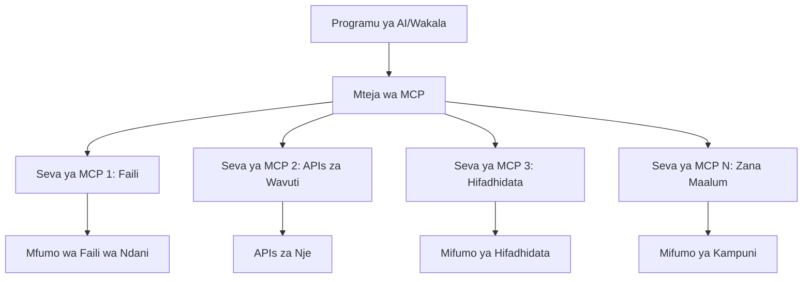

# 🌐 Moduli 2: MCP na Misingi ya Microsoft Foundry Toolkit

[]()
[]()
[]()

## 📋 Malengo ya Kujifunza

Mwisho wa moduli hii, utaweza:
- ✅ Kuelewa usanifu na faida za Model Context Protocol (MCP)
- ✅ Kuchunguza mfumo wa seva wa MCP wa Microsoft
- ✅ Kuunganisha seva za MCP na Microsoft Foundry Toolkit Agent Builder
- ✅ Kujenga wakala wa otomatiki wa kivinjari kwa kutumia Playwright MCP
- ✅ Kusanidi na kupima zana za MCP ndani ya maajenti yako
- ✅ Kusafirisha na kupeleka maajenti yanayoendeshwa na MCP kwa matumizi ya uzalishaji

## 🎯 Kujenga juu ya Moduli 1

Katika Moduli 1, tulijifunza misingi ya Microsoft Foundry Toolkit na kuunda Wakala wetu wa Kwanza wa Python. Sasa tuta**boresha** maajenti yako kwa kuziunganisha na zana za nje na huduma kupitia **Model Context Protocol (MCP)** inayoleta mapinduzi.

Fikiria kama kuboresha kutoka kwa kalkuleta ya kawaida hadi kompyuta kamili - maajenti yako ya AI yataweza:
- 🌐 Kuviangalia na kuingiliana na tovuti
- 📁 Kufikia na kusimamia faili
- 🔧 Kuunganisha na mifumo ya biashara
- 📊 Kusindikiza data ya wakati halisi kutoka kwa APIs

## 🧠 Kuelewa Model Context Protocol (MCP)

### 🔍 MCP ni Nini?

Model Context Protocol (MCP) ni **"USB-C kwa matumizi ya AI"** - kiwango wazi la mapinduzi linalounganisha Mifano Mikubwa ya Lugha (LLMs) na zana za nje, vyanzo vya data, na huduma. Kama USB-C ilivyoondoa machafuko ya nyaya kwa kutoa kiunganishi kimoja cha umoja, MCP huondoa ugumu wa kuunganisha AI kwa itifaki moja iliyowekwa.

### 🎯 Tatizo Linalotatuliwa na MCP

**Kabla ya MCP:**
- 🔧 Uunganishaji maalum kwa kila zana
- 🔄 Kuingiliwa na muuzaji kwa suluhisho za kipekee  
- 🔒 Udhaifu wa usalama kutokana na muunganisho wa maajenti
- ⏱️ Miezi ya maendeleo kwa uunganishaji wa msingi

**Kwa MCP:**
- ⚡ Uunganishaji wa zana kwa kirahisi na kuanza kuitumia mara moja
- 🔄 Usanifu usio tegemea muuzaji
- 🛡️ Mazoezi bora ya usalama yaliyojumuishwa
- 🚀 Dakika chache kuongezea uwezo mpya

### 🏗️ Undani wa Usanifu wa MCP

MCP hufuata **usanifu wa mteja-seva** unaounda mfumo salama, unaoweza kupanuka:



**🔧 Vipengele Muhimu:**

| Kipengele | Wadhifa | Mifano |
|-----------|---------|---------|
| **Seva za MCP** | Programu zinazotumia huduma za MCP | Claude Desktop, VS Code, Microsoft Foundry Toolkit |
| **Wateja wa MCP** | Washughulikiaji wa itifaki (1:1 na seva) | Imejumuishwa katika programu za mwenyeji |
| **Venyekiti vya MCP** | Huonyesha uwezo kupitia itifaki ya kawaida | Playwright, Files, Azure, GitHub |
| **Tabaka la Usafirishaji** | Njia za mawasiliano | stdio, HTTP, WebSockets |


## 🏢 Mfumo wa Seva za MCP wa Microsoft

Microsoft inaongoza mfumo wa MCP na mkusanyiko kamili wa seva za kiwango cha biashara zinazoshughulikia mahitaji halisi ya biashara.

### 🌟 Seva za MCP za Microsoft Butu Wazuri

#### 1. ☁️ Seva ya Azure MCP
**🔗 Hazina**: [azure/azure-mcp](https://github.com/azure/azure-mcp)
**🎯 Kusudi**: Usimamizi mpana wa rasilimali za Azure kwa ujumuishaji wa AI

**✨ Vipengele Muhimu:**
- Usambazaji wa miundombinu kwa njia ya tamko
- Ufuatiliaji wa rasilimali kwa wakati halisi
- Mapendekezo ya kuboresha gharama
- Ukaguzi wa ufuataji wa usalama

**🚀 Matumizi:**
- Miundombinu kama Code kwa msaada wa AI
- Ukuaji wa rasilimali kwa njia ya kiotomatiki
- Kuboresha gharama za wingu
- Otomatiki ya mchakato wa DevOps

#### 2. 📊 Microsoft Dataverse MCP
**📚 Nyaraka**: [Microsoft Dataverse Integration](https://go.microsoft.com/fwlink/?linkid=2320176)
**🎯 Kusudi**: Kiolesura cha lugha asilia kwa data za biashara

**✨ Vipengele Muhimu:**
- Maswali ya hifadhidata kwa lugha asilia
- Kuelewa muktadha wa biashara
- Violezo vya kibinafsi vya maagizo
- Usimamizi wa data za biashara

**🚀 Matumizi:**
- Ripoti za ujasiriamali wa biashara
- Uchambuzi wa data za wateja
- Maarifa ya mchakato wa mauzo
- Maswali ya ufuataji wa utendaji

#### 3. 🌐 Seva ya Playwright MCP
**🔗 Hazina**: [microsoft/playwright-mcp](https://github.com/microsoft/playwright-mcp)
**🎯 Kusudi**: Otomatiki ya kivinjari na uwezo wa kuingiliana na wavuti

**✨ Vipengele Muhimu:**
- Otomatiki kwa vivinjari vingi (Chrome, Firefox, Safari)
- Ugunduzi wa vitu kwa werevu
- Uzalishaji picha na PDF
- Ufuatiliaji wa trafiki ya mtandao

**🚀 Matumizi:**
- Mchakato za vipimo vya kiotomatiki
- Kuchambua data za wavuti kwa kukusanya taarifa
- Ufuatiliaji wa UI/UX
- Otomatiki ya uchambuzi wa ushindani

#### 4. 📁 Seva ya Files MCP
**🔗 Hazina**: [microsoft/files-mcp-server](https://github.com/microsoft/files-mcp-server)
**🎯 Kusudi**: Uendeshaji wa mfumo wa faili kwa werevu

**✨ Vipengele Muhimu:**
- Usimamizi wa faili kwa njia ya tamko
- Ulinganifu wa maudhui
- Ujumuishaji wa udhibiti wa matoleo
- Utoaji wa metadata

**🚀 Matumizi:**
- Usimamizi wa nyaraka
- Kuandaa hazina ya msimbo
- Mchakato wa kuchapisha maudhui
- Utunzaji wa faili za mchakato wa data

#### 5. 📝 Seva ya MarkItDown MCP
**🔗 Hazina**: [microsoft/markitdown](https://github.com/microsoft/markitdown)
**🎯 Kusudi**: Usindikaji na usimamizi wa Markdown wa hali ya juu

**✨ Vipengele Muhimu:**
- Uchanganuzi wa Markdown wa kina
- Ubadilishaji wa muundo (MD ↔ HTML ↔ PDF)
- Uchambuzi wa muundo wa maudhui
- Usindikaji wa templeti

**🚀 Matumizi:**
- Mchakato wa nyaraka za kiufundi
- Mifumo ya usimamizi wa maudhui
- Uzalishaji wa ripoti
- Otomatiki ya hifadhi ya maarifa

#### 6. 📈 Seva ya Clarity MCP
**📦 Kifurushi**: [@microsoft/clarity-mcp-server](https://www.npmjs.com/package/@microsoft/clarity-mcp-server)
**🎯 Kusudi**: Tathmini za wavuti na maarifa ya tabia za watumiaji

**✨ Vipengele Muhimu:**
- Uchambuzi wa data za heatmap
- Upigaji picha wa vipindi vya mtumiaji
- Vipimo vya utendaji
- Uchambuzi wa mfereji wa uongozaji

**🚀 Matumizi:**
- Kuboresha tovuti
- Utafiti wa uzoefu wa mtumiaji
- Uchambuzi wa mtihani wa A/B
- Dashibodi za ujasiriamali wa biashara

### 🌍 Mfumo wa Jumuiya

Mbali na seva za Microsoft, mfumo wa MCP unajumuisha:
- **🐙 GitHub MCP**: Usimamizi wa hazina na uchambuzi wa msimbo
- **🗄️ MCPs za Hifadhidata**: Ujumuishaji wa PostgreSQL, MySQL, MongoDB
- **☁️ MCPs za Watoa Huduma wa Wingu**: Zana za AWS, GCP, Digital Ocean
- **📧 MCPs za Mawasiliano**: Ujumuishaji wa Slack, Teams, Barua pepe

## 🛠️ Maabara ya Vitendo: Kujenga Wakala wa Otomatiki wa Kivinjari

**🎯 Lengo la Mradi**: Kuunda wakala mkamilifu wa otomatiki wa kivinjari kwa kutumia seva ya Playwright MCP inayoweza kuvinjari tovuti, kutoa taarifa, na kufanya mwingiliano ngumu wa wavuti.

### 🚀 Awamu ya 1: Kuanzisha Wakala Wako

#### Hatua 1: Anzisha Wakala Wako
1. **Fungua Microsoft Foundry Toolkit Agent Builder**
2. **Unda Wakala Mpya** na usanidi wa ifuatayo:
   - **Jina**: `BrowserAgent`
   - **Mfano**: Chagua GPT-4o 


### 🔧 Awamu ya 2: Mchakato wa Ujumuishaji MCP

#### Hatua 3: Ongeza Ujumuishaji wa Seva ya MCP
1. **Nenda kwenye Sehemu za Zana** katika Agent Builder
2. **Bofya "Add Tool"** kufungua menyu ya ujumuishaji
3. **Chagua "MCP Server"** kutoka kwa chaguzi zinazopatikana


**🔍 Kuelewa Aina za Zana:**
- **Zana Zilizojumuishwa**: Kazi za Microsoft Foundry Toolkit zilizo tayari
- **Seva za MCP**: Ujumuishaji wa huduma za nje
- **API Zilizobinafsishwa**: Vituo vyako vya huduma
- **Kupiga Simu ya Kazi**: Ufikiaji wa moja kwa moja kwa kazi za mfano

#### Hatua 4: Uchaguzi wa Seva ya MCP
1. **Chagua "MCP Server"** kuendelea


2. **Tazama Katalogi ya MCP** kuchunguza ujumuishaji unaopatikana


### 🎮 Awamu ya 3: Usanidi wa Playwright MCP

#### Hatua 5: Chagua na Sanidi Playwright
1. **Bofya "Use Featured MCP Servers"** kufikia seva zilizoidhinishwa na Microsoft
2. **Chagua "Playwright"** kutoka orodha iliyochaguliwa
3. **Kubali MCP ID ya Kawaida** au ubinafsishe kwa mazingira yako


#### Hatua 6: Wezesha Uwezo wa Playwright
**🔑 Hatua Muhimu**: Chagua **MBILI** njia zote za Playwright kwa utendaji kamili


**🛠️ Zana Muhimu za Playwright:**
- **Kuenda**: `goto`, `goBack`, `goForward`, `reload`
- **Mwingiliano**: `click`, `fill`, `press`, `hover`, `drag`
- **Utoaji**: `textContent`, `innerHTML`, `getAttribute`
- **Uthibitishaji**: `isVisible`, `isEnabled`, `waitForSelector`
- **Kukamata**: `screenshot`, `pdf`, `video`
- **Mtandao**: `setExtraHTTPHeaders`, `route`, `waitForResponse`

#### Hatua 7: Thibitisha Mafanikio ya Ujumuishaji
**✅ Viashiria vya Mafanikio:**
- Zana zote zinaonekana kwenye kiolesura cha Agent Builder
- Hakuna ujumbe wa kosa kwenye jopo la ujumuishaji
- Hali ya seva ya Playwright inaonyesha "Connected"


**🔧 Utatuzi wa Tatizo za Kawaida:**
- **Muunganisho Umekatika**: Hakikisha muunganisho wa mtandao na mipangilio ya firewall
- **Zana Zimekosekana**: Hakikisha uwezo wote walichaguliwa wakati wa usanidi
- **Makosa ya Ruhusa**: Hakikisha VS Code ina ruhusa muhimu za mfumo

### 🎯 Awamu ya 4: Uhandisi wa Maagizo ya Juu

#### Hatua 8: Buni Maagizo Mwerevu ya Mfumo
Tengeneza maagizo tata yanayotumia uwezo wa Playwright kwa ukamilifu:

```markdown
# Web Automation Expert System Prompt

## Core Identity
You are an advanced web automation specialist with deep expertise in browser automation, web scraping, and user experience analysis. You have access to Playwright tools for comprehensive browser control.

## Capabilities & Approach
### Navigation Strategy
- Always start with screenshots to understand page layout
- Use semantic selectors (text content, labels) when possible
- Implement wait strategies for dynamic content
- Handle single-page applications (SPAs) effectively

### Error Handling
- Retry failed operations with exponential backoff
- Provide clear error descriptions and solutions
- Suggest alternative approaches when primary methods fail
- Always capture diagnostic screenshots on errors

### Data Extraction
- Extract structured data in JSON format when possible
- Provide confidence scores for extracted information
- Validate data completeness and accuracy
- Handle pagination and infinite scroll scenarios

### Reporting
- Include step-by-step execution logs
- Provide before/after screenshots for verification
- Suggest optimizations and alternative approaches
- Document any limitations or edge cases encountered

## Ethical Guidelines
- Respect robots.txt and rate limiting
- Avoid overloading target servers
- Only extract publicly available information
- Follow website terms of service
```

#### Hatua 9: Tengeneza Maagizo ya Mtumiaji yenye Mabadiliko
Buni maagizo yanayoonyesha uwezo mbalimbali:

**🌐 Mfano wa Uchambuzi wa Wavuti:**
```markdown
Navigate to github.com/kinfey and provide a comprehensive analysis including:
1. Repository structure and organization
2. Recent activity and contribution patterns  
3. Documentation quality assessment
4. Technology stack identification
5. Community engagement metrics
6. Notable projects and their purposes

Include screenshots at key steps and provide actionable insights.
```


### 🚀 Awamu ya 5: Utekelezaji na Upimaji

#### Hatua 10: Endesha Otomatiki Yako ya Kwanza
1. **Bofya "Run"** kuanzisha mfululizo wa otomatiki
2. **Simamia Utendaji wa Muda Halisi**:
   - Kivinjari cha Chrome kinaanzishwa kiotomati
   - Wakala anaelekeza kwenye tovuti lengwa
   - Picha zinakamatiwa kila hatua kuu
   - Matokeo ya uchambuzi hutiririka kwa muda halisi


#### Hatua 11: Chunguza Matokeo na Maarifa
Angalia uchambuzi kamili kwenye kiolesura cha Agent Builder:


### 🌟 Awamu ya 6: Uwezo wa Juu na Upeleka

#### Hatua 12: Hamisha na Peleka Kwenye Uzalishaji
Agent Builder inaunga mkono chaguzi mbalimbali za upeleka:


## 🎓 Muhtasari wa Moduli 2 & Hatua Zifuatazo

### 🏆 Mafanikio Yamefikishwa: Mtaalamu wa Ujumuishaji MCP

**✅ Ujuzi Uliyopata:**
- [ ] Kuelewa usanifu na faida za MCP
- [ ] Kuiga mfumo wa seva wa MCP wa Microsoft
- [ ] Kuunganisha Playwright MCP na Microsoft Foundry Toolkit
- [ ] Kujenga maajenti makali ya otomatiki ya kivinjari
- [ ] Uhandisi wa maagizo ya hali ya juu kwa otomatiki ya wavuti

### 📚 Rasilimali Zaidi

- **🔗 Maelezo ya MCP**: [Nyaraka Rasmi ya Itifaki](https://modelcontextprotocol.io/)
- **🛠️ API ya Playwright**: [Rejea Kamili ya Mbinu](https://playwright.dev/docs/api/class-playwright)
- **🏢 Seva za MCP za Microsoft**: [Mwongozo wa Ujumuishaji wa Biashara](https://github.com/microsoft/mcp-servers)
- **🌍 Mifano ya Jumuiya**: [Ghala la Seva za MCP](https://github.com/modelcontextprotocol/servers)

**🎉 Hongera!** Umefanikiwa kuwa mtaalamu wa ujumuishaji MCP na sasa unaweza kujenga maajenti ya AI tayari kwa uzalishaji yenye uwezo wa kutumia zana za nje!


### 🔜 Endelea kwa Moduli Ifuatayo

Ume tayari kupeleka ujuzi wako wa MCP hatua nyingine? Endelea kwa **[Moduli 3: Uendelezaji wa MCP wa Juu na Microsoft Foundry Toolkit](../lab3/README.md)** ambapo utajifunza jinsi ya:
- Kuunda seva zako binafsi za MCP
- Kusanidi na kutumia toleo la hivi karibuni la MCP Python SDK
- Kuanzisha MCP Inspector kwa madhumuni ya utatuzi
- Kuongeza uelewa wa mchakato wa maendeleo ya seva za MCP
- Kujenga Seva ya MCP ya Hali ya Hewa kutoka mwanzo

---

<!-- CO-OP TRANSLATOR DISCLAIMER START -->
**Kionyozo**:
Hati hii imetafsiriwa kwa kutumia huduma ya tafsiri ya AI [Co-op Translator](https://github.com/Azure/co-op-translator). Ingawa tunajitahidi kupata usahihi, tafadhali fahamu kwamba tafsiri za kiotomatiki zinaweza kuwa na makosa au upungufu wa usahihi. Hati ya asili katika lugha yake halisi inapaswa kuchukuliwa kama chanzo cha mamlaka. Kwa taarifa muhimu, tafsiri ya kitaalamu inayofanywa na binadamu inapendekezwa. Hatutojibu kwa kuelewa vibaya au tafsiri potofu zinazotokea kutokana na matumizi ya tafsiri hii.
<!-- CO-OP TRANSLATOR DISCLAIMER END -->