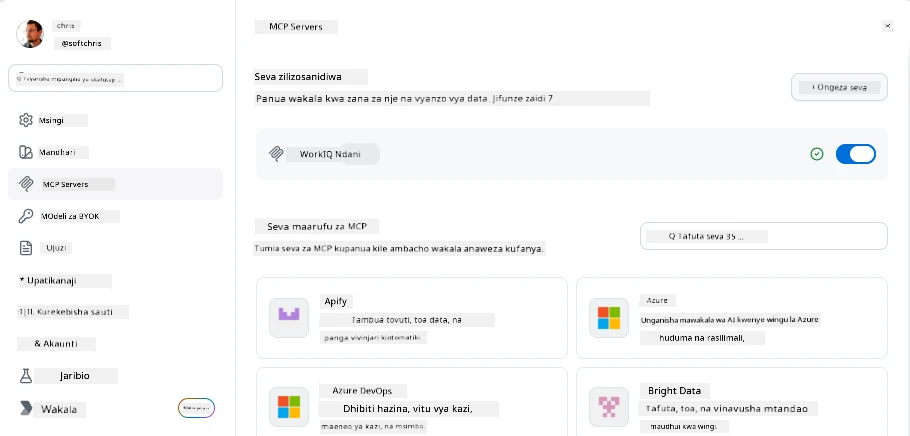
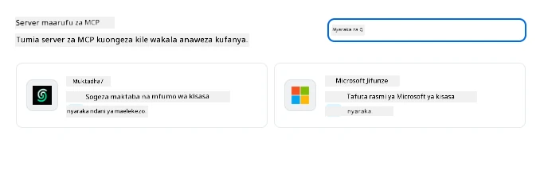
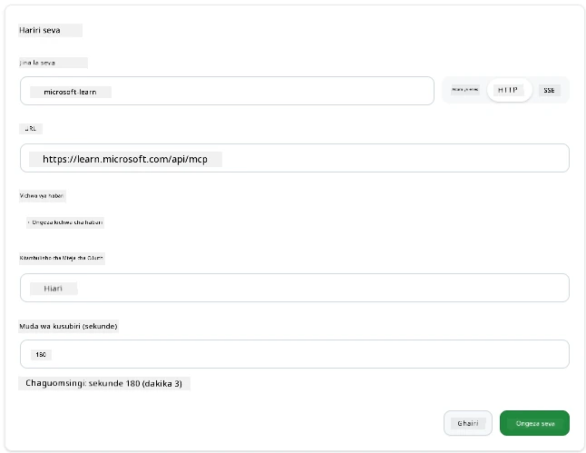
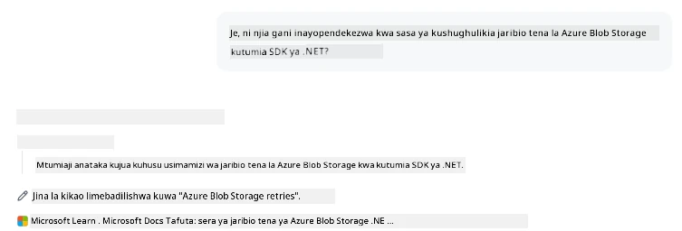
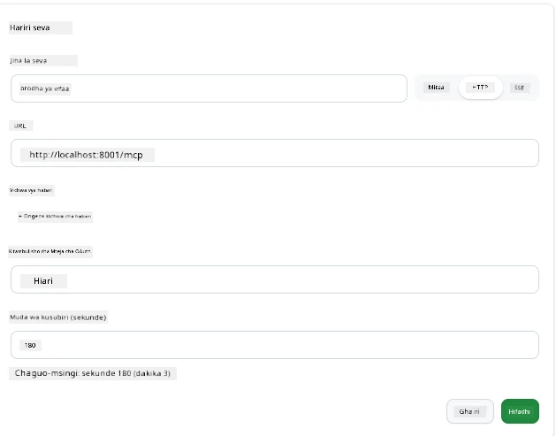
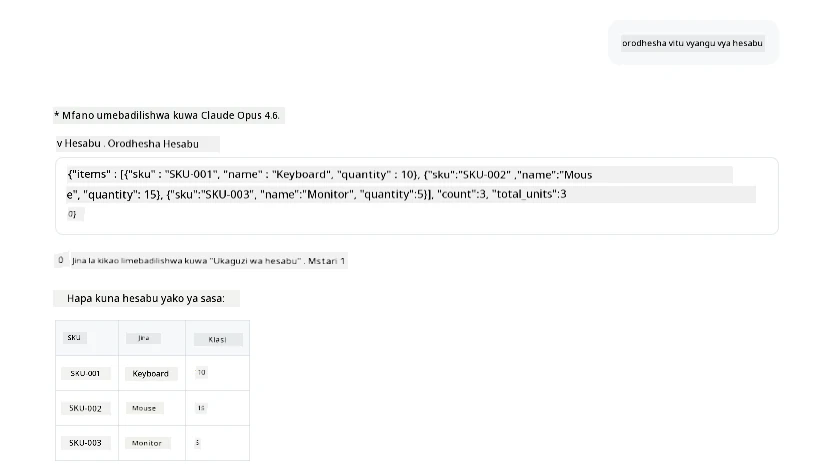
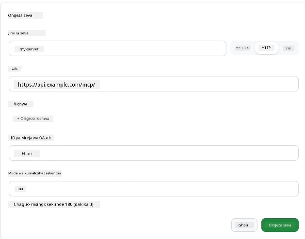
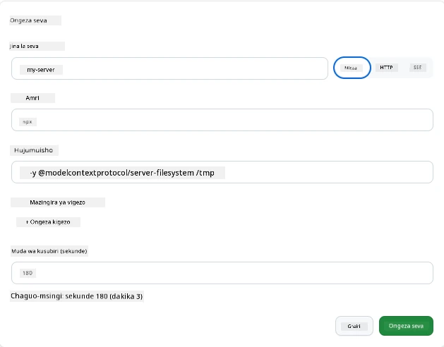

# Kutumia Seva za MCP katika Programu ya GitHub Copilot

Hadi sasa unajua jinsi MCP inavyofanya kazi. Umejenga seva, kufafanua zana na rasilimali, na kuunganisha wateja. Kile ambacho bado hatujafanya ni kubadilisha mtazamo: badala ya wewe kuwa yule anayeijenga seva, inaonekanaje kuwa upande wa *kutumia*—kama mtumiaji wa programu inayotumia AI inayounga mkono MCP?

[GitHub Copilot App](https://github.com/github/app) ni programu ya mezani inayoweza kutumia Seva za MCP. Kwa kuunganisha seva za MCP nayo, unafungua ngazi mpya: Copilot sasa inaweza kufikia nyaraka zako, kuita API zako za ndani, kuuliza hifadhidata yako, au kuzungumza na huduma yoyote uliyofunga katika seva. Programu inakuwa mwenyeji; seva zako za MCP zinakuwa zana zake.

Somo hili linakupeleka kupitia uzoefu huo kutoka mwanzo hadi mwisho—kuanzia kupata paneli ya mipangilio ya MCP hadi kuunganisha seva halisi ya nyaraka na kisha kuunganisha seva ya desturi yako mwenyewe.

## Malengo ya Kujifunza

Mwisho wa somo hili, utaweza:

- Kupata na kuvinjari paneli ya Seva za MCP katika mipangilio ya Programu ya Copilot.
- Kuunganisha seva ya nyaraka inayohudumiwa na kuitumia katika kikao.
- Kusajili seva ya desturi na kuthibitisha Copilot inaweza kuitisha zana zake.
- Kusanidi jinsi seva inavyotakiwa kuitwa kwa kutoa vigezo vya mazingira au vichwa vya desturi (ikiwa ni HTTP)

## Programu ya Copilot kama Mwenyeji wa MCP

Hii ndiyo wazo msingi: **mawakala wa Copilot ni werevu, lakini wanajua tu kile unachowaambia.** Kwa chaguo-msingi, wakala anaweza kusoma faili katika eneo lako la kazi na kuendesha amri za terminal, lakini hawezi kuuliza hifadhidata yako, kuangalia kalenda yako, au kuita API ya desturi bila msaada. Hapo ndipo seva za MCP zinapokuja. Zinatumika kama madaraja kati ya Copilot na mifumo yako—hifadhidata, udhibiti wa toleo, API, zana za muundo—kuzawadia mawakala ufikiaji wa taarifa na vitendo wanavyohitaji kukamilisha kazi.

Tuanze kwa kupata mipangilio hiyo ya kusimamia Seva zako za MCP.

## Hatua ya 1: Kupata Paneli ya Mipangilio ya MCP

Fungua Programu ya Copilot na patilia alama ya gia chini-kushoto kisha bonyeza.


Hakikisha umechagua "MCP Servers" na sasa unapaswa kuona seva zako zilizo tayari kusanidiwa juu, soko la seva maarufu chini, na kitufe cha "Add Server" juu kama ifuatavyo:



Hii ni kituo chako cha udhibiti. Unaongeza, kuondoa, kuwezesha, na kuzima seva hapa. Mabadiliko yataanza kufanya kazi kwa vikao vipya; ikiwa una kikao kilicho wazi, itabidi uanze kipya baada ya kubadilisha orodha hii.

## Hatua ya 2: Kuunganisha Seva ya Nyaraka

Tufanye kitu kinachotumika mara moja. Seva ya Microsoft Docs MCP inampa Copilot ufikiaji wa nyaraka rasmi za Microsoft. Hii ni pamoja na Azure, .NET, TypeScript, na zaidi. Badala ya wakala kutegemea data yake ya mafunzo (ambayo ina tarehe ya mwisho), anaweza kuvuta nyaraka za sasa wakati wa kuuliza.

Hapa ni jinsi ya kuiongeza:

1. Katika gridi ya seva maarufu, andika **learn** na chagua seva inayoitwa "Microsoft Learn".

   

   Mara ukibonyeza, inakuonesha fomu ambapo jina, aina ya usafirishaji na URL vimejazwa awali, unachohitaji ni kubonyeza "Add Server".

2. Bonyeza "Add Server", inapaswa kuchukua sekunde chache kuungana na seva.

   

   Imeongezwa, inapaswa kuonekana katika eneo la juu kama seva iliyosanidiwa. Tujaribu sasa.

3. Funga kidirisha na chagua Quick chat.

4. Andika ombi lililo hapa chini ili kuanzisha zana kwenye seva ya Microsoft Learn.

   ```text
   What's the current recommended approach for handling Azure Blob Storage 
   retries using the .NET SDK?
   ```

   

Unapaswa kuona jinsi inavyoelekeza kwenye Seva ya MCP tuliyoiongeza sasa hivi.

## Hatua ya 3: Kuunganisha Seva ya stdio ya Desturi

Mipangilio ni rahisi, lakini nguvu halisi ni kuunganisha seva zako mwenyewe. Tuseme umejenga seva (au umepewa moja) inayofungua API yako ya ndani au msingi wa maarifa wa kampuni. Katika kesi hii, tutatumia Seva ya MCP tuliyoijenga inayoshughulikia usimamizi wa hesabu za kampuni yetu.

1. Bonyeza gia tena na chagua "MCP servers".

2. Chagua kitufe cha "Add Server" kisha "+ Add Custom server", na toa thamani zifuatazo:

   - Jina: `Inventory Server`
   - Chagua usafirishaji (kushoto), **http**

   Chagua "Add Server" na inapaswa kuonekana katika orodha yako ya seva zilizosanidiwa.

   

4. Kuijaribu, endesha ombi kama ifuatavyo:

    ```
    list inventory
    ```

   

   Sasa unapaswa kuona orodha ya vitu vya hesabu vinavyorejeshwa kutoka kwa seva yako ya desturi uliyojenga.

Nzuri, sasa unapaswa kuwa na uelewa mzuri wa kuongeza seva za nje pamoja na zako mwenyewe za MCP kwa Programu ya Copilot. Sasa, tuzungumze kuhusu kushughulikia siri na vigezo vya mazingira.

## Hatua ya 4: Mipangilio ya Juu

Hadi sasa, umeona jinsi ya kuongeza Seva za MCP ambapo unatoa tu jina na URL. Lakini seva yako inahitaji funguo ya API au thamani nyingine? Kweli, kulingana na aina ya usafirishaji, tunaweza kuipatia kilichohitaji.

- **usafirishaji wa http au SSE**: Hapa tunaweza kuweka vichwa vya habari kama vinavyohitajika.

   Kwa uthibitishaji, unaweza kubainisha kichwa cha Authorization, kwa mfano. Thamani inaweza kuwa kamba ya kudumu. Ikiwa unatumia OAuth, badala yake unaweza kumpa ID ya mteja wa OAuth.

   

- **usafirishaji wa stdio**: Vigezo vya mazingira vinaweza kuwekwa.

   Hapa unaweza kubainisha idadi yoyote ya vigezo vya mazingira unavyohitaji vya kupelekwa kwenye seva unapoianzisha.

   

## Muhtasari

Programu ya Copilot huchukulia seva za MCP kama nyongeza za hali ya kwanza kwa uwezo wa wakala. Umeona safari kamili katika somo hili kutoka kuongeza seva za MCP hadi kuzitumia katika kikao. Sasa unaweza kuunganisha na seva za umma, API za ndani, na zana za desturi, ukizawadia mawakala wako uwezo wa kupata taarifa na vitendo wanavyohitaji kukamilisha kazi kwa uhuru.

## 📚 Rasilimali Zaidi

### Nyaraka Rasmi

- [GitHub Copilot App](https://github.com/github/app)
- [MCP Specification](https://modelcontextprotocol.io/specification/2025-03-26) - Maelezo ya Protokoli ya Muktadha wa Mfano

### Jamii
- [MCP Community Discord](https://discord.com/invite/ByRwuEEgH4) - Majadiliano ya moja kwa moja
- [GitHub Discussions](https://github.com/microsoft/MCP-Server-and-PostgreSQL-Sample-Retail/discussions) - Maswali na majibu na kushiriki
- [Stack Overflow](https://stackoverflow.com/questions/tagged/model-context-protocol) - Maswali ya kiufundi

---

<!-- CO-OP TRANSLATOR DISCLAIMER START -->
**Kionyozo**:
Hati hii imetafsiriwa kwa kutumia huduma ya tafsiri ya AI [Co-op Translator](https://github.com/Azure/co-op-translator). Ingawa tunajitahidi kupata usahihi, tafadhali fahamu kwamba tafsiri za kiotomatiki zinaweza kuwa na makosa au upungufu wa usahihi. Hati ya asili katika lugha yake halisi inapaswa kuchukuliwa kama chanzo cha mamlaka. Kwa taarifa muhimu, tafsiri ya kitaalamu inayofanywa na binadamu inapendekezwa. Hatutojibu kwa kuelewa vibaya au tafsiri potofu zinazotokea kutokana na matumizi ya tafsiri hii.
<!-- CO-OP TRANSLATOR DISCLAIMER END -->