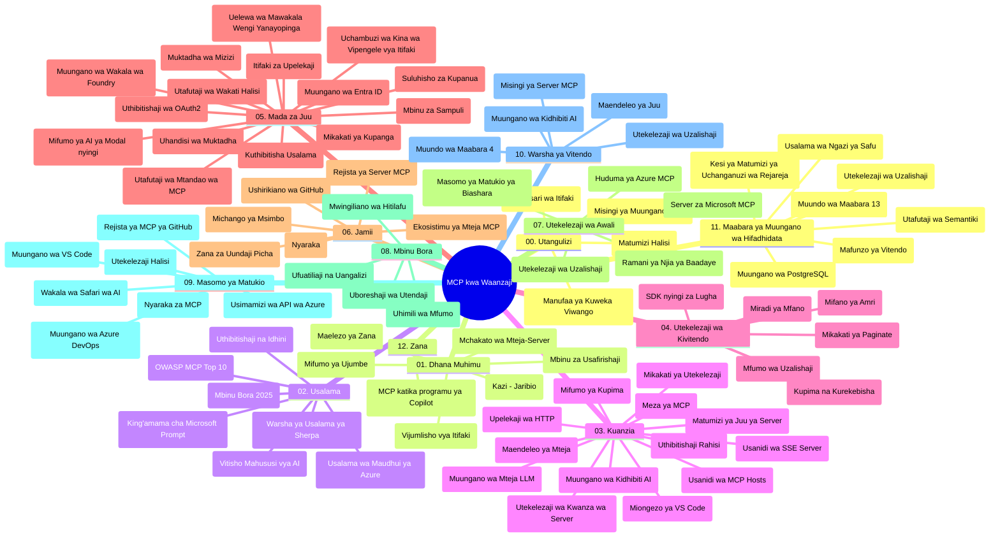

# Itifaki ya Muktadha wa Mfano (MCP) kwa Waanziaji - Mwongozo wa Kujifunza

Mwongozo huu wa kujifunza unatoa muhtasari wa muundo wa hifadhidata na maudhui ya mtaala wa "Itofauti ya Muktadha wa Mfano (MCP) kwa Waanziaji". Tumia mwongozo huu kuvinjari hifadhidata kwa ufanisi na kufaidika zaidi na rasilimali zilizopo.

## Muhtasari wa Hifadhidata

Itofauti ya Muktadha wa Mfano (MCP) ni mfumo uliowekwa viwango kwa maingiliano kati ya mifano ya AI na programu za wateja. Ilizinduliwa na Anthropic, MCP sasa inaendeshwa na jumuiya kubwa ya MCP kupitia shirika rasmi la GitHub. Hifadhidata hii inatoa mtaala kamili na mifano ya vitendo ya msimbo katika C#, Java, JavaScript, Python, na TypeScript, iliyoundwa kwa watengenezaji wa AI, waanzilishi wa mifumo, na wahandisi wa programu.

## Ramani ya Mtaala wa Kuona

## Muundo wa Hifadhidata

Hifadhidata imepangwa katika sehemu kumi na mbili kuu, kila moja ikilenga sehemu tofauti za MCP:

1. **Utangulizi (00-Introduction/)**
   - Muhtasari wa Itofauti ya Muktadha wa Mfano
   - Kwa nini kuweka viwango ni muhimu katika njia za AI
   - Matumizi halisi na faida

2. **Madhumuni Muhimu (01-CoreConcepts/)**
   - Miundombinu ya mteja-mtumiaji
   - Sehemu kuu za itifaki
   - Mifumo ya ujumbe katika MCP

3. **Usalama (02-Security/)**
   - Vitisho vya usalama katika mifumo inayotumia MCP
   - Mbinu bora za kuhakikisha usalama wa utekelezaji
   - Mikakati ya uthibitishaji na idhini
   - **Nyaraka Kamili za Usalama**:
     - Mazoea Bora ya Usalama wa MCP 2025
     - Mwongozo wa Utekelezaji wa Usalama wa Maudhui ya Azure
     - Udhibiti na Mbinu za Usalama za MCP
     - Marejeleo ya Haraka ya Mazoea Bora ya MCP
   - **Mada Muhimu za Usalama**:
     - Mizinga ya kuingiza maelekezo na sumu ya zana
     - Mkoloko wa kikao na matatizo ya mdai mchanganyiko
     - Urahisi wa kupitisha tokeni
     - Ruhusa kupita kiasi na udhibiti wa ufikiaji
     - Usalama wa mnyororo wa usambazaji kwa vipengele vya AI
     - Uingiliano wa Kinga za Maelekezo za Microsoft

4. **Kuanzisha (03-GettingStarted/)**
   - Usanidi na mipangilio ya mazingira
   - Uundaji wa seva na wateja wa MCP wa msingi
   - Uingiliano na programu zilizopo
   - Inajumuisha sehemu za:
     - Utekelezaji wa seva ya kwanza
     - Uendelezaji wa mteja
     - Uingiliano wa mteja wa LLM
     - Uingiliano wa VS Code
     - Seva ya Matukio Yanayotumwa na Seva (SSE)
     - Matumizi ya seva ya hali ya juu
     - Upelekaji wa data wa HTTP
     - Uingiliano wa AI Toolkit
     - Mikakati ya majaribio
     - Miongozo ya usambazaji

5. **Utekelezaji wa Vitendo (04-PracticalImplementation/)**
   - Kutumia SDK katika lugha tofauti za programu
   - Mbinu za uchunguzi wa makosa, majaribio, na uthibitishaji
   - Kuuandaa mifano ya maelekezo inayoweza kutumika tena na mtiririko wa kazi
   - Miradi ya mfano yenye mifano ya utekelezaji

6. **Mada za Juu (05-AdvancedTopics/)**
   - Mbinu za uhandisi wa muktadha
   - Uingiliano wa wakala wa Foundry
   - Mtiririko wa AI wenye njia nyingi za mawasiliano
   - Mionyesho ya uthibitishaji wa OAuth2
   - Uwezo wa utafutaji wa wakati halisi
   - Utoaji wa data wa wakati halisi
   - Utekelezaji wa muktadha wa mizizi
   - Mikakati ya usambazaji
   - Mbinu za sampuli
   - Njia za kupanua wigo
   - Masuala ya usalama
   - Uingiliano wa usalama wa Entra ID
   - Uingiliano wa utafutaji wa wavuti
   - Ufafanuzi wa wakala wengi wenye mwelekeo wa ushindani (mifumo ya mjadala)

7. **Michango ya Jumuiya (06-CommunityContributions/)**
   - Jinsi ya kuchangia msimbo na nyaraka
   - Kushirikiana kupitia GitHub
   - Maboresho yanayochagizwa na jumuiya na maoni
   - Kutumia wateja mbalimbali wa MCP (Claude Desktop, Cline, VSCode)
   - Kazi na seva maarufu za MCP pamoja na uundaji picha

8. **Masomo Kutoka kwa Awali wa Matumizi (07-LessonsfromEarlyAdoption/)**
   - Utekelezaji halisi na hadithi za mafanikio
   - Kuunda na kusambaza suluhisho za msingi wa MCP
   - Mwelekeo na ramani ya njia ya baadaye
   - **Mwongozo wa Seva za Microsoft MCP**: Mwongozo kamili wa seva 10 za Microsoft MCP tayari kwa uzalishaji zikiwemo:
     - Microsoft Learn Docs MCP Server
     - Azure MCP Server (vinunguniko 15+ maalum)
     - GitHub MCP Server
     - Azure DevOps MCP Server
     - MarkItDown MCP Server
     - SQL Server MCP Server
     - Playwright MCP Server
     - Dev Box MCP Server
     - Microsoft Foundry MCP Server
     - Microsoft 365 Agents Toolkit MCP Server

9. **Mazoea Bora (08-BestPractices/)**
   - Kuboreshaji na ufanisi wa utendaji
   - Kubuni mifumo ya MCP inayostahimili hitilafu
   - Mikakati ya majaribio na ustahimilivu

10. **Madhumuni ya Kesi (09-CaseStudy/)**
    - **Masomo saba kamili ya kesi** yanayoonyesha utofauti wa MCP katika hali mbalimbali:
    - **Wakala wa Kusafiri wa Azure AI**: Uratibu wa wakala wengi na Azure OpenAI na AI Search
    - **Uingiliano wa Azure DevOps**: Kuendesha mchakato wa mtiririko wa kazi kwa data za YouTube
    - **Uchukuaji wa Nyaraka za Wakati Halisi**: Mteja wa konsole wa Python na utoaji wa data wa HTTP
    - **Kizalishaji cha Mpango wa Kujifunza wa Kujihusisha**: Programu ya wavuti ya Chainlit na AI ya mazungumzo
    - **Nyaraka ndani ya Mhariri**: Uingiliano wa VS Code na mtiririko wa kazi wa GitHub Copilot
    - **Usimamizi wa API wa Azure**: Uingiliano wa API ya shirika na uundaji wa seva ya MCP
    - **Sajili ya MCP ya GitHub**: Maendeleo ya mazingira na jukwaa la uingiliano wa wakala
    - Mifano ya utekelezaji inayohusisha uingiliano wa shirika, uzalishaji wa watengenezaji, na maendeleo ya mazingira

11. **Warsha ya Vitendo (10-StreamliningAIWorkflowsBuildingAnMCPServerWithAIToolkit/)**
    - Warsha ya vitendo kamili inayochanganya MCP na AI Toolkit
    - Kuunda programu hibifu zinazounganisha mifano ya AI na zana halisi za kazi
    - Moduli za vitendo zinazojumuisha misingi, maendeleo ya seva maalum, na mikakati ya usambazaji wa uzalishaji
    - **Muundo wa Maabara**:
      - Maabara 1: Misingi ya Seva ya MCP
      - Maabara 2: Maendeleo ya Seva ya MCP ya Juu
      - Maabara 3: Uingiliano wa AI Toolkit
      - Maabara 4: Usambazaji na Upanuzi wa Uzalishaji
    - Njia ya kujifunza kwa maabara ikifuatiwa hatua kwa hatua

12. **Maabara za Uingiliano wa Hifadhidata za Seva ya MCP (11-MCPServerHandsOnLabs/)**
    - **Njia ya kujifunza maabara 13 kamili** kwa uundaji wa seva za MCP tayari kwa uzalishaji zenye uingiliano wa PostgreSQL
    - **Utekelezaji halisi wa uchambuzi wa rejareja** kwa kutumia kesi ya Zava Retail
    - **Mifumo ya daraja la shirika** ikiwa ni pamoja na Usalama wa Ngazi ya Safu (RLS), utafutaji wa maana, na ufikiaji wa data kwa wakopaji wengi
    - **Muundo Kamili wa Maabara**:
      - **Maabara 00-03: Misingi** - Utangulizi, Miundombinu, Usalama, Usanidi wa Mazingira
      - **Maabara 04-06: Kuunda Seva ya MCP** - Ubunifu wa Hifadhidata, Utekelezaji wa Seva ya MCP, Uendelezaji wa Zana
      - **Maabara 07-09: Vipengele vya Juu** - Utafutaji wa Maana, Majaribio & Utafutaji Ugunduzi, Uingiliano wa VS Code
      - **Maabara 10-12: Uzalishaji na Mazoea Bora** - Usambazaji, Ufuatiliaji, Kuboresha
    - **Teknolojia Zinazoshughulikiwa**: fremu ya FastMCP, PostgreSQL, Azure OpenAI, Azure Container Apps, Application Insights
    - **Matokeo ya Kujifunza**: seva za MCP tayari kwa uzalishaji, mifumo ya uingiliano wa hifadhidata, uchambuzi unaotumia AI, usalama wa shirika

13. **Zana (12-tooling/)**
    - Jifunze jinsi ya kutumia MCP katika programu ya Copilot na zana nyingine

## Rasilimali Zingine

Hifadhidata inajumuisha rasilimali za msaada:

- **Folda ya Picha**: Inajumuisha michoro na picha zinazotumika katika mtaala mzima
- **Tafsiri**: Msaada wa lugha nyingi kwa kutumia tafsiri za otomatiki za nyaraka
- **Rasilimali Rasmi za MCP**:
  - [MCP Documentation](https://modelcontextprotocol.io/)
  - [MCP Specification](https://spec.modelcontextprotocol.io/)
  - [MCP GitHub Repository](https://github.com/modelcontextprotocol)

## Jinsi ya Kutumia Hifadhidata Hii

1. **Kujifunza kwa Mpangilio**: Fuata sura kwa mpangilio (00 hadi 11) kwa uzoefu wa kujifunza uliopangwa.
2. **Kujikita katika Lugha Mahususi**: Ikiwa una nia ya lugha fulani ya programu, chunguza folda za mifano kwa utekelezaji katika lugha unayoipendelea.
3. **Utekelezaji wa Vitendo**: Anza na sehemu ya "Kuanzisha" ili kuweka mazingira yako na kuunda seva na mteja wako wa kwanza wa MCP.
4. **Uchunguzi wa Juu**: Ukijisikii vizuri na misingi, ingia katika mada za juu kuongeza maarifa yako.
5. **Ushiriki wa Jumuiya**: Jiunge na jumuiya ya MCP kupitia mijadala ya GitHub na vituo vya Discord kuungana na wataalamu na watengenezaji wenzao.

## Wateja na Zana za MCP

Mtaala unashughulikia wateja na zana mbalimbali za MCP:

1. **Wateja Rasmi**:
   - Visual Studio Code 
   - MCP katika Visual Studio Code
   - Claude Desktop
   - Claude katika VSCode 
   - Claude API

2. **Wateja wa Jumuiya**:
   - Cline (mfumo wa terminal)
   - Cursor (mhariri wa msimbo)
   - ChatMCP
   - Windsurf

3. **Zana za Usimamizi wa MCP**:
   - MCP CLI
   - MCP Manager
   - MCP Linker
   - MCP Router

## Seva Maarufu za MCP

Hifadhidata inatambulisha seva mbalimbali za MCP, zikiwemo:

1. **Seva Rasmi za Microsoft MCP**:
   - Microsoft Learn Docs MCP Server
   - Azure MCP Server (vinunguniko 15+ maalum)
   - GitHub MCP Server
   - Azure DevOps MCP Server
   - MarkItDown MCP Server
   - SQL Server MCP Server
   - Playwright MCP Server
   - Dev Box MCP Server
   - Microsoft Foundry MCP Server
   - Microsoft 365 Agents Toolkit MCP Server

2. **Seva za Marejeleo Rasmi**:
   - Filesystem
   - Fetch
   - Memory
   - Sequential Thinking

3. **Uundaji wa Picha**:
   - Azure OpenAI DALL-E 3
   - Stable Diffusion WebUI
   - Replicate

4. **Zana za Maendeleo**:
   - Git MCP
   - Udhibiti wa Terminal
   - Msaidizi wa Msimbo

5. **Seva Maalum**:
   - Salesforce
   - Microsoft Teams
   - Jira & Confluence

## Kuchangia

Hifadhidata hii inakaribisha michango kutoka kwa jumuiya. Tazama sehemu ya Michango ya Jumuiya kwa mwongozo wa jinsi ya kuchangia kwa ufanisi kwa mazingira ya MCP.

----

*Mwongozo huu wa kujifunza ulisasishwa mara ya mwisho tarehe 5 Februari, 2026, ukionyesha Toa Maelekezo ya MCP ya hivi karibuni 2025-11-25 na kutoa muhtasari wa hifadhidata hadi tarehe hiyo. Maudhui ya hifadhidata yanaweza kusasishwa baada ya tarehe hii.*

---

<!-- CO-OP TRANSLATOR DISCLAIMER START -->
**Kionyozo**:
Hati hii imetafsiriwa kwa kutumia huduma ya tafsiri ya AI [Co-op Translator](https://github.com/Azure/co-op-translator). Ingawa tunajitahidi kupata usahihi, tafadhali fahamu kwamba tafsiri za kiotomatiki zinaweza kuwa na makosa au upungufu wa usahihi. Hati ya asili katika lugha yake halisi inapaswa kuchukuliwa kama chanzo cha mamlaka. Kwa taarifa muhimu, tafsiri ya kitaalamu inayofanywa na binadamu inapendekezwa. Hatutojibu kwa kuelewa vibaya au tafsiri potofu zinazotokea kutokana na matumizi ya tafsiri hii.
<!-- CO-OP TRANSLATOR DISCLAIMER END -->