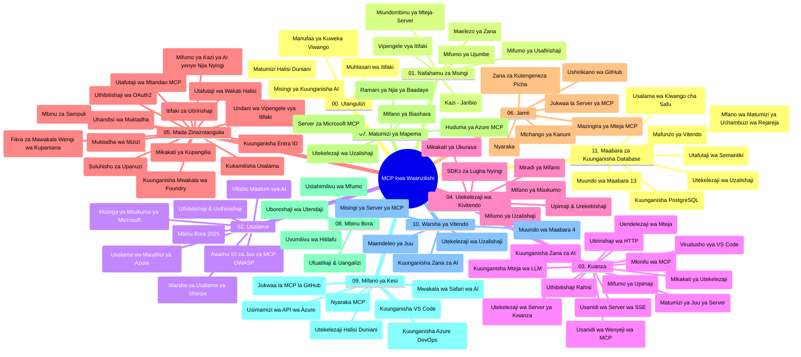

# Itifaki ya Muktadha wa Mfano (MCP) kwa Waanzilishi - Mwongozo wa Kujifunza

Mwongozo huu wa kujifunza unatoa muhtasari wa muundo wa hifadhi na maudhui ya mitaala ya "Itifaki ya Muktadha wa Mfano (MCP) kwa Waanzilishi". Tumia mwongozo huu kuvinjari hifadhi kwa ufanisi na kufaidika zaidi na rasilimali zilizopo.

## Muhtasari wa Hifadhi

Itifaki ya Muktadha wa Mfano (MCP) ni mfumo uliosawazishwa wa mwingiliano kati ya mifano ya AI na programu za mteja. Awali iliyoanzishwa na Anthropic, MCP sasa inasimamiwa na jumuiya kubwa ya MCP kupitia shirika rasmi la GitHub. Hifadhi hii inatoa mitaala kamili yenye mifano ya code ya vitendo katika C#, Java, JavaScript, Python, na TypeScript, iliyoundwa kwa waendelezaji wa AI, wasanifu wa mifumo, na wahandisi wa programu.

## Ramani ya Mitaala ya Kuona

## Muundo wa Hifadhi

Hifadhi imepangwa katika sehemu kuu kumi na moja, kila moja ikizingatia nyanja tofauti za MCP:

1. **Utangulizi (00-Introduction/)**
   - Muhtasari wa Itifaki ya Muktadha wa Mfano
   - Kwanini usawazishaji ni muhimu katika njia za AI
   - Matumizi halisi na faida zake

2. **Misingi Muhimu (01-CoreConcepts/)**
   - Usanifu wa mteja-mtumiaji
   - Vipengele vya msingi vya itifaki
   - Mifumo ya ujumbe katika MCP

3. **Usalama (02-Security/)**
   - Vitisho vya usalama katika mifumo inayotumia MCP
   - Taratibu bora za kuhakikisha usalama wa utekelezaji
   - Mikakati ya uthibitishaji na idhini
   - **Nyaraka Kamili za Usalama**:
     - Mazoea Bora ya Usalama ya MCP 2025
     - Mwongozo wa Utekelezaji wa Usalama wa Maudhui ya Azure
     - Udhibiti na Mbinu za Usalama za MCP
     - Marejeleo ya Haraka ya Mazoea Bora ya MCP
   - **Mada Muhimu za Usalama**:
     - Mashambulizi ya sindano za maagizo na sumu za zana
     - Uvujaji wa kikao na matatizo ya mhudumu mchafu
     - Uraibu wa kufikia ishara kwa njia isiyo salama
     - Ruhusa nyingi kupita kiasi na udhibiti wa ufikiaji
     - Usalama wa mnyororo wa usambazaji kwa vipengele vya AI
     - Muungano wa Microsoft Prompt Shields

4. **Kuanza (03-GettingStarted/)**
   - Usanidi wa mazingira na mipangilio
   - Kuunda seva na wateja wa MCP wa msingi
   - Uingiliano na programu zilizopo
   - Inajumuisha sehemu za:
     - Utekelezaji wa seva ya kwanza
     - Maendeleo ya mteja
     - Uingiliano wa mteja wa LLM
     - Muingiliano wa VS Code
     - Seva ya Matukio Yanayotumwa (SSE)
     - Matumizi ya seva ya hali ya juu
     - Uchezaji wa HTTP
     - Uingiliano wa AI Toolkit
     - Mikakati ya upimaji
     - Mwongozo wa utoaji

5. **Utekelezaji wa Vitendo (04-PracticalImplementation/)**
   - Matumizi ya SDK katika lugha tofauti za programu
   - Mbinu za uchunguzi wa hitilafu, upimaji, na uthibitishaji
   - Kutengeneza vigezo vya maagizo yanayoweza kutumika tena na mtiririko wa kazi
   - Miradi ya mfano yenye mifano ya utekelezaji

6. **Mada za Juu Zaidi (05-AdvancedTopics/)**
   - Mbinu za uhandisi wa muktadha
   - Uingiliano wa wakala wa foundry
   - Mtiririko wa kazi wa AI wa njia nyingi
   - Maonyesho ya uthibitishaji wa OAuth2
   - Uwezo wa utafutaji wa moja kwa moja
   - Uchezaji wa mtiririko wa moja kwa moja
   - Utekelezaji wa muktadha ya mizizi
   - Mikakati ya upitishaji
   - Mbinu za sampuli
   - Njia za upanuzi
   - Vizingiti vya usalama
   - Muingiliano wa usalama wa Entra ID
   - Uingiliano wa utafutaji wa wavuti
   - Mataniko ya hoja ya wawakilishi wengi wa kina (mifumo ya mjadala)

7. **Michango ya Jumuiya (06-CommunityContributions/)**
   - Jinsi ya kuchangia code na nyaraka
   - Ushirikiano kupitia GitHub
   - Maboresho na mrejesho unaoendeshwa na jumuiya
   - Matumizi ya wateja mbalimbali wa MCP (Claude Desktop, Cline, VSCode)
   - Kufanya kazi na seva maarufu za MCP ikiwa pamoja na uzalishaji wa picha

8. **Mafunzo Kutoka kwa Matumizi ya Mapema (07-LessonsfromEarlyAdoption/)**
   - Utekelezaji halisi na hadithi za mafanikio
   - Kujenga na kutoa suluhisho zinazotegemea MCP
   - Mwelekeo na ramani ya mustakabali
   - **Mwongozo wa Seva za Microsoft MCP**: Mwongozo kamili wa seva 10 za MCP tayari kwa uzalishaji ikijumuisha:
     - Seva ya Microsoft Learn Docs MCP
     - Seva ya Azure MCP (vinyaganishi maalum 15+)
     - Seva ya GitHub MCP
     - Seva ya Azure DevOps MCP
     - Seva ya MarkItDown MCP
     - Seva ya SQL Server MCP
     - Seva ya Playwright MCP
     - Seva ya Dev Box MCP
     - Seva ya Microsoft Foundry MCP
     - Seva ya Microsoft 365 Agents Toolkit MCP

9. **Mazoea Bora (08-BestPractices/)**
   - Usanidi na uboreshaji wa utendaji
   - Ubunifu wa mifumo ya MCP isiyotegemea hitilafu
   - Mikakati ya upimaji na uimara

10. **Masomo ya Kesi (09-CaseStudy/)**
    - **Masomo saba kamili ya kesi** yanayoonyesha ufanisi wa MCP katika hali mbalimbali:
    - **Wakala wa AI wa Kusafiri wa Azure**: Usanidi wa wawakilishi wengi kwa Azure OpenAI na AI Search
    - **Uingiliano wa Azure DevOps**: Kuendesha mchakato wa mtiririko wa kazi kwa sasisho za data ya YouTube
    - **Upataji wa Nyaraka kwa Muda Halisi**: Mteja wa koni wa Python na streaming ya HTTP
    - **Kizalishaji cha Mpango wa Kusoma wa Kueleweka**: Programu ya wavuti ya Chainlit yenye AI ya mazungumzo
    - **Nyaraka Ndani ya Mhariri**: Uingiliano wa VS Code na midirisha ya kazi ya GitHub Copilot
    - **Usimamizi wa Azure API**: Uingiliano wa API wa shirika na uundaji seva ya MCP
    - **Rejista ya GitHub MCP**: Maendeleo ya mazingira na jukwaa la uingiliano wa mawakala
    - Mifano ya utekelezaji ikijumuisha uingiliano wa shirika, uzalishaji wa mwendelezaji, na maendeleo ya mazingira

11. **Warsha ya Vitendo (10-StreamliningAIWorkflowsBuildingAnMCPServerWithAIToolkit/)**
    - Warsha kamili ya vitendo inayochanganya MCP na AI Toolkit
    - Kujenga programu za akili zinazounganisha mifano ya AI na zana za dunia halisi
    - Moduli za vitendo zinazoelezea misingi, maendeleo ya seva maalum, na mikakati ya utoaji wa uzalishaji
    - **Muundo wa Maabara**:
      - Maabara 1: Misingi ya Seva ya MCP
      - Maabara 2: Maendeleo ya Seva ya MCP ya Juu Zaidi
      - Maabara 3: Uingiliano wa AI Toolkit
      - Maabara 4: Utoaji na Upanuzi wa Uzalishaji
    - Mbinu ya kujifunza msingi wa maabara na maagizo hatua kwa hatua

12. **Maabara za Uingiliano wa Hifadhidata kwa Seva za MCP (11-MCPServerHandsOnLabs/)**
    - **Njia ya kujifunza maabara 13 kamili** kwa kujenga seva za MCP tayari kwa uzalishaji na muunganisho wa PostgreSQL
    - **Utekelezaji halisi wa uchambuzi wa rejareja** kutumia kesi ya matumizi ya Zava Retail
    - **Mifumo ya kiwango cha shirika** ikijumuisha Usalama wa Kiwango cha Safu (RLS), utafutaji wa maana, na ufikiaji wa data wa wamiliki wengi
    - **Muundo wa Maabara Kamili**:
      - **Maabara 00-03: Misingi** - Utangulizi, Usanifu, Usalama, Usanidi wa Mazingira
      - **Maabara 04-06: Ujenzi wa Seva ya MCP** - Ubunifu wa Hifadhidata, Utekelezaji wa Seva ya MCP, Maendeleo ya Zana
      - **Maabara 07-09: Sifa Zaidi** - Utafutaji wa Maana, Upimaji & Uchunguzi wa Hitilafu, Uingiliano wa VS Code
      - **Maabara 10-12: Uzalishaji & Mazoea Bora** - Utoaji, Ufuatiliaji, Uboreshaji
    - **Teknolojia Zinazoshughulikiwa**: Mfumo wa FastMCP, PostgreSQL, Azure OpenAI, Azure Container Apps, Application Insights
    - **Matokeo ya Kujifunza**: Seva za MCP tayari kwa uzalishaji, mifumo ya uingiliano wa hifadhidata, uchambuzi unaotumia AI, usalama wa shirika

## Rasilimali Zaidi

Hifadhi inajumuisha rasilimali za msaada:

- **Folda ya Picha**: Ina michoro na maelezo yanayotumika katika mitaala
- **Tafsiri**: Msaada wa lugha nyingi pamoja na tafsiri za kiotomatiki za nyaraka
- **Rasilimali Rasmi za MCP**:
  - [MCP Documentation](https://modelcontextprotocol.io/)
  - [MCP Specification](https://spec.modelcontextprotocol.io/)
  - [MCP GitHub Repository](https://github.com/modelcontextprotocol)

## Jinsi ya Kutumia Hifadhi Hii

1. **Kujifunza kwa Mfuatano**: Fuata sura kwa mfuatano (00 hadi 11) kwa uzoefu wa kujifunza uliopangwa.
2. **Kuzingatia Lugha Maalum**: Ikiwa unavutiwa na lugha maalum ya programu, chunguza folda za mifano kwa utekelezaji katika lugha unayopendelea.
3. **Utekelezaji wa Vitendo**: Anza na sehemu ya "Kuanza" kuweka mazingira yako na kuunda seva na mteja wako wa MCP wa kwanza.
4. **Uchunguzi wa Juu Zaidi**: Ukizoea misingi, chunguza mada za juu zaidi kupanua maarifa yako.
5. **Ushiriki wa Jamii**: Jiunge na jamii ya MCP kupitia mijadala ya GitHub na mipango ya Discord ili kuungana na wataalamu na waendelezaji wenzako.

## Wateja na Zana za MCP

Mitaala inashughulikia wateja na zana mbalimbali za MCP:

1. **Wateja Rasmi**:
   - Visual Studio Code 
   - MCP katika Visual Studio Code
   - Claude Desktop
   - Claude katika VSCode 
   - Claude API

2. **Wateja wa Jamii**:
   - Cline (inayotegemea terminal)
   - Cursor (mhariri wa code)
   - ChatMCP
   - Windsurf

3. **Zana za Usimamizi wa MCP**:
   - MCP CLI
   - MCP Manager
   - MCP Linker
   - MCP Router

## Seva Maarufu za MCP

Hifadhi inaonyesha seva mbalimbali za MCP, ikijumuisha:

1. **Seva Rasmi za Microsoft MCP**:
   - Seva ya Microsoft Learn Docs MCP
   - Seva ya Azure MCP (vinyaganishi maalum 15+)
   - Seva ya GitHub MCP
   - Seva ya Azure DevOps MCP
   - Seva ya MarkItDown MCP
   - Seva ya SQL Server MCP
   - Seva ya Playwright MCP
   - Seva ya Dev Box MCP
   - Seva ya Microsoft Foundry MCP
   - Seva ya Microsoft 365 Agents Toolkit MCP

2. **Seva za Marejeleo Rasmi**:
   - Fomu ya Faili
   - Fetch
   - Kumbukumbu
   - Mawazo Mfululizo

3. **Uzalishaji wa Picha**:
   - Azure OpenAI DALL-E 3
   - Stable Diffusion WebUI
   - Replicate

4. **Zana za Maendeleo**:
   - Git MCP
   - Udhibiti wa Terminal
   - Msaidizi wa Code

5. **Seva Maalum**:
   - Salesforce
   - Microsoft Teams
   - Jira & Confluence

## Kuchangia

Hifadhi hii inakaribisha michango kutoka kwa jamii. Angalia sehemu ya Michango ya Jamii kwa mwongozo wa jinsi ya kuchangia kikamilifu kwa mazingira ya MCP.

----

*Mwongozo huu wa kujifunza ulisasishwa mwisho mnamo Februari 5, 2026, ukionyesha Maelekezo Mapya ya MCP 2025-11-25 na kutoa muhtasari wa hifadhi hadi tarehe hiyo. Maudhui ya hifadhi yanaweza kusasishwa baada ya tarehe hii.*

---

<!-- CO-OP TRANSLATOR DISCLAIMER START -->
**Kionyozo**:
Hati hii imetafsiriwa kwa kutumia huduma ya tafsiri ya AI [Co-op Translator](https://github.com/Azure/co-op-translator). Ingawa tunajitahidi kupata usahihi, tafadhali fahamu kwamba tafsiri za kiotomatiki zinaweza kuwa na makosa au upungufu wa usahihi. Hati ya asili katika lugha yake halisi inapaswa kuchukuliwa kama chanzo cha mamlaka. Kwa taarifa muhimu, tafsiri ya kitaalamu inayofanywa na binadamu inapendekezwa. Hatutojibu kwa kuelewa vibaya au tafsiri potofu zinazotokea kutokana na matumizi ya tafsiri hii.
<!-- CO-OP TRANSLATOR DISCLAIMER END -->